cola Report for GDS3704
==================

**Date**: 2019-12-25 20:54:03 CET, **cola version**: 1.3.2

----------------------------------------------------------------

<style type='text/css'>

body, td, th {
   font-family: Arial,Helvetica,sans-serif;
   background-color: white;
   font-size: 13px;
  max-width: 800px;
  margin: auto;
  margin-left:210px;
  padding: 0px 10px 0px 10px;
  border-left: 1px solid #EEEEEE;
  line-height: 150%;
}

tt, code, pre {
   font-family: 'DejaVu Sans Mono', 'Droid Sans Mono', 'Lucida Console', Consolas, Monaco, 

monospace;
}

h1 {
   font-size:2.2em;
}

h2 {
   font-size:1.8em;
}

h3 {
   font-size:1.4em;
}

h4 {
   font-size:1.0em;
}

h5 {
   font-size:0.9em;
}

h6 {
   font-size:0.8em;
}

a {
  text-decoration: none;
  color: #0366d6;
}

a:hover {
  text-decoration: underline;
}

a:visited {
   color: #0366d6;
}

pre, img {
  max-width: 100%;
}
pre {
  overflow-x: auto;
}
pre code {
   display: block; padding: 0.5em;
}

code {
  font-size: 92%;
  border: 1px solid #ccc;
}

code[class] {
  background-color: #F8F8F8;
}

table, td, th {
  border: 1px solid #ccc;
}

blockquote {
   color:#666666;
   margin:0;
   padding-left: 1em;
   border-left: 0.5em #EEE solid;
}

hr {
   height: 0px;
   border-bottom: none;
   border-top-width: thin;
   border-top-style: dotted;
   border-top-color: #999999;
}

@media print {
   * {
      background: transparent !important;
      color: black !important;
      filter:none !important;
      -ms-filter: none !important;
   }

   body {
      font-size:12pt;
      max-width:100%;
   }

   a, a:visited {
      text-decoration: underline;
   }

   hr {
      visibility: hidden;
      page-break-before: always;
   }

   pre, blockquote {
      padding-right: 1em;
      page-break-inside: avoid;
   }

   tr, img {
      page-break-inside: avoid;
   }

   img {
      max-width: 100% !important;
   }

   @page :left {
      margin: 15mm 20mm 15mm 10mm;
   }

   @page :right {
      margin: 15mm 10mm 15mm 20mm;
   }

   p, h2, h3 {
      orphans: 3; widows: 3;
   }

   h2, h3 {
      page-break-after: avoid;
   }
}
</style>


## Summary


All available functions which can be applied to this `res_list` object:


```r
res_list
```

```
#> A 'ConsensusPartitionList' object with 24 methods.
#>   On a matrix with 15497 rows and 84 columns.
#>   Top rows are extracted by 'SD, CV, MAD, ATC' methods.
#>   Subgroups are detected by 'hclust, kmeans, skmeans, pam, mclust, NMF' method.
#>   Number of partitions are tried for k = 2, 3, 4, 5, 6.
#>   Performed in total 30000 partitions by row resampling.
#> 
#> Following methods can be applied to this 'ConsensusPartitionList' object:
#>  [1] "cola_report"           "collect_classes"       "collect_plots"         "collect_stats"        
#>  [5] "colnames"              "functional_enrichment" "get_anno_col"          "get_anno"             
#>  [9] "get_classes"           "get_matrix"            "get_membership"        "get_stats"            
#> [13] "is_best_k"             "is_stable_k"           "ncol"                  "nrow"                 
#> [17] "rownames"              "show"                  "suggest_best_k"        "test_to_known_factors"
#> [21] "top_rows_heatmap"      "top_rows_overlap"     
#> 
#> You can get result for a single method by, e.g. object["SD", "hclust"] or object["SD:hclust"]
#> or a subset of methods by object[c("SD", "CV")], c("hclust", "kmeans")]
```

The call of `run_all_consensus_partition_methods()` was:


```
#> run_all_consensus_partition_methods(data = mat, mc.cores = 4, anno = anno)
```

Dimension of the input matrix:


```r
mat = get_matrix(res_list)
dim(mat)
```

```
#> [1] 15497    84
```

### Density distribution

The density distribution for each sample is visualized as in one column in the
following heatmap. The clustering is based on the distance which is the
Kolmogorov-Smirnov statistic between two distributions.


```r
library(ComplexHeatmap)
densityHeatmap(mat, top_annotation = HeatmapAnnotation(df = get_anno(res_list), 
    col = get_anno_col(res_list)), ylab = "value", cluster_columns = TRUE, show_column_names = FALSE,
    mc.cores = 4)
```


### Suggest the best k


Folowing table shows the best `k` (number of partitions) for each combination
of top-value methods and partition methods. Clicking on the method name in
the table goes to the section for a single combination of methods.

[The cola vignette](http://bioconductor.org/packages/devel/bioc/vignettes/cola/inst/doc/cola.html#toc_13)
explains the definition of the metrics used for determining the best
number of partitions.


```r
suggest_best_k(res_list)
```


|                            | The best k| 1-PAC| Mean silhouette| Concordance|   |Optional k |
|:---------------------------|----------:|-----:|---------------:|-----------:|:--|:----------|
|[ATC:kmeans](#ATC-kmeans)   |          2| 1.000|           0.950|       0.980|** |           |
|[ATC:skmeans](#ATC-skmeans) |          2| 1.000|           0.997|       0.998|** |           |
|[ATC:mclust](#ATC-mclust)   |          4| 0.934|           0.934|       0.967|*  |2          |
|[CV:kmeans](#CV-kmeans)     |          2| 0.927|           0.939|       0.965|*  |           |
|[ATC:pam](#ATC-pam)         |          5| 0.927|           0.851|       0.940|*  |2          |
|[CV:skmeans](#CV-skmeans)   |          2| 0.926|           0.945|       0.977|*  |           |
|[ATC:NMF](#ATC-NMF)         |          3| 0.920|           0.911|       0.949|*  |2          |
|[ATC:hclust](#ATC-hclust)   |          2| 0.904|           0.944|       0.970|*  |           |
|[SD:skmeans](#SD-skmeans)   |          2| 0.903|           0.916|       0.963|*  |           |
|[MAD:mclust](#MAD-mclust)   |          4| 0.895|           0.902|       0.947|   |           |
|[MAD:skmeans](#MAD-skmeans) |          2| 0.862|           0.956|       0.978|   |           |
|[SD:mclust](#SD-mclust)     |          4| 0.852|           0.885|       0.922|   |           |
|[MAD:kmeans](#MAD-kmeans)   |          2| 0.798|           0.931|       0.964|   |           |
|[MAD:NMF](#MAD-NMF)         |          2| 0.786|           0.853|       0.943|   |           |
|[CV:mclust](#CV-mclust)     |          5| 0.770|           0.881|       0.886|   |           |
|[CV:NMF](#CV-NMF)           |          2| 0.745|           0.814|       0.927|   |           |
|[SD:kmeans](#SD-kmeans)     |          2| 0.736|           0.889|       0.945|   |           |
|[SD:NMF](#SD-NMF)           |          2| 0.702|           0.835|       0.933|   |           |
|[CV:pam](#CV-pam)           |          5| 0.668|           0.661|       0.825|   |           |
|[MAD:pam](#MAD-pam)         |          2| 0.560|           0.823|       0.916|   |           |
|[SD:hclust](#SD-hclust)     |          3| 0.506|           0.783|       0.856|   |           |
|[MAD:hclust](#MAD-hclust)   |          3| 0.435|           0.721|       0.830|   |           |
|[SD:pam](#SD-pam)           |          2| 0.401|           0.772|       0.890|   |           |
|[CV:hclust](#CV-hclust)     |          2| 0.378|           0.622|       0.820|   |           |

\*\*: 1-PAC > 0.95, \*: 1-PAC > 0.9


### CDF of consensus matrices

Cumulative distribution function curves of consensus matrix for all methods.


```r
collect_plots(res_list, fun = plot_ecdf)
```


### Consensus heatmap

Consensus heatmaps for all methods. ([What is a consensus heatmap?](http://bioconductor.org/packages/devel/bioc/vignettes/cola/inst/doc/cola.html#toc_9))


<style type='text/css'>


.ui-helper-hidden {
	display: none;
}
.ui-helper-hidden-accessible {
	border: 0;
	clip: rect(0 0 0 0);
	height: 1px;
	margin: -1px;
	overflow: hidden;
	padding: 0;
	position: absolute;
	width: 1px;
}
.ui-helper-reset {
	margin: 0;
	padding: 0;
	border: 0;
	outline: 0;
	line-height: 1.3;
	text-decoration: none;
	font-size: 100%;
	list-style: none;
}
.ui-helper-clearfix:before,
.ui-helper-clearfix:after {
	content: "";
	display: table;
	border-collapse: collapse;
}
.ui-helper-clearfix:after {
	clear: both;
}
.ui-helper-zfix {
	width: 100%;
	height: 100%;
	top: 0;
	left: 0;
	position: absolute;
	opacity: 0;
	filter:Alpha(Opacity=0); 
}

.ui-front {
	z-index: 100;
}


.ui-state-disabled {
	cursor: default !important;
	pointer-events: none;
}


.ui-icon {
	display: inline-block;
	vertical-align: middle;
	margin-top: -.25em;
	position: relative;
	text-indent: -99999px;
	overflow: hidden;
	background-repeat: no-repeat;
}

.ui-widget-icon-block {
	left: 50%;
	margin-left: -8px;
	display: block;
}


.ui-widget-overlay {
	position: fixed;
	top: 0;
	left: 0;
	width: 100%;
	height: 100%;
}
.ui-accordion .ui-accordion-header {
	display: block;
	cursor: pointer;
	position: relative;
	margin: 2px 0 0 0;
	padding: .5em .5em .5em .7em;
	font-size: 100%;
}
.ui-accordion .ui-accordion-content {
	padding: 1em 2.2em;
	border-top: 0;
	overflow: auto;
}
.ui-autocomplete {
	position: absolute;
	top: 0;
	left: 0;
	cursor: default;
}
.ui-menu {
	list-style: none;
	padding: 0;
	margin: 0;
	display: block;
	outline: 0;
}
.ui-menu .ui-menu {
	position: absolute;
}
.ui-menu .ui-menu-item {
	margin: 0;
	cursor: pointer;
	
	list-style-image: url("data:image/gif;base64,R0lGODlhAQABAIAAAAAAAP///yH5BAEAAAAALAAAAAABAAEAAAIBRAA7");
}
.ui-menu .ui-menu-item-wrapper {
	position: relative;
	padding: 3px 1em 3px .4em;
}
.ui-menu .ui-menu-divider {
	margin: 5px 0;
	height: 0;
	font-size: 0;
	line-height: 0;
	border-width: 1px 0 0 0;
}
.ui-menu .ui-state-focus,
.ui-menu .ui-state-active {
	margin: -1px;
}


.ui-menu-icons {
	position: relative;
}
.ui-menu-icons .ui-menu-item-wrapper {
	padding-left: 2em;
}


.ui-menu .ui-icon {
	position: absolute;
	top: 0;
	bottom: 0;
	left: .2em;
	margin: auto 0;
}


.ui-menu .ui-menu-icon {
	left: auto;
	right: 0;
}
.ui-button {
	padding: .4em 1em;
	display: inline-block;
	position: relative;
	line-height: normal;
	margin-right: .1em;
	cursor: pointer;
	vertical-align: middle;
	text-align: center;
	-webkit-user-select: none;
	-moz-user-select: none;
	-ms-user-select: none;
	user-select: none;

	
	overflow: visible;
}

.ui-button,
.ui-button:link,
.ui-button:visited,
.ui-button:hover,
.ui-button:active {
	text-decoration: none;
}


.ui-button-icon-only {
	width: 2em;
	box-sizing: border-box;
	text-indent: -9999px;
	white-space: nowrap;
}


input.ui-button.ui-button-icon-only {
	text-indent: 0;
}


.ui-button-icon-only .ui-icon {
	position: absolute;
	top: 50%;
	left: 50%;
	margin-top: -8px;
	margin-left: -8px;
}

.ui-button.ui-icon-notext .ui-icon {
	padding: 0;
	width: 2.1em;
	height: 2.1em;
	text-indent: -9999px;
	white-space: nowrap;

}

input.ui-button.ui-icon-notext .ui-icon {
	width: auto;
	height: auto;
	text-indent: 0;
	white-space: normal;
	padding: .4em 1em;
}


input.ui-button::-moz-focus-inner,
button.ui-button::-moz-focus-inner {
	border: 0;
	padding: 0;
}
.ui-controlgroup {
	vertical-align: middle;
	display: inline-block;
}
.ui-controlgroup > .ui-controlgroup-item {
	float: left;
	margin-left: 0;
	margin-right: 0;
}
.ui-controlgroup > .ui-controlgroup-item:focus,
.ui-controlgroup > .ui-controlgroup-item.ui-visual-focus {
	z-index: 9999;
}
.ui-controlgroup-vertical > .ui-controlgroup-item {
	display: block;
	float: none;
	width: 100%;
	margin-top: 0;
	margin-bottom: 0;
	text-align: left;
}
.ui-controlgroup-vertical .ui-controlgroup-item {
	box-sizing: border-box;
}
.ui-controlgroup .ui-controlgroup-label {
	padding: .4em 1em;
}
.ui-controlgroup .ui-controlgroup-label span {
	font-size: 80%;
}
.ui-controlgroup-horizontal .ui-controlgroup-label + .ui-controlgroup-item {
	border-left: none;
}
.ui-controlgroup-vertical .ui-controlgroup-label + .ui-controlgroup-item {
	border-top: none;
}
.ui-controlgroup-horizontal .ui-controlgroup-label.ui-widget-content {
	border-right: none;
}
.ui-controlgroup-vertical .ui-controlgroup-label.ui-widget-content {
	border-bottom: none;
}


.ui-controlgroup-vertical .ui-spinner-input {

	
	width: 75%;
	width: calc( 100% - 2.4em );
}
.ui-controlgroup-vertical .ui-spinner .ui-spinner-up {
	border-top-style: solid;
}

.ui-checkboxradio-label .ui-icon-background {
	box-shadow: inset 1px 1px 1px #ccc;
	border-radius: .12em;
	border: none;
}
.ui-checkboxradio-radio-label .ui-icon-background {
	width: 16px;
	height: 16px;
	border-radius: 1em;
	overflow: visible;
	border: none;
}
.ui-checkboxradio-radio-label.ui-checkboxradio-checked .ui-icon,
.ui-checkboxradio-radio-label.ui-checkboxradio-checked:hover .ui-icon {
	background-image: none;
	width: 8px;
	height: 8px;
	border-width: 4px;
	border-style: solid;
}
.ui-checkboxradio-disabled {
	pointer-events: none;
}
.ui-datepicker {
	width: 17em;
	padding: .2em .2em 0;
	display: none;
}
.ui-datepicker .ui-datepicker-header {
	position: relative;
	padding: .2em 0;
}
.ui-datepicker .ui-datepicker-prev,
.ui-datepicker .ui-datepicker-next {
	position: absolute;
	top: 2px;
	width: 1.8em;
	height: 1.8em;
}
.ui-datepicker .ui-datepicker-prev-hover,
.ui-datepicker .ui-datepicker-next-hover {
	top: 1px;
}
.ui-datepicker .ui-datepicker-prev {
	left: 2px;
}
.ui-datepicker .ui-datepicker-next {
	right: 2px;
}
.ui-datepicker .ui-datepicker-prev-hover {
	left: 1px;
}
.ui-datepicker .ui-datepicker-next-hover {
	right: 1px;
}
.ui-datepicker .ui-datepicker-prev span,
.ui-datepicker .ui-datepicker-next span {
	display: block;
	position: absolute;
	left: 50%;
	margin-left: -8px;
	top: 50%;
	margin-top: -8px;
}
.ui-datepicker .ui-datepicker-title {
	margin: 0 2.3em;
	line-height: 1.8em;
	text-align: center;
}
.ui-datepicker .ui-datepicker-title select {
	font-size: 1em;
	margin: 1px 0;
}
.ui-datepicker select.ui-datepicker-month,
.ui-datepicker select.ui-datepicker-year {
	width: 45%;
}
.ui-datepicker table {
	width: 100%;
	font-size: .9em;
	border-collapse: collapse;
	margin: 0 0 .4em;
}
.ui-datepicker th {
	padding: .7em .3em;
	text-align: center;
	font-weight: bold;
	border: 0;
}
.ui-datepicker td {
	border: 0;
	padding: 1px;
}
.ui-datepicker td span,
.ui-datepicker td a {
	display: block;
	padding: .2em;
	text-align: right;
	text-decoration: none;
}
.ui-datepicker .ui-datepicker-buttonpane {
	background-image: none;
	margin: .7em 0 0 0;
	padding: 0 .2em;
	border-left: 0;
	border-right: 0;
	border-bottom: 0;
}
.ui-datepicker .ui-datepicker-buttonpane button {
	float: right;
	margin: .5em .2em .4em;
	cursor: pointer;
	padding: .2em .6em .3em .6em;
	width: auto;
	overflow: visible;
}
.ui-datepicker .ui-datepicker-buttonpane button.ui-datepicker-current {
	float: left;
}


.ui-datepicker.ui-datepicker-multi {
	width: auto;
}
.ui-datepicker-multi .ui-datepicker-group {
	float: left;
}
.ui-datepicker-multi .ui-datepicker-group table {
	width: 95%;
	margin: 0 auto .4em;
}
.ui-datepicker-multi-2 .ui-datepicker-group {
	width: 50%;
}
.ui-datepicker-multi-3 .ui-datepicker-group {
	width: 33.3%;
}
.ui-datepicker-multi-4 .ui-datepicker-group {
	width: 25%;
}
.ui-datepicker-multi .ui-datepicker-group-last .ui-datepicker-header,
.ui-datepicker-multi .ui-datepicker-group-middle .ui-datepicker-header {
	border-left-width: 0;
}
.ui-datepicker-multi .ui-datepicker-buttonpane {
	clear: left;
}
.ui-datepicker-row-break {
	clear: both;
	width: 100%;
	font-size: 0;
}


.ui-datepicker-rtl {
	direction: rtl;
}
.ui-datepicker-rtl .ui-datepicker-prev {
	right: 2px;
	left: auto;
}
.ui-datepicker-rtl .ui-datepicker-next {
	left: 2px;
	right: auto;
}
.ui-datepicker-rtl .ui-datepicker-prev:hover {
	right: 1px;
	left: auto;
}
.ui-datepicker-rtl .ui-datepicker-next:hover {
	left: 1px;
	right: auto;
}
.ui-datepicker-rtl .ui-datepicker-buttonpane {
	clear: right;
}
.ui-datepicker-rtl .ui-datepicker-buttonpane button {
	float: left;
}
.ui-datepicker-rtl .ui-datepicker-buttonpane button.ui-datepicker-current,
.ui-datepicker-rtl .ui-datepicker-group {
	float: right;
}
.ui-datepicker-rtl .ui-datepicker-group-last .ui-datepicker-header,
.ui-datepicker-rtl .ui-datepicker-group-middle .ui-datepicker-header {
	border-right-width: 0;
	border-left-width: 1px;
}


.ui-datepicker .ui-icon {
	display: block;
	text-indent: -99999px;
	overflow: hidden;
	background-repeat: no-repeat;
	left: .5em;
	top: .3em;
}
.ui-dialog {
	position: absolute;
	top: 0;
	left: 0;
	padding: .2em;
	outline: 0;
}
.ui-dialog .ui-dialog-titlebar {
	padding: .4em 1em;
	position: relative;
}
.ui-dialog .ui-dialog-title {
	float: left;
	margin: .1em 0;
	white-space: nowrap;
	width: 90%;
	overflow: hidden;
	text-overflow: ellipsis;
}
.ui-dialog .ui-dialog-titlebar-close {
	position: absolute;
	right: .3em;
	top: 50%;
	width: 20px;
	margin: -10px 0 0 0;
	padding: 1px;
	height: 20px;
}
.ui-dialog .ui-dialog-content {
	position: relative;
	border: 0;
	padding: .5em 1em;
	background: none;
	overflow: auto;
}
.ui-dialog .ui-dialog-buttonpane {
	text-align: left;
	border-width: 1px 0 0 0;
	background-image: none;
	margin-top: .5em;
	padding: .3em 1em .5em .4em;
}
.ui-dialog .ui-dialog-buttonpane .ui-dialog-buttonset {
	float: right;
}
.ui-dialog .ui-dialog-buttonpane button {
	margin: .5em .4em .5em 0;
	cursor: pointer;
}
.ui-dialog .ui-resizable-n {
	height: 2px;
	top: 0;
}
.ui-dialog .ui-resizable-e {
	width: 2px;
	right: 0;
}
.ui-dialog .ui-resizable-s {
	height: 2px;
	bottom: 0;
}
.ui-dialog .ui-resizable-w {
	width: 2px;
	left: 0;
}
.ui-dialog .ui-resizable-se,
.ui-dialog .ui-resizable-sw,
.ui-dialog .ui-resizable-ne,
.ui-dialog .ui-resizable-nw {
	width: 7px;
	height: 7px;
}
.ui-dialog .ui-resizable-se {
	right: 0;
	bottom: 0;
}
.ui-dialog .ui-resizable-sw {
	left: 0;
	bottom: 0;
}
.ui-dialog .ui-resizable-ne {
	right: 0;
	top: 0;
}
.ui-dialog .ui-resizable-nw {
	left: 0;
	top: 0;
}
.ui-draggable .ui-dialog-titlebar {
	cursor: move;
}
.ui-draggable-handle {
	-ms-touch-action: none;
	touch-action: none;
}
.ui-resizable {
	position: relative;
}
.ui-resizable-handle {
	position: absolute;
	font-size: 0.1px;
	display: block;
	-ms-touch-action: none;
	touch-action: none;
}
.ui-resizable-disabled .ui-resizable-handle,
.ui-resizable-autohide .ui-resizable-handle {
	display: none;
}
.ui-resizable-n {
	cursor: n-resize;
	height: 7px;
	width: 100%;
	top: -5px;
	left: 0;
}
.ui-resizable-s {
	cursor: s-resize;
	height: 7px;
	width: 100%;
	bottom: -5px;
	left: 0;
}
.ui-resizable-e {
	cursor: e-resize;
	width: 7px;
	right: -5px;
	top: 0;
	height: 100%;
}
.ui-resizable-w {
	cursor: w-resize;
	width: 7px;
	left: -5px;
	top: 0;
	height: 100%;
}
.ui-resizable-se {
	cursor: se-resize;
	width: 12px;
	height: 12px;
	right: 1px;
	bottom: 1px;
}
.ui-resizable-sw {
	cursor: sw-resize;
	width: 9px;
	height: 9px;
	left: -5px;
	bottom: -5px;
}
.ui-resizable-nw {
	cursor: nw-resize;
	width: 9px;
	height: 9px;
	left: -5px;
	top: -5px;
}
.ui-resizable-ne {
	cursor: ne-resize;
	width: 9px;
	height: 9px;
	right: -5px;
	top: -5px;
}
.ui-progressbar {
	height: 2em;
	text-align: left;
	overflow: hidden;
}
.ui-progressbar .ui-progressbar-value {
	margin: -1px;
	height: 100%;
}
.ui-progressbar .ui-progressbar-overlay {
	background: url("data:image/gif;base64,R0lGODlhKAAoAIABAAAAAP///yH/C05FVFNDQVBFMi4wAwEAAAAh+QQJAQABACwAAAAAKAAoAAACkYwNqXrdC52DS06a7MFZI+4FHBCKoDeWKXqymPqGqxvJrXZbMx7Ttc+w9XgU2FB3lOyQRWET2IFGiU9m1frDVpxZZc6bfHwv4c1YXP6k1Vdy292Fb6UkuvFtXpvWSzA+HycXJHUXiGYIiMg2R6W459gnWGfHNdjIqDWVqemH2ekpObkpOlppWUqZiqr6edqqWQAAIfkECQEAAQAsAAAAACgAKAAAApSMgZnGfaqcg1E2uuzDmmHUBR8Qil95hiPKqWn3aqtLsS18y7G1SzNeowWBENtQd+T1JktP05nzPTdJZlR6vUxNWWjV+vUWhWNkWFwxl9VpZRedYcflIOLafaa28XdsH/ynlcc1uPVDZxQIR0K25+cICCmoqCe5mGhZOfeYSUh5yJcJyrkZWWpaR8doJ2o4NYq62lAAACH5BAkBAAEALAAAAAAoACgAAAKVDI4Yy22ZnINRNqosw0Bv7i1gyHUkFj7oSaWlu3ovC8GxNso5fluz3qLVhBVeT/Lz7ZTHyxL5dDalQWPVOsQWtRnuwXaFTj9jVVh8pma9JjZ4zYSj5ZOyma7uuolffh+IR5aW97cHuBUXKGKXlKjn+DiHWMcYJah4N0lYCMlJOXipGRr5qdgoSTrqWSq6WFl2ypoaUAAAIfkECQEAAQAsAAAAACgAKAAAApaEb6HLgd/iO7FNWtcFWe+ufODGjRfoiJ2akShbueb0wtI50zm02pbvwfWEMWBQ1zKGlLIhskiEPm9R6vRXxV4ZzWT2yHOGpWMyorblKlNp8HmHEb/lCXjcW7bmtXP8Xt229OVWR1fod2eWqNfHuMjXCPkIGNileOiImVmCOEmoSfn3yXlJWmoHGhqp6ilYuWYpmTqKUgAAIfkECQEAAQAsAAAAACgAKAAAApiEH6kb58biQ3FNWtMFWW3eNVcojuFGfqnZqSebuS06w5V80/X02pKe8zFwP6EFWOT1lDFk8rGERh1TTNOocQ61Hm4Xm2VexUHpzjymViHrFbiELsefVrn6XKfnt2Q9G/+Xdie499XHd2g4h7ioOGhXGJboGAnXSBnoBwKYyfioubZJ2Hn0RuRZaflZOil56Zp6iioKSXpUAAAh+QQJAQABACwAAAAAKAAoAAACkoQRqRvnxuI7kU1a1UU5bd5tnSeOZXhmn5lWK3qNTWvRdQxP8qvaC+/yaYQzXO7BMvaUEmJRd3TsiMAgswmNYrSgZdYrTX6tSHGZO73ezuAw2uxuQ+BbeZfMxsexY35+/Qe4J1inV0g4x3WHuMhIl2jXOKT2Q+VU5fgoSUI52VfZyfkJGkha6jmY+aaYdirq+lQAACH5BAkBAAEALAAAAAAoACgAAAKWBIKpYe0L3YNKToqswUlvznigd4wiR4KhZrKt9Upqip61i9E3vMvxRdHlbEFiEXfk9YARYxOZZD6VQ2pUunBmtRXo1Lf8hMVVcNl8JafV38aM2/Fu5V16Bn63r6xt97j09+MXSFi4BniGFae3hzbH9+hYBzkpuUh5aZmHuanZOZgIuvbGiNeomCnaxxap2upaCZsq+1kAACH5BAkBAAEALAAAAAAoACgAAAKXjI8By5zf4kOxTVrXNVlv1X0d8IGZGKLnNpYtm8Lr9cqVeuOSvfOW79D9aDHizNhDJidFZhNydEahOaDH6nomtJjp1tutKoNWkvA6JqfRVLHU/QUfau9l2x7G54d1fl995xcIGAdXqMfBNadoYrhH+Mg2KBlpVpbluCiXmMnZ2Sh4GBqJ+ckIOqqJ6LmKSllZmsoq6wpQAAAh+QQJAQABACwAAAAAKAAoAAAClYx/oLvoxuJDkU1a1YUZbJ59nSd2ZXhWqbRa2/gF8Gu2DY3iqs7yrq+xBYEkYvFSM8aSSObE+ZgRl1BHFZNr7pRCavZ5BW2142hY3AN/zWtsmf12p9XxxFl2lpLn1rseztfXZjdIWIf2s5dItwjYKBgo9yg5pHgzJXTEeGlZuenpyPmpGQoKOWkYmSpaSnqKileI2FAAACH5BAkBAAEALAAAAAAoACgAAAKVjB+gu+jG4kORTVrVhRlsnn2dJ3ZleFaptFrb+CXmO9OozeL5VfP99HvAWhpiUdcwkpBH3825AwYdU8xTqlLGhtCosArKMpvfa1mMRae9VvWZfeB2XfPkeLmm18lUcBj+p5dnN8jXZ3YIGEhYuOUn45aoCDkp16hl5IjYJvjWKcnoGQpqyPlpOhr3aElaqrq56Bq7VAAAOw==");
	height: 100%;
	filter: alpha(opacity=25); 
	opacity: 0.25;
}
.ui-progressbar-indeterminate .ui-progressbar-value {
	background-image: none;
}
.ui-selectable {
	-ms-touch-action: none;
	touch-action: none;
}
.ui-selectable-helper {
	position: absolute;
	z-index: 100;
	border: 1px dotted black;
}
.ui-selectmenu-menu {
	padding: 0;
	margin: 0;
	position: absolute;
	top: 0;
	left: 0;
	display: none;
}
.ui-selectmenu-menu .ui-menu {
	overflow: auto;
	overflow-x: hidden;
	padding-bottom: 1px;
}
.ui-selectmenu-menu .ui-menu .ui-selectmenu-optgroup {
	font-size: 1em;
	font-weight: bold;
	line-height: 1.5;
	padding: 2px 0.4em;
	margin: 0.5em 0 0 0;
	height: auto;
	border: 0;
}
.ui-selectmenu-open {
	display: block;
}
.ui-selectmenu-text {
	display: block;
	margin-right: 20px;
	overflow: hidden;
	text-overflow: ellipsis;
}
.ui-selectmenu-button.ui-button {
	text-align: left;
	white-space: nowrap;
	width: 14em;
}
.ui-selectmenu-icon.ui-icon {
	float: right;
	margin-top: 0;
}
.ui-slider {
	position: relative;
	text-align: left;
}
.ui-slider .ui-slider-handle {
	position: absolute;
	z-index: 2;
	width: 1.2em;
	height: 1.2em;
	cursor: default;
	-ms-touch-action: none;
	touch-action: none;
}
.ui-slider .ui-slider-range {
	position: absolute;
	z-index: 1;
	font-size: .7em;
	display: block;
	border: 0;
	background-position: 0 0;
}


.ui-slider.ui-state-disabled .ui-slider-handle,
.ui-slider.ui-state-disabled .ui-slider-range {
	filter: inherit;
}

.ui-slider-horizontal {
	height: .8em;
}
.ui-slider-horizontal .ui-slider-handle {
	top: -.3em;
	margin-left: -.6em;
}
.ui-slider-horizontal .ui-slider-range {
	top: 0;
	height: 100%;
}
.ui-slider-horizontal .ui-slider-range-min {
	left: 0;
}
.ui-slider-horizontal .ui-slider-range-max {
	right: 0;
}

.ui-slider-vertical {
	width: .8em;
	height: 100px;
}
.ui-slider-vertical .ui-slider-handle {
	left: -.3em;
	margin-left: 0;
	margin-bottom: -.6em;
}
.ui-slider-vertical .ui-slider-range {
	left: 0;
	width: 100%;
}
.ui-slider-vertical .ui-slider-range-min {
	bottom: 0;
}
.ui-slider-vertical .ui-slider-range-max {
	top: 0;
}
.ui-sortable-handle {
	-ms-touch-action: none;
	touch-action: none;
}
.ui-spinner {
	position: relative;
	display: inline-block;
	overflow: hidden;
	padding: 0;
	vertical-align: middle;
}
.ui-spinner-input {
	border: none;
	background: none;
	color: inherit;
	padding: .222em 0;
	margin: .2em 0;
	vertical-align: middle;
	margin-left: .4em;
	margin-right: 2em;
}
.ui-spinner-button {
	width: 1.6em;
	height: 50%;
	font-size: .5em;
	padding: 0;
	margin: 0;
	text-align: center;
	position: absolute;
	cursor: default;
	display: block;
	overflow: hidden;
	right: 0;
}

.ui-spinner a.ui-spinner-button {
	border-top-style: none;
	border-bottom-style: none;
	border-right-style: none;
}
.ui-spinner-up {
	top: 0;
}
.ui-spinner-down {
	bottom: 0;
}
.ui-tabs {
	position: relative;
	padding: .2em;
}
.ui-tabs .ui-tabs-nav {
	margin: 0;
	padding: .2em .2em 0;
}
.ui-tabs .ui-tabs-nav li {
	list-style: none;
	float: left;
	position: relative;
	top: 0;
	margin: 1px .2em 0 0;
	border-bottom-width: 0;
	padding: 0;
	white-space: nowrap;
}
.ui-tabs .ui-tabs-nav .ui-tabs-anchor {
	float: left;
	padding: .5em 1em;
	text-decoration: none;
}
.ui-tabs .ui-tabs-nav li.ui-tabs-active {
	margin-bottom: -1px;
	padding-bottom: 1px;
}
.ui-tabs .ui-tabs-nav li.ui-tabs-active .ui-tabs-anchor,
.ui-tabs .ui-tabs-nav li.ui-state-disabled .ui-tabs-anchor,
.ui-tabs .ui-tabs-nav li.ui-tabs-loading .ui-tabs-anchor {
	cursor: text;
}
.ui-tabs-collapsible .ui-tabs-nav li.ui-tabs-active .ui-tabs-anchor {
	cursor: pointer;
}
.ui-tabs .ui-tabs-panel {
	display: block;
	border-width: 0;
	padding: 1em 1.4em;
	background: none;
}
.ui-tooltip {
	padding: 8px;
	position: absolute;
	z-index: 9999;
	max-width: 300px;
}
body .ui-tooltip {
	border-width: 2px;
}

.ui-widget {
	font-family: Arial,Helvetica,sans-serif;
	font-size: 1em;
}
.ui-widget .ui-widget {
	font-size: 1em;
}
.ui-widget input,
.ui-widget select,
.ui-widget textarea,
.ui-widget button {
	font-family: Arial,Helvetica,sans-serif;
	font-size: 1em;
}
.ui-widget.ui-widget-content {
	border: 1px solid #c5c5c5;
}
.ui-widget-content {
	border: 1px solid #dddddd;
	background: #ffffff;
	color: #333333;
}
.ui-widget-content a {
	color: #333333;
}
.ui-widget-header {
	border: 1px solid #dddddd;
	background: #e9e9e9;
	color: #333333;
	font-weight: bold;
}
.ui-widget-header a {
	color: #333333;
}


.ui-state-default,
.ui-widget-content .ui-state-default,
.ui-widget-header .ui-state-default,
.ui-button,


html .ui-button.ui-state-disabled:hover,
html .ui-button.ui-state-disabled:active {
	border: 1px solid #c5c5c5;
	background: #f6f6f6;
	font-weight: normal;
	color: #454545;
}
.ui-state-default a,
.ui-state-default a:link,
.ui-state-default a:visited,
a.ui-button,
a:link.ui-button,
a:visited.ui-button,
.ui-button {
	color: #454545;
	text-decoration: none;
}
.ui-state-hover,
.ui-widget-content .ui-state-hover,
.ui-widget-header .ui-state-hover,
.ui-state-focus,
.ui-widget-content .ui-state-focus,
.ui-widget-header .ui-state-focus,
.ui-button:hover,
.ui-button:focus {
	border: 1px solid #cccccc;
	background: #ededed;
	font-weight: normal;
	color: #2b2b2b;
}
.ui-state-hover a,
.ui-state-hover a:hover,
.ui-state-hover a:link,
.ui-state-hover a:visited,
.ui-state-focus a,
.ui-state-focus a:hover,
.ui-state-focus a:link,
.ui-state-focus a:visited,
a.ui-button:hover,
a.ui-button:focus {
	color: #2b2b2b;
	text-decoration: none;
}

.ui-visual-focus {
	box-shadow: 0 0 3px 1px rgb(94, 158, 214);
}
.ui-state-active,
.ui-widget-content .ui-state-active,
.ui-widget-header .ui-state-active,
a.ui-button:active,
.ui-button:active,
.ui-button.ui-state-active:hover {
	border: 1px solid #003eff;
	background: #007fff;
	font-weight: normal;
	color: #ffffff;
}
.ui-icon-background,
.ui-state-active .ui-icon-background {
	border: #003eff;
	background-color: #ffffff;
}
.ui-state-active a,
.ui-state-active a:link,
.ui-state-active a:visited {
	color: #ffffff;
	text-decoration: none;
}


.ui-state-highlight,
.ui-widget-content .ui-state-highlight,
.ui-widget-header .ui-state-highlight {
	border: 1px solid #dad55e;
	background: #fffa90;
	color: #777620;
}
.ui-state-checked {
	border: 1px solid #dad55e;
	background: #fffa90;
}
.ui-state-highlight a,
.ui-widget-content .ui-state-highlight a,
.ui-widget-header .ui-state-highlight a {
	color: #777620;
}
.ui-state-error,
.ui-widget-content .ui-state-error,
.ui-widget-header .ui-state-error {
	border: 1px solid #f1a899;
	background: #fddfdf;
	color: #5f3f3f;
}
.ui-state-error a,
.ui-widget-content .ui-state-error a,
.ui-widget-header .ui-state-error a {
	color: #5f3f3f;
}
.ui-state-error-text,
.ui-widget-content .ui-state-error-text,
.ui-widget-header .ui-state-error-text {
	color: #5f3f3f;
}
.ui-priority-primary,
.ui-widget-content .ui-priority-primary,
.ui-widget-header .ui-priority-primary {
	font-weight: bold;
}
.ui-priority-secondary,
.ui-widget-content .ui-priority-secondary,
.ui-widget-header .ui-priority-secondary {
	opacity: .7;
	filter:Alpha(Opacity=70); 
	font-weight: normal;
}
.ui-state-disabled,
.ui-widget-content .ui-state-disabled,
.ui-widget-header .ui-state-disabled {
	opacity: .35;
	filter:Alpha(Opacity=35); 
	background-image: none;
}
.ui-state-disabled .ui-icon {
	filter:Alpha(Opacity=35); 
}


.ui-icon {
	width: 16px;
	height: 16px;
}
.ui-icon,
.ui-widget-content .ui-icon {
	background-image: url("images/ui-icons_444444_256x240.png");
}
.ui-widget-header .ui-icon {
	background-image: url("images/ui-icons_444444_256x240.png");
}
.ui-state-hover .ui-icon,
.ui-state-focus .ui-icon,
.ui-button:hover .ui-icon,
.ui-button:focus .ui-icon {
	background-image: url("images/ui-icons_555555_256x240.png");
}
.ui-state-active .ui-icon,
.ui-button:active .ui-icon {
	background-image: url("images/ui-icons_ffffff_256x240.png");
}
.ui-state-highlight .ui-icon,
.ui-button .ui-state-highlight.ui-icon {
	background-image: url("images/ui-icons_777620_256x240.png");
}
.ui-state-error .ui-icon,
.ui-state-error-text .ui-icon {
	background-image: url("images/ui-icons_cc0000_256x240.png");
}
.ui-button .ui-icon {
	background-image: url("images/ui-icons_777777_256x240.png");
}


.ui-icon-blank { background-position: 16px 16px; }
.ui-icon-caret-1-n { background-position: 0 0; }
.ui-icon-caret-1-ne { background-position: -16px 0; }
.ui-icon-caret-1-e { background-position: -32px 0; }
.ui-icon-caret-1-se { background-position: -48px 0; }
.ui-icon-caret-1-s { background-position: -65px 0; }
.ui-icon-caret-1-sw { background-position: -80px 0; }
.ui-icon-caret-1-w { background-position: -96px 0; }
.ui-icon-caret-1-nw { background-position: -112px 0; }
.ui-icon-caret-2-n-s { background-position: -128px 0; }
.ui-icon-caret-2-e-w { background-position: -144px 0; }
.ui-icon-triangle-1-n { background-position: 0 -16px; }
.ui-icon-triangle-1-ne { background-position: -16px -16px; }
.ui-icon-triangle-1-e { background-position: -32px -16px; }
.ui-icon-triangle-1-se { background-position: -48px -16px; }
.ui-icon-triangle-1-s { background-position: -65px -16px; }
.ui-icon-triangle-1-sw { background-position: -80px -16px; }
.ui-icon-triangle-1-w { background-position: -96px -16px; }
.ui-icon-triangle-1-nw { background-position: -112px -16px; }
.ui-icon-triangle-2-n-s { background-position: -128px -16px; }
.ui-icon-triangle-2-e-w { background-position: -144px -16px; }
.ui-icon-arrow-1-n { background-position: 0 -32px; }
.ui-icon-arrow-1-ne { background-position: -16px -32px; }
.ui-icon-arrow-1-e { background-position: -32px -32px; }
.ui-icon-arrow-1-se { background-position: -48px -32px; }
.ui-icon-arrow-1-s { background-position: -65px -32px; }
.ui-icon-arrow-1-sw { background-position: -80px -32px; }
.ui-icon-arrow-1-w { background-position: -96px -32px; }
.ui-icon-arrow-1-nw { background-position: -112px -32px; }
.ui-icon-arrow-2-n-s { background-position: -128px -32px; }
.ui-icon-arrow-2-ne-sw { background-position: -144px -32px; }
.ui-icon-arrow-2-e-w { background-position: -160px -32px; }
.ui-icon-arrow-2-se-nw { background-position: -176px -32px; }
.ui-icon-arrowstop-1-n { background-position: -192px -32px; }
.ui-icon-arrowstop-1-e { background-position: -208px -32px; }
.ui-icon-arrowstop-1-s { background-position: -224px -32px; }
.ui-icon-arrowstop-1-w { background-position: -240px -32px; }
.ui-icon-arrowthick-1-n { background-position: 1px -48px; }
.ui-icon-arrowthick-1-ne { background-position: -16px -48px; }
.ui-icon-arrowthick-1-e { background-position: -32px -48px; }
.ui-icon-arrowthick-1-se { background-position: -48px -48px; }
.ui-icon-arrowthick-1-s { background-position: -64px -48px; }
.ui-icon-arrowthick-1-sw { background-position: -80px -48px; }
.ui-icon-arrowthick-1-w { background-position: -96px -48px; }
.ui-icon-arrowthick-1-nw { background-position: -112px -48px; }
.ui-icon-arrowthick-2-n-s { background-position: -128px -48px; }
.ui-icon-arrowthick-2-ne-sw { background-position: -144px -48px; }
.ui-icon-arrowthick-2-e-w { background-position: -160px -48px; }
.ui-icon-arrowthick-2-se-nw { background-position: -176px -48px; }
.ui-icon-arrowthickstop-1-n { background-position: -192px -48px; }
.ui-icon-arrowthickstop-1-e { background-position: -208px -48px; }
.ui-icon-arrowthickstop-1-s { background-position: -224px -48px; }
.ui-icon-arrowthickstop-1-w { background-position: -240px -48px; }
.ui-icon-arrowreturnthick-1-w { background-position: 0 -64px; }
.ui-icon-arrowreturnthick-1-n { background-position: -16px -64px; }
.ui-icon-arrowreturnthick-1-e { background-position: -32px -64px; }
.ui-icon-arrowreturnthick-1-s { background-position: -48px -64px; }
.ui-icon-arrowreturn-1-w { background-position: -64px -64px; }
.ui-icon-arrowreturn-1-n { background-position: -80px -64px; }
.ui-icon-arrowreturn-1-e { background-position: -96px -64px; }
.ui-icon-arrowreturn-1-s { background-position: -112px -64px; }
.ui-icon-arrowrefresh-1-w { background-position: -128px -64px; }
.ui-icon-arrowrefresh-1-n { background-position: -144px -64px; }
.ui-icon-arrowrefresh-1-e { background-position: -160px -64px; }
.ui-icon-arrowrefresh-1-s { background-position: -176px -64px; }
.ui-icon-arrow-4 { background-position: 0 -80px; }
.ui-icon-arrow-4-diag { background-position: -16px -80px; }
.ui-icon-extlink { background-position: -32px -80px; }
.ui-icon-newwin { background-position: -48px -80px; }
.ui-icon-refresh { background-position: -64px -80px; }
.ui-icon-shuffle { background-position: -80px -80px; }
.ui-icon-transfer-e-w { background-position: -96px -80px; }
.ui-icon-transferthick-e-w { background-position: -112px -80px; }
.ui-icon-folder-collapsed { background-position: 0 -96px; }
.ui-icon-folder-open { background-position: -16px -96px; }
.ui-icon-document { background-position: -32px -96px; }
.ui-icon-document-b { background-position: -48px -96px; }
.ui-icon-note { background-position: -64px -96px; }
.ui-icon-mail-closed { background-position: -80px -96px; }
.ui-icon-mail-open { background-position: -96px -96px; }
.ui-icon-suitcase { background-position: -112px -96px; }
.ui-icon-comment { background-position: -128px -96px; }
.ui-icon-person { background-position: -144px -96px; }
.ui-icon-print { background-position: -160px -96px; }
.ui-icon-trash { background-position: -176px -96px; }
.ui-icon-locked { background-position: -192px -96px; }
.ui-icon-unlocked { background-position: -208px -96px; }
.ui-icon-bookmark { background-position: -224px -96px; }
.ui-icon-tag { background-position: -240px -96px; }
.ui-icon-home { background-position: 0 -112px; }
.ui-icon-flag { background-position: -16px -112px; }
.ui-icon-calendar { background-position: -32px -112px; }
.ui-icon-cart { background-position: -48px -112px; }
.ui-icon-pencil { background-position: -64px -112px; }
.ui-icon-clock { background-position: -80px -112px; }
.ui-icon-disk { background-position: -96px -112px; }
.ui-icon-calculator { background-position: -112px -112px; }
.ui-icon-zoomin { background-position: -128px -112px; }
.ui-icon-zoomout { background-position: -144px -112px; }
.ui-icon-search { background-position: -160px -112px; }
.ui-icon-wrench { background-position: -176px -112px; }
.ui-icon-gear { background-position: -192px -112px; }
.ui-icon-heart { background-position: -208px -112px; }
.ui-icon-star { background-position: -224px -112px; }
.ui-icon-link { background-position: -240px -112px; }
.ui-icon-cancel { background-position: 0 -128px; }
.ui-icon-plus { background-position: -16px -128px; }
.ui-icon-plusthick { background-position: -32px -128px; }
.ui-icon-minus { background-position: -48px -128px; }
.ui-icon-minusthick { background-position: -64px -128px; }
.ui-icon-close { background-position: -80px -128px; }
.ui-icon-closethick { background-position: -96px -128px; }
.ui-icon-key { background-position: -112px -128px; }
.ui-icon-lightbulb { background-position: -128px -128px; }
.ui-icon-scissors { background-position: -144px -128px; }
.ui-icon-clipboard { background-position: -160px -128px; }
.ui-icon-copy { background-position: -176px -128px; }
.ui-icon-contact { background-position: -192px -128px; }
.ui-icon-image { background-position: -208px -128px; }
.ui-icon-video { background-position: -224px -128px; }
.ui-icon-script { background-position: -240px -128px; }
.ui-icon-alert { background-position: 0 -144px; }
.ui-icon-info { background-position: -16px -144px; }
.ui-icon-notice { background-position: -32px -144px; }
.ui-icon-help { background-position: -48px -144px; }
.ui-icon-check { background-position: -64px -144px; }
.ui-icon-bullet { background-position: -80px -144px; }
.ui-icon-radio-on { background-position: -96px -144px; }
.ui-icon-radio-off { background-position: -112px -144px; }
.ui-icon-pin-w { background-position: -128px -144px; }
.ui-icon-pin-s { background-position: -144px -144px; }
.ui-icon-play { background-position: 0 -160px; }
.ui-icon-pause { background-position: -16px -160px; }
.ui-icon-seek-next { background-position: -32px -160px; }
.ui-icon-seek-prev { background-position: -48px -160px; }
.ui-icon-seek-end { background-position: -64px -160px; }
.ui-icon-seek-start { background-position: -80px -160px; }

.ui-icon-seek-first { background-position: -80px -160px; }
.ui-icon-stop { background-position: -96px -160px; }
.ui-icon-eject { background-position: -112px -160px; }
.ui-icon-volume-off { background-position: -128px -160px; }
.ui-icon-volume-on { background-position: -144px -160px; }
.ui-icon-power { background-position: 0 -176px; }
.ui-icon-signal-diag { background-position: -16px -176px; }
.ui-icon-signal { background-position: -32px -176px; }
.ui-icon-battery-0 { background-position: -48px -176px; }
.ui-icon-battery-1 { background-position: -64px -176px; }
.ui-icon-battery-2 { background-position: -80px -176px; }
.ui-icon-battery-3 { background-position: -96px -176px; }
.ui-icon-circle-plus { background-position: 0 -192px; }
.ui-icon-circle-minus { background-position: -16px -192px; }
.ui-icon-circle-close { background-position: -32px -192px; }
.ui-icon-circle-triangle-e { background-position: -48px -192px; }
.ui-icon-circle-triangle-s { background-position: -64px -192px; }
.ui-icon-circle-triangle-w { background-position: -80px -192px; }
.ui-icon-circle-triangle-n { background-position: -96px -192px; }
.ui-icon-circle-arrow-e { background-position: -112px -192px; }
.ui-icon-circle-arrow-s { background-position: -128px -192px; }
.ui-icon-circle-arrow-w { background-position: -144px -192px; }
.ui-icon-circle-arrow-n { background-position: -160px -192px; }
.ui-icon-circle-zoomin { background-position: -176px -192px; }
.ui-icon-circle-zoomout { background-position: -192px -192px; }
.ui-icon-circle-check { background-position: -208px -192px; }
.ui-icon-circlesmall-plus { background-position: 0 -208px; }
.ui-icon-circlesmall-minus { background-position: -16px -208px; }
.ui-icon-circlesmall-close { background-position: -32px -208px; }
.ui-icon-squaresmall-plus { background-position: -48px -208px; }
.ui-icon-squaresmall-minus { background-position: -64px -208px; }
.ui-icon-squaresmall-close { background-position: -80px -208px; }
.ui-icon-grip-dotted-vertical { background-position: 0 -224px; }
.ui-icon-grip-dotted-horizontal { background-position: -16px -224px; }
.ui-icon-grip-solid-vertical { background-position: -32px -224px; }
.ui-icon-grip-solid-horizontal { background-position: -48px -224px; }
.ui-icon-gripsmall-diagonal-se { background-position: -64px -224px; }
.ui-icon-grip-diagonal-se { background-position: -80px -224px; }


.ui-corner-all,
.ui-corner-top,
.ui-corner-left,
.ui-corner-tl {
	border-top-left-radius: 3px;
}
.ui-corner-all,
.ui-corner-top,
.ui-corner-right,
.ui-corner-tr {
	border-top-right-radius: 3px;
}
.ui-corner-all,
.ui-corner-bottom,
.ui-corner-left,
.ui-corner-bl {
	border-bottom-left-radius: 3px;
}
.ui-corner-all,
.ui-corner-bottom,
.ui-corner-right,
.ui-corner-br {
	border-bottom-right-radius: 3px;
}


.ui-widget-overlay {
	background: #aaaaaa;
	opacity: .3;
	filter: Alpha(Opacity=30); 
}
.ui-widget-shadow {
	-webkit-box-shadow: 0px 0px 5px #666666;
	box-shadow: 0px 0px 5px #666666;
} 
</style>
<script src='js/jquery-1.12.4.js'></script>
<script src='js/jquery-ui.js'></script>

<script>
$( function() {
	$( '#tabs-collect-consensus-heatmap' ).tabs();
} );
</script>
<div id='tabs-collect-consensus-heatmap'>
<ul>
<li><a href='#tab-collect-consensus-heatmap-1'>k = 2</a></li>
<li><a href='#tab-collect-consensus-heatmap-2'>k = 3</a></li>
<li><a href='#tab-collect-consensus-heatmap-3'>k = 4</a></li>
<li><a href='#tab-collect-consensus-heatmap-4'>k = 5</a></li>
<li><a href='#tab-collect-consensus-heatmap-5'>k = 6</a></li>
</ul>
<div id='tab-collect-consensus-heatmap-1'>
<pre><code class="r">collect_plots(res_list, k = 2, fun = consensus_heatmap, mc.cores = 4)
</code></pre>

<p></p>

</div>
<div id='tab-collect-consensus-heatmap-2'>
<pre><code class="r">collect_plots(res_list, k = 3, fun = consensus_heatmap, mc.cores = 4)
</code></pre>

<p></p>

</div>
<div id='tab-collect-consensus-heatmap-3'>
<pre><code class="r">collect_plots(res_list, k = 4, fun = consensus_heatmap, mc.cores = 4)
</code></pre>

<p></p>

</div>
<div id='tab-collect-consensus-heatmap-4'>
<pre><code class="r">collect_plots(res_list, k = 5, fun = consensus_heatmap, mc.cores = 4)
</code></pre>

<p></p>

</div>
<div id='tab-collect-consensus-heatmap-5'>
<pre><code class="r">collect_plots(res_list, k = 6, fun = consensus_heatmap, mc.cores = 4)
</code></pre>

<p></p>

</div>
</div>


### Membership heatmap

Membership heatmaps for all methods. ([What is a membership heatmap?](http://bioconductor.org/packages/devel/bioc/vignettes/cola/inst/doc/cola.html#toc_12))


<script>
$( function() {
	$( '#tabs-collect-membership-heatmap' ).tabs();
} );
</script>
<div id='tabs-collect-membership-heatmap'>
<ul>
<li><a href='#tab-collect-membership-heatmap-1'>k = 2</a></li>
<li><a href='#tab-collect-membership-heatmap-2'>k = 3</a></li>
<li><a href='#tab-collect-membership-heatmap-3'>k = 4</a></li>
<li><a href='#tab-collect-membership-heatmap-4'>k = 5</a></li>
<li><a href='#tab-collect-membership-heatmap-5'>k = 6</a></li>
</ul>
<div id='tab-collect-membership-heatmap-1'>
<pre><code class="r">collect_plots(res_list, k = 2, fun = membership_heatmap, mc.cores = 4)
</code></pre>

<p></p>

</div>
<div id='tab-collect-membership-heatmap-2'>
<pre><code class="r">collect_plots(res_list, k = 3, fun = membership_heatmap, mc.cores = 4)
</code></pre>

<p></p>

</div>
<div id='tab-collect-membership-heatmap-3'>
<pre><code class="r">collect_plots(res_list, k = 4, fun = membership_heatmap, mc.cores = 4)
</code></pre>

<p></p>

</div>
<div id='tab-collect-membership-heatmap-4'>
<pre><code class="r">collect_plots(res_list, k = 5, fun = membership_heatmap, mc.cores = 4)
</code></pre>

<p></p>

</div>
<div id='tab-collect-membership-heatmap-5'>
<pre><code class="r">collect_plots(res_list, k = 6, fun = membership_heatmap, mc.cores = 4)
</code></pre>

<p></p>

</div>
</div>


### Signature heatmap

Signature heatmaps for all methods. ([What is a signature heatmap?](http://bioconductor.org/packages/devel/bioc/vignettes/cola/inst/doc/cola.html#toc_22))


Note in following heatmaps, rows are scaled.


<script>
$( function() {
	$( '#tabs-collect-get-signatures' ).tabs();
} );
</script>
<div id='tabs-collect-get-signatures'>
<ul>
<li><a href='#tab-collect-get-signatures-1'>k = 2</a></li>
<li><a href='#tab-collect-get-signatures-2'>k = 3</a></li>
<li><a href='#tab-collect-get-signatures-3'>k = 4</a></li>
<li><a href='#tab-collect-get-signatures-4'>k = 5</a></li>
<li><a href='#tab-collect-get-signatures-5'>k = 6</a></li>
</ul>
<div id='tab-collect-get-signatures-1'>
<pre><code class="r">collect_plots(res_list, k = 2, fun = get_signatures, mc.cores = 4)
</code></pre>

<p></p>

</div>
<div id='tab-collect-get-signatures-2'>
<pre><code class="r">collect_plots(res_list, k = 3, fun = get_signatures, mc.cores = 4)
</code></pre>

<p></p>

</div>
<div id='tab-collect-get-signatures-3'>
<pre><code class="r">collect_plots(res_list, k = 4, fun = get_signatures, mc.cores = 4)
</code></pre>

<p></p>

</div>
<div id='tab-collect-get-signatures-4'>
<pre><code class="r">collect_plots(res_list, k = 5, fun = get_signatures, mc.cores = 4)
</code></pre>

<p></p>

</div>
<div id='tab-collect-get-signatures-5'>
<pre><code class="r">collect_plots(res_list, k = 6, fun = get_signatures, mc.cores = 4)
</code></pre>

<p></p>

</div>
</div>


### Statistics table

The statistics used for measuring the stability of consensus partitioning.
([How are they
defined?](http://bioconductor.org/packages/devel/bioc/vignettes/cola/inst/doc/cola.html#toc_13))


<script>
$( function() {
	$( '#tabs-get-stats-from-consensus-partition-list' ).tabs();
} );
</script>
<div id='tabs-get-stats-from-consensus-partition-list'>
<ul>
<li><a href='#tab-get-stats-from-consensus-partition-list-1'>k = 2</a></li>
<li><a href='#tab-get-stats-from-consensus-partition-list-2'>k = 3</a></li>
<li><a href='#tab-get-stats-from-consensus-partition-list-3'>k = 4</a></li>
<li><a href='#tab-get-stats-from-consensus-partition-list-4'>k = 5</a></li>
<li><a href='#tab-get-stats-from-consensus-partition-list-5'>k = 6</a></li>
</ul>
<div id='tab-get-stats-from-consensus-partition-list-1'>
<pre><code class="r">get_stats(res_list, k = 2)
</code></pre>

<pre><code>#&gt;             k 1-PAC mean_silhouette concordance area_increased  Rand Jaccard
#&gt; SD:NMF      2 0.702           0.835       0.933          0.503 0.499   0.499
#&gt; CV:NMF      2 0.745           0.814       0.927          0.505 0.494   0.494
#&gt; MAD:NMF     2 0.786           0.853       0.943          0.502 0.497   0.497
#&gt; ATC:NMF     2 1.000           0.964       0.984          0.496 0.501   0.501
#&gt; SD:skmeans  2 0.903           0.916       0.963          0.505 0.497   0.497
#&gt; CV:skmeans  2 0.926           0.945       0.977          0.505 0.497   0.497
#&gt; MAD:skmeans 2 0.862           0.956       0.978          0.504 0.497   0.497
#&gt; ATC:skmeans 2 1.000           0.997       0.998          0.504 0.497   0.497
#&gt; SD:mclust   2 0.533           0.618       0.843          0.458 0.501   0.501
#&gt; CV:mclust   2 0.485           0.853       0.900          0.447 0.535   0.535
#&gt; MAD:mclust  2 0.323           0.257       0.691          0.416 0.826   0.826
#&gt; ATC:mclust  2 1.000           0.979       0.987          0.437 0.567   0.567
#&gt; SD:kmeans   2 0.736           0.889       0.945          0.502 0.497   0.497
#&gt; CV:kmeans   2 0.927           0.939       0.965          0.504 0.497   0.497
#&gt; MAD:kmeans  2 0.798           0.931       0.964          0.502 0.497   0.497
#&gt; ATC:kmeans  2 1.000           0.950       0.980          0.493 0.501   0.501
#&gt; SD:pam      2 0.401           0.772       0.890          0.496 0.501   0.501
#&gt; CV:pam      2 0.290           0.658       0.790          0.495 0.495   0.495
#&gt; MAD:pam     2 0.560           0.823       0.916          0.495 0.504   0.504
#&gt; ATC:pam     2 1.000           0.999       0.999          0.502 0.499   0.499
#&gt; SD:hclust   2 0.625           0.837       0.921          0.447 0.523   0.523
#&gt; CV:hclust   2 0.378           0.622       0.820          0.457 0.512   0.512
#&gt; MAD:hclust  2 0.374           0.736       0.875          0.445 0.523   0.523
#&gt; ATC:hclust  2 0.904           0.944       0.970          0.496 0.497   0.497
</code></pre>

</div>
<div id='tab-get-stats-from-consensus-partition-list-2'>
<pre><code class="r">get_stats(res_list, k = 3)
</code></pre>

<pre><code>#&gt;             k 1-PAC mean_silhouette concordance area_increased  Rand Jaccard
#&gt; SD:NMF      3 0.640           0.748       0.869          0.324 0.768   0.563
#&gt; CV:NMF      3 0.517           0.462       0.724          0.320 0.794   0.607
#&gt; MAD:NMF     3 0.716           0.823       0.891          0.325 0.777   0.577
#&gt; ATC:NMF     3 0.920           0.911       0.949          0.328 0.752   0.543
#&gt; SD:skmeans  3 0.789           0.863       0.924          0.315 0.762   0.554
#&gt; CV:skmeans  3 0.709           0.756       0.892          0.319 0.742   0.526
#&gt; MAD:skmeans 3 0.773           0.894       0.932          0.313 0.787   0.594
#&gt; ATC:skmeans 3 0.894           0.850       0.937          0.231 0.893   0.786
#&gt; SD:mclust   3 0.679           0.853       0.888          0.386 0.799   0.614
#&gt; CV:mclust   3 0.445           0.655       0.813          0.354 0.627   0.416
#&gt; MAD:mclust  3 0.549           0.848       0.877          0.490 0.429   0.343
#&gt; ATC:mclust  3 0.781           0.876       0.929          0.397 0.715   0.536
#&gt; SD:kmeans   3 0.646           0.750       0.863          0.294 0.748   0.534
#&gt; CV:kmeans   3 0.604           0.689       0.828          0.288 0.755   0.544
#&gt; MAD:kmeans  3 0.636           0.819       0.865          0.293 0.762   0.554
#&gt; ATC:kmeans  3 0.662           0.740       0.883          0.323 0.741   0.526
#&gt; SD:pam      3 0.488           0.687       0.796          0.323 0.765   0.561
#&gt; CV:pam      3 0.484           0.606       0.805          0.317 0.724   0.507
#&gt; MAD:pam     3 0.525           0.736       0.827          0.331 0.770   0.568
#&gt; ATC:pam     3 0.659           0.781       0.853          0.293 0.802   0.623
#&gt; SD:hclust   3 0.506           0.783       0.856          0.464 0.806   0.629
#&gt; CV:hclust   3 0.298           0.500       0.727          0.370 0.789   0.599
#&gt; MAD:hclust  3 0.435           0.721       0.830          0.468 0.806   0.629
#&gt; ATC:hclust  3 0.698           0.867       0.909          0.233 0.907   0.813
</code></pre>

</div>
<div id='tab-get-stats-from-consensus-partition-list-3'>
<pre><code class="r">get_stats(res_list, k = 4)
</code></pre>

<pre><code>#&gt;             k 1-PAC mean_silhouette concordance area_increased  Rand Jaccard
#&gt; SD:NMF      4 0.693           0.726       0.860         0.1166 0.825   0.541
#&gt; CV:NMF      4 0.595           0.670       0.808         0.1164 0.784   0.471
#&gt; MAD:NMF     4 0.703           0.717       0.859         0.1178 0.845   0.587
#&gt; ATC:NMF     4 0.838           0.809       0.906         0.0951 0.896   0.708
#&gt; SD:skmeans  4 0.721           0.858       0.874         0.1005 0.919   0.765
#&gt; CV:skmeans  4 0.654           0.678       0.785         0.1062 0.913   0.751
#&gt; MAD:skmeans 4 0.733           0.864       0.880         0.1041 0.922   0.774
#&gt; ATC:skmeans 4 0.803           0.898       0.915         0.1231 0.893   0.734
#&gt; SD:mclust   4 0.852           0.885       0.922         0.0971 0.869   0.662
#&gt; CV:mclust   4 0.706           0.837       0.864         0.1194 0.768   0.502
#&gt; MAD:mclust  4 0.895           0.902       0.947         0.1225 0.869   0.662
#&gt; ATC:mclust  4 0.934           0.934       0.967         0.1399 0.784   0.515
#&gt; SD:kmeans   4 0.601           0.762       0.756         0.1199 0.927   0.788
#&gt; CV:kmeans   4 0.548           0.689       0.733         0.1195 0.915   0.765
#&gt; MAD:kmeans  4 0.615           0.734       0.710         0.1239 0.937   0.815
#&gt; ATC:kmeans  4 0.681           0.726       0.789         0.1221 0.811   0.515
#&gt; SD:pam      4 0.606           0.783       0.843         0.1356 0.809   0.504
#&gt; CV:pam      4 0.555           0.432       0.684         0.0978 0.772   0.472
#&gt; MAD:pam     4 0.679           0.807       0.867         0.1416 0.824   0.531
#&gt; ATC:pam     4 0.717           0.750       0.860         0.1341 0.899   0.719
#&gt; SD:hclust   4 0.580           0.620       0.779         0.1241 0.863   0.620
#&gt; CV:hclust   4 0.436           0.409       0.631         0.1569 0.888   0.683
#&gt; MAD:hclust  4 0.567           0.603       0.729         0.1294 0.900   0.707
#&gt; ATC:hclust  4 0.639           0.804       0.840         0.1648 0.856   0.646
</code></pre>

</div>
<div id='tab-get-stats-from-consensus-partition-list-4'>
<pre><code class="r">get_stats(res_list, k = 5)
</code></pre>

<pre><code>#&gt;             k 1-PAC mean_silhouette concordance area_increased  Rand Jaccard
#&gt; SD:NMF      5 0.605           0.472       0.693         0.0610 0.847   0.507
#&gt; CV:NMF      5 0.549           0.414       0.670         0.0640 0.874   0.572
#&gt; MAD:NMF     5 0.651           0.481       0.739         0.0594 0.859   0.538
#&gt; ATC:NMF     5 0.730           0.602       0.828         0.0616 0.966   0.878
#&gt; SD:skmeans  5 0.716           0.670       0.803         0.0746 0.950   0.822
#&gt; CV:skmeans  5 0.642           0.557       0.715         0.0695 0.880   0.610
#&gt; MAD:skmeans 5 0.699           0.659       0.798         0.0729 0.969   0.887
#&gt; ATC:skmeans 5 0.752           0.763       0.867         0.0686 0.983   0.942
#&gt; SD:mclust   5 0.679           0.780       0.834         0.0611 0.989   0.964
#&gt; CV:mclust   5 0.770           0.881       0.886         0.1197 0.852   0.590
#&gt; MAD:mclust  5 0.719           0.791       0.853         0.0663 0.989   0.964
#&gt; ATC:mclust  5 0.807           0.755       0.878         0.1175 0.812   0.484
#&gt; SD:kmeans   5 0.585           0.603       0.697         0.0694 0.908   0.678
#&gt; CV:kmeans   5 0.589           0.493       0.651         0.0675 0.982   0.940
#&gt; MAD:kmeans  5 0.598           0.631       0.702         0.0677 0.892   0.632
#&gt; ATC:kmeans  5 0.680           0.670       0.715         0.0688 0.922   0.727
#&gt; SD:pam      5 0.665           0.742       0.842         0.0587 0.948   0.790
#&gt; CV:pam      5 0.668           0.661       0.825         0.0842 0.760   0.352
#&gt; MAD:pam     5 0.675           0.721       0.819         0.0547 0.930   0.725
#&gt; ATC:pam     5 0.927           0.851       0.940         0.0648 0.904   0.666
#&gt; SD:hclust   5 0.622           0.695       0.778         0.0669 0.903   0.649
#&gt; CV:hclust   5 0.556           0.478       0.688         0.0704 0.820   0.439
#&gt; MAD:hclust  5 0.591           0.696       0.751         0.0674 0.900   0.638
#&gt; ATC:hclust  5 0.687           0.642       0.807         0.0797 0.960   0.852
</code></pre>

</div>
<div id='tab-get-stats-from-consensus-partition-list-5'>
<pre><code class="r">get_stats(res_list, k = 6)
</code></pre>

<pre><code>#&gt;             k 1-PAC mean_silhouette concordance area_increased  Rand Jaccard
#&gt; SD:NMF      6 0.653           0.574       0.741         0.0410 0.913   0.640
#&gt; CV:NMF      6 0.612           0.340       0.604         0.0459 0.822   0.358
#&gt; MAD:NMF     6 0.669           0.602       0.761         0.0406 0.878   0.532
#&gt; ATC:NMF     6 0.722           0.630       0.816         0.0409 0.903   0.649
#&gt; SD:skmeans  6 0.731           0.685       0.770         0.0446 0.939   0.745
#&gt; CV:skmeans  6 0.650           0.530       0.671         0.0453 0.944   0.761
#&gt; MAD:skmeans 6 0.756           0.715       0.805         0.0467 0.910   0.647
#&gt; ATC:skmeans 6 0.748           0.567       0.732         0.0506 0.877   0.598
#&gt; SD:mclust   6 0.715           0.758       0.801         0.0566 0.916   0.722
#&gt; CV:mclust   6 0.766           0.706       0.805         0.0578 0.958   0.829
#&gt; MAD:mclust  6 0.714           0.707       0.802         0.0494 0.974   0.911
#&gt; ATC:mclust  6 0.730           0.712       0.823         0.0241 0.958   0.835
#&gt; SD:kmeans   6 0.616           0.521       0.674         0.0418 0.919   0.662
#&gt; CV:kmeans   6 0.611           0.389       0.571         0.0461 0.859   0.541
#&gt; MAD:kmeans  6 0.639           0.566       0.689         0.0453 0.951   0.777
#&gt; ATC:kmeans  6 0.720           0.762       0.772         0.0452 0.923   0.681
#&gt; SD:pam      6 0.736           0.749       0.843         0.0415 0.897   0.572
#&gt; CV:pam      6 0.669           0.613       0.764         0.0507 0.905   0.605
#&gt; MAD:pam     6 0.740           0.749       0.843         0.0387 0.911   0.614
#&gt; ATC:pam     6 0.846           0.799       0.873         0.0574 0.923   0.662
#&gt; SD:hclust   6 0.785           0.780       0.847         0.0501 0.972   0.862
#&gt; CV:hclust   6 0.628           0.465       0.680         0.0504 0.935   0.701
#&gt; MAD:hclust  6 0.749           0.762       0.845         0.0469 0.972   0.862
#&gt; ATC:hclust  6 0.703           0.581       0.743         0.0544 0.894   0.577
</code></pre>

</div>
</div>

Following heatmap plots the partition for each combination of methods and the
lightness correspond to the silhouette scores for samples in each method. On
top the consensus subgroup is inferred from all methods by taking the mean
silhouette scores as weight.


<script>
$( function() {
	$( '#tabs-collect-stats-from-consensus-partition-list' ).tabs();
} );
</script>
<div id='tabs-collect-stats-from-consensus-partition-list'>
<ul>
<li><a href='#tab-collect-stats-from-consensus-partition-list-1'>k = 2</a></li>
<li><a href='#tab-collect-stats-from-consensus-partition-list-2'>k = 3</a></li>
<li><a href='#tab-collect-stats-from-consensus-partition-list-3'>k = 4</a></li>
<li><a href='#tab-collect-stats-from-consensus-partition-list-4'>k = 5</a></li>
<li><a href='#tab-collect-stats-from-consensus-partition-list-5'>k = 6</a></li>
</ul>
<div id='tab-collect-stats-from-consensus-partition-list-1'>
<pre><code class="r">collect_stats(res_list, k = 2)
</code></pre>

<p></p>

</div>
<div id='tab-collect-stats-from-consensus-partition-list-2'>
<pre><code class="r">collect_stats(res_list, k = 3)
</code></pre>

<p></p>

</div>
<div id='tab-collect-stats-from-consensus-partition-list-3'>
<pre><code class="r">collect_stats(res_list, k = 4)
</code></pre>

<p></p>

</div>
<div id='tab-collect-stats-from-consensus-partition-list-4'>
<pre><code class="r">collect_stats(res_list, k = 5)
</code></pre>

<p></p>

</div>
<div id='tab-collect-stats-from-consensus-partition-list-5'>
<pre><code class="r">collect_stats(res_list, k = 6)
</code></pre>

<p></p>

</div>
</div>

### Partition from all methods


Collect partitions from all methods:


<script>
$( function() {
	$( '#tabs-collect-classes-from-consensus-partition-list' ).tabs();
} );
</script>
<div id='tabs-collect-classes-from-consensus-partition-list'>
<ul>
<li><a href='#tab-collect-classes-from-consensus-partition-list-1'>k = 2</a></li>
<li><a href='#tab-collect-classes-from-consensus-partition-list-2'>k = 3</a></li>
<li><a href='#tab-collect-classes-from-consensus-partition-list-3'>k = 4</a></li>
<li><a href='#tab-collect-classes-from-consensus-partition-list-4'>k = 5</a></li>
<li><a href='#tab-collect-classes-from-consensus-partition-list-5'>k = 6</a></li>
</ul>
<div id='tab-collect-classes-from-consensus-partition-list-1'>
<pre><code class="r">collect_classes(res_list, k = 2)
</code></pre>

<p></p>

</div>
<div id='tab-collect-classes-from-consensus-partition-list-2'>
<pre><code class="r">collect_classes(res_list, k = 3)
</code></pre>

<p></p>

</div>
<div id='tab-collect-classes-from-consensus-partition-list-3'>
<pre><code class="r">collect_classes(res_list, k = 4)
</code></pre>

<p></p>

</div>
<div id='tab-collect-classes-from-consensus-partition-list-4'>
<pre><code class="r">collect_classes(res_list, k = 5)
</code></pre>

<p></p>

</div>
<div id='tab-collect-classes-from-consensus-partition-list-5'>
<pre><code class="r">collect_classes(res_list, k = 6)
</code></pre>

<p></p>

</div>
</div>


### Top rows overlap


Overlap of top rows from different top-row methods:


<script>
$( function() {
	$( '#tabs-top-rows-overlap-by-euler' ).tabs();
} );
</script>
<div id='tabs-top-rows-overlap-by-euler'>
<ul>
<li><a href='#tab-top-rows-overlap-by-euler-1'>top_n = 1000</a></li>
<li><a href='#tab-top-rows-overlap-by-euler-2'>top_n = 2000</a></li>
<li><a href='#tab-top-rows-overlap-by-euler-3'>top_n = 3000</a></li>
<li><a href='#tab-top-rows-overlap-by-euler-4'>top_n = 4000</a></li>
<li><a href='#tab-top-rows-overlap-by-euler-5'>top_n = 5000</a></li>
</ul>
<div id='tab-top-rows-overlap-by-euler-1'>
<pre><code class="r">top_rows_overlap(res_list, top_n = 1000, method = &quot;euler&quot;)
</code></pre>

<p></p>

</div>
<div id='tab-top-rows-overlap-by-euler-2'>
<pre><code class="r">top_rows_overlap(res_list, top_n = 2000, method = &quot;euler&quot;)
</code></pre>

<p></p>

</div>
<div id='tab-top-rows-overlap-by-euler-3'>
<pre><code class="r">top_rows_overlap(res_list, top_n = 3000, method = &quot;euler&quot;)
</code></pre>

<p></p>

</div>
<div id='tab-top-rows-overlap-by-euler-4'>
<pre><code class="r">top_rows_overlap(res_list, top_n = 4000, method = &quot;euler&quot;)
</code></pre>

<p></p>

</div>
<div id='tab-top-rows-overlap-by-euler-5'>
<pre><code class="r">top_rows_overlap(res_list, top_n = 5000, method = &quot;euler&quot;)
</code></pre>

<p></p>

</div>
</div>

Also visualize the correspondance of rankings between different top-row methods:


<script>
$( function() {
	$( '#tabs-top-rows-overlap-by-correspondance' ).tabs();
} );
</script>
<div id='tabs-top-rows-overlap-by-correspondance'>
<ul>
<li><a href='#tab-top-rows-overlap-by-correspondance-1'>top_n = 1000</a></li>
<li><a href='#tab-top-rows-overlap-by-correspondance-2'>top_n = 2000</a></li>
<li><a href='#tab-top-rows-overlap-by-correspondance-3'>top_n = 3000</a></li>
<li><a href='#tab-top-rows-overlap-by-correspondance-4'>top_n = 4000</a></li>
<li><a href='#tab-top-rows-overlap-by-correspondance-5'>top_n = 5000</a></li>
</ul>
<div id='tab-top-rows-overlap-by-correspondance-1'>
<pre><code class="r">top_rows_overlap(res_list, top_n = 1000, method = &quot;correspondance&quot;)
</code></pre>

<p></p>

</div>
<div id='tab-top-rows-overlap-by-correspondance-2'>
<pre><code class="r">top_rows_overlap(res_list, top_n = 2000, method = &quot;correspondance&quot;)
</code></pre>

<p></p>

</div>
<div id='tab-top-rows-overlap-by-correspondance-3'>
<pre><code class="r">top_rows_overlap(res_list, top_n = 3000, method = &quot;correspondance&quot;)
</code></pre>

<p>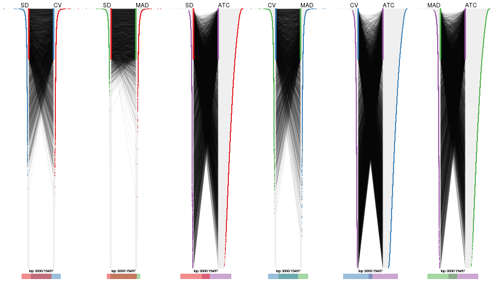</p>

</div>
<div id='tab-top-rows-overlap-by-correspondance-4'>
<pre><code class="r">top_rows_overlap(res_list, top_n = 4000, method = &quot;correspondance&quot;)
</code></pre>

<p></p>

</div>
<div id='tab-top-rows-overlap-by-correspondance-5'>
<pre><code class="r">top_rows_overlap(res_list, top_n = 5000, method = &quot;correspondance&quot;)
</code></pre>

<p></p>

</div>
</div>


Heatmaps of the top rows:


<script>
$( function() {
	$( '#tabs-top-rows-heatmap' ).tabs();
} );
</script>
<div id='tabs-top-rows-heatmap'>
<ul>
<li><a href='#tab-top-rows-heatmap-1'>top_n = 1000</a></li>
<li><a href='#tab-top-rows-heatmap-2'>top_n = 2000</a></li>
<li><a href='#tab-top-rows-heatmap-3'>top_n = 3000</a></li>
<li><a href='#tab-top-rows-heatmap-4'>top_n = 4000</a></li>
<li><a href='#tab-top-rows-heatmap-5'>top_n = 5000</a></li>
</ul>
<div id='tab-top-rows-heatmap-1'>
<pre><code class="r">top_rows_heatmap(res_list, top_n = 1000)
</code></pre>

<p></p>

</div>
<div id='tab-top-rows-heatmap-2'>
<pre><code class="r">top_rows_heatmap(res_list, top_n = 2000)
</code></pre>

<p></p>

</div>
<div id='tab-top-rows-heatmap-3'>
<pre><code class="r">top_rows_heatmap(res_list, top_n = 3000)
</code></pre>

<p></p>

</div>
<div id='tab-top-rows-heatmap-4'>
<pre><code class="r">top_rows_heatmap(res_list, top_n = 4000)
</code></pre>

<p></p>

</div>
<div id='tab-top-rows-heatmap-5'>
<pre><code class="r">top_rows_heatmap(res_list, top_n = 5000)
</code></pre>

<p></p>

</div>
</div>


### Test to known annotations


Test correlation between subgroups and known annotations. If the known
annotation is numeric, one-way ANOVA test is applied, and if the known
annotation is discrete, chi-squared contingency table test is applied.


<script>
$( function() {
	$( '#tabs-test-to-known-factors-from-consensus-partition-list' ).tabs();
} );
</script>
<div id='tabs-test-to-known-factors-from-consensus-partition-list'>
<ul>
<li><a href='#tab-test-to-known-factors-from-consensus-partition-list-1'>k = 2</a></li>
<li><a href='#tab-test-to-known-factors-from-consensus-partition-list-2'>k = 3</a></li>
<li><a href='#tab-test-to-known-factors-from-consensus-partition-list-3'>k = 4</a></li>
<li><a href='#tab-test-to-known-factors-from-consensus-partition-list-4'>k = 5</a></li>
<li><a href='#tab-test-to-known-factors-from-consensus-partition-list-5'>k = 6</a></li>
</ul>
<div id='tab-test-to-known-factors-from-consensus-partition-list-1'>
<pre><code class="r">test_to_known_factors(res_list, k = 2)
</code></pre>

<pre><code>#&gt;              n protocol(p) agent(p) individual(p) k
#&gt; SD:NMF      75       0.919    0.925      0.004135 2
#&gt; CV:NMF      72       1.000    0.846      0.004521 2
#&gt; MAD:NMF     76       1.000    0.789      0.005067 2
#&gt; ATC:NMF     83       0.900    0.446      0.004258 2
#&gt; SD:skmeans  81       1.000    0.726      0.001838 2
#&gt; CV:skmeans  81       1.000    0.726      0.001838 2
#&gt; MAD:skmeans 84       1.000    0.769      0.001220 2
#&gt; ATC:skmeans 84       1.000    0.550      0.003233 2
#&gt; SD:mclust   59       0.891    0.864      0.003568 2
#&gt; CV:mclust   80       0.767    0.798      0.001673 2
#&gt; MAD:mclust  39       1.000    0.990      0.019841 2
#&gt; ATC:mclust  84       1.000    0.606      0.001026 2
#&gt; SD:kmeans   83       1.000    0.703      0.001570 2
#&gt; CV:kmeans   83       1.000    0.703      0.001570 2
#&gt; MAD:kmeans  83       1.000    0.703      0.001570 2
#&gt; ATC:kmeans  81       0.896    0.405      0.004325 2
#&gt; SD:pam      78       1.000    0.893      0.003281 2
#&gt; CV:pam      69       0.952    0.502      0.013791 2
#&gt; MAD:pam     79       1.000    0.859      0.003100 2
#&gt; ATC:pam     84       1.000    0.421      0.005233 2
#&gt; SD:hclust   78       1.000    0.886      0.000481 2
#&gt; CV:hclust   64       1.000    0.966      0.001157 2
#&gt; MAD:hclust  70       1.000    0.871      0.000970 2
#&gt; ATC:hclust  84       1.000    0.769      0.001220 2
</code></pre>

</div>
<div id='tab-test-to-known-factors-from-consensus-partition-list-2'>
<pre><code class="r">test_to_known_factors(res_list, k = 3)
</code></pre>

<pre><code>#&gt;              n protocol(p) agent(p) individual(p) k
#&gt; SD:NMF      80       0.964    0.957      4.46e-05 3
#&gt; CV:NMF      48       1.000    0.744      2.26e-02 3
#&gt; MAD:NMF     81       0.991    0.928      2.93e-05 3
#&gt; ATC:NMF     82       0.904    0.778      4.41e-05 3
#&gt; SD:skmeans  83       0.988    0.963      3.05e-05 3
#&gt; CV:skmeans  79       0.985    0.995      2.05e-05 3
#&gt; MAD:skmeans 83       0.895    0.973      6.95e-06 3
#&gt; ATC:skmeans 71       0.361    0.513      1.45e-04 3
#&gt; SD:mclust   82       0.982    0.784      1.10e-04 3
#&gt; CV:mclust   69       0.495    0.739      7.74e-05 3
#&gt; MAD:mclust  81       0.939    0.815      8.53e-05 3
#&gt; ATC:mclust  83       0.986    0.996      1.26e-05 3
#&gt; SD:kmeans   75       0.985    0.993      3.72e-05 3
#&gt; CV:kmeans   76       0.953    0.846      4.54e-05 3
#&gt; MAD:kmeans  84       0.961    0.957      3.97e-05 3
#&gt; ATC:kmeans  72       0.948    0.886      6.99e-04 3
#&gt; SD:pam      75       0.724    0.879      1.65e-05 3
#&gt; CV:pam      60       0.846    0.862      8.09e-04 3
#&gt; MAD:pam     77       0.557    0.794      2.27e-05 3
#&gt; ATC:pam     82       0.527    0.839      1.28e-03 3
#&gt; SD:hclust   82       0.697    0.958      4.59e-07 3
#&gt; CV:hclust   58       0.916    0.995      3.57e-05 3
#&gt; MAD:hclust  78       0.698    0.956      8.95e-07 3
#&gt; ATC:hclust  83       0.780    0.854      2.57e-04 3
</code></pre>

</div>
<div id='tab-test-to-known-factors-from-consensus-partition-list-3'>
<pre><code class="r">test_to_known_factors(res_list, k = 4)
</code></pre>

<pre><code>#&gt;              n protocol(p) agent(p) individual(p) k
#&gt; SD:NMF      71       0.239    0.723      7.00e-07 4
#&gt; CV:NMF      71       0.317    0.977      1.90e-06 4
#&gt; MAD:NMF     71       0.148    0.716      1.63e-06 4
#&gt; ATC:NMF     76       0.781    0.969      7.92e-06 4
#&gt; SD:skmeans  82       0.917    0.997      3.41e-08 4
#&gt; CV:skmeans  71       0.995    1.000      8.77e-08 4
#&gt; MAD:skmeans 81       0.868    0.997      3.28e-08 4
#&gt; ATC:skmeans 83       0.936    0.874      2.70e-05 4
#&gt; SD:mclust   81       0.889    0.956      4.96e-08 4
#&gt; CV:mclust   82       0.713    0.985      3.88e-09 4
#&gt; MAD:mclust  82       0.827    0.899      6.82e-08 4
#&gt; ATC:mclust  83       0.733    0.928      2.02e-07 4
#&gt; SD:kmeans   81       0.996    0.990      7.14e-08 4
#&gt; CV:kmeans   75       0.984    0.986      6.91e-08 4
#&gt; MAD:kmeans  80       0.995    0.990      4.69e-08 4
#&gt; ATC:kmeans  77       0.700    0.635      5.21e-04 4
#&gt; SD:pam      81       0.639    0.970      5.50e-07 4
#&gt; CV:pam      39       1.000    0.713      5.36e-02 4
#&gt; MAD:pam     80       0.769    0.976      1.20e-06 4
#&gt; ATC:pam     76       0.251    0.654      6.85e-04 4
#&gt; SD:hclust   62       0.658    0.946      9.45e-06 4
#&gt; CV:hclust   35       0.993    1.000      5.86e-04 4
#&gt; MAD:hclust  72       0.939    0.996      8.45e-09 4
#&gt; ATC:hclust  80       0.810    0.872      2.07e-05 4
</code></pre>

</div>
<div id='tab-test-to-known-factors-from-consensus-partition-list-4'>
<pre><code class="r">test_to_known_factors(res_list, k = 5)
</code></pre>

<pre><code>#&gt;              n protocol(p) agent(p) individual(p) k
#&gt; SD:NMF      46       0.585    0.556      5.01e-03 5
#&gt; CV:NMF      33       0.396    0.650      5.33e-03 5
#&gt; MAD:NMF     40       0.145    0.668      1.25e-03 5
#&gt; ATC:NMF     63       0.756    0.523      6.56e-07 5
#&gt; SD:skmeans  72       0.903    0.998      7.90e-10 5
#&gt; CV:skmeans  57       0.950    0.989      6.44e-06 5
#&gt; MAD:skmeans 71       0.850    0.979      8.45e-10 5
#&gt; ATC:skmeans 75       0.927    0.955      7.03e-05 5
#&gt; SD:mclust   80       0.837    0.873      3.48e-07 5
#&gt; CV:mclust   84       0.936    0.962      4.66e-09 5
#&gt; MAD:mclust  81       0.889    0.934      1.70e-07 5
#&gt; ATC:mclust  75       0.693    0.787      1.72e-07 5
#&gt; SD:kmeans   70       0.941    0.985      3.16e-09 5
#&gt; CV:kmeans   46       0.377    0.854      7.15e-06 5
#&gt; MAD:kmeans  70       0.849    0.986      2.77e-09 5
#&gt; ATC:kmeans  66       0.640    0.692      3.64e-05 5
#&gt; SD:pam      76       0.620    0.728      3.78e-08 5
#&gt; CV:pam      70       0.745    0.926      1.03e-06 5
#&gt; MAD:pam     74       0.426    0.703      3.71e-08 5
#&gt; ATC:pam     77       0.495    0.861      6.55e-06 5
#&gt; SD:hclust   70       0.928    0.999      3.64e-11 5
#&gt; CV:hclust   46       1.000    0.999      4.30e-06 5
#&gt; MAD:hclust  67       0.922    0.998      1.89e-10 5
#&gt; ATC:hclust  63       0.888    0.955      4.61e-05 5
</code></pre>

</div>
<div id='tab-test-to-known-factors-from-consensus-partition-list-5'>
<pre><code class="r">test_to_known_factors(res_list, k = 6)
</code></pre>

<pre><code>#&gt;              n protocol(p) agent(p) individual(p) k
#&gt; SD:NMF      61       0.852    0.842      1.06e-04 6
#&gt; CV:NMF      25       0.981    0.890      2.23e-02 6
#&gt; MAD:NMF     66       0.772    0.889      7.34e-08 6
#&gt; ATC:NMF     60       0.636    0.743      1.34e-05 6
#&gt; SD:skmeans  72       0.860    0.994      3.78e-12 6
#&gt; CV:skmeans  57       0.975    1.000      1.38e-07 6
#&gt; MAD:skmeans 72       0.775    0.994      2.58e-12 6
#&gt; ATC:skmeans 55       0.473    0.832      1.31e-05 6
#&gt; SD:mclust   78       0.798    0.941      9.61e-10 6
#&gt; CV:mclust   71       0.933    0.996      1.02e-09 6
#&gt; MAD:mclust  68       0.625    0.854      8.79e-08 6
#&gt; ATC:mclust  70       0.690    0.902      2.72e-05 6
#&gt; SD:kmeans   56       0.747    0.965      7.75e-08 6
#&gt; CV:kmeans   33       0.483    0.889      1.90e-04 6
#&gt; MAD:kmeans  56       0.951    0.997      9.73e-08 6
#&gt; ATC:kmeans  76       0.759    0.774      2.84e-07 6
#&gt; SD:pam      75       0.709    0.842      1.40e-08 6
#&gt; CV:pam      66       0.463    0.956      5.30e-09 6
#&gt; MAD:pam     78       0.474    0.723      5.92e-10 6
#&gt; ATC:pam     75       0.320    0.430      1.33e-06 6
#&gt; SD:hclust   76       0.946    1.000      1.68e-14 6
#&gt; CV:hclust   43       0.989    1.000      6.16e-06 6
#&gt; MAD:hclust  79       0.964    1.000      1.14e-14 6
#&gt; ATC:hclust  60       0.914    0.953      4.75e-07 6
</code></pre>

</div>
</div>


 
## Results for each method


---------------------------------------------------


### SD:hclust


The object with results only for a single top-value method and a single partition method 
can be extracted as:

```r
res = res_list["SD", "hclust"]
# you can also extract it by
# res = res_list["SD:hclust"]
```

A summary of `res` and all the functions that can be applied to it:

```r
res
```

```
#> A 'ConsensusPartition' object with k = 2, 3, 4, 5, 6.
#>   On a matrix with 15497 rows and 84 columns.
#>   Top rows (1000, 2000, 3000, 4000, 5000) are extracted by 'SD' method.
#>   Subgroups are detected by 'hclust' method.
#>   Performed in total 1250 partitions by row resampling.
#>   Best k for subgroups seems to be 3.
#> 
#> Following methods can be applied to this 'ConsensusPartition' object:
#>  [1] "cola_report"             "collect_classes"         "collect_plots"          
#>  [4] "collect_stats"           "colnames"                "compare_signatures"     
#>  [7] "consensus_heatmap"       "dimension_reduction"     "functional_enrichment"  
#> [10] "get_anno_col"            "get_anno"                "get_classes"            
#> [13] "get_consensus"           "get_matrix"              "get_membership"         
#> [16] "get_param"               "get_signatures"          "get_stats"              
#> [19] "is_best_k"               "is_stable_k"             "membership_heatmap"     
#> [22] "ncol"                    "nrow"                    "plot_ecdf"              
#> [25] "rownames"                "select_partition_number" "show"                   
#> [28] "suggest_best_k"          "test_to_known_factors"
```

`collect_plots()` function collects all the plots made from `res` for all `k` (number of partitions)
into one single page to provide an easy and fast comparison between different `k`.

```r
collect_plots(res)
```


The plots are:

- The first row: a plot of the ECDF (empirical cumulative distribution
  function) curves of the consensus matrix for each `k` and the heatmap of
  predicted classes for each `k`.
- The second row: heatmaps of the consensus matrix for each `k`.
- The third row: heatmaps of the membership matrix for each `k`.
- The fouth row: heatmaps of the signatures for each `k`.

All the plots in panels can be made by individual functions and they are
plotted later in this section.

`select_partition_number()` produces several plots showing different
statistics for choosing "optimized" `k`. There are following statistics:

- ECDF curves of the consensus matrix for each `k`;
- 1-PAC. [The PAC
  score](https://en.wikipedia.org/wiki/Consensus_clustering#Over-interpretation_potential_of_consensus_clustering)
  measures the proportion of the ambiguous subgrouping.
- Mean silhouette score.
- Concordance. The mean probability of fiting the consensus class ids in all
  partitions.
- Area increased. Denote $A_k$ as the area under the ECDF curve for current
  `k`, the area increased is defined as $A_k - A_{k-1}$.
- Rand index. The percent of pairs of samples that are both in a same cluster
  or both are not in a same cluster in the partition of k and k-1.
- Jaccard index. The ratio of pairs of samples are both in a same cluster in
  the partition of k and k-1 and the pairs of samples are both in a same
  cluster in the partition k or k-1.

The detailed explanations of these statistics can be found in [the _cola_
vignette](http://bioconductor.org/packages/devel/bioc/vignettes/cola/inst/doc/cola.html#toc_13).

Generally speaking, lower PAC score, higher mean silhouette score or higher
concordance corresponds to better partition. Rand index and Jaccard index
measure how similar the current partition is compared to partition with `k-1`.
If they are too similar, we won't accept `k` is better than `k-1`.

```r
select_partition_number(res)
```


The numeric values for all these statistics can be obtained by `get_stats()`.

```r
get_stats(res)
```

```
#>   k 1-PAC mean_silhouette concordance area_increased  Rand Jaccard
#> 2 2 0.625           0.837       0.921         0.4474 0.523   0.523
#> 3 3 0.506           0.783       0.856         0.4639 0.806   0.629
#> 4 4 0.580           0.620       0.779         0.1241 0.863   0.620
#> 5 5 0.622           0.695       0.778         0.0669 0.903   0.649
#> 6 6 0.785           0.780       0.847         0.0501 0.972   0.862
```

`suggest_best_k()` suggests the best $k$ based on these statistics. The rules are as follows:

- All $k$ with Jaccard index larger than 0.95 are removed because increasing
  $k$ does not provide enough extra information. If all $k$ are removed, it is
  marked as no subgroup is detected.
- For all $k$ with 1-PAC score larger than 0.9, the maximal $k$ is taken as
  the best $k$, and other $k$ are marked as optional $k$.
- If it does not fit the second rule. The $k$ with the maximal vote of the
  highest 1-PAC score, highest mean silhouette, and highest concordance is
  taken as the best $k$.

```r
suggest_best_k(res)
```

```
#> [1] 3
```


Following shows the table of the partitions (You need to click the **show/hide
code output** link to see it). The membership matrix (columns with name `p*`)
is inferred by
[`clue::cl_consensus()`](https://www.rdocumentation.org/link/cl_consensus?package=clue)
function with the `SE` method. Basically the value in the membership matrix
represents the probability to belong to a certain group. The finall class
label for an item is determined with the group with highest probability it
belongs to.

In `get_classes()` function, the entropy is calculated from the membership
matrix and the silhouette score is calculated from the consensus matrix.


<script>
$( function() {
	$( '#tabs-SD-hclust-get-classes' ).tabs();
} );
</script>
<div id='tabs-SD-hclust-get-classes'>
<ul>
<li><a href='#tab-SD-hclust-get-classes-1'>k = 2</a></li>
<li><a href='#tab-SD-hclust-get-classes-2'>k = 3</a></li>
<li><a href='#tab-SD-hclust-get-classes-3'>k = 4</a></li>
<li><a href='#tab-SD-hclust-get-classes-4'>k = 5</a></li>
<li><a href='#tab-SD-hclust-get-classes-5'>k = 6</a></li>
</ul>

<div id='tab-SD-hclust-get-classes-1'>
<p><a id='tab-SD-hclust-get-classes-1-a' style='color:#0366d6' href='#'>show/hide code output</a></p>
<pre><code class="r">cbind(get_classes(res, k = 2), get_membership(res, k = 2))
</code></pre>

<pre><code>#&gt;           class entropy silhouette    p1    p2
#&gt; GSM339455     1  0.0376      0.946 0.996 0.004
#&gt; GSM339456     2  0.4298      0.798 0.088 0.912
#&gt; GSM339457     1  0.3274      0.917 0.940 0.060
#&gt; GSM339458     2  0.9358      0.544 0.352 0.648
#&gt; GSM339459     1  0.4690      0.885 0.900 0.100
#&gt; GSM339460     2  0.2236      0.837 0.036 0.964
#&gt; GSM339461     2  0.0000      0.841 0.000 1.000
#&gt; GSM339462     1  0.0376      0.946 0.996 0.004
#&gt; GSM339463     1  0.0000      0.946 1.000 0.000
#&gt; GSM339464     1  0.1184      0.943 0.984 0.016
#&gt; GSM339465     1  0.0000      0.946 1.000 0.000
#&gt; GSM339466     2  0.9944      0.288 0.456 0.544
#&gt; GSM339467     2  0.0000      0.841 0.000 1.000
#&gt; GSM339468     1  0.7528      0.732 0.784 0.216
#&gt; GSM339469     1  0.3274      0.915 0.940 0.060
#&gt; GSM339470     2  0.9866      0.396 0.432 0.568
#&gt; GSM339471     1  0.0000      0.946 1.000 0.000
#&gt; GSM339472     2  0.0000      0.841 0.000 1.000
#&gt; GSM339473     1  0.0000      0.946 1.000 0.000
#&gt; GSM339474     2  0.0000      0.841 0.000 1.000
#&gt; GSM339475     1  0.0000      0.946 1.000 0.000
#&gt; GSM339476     1  0.0376      0.946 0.996 0.004
#&gt; GSM339477     2  0.0000      0.841 0.000 1.000
#&gt; GSM339478     1  0.3274      0.917 0.940 0.060
#&gt; GSM339479     2  0.9358      0.544 0.352 0.648
#&gt; GSM339480     1  0.4690      0.885 0.900 0.100
#&gt; GSM339481     2  0.2236      0.837 0.036 0.964
#&gt; GSM339482     1  0.0000      0.946 1.000 0.000
#&gt; GSM339483     1  0.0376      0.946 0.996 0.004
#&gt; GSM339484     1  0.0000      0.946 1.000 0.000
#&gt; GSM339485     1  0.1184      0.943 0.984 0.016
#&gt; GSM339486     1  0.0000      0.946 1.000 0.000
#&gt; GSM339487     2  0.9944      0.288 0.456 0.544
#&gt; GSM339488     2  0.0000      0.841 0.000 1.000
#&gt; GSM339489     1  0.7528      0.732 0.784 0.216
#&gt; GSM339490     1  0.3274      0.915 0.940 0.060
#&gt; GSM339491     2  0.9866      0.396 0.432 0.568
#&gt; GSM339492     1  0.0000      0.946 1.000 0.000
#&gt; GSM339493     2  0.1184      0.840 0.016 0.984
#&gt; GSM339494     1  0.0000      0.946 1.000 0.000
#&gt; GSM339495     2  0.0000      0.841 0.000 1.000
#&gt; GSM339496     1  0.0000      0.946 1.000 0.000
#&gt; GSM339497     2  0.2043      0.838 0.032 0.968
#&gt; GSM339498     1  0.6623      0.796 0.828 0.172
#&gt; GSM339499     1  0.3274      0.917 0.940 0.060
#&gt; GSM339500     2  0.9358      0.544 0.352 0.648
#&gt; GSM339501     1  0.5946      0.838 0.856 0.144
#&gt; GSM339502     2  0.2236      0.837 0.036 0.964
#&gt; GSM339503     1  0.0000      0.946 1.000 0.000
#&gt; GSM339504     1  0.0376      0.946 0.996 0.004
#&gt; GSM339505     1  0.0938      0.944 0.988 0.012
#&gt; GSM339506     1  0.1184      0.943 0.984 0.016
#&gt; GSM339507     1  0.0000      0.946 1.000 0.000
#&gt; GSM339508     2  0.0000      0.841 0.000 1.000
#&gt; GSM339509     2  0.0000      0.841 0.000 1.000
#&gt; GSM339510     1  0.7528      0.732 0.784 0.216
#&gt; GSM339511     1  0.3274      0.915 0.940 0.060
#&gt; GSM339512     2  0.9866      0.396 0.432 0.568
#&gt; GSM339513     1  0.0000      0.946 1.000 0.000
#&gt; GSM339514     2  0.0000      0.841 0.000 1.000
#&gt; GSM339515     1  0.0000      0.946 1.000 0.000
#&gt; GSM339516     2  0.0000      0.841 0.000 1.000
#&gt; GSM339517     1  0.0000      0.946 1.000 0.000
#&gt; GSM339518     2  0.2043      0.838 0.032 0.968
#&gt; GSM339519     1  0.4690      0.877 0.900 0.100
#&gt; GSM339520     1  0.3274      0.917 0.940 0.060
#&gt; GSM339521     2  0.9358      0.544 0.352 0.648
#&gt; GSM339522     1  0.5946      0.838 0.856 0.144
#&gt; GSM339523     2  0.2236      0.837 0.036 0.964
#&gt; GSM339524     1  0.0000      0.946 1.000 0.000
#&gt; GSM339525     1  0.0376      0.946 0.996 0.004
#&gt; GSM339526     1  0.0000      0.946 1.000 0.000
#&gt; GSM339527     1  0.1184      0.943 0.984 0.016
#&gt; GSM339528     1  0.0000      0.946 1.000 0.000
#&gt; GSM339529     2  0.0000      0.841 0.000 1.000
#&gt; GSM339530     1  0.3274      0.917 0.940 0.060
#&gt; GSM339531     1  0.7528      0.732 0.784 0.216
#&gt; GSM339532     1  0.3274      0.915 0.940 0.060
#&gt; GSM339533     2  0.9866      0.396 0.432 0.568
#&gt; GSM339534     1  0.0000      0.946 1.000 0.000
#&gt; GSM339535     2  0.1184      0.840 0.016 0.984
#&gt; GSM339536     1  0.0000      0.946 1.000 0.000
#&gt; GSM339537     2  0.0000      0.841 0.000 1.000
#&gt; GSM339538     1  0.0000      0.946 1.000 0.000
</code></pre>

<script>
$('#tab-SD-hclust-get-classes-1-a').parent().next().next().hide();
$('#tab-SD-hclust-get-classes-1-a').click(function(){
  $('#tab-SD-hclust-get-classes-1-a').parent().next().next().toggle();
  return(false);
});
</script>
</div>

<div id='tab-SD-hclust-get-classes-2'>
<p><a id='tab-SD-hclust-get-classes-2-a' style='color:#0366d6' href='#'>show/hide code output</a></p>
<pre><code class="r">cbind(get_classes(res, k = 3), get_membership(res, k = 3))
</code></pre>

<pre><code>#&gt;           class entropy silhouette    p1    p2    p3
#&gt; GSM339455     1  0.5690      0.783 0.708 0.004 0.288
#&gt; GSM339456     2  0.3293      0.778 0.012 0.900 0.088
#&gt; GSM339457     3  0.2743      0.849 0.020 0.052 0.928
#&gt; GSM339458     2  0.7562      0.585 0.308 0.628 0.064
#&gt; GSM339459     3  0.5344      0.830 0.092 0.084 0.824
#&gt; GSM339460     2  0.2063      0.831 0.044 0.948 0.008
#&gt; GSM339461     2  0.0592      0.837 0.012 0.988 0.000
#&gt; GSM339462     1  0.1643      0.881 0.956 0.000 0.044
#&gt; GSM339463     3  0.1964      0.829 0.056 0.000 0.944
#&gt; GSM339464     1  0.0592      0.870 0.988 0.000 0.012
#&gt; GSM339465     1  0.4178      0.861 0.828 0.000 0.172
#&gt; GSM339466     2  0.7353      0.107 0.032 0.532 0.436
#&gt; GSM339467     2  0.0000      0.837 0.000 1.000 0.000
#&gt; GSM339468     3  0.7437      0.724 0.108 0.200 0.692
#&gt; GSM339469     1  0.2063      0.859 0.948 0.044 0.008
#&gt; GSM339470     2  0.8842      0.518 0.308 0.548 0.144
#&gt; GSM339471     1  0.5529      0.777 0.704 0.000 0.296
#&gt; GSM339472     2  0.0000      0.837 0.000 1.000 0.000
#&gt; GSM339473     1  0.3412      0.873 0.876 0.000 0.124
#&gt; GSM339474     2  0.0000      0.837 0.000 1.000 0.000
#&gt; GSM339475     3  0.2959      0.805 0.100 0.000 0.900
#&gt; GSM339476     1  0.5690      0.783 0.708 0.004 0.288
#&gt; GSM339477     2  0.0592      0.837 0.012 0.988 0.000
#&gt; GSM339478     3  0.2743      0.849 0.020 0.052 0.928
#&gt; GSM339479     2  0.7562      0.585 0.308 0.628 0.064
#&gt; GSM339480     3  0.5344      0.830 0.092 0.084 0.824
#&gt; GSM339481     2  0.2063      0.831 0.044 0.948 0.008
#&gt; GSM339482     3  0.3340      0.794 0.120 0.000 0.880
#&gt; GSM339483     1  0.1643      0.881 0.956 0.000 0.044
#&gt; GSM339484     3  0.1964      0.829 0.056 0.000 0.944
#&gt; GSM339485     1  0.0592      0.870 0.988 0.000 0.012
#&gt; GSM339486     1  0.4178      0.861 0.828 0.000 0.172
#&gt; GSM339487     2  0.7353      0.107 0.032 0.532 0.436
#&gt; GSM339488     2  0.0000      0.837 0.000 1.000 0.000
#&gt; GSM339489     3  0.7437      0.724 0.108 0.200 0.692
#&gt; GSM339490     1  0.2063      0.859 0.948 0.044 0.008
#&gt; GSM339491     2  0.8842      0.518 0.308 0.548 0.144
#&gt; GSM339492     1  0.5529      0.777 0.704 0.000 0.296
#&gt; GSM339493     2  0.0747      0.833 0.000 0.984 0.016
#&gt; GSM339494     1  0.3412      0.873 0.876 0.000 0.124
#&gt; GSM339495     2  0.0000      0.837 0.000 1.000 0.000
#&gt; GSM339496     3  0.2959      0.805 0.100 0.000 0.900
#&gt; GSM339497     2  0.1832      0.833 0.036 0.956 0.008
#&gt; GSM339498     3  0.6880      0.766 0.108 0.156 0.736
#&gt; GSM339499     3  0.2743      0.849 0.020 0.052 0.928
#&gt; GSM339500     2  0.7562      0.585 0.308 0.628 0.064
#&gt; GSM339501     3  0.6309      0.806 0.100 0.128 0.772
#&gt; GSM339502     2  0.2063      0.831 0.044 0.948 0.008
#&gt; GSM339503     3  0.3340      0.794 0.120 0.000 0.880
#&gt; GSM339504     1  0.1643      0.881 0.956 0.000 0.044
#&gt; GSM339505     3  0.1751      0.838 0.028 0.012 0.960
#&gt; GSM339506     1  0.0592      0.870 0.988 0.000 0.012
#&gt; GSM339507     1  0.4178      0.861 0.828 0.000 0.172
#&gt; GSM339508     2  0.0424      0.837 0.008 0.992 0.000
#&gt; GSM339509     2  0.0000      0.837 0.000 1.000 0.000
#&gt; GSM339510     3  0.7437      0.724 0.108 0.200 0.692
#&gt; GSM339511     1  0.2063      0.859 0.948 0.044 0.008
#&gt; GSM339512     2  0.8842      0.518 0.308 0.548 0.144
#&gt; GSM339513     1  0.5529      0.777 0.704 0.000 0.296
#&gt; GSM339514     2  0.0000      0.837 0.000 1.000 0.000
#&gt; GSM339515     1  0.3412      0.873 0.876 0.000 0.124
#&gt; GSM339516     2  0.0000      0.837 0.000 1.000 0.000
#&gt; GSM339517     3  0.2959      0.805 0.100 0.000 0.900
#&gt; GSM339518     2  0.1832      0.833 0.036 0.956 0.008
#&gt; GSM339519     3  0.7383      0.710 0.236 0.084 0.680
#&gt; GSM339520     3  0.2743      0.849 0.020 0.052 0.928
#&gt; GSM339521     2  0.7562      0.585 0.308 0.628 0.064
#&gt; GSM339522     3  0.6309      0.806 0.100 0.128 0.772
#&gt; GSM339523     2  0.2063      0.831 0.044 0.948 0.008
#&gt; GSM339524     3  0.3340      0.794 0.120 0.000 0.880
#&gt; GSM339525     1  0.1643      0.881 0.956 0.000 0.044
#&gt; GSM339526     3  0.1964      0.829 0.056 0.000 0.944
#&gt; GSM339527     1  0.0592      0.870 0.988 0.000 0.012
#&gt; GSM339528     1  0.4178      0.861 0.828 0.000 0.172
#&gt; GSM339529     2  0.0424      0.837 0.008 0.992 0.000
#&gt; GSM339530     3  0.2743      0.849 0.020 0.052 0.928
#&gt; GSM339531     3  0.7437      0.724 0.108 0.200 0.692
#&gt; GSM339532     1  0.2063      0.859 0.948 0.044 0.008
#&gt; GSM339533     2  0.8842      0.518 0.308 0.548 0.144
#&gt; GSM339534     1  0.5529      0.777 0.704 0.000 0.296
#&gt; GSM339535     2  0.0747      0.833 0.000 0.984 0.016
#&gt; GSM339536     1  0.3412      0.873 0.876 0.000 0.124
#&gt; GSM339537     2  0.0000      0.837 0.000 1.000 0.000
#&gt; GSM339538     3  0.2959      0.805 0.100 0.000 0.900
</code></pre>

<script>
$('#tab-SD-hclust-get-classes-2-a').parent().next().next().hide();
$('#tab-SD-hclust-get-classes-2-a').click(function(){
  $('#tab-SD-hclust-get-classes-2-a').parent().next().next().toggle();
  return(false);
});
</script>
</div>

<div id='tab-SD-hclust-get-classes-3'>
<p><a id='tab-SD-hclust-get-classes-3-a' style='color:#0366d6' href='#'>show/hide code output</a></p>
<pre><code class="r">cbind(get_classes(res, k = 4), get_membership(res, k = 4))
</code></pre>

<pre><code>#&gt;           class entropy silhouette    p1    p2    p3    p4
#&gt; GSM339455     1  0.4579    0.66637 0.720 0.004 0.272 0.004
#&gt; GSM339456     2  0.4488    0.78254 0.008 0.820 0.076 0.096
#&gt; GSM339457     3  0.2342    0.78037 0.008 0.000 0.912 0.080
#&gt; GSM339458     4  0.4898    0.41593 0.000 0.260 0.024 0.716
#&gt; GSM339459     3  0.3688    0.75880 0.000 0.000 0.792 0.208
#&gt; GSM339460     2  0.3895    0.79214 0.000 0.804 0.012 0.184
#&gt; GSM339461     2  0.2222    0.88522 0.008 0.928 0.008 0.056
#&gt; GSM339462     1  0.5220    0.20663 0.568 0.000 0.008 0.424
#&gt; GSM339463     3  0.2053    0.75537 0.072 0.000 0.924 0.004
#&gt; GSM339464     4  0.5290   -0.02531 0.476 0.000 0.008 0.516
#&gt; GSM339465     1  0.1867    0.70212 0.928 0.000 0.072 0.000
#&gt; GSM339466     3  0.7841    0.20597 0.000 0.324 0.400 0.276
#&gt; GSM339467     2  0.0000    0.89661 0.000 1.000 0.000 0.000
#&gt; GSM339468     3  0.5110    0.68721 0.000 0.016 0.656 0.328
#&gt; GSM339469     1  0.5697   -0.11669 0.488 0.024 0.000 0.488
#&gt; GSM339470     4  0.5355    0.47442 0.000 0.180 0.084 0.736
#&gt; GSM339471     1  0.4277    0.66632 0.720 0.000 0.280 0.000
#&gt; GSM339472     2  0.1109    0.89232 0.000 0.968 0.004 0.028
#&gt; GSM339473     1  0.0469    0.69530 0.988 0.000 0.012 0.000
#&gt; GSM339474     2  0.0336    0.89538 0.008 0.992 0.000 0.000
#&gt; GSM339475     3  0.3969    0.71858 0.180 0.000 0.804 0.016
#&gt; GSM339476     1  0.4579    0.66637 0.720 0.004 0.272 0.004
#&gt; GSM339477     2  0.0804    0.89574 0.008 0.980 0.000 0.012
#&gt; GSM339478     3  0.2342    0.78037 0.008 0.000 0.912 0.080
#&gt; GSM339479     4  0.4898    0.41593 0.000 0.260 0.024 0.716
#&gt; GSM339480     3  0.3688    0.75880 0.000 0.000 0.792 0.208
#&gt; GSM339481     2  0.3895    0.79214 0.000 0.804 0.012 0.184
#&gt; GSM339482     3  0.3791    0.71021 0.200 0.000 0.796 0.004
#&gt; GSM339483     1  0.5220    0.20663 0.568 0.000 0.008 0.424
#&gt; GSM339484     3  0.2053    0.75537 0.072 0.000 0.924 0.004
#&gt; GSM339485     4  0.5290   -0.02531 0.476 0.000 0.008 0.516
#&gt; GSM339486     1  0.1867    0.70212 0.928 0.000 0.072 0.000
#&gt; GSM339487     3  0.7841    0.20597 0.000 0.324 0.400 0.276
#&gt; GSM339488     2  0.0000    0.89661 0.000 1.000 0.000 0.000
#&gt; GSM339489     3  0.5110    0.68721 0.000 0.016 0.656 0.328
#&gt; GSM339490     4  0.5697    0.00102 0.488 0.024 0.000 0.488
#&gt; GSM339491     4  0.5355    0.47442 0.000 0.180 0.084 0.736
#&gt; GSM339492     1  0.4277    0.66632 0.720 0.000 0.280 0.000
#&gt; GSM339493     2  0.1798    0.88525 0.000 0.944 0.016 0.040
#&gt; GSM339494     1  0.0469    0.69530 0.988 0.000 0.012 0.000
#&gt; GSM339495     2  0.0336    0.89538 0.008 0.992 0.000 0.000
#&gt; GSM339496     3  0.3969    0.71858 0.180 0.000 0.804 0.016
#&gt; GSM339497     2  0.4323    0.77541 0.000 0.776 0.020 0.204
#&gt; GSM339498     3  0.4673    0.71121 0.000 0.008 0.700 0.292
#&gt; GSM339499     3  0.2342    0.78037 0.008 0.000 0.912 0.080
#&gt; GSM339500     4  0.4898    0.41593 0.000 0.260 0.024 0.716
#&gt; GSM339501     3  0.4452    0.73933 0.000 0.008 0.732 0.260
#&gt; GSM339502     2  0.3895    0.79214 0.000 0.804 0.012 0.184
#&gt; GSM339503     3  0.3791    0.71021 0.200 0.000 0.796 0.004
#&gt; GSM339504     1  0.5220    0.20663 0.568 0.000 0.008 0.424
#&gt; GSM339505     3  0.1489    0.76726 0.044 0.000 0.952 0.004
#&gt; GSM339506     4  0.5290   -0.02531 0.476 0.000 0.008 0.516
#&gt; GSM339507     1  0.1867    0.70212 0.928 0.000 0.072 0.000
#&gt; GSM339508     2  0.1059    0.89597 0.012 0.972 0.000 0.016
#&gt; GSM339509     2  0.0000    0.89661 0.000 1.000 0.000 0.000
#&gt; GSM339510     3  0.5110    0.68721 0.000 0.016 0.656 0.328
#&gt; GSM339511     4  0.5697    0.00102 0.488 0.024 0.000 0.488
#&gt; GSM339512     4  0.5355    0.47442 0.000 0.180 0.084 0.736
#&gt; GSM339513     1  0.4277    0.66632 0.720 0.000 0.280 0.000
#&gt; GSM339514     2  0.1109    0.89232 0.000 0.968 0.004 0.028
#&gt; GSM339515     1  0.0469    0.69530 0.988 0.000 0.012 0.000
#&gt; GSM339516     2  0.2302    0.88132 0.008 0.924 0.008 0.060
#&gt; GSM339517     3  0.3969    0.71858 0.180 0.000 0.804 0.016
#&gt; GSM339518     2  0.4323    0.77541 0.000 0.776 0.020 0.204
#&gt; GSM339519     3  0.6528    0.64229 0.128 0.008 0.656 0.208
#&gt; GSM339520     3  0.2342    0.78037 0.008 0.000 0.912 0.080
#&gt; GSM339521     4  0.4898    0.41593 0.000 0.260 0.024 0.716
#&gt; GSM339522     3  0.4452    0.73933 0.000 0.008 0.732 0.260
#&gt; GSM339523     2  0.3895    0.79214 0.000 0.804 0.012 0.184
#&gt; GSM339524     3  0.3791    0.71021 0.200 0.000 0.796 0.004
#&gt; GSM339525     1  0.5220    0.20663 0.568 0.000 0.008 0.424
#&gt; GSM339526     3  0.2053    0.75537 0.072 0.000 0.924 0.004
#&gt; GSM339527     4  0.5290   -0.02531 0.476 0.000 0.008 0.516
#&gt; GSM339528     1  0.1867    0.70212 0.928 0.000 0.072 0.000
#&gt; GSM339529     2  0.1059    0.89597 0.012 0.972 0.000 0.016
#&gt; GSM339530     3  0.2342    0.78037 0.008 0.000 0.912 0.080
#&gt; GSM339531     3  0.5110    0.68721 0.000 0.016 0.656 0.328
#&gt; GSM339532     4  0.5697    0.00102 0.488 0.024 0.000 0.488
#&gt; GSM339533     4  0.5355    0.47442 0.000 0.180 0.084 0.736
#&gt; GSM339534     1  0.4277    0.66632 0.720 0.000 0.280 0.000
#&gt; GSM339535     2  0.1798    0.88525 0.000 0.944 0.016 0.040
#&gt; GSM339536     1  0.0469    0.69530 0.988 0.000 0.012 0.000
#&gt; GSM339537     2  0.2302    0.88132 0.008 0.924 0.008 0.060
#&gt; GSM339538     3  0.3969    0.71858 0.180 0.000 0.804 0.016
</code></pre>

<script>
$('#tab-SD-hclust-get-classes-3-a').parent().next().next().hide();
$('#tab-SD-hclust-get-classes-3-a').click(function(){
  $('#tab-SD-hclust-get-classes-3-a').parent().next().next().toggle();
  return(false);
});
</script>
</div>

<div id='tab-SD-hclust-get-classes-4'>
<p><a id='tab-SD-hclust-get-classes-4-a' style='color:#0366d6' href='#'>show/hide code output</a></p>
<pre><code class="r">cbind(get_classes(res, k = 5), get_membership(res, k = 5))
</code></pre>

<pre><code>#&gt;           class entropy silhouette    p1    p2    p3    p4    p5
#&gt; GSM339455     1  0.2915      0.798 0.860 0.000 0.116 0.000 0.024
#&gt; GSM339456     2  0.4007      0.765 0.004 0.816 0.008 0.068 0.104
#&gt; GSM339457     3  0.5792      0.748 0.144 0.000 0.696 0.064 0.096
#&gt; GSM339458     4  0.6573      0.331 0.000 0.192 0.004 0.476 0.328
#&gt; GSM339459     5  0.5165      0.706 0.012 0.000 0.240 0.064 0.684
#&gt; GSM339460     2  0.4096      0.743 0.000 0.744 0.004 0.020 0.232
#&gt; GSM339461     2  0.2054      0.862 0.004 0.916 0.000 0.008 0.072
#&gt; GSM339462     4  0.5111      0.275 0.464 0.000 0.000 0.500 0.036
#&gt; GSM339463     3  0.3590      0.814 0.148 0.000 0.820 0.016 0.016
#&gt; GSM339464     4  0.4573      0.509 0.256 0.000 0.000 0.700 0.044
#&gt; GSM339465     1  0.3074      0.835 0.804 0.000 0.196 0.000 0.000
#&gt; GSM339466     5  0.4583      0.366 0.000 0.272 0.012 0.020 0.696
#&gt; GSM339467     2  0.0000      0.879 0.000 1.000 0.000 0.000 0.000
#&gt; GSM339468     5  0.2864      0.806 0.000 0.000 0.136 0.012 0.852
#&gt; GSM339469     4  0.3715      0.514 0.260 0.000 0.000 0.736 0.004
#&gt; GSM339470     4  0.6364      0.320 0.000 0.120 0.016 0.528 0.336
#&gt; GSM339471     1  0.2825      0.799 0.860 0.000 0.124 0.000 0.016
#&gt; GSM339472     2  0.0880      0.874 0.000 0.968 0.000 0.000 0.032
#&gt; GSM339473     1  0.2848      0.813 0.840 0.000 0.156 0.004 0.000
#&gt; GSM339474     2  0.0290      0.878 0.000 0.992 0.000 0.008 0.000
#&gt; GSM339475     3  0.1124      0.799 0.036 0.000 0.960 0.000 0.004
#&gt; GSM339476     1  0.2915      0.798 0.860 0.000 0.116 0.000 0.024
#&gt; GSM339477     2  0.0854      0.876 0.004 0.976 0.000 0.008 0.012
#&gt; GSM339478     3  0.5792      0.748 0.144 0.000 0.696 0.064 0.096
#&gt; GSM339479     4  0.6573      0.331 0.000 0.192 0.004 0.476 0.328
#&gt; GSM339480     5  0.5165      0.706 0.012 0.000 0.240 0.064 0.684
#&gt; GSM339481     2  0.4096      0.743 0.000 0.744 0.004 0.020 0.232
#&gt; GSM339482     3  0.1628      0.801 0.056 0.000 0.936 0.000 0.008
#&gt; GSM339483     4  0.5111      0.275 0.464 0.000 0.000 0.500 0.036
#&gt; GSM339484     3  0.3590      0.814 0.148 0.000 0.820 0.016 0.016
#&gt; GSM339485     4  0.4573      0.509 0.256 0.000 0.000 0.700 0.044
#&gt; GSM339486     1  0.3074      0.835 0.804 0.000 0.196 0.000 0.000
#&gt; GSM339487     5  0.4583      0.366 0.000 0.272 0.012 0.020 0.696
#&gt; GSM339488     2  0.0000      0.879 0.000 1.000 0.000 0.000 0.000
#&gt; GSM339489     5  0.2864      0.806 0.000 0.000 0.136 0.012 0.852
#&gt; GSM339490     4  0.3715      0.514 0.260 0.000 0.000 0.736 0.004
#&gt; GSM339491     4  0.6364      0.320 0.000 0.120 0.016 0.528 0.336
#&gt; GSM339492     1  0.2825      0.799 0.860 0.000 0.124 0.000 0.016
#&gt; GSM339493     2  0.1341      0.867 0.000 0.944 0.000 0.000 0.056
#&gt; GSM339494     1  0.2848      0.813 0.840 0.000 0.156 0.004 0.000
#&gt; GSM339495     2  0.0290      0.878 0.000 0.992 0.000 0.008 0.000
#&gt; GSM339496     3  0.1124      0.799 0.036 0.000 0.960 0.000 0.004
#&gt; GSM339497     2  0.4260      0.728 0.000 0.720 0.004 0.020 0.256
#&gt; GSM339498     5  0.4138      0.781 0.000 0.000 0.148 0.072 0.780
#&gt; GSM339499     3  0.5792      0.748 0.144 0.000 0.696 0.064 0.096
#&gt; GSM339500     4  0.6573      0.331 0.000 0.192 0.004 0.476 0.328
#&gt; GSM339501     5  0.4012      0.761 0.012 0.000 0.216 0.012 0.760
#&gt; GSM339502     2  0.4096      0.743 0.000 0.744 0.004 0.020 0.232
#&gt; GSM339503     3  0.1628      0.801 0.056 0.000 0.936 0.000 0.008
#&gt; GSM339504     4  0.5111      0.275 0.464 0.000 0.000 0.500 0.036
#&gt; GSM339505     3  0.3783      0.809 0.120 0.000 0.824 0.016 0.040
#&gt; GSM339506     4  0.4573      0.509 0.256 0.000 0.000 0.700 0.044
#&gt; GSM339507     1  0.3074      0.835 0.804 0.000 0.196 0.000 0.000
#&gt; GSM339508     2  0.1443      0.874 0.004 0.948 0.000 0.044 0.004
#&gt; GSM339509     2  0.0000      0.879 0.000 1.000 0.000 0.000 0.000
#&gt; GSM339510     5  0.2864      0.806 0.000 0.000 0.136 0.012 0.852
#&gt; GSM339511     4  0.3715      0.514 0.260 0.000 0.000 0.736 0.004
#&gt; GSM339512     4  0.6364      0.320 0.000 0.120 0.016 0.528 0.336
#&gt; GSM339513     1  0.2825      0.799 0.860 0.000 0.124 0.000 0.016
#&gt; GSM339514     2  0.0880      0.874 0.000 0.968 0.000 0.000 0.032
#&gt; GSM339515     1  0.2848      0.813 0.840 0.000 0.156 0.004 0.000
#&gt; GSM339516     2  0.1956      0.859 0.000 0.916 0.000 0.008 0.076
#&gt; GSM339517     3  0.1124      0.799 0.036 0.000 0.960 0.000 0.004
#&gt; GSM339518     2  0.4260      0.728 0.000 0.720 0.004 0.020 0.256
#&gt; GSM339519     5  0.5451      0.681 0.132 0.000 0.168 0.012 0.688
#&gt; GSM339520     3  0.5792      0.748 0.144 0.000 0.696 0.064 0.096
#&gt; GSM339521     4  0.6573      0.331 0.000 0.192 0.004 0.476 0.328
#&gt; GSM339522     5  0.4012      0.761 0.012 0.000 0.216 0.012 0.760
#&gt; GSM339523     2  0.4096      0.743 0.000 0.744 0.004 0.020 0.232
#&gt; GSM339524     3  0.1628      0.801 0.056 0.000 0.936 0.000 0.008
#&gt; GSM339525     4  0.5111      0.275 0.464 0.000 0.000 0.500 0.036
#&gt; GSM339526     3  0.3590      0.814 0.148 0.000 0.820 0.016 0.016
#&gt; GSM339527     4  0.4573      0.509 0.256 0.000 0.000 0.700 0.044
#&gt; GSM339528     1  0.3074      0.835 0.804 0.000 0.196 0.000 0.000
#&gt; GSM339529     2  0.1443      0.874 0.004 0.948 0.000 0.044 0.004
#&gt; GSM339530     3  0.5792      0.748 0.144 0.000 0.696 0.064 0.096
#&gt; GSM339531     5  0.2864      0.806 0.000 0.000 0.136 0.012 0.852
#&gt; GSM339532     4  0.3715      0.514 0.260 0.000 0.000 0.736 0.004
#&gt; GSM339533     4  0.6364      0.320 0.000 0.120 0.016 0.528 0.336
#&gt; GSM339534     1  0.2825      0.799 0.860 0.000 0.124 0.000 0.016
#&gt; GSM339535     2  0.1341      0.867 0.000 0.944 0.000 0.000 0.056
#&gt; GSM339536     1  0.2848      0.813 0.840 0.000 0.156 0.004 0.000
#&gt; GSM339537     2  0.1956      0.859 0.000 0.916 0.000 0.008 0.076
#&gt; GSM339538     3  0.1124      0.799 0.036 0.000 0.960 0.000 0.004
</code></pre>

<script>
$('#tab-SD-hclust-get-classes-4-a').parent().next().next().hide();
$('#tab-SD-hclust-get-classes-4-a').click(function(){
  $('#tab-SD-hclust-get-classes-4-a').parent().next().next().toggle();
  return(false);
});
</script>
</div>

<div id='tab-SD-hclust-get-classes-5'>
<p><a id='tab-SD-hclust-get-classes-5-a' style='color:#0366d6' href='#'>show/hide code output</a></p>
<pre><code class="r">cbind(get_classes(res, k = 6), get_membership(res, k = 6))
</code></pre>

<pre><code>#&gt;           class entropy silhouette    p1    p2    p3    p4    p5    p6
#&gt; GSM339455     1  0.3855      0.789 0.704 0.000 0.272 0.000 0.000 0.024
#&gt; GSM339456     2  0.3426      0.724 0.000 0.816 0.000 0.004 0.116 0.064
#&gt; GSM339457     3  0.2852      0.781 0.000 0.000 0.856 0.000 0.064 0.080
#&gt; GSM339458     6  0.2585      0.890 0.000 0.048 0.000 0.016 0.048 0.888
#&gt; GSM339459     5  0.1141      0.754 0.000 0.000 0.000 0.000 0.948 0.052
#&gt; GSM339460     2  0.3727      0.478 0.000 0.612 0.000 0.000 0.000 0.388
#&gt; GSM339461     2  0.2263      0.802 0.000 0.900 0.000 0.004 0.060 0.036
#&gt; GSM339462     4  0.3867      0.784 0.216 0.000 0.000 0.744 0.036 0.004
#&gt; GSM339463     3  0.1951      0.809 0.076 0.000 0.908 0.000 0.000 0.016
#&gt; GSM339464     4  0.1296      0.887 0.004 0.000 0.000 0.948 0.044 0.004
#&gt; GSM339465     1  0.0937      0.839 0.960 0.000 0.040 0.000 0.000 0.000
#&gt; GSM339466     5  0.5576      0.208 0.000 0.144 0.000 0.000 0.480 0.376
#&gt; GSM339467     2  0.0458      0.829 0.000 0.984 0.000 0.000 0.000 0.016
#&gt; GSM339468     5  0.2513      0.804 0.000 0.000 0.000 0.008 0.852 0.140
#&gt; GSM339469     4  0.0291      0.884 0.004 0.000 0.000 0.992 0.000 0.004
#&gt; GSM339470     6  0.2076      0.887 0.000 0.000 0.012 0.016 0.060 0.912
#&gt; GSM339471     1  0.3738      0.788 0.704 0.000 0.280 0.000 0.000 0.016
#&gt; GSM339472     2  0.1261      0.826 0.000 0.952 0.000 0.000 0.024 0.024
#&gt; GSM339473     1  0.0603      0.829 0.980 0.000 0.000 0.016 0.000 0.004
#&gt; GSM339474     2  0.0000      0.827 0.000 1.000 0.000 0.000 0.000 0.000
#&gt; GSM339475     3  0.3788      0.798 0.188 0.000 0.772 0.004 0.024 0.012
#&gt; GSM339476     1  0.3855      0.789 0.704 0.000 0.272 0.000 0.000 0.024
#&gt; GSM339477     2  0.0767      0.824 0.000 0.976 0.000 0.004 0.012 0.008
#&gt; GSM339478     3  0.2852      0.781 0.000 0.000 0.856 0.000 0.064 0.080
#&gt; GSM339479     6  0.2585      0.890 0.000 0.048 0.000 0.016 0.048 0.888
#&gt; GSM339480     5  0.1141      0.754 0.000 0.000 0.000 0.000 0.948 0.052
#&gt; GSM339481     2  0.3727      0.478 0.000 0.612 0.000 0.000 0.000 0.388
#&gt; GSM339482     3  0.3549      0.800 0.192 0.000 0.776 0.004 0.028 0.000
#&gt; GSM339483     4  0.3867      0.784 0.216 0.000 0.000 0.744 0.036 0.004
#&gt; GSM339484     3  0.1951      0.809 0.076 0.000 0.908 0.000 0.000 0.016
#&gt; GSM339485     4  0.1296      0.887 0.004 0.000 0.000 0.948 0.044 0.004
#&gt; GSM339486     1  0.0937      0.839 0.960 0.000 0.040 0.000 0.000 0.000
#&gt; GSM339487     5  0.5576      0.208 0.000 0.144 0.000 0.000 0.480 0.376
#&gt; GSM339488     2  0.0458      0.829 0.000 0.984 0.000 0.000 0.000 0.016
#&gt; GSM339489     5  0.2513      0.804 0.000 0.000 0.000 0.008 0.852 0.140
#&gt; GSM339490     4  0.0291      0.884 0.004 0.000 0.000 0.992 0.000 0.004
#&gt; GSM339491     6  0.2076      0.887 0.000 0.000 0.012 0.016 0.060 0.912
#&gt; GSM339492     1  0.3738      0.788 0.704 0.000 0.280 0.000 0.000 0.016
#&gt; GSM339493     2  0.1713      0.819 0.000 0.928 0.000 0.000 0.044 0.028
#&gt; GSM339494     1  0.0603      0.829 0.980 0.000 0.000 0.016 0.000 0.004
#&gt; GSM339495     2  0.0000      0.827 0.000 1.000 0.000 0.000 0.000 0.000
#&gt; GSM339496     3  0.3788      0.798 0.188 0.000 0.772 0.004 0.024 0.012
#&gt; GSM339497     2  0.4598      0.472 0.000 0.592 0.000 0.000 0.048 0.360
#&gt; GSM339498     5  0.3030      0.779 0.000 0.000 0.008 0.008 0.816 0.168
#&gt; GSM339499     3  0.2852      0.781 0.000 0.000 0.856 0.000 0.064 0.080
#&gt; GSM339500     6  0.2585      0.890 0.000 0.048 0.000 0.016 0.048 0.888
#&gt; GSM339501     5  0.1265      0.790 0.000 0.000 0.000 0.008 0.948 0.044
#&gt; GSM339502     2  0.3727      0.478 0.000 0.612 0.000 0.000 0.000 0.388
#&gt; GSM339503     3  0.3549      0.800 0.192 0.000 0.776 0.004 0.028 0.000
#&gt; GSM339504     4  0.3867      0.784 0.216 0.000 0.000 0.744 0.036 0.004
#&gt; GSM339505     3  0.2462      0.814 0.064 0.000 0.892 0.000 0.012 0.032
#&gt; GSM339506     4  0.1296      0.887 0.004 0.000 0.000 0.948 0.044 0.004
#&gt; GSM339507     1  0.0937      0.839 0.960 0.000 0.040 0.000 0.000 0.000
#&gt; GSM339508     2  0.1528      0.818 0.000 0.936 0.000 0.048 0.000 0.016
#&gt; GSM339509     2  0.0458      0.829 0.000 0.984 0.000 0.000 0.000 0.016
#&gt; GSM339510     5  0.2513      0.804 0.000 0.000 0.000 0.008 0.852 0.140
#&gt; GSM339511     4  0.0291      0.884 0.004 0.000 0.000 0.992 0.000 0.004
#&gt; GSM339512     6  0.2076      0.887 0.000 0.000 0.012 0.016 0.060 0.912
#&gt; GSM339513     1  0.3738      0.788 0.704 0.000 0.280 0.000 0.000 0.016
#&gt; GSM339514     2  0.1261      0.826 0.000 0.952 0.000 0.000 0.024 0.024
#&gt; GSM339515     1  0.0603      0.829 0.980 0.000 0.000 0.016 0.000 0.004
#&gt; GSM339516     2  0.2070      0.799 0.000 0.908 0.000 0.000 0.048 0.044
#&gt; GSM339517     3  0.3788      0.798 0.188 0.000 0.772 0.004 0.024 0.012
#&gt; GSM339518     2  0.4598      0.472 0.000 0.592 0.000 0.000 0.048 0.360
#&gt; GSM339519     5  0.5125      0.704 0.124 0.000 0.032 0.012 0.712 0.120
#&gt; GSM339520     3  0.2852      0.781 0.000 0.000 0.856 0.000 0.064 0.080
#&gt; GSM339521     6  0.2585      0.890 0.000 0.048 0.000 0.016 0.048 0.888
#&gt; GSM339522     5  0.1265      0.790 0.000 0.000 0.000 0.008 0.948 0.044
#&gt; GSM339523     2  0.3727      0.478 0.000 0.612 0.000 0.000 0.000 0.388
#&gt; GSM339524     3  0.3549      0.800 0.192 0.000 0.776 0.004 0.028 0.000
#&gt; GSM339525     4  0.3867      0.784 0.216 0.000 0.000 0.744 0.036 0.004
#&gt; GSM339526     3  0.1951      0.809 0.076 0.000 0.908 0.000 0.000 0.016
#&gt; GSM339527     4  0.1296      0.887 0.004 0.000 0.000 0.948 0.044 0.004
#&gt; GSM339528     1  0.0937      0.839 0.960 0.000 0.040 0.000 0.000 0.000
#&gt; GSM339529     2  0.1528      0.818 0.000 0.936 0.000 0.048 0.000 0.016
#&gt; GSM339530     3  0.2852      0.781 0.000 0.000 0.856 0.000 0.064 0.080
#&gt; GSM339531     5  0.2513      0.804 0.000 0.000 0.000 0.008 0.852 0.140
#&gt; GSM339532     4  0.0291      0.884 0.004 0.000 0.000 0.992 0.000 0.004
#&gt; GSM339533     6  0.2076      0.887 0.000 0.000 0.012 0.016 0.060 0.912
#&gt; GSM339534     1  0.3738      0.788 0.704 0.000 0.280 0.000 0.000 0.016
#&gt; GSM339535     2  0.1713      0.819 0.000 0.928 0.000 0.000 0.044 0.028
#&gt; GSM339536     1  0.0603      0.829 0.980 0.000 0.000 0.016 0.000 0.004
#&gt; GSM339537     2  0.2070      0.799 0.000 0.908 0.000 0.000 0.048 0.044
#&gt; GSM339538     3  0.3788      0.798 0.188 0.000 0.772 0.004 0.024 0.012
</code></pre>

<script>
$('#tab-SD-hclust-get-classes-5-a').parent().next().next().hide();
$('#tab-SD-hclust-get-classes-5-a').click(function(){
  $('#tab-SD-hclust-get-classes-5-a').parent().next().next().toggle();
  return(false);
});
</script>
</div>
</div>

Heatmaps for the consensus matrix. It visualizes the probability of two
samples to be in a same group.


<script>
$( function() {
	$( '#tabs-SD-hclust-consensus-heatmap' ).tabs();
} );
</script>
<div id='tabs-SD-hclust-consensus-heatmap'>
<ul>
<li><a href='#tab-SD-hclust-consensus-heatmap-1'>k = 2</a></li>
<li><a href='#tab-SD-hclust-consensus-heatmap-2'>k = 3</a></li>
<li><a href='#tab-SD-hclust-consensus-heatmap-3'>k = 4</a></li>
<li><a href='#tab-SD-hclust-consensus-heatmap-4'>k = 5</a></li>
<li><a href='#tab-SD-hclust-consensus-heatmap-5'>k = 6</a></li>
</ul>
<div id='tab-SD-hclust-consensus-heatmap-1'>
<pre><code class="r">consensus_heatmap(res, k = 2)
</code></pre>

<p></p>

</div>
<div id='tab-SD-hclust-consensus-heatmap-2'>
<pre><code class="r">consensus_heatmap(res, k = 3)
</code></pre>

<p></p>

</div>
<div id='tab-SD-hclust-consensus-heatmap-3'>
<pre><code class="r">consensus_heatmap(res, k = 4)
</code></pre>

<p></p>

</div>
<div id='tab-SD-hclust-consensus-heatmap-4'>
<pre><code class="r">consensus_heatmap(res, k = 5)
</code></pre>

<p></p>

</div>
<div id='tab-SD-hclust-consensus-heatmap-5'>
<pre><code class="r">consensus_heatmap(res, k = 6)
</code></pre>

<p></p>

</div>
</div>

Heatmaps for the membership of samples in all partitions to see how consistent they are:


<script>
$( function() {
	$( '#tabs-SD-hclust-membership-heatmap' ).tabs();
} );
</script>
<div id='tabs-SD-hclust-membership-heatmap'>
<ul>
<li><a href='#tab-SD-hclust-membership-heatmap-1'>k = 2</a></li>
<li><a href='#tab-SD-hclust-membership-heatmap-2'>k = 3</a></li>
<li><a href='#tab-SD-hclust-membership-heatmap-3'>k = 4</a></li>
<li><a href='#tab-SD-hclust-membership-heatmap-4'>k = 5</a></li>
<li><a href='#tab-SD-hclust-membership-heatmap-5'>k = 6</a></li>
</ul>
<div id='tab-SD-hclust-membership-heatmap-1'>
<pre><code class="r">membership_heatmap(res, k = 2)
</code></pre>

<p></p>

</div>
<div id='tab-SD-hclust-membership-heatmap-2'>
<pre><code class="r">membership_heatmap(res, k = 3)
</code></pre>

<p></p>

</div>
<div id='tab-SD-hclust-membership-heatmap-3'>
<pre><code class="r">membership_heatmap(res, k = 4)
</code></pre>

<p></p>

</div>
<div id='tab-SD-hclust-membership-heatmap-4'>
<pre><code class="r">membership_heatmap(res, k = 5)
</code></pre>

<p></p>

</div>
<div id='tab-SD-hclust-membership-heatmap-5'>
<pre><code class="r">membership_heatmap(res, k = 6)
</code></pre>

<p></p>

</div>
</div>

As soon as we have had the classes for columns, we can look for signatures
which are significantly different between classes which can be candidate marks
for certain classes. Following are the heatmaps for signatures.


Signature heatmaps where rows are scaled:


<script>
$( function() {
	$( '#tabs-SD-hclust-get-signatures' ).tabs();
} );
</script>
<div id='tabs-SD-hclust-get-signatures'>
<ul>
<li><a href='#tab-SD-hclust-get-signatures-1'>k = 2</a></li>
<li><a href='#tab-SD-hclust-get-signatures-2'>k = 3</a></li>
<li><a href='#tab-SD-hclust-get-signatures-3'>k = 4</a></li>
<li><a href='#tab-SD-hclust-get-signatures-4'>k = 5</a></li>
<li><a href='#tab-SD-hclust-get-signatures-5'>k = 6</a></li>
</ul>
<div id='tab-SD-hclust-get-signatures-1'>
<pre><code class="r">get_signatures(res, k = 2)
</code></pre>

<p></p>

</div>
<div id='tab-SD-hclust-get-signatures-2'>
<pre><code class="r">get_signatures(res, k = 3)
</code></pre>

<p></p>

</div>
<div id='tab-SD-hclust-get-signatures-3'>
<pre><code class="r">get_signatures(res, k = 4)
</code></pre>

<p></p>

</div>
<div id='tab-SD-hclust-get-signatures-4'>
<pre><code class="r">get_signatures(res, k = 5)
</code></pre>

<p></p>

</div>
<div id='tab-SD-hclust-get-signatures-5'>
<pre><code class="r">get_signatures(res, k = 6)
</code></pre>

<p></p>

</div>
</div>


Signature heatmaps where rows are not scaled:


<script>
$( function() {
	$( '#tabs-SD-hclust-get-signatures-no-scale' ).tabs();
} );
</script>
<div id='tabs-SD-hclust-get-signatures-no-scale'>
<ul>
<li><a href='#tab-SD-hclust-get-signatures-no-scale-1'>k = 2</a></li>
<li><a href='#tab-SD-hclust-get-signatures-no-scale-2'>k = 3</a></li>
<li><a href='#tab-SD-hclust-get-signatures-no-scale-3'>k = 4</a></li>
<li><a href='#tab-SD-hclust-get-signatures-no-scale-4'>k = 5</a></li>
<li><a href='#tab-SD-hclust-get-signatures-no-scale-5'>k = 6</a></li>
</ul>
<div id='tab-SD-hclust-get-signatures-no-scale-1'>
<pre><code class="r">get_signatures(res, k = 2, scale_rows = FALSE)
</code></pre>

<p></p>

</div>
<div id='tab-SD-hclust-get-signatures-no-scale-2'>
<pre><code class="r">get_signatures(res, k = 3, scale_rows = FALSE)
</code></pre>

<p></p>

</div>
<div id='tab-SD-hclust-get-signatures-no-scale-3'>
<pre><code class="r">get_signatures(res, k = 4, scale_rows = FALSE)
</code></pre>

<p></p>

</div>
<div id='tab-SD-hclust-get-signatures-no-scale-4'>
<pre><code class="r">get_signatures(res, k = 5, scale_rows = FALSE)
</code></pre>

<p></p>

</div>
<div id='tab-SD-hclust-get-signatures-no-scale-5'>
<pre><code class="r">get_signatures(res, k = 6, scale_rows = FALSE)
</code></pre>

<p></p>

</div>
</div>


Compare the overlap of signatures from different k:

```r
compare_signatures(res)
```


`get_signature()` returns a data frame invisibly. TO get the list of signatures, the function
call should be assigned to a variable explicitly. In following code, if `plot` argument is set
to `FALSE`, no heatmap is plotted while only the differential analysis is performed.

```r
# code only for demonstration
tb = get_signature(res, k = ..., plot = FALSE)
```

An example of the output of `tb` is:

```
#>   which_row         fdr    mean_1    mean_2 scaled_mean_1 scaled_mean_2 km
#> 1        38 0.042760348  8.373488  9.131774    -0.5533452     0.5164555  1
#> 2        40 0.018707592  7.106213  8.469186    -0.6173731     0.5762149  1
#> 3        55 0.019134737 10.221463 11.207825    -0.6159697     0.5749050  1
#> 4        59 0.006059896  5.921854  7.869574    -0.6899429     0.6439467  1
#> 5        60 0.018055526  8.928898 10.211722    -0.6204761     0.5791110  1
#> 6        98 0.009384629 15.714769 14.887706     0.6635654    -0.6193277  2
...
```

The columns in `tb` are:

1. `which_row`: row indices corresponding to the input matrix.
2. `fdr`: FDR for the differential test. 
3. `mean_x`: The mean value in group x.
4. `scaled_mean_x`: The mean value in group x after rows are scaled.
5. `km`: Row groups if k-means clustering is applied to rows.


UMAP plot which shows how samples are separated.


<script>
$( function() {
	$( '#tabs-SD-hclust-dimension-reduction' ).tabs();
} );
</script>
<div id='tabs-SD-hclust-dimension-reduction'>
<ul>
<li><a href='#tab-SD-hclust-dimension-reduction-1'>k = 2</a></li>
<li><a href='#tab-SD-hclust-dimension-reduction-2'>k = 3</a></li>
<li><a href='#tab-SD-hclust-dimension-reduction-3'>k = 4</a></li>
<li><a href='#tab-SD-hclust-dimension-reduction-4'>k = 5</a></li>
<li><a href='#tab-SD-hclust-dimension-reduction-5'>k = 6</a></li>
</ul>
<div id='tab-SD-hclust-dimension-reduction-1'>
<pre><code class="r">dimension_reduction(res, k = 2, method = &quot;UMAP&quot;)
</code></pre>

<p></p>

</div>
<div id='tab-SD-hclust-dimension-reduction-2'>
<pre><code class="r">dimension_reduction(res, k = 3, method = &quot;UMAP&quot;)
</code></pre>

<p></p>

</div>
<div id='tab-SD-hclust-dimension-reduction-3'>
<pre><code class="r">dimension_reduction(res, k = 4, method = &quot;UMAP&quot;)
</code></pre>

<p></p>

</div>
<div id='tab-SD-hclust-dimension-reduction-4'>
<pre><code class="r">dimension_reduction(res, k = 5, method = &quot;UMAP&quot;)
</code></pre>

<p></p>

</div>
<div id='tab-SD-hclust-dimension-reduction-5'>
<pre><code class="r">dimension_reduction(res, k = 6, method = &quot;UMAP&quot;)
</code></pre>

<p></p>

</div>
</div>


Following heatmap shows how subgroups are split when increasing `k`:

```r
collect_classes(res)
```


Test correlation between subgroups and known annotations. If the known
annotation is numeric, one-way ANOVA test is applied, and if the known
annotation is discrete, chi-squared contingency table test is applied.

```r
test_to_known_factors(res)
```

```
#>            n protocol(p) agent(p) individual(p) k
#> SD:hclust 78       1.000    0.886      4.81e-04 2
#> SD:hclust 82       0.697    0.958      4.59e-07 3
#> SD:hclust 62       0.658    0.946      9.45e-06 4
#> SD:hclust 70       0.928    0.999      3.64e-11 5
#> SD:hclust 76       0.946    1.000      1.68e-14 6
```


If matrix rows can be associated to genes, consider to use `functional_enrichment(res,
...)` to perform function enrichment for the signature genes. See [this vignette](http://bioconductor.org/packages/devel/bioc/vignettes/cola/inst/doc/functional_enrichment.html) for more detailed explanations.


 

---------------------------------------------------


### SD:kmeans


The object with results only for a single top-value method and a single partition method 
can be extracted as:

```r
res = res_list["SD", "kmeans"]
# you can also extract it by
# res = res_list["SD:kmeans"]
```

A summary of `res` and all the functions that can be applied to it:

```r
res
```

```
#> A 'ConsensusPartition' object with k = 2, 3, 4, 5, 6.
#>   On a matrix with 15497 rows and 84 columns.
#>   Top rows (1000, 2000, 3000, 4000, 5000) are extracted by 'SD' method.
#>   Subgroups are detected by 'kmeans' method.
#>   Performed in total 1250 partitions by row resampling.
#>   Best k for subgroups seems to be 2.
#> 
#> Following methods can be applied to this 'ConsensusPartition' object:
#>  [1] "cola_report"             "collect_classes"         "collect_plots"          
#>  [4] "collect_stats"           "colnames"                "compare_signatures"     
#>  [7] "consensus_heatmap"       "dimension_reduction"     "functional_enrichment"  
#> [10] "get_anno_col"            "get_anno"                "get_classes"            
#> [13] "get_consensus"           "get_matrix"              "get_membership"         
#> [16] "get_param"               "get_signatures"          "get_stats"              
#> [19] "is_best_k"               "is_stable_k"             "membership_heatmap"     
#> [22] "ncol"                    "nrow"                    "plot_ecdf"              
#> [25] "rownames"                "select_partition_number" "show"                   
#> [28] "suggest_best_k"          "test_to_known_factors"
```

`collect_plots()` function collects all the plots made from `res` for all `k` (number of partitions)
into one single page to provide an easy and fast comparison between different `k`.

```r
collect_plots(res)
```


The plots are:

- The first row: a plot of the ECDF (empirical cumulative distribution
  function) curves of the consensus matrix for each `k` and the heatmap of
  predicted classes for each `k`.
- The second row: heatmaps of the consensus matrix for each `k`.
- The third row: heatmaps of the membership matrix for each `k`.
- The fouth row: heatmaps of the signatures for each `k`.

All the plots in panels can be made by individual functions and they are
plotted later in this section.

`select_partition_number()` produces several plots showing different
statistics for choosing "optimized" `k`. There are following statistics:

- ECDF curves of the consensus matrix for each `k`;
- 1-PAC. [The PAC
  score](https://en.wikipedia.org/wiki/Consensus_clustering#Over-interpretation_potential_of_consensus_clustering)
  measures the proportion of the ambiguous subgrouping.
- Mean silhouette score.
- Concordance. The mean probability of fiting the consensus class ids in all
  partitions.
- Area increased. Denote $A_k$ as the area under the ECDF curve for current
  `k`, the area increased is defined as $A_k - A_{k-1}$.
- Rand index. The percent of pairs of samples that are both in a same cluster
  or both are not in a same cluster in the partition of k and k-1.
- Jaccard index. The ratio of pairs of samples are both in a same cluster in
  the partition of k and k-1 and the pairs of samples are both in a same
  cluster in the partition k or k-1.

The detailed explanations of these statistics can be found in [the _cola_
vignette](http://bioconductor.org/packages/devel/bioc/vignettes/cola/inst/doc/cola.html#toc_13).

Generally speaking, lower PAC score, higher mean silhouette score or higher
concordance corresponds to better partition. Rand index and Jaccard index
measure how similar the current partition is compared to partition with `k-1`.
If they are too similar, we won't accept `k` is better than `k-1`.

```r
select_partition_number(res)
```


The numeric values for all these statistics can be obtained by `get_stats()`.

```r
get_stats(res)
```

```
#>   k 1-PAC mean_silhouette concordance area_increased  Rand Jaccard
#> 2 2 0.736           0.889       0.945         0.5022 0.497   0.497
#> 3 3 0.646           0.750       0.863         0.2944 0.748   0.534
#> 4 4 0.601           0.762       0.756         0.1199 0.927   0.788
#> 5 5 0.585           0.603       0.697         0.0694 0.908   0.678
#> 6 6 0.616           0.521       0.674         0.0418 0.919   0.662
```

`suggest_best_k()` suggests the best $k$ based on these statistics. The rules are as follows:

- All $k$ with Jaccard index larger than 0.95 are removed because increasing
  $k$ does not provide enough extra information. If all $k$ are removed, it is
  marked as no subgroup is detected.
- For all $k$ with 1-PAC score larger than 0.9, the maximal $k$ is taken as
  the best $k$, and other $k$ are marked as optional $k$.
- If it does not fit the second rule. The $k$ with the maximal vote of the
  highest 1-PAC score, highest mean silhouette, and highest concordance is
  taken as the best $k$.

```r
suggest_best_k(res)
```

```
#> [1] 2
```


Following shows the table of the partitions (You need to click the **show/hide
code output** link to see it). The membership matrix (columns with name `p*`)
is inferred by
[`clue::cl_consensus()`](https://www.rdocumentation.org/link/cl_consensus?package=clue)
function with the `SE` method. Basically the value in the membership matrix
represents the probability to belong to a certain group. The finall class
label for an item is determined with the group with highest probability it
belongs to.

In `get_classes()` function, the entropy is calculated from the membership
matrix and the silhouette score is calculated from the consensus matrix.


<script>
$( function() {
	$( '#tabs-SD-kmeans-get-classes' ).tabs();
} );
</script>
<div id='tabs-SD-kmeans-get-classes'>
<ul>
<li><a href='#tab-SD-kmeans-get-classes-1'>k = 2</a></li>
<li><a href='#tab-SD-kmeans-get-classes-2'>k = 3</a></li>
<li><a href='#tab-SD-kmeans-get-classes-3'>k = 4</a></li>
<li><a href='#tab-SD-kmeans-get-classes-4'>k = 5</a></li>
<li><a href='#tab-SD-kmeans-get-classes-5'>k = 6</a></li>
</ul>

<div id='tab-SD-kmeans-get-classes-1'>
<p><a id='tab-SD-kmeans-get-classes-1-a' style='color:#0366d6' href='#'>show/hide code output</a></p>
<pre><code class="r">cbind(get_classes(res, k = 2), get_membership(res, k = 2))
</code></pre>

<pre><code>#&gt;           class entropy silhouette    p1    p2
#&gt; GSM339455     1  0.0000      0.955 1.000 0.000
#&gt; GSM339456     2  0.0000      0.927 0.000 1.000
#&gt; GSM339457     2  0.9087      0.622 0.324 0.676
#&gt; GSM339458     2  0.0000      0.927 0.000 1.000
#&gt; GSM339459     2  0.9460      0.549 0.364 0.636
#&gt; GSM339460     2  0.0000      0.927 0.000 1.000
#&gt; GSM339461     2  0.0000      0.927 0.000 1.000
#&gt; GSM339462     1  0.2948      0.930 0.948 0.052
#&gt; GSM339463     1  0.0000      0.955 1.000 0.000
#&gt; GSM339464     1  0.4939      0.885 0.892 0.108
#&gt; GSM339465     1  0.0000      0.955 1.000 0.000
#&gt; GSM339466     2  0.0000      0.927 0.000 1.000
#&gt; GSM339467     2  0.0000      0.927 0.000 1.000
#&gt; GSM339468     2  0.0672      0.923 0.008 0.992
#&gt; GSM339469     1  0.4939      0.885 0.892 0.108
#&gt; GSM339470     2  0.7056      0.776 0.192 0.808
#&gt; GSM339471     1  0.0000      0.955 1.000 0.000
#&gt; GSM339472     2  0.0000      0.927 0.000 1.000
#&gt; GSM339473     1  0.0000      0.955 1.000 0.000
#&gt; GSM339474     2  0.0000      0.927 0.000 1.000
#&gt; GSM339475     1  0.0000      0.955 1.000 0.000
#&gt; GSM339476     1  0.0000      0.955 1.000 0.000
#&gt; GSM339477     2  0.0000      0.927 0.000 1.000
#&gt; GSM339478     2  0.6247      0.819 0.156 0.844
#&gt; GSM339479     2  0.0000      0.927 0.000 1.000
#&gt; GSM339480     2  0.9460      0.549 0.364 0.636
#&gt; GSM339481     2  0.0000      0.927 0.000 1.000
#&gt; GSM339482     1  0.0000      0.955 1.000 0.000
#&gt; GSM339483     1  0.3274      0.926 0.940 0.060
#&gt; GSM339484     1  0.0000      0.955 1.000 0.000
#&gt; GSM339485     1  0.4939      0.885 0.892 0.108
#&gt; GSM339486     1  0.0000      0.955 1.000 0.000
#&gt; GSM339487     2  0.0000      0.927 0.000 1.000
#&gt; GSM339488     2  0.0000      0.927 0.000 1.000
#&gt; GSM339489     2  0.0672      0.923 0.008 0.992
#&gt; GSM339490     1  0.4939      0.885 0.892 0.108
#&gt; GSM339491     2  0.6438      0.803 0.164 0.836
#&gt; GSM339492     1  0.0000      0.955 1.000 0.000
#&gt; GSM339493     2  0.0000      0.927 0.000 1.000
#&gt; GSM339494     1  0.0000      0.955 1.000 0.000
#&gt; GSM339495     2  0.0000      0.927 0.000 1.000
#&gt; GSM339496     1  0.0000      0.955 1.000 0.000
#&gt; GSM339497     2  0.0000      0.927 0.000 1.000
#&gt; GSM339498     2  0.8081      0.709 0.248 0.752
#&gt; GSM339499     2  0.9087      0.622 0.324 0.676
#&gt; GSM339500     2  0.0000      0.927 0.000 1.000
#&gt; GSM339501     1  0.3274      0.926 0.940 0.060
#&gt; GSM339502     2  0.0000      0.927 0.000 1.000
#&gt; GSM339503     1  0.0000      0.955 1.000 0.000
#&gt; GSM339504     1  0.3274      0.926 0.940 0.060
#&gt; GSM339505     2  0.9248      0.595 0.340 0.660
#&gt; GSM339506     1  0.3274      0.926 0.940 0.060
#&gt; GSM339507     1  0.0000      0.955 1.000 0.000
#&gt; GSM339508     2  0.0000      0.927 0.000 1.000
#&gt; GSM339509     2  0.0000      0.927 0.000 1.000
#&gt; GSM339510     2  0.0672      0.923 0.008 0.992
#&gt; GSM339511     1  0.9710      0.402 0.600 0.400
#&gt; GSM339512     2  0.0000      0.927 0.000 1.000
#&gt; GSM339513     1  0.0000      0.955 1.000 0.000
#&gt; GSM339514     2  0.0000      0.927 0.000 1.000
#&gt; GSM339515     1  0.0000      0.955 1.000 0.000
#&gt; GSM339516     2  0.0000      0.927 0.000 1.000
#&gt; GSM339517     1  0.0000      0.955 1.000 0.000
#&gt; GSM339518     2  0.0000      0.927 0.000 1.000
#&gt; GSM339519     1  0.0000      0.955 1.000 0.000
#&gt; GSM339520     2  0.7883      0.741 0.236 0.764
#&gt; GSM339521     2  0.0000      0.927 0.000 1.000
#&gt; GSM339522     2  0.0000      0.927 0.000 1.000
#&gt; GSM339523     2  0.0000      0.927 0.000 1.000
#&gt; GSM339524     1  0.0000      0.955 1.000 0.000
#&gt; GSM339525     1  0.3274      0.926 0.940 0.060
#&gt; GSM339526     1  0.0000      0.955 1.000 0.000
#&gt; GSM339527     1  0.3274      0.926 0.940 0.060
#&gt; GSM339528     1  0.0000      0.955 1.000 0.000
#&gt; GSM339529     2  0.0000      0.927 0.000 1.000
#&gt; GSM339530     2  0.9087      0.622 0.324 0.676
#&gt; GSM339531     2  0.0672      0.923 0.008 0.992
#&gt; GSM339532     1  0.9209      0.542 0.664 0.336
#&gt; GSM339533     1  0.0000      0.955 1.000 0.000
#&gt; GSM339534     1  0.0000      0.955 1.000 0.000
#&gt; GSM339535     2  0.0000      0.927 0.000 1.000
#&gt; GSM339536     1  0.0000      0.955 1.000 0.000
#&gt; GSM339537     2  0.0000      0.927 0.000 1.000
#&gt; GSM339538     1  0.0000      0.955 1.000 0.000
</code></pre>

<script>
$('#tab-SD-kmeans-get-classes-1-a').parent().next().next().hide();
$('#tab-SD-kmeans-get-classes-1-a').click(function(){
  $('#tab-SD-kmeans-get-classes-1-a').parent().next().next().toggle();
  return(false);
});
</script>
</div>

<div id='tab-SD-kmeans-get-classes-2'>
<p><a id='tab-SD-kmeans-get-classes-2-a' style='color:#0366d6' href='#'>show/hide code output</a></p>
<pre><code class="r">cbind(get_classes(res, k = 3), get_membership(res, k = 3))
</code></pre>

<pre><code>#&gt;           class entropy silhouette    p1    p2    p3
#&gt; GSM339455     3  0.1964      0.744 0.056 0.000 0.944
#&gt; GSM339456     2  0.1964      0.943 0.056 0.944 0.000
#&gt; GSM339457     3  0.3816      0.739 0.000 0.148 0.852
#&gt; GSM339458     2  0.1643      0.950 0.000 0.956 0.044
#&gt; GSM339459     3  0.7319      0.645 0.128 0.164 0.708
#&gt; GSM339460     2  0.1129      0.960 0.004 0.976 0.020
#&gt; GSM339461     2  0.2165      0.937 0.064 0.936 0.000
#&gt; GSM339462     1  0.1163      0.716 0.972 0.000 0.028
#&gt; GSM339463     3  0.2165      0.740 0.064 0.000 0.936
#&gt; GSM339464     1  0.0237      0.709 0.996 0.000 0.004
#&gt; GSM339465     3  0.2165      0.740 0.064 0.000 0.936
#&gt; GSM339466     2  0.1015      0.960 0.012 0.980 0.008
#&gt; GSM339467     2  0.1399      0.956 0.004 0.968 0.028
#&gt; GSM339468     2  0.4291      0.858 0.152 0.840 0.008
#&gt; GSM339469     1  0.0237      0.709 0.996 0.000 0.004
#&gt; GSM339470     3  0.5061      0.690 0.008 0.208 0.784
#&gt; GSM339471     1  0.6307      0.477 0.512 0.000 0.488
#&gt; GSM339472     2  0.0592      0.961 0.012 0.988 0.000
#&gt; GSM339473     1  0.6252      0.532 0.556 0.000 0.444
#&gt; GSM339474     2  0.1031      0.958 0.024 0.976 0.000
#&gt; GSM339475     3  0.1529      0.752 0.040 0.000 0.960
#&gt; GSM339476     1  0.5016      0.639 0.760 0.000 0.240
#&gt; GSM339477     2  0.2066      0.941 0.060 0.940 0.000
#&gt; GSM339478     3  0.4399      0.710 0.000 0.188 0.812
#&gt; GSM339479     2  0.1643      0.950 0.000 0.956 0.044
#&gt; GSM339480     3  0.7319      0.645 0.128 0.164 0.708
#&gt; GSM339481     2  0.0424      0.961 0.008 0.992 0.000
#&gt; GSM339482     3  0.1964      0.749 0.056 0.000 0.944
#&gt; GSM339483     1  0.1163      0.716 0.972 0.000 0.028
#&gt; GSM339484     3  0.6299     -0.429 0.476 0.000 0.524
#&gt; GSM339485     1  0.0237      0.709 0.996 0.000 0.004
#&gt; GSM339486     1  0.6309      0.453 0.504 0.000 0.496
#&gt; GSM339487     2  0.1015      0.960 0.012 0.980 0.008
#&gt; GSM339488     2  0.1399      0.956 0.004 0.968 0.028
#&gt; GSM339489     2  0.3755      0.889 0.120 0.872 0.008
#&gt; GSM339490     1  0.0237      0.709 0.996 0.000 0.004
#&gt; GSM339491     3  0.5461      0.651 0.008 0.244 0.748
#&gt; GSM339492     1  0.6307      0.477 0.512 0.000 0.488
#&gt; GSM339493     2  0.0424      0.961 0.008 0.992 0.000
#&gt; GSM339494     1  0.6252      0.532 0.556 0.000 0.444
#&gt; GSM339495     2  0.1031      0.958 0.024 0.976 0.000
#&gt; GSM339496     3  0.1529      0.752 0.040 0.000 0.960
#&gt; GSM339497     2  0.0592      0.961 0.000 0.988 0.012
#&gt; GSM339498     3  0.8623      0.517 0.176 0.224 0.600
#&gt; GSM339499     3  0.3816      0.739 0.000 0.148 0.852
#&gt; GSM339500     2  0.1643      0.950 0.000 0.956 0.044
#&gt; GSM339501     1  0.1643      0.708 0.956 0.000 0.044
#&gt; GSM339502     2  0.1399      0.956 0.004 0.968 0.028
#&gt; GSM339503     3  0.2356      0.743 0.072 0.000 0.928
#&gt; GSM339504     1  0.1163      0.716 0.972 0.000 0.028
#&gt; GSM339505     3  0.3412      0.745 0.000 0.124 0.876
#&gt; GSM339506     1  0.0892      0.715 0.980 0.000 0.020
#&gt; GSM339507     3  0.6309     -0.491 0.500 0.000 0.500
#&gt; GSM339508     2  0.1031      0.958 0.024 0.976 0.000
#&gt; GSM339509     2  0.1399      0.956 0.004 0.968 0.028
#&gt; GSM339510     2  0.4291      0.858 0.152 0.840 0.008
#&gt; GSM339511     1  0.2165      0.662 0.936 0.064 0.000
#&gt; GSM339512     2  0.1411      0.955 0.000 0.964 0.036
#&gt; GSM339513     1  0.6295      0.492 0.528 0.000 0.472
#&gt; GSM339514     2  0.1399      0.956 0.004 0.968 0.028
#&gt; GSM339515     1  0.6252      0.532 0.556 0.000 0.444
#&gt; GSM339516     2  0.1031      0.958 0.024 0.976 0.000
#&gt; GSM339517     3  0.2066      0.748 0.060 0.000 0.940
#&gt; GSM339518     2  0.0592      0.961 0.000 0.988 0.012
#&gt; GSM339519     3  0.2066      0.748 0.060 0.000 0.940
#&gt; GSM339520     3  0.4002      0.732 0.000 0.160 0.840
#&gt; GSM339521     2  0.1163      0.957 0.000 0.972 0.028
#&gt; GSM339522     2  0.1170      0.960 0.016 0.976 0.008
#&gt; GSM339523     2  0.1399      0.956 0.004 0.968 0.028
#&gt; GSM339524     1  0.6299      0.477 0.524 0.000 0.476
#&gt; GSM339525     1  0.1163      0.716 0.972 0.000 0.028
#&gt; GSM339526     3  0.1529      0.752 0.040 0.000 0.960
#&gt; GSM339527     1  0.0892      0.715 0.980 0.000 0.020
#&gt; GSM339528     1  0.6309      0.453 0.504 0.000 0.496
#&gt; GSM339529     2  0.1031      0.958 0.024 0.976 0.000
#&gt; GSM339530     3  0.3983      0.739 0.004 0.144 0.852
#&gt; GSM339531     2  0.3755      0.889 0.120 0.872 0.008
#&gt; GSM339532     1  0.1753      0.676 0.952 0.048 0.000
#&gt; GSM339533     3  0.1411      0.754 0.036 0.000 0.964
#&gt; GSM339534     1  0.6307      0.477 0.512 0.000 0.488
#&gt; GSM339535     2  0.0661      0.960 0.004 0.988 0.008
#&gt; GSM339536     1  0.6252      0.532 0.556 0.000 0.444
#&gt; GSM339537     2  0.1031      0.958 0.024 0.976 0.000
#&gt; GSM339538     3  0.2066      0.748 0.060 0.000 0.940
</code></pre>

<script>
$('#tab-SD-kmeans-get-classes-2-a').parent().next().next().hide();
$('#tab-SD-kmeans-get-classes-2-a').click(function(){
  $('#tab-SD-kmeans-get-classes-2-a').parent().next().next().toggle();
  return(false);
});
</script>
</div>

<div id='tab-SD-kmeans-get-classes-3'>
<p><a id='tab-SD-kmeans-get-classes-3-a' style='color:#0366d6' href='#'>show/hide code output</a></p>
<pre><code class="r">cbind(get_classes(res, k = 4), get_membership(res, k = 4))
</code></pre>

<pre><code>#&gt;           class entropy silhouette    p1    p2    p3    p4
#&gt; GSM339455     3  0.5772      0.680 0.176 0.000 0.708 0.116
#&gt; GSM339456     2  0.2256      0.812 0.000 0.924 0.020 0.056
#&gt; GSM339457     3  0.3606      0.752 0.080 0.028 0.872 0.020
#&gt; GSM339458     2  0.7466      0.695 0.020 0.572 0.252 0.156
#&gt; GSM339459     3  0.5945      0.701 0.152 0.032 0.736 0.080
#&gt; GSM339460     2  0.5861      0.797 0.000 0.704 0.144 0.152
#&gt; GSM339461     2  0.4789      0.805 0.000 0.772 0.056 0.172
#&gt; GSM339462     4  0.4748      0.850 0.268 0.000 0.016 0.716
#&gt; GSM339463     3  0.5535      0.669 0.304 0.000 0.656 0.040
#&gt; GSM339464     4  0.4137      0.874 0.208 0.000 0.012 0.780
#&gt; GSM339465     1  0.4933      0.390 0.688 0.000 0.296 0.016
#&gt; GSM339466     2  0.5175      0.800 0.000 0.760 0.120 0.120
#&gt; GSM339467     2  0.3424      0.806 0.012 0.880 0.072 0.036
#&gt; GSM339468     2  0.6828      0.703 0.000 0.588 0.148 0.264
#&gt; GSM339469     4  0.3908      0.875 0.212 0.000 0.004 0.784
#&gt; GSM339470     3  0.5697      0.676 0.104 0.068 0.768 0.060
#&gt; GSM339471     1  0.4568      0.815 0.800 0.000 0.076 0.124
#&gt; GSM339472     2  0.0657      0.828 0.000 0.984 0.004 0.012
#&gt; GSM339473     1  0.3172      0.771 0.840 0.000 0.000 0.160
#&gt; GSM339474     2  0.0895      0.826 0.000 0.976 0.004 0.020
#&gt; GSM339475     3  0.4585      0.711 0.332 0.000 0.668 0.000
#&gt; GSM339476     4  0.6575      0.325 0.412 0.000 0.080 0.508
#&gt; GSM339477     2  0.1824      0.816 0.000 0.936 0.004 0.060
#&gt; GSM339478     3  0.3881      0.740 0.068 0.028 0.864 0.040
#&gt; GSM339479     2  0.7559      0.691 0.024 0.568 0.252 0.156
#&gt; GSM339480     3  0.5945      0.701 0.152 0.032 0.736 0.080
#&gt; GSM339481     2  0.0657      0.829 0.000 0.984 0.004 0.012
#&gt; GSM339482     3  0.4999      0.705 0.328 0.000 0.660 0.012
#&gt; GSM339483     4  0.4748      0.850 0.268 0.000 0.016 0.716
#&gt; GSM339484     1  0.4015      0.805 0.832 0.000 0.116 0.052
#&gt; GSM339485     4  0.4137      0.874 0.208 0.000 0.012 0.780
#&gt; GSM339486     1  0.3716      0.811 0.852 0.000 0.096 0.052
#&gt; GSM339487     2  0.5175      0.800 0.000 0.760 0.120 0.120
#&gt; GSM339488     2  0.3424      0.806 0.012 0.880 0.072 0.036
#&gt; GSM339489     2  0.6609      0.731 0.000 0.620 0.144 0.236
#&gt; GSM339490     4  0.3908      0.875 0.212 0.000 0.004 0.784
#&gt; GSM339491     3  0.5697      0.676 0.104 0.068 0.768 0.060
#&gt; GSM339492     1  0.4568      0.815 0.800 0.000 0.076 0.124
#&gt; GSM339493     2  0.0895      0.831 0.000 0.976 0.004 0.020
#&gt; GSM339494     1  0.3172      0.771 0.840 0.000 0.000 0.160
#&gt; GSM339495     2  0.0895      0.826 0.000 0.976 0.004 0.020
#&gt; GSM339496     3  0.4522      0.712 0.320 0.000 0.680 0.000
#&gt; GSM339497     2  0.6155      0.773 0.000 0.676 0.176 0.148
#&gt; GSM339498     3  0.6212      0.621 0.040 0.092 0.724 0.144
#&gt; GSM339499     3  0.3606      0.752 0.080 0.028 0.872 0.020
#&gt; GSM339500     2  0.7244      0.699 0.012 0.580 0.256 0.152
#&gt; GSM339501     4  0.5708      0.435 0.076 0.004 0.212 0.708
#&gt; GSM339502     2  0.3424      0.806 0.012 0.880 0.072 0.036
#&gt; GSM339503     3  0.5152      0.711 0.316 0.000 0.664 0.020
#&gt; GSM339504     4  0.4748      0.850 0.268 0.000 0.016 0.716
#&gt; GSM339505     3  0.3870      0.751 0.164 0.008 0.820 0.008
#&gt; GSM339506     4  0.4361      0.874 0.208 0.000 0.020 0.772
#&gt; GSM339507     1  0.3716      0.813 0.852 0.000 0.096 0.052
#&gt; GSM339508     2  0.2057      0.818 0.008 0.940 0.020 0.032
#&gt; GSM339509     2  0.3424      0.806 0.012 0.880 0.072 0.036
#&gt; GSM339510     2  0.6868      0.698 0.000 0.584 0.152 0.264
#&gt; GSM339511     4  0.4104      0.823 0.164 0.028 0.000 0.808
#&gt; GSM339512     2  0.5021      0.797 0.000 0.756 0.180 0.064
#&gt; GSM339513     1  0.4282      0.811 0.816 0.000 0.060 0.124
#&gt; GSM339514     2  0.3351      0.807 0.012 0.884 0.068 0.036
#&gt; GSM339515     1  0.3172      0.771 0.840 0.000 0.000 0.160
#&gt; GSM339516     2  0.2197      0.831 0.000 0.916 0.004 0.080
#&gt; GSM339517     3  0.5090      0.709 0.324 0.000 0.660 0.016
#&gt; GSM339518     2  0.5990      0.785 0.000 0.692 0.164 0.144
#&gt; GSM339519     3  0.4936      0.717 0.316 0.000 0.672 0.012
#&gt; GSM339520     3  0.3536      0.751 0.076 0.028 0.876 0.020
#&gt; GSM339521     2  0.6025      0.782 0.000 0.688 0.172 0.140
#&gt; GSM339522     2  0.5993      0.777 0.000 0.692 0.148 0.160
#&gt; GSM339523     2  0.3351      0.807 0.012 0.884 0.068 0.036
#&gt; GSM339524     1  0.4761      0.607 0.764 0.000 0.192 0.044
#&gt; GSM339525     4  0.4748      0.850 0.268 0.000 0.016 0.716
#&gt; GSM339526     3  0.4605      0.707 0.336 0.000 0.664 0.000
#&gt; GSM339527     4  0.4361      0.874 0.208 0.000 0.020 0.772
#&gt; GSM339528     1  0.3716      0.811 0.852 0.000 0.096 0.052
#&gt; GSM339529     2  0.2057      0.818 0.008 0.940 0.020 0.032
#&gt; GSM339530     3  0.3536      0.745 0.076 0.028 0.876 0.020
#&gt; GSM339531     2  0.6609      0.731 0.000 0.620 0.144 0.236
#&gt; GSM339532     4  0.4323      0.861 0.204 0.020 0.000 0.776
#&gt; GSM339533     3  0.5282      0.695 0.276 0.000 0.688 0.036
#&gt; GSM339534     1  0.4931      0.805 0.776 0.000 0.092 0.132
#&gt; GSM339535     2  0.2115      0.829 0.004 0.936 0.036 0.024
#&gt; GSM339536     1  0.3172      0.771 0.840 0.000 0.000 0.160
#&gt; GSM339537     2  0.2197      0.831 0.000 0.916 0.004 0.080
#&gt; GSM339538     3  0.5110      0.705 0.328 0.000 0.656 0.016
</code></pre>

<script>
$('#tab-SD-kmeans-get-classes-3-a').parent().next().next().hide();
$('#tab-SD-kmeans-get-classes-3-a').click(function(){
  $('#tab-SD-kmeans-get-classes-3-a').parent().next().next().toggle();
  return(false);
});
</script>
</div>

<div id='tab-SD-kmeans-get-classes-4'>
<p><a id='tab-SD-kmeans-get-classes-4-a' style='color:#0366d6' href='#'>show/hide code output</a></p>
<pre><code class="r">cbind(get_classes(res, k = 5), get_membership(res, k = 5))
</code></pre>

<pre><code>#&gt;           class entropy silhouette    p1    p2    p3    p4    p5
#&gt; GSM339455     3  0.7673     0.3347 0.172 0.056 0.416 0.008 0.348
#&gt; GSM339456     2  0.5058     0.6553 0.008 0.492 0.012 0.004 0.484
#&gt; GSM339457     3  0.5695     0.6268 0.092 0.100 0.712 0.000 0.096
#&gt; GSM339458     5  0.6996     0.4908 0.112 0.160 0.140 0.000 0.588
#&gt; GSM339459     3  0.6354     0.5435 0.064 0.020 0.640 0.048 0.228
#&gt; GSM339460     5  0.4877     0.4705 0.032 0.236 0.024 0.000 0.708
#&gt; GSM339461     5  0.4437     0.3413 0.024 0.188 0.008 0.016 0.764
#&gt; GSM339462     4  0.3625     0.8327 0.076 0.020 0.016 0.856 0.032
#&gt; GSM339463     3  0.6524     0.4516 0.344 0.040 0.540 0.008 0.068
#&gt; GSM339464     4  0.2235     0.8649 0.012 0.040 0.008 0.924 0.016
#&gt; GSM339465     1  0.3854     0.5726 0.792 0.016 0.180 0.008 0.004
#&gt; GSM339466     5  0.3578     0.5117 0.000 0.132 0.048 0.000 0.820
#&gt; GSM339467     2  0.4237     0.7464 0.008 0.752 0.028 0.000 0.212
#&gt; GSM339468     5  0.3139     0.5484 0.004 0.024 0.036 0.056 0.880
#&gt; GSM339469     4  0.0854     0.8785 0.004 0.008 0.000 0.976 0.012
#&gt; GSM339470     3  0.7255     0.5405 0.140 0.108 0.568 0.004 0.180
#&gt; GSM339471     1  0.6451     0.7359 0.612 0.020 0.120 0.232 0.016
#&gt; GSM339472     2  0.4686     0.7343 0.004 0.588 0.012 0.000 0.396
#&gt; GSM339473     1  0.5206     0.6989 0.672 0.060 0.012 0.256 0.000
#&gt; GSM339474     2  0.5385     0.6885 0.028 0.528 0.016 0.000 0.428
#&gt; GSM339475     3  0.3728     0.5712 0.244 0.008 0.748 0.000 0.000
#&gt; GSM339476     4  0.6338     0.4382 0.180 0.028 0.112 0.656 0.024
#&gt; GSM339477     2  0.5551     0.6699 0.028 0.504 0.016 0.004 0.448
#&gt; GSM339478     3  0.5978     0.6176 0.092 0.104 0.688 0.000 0.116
#&gt; GSM339479     5  0.7280     0.4718 0.132 0.172 0.140 0.000 0.556
#&gt; GSM339480     3  0.6354     0.5435 0.064 0.020 0.640 0.048 0.228
#&gt; GSM339481     2  0.4723     0.7380 0.008 0.612 0.012 0.000 0.368
#&gt; GSM339482     3  0.4687     0.5568 0.244 0.016 0.716 0.016 0.008
#&gt; GSM339483     4  0.3625     0.8327 0.076 0.020 0.016 0.856 0.032
#&gt; GSM339484     1  0.5249     0.6918 0.712 0.016 0.164 0.108 0.000
#&gt; GSM339485     4  0.2235     0.8649 0.012 0.040 0.008 0.924 0.016
#&gt; GSM339486     1  0.4454     0.7333 0.784 0.016 0.092 0.108 0.000
#&gt; GSM339487     5  0.3578     0.5117 0.000 0.132 0.048 0.000 0.820
#&gt; GSM339488     2  0.4268     0.7464 0.008 0.748 0.028 0.000 0.216
#&gt; GSM339489     5  0.2727     0.5536 0.004 0.016 0.032 0.048 0.900
#&gt; GSM339490     4  0.0854     0.8785 0.004 0.008 0.000 0.976 0.012
#&gt; GSM339491     3  0.7255     0.5405 0.140 0.108 0.568 0.004 0.180
#&gt; GSM339492     1  0.6530     0.7346 0.604 0.020 0.128 0.232 0.016
#&gt; GSM339493     2  0.4617     0.6728 0.000 0.552 0.012 0.000 0.436
#&gt; GSM339494     1  0.5206     0.6989 0.672 0.060 0.012 0.256 0.000
#&gt; GSM339495     2  0.5390     0.6843 0.028 0.524 0.016 0.000 0.432
#&gt; GSM339496     3  0.3662     0.5678 0.252 0.004 0.744 0.000 0.000
#&gt; GSM339497     5  0.4871     0.5579 0.032 0.128 0.080 0.000 0.760
#&gt; GSM339498     3  0.5981     0.4796 0.004 0.020 0.572 0.064 0.340
#&gt; GSM339499     3  0.5695     0.6268 0.092 0.100 0.712 0.000 0.096
#&gt; GSM339500     5  0.6800     0.4979 0.088 0.160 0.148 0.000 0.604
#&gt; GSM339501     5  0.6940    -0.1430 0.020 0.024 0.096 0.404 0.456
#&gt; GSM339502     2  0.4376     0.7442 0.012 0.744 0.028 0.000 0.216
#&gt; GSM339503     3  0.4902     0.5724 0.208 0.016 0.732 0.024 0.020
#&gt; GSM339504     4  0.3625     0.8327 0.076 0.020 0.016 0.856 0.032
#&gt; GSM339505     3  0.5143     0.6326 0.156 0.032 0.740 0.004 0.068
#&gt; GSM339506     4  0.2268     0.8662 0.012 0.036 0.016 0.924 0.012
#&gt; GSM339507     1  0.4454     0.7339 0.784 0.016 0.092 0.108 0.000
#&gt; GSM339508     2  0.5588     0.7192 0.036 0.620 0.016 0.012 0.316
#&gt; GSM339509     2  0.4237     0.7464 0.008 0.752 0.028 0.000 0.212
#&gt; GSM339510     5  0.3018     0.5488 0.004 0.016 0.036 0.060 0.884
#&gt; GSM339511     4  0.1538     0.8682 0.008 0.008 0.000 0.948 0.036
#&gt; GSM339512     5  0.6498     0.0923 0.012 0.408 0.132 0.000 0.448
#&gt; GSM339513     1  0.5907     0.7334 0.628 0.016 0.116 0.240 0.000
#&gt; GSM339514     2  0.4024     0.7516 0.000 0.752 0.028 0.000 0.220
#&gt; GSM339515     1  0.5206     0.6989 0.672 0.060 0.012 0.256 0.000
#&gt; GSM339516     5  0.5285    -0.4779 0.024 0.412 0.016 0.000 0.548
#&gt; GSM339517     3  0.4407     0.5747 0.232 0.012 0.736 0.012 0.008
#&gt; GSM339518     5  0.4927     0.5452 0.032 0.144 0.072 0.000 0.752
#&gt; GSM339519     3  0.4593     0.5758 0.216 0.012 0.740 0.016 0.016
#&gt; GSM339520     3  0.5743     0.6253 0.092 0.104 0.708 0.000 0.096
#&gt; GSM339521     5  0.5583     0.5277 0.032 0.180 0.096 0.000 0.692
#&gt; GSM339522     5  0.1901     0.5429 0.004 0.056 0.012 0.000 0.928
#&gt; GSM339523     2  0.4323     0.7488 0.012 0.744 0.024 0.000 0.220
#&gt; GSM339524     1  0.6994     0.3217 0.472 0.036 0.372 0.112 0.008
#&gt; GSM339525     4  0.3625     0.8327 0.076 0.020 0.016 0.856 0.032
#&gt; GSM339526     3  0.3756     0.5698 0.248 0.008 0.744 0.000 0.000
#&gt; GSM339527     4  0.2268     0.8662 0.012 0.036 0.016 0.924 0.012
#&gt; GSM339528     1  0.4454     0.7333 0.784 0.016 0.092 0.108 0.000
#&gt; GSM339529     2  0.5588     0.7192 0.036 0.620 0.016 0.012 0.316
#&gt; GSM339530     3  0.5478     0.6164 0.088 0.148 0.716 0.000 0.048
#&gt; GSM339531     5  0.2917     0.5509 0.004 0.024 0.032 0.048 0.892
#&gt; GSM339532     4  0.0968     0.8772 0.004 0.012 0.000 0.972 0.012
#&gt; GSM339533     3  0.5853     0.5809 0.248 0.032 0.648 0.004 0.068
#&gt; GSM339534     1  0.7020     0.7080 0.576 0.020 0.144 0.224 0.036
#&gt; GSM339535     2  0.4640     0.7030 0.000 0.584 0.016 0.000 0.400
#&gt; GSM339536     1  0.5206     0.6989 0.672 0.060 0.012 0.256 0.000
#&gt; GSM339537     5  0.5292    -0.4896 0.024 0.416 0.016 0.000 0.544
#&gt; GSM339538     3  0.4316     0.5719 0.236 0.012 0.736 0.012 0.004
</code></pre>

<script>
$('#tab-SD-kmeans-get-classes-4-a').parent().next().next().hide();
$('#tab-SD-kmeans-get-classes-4-a').click(function(){
  $('#tab-SD-kmeans-get-classes-4-a').parent().next().next().toggle();
  return(false);
});
</script>
</div>

<div id='tab-SD-kmeans-get-classes-5'>
<p><a id='tab-SD-kmeans-get-classes-5-a' style='color:#0366d6' href='#'>show/hide code output</a></p>
<pre><code class="r">cbind(get_classes(res, k = 6), get_membership(res, k = 6))
</code></pre>

<pre><code>#&gt;           class entropy silhouette    p1    p2    p3    p4 p5    p6
#&gt; GSM339455     6  0.5823     0.1643 0.168 0.000 0.160 0.008 NA 0.628
#&gt; GSM339456     2  0.3078     0.5965 0.000 0.852 0.004 0.004 NA 0.060
#&gt; GSM339457     3  0.6844     0.4956 0.112 0.000 0.468 0.000 NA 0.288
#&gt; GSM339458     6  0.4348     0.5335 0.064 0.140 0.004 0.000 NA 0.764
#&gt; GSM339459     3  0.6349     0.4101 0.048 0.012 0.592 0.008 NA 0.216
#&gt; GSM339460     6  0.4616     0.3924 0.000 0.316 0.000 0.000 NA 0.624
#&gt; GSM339461     2  0.5504    -0.1346 0.000 0.540 0.020 0.008 NA 0.372
#&gt; GSM339462     4  0.4802     0.7526 0.132 0.000 0.024 0.736 NA 0.012
#&gt; GSM339463     3  0.6732     0.2732 0.348 0.000 0.352 0.000 NA 0.264
#&gt; GSM339464     4  0.2044     0.8278 0.012 0.008 0.004 0.920 NA 0.004
#&gt; GSM339465     1  0.3670     0.6195 0.788 0.000 0.152 0.004 NA 0.056
#&gt; GSM339466     2  0.5210    -0.2917 0.008 0.476 0.008 0.000 NA 0.460
#&gt; GSM339467     2  0.4720     0.6168 0.000 0.560 0.000 0.000 NA 0.052
#&gt; GSM339468     6  0.6749     0.4186 0.020 0.328 0.020 0.020 NA 0.488
#&gt; GSM339469     4  0.0881     0.8373 0.008 0.008 0.000 0.972 NA 0.000
#&gt; GSM339470     6  0.7021    -0.1845 0.160 0.016 0.292 0.000 NA 0.464
#&gt; GSM339471     1  0.7016     0.7028 0.556 0.000 0.116 0.156 NA 0.036
#&gt; GSM339472     2  0.3319     0.6469 0.000 0.800 0.000 0.000 NA 0.036
#&gt; GSM339473     1  0.5566     0.6823 0.652 0.000 0.028 0.156 NA 0.008
#&gt; GSM339474     2  0.1605     0.6007 0.012 0.940 0.000 0.000 NA 0.016
#&gt; GSM339475     3  0.1812     0.5886 0.080 0.000 0.912 0.000 NA 0.000
#&gt; GSM339476     4  0.6552     0.4014 0.232 0.000 0.072 0.580 NA 0.064
#&gt; GSM339477     2  0.2145     0.5856 0.008 0.912 0.000 0.004 NA 0.020
#&gt; GSM339478     3  0.6915     0.4572 0.112 0.000 0.436 0.000 NA 0.320
#&gt; GSM339479     6  0.4339     0.5318 0.072 0.128 0.004 0.000 NA 0.768
#&gt; GSM339480     3  0.6349     0.4101 0.048 0.012 0.592 0.008 NA 0.216
#&gt; GSM339481     2  0.3796     0.6398 0.000 0.764 0.000 0.000 NA 0.060
#&gt; GSM339482     3  0.2501     0.5754 0.072 0.000 0.888 0.000 NA 0.028
#&gt; GSM339483     4  0.4802     0.7526 0.132 0.000 0.024 0.736 NA 0.012
#&gt; GSM339484     1  0.4752     0.6113 0.728 0.000 0.172 0.032 NA 0.060
#&gt; GSM339485     4  0.2044     0.8278 0.012 0.008 0.004 0.920 NA 0.004
#&gt; GSM339486     1  0.3968     0.6617 0.788 0.000 0.132 0.032 NA 0.048
#&gt; GSM339487     2  0.5210    -0.2917 0.008 0.476 0.008 0.000 NA 0.460
#&gt; GSM339488     2  0.4823     0.6152 0.000 0.552 0.000 0.000 NA 0.060
#&gt; GSM339489     6  0.6636     0.4317 0.020 0.312 0.020 0.016 NA 0.508
#&gt; GSM339490     4  0.0881     0.8373 0.008 0.008 0.000 0.972 NA 0.000
#&gt; GSM339491     6  0.7021    -0.1845 0.160 0.016 0.292 0.000 NA 0.464
#&gt; GSM339492     1  0.7102     0.6988 0.552 0.000 0.116 0.156 NA 0.044
#&gt; GSM339493     2  0.3691     0.6355 0.004 0.780 0.000 0.000 NA 0.048
#&gt; GSM339494     1  0.5566     0.6823 0.652 0.000 0.028 0.156 NA 0.008
#&gt; GSM339495     2  0.1605     0.6007 0.012 0.940 0.000 0.000 NA 0.016
#&gt; GSM339496     3  0.2566     0.5793 0.112 0.000 0.868 0.000 NA 0.012
#&gt; GSM339497     6  0.4045     0.4909 0.004 0.268 0.000 0.000 NA 0.700
#&gt; GSM339498     3  0.7748     0.1446 0.028 0.080 0.400 0.020 NA 0.332
#&gt; GSM339499     3  0.6844     0.4956 0.112 0.000 0.468 0.000 NA 0.288
#&gt; GSM339500     6  0.4011     0.5355 0.044 0.136 0.004 0.000 NA 0.788
#&gt; GSM339501     6  0.7746     0.2380 0.080 0.004 0.064 0.236 NA 0.460
#&gt; GSM339502     2  0.4957     0.6120 0.000 0.544 0.000 0.000 NA 0.072
#&gt; GSM339503     3  0.2278     0.5894 0.052 0.000 0.904 0.000 NA 0.032
#&gt; GSM339504     4  0.4802     0.7526 0.132 0.000 0.024 0.736 NA 0.012
#&gt; GSM339505     3  0.6173     0.5138 0.144 0.000 0.536 0.000 NA 0.276
#&gt; GSM339506     4  0.2687     0.8259 0.020 0.000 0.016 0.884 NA 0.008
#&gt; GSM339507     1  0.3829     0.6677 0.804 0.000 0.124 0.032 NA 0.036
#&gt; GSM339508     2  0.4055     0.6091 0.004 0.744 0.000 0.024 NA 0.016
#&gt; GSM339509     2  0.4720     0.6168 0.000 0.560 0.000 0.000 NA 0.052
#&gt; GSM339510     6  0.6758     0.4344 0.020 0.304 0.024 0.020 NA 0.508
#&gt; GSM339511     4  0.1086     0.8355 0.012 0.012 0.000 0.964 NA 0.000
#&gt; GSM339512     6  0.6112    -0.0239 0.004 0.412 0.012 0.000 NA 0.416
#&gt; GSM339513     1  0.6816     0.6948 0.552 0.000 0.144 0.156 NA 0.012
#&gt; GSM339514     2  0.4799     0.6251 0.000 0.592 0.000 0.000 NA 0.068
#&gt; GSM339515     1  0.5566     0.6823 0.652 0.000 0.028 0.156 NA 0.008
#&gt; GSM339516     2  0.2978     0.5350 0.012 0.860 0.000 0.000 NA 0.072
#&gt; GSM339517     3  0.1588     0.5878 0.072 0.000 0.924 0.000 NA 0.000
#&gt; GSM339518     6  0.4074     0.4712 0.004 0.288 0.000 0.000 NA 0.684
#&gt; GSM339519     3  0.2945     0.5915 0.064 0.000 0.868 0.000 NA 0.040
#&gt; GSM339520     3  0.6844     0.4956 0.112 0.000 0.468 0.000 NA 0.288
#&gt; GSM339521     6  0.4306     0.4462 0.000 0.308 0.004 0.000 NA 0.656
#&gt; GSM339522     6  0.6184     0.3944 0.020 0.356 0.012 0.004 NA 0.500
#&gt; GSM339523     2  0.4949     0.6137 0.000 0.548 0.000 0.000 NA 0.072
#&gt; GSM339524     3  0.5463    -0.0342 0.332 0.000 0.584 0.024 NA 0.036
#&gt; GSM339525     4  0.4802     0.7526 0.132 0.000 0.024 0.736 NA 0.012
#&gt; GSM339526     3  0.1806     0.5869 0.088 0.000 0.908 0.000 NA 0.000
#&gt; GSM339527     4  0.2687     0.8259 0.020 0.000 0.016 0.884 NA 0.008
#&gt; GSM339528     1  0.3968     0.6617 0.788 0.000 0.132 0.032 NA 0.048
#&gt; GSM339529     2  0.4055     0.6091 0.004 0.744 0.000 0.024 NA 0.016
#&gt; GSM339530     3  0.6898     0.5109 0.104 0.000 0.484 0.000 NA 0.224
#&gt; GSM339531     6  0.6684     0.4161 0.020 0.332 0.020 0.016 NA 0.488
#&gt; GSM339532     4  0.0881     0.8373 0.008 0.008 0.000 0.972 NA 0.000
#&gt; GSM339533     3  0.6694     0.4044 0.256 0.000 0.420 0.000 NA 0.284
#&gt; GSM339534     1  0.7300     0.6899 0.540 0.000 0.104 0.156 NA 0.068
#&gt; GSM339535     2  0.4443     0.6334 0.004 0.704 0.000 0.000 NA 0.076
#&gt; GSM339536     1  0.5566     0.6823 0.652 0.000 0.028 0.156 NA 0.008
#&gt; GSM339537     2  0.2922     0.5381 0.012 0.864 0.000 0.000 NA 0.068
#&gt; GSM339538     3  0.1701     0.5862 0.072 0.000 0.920 0.000 NA 0.000
</code></pre>

<script>
$('#tab-SD-kmeans-get-classes-5-a').parent().next().next().hide();
$('#tab-SD-kmeans-get-classes-5-a').click(function(){
  $('#tab-SD-kmeans-get-classes-5-a').parent().next().next().toggle();
  return(false);
});
</script>
</div>
</div>

Heatmaps for the consensus matrix. It visualizes the probability of two
samples to be in a same group.


<script>
$( function() {
	$( '#tabs-SD-kmeans-consensus-heatmap' ).tabs();
} );
</script>
<div id='tabs-SD-kmeans-consensus-heatmap'>
<ul>
<li><a href='#tab-SD-kmeans-consensus-heatmap-1'>k = 2</a></li>
<li><a href='#tab-SD-kmeans-consensus-heatmap-2'>k = 3</a></li>
<li><a href='#tab-SD-kmeans-consensus-heatmap-3'>k = 4</a></li>
<li><a href='#tab-SD-kmeans-consensus-heatmap-4'>k = 5</a></li>
<li><a href='#tab-SD-kmeans-consensus-heatmap-5'>k = 6</a></li>
</ul>
<div id='tab-SD-kmeans-consensus-heatmap-1'>
<pre><code class="r">consensus_heatmap(res, k = 2)
</code></pre>

<p></p>

</div>
<div id='tab-SD-kmeans-consensus-heatmap-2'>
<pre><code class="r">consensus_heatmap(res, k = 3)
</code></pre>

<p>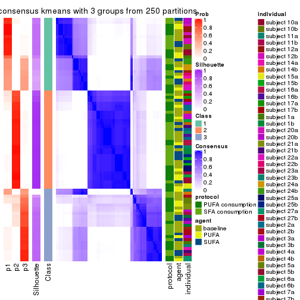</p>

</div>
<div id='tab-SD-kmeans-consensus-heatmap-3'>
<pre><code class="r">consensus_heatmap(res, k = 4)
</code></pre>

<p></p>

</div>
<div id='tab-SD-kmeans-consensus-heatmap-4'>
<pre><code class="r">consensus_heatmap(res, k = 5)
</code></pre>

<p></p>

</div>
<div id='tab-SD-kmeans-consensus-heatmap-5'>
<pre><code class="r">consensus_heatmap(res, k = 6)
</code></pre>

<p></p>

</div>
</div>

Heatmaps for the membership of samples in all partitions to see how consistent they are:


<script>
$( function() {
	$( '#tabs-SD-kmeans-membership-heatmap' ).tabs();
} );
</script>
<div id='tabs-SD-kmeans-membership-heatmap'>
<ul>
<li><a href='#tab-SD-kmeans-membership-heatmap-1'>k = 2</a></li>
<li><a href='#tab-SD-kmeans-membership-heatmap-2'>k = 3</a></li>
<li><a href='#tab-SD-kmeans-membership-heatmap-3'>k = 4</a></li>
<li><a href='#tab-SD-kmeans-membership-heatmap-4'>k = 5</a></li>
<li><a href='#tab-SD-kmeans-membership-heatmap-5'>k = 6</a></li>
</ul>
<div id='tab-SD-kmeans-membership-heatmap-1'>
<pre><code class="r">membership_heatmap(res, k = 2)
</code></pre>

<p>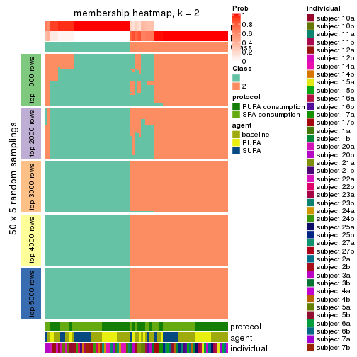</p>

</div>
<div id='tab-SD-kmeans-membership-heatmap-2'>
<pre><code class="r">membership_heatmap(res, k = 3)
</code></pre>

<p></p>

</div>
<div id='tab-SD-kmeans-membership-heatmap-3'>
<pre><code class="r">membership_heatmap(res, k = 4)
</code></pre>

<p></p>

</div>
<div id='tab-SD-kmeans-membership-heatmap-4'>
<pre><code class="r">membership_heatmap(res, k = 5)
</code></pre>

<p></p>

</div>
<div id='tab-SD-kmeans-membership-heatmap-5'>
<pre><code class="r">membership_heatmap(res, k = 6)
</code></pre>

<p></p>

</div>
</div>

As soon as we have had the classes for columns, we can look for signatures
which are significantly different between classes which can be candidate marks
for certain classes. Following are the heatmaps for signatures.


Signature heatmaps where rows are scaled:


<script>
$( function() {
	$( '#tabs-SD-kmeans-get-signatures' ).tabs();
} );
</script>
<div id='tabs-SD-kmeans-get-signatures'>
<ul>
<li><a href='#tab-SD-kmeans-get-signatures-1'>k = 2</a></li>
<li><a href='#tab-SD-kmeans-get-signatures-2'>k = 3</a></li>
<li><a href='#tab-SD-kmeans-get-signatures-3'>k = 4</a></li>
<li><a href='#tab-SD-kmeans-get-signatures-4'>k = 5</a></li>
<li><a href='#tab-SD-kmeans-get-signatures-5'>k = 6</a></li>
</ul>
<div id='tab-SD-kmeans-get-signatures-1'>
<pre><code class="r">get_signatures(res, k = 2)
</code></pre>

<p></p>

</div>
<div id='tab-SD-kmeans-get-signatures-2'>
<pre><code class="r">get_signatures(res, k = 3)
</code></pre>

<p></p>

</div>
<div id='tab-SD-kmeans-get-signatures-3'>
<pre><code class="r">get_signatures(res, k = 4)
</code></pre>

<p></p>

</div>
<div id='tab-SD-kmeans-get-signatures-4'>
<pre><code class="r">get_signatures(res, k = 5)
</code></pre>

<p></p>

</div>
<div id='tab-SD-kmeans-get-signatures-5'>
<pre><code class="r">get_signatures(res, k = 6)
</code></pre>

<p></p>

</div>
</div>


Signature heatmaps where rows are not scaled:


<script>
$( function() {
	$( '#tabs-SD-kmeans-get-signatures-no-scale' ).tabs();
} );
</script>
<div id='tabs-SD-kmeans-get-signatures-no-scale'>
<ul>
<li><a href='#tab-SD-kmeans-get-signatures-no-scale-1'>k = 2</a></li>
<li><a href='#tab-SD-kmeans-get-signatures-no-scale-2'>k = 3</a></li>
<li><a href='#tab-SD-kmeans-get-signatures-no-scale-3'>k = 4</a></li>
<li><a href='#tab-SD-kmeans-get-signatures-no-scale-4'>k = 5</a></li>
<li><a href='#tab-SD-kmeans-get-signatures-no-scale-5'>k = 6</a></li>
</ul>
<div id='tab-SD-kmeans-get-signatures-no-scale-1'>
<pre><code class="r">get_signatures(res, k = 2, scale_rows = FALSE)
</code></pre>

<p></p>

</div>
<div id='tab-SD-kmeans-get-signatures-no-scale-2'>
<pre><code class="r">get_signatures(res, k = 3, scale_rows = FALSE)
</code></pre>

<p></p>

</div>
<div id='tab-SD-kmeans-get-signatures-no-scale-3'>
<pre><code class="r">get_signatures(res, k = 4, scale_rows = FALSE)
</code></pre>

<p></p>

</div>
<div id='tab-SD-kmeans-get-signatures-no-scale-4'>
<pre><code class="r">get_signatures(res, k = 5, scale_rows = FALSE)
</code></pre>

<p></p>

</div>
<div id='tab-SD-kmeans-get-signatures-no-scale-5'>
<pre><code class="r">get_signatures(res, k = 6, scale_rows = FALSE)
</code></pre>

<p></p>

</div>
</div>


Compare the overlap of signatures from different k:

```r
compare_signatures(res)
```


`get_signature()` returns a data frame invisibly. TO get the list of signatures, the function
call should be assigned to a variable explicitly. In following code, if `plot` argument is set
to `FALSE`, no heatmap is plotted while only the differential analysis is performed.

```r
# code only for demonstration
tb = get_signature(res, k = ..., plot = FALSE)
```

An example of the output of `tb` is:

```
#>   which_row         fdr    mean_1    mean_2 scaled_mean_1 scaled_mean_2 km
#> 1        38 0.042760348  8.373488  9.131774    -0.5533452     0.5164555  1
#> 2        40 0.018707592  7.106213  8.469186    -0.6173731     0.5762149  1
#> 3        55 0.019134737 10.221463 11.207825    -0.6159697     0.5749050  1
#> 4        59 0.006059896  5.921854  7.869574    -0.6899429     0.6439467  1
#> 5        60 0.018055526  8.928898 10.211722    -0.6204761     0.5791110  1
#> 6        98 0.009384629 15.714769 14.887706     0.6635654    -0.6193277  2
...
```

The columns in `tb` are:

1. `which_row`: row indices corresponding to the input matrix.
2. `fdr`: FDR for the differential test. 
3. `mean_x`: The mean value in group x.
4. `scaled_mean_x`: The mean value in group x after rows are scaled.
5. `km`: Row groups if k-means clustering is applied to rows.


UMAP plot which shows how samples are separated.


<script>
$( function() {
	$( '#tabs-SD-kmeans-dimension-reduction' ).tabs();
} );
</script>
<div id='tabs-SD-kmeans-dimension-reduction'>
<ul>
<li><a href='#tab-SD-kmeans-dimension-reduction-1'>k = 2</a></li>
<li><a href='#tab-SD-kmeans-dimension-reduction-2'>k = 3</a></li>
<li><a href='#tab-SD-kmeans-dimension-reduction-3'>k = 4</a></li>
<li><a href='#tab-SD-kmeans-dimension-reduction-4'>k = 5</a></li>
<li><a href='#tab-SD-kmeans-dimension-reduction-5'>k = 6</a></li>
</ul>
<div id='tab-SD-kmeans-dimension-reduction-1'>
<pre><code class="r">dimension_reduction(res, k = 2, method = &quot;UMAP&quot;)
</code></pre>

<p>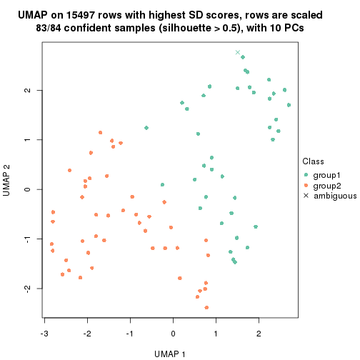</p>

</div>
<div id='tab-SD-kmeans-dimension-reduction-2'>
<pre><code class="r">dimension_reduction(res, k = 3, method = &quot;UMAP&quot;)
</code></pre>

<p></p>

</div>
<div id='tab-SD-kmeans-dimension-reduction-3'>
<pre><code class="r">dimension_reduction(res, k = 4, method = &quot;UMAP&quot;)
</code></pre>

<p></p>

</div>
<div id='tab-SD-kmeans-dimension-reduction-4'>
<pre><code class="r">dimension_reduction(res, k = 5, method = &quot;UMAP&quot;)
</code></pre>

<p></p>

</div>
<div id='tab-SD-kmeans-dimension-reduction-5'>
<pre><code class="r">dimension_reduction(res, k = 6, method = &quot;UMAP&quot;)
</code></pre>

<p></p>

</div>
</div>


Following heatmap shows how subgroups are split when increasing `k`:

```r
collect_classes(res)
```


Test correlation between subgroups and known annotations. If the known
annotation is numeric, one-way ANOVA test is applied, and if the known
annotation is discrete, chi-squared contingency table test is applied.

```r
test_to_known_factors(res)
```

```
#>            n protocol(p) agent(p) individual(p) k
#> SD:kmeans 83       1.000    0.703      1.57e-03 2
#> SD:kmeans 75       0.985    0.993      3.72e-05 3
#> SD:kmeans 81       0.996    0.990      7.14e-08 4
#> SD:kmeans 70       0.941    0.985      3.16e-09 5
#> SD:kmeans 56       0.747    0.965      7.75e-08 6
```


If matrix rows can be associated to genes, consider to use `functional_enrichment(res,
...)` to perform function enrichment for the signature genes. See [this vignette](http://bioconductor.org/packages/devel/bioc/vignettes/cola/inst/doc/functional_enrichment.html) for more detailed explanations.


 

---------------------------------------------------


### SD:skmeans*


The object with results only for a single top-value method and a single partition method 
can be extracted as:

```r
res = res_list["SD", "skmeans"]
# you can also extract it by
# res = res_list["SD:skmeans"]
```

A summary of `res` and all the functions that can be applied to it:

```r
res
```

```
#> A 'ConsensusPartition' object with k = 2, 3, 4, 5, 6.
#>   On a matrix with 15497 rows and 84 columns.
#>   Top rows (1000, 2000, 3000, 4000, 5000) are extracted by 'SD' method.
#>   Subgroups are detected by 'skmeans' method.
#>   Performed in total 1250 partitions by row resampling.
#>   Best k for subgroups seems to be 2.
#> 
#> Following methods can be applied to this 'ConsensusPartition' object:
#>  [1] "cola_report"             "collect_classes"         "collect_plots"          
#>  [4] "collect_stats"           "colnames"                "compare_signatures"     
#>  [7] "consensus_heatmap"       "dimension_reduction"     "functional_enrichment"  
#> [10] "get_anno_col"            "get_anno"                "get_classes"            
#> [13] "get_consensus"           "get_matrix"              "get_membership"         
#> [16] "get_param"               "get_signatures"          "get_stats"              
#> [19] "is_best_k"               "is_stable_k"             "membership_heatmap"     
#> [22] "ncol"                    "nrow"                    "plot_ecdf"              
#> [25] "rownames"                "select_partition_number" "show"                   
#> [28] "suggest_best_k"          "test_to_known_factors"
```

`collect_plots()` function collects all the plots made from `res` for all `k` (number of partitions)
into one single page to provide an easy and fast comparison between different `k`.

```r
collect_plots(res)
```


The plots are:

- The first row: a plot of the ECDF (empirical cumulative distribution
  function) curves of the consensus matrix for each `k` and the heatmap of
  predicted classes for each `k`.
- The second row: heatmaps of the consensus matrix for each `k`.
- The third row: heatmaps of the membership matrix for each `k`.
- The fouth row: heatmaps of the signatures for each `k`.

All the plots in panels can be made by individual functions and they are
plotted later in this section.

`select_partition_number()` produces several plots showing different
statistics for choosing "optimized" `k`. There are following statistics:

- ECDF curves of the consensus matrix for each `k`;
- 1-PAC. [The PAC
  score](https://en.wikipedia.org/wiki/Consensus_clustering#Over-interpretation_potential_of_consensus_clustering)
  measures the proportion of the ambiguous subgrouping.
- Mean silhouette score.
- Concordance. The mean probability of fiting the consensus class ids in all
  partitions.
- Area increased. Denote $A_k$ as the area under the ECDF curve for current
  `k`, the area increased is defined as $A_k - A_{k-1}$.
- Rand index. The percent of pairs of samples that are both in a same cluster
  or both are not in a same cluster in the partition of k and k-1.
- Jaccard index. The ratio of pairs of samples are both in a same cluster in
  the partition of k and k-1 and the pairs of samples are both in a same
  cluster in the partition k or k-1.

The detailed explanations of these statistics can be found in [the _cola_
vignette](http://bioconductor.org/packages/devel/bioc/vignettes/cola/inst/doc/cola.html#toc_13).

Generally speaking, lower PAC score, higher mean silhouette score or higher
concordance corresponds to better partition. Rand index and Jaccard index
measure how similar the current partition is compared to partition with `k-1`.
If they are too similar, we won't accept `k` is better than `k-1`.

```r
select_partition_number(res)
```


The numeric values for all these statistics can be obtained by `get_stats()`.

```r
get_stats(res)
```

```
#>   k 1-PAC mean_silhouette concordance area_increased  Rand Jaccard
#> 2 2 0.903           0.916       0.963         0.5046 0.497   0.497
#> 3 3 0.789           0.863       0.924         0.3149 0.762   0.554
#> 4 4 0.721           0.858       0.874         0.1005 0.919   0.765
#> 5 5 0.716           0.670       0.803         0.0746 0.950   0.822
#> 6 6 0.731           0.685       0.770         0.0446 0.939   0.745
```

`suggest_best_k()` suggests the best $k$ based on these statistics. The rules are as follows:

- All $k$ with Jaccard index larger than 0.95 are removed because increasing
  $k$ does not provide enough extra information. If all $k$ are removed, it is
  marked as no subgroup is detected.
- For all $k$ with 1-PAC score larger than 0.9, the maximal $k$ is taken as
  the best $k$, and other $k$ are marked as optional $k$.
- If it does not fit the second rule. The $k$ with the maximal vote of the
  highest 1-PAC score, highest mean silhouette, and highest concordance is
  taken as the best $k$.

```r
suggest_best_k(res)
```

```
#> [1] 2
```


Following shows the table of the partitions (You need to click the **show/hide
code output** link to see it). The membership matrix (columns with name `p*`)
is inferred by
[`clue::cl_consensus()`](https://www.rdocumentation.org/link/cl_consensus?package=clue)
function with the `SE` method. Basically the value in the membership matrix
represents the probability to belong to a certain group. The finall class
label for an item is determined with the group with highest probability it
belongs to.

In `get_classes()` function, the entropy is calculated from the membership
matrix and the silhouette score is calculated from the consensus matrix.


<script>
$( function() {
	$( '#tabs-SD-skmeans-get-classes' ).tabs();
} );
</script>
<div id='tabs-SD-skmeans-get-classes'>
<ul>
<li><a href='#tab-SD-skmeans-get-classes-1'>k = 2</a></li>
<li><a href='#tab-SD-skmeans-get-classes-2'>k = 3</a></li>
<li><a href='#tab-SD-skmeans-get-classes-3'>k = 4</a></li>
<li><a href='#tab-SD-skmeans-get-classes-4'>k = 5</a></li>
<li><a href='#tab-SD-skmeans-get-classes-5'>k = 6</a></li>
</ul>

<div id='tab-SD-skmeans-get-classes-1'>
<p><a id='tab-SD-skmeans-get-classes-1-a' style='color:#0366d6' href='#'>show/hide code output</a></p>
<pre><code class="r">cbind(get_classes(res, k = 2), get_membership(res, k = 2))
</code></pre>

<pre><code>#&gt;           class entropy silhouette    p1    p2
#&gt; GSM339455     1   0.000      0.977 1.000 0.000
#&gt; GSM339456     2   0.000      0.945 0.000 1.000
#&gt; GSM339457     2   0.886      0.615 0.304 0.696
#&gt; GSM339458     2   0.000      0.945 0.000 1.000
#&gt; GSM339459     2   0.969      0.429 0.396 0.604
#&gt; GSM339460     2   0.000      0.945 0.000 1.000
#&gt; GSM339461     2   0.000      0.945 0.000 1.000
#&gt; GSM339462     1   0.000      0.977 1.000 0.000
#&gt; GSM339463     1   0.000      0.977 1.000 0.000
#&gt; GSM339464     1   0.204      0.951 0.968 0.032
#&gt; GSM339465     1   0.000      0.977 1.000 0.000
#&gt; GSM339466     2   0.000      0.945 0.000 1.000
#&gt; GSM339467     2   0.000      0.945 0.000 1.000
#&gt; GSM339468     2   0.000      0.945 0.000 1.000
#&gt; GSM339469     1   0.204      0.951 0.968 0.032
#&gt; GSM339470     2   0.204      0.924 0.032 0.968
#&gt; GSM339471     1   0.000      0.977 1.000 0.000
#&gt; GSM339472     2   0.000      0.945 0.000 1.000
#&gt; GSM339473     1   0.000      0.977 1.000 0.000
#&gt; GSM339474     2   0.000      0.945 0.000 1.000
#&gt; GSM339475     1   0.000      0.977 1.000 0.000
#&gt; GSM339476     1   0.000      0.977 1.000 0.000
#&gt; GSM339477     2   0.000      0.945 0.000 1.000
#&gt; GSM339478     2   0.204      0.924 0.032 0.968
#&gt; GSM339479     2   0.000      0.945 0.000 1.000
#&gt; GSM339480     2   0.971      0.419 0.400 0.600
#&gt; GSM339481     2   0.000      0.945 0.000 1.000
#&gt; GSM339482     1   0.000      0.977 1.000 0.000
#&gt; GSM339483     1   0.000      0.977 1.000 0.000
#&gt; GSM339484     1   0.000      0.977 1.000 0.000
#&gt; GSM339485     1   0.204      0.951 0.968 0.032
#&gt; GSM339486     1   0.000      0.977 1.000 0.000
#&gt; GSM339487     2   0.000      0.945 0.000 1.000
#&gt; GSM339488     2   0.000      0.945 0.000 1.000
#&gt; GSM339489     2   0.000      0.945 0.000 1.000
#&gt; GSM339490     1   0.204      0.951 0.968 0.032
#&gt; GSM339491     2   0.184      0.926 0.028 0.972
#&gt; GSM339492     1   0.000      0.977 1.000 0.000
#&gt; GSM339493     2   0.000      0.945 0.000 1.000
#&gt; GSM339494     1   0.000      0.977 1.000 0.000
#&gt; GSM339495     2   0.000      0.945 0.000 1.000
#&gt; GSM339496     1   0.000      0.977 1.000 0.000
#&gt; GSM339497     2   0.000      0.945 0.000 1.000
#&gt; GSM339498     2   0.753      0.740 0.216 0.784
#&gt; GSM339499     2   0.876      0.629 0.296 0.704
#&gt; GSM339500     2   0.000      0.945 0.000 1.000
#&gt; GSM339501     1   0.000      0.977 1.000 0.000
#&gt; GSM339502     2   0.000      0.945 0.000 1.000
#&gt; GSM339503     1   0.000      0.977 1.000 0.000
#&gt; GSM339504     1   0.000      0.977 1.000 0.000
#&gt; GSM339505     2   0.881      0.622 0.300 0.700
#&gt; GSM339506     1   0.000      0.977 1.000 0.000
#&gt; GSM339507     1   0.000      0.977 1.000 0.000
#&gt; GSM339508     2   0.000      0.945 0.000 1.000
#&gt; GSM339509     2   0.000      0.945 0.000 1.000
#&gt; GSM339510     2   0.000      0.945 0.000 1.000
#&gt; GSM339511     1   0.958      0.395 0.620 0.380
#&gt; GSM339512     2   0.000      0.945 0.000 1.000
#&gt; GSM339513     1   0.000      0.977 1.000 0.000
#&gt; GSM339514     2   0.000      0.945 0.000 1.000
#&gt; GSM339515     1   0.000      0.977 1.000 0.000
#&gt; GSM339516     2   0.000      0.945 0.000 1.000
#&gt; GSM339517     1   0.000      0.977 1.000 0.000
#&gt; GSM339518     2   0.000      0.945 0.000 1.000
#&gt; GSM339519     1   0.000      0.977 1.000 0.000
#&gt; GSM339520     2   0.224      0.921 0.036 0.964
#&gt; GSM339521     2   0.000      0.945 0.000 1.000
#&gt; GSM339522     2   0.000      0.945 0.000 1.000
#&gt; GSM339523     2   0.000      0.945 0.000 1.000
#&gt; GSM339524     1   0.000      0.977 1.000 0.000
#&gt; GSM339525     1   0.000      0.977 1.000 0.000
#&gt; GSM339526     1   0.000      0.977 1.000 0.000
#&gt; GSM339527     1   0.000      0.977 1.000 0.000
#&gt; GSM339528     1   0.000      0.977 1.000 0.000
#&gt; GSM339529     2   0.000      0.945 0.000 1.000
#&gt; GSM339530     2   0.876      0.629 0.296 0.704
#&gt; GSM339531     2   0.000      0.945 0.000 1.000
#&gt; GSM339532     1   0.876      0.576 0.704 0.296
#&gt; GSM339533     1   0.000      0.977 1.000 0.000
#&gt; GSM339534     1   0.000      0.977 1.000 0.000
#&gt; GSM339535     2   0.000      0.945 0.000 1.000
#&gt; GSM339536     1   0.000      0.977 1.000 0.000
#&gt; GSM339537     2   0.000      0.945 0.000 1.000
#&gt; GSM339538     1   0.000      0.977 1.000 0.000
</code></pre>

<script>
$('#tab-SD-skmeans-get-classes-1-a').parent().next().next().hide();
$('#tab-SD-skmeans-get-classes-1-a').click(function(){
  $('#tab-SD-skmeans-get-classes-1-a').parent().next().next().toggle();
  return(false);
});
</script>
</div>

<div id='tab-SD-skmeans-get-classes-2'>
<p><a id='tab-SD-skmeans-get-classes-2-a' style='color:#0366d6' href='#'>show/hide code output</a></p>
<pre><code class="r">cbind(get_classes(res, k = 3), get_membership(res, k = 3))
</code></pre>

<pre><code>#&gt;           class entropy silhouette    p1    p2    p3
#&gt; GSM339455     3  0.6252     -0.152 0.444 0.000 0.556
#&gt; GSM339456     2  0.2165      0.930 0.064 0.936 0.000
#&gt; GSM339457     3  0.0000      0.907 0.000 0.000 1.000
#&gt; GSM339458     2  0.0237      0.967 0.000 0.996 0.004
#&gt; GSM339459     3  0.5016      0.676 0.240 0.000 0.760
#&gt; GSM339460     2  0.0000      0.970 0.000 1.000 0.000
#&gt; GSM339461     2  0.2165      0.930 0.064 0.936 0.000
#&gt; GSM339462     1  0.0000      0.825 1.000 0.000 0.000
#&gt; GSM339463     3  0.3192      0.795 0.112 0.000 0.888
#&gt; GSM339464     1  0.0000      0.825 1.000 0.000 0.000
#&gt; GSM339465     3  0.3192      0.795 0.112 0.000 0.888
#&gt; GSM339466     2  0.0000      0.970 0.000 1.000 0.000
#&gt; GSM339467     2  0.0000      0.970 0.000 1.000 0.000
#&gt; GSM339468     2  0.4504      0.813 0.196 0.804 0.000
#&gt; GSM339469     1  0.0000      0.825 1.000 0.000 0.000
#&gt; GSM339470     3  0.2261      0.853 0.000 0.068 0.932
#&gt; GSM339471     1  0.5138      0.795 0.748 0.000 0.252
#&gt; GSM339472     2  0.0000      0.970 0.000 1.000 0.000
#&gt; GSM339473     1  0.5058      0.799 0.756 0.000 0.244
#&gt; GSM339474     2  0.0000      0.970 0.000 1.000 0.000
#&gt; GSM339475     3  0.0000      0.907 0.000 0.000 1.000
#&gt; GSM339476     1  0.4504      0.808 0.804 0.000 0.196
#&gt; GSM339477     2  0.2066      0.933 0.060 0.940 0.000
#&gt; GSM339478     3  0.0237      0.905 0.000 0.004 0.996
#&gt; GSM339479     2  0.1267      0.950 0.024 0.972 0.004
#&gt; GSM339480     3  0.5016      0.676 0.240 0.000 0.760
#&gt; GSM339481     2  0.0000      0.970 0.000 1.000 0.000
#&gt; GSM339482     3  0.0237      0.906 0.004 0.000 0.996
#&gt; GSM339483     1  0.0000      0.825 1.000 0.000 0.000
#&gt; GSM339484     1  0.6045      0.624 0.620 0.000 0.380
#&gt; GSM339485     1  0.0000      0.825 1.000 0.000 0.000
#&gt; GSM339486     1  0.5706      0.725 0.680 0.000 0.320
#&gt; GSM339487     2  0.0000      0.970 0.000 1.000 0.000
#&gt; GSM339488     2  0.0000      0.970 0.000 1.000 0.000
#&gt; GSM339489     2  0.4504      0.813 0.196 0.804 0.000
#&gt; GSM339490     1  0.0000      0.825 1.000 0.000 0.000
#&gt; GSM339491     3  0.2537      0.841 0.000 0.080 0.920
#&gt; GSM339492     1  0.5138      0.795 0.748 0.000 0.252
#&gt; GSM339493     2  0.0000      0.970 0.000 1.000 0.000
#&gt; GSM339494     1  0.5058      0.799 0.756 0.000 0.244
#&gt; GSM339495     2  0.0000      0.970 0.000 1.000 0.000
#&gt; GSM339496     3  0.0000      0.907 0.000 0.000 1.000
#&gt; GSM339497     2  0.0000      0.970 0.000 1.000 0.000
#&gt; GSM339498     3  0.6208      0.675 0.200 0.048 0.752
#&gt; GSM339499     3  0.0000      0.907 0.000 0.000 1.000
#&gt; GSM339500     2  0.0237      0.967 0.000 0.996 0.004
#&gt; GSM339501     1  0.0000      0.825 1.000 0.000 0.000
#&gt; GSM339502     2  0.0000      0.970 0.000 1.000 0.000
#&gt; GSM339503     3  0.0237      0.906 0.004 0.000 0.996
#&gt; GSM339504     1  0.0000      0.825 1.000 0.000 0.000
#&gt; GSM339505     3  0.0000      0.907 0.000 0.000 1.000
#&gt; GSM339506     1  0.0000      0.825 1.000 0.000 0.000
#&gt; GSM339507     1  0.5706      0.725 0.680 0.000 0.320
#&gt; GSM339508     2  0.0000      0.970 0.000 1.000 0.000
#&gt; GSM339509     2  0.0000      0.970 0.000 1.000 0.000
#&gt; GSM339510     2  0.4504      0.813 0.196 0.804 0.000
#&gt; GSM339511     1  0.0237      0.823 0.996 0.004 0.000
#&gt; GSM339512     2  0.0000      0.970 0.000 1.000 0.000
#&gt; GSM339513     1  0.5098      0.797 0.752 0.000 0.248
#&gt; GSM339514     2  0.0000      0.970 0.000 1.000 0.000
#&gt; GSM339515     1  0.5058      0.799 0.756 0.000 0.244
#&gt; GSM339516     2  0.0000      0.970 0.000 1.000 0.000
#&gt; GSM339517     3  0.0237      0.906 0.004 0.000 0.996
#&gt; GSM339518     2  0.0000      0.970 0.000 1.000 0.000
#&gt; GSM339519     3  0.0237      0.906 0.004 0.000 0.996
#&gt; GSM339520     3  0.0000      0.907 0.000 0.000 1.000
#&gt; GSM339521     2  0.0000      0.970 0.000 1.000 0.000
#&gt; GSM339522     2  0.0424      0.966 0.008 0.992 0.000
#&gt; GSM339523     2  0.0000      0.970 0.000 1.000 0.000
#&gt; GSM339524     1  0.5178      0.791 0.744 0.000 0.256
#&gt; GSM339525     1  0.0000      0.825 1.000 0.000 0.000
#&gt; GSM339526     3  0.0000      0.907 0.000 0.000 1.000
#&gt; GSM339527     1  0.0000      0.825 1.000 0.000 0.000
#&gt; GSM339528     1  0.5706      0.725 0.680 0.000 0.320
#&gt; GSM339529     2  0.0000      0.970 0.000 1.000 0.000
#&gt; GSM339530     3  0.0000      0.907 0.000 0.000 1.000
#&gt; GSM339531     2  0.4504      0.813 0.196 0.804 0.000
#&gt; GSM339532     1  0.0237      0.823 0.996 0.004 0.000
#&gt; GSM339533     3  0.0000      0.907 0.000 0.000 1.000
#&gt; GSM339534     1  0.5138      0.795 0.748 0.000 0.252
#&gt; GSM339535     2  0.0000      0.970 0.000 1.000 0.000
#&gt; GSM339536     1  0.5058      0.799 0.756 0.000 0.244
#&gt; GSM339537     2  0.0000      0.970 0.000 1.000 0.000
#&gt; GSM339538     3  0.0237      0.906 0.004 0.000 0.996
</code></pre>

<script>
$('#tab-SD-skmeans-get-classes-2-a').parent().next().next().hide();
$('#tab-SD-skmeans-get-classes-2-a').click(function(){
  $('#tab-SD-skmeans-get-classes-2-a').parent().next().next().toggle();
  return(false);
});
</script>
</div>

<div id='tab-SD-skmeans-get-classes-3'>
<p><a id='tab-SD-skmeans-get-classes-3-a' style='color:#0366d6' href='#'>show/hide code output</a></p>
<pre><code class="r">cbind(get_classes(res, k = 4), get_membership(res, k = 4))
</code></pre>

<pre><code>#&gt;           class entropy silhouette    p1    p2    p3    p4
#&gt; GSM339455     1  0.5008      0.692 0.732 0.000 0.228 0.040
#&gt; GSM339456     2  0.0804      0.914 0.000 0.980 0.008 0.012
#&gt; GSM339457     3  0.0592      0.819 0.016 0.000 0.984 0.000
#&gt; GSM339458     2  0.5768      0.801 0.060 0.752 0.144 0.044
#&gt; GSM339459     3  0.5149      0.790 0.084 0.012 0.780 0.124
#&gt; GSM339460     2  0.3266      0.892 0.000 0.876 0.084 0.040
#&gt; GSM339461     2  0.0927      0.915 0.000 0.976 0.008 0.016
#&gt; GSM339462     4  0.2216      0.993 0.092 0.000 0.000 0.908
#&gt; GSM339463     1  0.2704      0.769 0.876 0.000 0.124 0.000
#&gt; GSM339464     4  0.2216      0.993 0.092 0.000 0.000 0.908
#&gt; GSM339465     1  0.2011      0.801 0.920 0.000 0.080 0.000
#&gt; GSM339466     2  0.0376      0.917 0.000 0.992 0.004 0.004
#&gt; GSM339467     2  0.1978      0.909 0.000 0.928 0.068 0.004
#&gt; GSM339468     2  0.3710      0.790 0.000 0.804 0.004 0.192
#&gt; GSM339469     4  0.2216      0.993 0.092 0.000 0.000 0.908
#&gt; GSM339470     3  0.3852      0.740 0.192 0.008 0.800 0.000
#&gt; GSM339471     1  0.3533      0.861 0.864 0.000 0.080 0.056
#&gt; GSM339472     2  0.0000      0.918 0.000 1.000 0.000 0.000
#&gt; GSM339473     1  0.2048      0.876 0.928 0.000 0.008 0.064
#&gt; GSM339474     2  0.0188      0.918 0.000 0.996 0.004 0.000
#&gt; GSM339475     3  0.3610      0.829 0.200 0.000 0.800 0.000
#&gt; GSM339476     1  0.6805      0.230 0.500 0.000 0.100 0.400
#&gt; GSM339477     2  0.0804      0.914 0.000 0.980 0.008 0.012
#&gt; GSM339478     3  0.0592      0.819 0.016 0.000 0.984 0.000
#&gt; GSM339479     2  0.8500      0.218 0.060 0.432 0.144 0.364
#&gt; GSM339480     3  0.5149      0.790 0.084 0.012 0.780 0.124
#&gt; GSM339481     2  0.0188      0.918 0.000 0.996 0.000 0.004
#&gt; GSM339482     3  0.4040      0.792 0.248 0.000 0.752 0.000
#&gt; GSM339483     4  0.2216      0.993 0.092 0.000 0.000 0.908
#&gt; GSM339484     1  0.1284      0.865 0.964 0.000 0.024 0.012
#&gt; GSM339485     4  0.2216      0.993 0.092 0.000 0.000 0.908
#&gt; GSM339486     1  0.1174      0.866 0.968 0.000 0.020 0.012
#&gt; GSM339487     2  0.0376      0.917 0.000 0.992 0.004 0.004
#&gt; GSM339488     2  0.2053      0.909 0.000 0.924 0.072 0.004
#&gt; GSM339489     2  0.3448      0.812 0.000 0.828 0.004 0.168
#&gt; GSM339490     4  0.2216      0.993 0.092 0.000 0.000 0.908
#&gt; GSM339491     3  0.4276      0.736 0.192 0.016 0.788 0.004
#&gt; GSM339492     1  0.3667      0.858 0.856 0.000 0.088 0.056
#&gt; GSM339493     2  0.0188      0.918 0.000 0.996 0.000 0.004
#&gt; GSM339494     1  0.2048      0.876 0.928 0.000 0.008 0.064
#&gt; GSM339495     2  0.0188      0.918 0.000 0.996 0.004 0.000
#&gt; GSM339496     3  0.3610      0.829 0.200 0.000 0.800 0.000
#&gt; GSM339497     2  0.3216      0.893 0.000 0.880 0.076 0.044
#&gt; GSM339498     3  0.5752      0.688 0.008 0.084 0.720 0.188
#&gt; GSM339499     3  0.0592      0.819 0.016 0.000 0.984 0.000
#&gt; GSM339500     2  0.5451      0.795 0.024 0.748 0.184 0.044
#&gt; GSM339501     4  0.1576      0.931 0.048 0.000 0.004 0.948
#&gt; GSM339502     2  0.1978      0.909 0.000 0.928 0.068 0.004
#&gt; GSM339503     3  0.3908      0.824 0.212 0.000 0.784 0.004
#&gt; GSM339504     4  0.2216      0.993 0.092 0.000 0.000 0.908
#&gt; GSM339505     3  0.3569      0.814 0.196 0.000 0.804 0.000
#&gt; GSM339506     4  0.2216      0.993 0.092 0.000 0.000 0.908
#&gt; GSM339507     1  0.1174      0.866 0.968 0.000 0.020 0.012
#&gt; GSM339508     2  0.0188      0.918 0.000 0.996 0.004 0.000
#&gt; GSM339509     2  0.2053      0.909 0.000 0.924 0.072 0.004
#&gt; GSM339510     2  0.3751      0.785 0.000 0.800 0.004 0.196
#&gt; GSM339511     4  0.2401      0.990 0.092 0.000 0.004 0.904
#&gt; GSM339512     2  0.3380      0.871 0.008 0.852 0.136 0.004
#&gt; GSM339513     1  0.3392      0.861 0.872 0.000 0.072 0.056
#&gt; GSM339514     2  0.1978      0.909 0.000 0.928 0.068 0.004
#&gt; GSM339515     1  0.2048      0.876 0.928 0.000 0.008 0.064
#&gt; GSM339516     2  0.0376      0.917 0.000 0.992 0.004 0.004
#&gt; GSM339517     3  0.3688      0.827 0.208 0.000 0.792 0.000
#&gt; GSM339518     2  0.3286      0.892 0.000 0.876 0.080 0.044
#&gt; GSM339519     3  0.3726      0.824 0.212 0.000 0.788 0.000
#&gt; GSM339520     3  0.0592      0.819 0.016 0.000 0.984 0.000
#&gt; GSM339521     2  0.3457      0.891 0.008 0.876 0.076 0.040
#&gt; GSM339522     2  0.1722      0.900 0.000 0.944 0.008 0.048
#&gt; GSM339523     2  0.1902      0.910 0.000 0.932 0.064 0.004
#&gt; GSM339524     1  0.4094      0.825 0.828 0.000 0.116 0.056
#&gt; GSM339525     4  0.2216      0.993 0.092 0.000 0.000 0.908
#&gt; GSM339526     3  0.3688      0.826 0.208 0.000 0.792 0.000
#&gt; GSM339527     4  0.2216      0.993 0.092 0.000 0.000 0.908
#&gt; GSM339528     1  0.1174      0.866 0.968 0.000 0.020 0.012
#&gt; GSM339529     2  0.0188      0.918 0.000 0.996 0.004 0.000
#&gt; GSM339530     3  0.0592      0.819 0.016 0.000 0.984 0.000
#&gt; GSM339531     2  0.3402      0.815 0.000 0.832 0.004 0.164
#&gt; GSM339532     4  0.2401      0.990 0.092 0.000 0.004 0.904
#&gt; GSM339533     3  0.4304      0.740 0.284 0.000 0.716 0.000
#&gt; GSM339534     1  0.3919      0.850 0.840 0.000 0.104 0.056
#&gt; GSM339535     2  0.1661      0.914 0.000 0.944 0.052 0.004
#&gt; GSM339536     1  0.2048      0.876 0.928 0.000 0.008 0.064
#&gt; GSM339537     2  0.0376      0.917 0.000 0.992 0.004 0.004
#&gt; GSM339538     3  0.3764      0.822 0.216 0.000 0.784 0.000
</code></pre>

<script>
$('#tab-SD-skmeans-get-classes-3-a').parent().next().next().hide();
$('#tab-SD-skmeans-get-classes-3-a').click(function(){
  $('#tab-SD-skmeans-get-classes-3-a').parent().next().next().toggle();
  return(false);
});
</script>
</div>

<div id='tab-SD-skmeans-get-classes-4'>
<p><a id='tab-SD-skmeans-get-classes-4-a' style='color:#0366d6' href='#'>show/hide code output</a></p>
<pre><code class="r">cbind(get_classes(res, k = 5), get_membership(res, k = 5))
</code></pre>

<pre><code>#&gt;           class entropy silhouette    p1    p2    p3    p4    p5
#&gt; GSM339455     1  0.7249     0.1525 0.384 0.000 0.312 0.020 0.284
#&gt; GSM339456     2  0.2339     0.6526 0.000 0.892 0.004 0.004 0.100
#&gt; GSM339457     3  0.3399     0.7342 0.020 0.000 0.812 0.000 0.168
#&gt; GSM339458     5  0.5110     0.7481 0.028 0.288 0.024 0.000 0.660
#&gt; GSM339459     3  0.5138     0.6207 0.024 0.012 0.688 0.020 0.256
#&gt; GSM339460     2  0.4449    -0.5243 0.000 0.512 0.004 0.000 0.484
#&gt; GSM339461     2  0.3461     0.6127 0.000 0.812 0.004 0.016 0.168
#&gt; GSM339462     4  0.0162     0.9411 0.000 0.000 0.000 0.996 0.004
#&gt; GSM339463     1  0.3130     0.7270 0.856 0.000 0.096 0.000 0.048
#&gt; GSM339464     4  0.0324     0.9402 0.004 0.004 0.000 0.992 0.000
#&gt; GSM339465     1  0.1168     0.8179 0.960 0.000 0.032 0.000 0.008
#&gt; GSM339466     2  0.1121     0.6980 0.000 0.956 0.000 0.000 0.044
#&gt; GSM339467     2  0.3039     0.6030 0.000 0.836 0.012 0.000 0.152
#&gt; GSM339468     2  0.5594     0.4217 0.020 0.636 0.004 0.052 0.288
#&gt; GSM339469     4  0.0162     0.9409 0.000 0.004 0.000 0.996 0.000
#&gt; GSM339470     3  0.6303     0.5011 0.196 0.000 0.524 0.000 0.280
#&gt; GSM339471     1  0.5020     0.8038 0.752 0.000 0.120 0.092 0.036
#&gt; GSM339472     2  0.1638     0.6803 0.000 0.932 0.004 0.000 0.064
#&gt; GSM339473     1  0.2793     0.8465 0.876 0.000 0.036 0.088 0.000
#&gt; GSM339474     2  0.0794     0.6955 0.000 0.972 0.000 0.000 0.028
#&gt; GSM339475     3  0.2377     0.7573 0.128 0.000 0.872 0.000 0.000
#&gt; GSM339476     4  0.6498     0.3424 0.240 0.000 0.136 0.588 0.036
#&gt; GSM339477     2  0.1731     0.6802 0.000 0.932 0.004 0.004 0.060
#&gt; GSM339478     3  0.3399     0.7342 0.020 0.000 0.812 0.000 0.168
#&gt; GSM339479     5  0.6359     0.6666 0.040 0.184 0.024 0.092 0.660
#&gt; GSM339480     3  0.5138     0.6207 0.024 0.012 0.688 0.020 0.256
#&gt; GSM339481     2  0.2338     0.6476 0.000 0.884 0.004 0.000 0.112
#&gt; GSM339482     3  0.3048     0.7112 0.176 0.000 0.820 0.000 0.004
#&gt; GSM339483     4  0.0162     0.9411 0.000 0.000 0.000 0.996 0.004
#&gt; GSM339484     1  0.1503     0.8280 0.952 0.000 0.020 0.020 0.008
#&gt; GSM339485     4  0.0162     0.9409 0.000 0.004 0.000 0.996 0.000
#&gt; GSM339486     1  0.1299     0.8312 0.960 0.000 0.012 0.020 0.008
#&gt; GSM339487     2  0.1197     0.6972 0.000 0.952 0.000 0.000 0.048
#&gt; GSM339488     2  0.3039     0.6030 0.000 0.836 0.012 0.000 0.152
#&gt; GSM339489     2  0.5523     0.4193 0.020 0.632 0.004 0.044 0.300
#&gt; GSM339490     4  0.0162     0.9409 0.000 0.004 0.000 0.996 0.000
#&gt; GSM339491     3  0.6682     0.4835 0.200 0.012 0.508 0.000 0.280
#&gt; GSM339492     1  0.5065     0.8022 0.748 0.000 0.124 0.092 0.036
#&gt; GSM339493     2  0.2011     0.6838 0.000 0.908 0.004 0.000 0.088
#&gt; GSM339494     1  0.2793     0.8465 0.876 0.000 0.036 0.088 0.000
#&gt; GSM339495     2  0.0703     0.6961 0.000 0.976 0.000 0.000 0.024
#&gt; GSM339496     3  0.2377     0.7573 0.128 0.000 0.872 0.000 0.000
#&gt; GSM339497     2  0.4562    -0.5778 0.000 0.496 0.008 0.000 0.496
#&gt; GSM339498     3  0.6440     0.5947 0.016 0.080 0.640 0.052 0.212
#&gt; GSM339499     3  0.3399     0.7342 0.020 0.000 0.812 0.000 0.168
#&gt; GSM339500     5  0.4599     0.7368 0.000 0.272 0.040 0.000 0.688
#&gt; GSM339501     4  0.4301     0.6879 0.020 0.000 0.008 0.728 0.244
#&gt; GSM339502     2  0.3039     0.6030 0.000 0.836 0.012 0.000 0.152
#&gt; GSM339503     3  0.3005     0.7529 0.124 0.000 0.856 0.012 0.008
#&gt; GSM339504     4  0.0162     0.9411 0.000 0.000 0.000 0.996 0.004
#&gt; GSM339505     3  0.4168     0.7125 0.200 0.000 0.756 0.000 0.044
#&gt; GSM339506     4  0.0451     0.9384 0.008 0.000 0.000 0.988 0.004
#&gt; GSM339507     1  0.1280     0.8328 0.960 0.000 0.008 0.024 0.008
#&gt; GSM339508     2  0.0671     0.7000 0.000 0.980 0.000 0.004 0.016
#&gt; GSM339509     2  0.3039     0.6030 0.000 0.836 0.012 0.000 0.152
#&gt; GSM339510     2  0.6173     0.3349 0.020 0.560 0.004 0.080 0.336
#&gt; GSM339511     4  0.0451     0.9374 0.000 0.008 0.000 0.988 0.004
#&gt; GSM339512     2  0.5446    -0.0705 0.012 0.592 0.048 0.000 0.348
#&gt; GSM339513     1  0.4403     0.8059 0.772 0.000 0.132 0.092 0.004
#&gt; GSM339514     2  0.2997     0.6070 0.000 0.840 0.012 0.000 0.148
#&gt; GSM339515     1  0.2793     0.8465 0.876 0.000 0.036 0.088 0.000
#&gt; GSM339516     2  0.1270     0.6938 0.000 0.948 0.000 0.000 0.052
#&gt; GSM339517     3  0.2329     0.7575 0.124 0.000 0.876 0.000 0.000
#&gt; GSM339518     5  0.4451     0.4753 0.000 0.492 0.004 0.000 0.504
#&gt; GSM339519     3  0.2935     0.7552 0.120 0.000 0.860 0.004 0.016
#&gt; GSM339520     3  0.3399     0.7342 0.020 0.000 0.812 0.000 0.168
#&gt; GSM339521     5  0.4283     0.5743 0.000 0.456 0.000 0.000 0.544
#&gt; GSM339522     2  0.4552     0.4547 0.020 0.668 0.004 0.000 0.308
#&gt; GSM339523     2  0.3039     0.6030 0.000 0.836 0.012 0.000 0.152
#&gt; GSM339524     1  0.5032     0.7034 0.692 0.000 0.228 0.076 0.004
#&gt; GSM339525     4  0.0162     0.9411 0.000 0.000 0.000 0.996 0.004
#&gt; GSM339526     3  0.2605     0.7517 0.148 0.000 0.852 0.000 0.000
#&gt; GSM339527     4  0.0451     0.9384 0.008 0.000 0.000 0.988 0.004
#&gt; GSM339528     1  0.1280     0.8328 0.960 0.000 0.008 0.024 0.008
#&gt; GSM339529     2  0.0671     0.7000 0.000 0.980 0.000 0.004 0.016
#&gt; GSM339530     3  0.3449     0.7353 0.024 0.000 0.812 0.000 0.164
#&gt; GSM339531     2  0.5466     0.4304 0.020 0.644 0.004 0.044 0.288
#&gt; GSM339532     4  0.0290     0.9392 0.000 0.008 0.000 0.992 0.000
#&gt; GSM339533     3  0.6152     0.5036 0.324 0.000 0.524 0.000 0.152
#&gt; GSM339534     1  0.5235     0.7959 0.740 0.000 0.120 0.092 0.048
#&gt; GSM339535     2  0.2304     0.6760 0.000 0.892 0.008 0.000 0.100
#&gt; GSM339536     1  0.2793     0.8465 0.876 0.000 0.036 0.088 0.000
#&gt; GSM339537     2  0.1270     0.6938 0.000 0.948 0.000 0.000 0.052
#&gt; GSM339538     3  0.2424     0.7542 0.132 0.000 0.868 0.000 0.000
</code></pre>

<script>
$('#tab-SD-skmeans-get-classes-4-a').parent().next().next().hide();
$('#tab-SD-skmeans-get-classes-4-a').click(function(){
  $('#tab-SD-skmeans-get-classes-4-a').parent().next().next().toggle();
  return(false);
});
</script>
</div>

<div id='tab-SD-skmeans-get-classes-5'>
<p><a id='tab-SD-skmeans-get-classes-5-a' style='color:#0366d6' href='#'>show/hide code output</a></p>
<pre><code class="r">cbind(get_classes(res, k = 6), get_membership(res, k = 6))
</code></pre>

<pre><code>#&gt;           class entropy silhouette    p1    p2    p3    p4    p5    p6
#&gt; GSM339455     6  0.7380     0.0401 0.288 0.000 0.172 0.020 0.092 0.428
#&gt; GSM339456     2  0.2597     0.6049 0.000 0.824 0.000 0.000 0.176 0.000
#&gt; GSM339457     3  0.5687     0.5716 0.020 0.000 0.592 0.000 0.228 0.160
#&gt; GSM339458     6  0.2356     0.7422 0.016 0.096 0.000 0.000 0.004 0.884
#&gt; GSM339459     3  0.3961     0.2993 0.000 0.000 0.556 0.004 0.440 0.000
#&gt; GSM339460     6  0.3756     0.5651 0.000 0.352 0.000 0.000 0.004 0.644
#&gt; GSM339461     2  0.4792     0.4384 0.000 0.672 0.000 0.000 0.180 0.148
#&gt; GSM339462     4  0.0984     0.9416 0.012 0.000 0.000 0.968 0.012 0.008
#&gt; GSM339463     1  0.5087     0.5995 0.712 0.000 0.100 0.000 0.116 0.072
#&gt; GSM339464     4  0.0291     0.9471 0.000 0.000 0.000 0.992 0.004 0.004
#&gt; GSM339465     1  0.1434     0.8206 0.940 0.000 0.000 0.000 0.048 0.012
#&gt; GSM339466     2  0.2263     0.7310 0.000 0.884 0.000 0.000 0.100 0.016
#&gt; GSM339467     2  0.3042     0.7556 0.000 0.836 0.004 0.000 0.032 0.128
#&gt; GSM339468     5  0.4076     0.7498 0.000 0.364 0.000 0.016 0.620 0.000
#&gt; GSM339469     4  0.0000     0.9482 0.000 0.000 0.000 1.000 0.000 0.000
#&gt; GSM339470     3  0.7699     0.4074 0.148 0.012 0.380 0.000 0.236 0.224
#&gt; GSM339471     1  0.4568     0.7792 0.780 0.000 0.080 0.060 0.052 0.028
#&gt; GSM339472     2  0.1643     0.7804 0.000 0.924 0.000 0.000 0.008 0.068
#&gt; GSM339473     1  0.2152     0.8332 0.904 0.000 0.024 0.068 0.000 0.004
#&gt; GSM339474     2  0.2145     0.7529 0.000 0.900 0.000 0.000 0.072 0.028
#&gt; GSM339475     3  0.1908     0.6537 0.096 0.000 0.900 0.000 0.004 0.000
#&gt; GSM339476     4  0.6308     0.3823 0.224 0.000 0.132 0.580 0.048 0.016
#&gt; GSM339477     2  0.2320     0.6859 0.000 0.864 0.000 0.000 0.132 0.004
#&gt; GSM339478     3  0.5708     0.5692 0.020 0.000 0.588 0.000 0.232 0.160
#&gt; GSM339479     6  0.2658     0.7290 0.016 0.072 0.000 0.024 0.004 0.884
#&gt; GSM339480     3  0.3966     0.2927 0.000 0.000 0.552 0.004 0.444 0.000
#&gt; GSM339481     2  0.2302     0.7675 0.000 0.872 0.000 0.000 0.008 0.120
#&gt; GSM339482     3  0.3490     0.5631 0.176 0.000 0.784 0.000 0.040 0.000
#&gt; GSM339483     4  0.0984     0.9416 0.012 0.000 0.000 0.968 0.012 0.008
#&gt; GSM339484     1  0.2400     0.8021 0.896 0.000 0.024 0.000 0.064 0.016
#&gt; GSM339485     4  0.0291     0.9471 0.000 0.000 0.000 0.992 0.004 0.004
#&gt; GSM339486     1  0.1434     0.8206 0.940 0.000 0.000 0.000 0.048 0.012
#&gt; GSM339487     2  0.2350     0.7288 0.000 0.880 0.000 0.000 0.100 0.020
#&gt; GSM339488     2  0.3042     0.7556 0.000 0.836 0.004 0.000 0.032 0.128
#&gt; GSM339489     5  0.4046     0.7491 0.000 0.368 0.000 0.008 0.620 0.004
#&gt; GSM339490     4  0.0000     0.9482 0.000 0.000 0.000 1.000 0.000 0.000
#&gt; GSM339491     3  0.7962     0.3878 0.148 0.028 0.364 0.000 0.236 0.224
#&gt; GSM339492     1  0.4618     0.7771 0.776 0.000 0.084 0.060 0.052 0.028
#&gt; GSM339493     2  0.1686     0.7793 0.000 0.924 0.000 0.000 0.012 0.064
#&gt; GSM339494     1  0.2152     0.8332 0.904 0.000 0.024 0.068 0.000 0.004
#&gt; GSM339495     2  0.2039     0.7462 0.000 0.904 0.000 0.000 0.076 0.020
#&gt; GSM339496     3  0.1908     0.6537 0.096 0.000 0.900 0.000 0.004 0.000
#&gt; GSM339497     6  0.3790     0.6973 0.004 0.264 0.000 0.000 0.016 0.716
#&gt; GSM339498     3  0.4748     0.3450 0.000 0.028 0.564 0.004 0.396 0.008
#&gt; GSM339499     3  0.5687     0.5716 0.020 0.000 0.592 0.000 0.228 0.160
#&gt; GSM339500     6  0.1779     0.7069 0.000 0.064 0.000 0.000 0.016 0.920
#&gt; GSM339501     5  0.4635    -0.1883 0.008 0.000 0.024 0.480 0.488 0.000
#&gt; GSM339502     2  0.3084     0.7533 0.000 0.832 0.004 0.000 0.032 0.132
#&gt; GSM339503     3  0.2999     0.6297 0.112 0.000 0.840 0.000 0.048 0.000
#&gt; GSM339504     4  0.0984     0.9416 0.012 0.000 0.000 0.968 0.012 0.008
#&gt; GSM339505     3  0.5764     0.6007 0.152 0.000 0.640 0.000 0.136 0.072
#&gt; GSM339506     4  0.0405     0.9476 0.000 0.000 0.000 0.988 0.008 0.004
#&gt; GSM339507     1  0.1434     0.8206 0.940 0.000 0.000 0.000 0.048 0.012
#&gt; GSM339508     2  0.1812     0.7567 0.000 0.912 0.000 0.000 0.080 0.008
#&gt; GSM339509     2  0.3042     0.7556 0.000 0.836 0.004 0.000 0.032 0.128
#&gt; GSM339510     5  0.4780     0.7338 0.000 0.324 0.000 0.016 0.620 0.040
#&gt; GSM339511     4  0.0260     0.9459 0.000 0.008 0.000 0.992 0.000 0.000
#&gt; GSM339512     2  0.6609     0.1241 0.004 0.488 0.044 0.000 0.204 0.260
#&gt; GSM339513     1  0.4497     0.7754 0.768 0.000 0.116 0.060 0.048 0.008
#&gt; GSM339514     2  0.2826     0.7588 0.000 0.844 0.000 0.000 0.028 0.128
#&gt; GSM339515     1  0.2152     0.8332 0.904 0.000 0.024 0.068 0.000 0.004
#&gt; GSM339516     2  0.2581     0.7091 0.000 0.860 0.000 0.000 0.120 0.020
#&gt; GSM339517     3  0.1970     0.6537 0.092 0.000 0.900 0.000 0.008 0.000
#&gt; GSM339518     6  0.3586     0.6939 0.000 0.268 0.000 0.000 0.012 0.720
#&gt; GSM339519     3  0.2826     0.6438 0.092 0.000 0.856 0.000 0.052 0.000
#&gt; GSM339520     3  0.5687     0.5716 0.020 0.000 0.592 0.000 0.228 0.160
#&gt; GSM339521     6  0.2994     0.7331 0.000 0.208 0.000 0.000 0.004 0.788
#&gt; GSM339522     5  0.4646     0.5690 0.000 0.460 0.000 0.000 0.500 0.040
#&gt; GSM339523     2  0.2909     0.7554 0.000 0.836 0.000 0.000 0.028 0.136
#&gt; GSM339524     1  0.5326     0.3465 0.540 0.000 0.384 0.020 0.052 0.004
#&gt; GSM339525     4  0.0984     0.9416 0.012 0.000 0.000 0.968 0.012 0.008
#&gt; GSM339526     3  0.2092     0.6459 0.124 0.000 0.876 0.000 0.000 0.000
#&gt; GSM339527     4  0.0405     0.9476 0.000 0.000 0.000 0.988 0.008 0.004
#&gt; GSM339528     1  0.1434     0.8206 0.940 0.000 0.000 0.000 0.048 0.012
#&gt; GSM339529     2  0.1812     0.7567 0.000 0.912 0.000 0.000 0.080 0.008
#&gt; GSM339530     3  0.5772     0.5710 0.020 0.004 0.592 0.000 0.236 0.148
#&gt; GSM339531     5  0.4046     0.7491 0.000 0.368 0.000 0.008 0.620 0.004
#&gt; GSM339532     4  0.0260     0.9459 0.000 0.008 0.000 0.992 0.000 0.000
#&gt; GSM339533     3  0.7476     0.4185 0.220 0.000 0.384 0.000 0.220 0.176
#&gt; GSM339534     1  0.4778     0.7737 0.768 0.000 0.080 0.060 0.052 0.040
#&gt; GSM339535     2  0.1951     0.7787 0.000 0.908 0.000 0.000 0.016 0.076
#&gt; GSM339536     1  0.2152     0.8332 0.904 0.000 0.024 0.068 0.000 0.004
#&gt; GSM339537     2  0.2581     0.7096 0.000 0.860 0.000 0.000 0.120 0.020
#&gt; GSM339538     3  0.2312     0.6423 0.112 0.000 0.876 0.000 0.012 0.000
</code></pre>

<script>
$('#tab-SD-skmeans-get-classes-5-a').parent().next().next().hide();
$('#tab-SD-skmeans-get-classes-5-a').click(function(){
  $('#tab-SD-skmeans-get-classes-5-a').parent().next().next().toggle();
  return(false);
});
</script>
</div>
</div>

Heatmaps for the consensus matrix. It visualizes the probability of two
samples to be in a same group.


<script>
$( function() {
	$( '#tabs-SD-skmeans-consensus-heatmap' ).tabs();
} );
</script>
<div id='tabs-SD-skmeans-consensus-heatmap'>
<ul>
<li><a href='#tab-SD-skmeans-consensus-heatmap-1'>k = 2</a></li>
<li><a href='#tab-SD-skmeans-consensus-heatmap-2'>k = 3</a></li>
<li><a href='#tab-SD-skmeans-consensus-heatmap-3'>k = 4</a></li>
<li><a href='#tab-SD-skmeans-consensus-heatmap-4'>k = 5</a></li>
<li><a href='#tab-SD-skmeans-consensus-heatmap-5'>k = 6</a></li>
</ul>
<div id='tab-SD-skmeans-consensus-heatmap-1'>
<pre><code class="r">consensus_heatmap(res, k = 2)
</code></pre>

<p></p>

</div>
<div id='tab-SD-skmeans-consensus-heatmap-2'>
<pre><code class="r">consensus_heatmap(res, k = 3)
</code></pre>

<p></p>

</div>
<div id='tab-SD-skmeans-consensus-heatmap-3'>
<pre><code class="r">consensus_heatmap(res, k = 4)
</code></pre>

<p></p>

</div>
<div id='tab-SD-skmeans-consensus-heatmap-4'>
<pre><code class="r">consensus_heatmap(res, k = 5)
</code></pre>

<p></p>

</div>
<div id='tab-SD-skmeans-consensus-heatmap-5'>
<pre><code class="r">consensus_heatmap(res, k = 6)
</code></pre>

<p></p>

</div>
</div>

Heatmaps for the membership of samples in all partitions to see how consistent they are:


<script>
$( function() {
	$( '#tabs-SD-skmeans-membership-heatmap' ).tabs();
} );
</script>
<div id='tabs-SD-skmeans-membership-heatmap'>
<ul>
<li><a href='#tab-SD-skmeans-membership-heatmap-1'>k = 2</a></li>
<li><a href='#tab-SD-skmeans-membership-heatmap-2'>k = 3</a></li>
<li><a href='#tab-SD-skmeans-membership-heatmap-3'>k = 4</a></li>
<li><a href='#tab-SD-skmeans-membership-heatmap-4'>k = 5</a></li>
<li><a href='#tab-SD-skmeans-membership-heatmap-5'>k = 6</a></li>
</ul>
<div id='tab-SD-skmeans-membership-heatmap-1'>
<pre><code class="r">membership_heatmap(res, k = 2)
</code></pre>

<p></p>

</div>
<div id='tab-SD-skmeans-membership-heatmap-2'>
<pre><code class="r">membership_heatmap(res, k = 3)
</code></pre>

<p></p>

</div>
<div id='tab-SD-skmeans-membership-heatmap-3'>
<pre><code class="r">membership_heatmap(res, k = 4)
</code></pre>

<p></p>

</div>
<div id='tab-SD-skmeans-membership-heatmap-4'>
<pre><code class="r">membership_heatmap(res, k = 5)
</code></pre>

<p></p>

</div>
<div id='tab-SD-skmeans-membership-heatmap-5'>
<pre><code class="r">membership_heatmap(res, k = 6)
</code></pre>

<p></p>

</div>
</div>

As soon as we have had the classes for columns, we can look for signatures
which are significantly different between classes which can be candidate marks
for certain classes. Following are the heatmaps for signatures.


Signature heatmaps where rows are scaled:


<script>
$( function() {
	$( '#tabs-SD-skmeans-get-signatures' ).tabs();
} );
</script>
<div id='tabs-SD-skmeans-get-signatures'>
<ul>
<li><a href='#tab-SD-skmeans-get-signatures-1'>k = 2</a></li>
<li><a href='#tab-SD-skmeans-get-signatures-2'>k = 3</a></li>
<li><a href='#tab-SD-skmeans-get-signatures-3'>k = 4</a></li>
<li><a href='#tab-SD-skmeans-get-signatures-4'>k = 5</a></li>
<li><a href='#tab-SD-skmeans-get-signatures-5'>k = 6</a></li>
</ul>
<div id='tab-SD-skmeans-get-signatures-1'>
<pre><code class="r">get_signatures(res, k = 2)
</code></pre>

<p></p>

</div>
<div id='tab-SD-skmeans-get-signatures-2'>
<pre><code class="r">get_signatures(res, k = 3)
</code></pre>

<p></p>

</div>
<div id='tab-SD-skmeans-get-signatures-3'>
<pre><code class="r">get_signatures(res, k = 4)
</code></pre>

<p>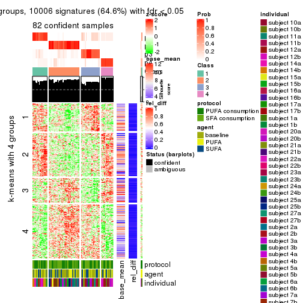</p>

</div>
<div id='tab-SD-skmeans-get-signatures-4'>
<pre><code class="r">get_signatures(res, k = 5)
</code></pre>

<p></p>

</div>
<div id='tab-SD-skmeans-get-signatures-5'>
<pre><code class="r">get_signatures(res, k = 6)
</code></pre>

<p></p>

</div>
</div>


Signature heatmaps where rows are not scaled:


<script>
$( function() {
	$( '#tabs-SD-skmeans-get-signatures-no-scale' ).tabs();
} );
</script>
<div id='tabs-SD-skmeans-get-signatures-no-scale'>
<ul>
<li><a href='#tab-SD-skmeans-get-signatures-no-scale-1'>k = 2</a></li>
<li><a href='#tab-SD-skmeans-get-signatures-no-scale-2'>k = 3</a></li>
<li><a href='#tab-SD-skmeans-get-signatures-no-scale-3'>k = 4</a></li>
<li><a href='#tab-SD-skmeans-get-signatures-no-scale-4'>k = 5</a></li>
<li><a href='#tab-SD-skmeans-get-signatures-no-scale-5'>k = 6</a></li>
</ul>
<div id='tab-SD-skmeans-get-signatures-no-scale-1'>
<pre><code class="r">get_signatures(res, k = 2, scale_rows = FALSE)
</code></pre>

<p></p>

</div>
<div id='tab-SD-skmeans-get-signatures-no-scale-2'>
<pre><code class="r">get_signatures(res, k = 3, scale_rows = FALSE)
</code></pre>

<p></p>

</div>
<div id='tab-SD-skmeans-get-signatures-no-scale-3'>
<pre><code class="r">get_signatures(res, k = 4, scale_rows = FALSE)
</code></pre>

<p></p>

</div>
<div id='tab-SD-skmeans-get-signatures-no-scale-4'>
<pre><code class="r">get_signatures(res, k = 5, scale_rows = FALSE)
</code></pre>

<p></p>

</div>
<div id='tab-SD-skmeans-get-signatures-no-scale-5'>
<pre><code class="r">get_signatures(res, k = 6, scale_rows = FALSE)
</code></pre>

<p></p>

</div>
</div>


Compare the overlap of signatures from different k:

```r
compare_signatures(res)
```

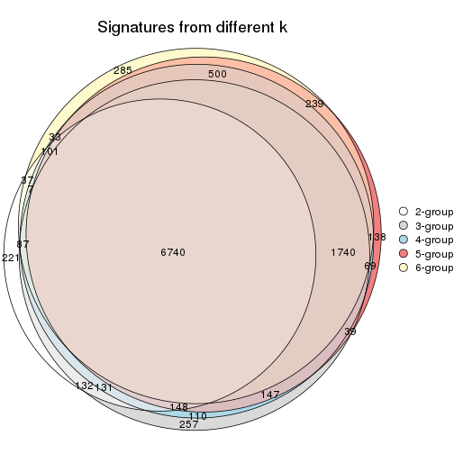

`get_signature()` returns a data frame invisibly. TO get the list of signatures, the function
call should be assigned to a variable explicitly. In following code, if `plot` argument is set
to `FALSE`, no heatmap is plotted while only the differential analysis is performed.

```r
# code only for demonstration
tb = get_signature(res, k = ..., plot = FALSE)
```

An example of the output of `tb` is:

```
#>   which_row         fdr    mean_1    mean_2 scaled_mean_1 scaled_mean_2 km
#> 1        38 0.042760348  8.373488  9.131774    -0.5533452     0.5164555  1
#> 2        40 0.018707592  7.106213  8.469186    -0.6173731     0.5762149  1
#> 3        55 0.019134737 10.221463 11.207825    -0.6159697     0.5749050  1
#> 4        59 0.006059896  5.921854  7.869574    -0.6899429     0.6439467  1
#> 5        60 0.018055526  8.928898 10.211722    -0.6204761     0.5791110  1
#> 6        98 0.009384629 15.714769 14.887706     0.6635654    -0.6193277  2
...
```

The columns in `tb` are:

1. `which_row`: row indices corresponding to the input matrix.
2. `fdr`: FDR for the differential test. 
3. `mean_x`: The mean value in group x.
4. `scaled_mean_x`: The mean value in group x after rows are scaled.
5. `km`: Row groups if k-means clustering is applied to rows.


UMAP plot which shows how samples are separated.


<script>
$( function() {
	$( '#tabs-SD-skmeans-dimension-reduction' ).tabs();
} );
</script>
<div id='tabs-SD-skmeans-dimension-reduction'>
<ul>
<li><a href='#tab-SD-skmeans-dimension-reduction-1'>k = 2</a></li>
<li><a href='#tab-SD-skmeans-dimension-reduction-2'>k = 3</a></li>
<li><a href='#tab-SD-skmeans-dimension-reduction-3'>k = 4</a></li>
<li><a href='#tab-SD-skmeans-dimension-reduction-4'>k = 5</a></li>
<li><a href='#tab-SD-skmeans-dimension-reduction-5'>k = 6</a></li>
</ul>
<div id='tab-SD-skmeans-dimension-reduction-1'>
<pre><code class="r">dimension_reduction(res, k = 2, method = &quot;UMAP&quot;)
</code></pre>

<p></p>

</div>
<div id='tab-SD-skmeans-dimension-reduction-2'>
<pre><code class="r">dimension_reduction(res, k = 3, method = &quot;UMAP&quot;)
</code></pre>

<p></p>

</div>
<div id='tab-SD-skmeans-dimension-reduction-3'>
<pre><code class="r">dimension_reduction(res, k = 4, method = &quot;UMAP&quot;)
</code></pre>

<p></p>

</div>
<div id='tab-SD-skmeans-dimension-reduction-4'>
<pre><code class="r">dimension_reduction(res, k = 5, method = &quot;UMAP&quot;)
</code></pre>

<p></p>

</div>
<div id='tab-SD-skmeans-dimension-reduction-5'>
<pre><code class="r">dimension_reduction(res, k = 6, method = &quot;UMAP&quot;)
</code></pre>

<p></p>

</div>
</div>


Following heatmap shows how subgroups are split when increasing `k`:

```r
collect_classes(res)
```


Test correlation between subgroups and known annotations. If the known
annotation is numeric, one-way ANOVA test is applied, and if the known
annotation is discrete, chi-squared contingency table test is applied.

```r
test_to_known_factors(res)
```

```
#>             n protocol(p) agent(p) individual(p) k
#> SD:skmeans 81       1.000    0.726      1.84e-03 2
#> SD:skmeans 83       0.988    0.963      3.05e-05 3
#> SD:skmeans 82       0.917    0.997      3.41e-08 4
#> SD:skmeans 72       0.903    0.998      7.90e-10 5
#> SD:skmeans 72       0.860    0.994      3.78e-12 6
```


If matrix rows can be associated to genes, consider to use `functional_enrichment(res,
...)` to perform function enrichment for the signature genes. See [this vignette](http://bioconductor.org/packages/devel/bioc/vignettes/cola/inst/doc/functional_enrichment.html) for more detailed explanations.


 

---------------------------------------------------


### SD:pam


The object with results only for a single top-value method and a single partition method 
can be extracted as:

```r
res = res_list["SD", "pam"]
# you can also extract it by
# res = res_list["SD:pam"]
```

A summary of `res` and all the functions that can be applied to it:

```r
res
```

```
#> A 'ConsensusPartition' object with k = 2, 3, 4, 5, 6.
#>   On a matrix with 15497 rows and 84 columns.
#>   Top rows (1000, 2000, 3000, 4000, 5000) are extracted by 'SD' method.
#>   Subgroups are detected by 'pam' method.
#>   Performed in total 1250 partitions by row resampling.
#>   Best k for subgroups seems to be 2.
#> 
#> Following methods can be applied to this 'ConsensusPartition' object:
#>  [1] "cola_report"             "collect_classes"         "collect_plots"          
#>  [4] "collect_stats"           "colnames"                "compare_signatures"     
#>  [7] "consensus_heatmap"       "dimension_reduction"     "functional_enrichment"  
#> [10] "get_anno_col"            "get_anno"                "get_classes"            
#> [13] "get_consensus"           "get_matrix"              "get_membership"         
#> [16] "get_param"               "get_signatures"          "get_stats"              
#> [19] "is_best_k"               "is_stable_k"             "membership_heatmap"     
#> [22] "ncol"                    "nrow"                    "plot_ecdf"              
#> [25] "rownames"                "select_partition_number" "show"                   
#> [28] "suggest_best_k"          "test_to_known_factors"
```

`collect_plots()` function collects all the plots made from `res` for all `k` (number of partitions)
into one single page to provide an easy and fast comparison between different `k`.

```r
collect_plots(res)
```


The plots are:

- The first row: a plot of the ECDF (empirical cumulative distribution
  function) curves of the consensus matrix for each `k` and the heatmap of
  predicted classes for each `k`.
- The second row: heatmaps of the consensus matrix for each `k`.
- The third row: heatmaps of the membership matrix for each `k`.
- The fouth row: heatmaps of the signatures for each `k`.

All the plots in panels can be made by individual functions and they are
plotted later in this section.

`select_partition_number()` produces several plots showing different
statistics for choosing "optimized" `k`. There are following statistics:

- ECDF curves of the consensus matrix for each `k`;
- 1-PAC. [The PAC
  score](https://en.wikipedia.org/wiki/Consensus_clustering#Over-interpretation_potential_of_consensus_clustering)
  measures the proportion of the ambiguous subgrouping.
- Mean silhouette score.
- Concordance. The mean probability of fiting the consensus class ids in all
  partitions.
- Area increased. Denote $A_k$ as the area under the ECDF curve for current
  `k`, the area increased is defined as $A_k - A_{k-1}$.
- Rand index. The percent of pairs of samples that are both in a same cluster
  or both are not in a same cluster in the partition of k and k-1.
- Jaccard index. The ratio of pairs of samples are both in a same cluster in
  the partition of k and k-1 and the pairs of samples are both in a same
  cluster in the partition k or k-1.

The detailed explanations of these statistics can be found in [the _cola_
vignette](http://bioconductor.org/packages/devel/bioc/vignettes/cola/inst/doc/cola.html#toc_13).

Generally speaking, lower PAC score, higher mean silhouette score or higher
concordance corresponds to better partition. Rand index and Jaccard index
measure how similar the current partition is compared to partition with `k-1`.
If they are too similar, we won't accept `k` is better than `k-1`.

```r
select_partition_number(res)
```


The numeric values for all these statistics can be obtained by `get_stats()`.

```r
get_stats(res)
```

```
#>   k 1-PAC mean_silhouette concordance area_increased  Rand Jaccard
#> 2 2 0.401           0.772       0.890         0.4965 0.501   0.501
#> 3 3 0.488           0.687       0.796         0.3235 0.765   0.561
#> 4 4 0.606           0.783       0.843         0.1356 0.809   0.504
#> 5 5 0.665           0.742       0.842         0.0587 0.948   0.790
#> 6 6 0.736           0.749       0.843         0.0415 0.897   0.572
```

`suggest_best_k()` suggests the best $k$ based on these statistics. The rules are as follows:

- All $k$ with Jaccard index larger than 0.95 are removed because increasing
  $k$ does not provide enough extra information. If all $k$ are removed, it is
  marked as no subgroup is detected.
- For all $k$ with 1-PAC score larger than 0.9, the maximal $k$ is taken as
  the best $k$, and other $k$ are marked as optional $k$.
- If it does not fit the second rule. The $k$ with the maximal vote of the
  highest 1-PAC score, highest mean silhouette, and highest concordance is
  taken as the best $k$.

```r
suggest_best_k(res)
```

```
#> [1] 2
```


Following shows the table of the partitions (You need to click the **show/hide
code output** link to see it). The membership matrix (columns with name `p*`)
is inferred by
[`clue::cl_consensus()`](https://www.rdocumentation.org/link/cl_consensus?package=clue)
function with the `SE` method. Basically the value in the membership matrix
represents the probability to belong to a certain group. The finall class
label for an item is determined with the group with highest probability it
belongs to.

In `get_classes()` function, the entropy is calculated from the membership
matrix and the silhouette score is calculated from the consensus matrix.


<script>
$( function() {
	$( '#tabs-SD-pam-get-classes' ).tabs();
} );
</script>
<div id='tabs-SD-pam-get-classes'>
<ul>
<li><a href='#tab-SD-pam-get-classes-1'>k = 2</a></li>
<li><a href='#tab-SD-pam-get-classes-2'>k = 3</a></li>
<li><a href='#tab-SD-pam-get-classes-3'>k = 4</a></li>
<li><a href='#tab-SD-pam-get-classes-4'>k = 5</a></li>
<li><a href='#tab-SD-pam-get-classes-5'>k = 6</a></li>
</ul>

<div id='tab-SD-pam-get-classes-1'>
<p><a id='tab-SD-pam-get-classes-1-a' style='color:#0366d6' href='#'>show/hide code output</a></p>
<pre><code class="r">cbind(get_classes(res, k = 2), get_membership(res, k = 2))
</code></pre>

<pre><code>#&gt;           class entropy silhouette    p1    p2
#&gt; GSM339455     1  0.8144      0.727 0.748 0.252
#&gt; GSM339456     2  0.7056      0.748 0.192 0.808
#&gt; GSM339457     1  0.9209      0.552 0.664 0.336
#&gt; GSM339458     1  0.9710      0.486 0.600 0.400
#&gt; GSM339459     2  0.7139      0.744 0.196 0.804
#&gt; GSM339460     2  0.0672      0.893 0.008 0.992
#&gt; GSM339461     2  0.0000      0.897 0.000 1.000
#&gt; GSM339462     1  0.0376      0.842 0.996 0.004
#&gt; GSM339463     1  0.6048      0.797 0.852 0.148
#&gt; GSM339464     1  0.7745      0.729 0.772 0.228
#&gt; GSM339465     1  0.3733      0.835 0.928 0.072
#&gt; GSM339466     2  0.0000      0.897 0.000 1.000
#&gt; GSM339467     2  0.0000      0.897 0.000 1.000
#&gt; GSM339468     2  0.6801      0.760 0.180 0.820
#&gt; GSM339469     1  0.5294      0.804 0.880 0.120
#&gt; GSM339470     1  0.9248      0.590 0.660 0.340
#&gt; GSM339471     1  0.0000      0.841 1.000 0.000
#&gt; GSM339472     2  0.0000      0.897 0.000 1.000
#&gt; GSM339473     1  0.0376      0.842 0.996 0.004
#&gt; GSM339474     2  0.0000      0.897 0.000 1.000
#&gt; GSM339475     1  0.2236      0.841 0.964 0.036
#&gt; GSM339476     1  0.6887      0.765 0.816 0.184
#&gt; GSM339477     2  0.4298      0.842 0.088 0.912
#&gt; GSM339478     2  0.9044      0.386 0.320 0.680
#&gt; GSM339479     1  0.7139      0.739 0.804 0.196
#&gt; GSM339480     2  0.7219      0.739 0.200 0.800
#&gt; GSM339481     2  0.0000      0.897 0.000 1.000
#&gt; GSM339482     1  0.1843      0.842 0.972 0.028
#&gt; GSM339483     1  0.6247      0.772 0.844 0.156
#&gt; GSM339484     1  0.0000      0.841 1.000 0.000
#&gt; GSM339485     1  0.7056      0.751 0.808 0.192
#&gt; GSM339486     1  0.0376      0.842 0.996 0.004
#&gt; GSM339487     2  0.0938      0.892 0.012 0.988
#&gt; GSM339488     2  0.0000      0.897 0.000 1.000
#&gt; GSM339489     2  0.7056      0.749 0.192 0.808
#&gt; GSM339490     1  0.6623      0.762 0.828 0.172
#&gt; GSM339491     1  0.7745      0.726 0.772 0.228
#&gt; GSM339492     1  0.0000      0.841 1.000 0.000
#&gt; GSM339493     2  0.0000      0.897 0.000 1.000
#&gt; GSM339494     1  0.0000      0.841 1.000 0.000
#&gt; GSM339495     2  0.0000      0.897 0.000 1.000
#&gt; GSM339496     1  0.1843      0.842 0.972 0.028
#&gt; GSM339497     2  0.4161      0.830 0.084 0.916
#&gt; GSM339498     1  0.9970      0.235 0.532 0.468
#&gt; GSM339499     1  0.8443      0.667 0.728 0.272
#&gt; GSM339500     2  0.9996     -0.191 0.488 0.512
#&gt; GSM339501     1  0.8955      0.589 0.688 0.312
#&gt; GSM339502     2  0.0000      0.897 0.000 1.000
#&gt; GSM339503     1  0.7139      0.735 0.804 0.196
#&gt; GSM339504     1  0.0376      0.842 0.996 0.004
#&gt; GSM339505     1  0.9248      0.590 0.660 0.340
#&gt; GSM339506     1  0.0000      0.841 1.000 0.000
#&gt; GSM339507     1  0.2043      0.839 0.968 0.032
#&gt; GSM339508     2  0.0000      0.897 0.000 1.000
#&gt; GSM339509     2  0.0000      0.897 0.000 1.000
#&gt; GSM339510     2  0.2603      0.873 0.044 0.956
#&gt; GSM339511     2  0.6887      0.701 0.184 0.816
#&gt; GSM339512     2  0.6048      0.744 0.148 0.852
#&gt; GSM339513     1  0.0000      0.841 1.000 0.000
#&gt; GSM339514     2  0.0000      0.897 0.000 1.000
#&gt; GSM339515     1  0.0000      0.841 1.000 0.000
#&gt; GSM339516     2  0.0000      0.897 0.000 1.000
#&gt; GSM339517     1  0.7299      0.727 0.796 0.204
#&gt; GSM339518     2  0.0376      0.895 0.004 0.996
#&gt; GSM339519     1  0.6531      0.774 0.832 0.168
#&gt; GSM339520     1  0.9881      0.366 0.564 0.436
#&gt; GSM339521     2  0.0000      0.897 0.000 1.000
#&gt; GSM339522     2  0.0000      0.897 0.000 1.000
#&gt; GSM339523     2  0.0000      0.897 0.000 1.000
#&gt; GSM339524     1  0.0000      0.841 1.000 0.000
#&gt; GSM339525     1  0.5946      0.778 0.856 0.144
#&gt; GSM339526     1  0.1843      0.842 0.972 0.028
#&gt; GSM339527     1  0.5946      0.778 0.856 0.144
#&gt; GSM339528     1  0.2236      0.838 0.964 0.036
#&gt; GSM339529     2  0.0000      0.897 0.000 1.000
#&gt; GSM339530     1  0.8861      0.604 0.696 0.304
#&gt; GSM339531     2  0.6973      0.753 0.188 0.812
#&gt; GSM339532     2  0.9754      0.198 0.408 0.592
#&gt; GSM339533     1  0.1843      0.842 0.972 0.028
#&gt; GSM339534     1  0.4431      0.817 0.908 0.092
#&gt; GSM339535     2  0.0000      0.897 0.000 1.000
#&gt; GSM339536     1  0.0000      0.841 1.000 0.000
#&gt; GSM339537     2  0.0000      0.897 0.000 1.000
#&gt; GSM339538     1  0.0000      0.841 1.000 0.000
</code></pre>

<script>
$('#tab-SD-pam-get-classes-1-a').parent().next().next().hide();
$('#tab-SD-pam-get-classes-1-a').click(function(){
  $('#tab-SD-pam-get-classes-1-a').parent().next().next().toggle();
  return(false);
});
</script>
</div>

<div id='tab-SD-pam-get-classes-2'>
<p><a id='tab-SD-pam-get-classes-2-a' style='color:#0366d6' href='#'>show/hide code output</a></p>
<pre><code class="r">cbind(get_classes(res, k = 3), get_membership(res, k = 3))
</code></pre>

<pre><code>#&gt;           class entropy silhouette    p1    p2    p3
#&gt; GSM339455     3  0.4921     0.6536 0.164 0.020 0.816
#&gt; GSM339456     2  0.4676     0.7892 0.040 0.848 0.112
#&gt; GSM339457     3  0.3043     0.7155 0.008 0.084 0.908
#&gt; GSM339458     3  0.9172     0.2464 0.148 0.396 0.456
#&gt; GSM339459     2  0.8221     0.6884 0.248 0.624 0.128
#&gt; GSM339460     2  0.2434     0.8406 0.036 0.940 0.024
#&gt; GSM339461     2  0.4178     0.8493 0.172 0.828 0.000
#&gt; GSM339462     1  0.4654     0.7321 0.792 0.000 0.208
#&gt; GSM339463     3  0.3272     0.7038 0.104 0.004 0.892
#&gt; GSM339464     1  0.1289     0.7162 0.968 0.032 0.000
#&gt; GSM339465     3  0.1170     0.7412 0.016 0.008 0.976
#&gt; GSM339466     2  0.4978     0.8271 0.216 0.780 0.004
#&gt; GSM339467     2  0.0237     0.8556 0.000 0.996 0.004
#&gt; GSM339468     2  0.7501     0.7529 0.212 0.684 0.104
#&gt; GSM339469     1  0.5305     0.7293 0.788 0.020 0.192
#&gt; GSM339470     3  0.2050     0.7406 0.028 0.020 0.952
#&gt; GSM339471     1  0.5926     0.6826 0.644 0.000 0.356
#&gt; GSM339472     2  0.0000     0.8572 0.000 1.000 0.000
#&gt; GSM339473     1  0.5678     0.7002 0.684 0.000 0.316
#&gt; GSM339474     2  0.0892     0.8588 0.020 0.980 0.000
#&gt; GSM339475     3  0.1163     0.7387 0.028 0.000 0.972
#&gt; GSM339476     1  0.3120     0.7299 0.908 0.012 0.080
#&gt; GSM339477     2  0.1999     0.8575 0.036 0.952 0.012
#&gt; GSM339478     3  0.9399     0.1034 0.176 0.372 0.452
#&gt; GSM339479     3  0.7601    -0.0381 0.416 0.044 0.540
#&gt; GSM339480     2  0.8278     0.6841 0.248 0.620 0.132
#&gt; GSM339481     2  0.0000     0.8572 0.000 1.000 0.000
#&gt; GSM339482     3  0.2625     0.7223 0.084 0.000 0.916
#&gt; GSM339483     1  0.1999     0.7284 0.952 0.012 0.036
#&gt; GSM339484     3  0.1647     0.7404 0.036 0.004 0.960
#&gt; GSM339485     1  0.1877     0.7208 0.956 0.032 0.012
#&gt; GSM339486     3  0.2537     0.7100 0.080 0.000 0.920
#&gt; GSM339487     2  0.5461     0.8229 0.216 0.768 0.016
#&gt; GSM339488     2  0.0424     0.8545 0.000 0.992 0.008
#&gt; GSM339489     2  0.7782     0.7146 0.256 0.648 0.096
#&gt; GSM339490     1  0.2031     0.7216 0.952 0.032 0.016
#&gt; GSM339491     3  0.1453     0.7447 0.024 0.008 0.968
#&gt; GSM339492     1  0.5948     0.6804 0.640 0.000 0.360
#&gt; GSM339493     2  0.0237     0.8579 0.004 0.996 0.000
#&gt; GSM339494     1  0.5810     0.6925 0.664 0.000 0.336
#&gt; GSM339495     2  0.0892     0.8588 0.020 0.980 0.000
#&gt; GSM339496     3  0.1289     0.7415 0.032 0.000 0.968
#&gt; GSM339497     2  0.6541     0.8064 0.212 0.732 0.056
#&gt; GSM339498     3  0.9617     0.2237 0.248 0.280 0.472
#&gt; GSM339499     3  0.1453     0.7456 0.008 0.024 0.968
#&gt; GSM339500     3  0.6836     0.3505 0.016 0.412 0.572
#&gt; GSM339501     1  0.8408     0.2390 0.596 0.280 0.124
#&gt; GSM339502     2  0.0237     0.8562 0.000 0.996 0.004
#&gt; GSM339503     3  0.2625     0.7221 0.084 0.000 0.916
#&gt; GSM339504     1  0.4702     0.7322 0.788 0.000 0.212
#&gt; GSM339505     3  0.6441     0.5146 0.028 0.276 0.696
#&gt; GSM339506     3  0.6505    -0.0801 0.468 0.004 0.528
#&gt; GSM339507     3  0.0848     0.7432 0.008 0.008 0.984
#&gt; GSM339508     2  0.1031     0.8585 0.024 0.976 0.000
#&gt; GSM339509     2  0.0237     0.8556 0.000 0.996 0.004
#&gt; GSM339510     2  0.6539     0.7634 0.288 0.684 0.028
#&gt; GSM339511     1  0.1711     0.7175 0.960 0.032 0.008
#&gt; GSM339512     3  0.6678     0.2782 0.008 0.480 0.512
#&gt; GSM339513     1  0.6126     0.5683 0.600 0.000 0.400
#&gt; GSM339514     2  0.0000     0.8572 0.000 1.000 0.000
#&gt; GSM339515     1  0.5733     0.7013 0.676 0.000 0.324
#&gt; GSM339516     2  0.4654     0.8320 0.208 0.792 0.000
#&gt; GSM339517     3  0.1529     0.7372 0.040 0.000 0.960
#&gt; GSM339518     2  0.4645     0.8386 0.176 0.816 0.008
#&gt; GSM339519     3  0.5016     0.5828 0.240 0.000 0.760
#&gt; GSM339520     3  0.5254     0.6010 0.000 0.264 0.736
#&gt; GSM339521     2  0.0237     0.8556 0.000 0.996 0.004
#&gt; GSM339522     2  0.5098     0.8116 0.248 0.752 0.000
#&gt; GSM339523     2  0.0000     0.8572 0.000 1.000 0.000
#&gt; GSM339524     3  0.3192     0.7073 0.112 0.000 0.888
#&gt; GSM339525     1  0.2682     0.7375 0.920 0.004 0.076
#&gt; GSM339526     3  0.0747     0.7387 0.016 0.000 0.984
#&gt; GSM339527     1  0.6520    -0.0631 0.508 0.004 0.488
#&gt; GSM339528     3  0.3213     0.7174 0.092 0.008 0.900
#&gt; GSM339529     2  0.4346     0.8397 0.184 0.816 0.000
#&gt; GSM339530     3  0.5785     0.5651 0.004 0.300 0.696
#&gt; GSM339531     2  0.7568     0.7464 0.212 0.680 0.108
#&gt; GSM339532     1  0.2939     0.7012 0.916 0.072 0.012
#&gt; GSM339533     3  0.0592     0.7424 0.012 0.000 0.988
#&gt; GSM339534     1  0.5692     0.7020 0.724 0.008 0.268
#&gt; GSM339535     2  0.3295     0.8577 0.096 0.896 0.008
#&gt; GSM339536     1  0.5859     0.6788 0.656 0.000 0.344
#&gt; GSM339537     2  0.4605     0.8328 0.204 0.796 0.000
#&gt; GSM339538     3  0.2537     0.7240 0.080 0.000 0.920
</code></pre>

<script>
$('#tab-SD-pam-get-classes-2-a').parent().next().next().hide();
$('#tab-SD-pam-get-classes-2-a').click(function(){
  $('#tab-SD-pam-get-classes-2-a').parent().next().next().toggle();
  return(false);
});
</script>
</div>

<div id='tab-SD-pam-get-classes-3'>
<p><a id='tab-SD-pam-get-classes-3-a' style='color:#0366d6' href='#'>show/hide code output</a></p>
<pre><code class="r">cbind(get_classes(res, k = 4), get_membership(res, k = 4))
</code></pre>

<pre><code>#&gt;           class entropy silhouette    p1    p2    p3    p4
#&gt; GSM339455     4  0.4673     0.7338 0.012 0.008 0.232 0.748
#&gt; GSM339456     2  0.5375     0.7167 0.028 0.776 0.124 0.072
#&gt; GSM339457     3  0.1118     0.8583 0.000 0.000 0.964 0.036
#&gt; GSM339458     4  0.7093     0.5688 0.000 0.212 0.220 0.568
#&gt; GSM339459     4  0.4691     0.8132 0.044 0.016 0.136 0.804
#&gt; GSM339460     2  0.1648     0.8727 0.012 0.956 0.016 0.016
#&gt; GSM339461     2  0.4722     0.6203 0.008 0.692 0.000 0.300
#&gt; GSM339462     1  0.2670     0.8397 0.904 0.000 0.072 0.024
#&gt; GSM339463     3  0.2915     0.8208 0.088 0.004 0.892 0.016
#&gt; GSM339464     1  0.3479     0.8149 0.840 0.012 0.000 0.148
#&gt; GSM339465     3  0.2457     0.8378 0.004 0.008 0.912 0.076
#&gt; GSM339466     4  0.2281     0.8319 0.000 0.096 0.000 0.904
#&gt; GSM339467     2  0.0000     0.8814 0.000 1.000 0.000 0.000
#&gt; GSM339468     4  0.3965     0.8333 0.008 0.032 0.120 0.840
#&gt; GSM339469     1  0.4152     0.8199 0.840 0.012 0.100 0.048
#&gt; GSM339470     3  0.2179     0.8408 0.000 0.012 0.924 0.064
#&gt; GSM339471     1  0.4225     0.7820 0.792 0.000 0.184 0.024
#&gt; GSM339472     2  0.0921     0.8787 0.000 0.972 0.000 0.028
#&gt; GSM339473     1  0.3764     0.8127 0.852 0.000 0.076 0.072
#&gt; GSM339474     2  0.1716     0.8681 0.000 0.936 0.000 0.064
#&gt; GSM339475     3  0.1576     0.8553 0.048 0.000 0.948 0.004
#&gt; GSM339476     1  0.4419     0.8276 0.820 0.008 0.056 0.116
#&gt; GSM339477     2  0.2441     0.8627 0.004 0.916 0.012 0.068
#&gt; GSM339478     4  0.4487     0.8095 0.000 0.100 0.092 0.808
#&gt; GSM339479     4  0.7780     0.5417 0.144 0.044 0.240 0.572
#&gt; GSM339480     4  0.4749     0.8143 0.044 0.020 0.132 0.804
#&gt; GSM339481     2  0.0188     0.8807 0.000 0.996 0.000 0.004
#&gt; GSM339482     3  0.3653     0.8081 0.128 0.000 0.844 0.028
#&gt; GSM339483     1  0.3435     0.8288 0.864 0.000 0.036 0.100
#&gt; GSM339484     3  0.1109     0.8595 0.028 0.000 0.968 0.004
#&gt; GSM339485     1  0.3612     0.8165 0.840 0.012 0.004 0.144
#&gt; GSM339486     3  0.2408     0.8218 0.104 0.000 0.896 0.000
#&gt; GSM339487     4  0.2593     0.8398 0.000 0.080 0.016 0.904
#&gt; GSM339488     2  0.0188     0.8804 0.000 0.996 0.004 0.000
#&gt; GSM339489     4  0.4660     0.8225 0.056 0.020 0.108 0.816
#&gt; GSM339490     1  0.3612     0.8165 0.840 0.012 0.004 0.144
#&gt; GSM339491     3  0.1492     0.8572 0.004 0.004 0.956 0.036
#&gt; GSM339492     1  0.4139     0.7878 0.800 0.000 0.176 0.024
#&gt; GSM339493     2  0.4040     0.6595 0.000 0.752 0.000 0.248
#&gt; GSM339494     1  0.3471     0.8102 0.868 0.000 0.060 0.072
#&gt; GSM339495     2  0.2081     0.8627 0.000 0.916 0.000 0.084
#&gt; GSM339496     3  0.0921     0.8574 0.028 0.000 0.972 0.000
#&gt; GSM339497     4  0.3266     0.8381 0.004 0.064 0.048 0.884
#&gt; GSM339498     4  0.4504     0.8058 0.044 0.004 0.152 0.800
#&gt; GSM339499     3  0.0657     0.8603 0.000 0.004 0.984 0.012
#&gt; GSM339500     3  0.6229     0.5589 0.000 0.228 0.656 0.116
#&gt; GSM339501     4  0.5082     0.7928 0.108 0.004 0.112 0.776
#&gt; GSM339502     2  0.0376     0.8799 0.000 0.992 0.004 0.004
#&gt; GSM339503     3  0.2908     0.8395 0.064 0.000 0.896 0.040
#&gt; GSM339504     1  0.3497     0.8240 0.852 0.000 0.124 0.024
#&gt; GSM339505     3  0.2255     0.8416 0.000 0.012 0.920 0.068
#&gt; GSM339506     1  0.5602     0.2685 0.568 0.000 0.408 0.024
#&gt; GSM339507     3  0.3037     0.8321 0.036 0.000 0.888 0.076
#&gt; GSM339508     2  0.2593     0.8502 0.004 0.892 0.000 0.104
#&gt; GSM339509     2  0.0000     0.8814 0.000 1.000 0.000 0.000
#&gt; GSM339510     4  0.2719     0.8416 0.024 0.040 0.020 0.916
#&gt; GSM339511     1  0.3479     0.8149 0.840 0.012 0.000 0.148
#&gt; GSM339512     3  0.6028     0.5165 0.000 0.280 0.644 0.076
#&gt; GSM339513     1  0.5277     0.5845 0.668 0.000 0.304 0.028
#&gt; GSM339514     2  0.0000     0.8814 0.000 1.000 0.000 0.000
#&gt; GSM339515     1  0.3471     0.8163 0.868 0.000 0.060 0.072
#&gt; GSM339516     4  0.2401     0.8323 0.004 0.092 0.000 0.904
#&gt; GSM339517     3  0.3105     0.8199 0.120 0.000 0.868 0.012
#&gt; GSM339518     4  0.3895     0.7996 0.000 0.184 0.012 0.804
#&gt; GSM339519     3  0.5000     0.7586 0.128 0.000 0.772 0.100
#&gt; GSM339520     2  0.4891     0.5543 0.000 0.680 0.308 0.012
#&gt; GSM339521     2  0.1792     0.8640 0.000 0.932 0.000 0.068
#&gt; GSM339522     4  0.2271     0.8376 0.008 0.076 0.000 0.916
#&gt; GSM339523     2  0.0000     0.8814 0.000 1.000 0.000 0.000
#&gt; GSM339524     3  0.4741     0.7081 0.228 0.000 0.744 0.028
#&gt; GSM339525     1  0.3834     0.8373 0.848 0.000 0.076 0.076
#&gt; GSM339526     3  0.0779     0.8591 0.016 0.000 0.980 0.004
#&gt; GSM339527     3  0.7052     0.0862 0.372 0.000 0.500 0.128
#&gt; GSM339528     3  0.3127     0.8416 0.068 0.008 0.892 0.032
#&gt; GSM339529     4  0.3668     0.7764 0.004 0.188 0.000 0.808
#&gt; GSM339530     2  0.5099     0.3500 0.000 0.612 0.380 0.008
#&gt; GSM339531     4  0.4440     0.8252 0.024 0.028 0.128 0.820
#&gt; GSM339532     1  0.3994     0.8090 0.828 0.028 0.004 0.140
#&gt; GSM339533     3  0.0336     0.8599 0.008 0.000 0.992 0.000
#&gt; GSM339534     1  0.4431     0.8171 0.824 0.008 0.084 0.084
#&gt; GSM339535     4  0.4456     0.7071 0.000 0.280 0.004 0.716
#&gt; GSM339536     1  0.3764     0.8024 0.852 0.000 0.076 0.072
#&gt; GSM339537     4  0.2281     0.8319 0.000 0.096 0.000 0.904
#&gt; GSM339538     3  0.3606     0.8088 0.132 0.000 0.844 0.024
</code></pre>

<script>
$('#tab-SD-pam-get-classes-3-a').parent().next().next().hide();
$('#tab-SD-pam-get-classes-3-a').click(function(){
  $('#tab-SD-pam-get-classes-3-a').parent().next().next().toggle();
  return(false);
});
</script>
</div>

<div id='tab-SD-pam-get-classes-4'>
<p><a id='tab-SD-pam-get-classes-4-a' style='color:#0366d6' href='#'>show/hide code output</a></p>
<pre><code class="r">cbind(get_classes(res, k = 5), get_membership(res, k = 5))
</code></pre>

<pre><code>#&gt;           class entropy silhouette    p1    p2    p3    p4    p5
#&gt; GSM339455     5  0.4025    0.59052 0.000 0.000 0.292 0.008 0.700
#&gt; GSM339456     2  0.5498    0.65831 0.000 0.708 0.124 0.032 0.136
#&gt; GSM339457     3  0.2170    0.76308 0.004 0.000 0.904 0.004 0.088
#&gt; GSM339458     5  0.6438    0.32831 0.000 0.212 0.292 0.000 0.496
#&gt; GSM339459     5  0.3619    0.78049 0.008 0.000 0.124 0.040 0.828
#&gt; GSM339460     2  0.1653    0.84827 0.000 0.944 0.004 0.024 0.028
#&gt; GSM339461     2  0.4765    0.42027 0.008 0.556 0.000 0.008 0.428
#&gt; GSM339462     4  0.1310    0.88493 0.000 0.000 0.020 0.956 0.024
#&gt; GSM339463     3  0.2570    0.77171 0.000 0.000 0.888 0.084 0.028
#&gt; GSM339464     4  0.0955    0.89732 0.000 0.004 0.000 0.968 0.028
#&gt; GSM339465     3  0.2720    0.76603 0.020 0.000 0.880 0.004 0.096
#&gt; GSM339466     5  0.1082    0.80743 0.000 0.028 0.000 0.008 0.964
#&gt; GSM339467     2  0.0000    0.85715 0.000 1.000 0.000 0.000 0.000
#&gt; GSM339468     5  0.2722    0.79556 0.000 0.004 0.120 0.008 0.868
#&gt; GSM339469     4  0.0794    0.89896 0.000 0.000 0.000 0.972 0.028
#&gt; GSM339470     3  0.2286    0.76555 0.000 0.000 0.888 0.004 0.108
#&gt; GSM339471     1  0.4049    0.84798 0.780 0.000 0.164 0.056 0.000
#&gt; GSM339472     2  0.1168    0.85416 0.000 0.960 0.000 0.008 0.032
#&gt; GSM339473     1  0.0451    0.83501 0.988 0.000 0.008 0.004 0.000
#&gt; GSM339474     2  0.1956    0.84371 0.000 0.916 0.000 0.008 0.076
#&gt; GSM339475     3  0.1399    0.78393 0.028 0.000 0.952 0.020 0.000
#&gt; GSM339476     4  0.3248    0.81991 0.020 0.000 0.048 0.868 0.064
#&gt; GSM339477     2  0.2177    0.84240 0.000 0.908 0.004 0.008 0.080
#&gt; GSM339478     5  0.4738    0.67751 0.004 0.064 0.192 0.004 0.736
#&gt; GSM339479     5  0.6979    0.28064 0.000 0.044 0.316 0.140 0.500
#&gt; GSM339480     5  0.3619    0.78049 0.008 0.000 0.124 0.040 0.828
#&gt; GSM339481     2  0.0162    0.85742 0.000 0.996 0.000 0.000 0.004
#&gt; GSM339482     3  0.5163    0.23756 0.368 0.000 0.588 0.040 0.004
#&gt; GSM339483     4  0.1211    0.88716 0.000 0.000 0.016 0.960 0.024
#&gt; GSM339484     3  0.3033    0.74807 0.000 0.000 0.864 0.052 0.084
#&gt; GSM339485     4  0.0794    0.89896 0.000 0.000 0.000 0.972 0.028
#&gt; GSM339486     3  0.2280    0.77499 0.000 0.000 0.880 0.120 0.000
#&gt; GSM339487     5  0.1386    0.80608 0.000 0.032 0.000 0.016 0.952
#&gt; GSM339488     2  0.0000    0.85715 0.000 1.000 0.000 0.000 0.000
#&gt; GSM339489     5  0.3506    0.79079 0.000 0.000 0.104 0.064 0.832
#&gt; GSM339490     4  0.0794    0.89896 0.000 0.000 0.000 0.972 0.028
#&gt; GSM339491     3  0.2124    0.79415 0.000 0.000 0.916 0.028 0.056
#&gt; GSM339492     1  0.4138    0.84657 0.776 0.000 0.160 0.064 0.000
#&gt; GSM339493     2  0.4298    0.50462 0.000 0.640 0.000 0.008 0.352
#&gt; GSM339494     1  0.0451    0.83501 0.988 0.000 0.008 0.004 0.000
#&gt; GSM339495     2  0.2358    0.83552 0.000 0.888 0.000 0.008 0.104
#&gt; GSM339496     3  0.0703    0.78809 0.000 0.000 0.976 0.024 0.000
#&gt; GSM339497     5  0.2166    0.79784 0.000 0.012 0.072 0.004 0.912
#&gt; GSM339498     5  0.3578    0.77872 0.000 0.000 0.132 0.048 0.820
#&gt; GSM339499     3  0.1365    0.79033 0.004 0.000 0.952 0.004 0.040
#&gt; GSM339500     3  0.5880    0.51421 0.000 0.172 0.600 0.000 0.228
#&gt; GSM339501     5  0.4630    0.73345 0.000 0.000 0.088 0.176 0.736
#&gt; GSM339502     2  0.0510    0.85356 0.000 0.984 0.000 0.000 0.016
#&gt; GSM339503     3  0.3928    0.67504 0.152 0.000 0.800 0.040 0.008
#&gt; GSM339504     4  0.1403    0.88254 0.000 0.000 0.024 0.952 0.024
#&gt; GSM339505     3  0.2304    0.77497 0.000 0.000 0.892 0.008 0.100
#&gt; GSM339506     4  0.4841    0.10338 0.000 0.000 0.416 0.560 0.024
#&gt; GSM339507     3  0.3480    0.67541 0.248 0.000 0.752 0.000 0.000
#&gt; GSM339508     2  0.3724    0.75638 0.000 0.776 0.000 0.020 0.204
#&gt; GSM339509     2  0.0000    0.85715 0.000 1.000 0.000 0.000 0.000
#&gt; GSM339510     5  0.1365    0.81168 0.000 0.004 0.004 0.040 0.952
#&gt; GSM339511     4  0.1341    0.88840 0.000 0.000 0.000 0.944 0.056
#&gt; GSM339512     3  0.6426    0.36726 0.000 0.260 0.544 0.008 0.188
#&gt; GSM339513     1  0.4088    0.84689 0.792 0.000 0.140 0.064 0.004
#&gt; GSM339514     2  0.0000    0.85715 0.000 1.000 0.000 0.000 0.000
#&gt; GSM339515     1  0.0451    0.83501 0.988 0.000 0.008 0.004 0.000
#&gt; GSM339516     5  0.1300    0.80696 0.000 0.028 0.000 0.016 0.956
#&gt; GSM339517     3  0.3606    0.67651 0.164 0.000 0.808 0.024 0.004
#&gt; GSM339518     5  0.3264    0.75384 0.000 0.164 0.016 0.000 0.820
#&gt; GSM339519     1  0.5101    0.65331 0.652 0.000 0.296 0.040 0.012
#&gt; GSM339520     2  0.4871    0.46824 0.004 0.624 0.348 0.004 0.020
#&gt; GSM339521     2  0.3342    0.78784 0.000 0.836 0.020 0.008 0.136
#&gt; GSM339522     5  0.0912    0.81211 0.000 0.012 0.000 0.016 0.972
#&gt; GSM339523     2  0.0000    0.85715 0.000 1.000 0.000 0.000 0.000
#&gt; GSM339524     1  0.4087    0.82791 0.784 0.000 0.168 0.040 0.008
#&gt; GSM339525     4  0.0880    0.88606 0.000 0.000 0.032 0.968 0.000
#&gt; GSM339526     3  0.1267    0.78564 0.012 0.000 0.960 0.024 0.004
#&gt; GSM339527     3  0.5933    0.00153 0.000 0.000 0.452 0.444 0.104
#&gt; GSM339528     3  0.4125    0.73048 0.000 0.000 0.772 0.172 0.056
#&gt; GSM339529     5  0.3278    0.72783 0.000 0.156 0.000 0.020 0.824
#&gt; GSM339530     2  0.4193    0.58977 0.004 0.716 0.268 0.004 0.008
#&gt; GSM339531     5  0.3080    0.78997 0.000 0.004 0.124 0.020 0.852
#&gt; GSM339532     4  0.1764    0.87171 0.000 0.008 0.000 0.928 0.064
#&gt; GSM339533     3  0.0794    0.78819 0.000 0.000 0.972 0.028 0.000
#&gt; GSM339534     1  0.4813    0.78992 0.776 0.000 0.072 0.060 0.092
#&gt; GSM339535     5  0.3480    0.68726 0.000 0.248 0.000 0.000 0.752
#&gt; GSM339536     1  0.0451    0.83501 0.988 0.000 0.008 0.004 0.000
#&gt; GSM339537     5  0.1386    0.80608 0.000 0.032 0.000 0.016 0.952
#&gt; GSM339538     1  0.3645    0.83486 0.804 0.000 0.168 0.024 0.004
</code></pre>

<script>
$('#tab-SD-pam-get-classes-4-a').parent().next().next().hide();
$('#tab-SD-pam-get-classes-4-a').click(function(){
  $('#tab-SD-pam-get-classes-4-a').parent().next().next().toggle();
  return(false);
});
</script>
</div>

<div id='tab-SD-pam-get-classes-5'>
<p><a id='tab-SD-pam-get-classes-5-a' style='color:#0366d6' href='#'>show/hide code output</a></p>
<pre><code class="r">cbind(get_classes(res, k = 6), get_membership(res, k = 6))
</code></pre>

<pre><code>#&gt;           class entropy silhouette    p1    p2    p3    p4    p5    p6
#&gt; GSM339455     3  0.5774      0.293 0.000 0.000 0.456 0.000 0.364 0.180
#&gt; GSM339456     2  0.5252      0.375 0.000 0.580 0.108 0.004 0.308 0.000
#&gt; GSM339457     6  0.1267      0.880 0.000 0.000 0.060 0.000 0.000 0.940
#&gt; GSM339458     3  0.4001      0.707 0.000 0.128 0.760 0.000 0.112 0.000
#&gt; GSM339459     5  0.3777      0.716 0.000 0.000 0.124 0.004 0.788 0.084
#&gt; GSM339460     2  0.1934      0.839 0.000 0.916 0.044 0.000 0.040 0.000
#&gt; GSM339461     5  0.5661      0.140 0.000 0.392 0.020 0.016 0.516 0.056
#&gt; GSM339462     4  0.0993      0.931 0.000 0.000 0.012 0.964 0.024 0.000
#&gt; GSM339463     3  0.2358      0.761 0.000 0.000 0.876 0.016 0.000 0.108
#&gt; GSM339464     4  0.0260      0.937 0.000 0.000 0.000 0.992 0.008 0.000
#&gt; GSM339465     3  0.2703      0.771 0.008 0.000 0.876 0.000 0.052 0.064
#&gt; GSM339466     5  0.1010      0.777 0.000 0.036 0.004 0.000 0.960 0.000
#&gt; GSM339467     2  0.0146      0.867 0.000 0.996 0.000 0.000 0.000 0.004
#&gt; GSM339468     5  0.1700      0.770 0.000 0.000 0.080 0.000 0.916 0.004
#&gt; GSM339469     4  0.0260      0.938 0.000 0.000 0.000 0.992 0.008 0.000
#&gt; GSM339470     3  0.2568      0.769 0.000 0.000 0.876 0.000 0.056 0.068
#&gt; GSM339471     1  0.3706      0.846 0.796 0.000 0.148 0.024 0.000 0.032
#&gt; GSM339472     2  0.1141      0.858 0.000 0.948 0.000 0.000 0.052 0.000
#&gt; GSM339473     1  0.0000      0.835 1.000 0.000 0.000 0.000 0.000 0.000
#&gt; GSM339474     2  0.2135      0.828 0.000 0.872 0.000 0.000 0.128 0.000
#&gt; GSM339475     6  0.2531      0.786 0.008 0.000 0.128 0.004 0.000 0.860
#&gt; GSM339476     4  0.3186      0.811 0.008 0.000 0.108 0.844 0.032 0.008
#&gt; GSM339477     2  0.2219      0.824 0.000 0.864 0.000 0.000 0.136 0.000
#&gt; GSM339478     6  0.1327      0.878 0.000 0.000 0.064 0.000 0.000 0.936
#&gt; GSM339479     3  0.4251      0.747 0.000 0.060 0.780 0.060 0.100 0.000
#&gt; GSM339480     5  0.3454      0.727 0.000 0.000 0.124 0.004 0.812 0.060
#&gt; GSM339481     2  0.0405      0.868 0.000 0.988 0.004 0.000 0.008 0.000
#&gt; GSM339482     3  0.4415      0.468 0.236 0.000 0.696 0.004 0.000 0.064
#&gt; GSM339483     4  0.0993      0.931 0.000 0.000 0.012 0.964 0.024 0.000
#&gt; GSM339484     3  0.1010      0.780 0.000 0.000 0.960 0.036 0.000 0.004
#&gt; GSM339485     4  0.0146      0.937 0.000 0.000 0.000 0.996 0.004 0.000
#&gt; GSM339486     3  0.2176      0.781 0.000 0.000 0.896 0.080 0.000 0.024
#&gt; GSM339487     5  0.1440      0.775 0.000 0.044 0.004 0.004 0.944 0.004
#&gt; GSM339488     2  0.0146      0.867 0.000 0.996 0.000 0.000 0.000 0.004
#&gt; GSM339489     5  0.2747      0.755 0.000 0.000 0.108 0.028 0.860 0.004
#&gt; GSM339490     4  0.0146      0.937 0.000 0.000 0.000 0.996 0.004 0.000
#&gt; GSM339491     3  0.1296      0.791 0.000 0.012 0.952 0.004 0.032 0.000
#&gt; GSM339492     1  0.3670      0.846 0.796 0.000 0.152 0.024 0.000 0.028
#&gt; GSM339493     5  0.3838      0.154 0.000 0.448 0.000 0.000 0.552 0.000
#&gt; GSM339494     1  0.0000      0.835 1.000 0.000 0.000 0.000 0.000 0.000
#&gt; GSM339495     2  0.3464      0.595 0.000 0.688 0.000 0.000 0.312 0.000
#&gt; GSM339496     3  0.2009      0.756 0.000 0.000 0.904 0.004 0.008 0.084
#&gt; GSM339497     5  0.2631      0.657 0.000 0.000 0.180 0.000 0.820 0.000
#&gt; GSM339498     5  0.5298      0.543 0.000 0.000 0.124 0.020 0.644 0.212
#&gt; GSM339499     6  0.1267      0.880 0.000 0.000 0.060 0.000 0.000 0.940
#&gt; GSM339500     3  0.6322      0.361 0.000 0.052 0.516 0.000 0.288 0.144
#&gt; GSM339501     5  0.4607      0.501 0.000 0.000 0.056 0.328 0.616 0.000
#&gt; GSM339502     2  0.0777      0.859 0.000 0.972 0.000 0.000 0.024 0.004
#&gt; GSM339503     3  0.2113      0.742 0.028 0.000 0.908 0.004 0.000 0.060
#&gt; GSM339504     4  0.0993      0.931 0.000 0.000 0.012 0.964 0.024 0.000
#&gt; GSM339505     3  0.1984      0.784 0.000 0.000 0.912 0.000 0.056 0.032
#&gt; GSM339506     3  0.4408      0.535 0.000 0.000 0.636 0.320 0.044 0.000
#&gt; GSM339507     3  0.2340      0.753 0.148 0.000 0.852 0.000 0.000 0.000
#&gt; GSM339508     2  0.3073      0.780 0.000 0.788 0.000 0.008 0.204 0.000
#&gt; GSM339509     2  0.0146      0.867 0.000 0.996 0.000 0.000 0.000 0.004
#&gt; GSM339510     5  0.1765      0.751 0.000 0.000 0.000 0.096 0.904 0.000
#&gt; GSM339511     4  0.1863      0.871 0.000 0.000 0.000 0.896 0.104 0.000
#&gt; GSM339512     2  0.4074      0.737 0.000 0.752 0.108 0.000 0.140 0.000
#&gt; GSM339513     1  0.3550      0.856 0.800 0.000 0.156 0.020 0.000 0.024
#&gt; GSM339514     2  0.0146      0.867 0.000 0.996 0.000 0.000 0.000 0.004
#&gt; GSM339515     1  0.0000      0.835 1.000 0.000 0.000 0.000 0.000 0.000
#&gt; GSM339516     5  0.1124      0.777 0.000 0.036 0.000 0.008 0.956 0.000
#&gt; GSM339517     6  0.5462      0.372 0.200 0.000 0.204 0.004 0.000 0.592
#&gt; GSM339518     5  0.4076      0.484 0.000 0.348 0.012 0.000 0.636 0.004
#&gt; GSM339519     1  0.3691      0.847 0.788 0.000 0.148 0.004 0.000 0.060
#&gt; GSM339520     6  0.1327      0.878 0.000 0.000 0.064 0.000 0.000 0.936
#&gt; GSM339521     2  0.2994      0.716 0.000 0.788 0.004 0.000 0.208 0.000
#&gt; GSM339522     5  0.0146      0.774 0.000 0.000 0.004 0.000 0.996 0.000
#&gt; GSM339523     2  0.0146      0.867 0.000 0.996 0.000 0.000 0.000 0.004
#&gt; GSM339524     1  0.3615      0.851 0.796 0.000 0.140 0.004 0.000 0.060
#&gt; GSM339525     4  0.0508      0.934 0.000 0.000 0.012 0.984 0.004 0.000
#&gt; GSM339526     3  0.0837      0.775 0.004 0.000 0.972 0.004 0.000 0.020
#&gt; GSM339527     3  0.5926      0.266 0.000 0.000 0.460 0.296 0.244 0.000
#&gt; GSM339528     3  0.2128      0.791 0.004 0.000 0.908 0.056 0.032 0.000
#&gt; GSM339529     5  0.3161      0.636 0.000 0.216 0.000 0.008 0.776 0.000
#&gt; GSM339530     6  0.1267      0.830 0.000 0.060 0.000 0.000 0.000 0.940
#&gt; GSM339531     5  0.2196      0.759 0.000 0.000 0.108 0.004 0.884 0.004
#&gt; GSM339532     4  0.2092      0.849 0.000 0.000 0.000 0.876 0.124 0.000
#&gt; GSM339533     3  0.0622      0.782 0.000 0.000 0.980 0.012 0.000 0.008
#&gt; GSM339534     1  0.4310      0.804 0.796 0.000 0.084 0.040 0.052 0.028
#&gt; GSM339535     5  0.3337      0.668 0.000 0.260 0.000 0.000 0.736 0.004
#&gt; GSM339536     1  0.0000      0.835 1.000 0.000 0.000 0.000 0.000 0.000
#&gt; GSM339537     5  0.1265      0.774 0.000 0.044 0.000 0.008 0.948 0.000
#&gt; GSM339538     1  0.3615      0.851 0.796 0.000 0.140 0.004 0.000 0.060
</code></pre>

<script>
$('#tab-SD-pam-get-classes-5-a').parent().next().next().hide();
$('#tab-SD-pam-get-classes-5-a').click(function(){
  $('#tab-SD-pam-get-classes-5-a').parent().next().next().toggle();
  return(false);
});
</script>
</div>
</div>

Heatmaps for the consensus matrix. It visualizes the probability of two
samples to be in a same group.


<script>
$( function() {
	$( '#tabs-SD-pam-consensus-heatmap' ).tabs();
} );
</script>
<div id='tabs-SD-pam-consensus-heatmap'>
<ul>
<li><a href='#tab-SD-pam-consensus-heatmap-1'>k = 2</a></li>
<li><a href='#tab-SD-pam-consensus-heatmap-2'>k = 3</a></li>
<li><a href='#tab-SD-pam-consensus-heatmap-3'>k = 4</a></li>
<li><a href='#tab-SD-pam-consensus-heatmap-4'>k = 5</a></li>
<li><a href='#tab-SD-pam-consensus-heatmap-5'>k = 6</a></li>
</ul>
<div id='tab-SD-pam-consensus-heatmap-1'>
<pre><code class="r">consensus_heatmap(res, k = 2)
</code></pre>

<p></p>

</div>
<div id='tab-SD-pam-consensus-heatmap-2'>
<pre><code class="r">consensus_heatmap(res, k = 3)
</code></pre>

<p></p>

</div>
<div id='tab-SD-pam-consensus-heatmap-3'>
<pre><code class="r">consensus_heatmap(res, k = 4)
</code></pre>

<p></p>

</div>
<div id='tab-SD-pam-consensus-heatmap-4'>
<pre><code class="r">consensus_heatmap(res, k = 5)
</code></pre>

<p></p>

</div>
<div id='tab-SD-pam-consensus-heatmap-5'>
<pre><code class="r">consensus_heatmap(res, k = 6)
</code></pre>

<p></p>

</div>
</div>

Heatmaps for the membership of samples in all partitions to see how consistent they are:


<script>
$( function() {
	$( '#tabs-SD-pam-membership-heatmap' ).tabs();
} );
</script>
<div id='tabs-SD-pam-membership-heatmap'>
<ul>
<li><a href='#tab-SD-pam-membership-heatmap-1'>k = 2</a></li>
<li><a href='#tab-SD-pam-membership-heatmap-2'>k = 3</a></li>
<li><a href='#tab-SD-pam-membership-heatmap-3'>k = 4</a></li>
<li><a href='#tab-SD-pam-membership-heatmap-4'>k = 5</a></li>
<li><a href='#tab-SD-pam-membership-heatmap-5'>k = 6</a></li>
</ul>
<div id='tab-SD-pam-membership-heatmap-1'>
<pre><code class="r">membership_heatmap(res, k = 2)
</code></pre>

<p></p>

</div>
<div id='tab-SD-pam-membership-heatmap-2'>
<pre><code class="r">membership_heatmap(res, k = 3)
</code></pre>

<p></p>

</div>
<div id='tab-SD-pam-membership-heatmap-3'>
<pre><code class="r">membership_heatmap(res, k = 4)
</code></pre>

<p></p>

</div>
<div id='tab-SD-pam-membership-heatmap-4'>
<pre><code class="r">membership_heatmap(res, k = 5)
</code></pre>

<p></p>

</div>
<div id='tab-SD-pam-membership-heatmap-5'>
<pre><code class="r">membership_heatmap(res, k = 6)
</code></pre>

<p></p>

</div>
</div>

As soon as we have had the classes for columns, we can look for signatures
which are significantly different between classes which can be candidate marks
for certain classes. Following are the heatmaps for signatures.


Signature heatmaps where rows are scaled:


<script>
$( function() {
	$( '#tabs-SD-pam-get-signatures' ).tabs();
} );
</script>
<div id='tabs-SD-pam-get-signatures'>
<ul>
<li><a href='#tab-SD-pam-get-signatures-1'>k = 2</a></li>
<li><a href='#tab-SD-pam-get-signatures-2'>k = 3</a></li>
<li><a href='#tab-SD-pam-get-signatures-3'>k = 4</a></li>
<li><a href='#tab-SD-pam-get-signatures-4'>k = 5</a></li>
<li><a href='#tab-SD-pam-get-signatures-5'>k = 6</a></li>
</ul>
<div id='tab-SD-pam-get-signatures-1'>
<pre><code class="r">get_signatures(res, k = 2)
</code></pre>

<p></p>

</div>
<div id='tab-SD-pam-get-signatures-2'>
<pre><code class="r">get_signatures(res, k = 3)
</code></pre>

<p></p>

</div>
<div id='tab-SD-pam-get-signatures-3'>
<pre><code class="r">get_signatures(res, k = 4)
</code></pre>

<p></p>

</div>
<div id='tab-SD-pam-get-signatures-4'>
<pre><code class="r">get_signatures(res, k = 5)
</code></pre>

<p></p>

</div>
<div id='tab-SD-pam-get-signatures-5'>
<pre><code class="r">get_signatures(res, k = 6)
</code></pre>

<p></p>

</div>
</div>


Signature heatmaps where rows are not scaled:


<script>
$( function() {
	$( '#tabs-SD-pam-get-signatures-no-scale' ).tabs();
} );
</script>
<div id='tabs-SD-pam-get-signatures-no-scale'>
<ul>
<li><a href='#tab-SD-pam-get-signatures-no-scale-1'>k = 2</a></li>
<li><a href='#tab-SD-pam-get-signatures-no-scale-2'>k = 3</a></li>
<li><a href='#tab-SD-pam-get-signatures-no-scale-3'>k = 4</a></li>
<li><a href='#tab-SD-pam-get-signatures-no-scale-4'>k = 5</a></li>
<li><a href='#tab-SD-pam-get-signatures-no-scale-5'>k = 6</a></li>
</ul>
<div id='tab-SD-pam-get-signatures-no-scale-1'>
<pre><code class="r">get_signatures(res, k = 2, scale_rows = FALSE)
</code></pre>

<p></p>

</div>
<div id='tab-SD-pam-get-signatures-no-scale-2'>
<pre><code class="r">get_signatures(res, k = 3, scale_rows = FALSE)
</code></pre>

<p></p>

</div>
<div id='tab-SD-pam-get-signatures-no-scale-3'>
<pre><code class="r">get_signatures(res, k = 4, scale_rows = FALSE)
</code></pre>

<p></p>

</div>
<div id='tab-SD-pam-get-signatures-no-scale-4'>
<pre><code class="r">get_signatures(res, k = 5, scale_rows = FALSE)
</code></pre>

<p></p>

</div>
<div id='tab-SD-pam-get-signatures-no-scale-5'>
<pre><code class="r">get_signatures(res, k = 6, scale_rows = FALSE)
</code></pre>

<p></p>

</div>
</div>


Compare the overlap of signatures from different k:

```r
compare_signatures(res)
```

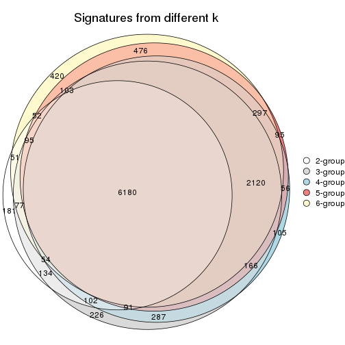

`get_signature()` returns a data frame invisibly. TO get the list of signatures, the function
call should be assigned to a variable explicitly. In following code, if `plot` argument is set
to `FALSE`, no heatmap is plotted while only the differential analysis is performed.

```r
# code only for demonstration
tb = get_signature(res, k = ..., plot = FALSE)
```

An example of the output of `tb` is:

```
#>   which_row         fdr    mean_1    mean_2 scaled_mean_1 scaled_mean_2 km
#> 1        38 0.042760348  8.373488  9.131774    -0.5533452     0.5164555  1
#> 2        40 0.018707592  7.106213  8.469186    -0.6173731     0.5762149  1
#> 3        55 0.019134737 10.221463 11.207825    -0.6159697     0.5749050  1
#> 4        59 0.006059896  5.921854  7.869574    -0.6899429     0.6439467  1
#> 5        60 0.018055526  8.928898 10.211722    -0.6204761     0.5791110  1
#> 6        98 0.009384629 15.714769 14.887706     0.6635654    -0.6193277  2
...
```

The columns in `tb` are:

1. `which_row`: row indices corresponding to the input matrix.
2. `fdr`: FDR for the differential test. 
3. `mean_x`: The mean value in group x.
4. `scaled_mean_x`: The mean value in group x after rows are scaled.
5. `km`: Row groups if k-means clustering is applied to rows.


UMAP plot which shows how samples are separated.


<script>
$( function() {
	$( '#tabs-SD-pam-dimension-reduction' ).tabs();
} );
</script>
<div id='tabs-SD-pam-dimension-reduction'>
<ul>
<li><a href='#tab-SD-pam-dimension-reduction-1'>k = 2</a></li>
<li><a href='#tab-SD-pam-dimension-reduction-2'>k = 3</a></li>
<li><a href='#tab-SD-pam-dimension-reduction-3'>k = 4</a></li>
<li><a href='#tab-SD-pam-dimension-reduction-4'>k = 5</a></li>
<li><a href='#tab-SD-pam-dimension-reduction-5'>k = 6</a></li>
</ul>
<div id='tab-SD-pam-dimension-reduction-1'>
<pre><code class="r">dimension_reduction(res, k = 2, method = &quot;UMAP&quot;)
</code></pre>

<p></p>

</div>
<div id='tab-SD-pam-dimension-reduction-2'>
<pre><code class="r">dimension_reduction(res, k = 3, method = &quot;UMAP&quot;)
</code></pre>

<p></p>

</div>
<div id='tab-SD-pam-dimension-reduction-3'>
<pre><code class="r">dimension_reduction(res, k = 4, method = &quot;UMAP&quot;)
</code></pre>

<p></p>

</div>
<div id='tab-SD-pam-dimension-reduction-4'>
<pre><code class="r">dimension_reduction(res, k = 5, method = &quot;UMAP&quot;)
</code></pre>

<p></p>

</div>
<div id='tab-SD-pam-dimension-reduction-5'>
<pre><code class="r">dimension_reduction(res, k = 6, method = &quot;UMAP&quot;)
</code></pre>

<p></p>

</div>
</div>


Following heatmap shows how subgroups are split when increasing `k`:

```r
collect_classes(res)
```


Test correlation between subgroups and known annotations. If the known
annotation is numeric, one-way ANOVA test is applied, and if the known
annotation is discrete, chi-squared contingency table test is applied.

```r
test_to_known_factors(res)
```

```
#>         n protocol(p) agent(p) individual(p) k
#> SD:pam 78       1.000    0.893      3.28e-03 2
#> SD:pam 75       0.724    0.879      1.65e-05 3
#> SD:pam 81       0.639    0.970      5.50e-07 4
#> SD:pam 76       0.620    0.728      3.78e-08 5
#> SD:pam 75       0.709    0.842      1.40e-08 6
```


If matrix rows can be associated to genes, consider to use `functional_enrichment(res,
...)` to perform function enrichment for the signature genes. See [this vignette](http://bioconductor.org/packages/devel/bioc/vignettes/cola/inst/doc/functional_enrichment.html) for more detailed explanations.


 

---------------------------------------------------


### SD:mclust


The object with results only for a single top-value method and a single partition method 
can be extracted as:

```r
res = res_list["SD", "mclust"]
# you can also extract it by
# res = res_list["SD:mclust"]
```

A summary of `res` and all the functions that can be applied to it:

```r
res
```

```
#> A 'ConsensusPartition' object with k = 2, 3, 4, 5, 6.
#>   On a matrix with 15497 rows and 84 columns.
#>   Top rows (1000, 2000, 3000, 4000, 5000) are extracted by 'SD' method.
#>   Subgroups are detected by 'mclust' method.
#>   Performed in total 1250 partitions by row resampling.
#>   Best k for subgroups seems to be 4.
#> 
#> Following methods can be applied to this 'ConsensusPartition' object:
#>  [1] "cola_report"             "collect_classes"         "collect_plots"          
#>  [4] "collect_stats"           "colnames"                "compare_signatures"     
#>  [7] "consensus_heatmap"       "dimension_reduction"     "functional_enrichment"  
#> [10] "get_anno_col"            "get_anno"                "get_classes"            
#> [13] "get_consensus"           "get_matrix"              "get_membership"         
#> [16] "get_param"               "get_signatures"          "get_stats"              
#> [19] "is_best_k"               "is_stable_k"             "membership_heatmap"     
#> [22] "ncol"                    "nrow"                    "plot_ecdf"              
#> [25] "rownames"                "select_partition_number" "show"                   
#> [28] "suggest_best_k"          "test_to_known_factors"
```

`collect_plots()` function collects all the plots made from `res` for all `k` (number of partitions)
into one single page to provide an easy and fast comparison between different `k`.

```r
collect_plots(res)
```


The plots are:

- The first row: a plot of the ECDF (empirical cumulative distribution
  function) curves of the consensus matrix for each `k` and the heatmap of
  predicted classes for each `k`.
- The second row: heatmaps of the consensus matrix for each `k`.
- The third row: heatmaps of the membership matrix for each `k`.
- The fouth row: heatmaps of the signatures for each `k`.

All the plots in panels can be made by individual functions and they are
plotted later in this section.

`select_partition_number()` produces several plots showing different
statistics for choosing "optimized" `k`. There are following statistics:

- ECDF curves of the consensus matrix for each `k`;
- 1-PAC. [The PAC
  score](https://en.wikipedia.org/wiki/Consensus_clustering#Over-interpretation_potential_of_consensus_clustering)
  measures the proportion of the ambiguous subgrouping.
- Mean silhouette score.
- Concordance. The mean probability of fiting the consensus class ids in all
  partitions.
- Area increased. Denote $A_k$ as the area under the ECDF curve for current
  `k`, the area increased is defined as $A_k - A_{k-1}$.
- Rand index. The percent of pairs of samples that are both in a same cluster
  or both are not in a same cluster in the partition of k and k-1.
- Jaccard index. The ratio of pairs of samples are both in a same cluster in
  the partition of k and k-1 and the pairs of samples are both in a same
  cluster in the partition k or k-1.

The detailed explanations of these statistics can be found in [the _cola_
vignette](http://bioconductor.org/packages/devel/bioc/vignettes/cola/inst/doc/cola.html#toc_13).

Generally speaking, lower PAC score, higher mean silhouette score or higher
concordance corresponds to better partition. Rand index and Jaccard index
measure how similar the current partition is compared to partition with `k-1`.
If they are too similar, we won't accept `k` is better than `k-1`.

```r
select_partition_number(res)
```


The numeric values for all these statistics can be obtained by `get_stats()`.

```r
get_stats(res)
```

```
#>   k 1-PAC mean_silhouette concordance area_increased  Rand Jaccard
#> 2 2 0.533           0.618       0.843         0.4577 0.501   0.501
#> 3 3 0.679           0.853       0.888         0.3861 0.799   0.614
#> 4 4 0.852           0.885       0.922         0.0971 0.869   0.662
#> 5 5 0.679           0.780       0.834         0.0611 0.989   0.964
#> 6 6 0.715           0.758       0.801         0.0566 0.916   0.722
```

`suggest_best_k()` suggests the best $k$ based on these statistics. The rules are as follows:

- All $k$ with Jaccard index larger than 0.95 are removed because increasing
  $k$ does not provide enough extra information. If all $k$ are removed, it is
  marked as no subgroup is detected.
- For all $k$ with 1-PAC score larger than 0.9, the maximal $k$ is taken as
  the best $k$, and other $k$ are marked as optional $k$.
- If it does not fit the second rule. The $k$ with the maximal vote of the
  highest 1-PAC score, highest mean silhouette, and highest concordance is
  taken as the best $k$.

```r
suggest_best_k(res)
```

```
#> [1] 4
```


Following shows the table of the partitions (You need to click the **show/hide
code output** link to see it). The membership matrix (columns with name `p*`)
is inferred by
[`clue::cl_consensus()`](https://www.rdocumentation.org/link/cl_consensus?package=clue)
function with the `SE` method. Basically the value in the membership matrix
represents the probability to belong to a certain group. The finall class
label for an item is determined with the group with highest probability it
belongs to.

In `get_classes()` function, the entropy is calculated from the membership
matrix and the silhouette score is calculated from the consensus matrix.


<script>
$( function() {
	$( '#tabs-SD-mclust-get-classes' ).tabs();
} );
</script>
<div id='tabs-SD-mclust-get-classes'>
<ul>
<li><a href='#tab-SD-mclust-get-classes-1'>k = 2</a></li>
<li><a href='#tab-SD-mclust-get-classes-2'>k = 3</a></li>
<li><a href='#tab-SD-mclust-get-classes-3'>k = 4</a></li>
<li><a href='#tab-SD-mclust-get-classes-4'>k = 5</a></li>
<li><a href='#tab-SD-mclust-get-classes-5'>k = 6</a></li>
</ul>

<div id='tab-SD-mclust-get-classes-1'>
<p><a id='tab-SD-mclust-get-classes-1-a' style='color:#0366d6' href='#'>show/hide code output</a></p>
<pre><code class="r">cbind(get_classes(res, k = 2), get_membership(res, k = 2))
</code></pre>

<pre><code>#&gt;           class entropy silhouette    p1    p2
#&gt; GSM339455     1  0.9983     0.3132 0.524 0.476
#&gt; GSM339456     2  0.3274     0.8271 0.060 0.940
#&gt; GSM339457     1  0.9983     0.3132 0.524 0.476
#&gt; GSM339458     2  0.2236     0.8469 0.036 0.964
#&gt; GSM339459     1  0.9983     0.3132 0.524 0.476
#&gt; GSM339460     2  0.0000     0.8715 0.000 1.000
#&gt; GSM339461     2  0.4815     0.7768 0.104 0.896
#&gt; GSM339462     1  0.3274     0.7114 0.940 0.060
#&gt; GSM339463     1  0.3114     0.7101 0.944 0.056
#&gt; GSM339464     1  0.3584     0.7073 0.932 0.068
#&gt; GSM339465     1  0.0376     0.7181 0.996 0.004
#&gt; GSM339466     2  0.0000     0.8715 0.000 1.000
#&gt; GSM339467     2  0.0000     0.8715 0.000 1.000
#&gt; GSM339468     2  0.9710     0.0501 0.400 0.600
#&gt; GSM339469     1  0.3431     0.7096 0.936 0.064
#&gt; GSM339470     2  0.9970    -0.2023 0.468 0.532
#&gt; GSM339471     1  0.0376     0.7181 0.996 0.004
#&gt; GSM339472     2  0.0000     0.8715 0.000 1.000
#&gt; GSM339473     1  0.0376     0.7181 0.996 0.004
#&gt; GSM339474     2  0.0000     0.8715 0.000 1.000
#&gt; GSM339475     1  0.9983     0.3132 0.524 0.476
#&gt; GSM339476     1  0.0938     0.7197 0.988 0.012
#&gt; GSM339477     2  0.0672     0.8669 0.008 0.992
#&gt; GSM339478     1  0.9993     0.2925 0.516 0.484
#&gt; GSM339479     2  0.9775    -0.0105 0.412 0.588
#&gt; GSM339480     1  0.9983     0.3132 0.524 0.476
#&gt; GSM339481     2  0.0000     0.8715 0.000 1.000
#&gt; GSM339482     1  0.9983     0.3132 0.524 0.476
#&gt; GSM339483     1  0.3274     0.7114 0.940 0.060
#&gt; GSM339484     1  0.0938     0.7197 0.988 0.012
#&gt; GSM339485     1  0.3584     0.7073 0.932 0.068
#&gt; GSM339486     1  0.0376     0.7181 0.996 0.004
#&gt; GSM339487     2  0.0000     0.8715 0.000 1.000
#&gt; GSM339488     2  0.0000     0.8715 0.000 1.000
#&gt; GSM339489     2  0.4298     0.7966 0.088 0.912
#&gt; GSM339490     1  0.3431     0.7096 0.936 0.064
#&gt; GSM339491     2  0.9970    -0.2023 0.468 0.532
#&gt; GSM339492     1  0.0376     0.7181 0.996 0.004
#&gt; GSM339493     2  0.0000     0.8715 0.000 1.000
#&gt; GSM339494     1  0.0376     0.7181 0.996 0.004
#&gt; GSM339495     2  0.0000     0.8715 0.000 1.000
#&gt; GSM339496     1  0.9983     0.3132 0.524 0.476
#&gt; GSM339497     2  0.0000     0.8715 0.000 1.000
#&gt; GSM339498     2  0.9977    -0.2145 0.472 0.528
#&gt; GSM339499     1  0.9983     0.3132 0.524 0.476
#&gt; GSM339500     2  0.3274     0.8273 0.060 0.940
#&gt; GSM339501     1  0.9866     0.3766 0.568 0.432
#&gt; GSM339502     2  0.0000     0.8715 0.000 1.000
#&gt; GSM339503     1  0.9983     0.3132 0.524 0.476
#&gt; GSM339504     1  0.3274     0.7114 0.940 0.060
#&gt; GSM339505     1  0.9988     0.3042 0.520 0.480
#&gt; GSM339506     1  0.3431     0.7118 0.936 0.064
#&gt; GSM339507     1  0.0376     0.7181 0.996 0.004
#&gt; GSM339508     2  0.0000     0.8715 0.000 1.000
#&gt; GSM339509     2  0.0000     0.8715 0.000 1.000
#&gt; GSM339510     2  0.9881    -0.0938 0.436 0.564
#&gt; GSM339511     1  0.4939     0.6755 0.892 0.108
#&gt; GSM339512     2  0.0000     0.8715 0.000 1.000
#&gt; GSM339513     1  0.0938     0.7197 0.988 0.012
#&gt; GSM339514     2  0.0000     0.8715 0.000 1.000
#&gt; GSM339515     1  0.0376     0.7181 0.996 0.004
#&gt; GSM339516     2  0.0000     0.8715 0.000 1.000
#&gt; GSM339517     1  0.9983     0.3132 0.524 0.476
#&gt; GSM339518     2  0.0000     0.8715 0.000 1.000
#&gt; GSM339519     1  0.9983     0.3132 0.524 0.476
#&gt; GSM339520     1  0.9983     0.3132 0.524 0.476
#&gt; GSM339521     2  0.0000     0.8715 0.000 1.000
#&gt; GSM339522     2  0.2603     0.8403 0.044 0.956
#&gt; GSM339523     2  0.0000     0.8715 0.000 1.000
#&gt; GSM339524     1  0.0938     0.7197 0.988 0.012
#&gt; GSM339525     1  0.3274     0.7114 0.940 0.060
#&gt; GSM339526     1  0.9983     0.3132 0.524 0.476
#&gt; GSM339527     1  0.3431     0.7118 0.936 0.064
#&gt; GSM339528     1  0.0376     0.7181 0.996 0.004
#&gt; GSM339529     2  0.0000     0.8715 0.000 1.000
#&gt; GSM339530     1  0.9983     0.3132 0.524 0.476
#&gt; GSM339531     2  0.4690     0.7819 0.100 0.900
#&gt; GSM339532     1  0.3431     0.7096 0.936 0.064
#&gt; GSM339533     1  0.9983     0.3132 0.524 0.476
#&gt; GSM339534     1  0.0938     0.7197 0.988 0.012
#&gt; GSM339535     2  0.0000     0.8715 0.000 1.000
#&gt; GSM339536     1  0.0376     0.7181 0.996 0.004
#&gt; GSM339537     2  0.0000     0.8715 0.000 1.000
#&gt; GSM339538     1  0.9983     0.3132 0.524 0.476
</code></pre>

<script>
$('#tab-SD-mclust-get-classes-1-a').parent().next().next().hide();
$('#tab-SD-mclust-get-classes-1-a').click(function(){
  $('#tab-SD-mclust-get-classes-1-a').parent().next().next().toggle();
  return(false);
});
</script>
</div>

<div id='tab-SD-mclust-get-classes-2'>
<p><a id='tab-SD-mclust-get-classes-2-a' style='color:#0366d6' href='#'>show/hide code output</a></p>
<pre><code class="r">cbind(get_classes(res, k = 3), get_membership(res, k = 3))
</code></pre>

<pre><code>#&gt;           class entropy silhouette    p1    p2    p3
#&gt; GSM339455     3  0.5581      0.734 0.168 0.040 0.792
#&gt; GSM339456     2  0.1015      0.958 0.012 0.980 0.008
#&gt; GSM339457     3  0.3532      0.870 0.008 0.108 0.884
#&gt; GSM339458     2  0.0661      0.959 0.008 0.988 0.004
#&gt; GSM339459     3  0.1919      0.885 0.024 0.020 0.956
#&gt; GSM339460     2  0.0424      0.959 0.008 0.992 0.000
#&gt; GSM339461     2  0.1482      0.956 0.020 0.968 0.012
#&gt; GSM339462     1  0.1751      0.746 0.960 0.012 0.028
#&gt; GSM339463     3  0.4228      0.764 0.148 0.008 0.844
#&gt; GSM339464     1  0.1751      0.746 0.960 0.012 0.028
#&gt; GSM339465     3  0.3425      0.810 0.112 0.004 0.884
#&gt; GSM339466     2  0.0237      0.960 0.004 0.996 0.000
#&gt; GSM339467     2  0.0424      0.959 0.008 0.992 0.000
#&gt; GSM339468     2  0.2434      0.933 0.024 0.940 0.036
#&gt; GSM339469     1  0.2527      0.754 0.936 0.020 0.044
#&gt; GSM339470     3  0.4062      0.824 0.000 0.164 0.836
#&gt; GSM339471     1  0.5873      0.777 0.684 0.004 0.312
#&gt; GSM339472     2  0.1015      0.958 0.012 0.980 0.008
#&gt; GSM339473     1  0.5650      0.776 0.688 0.000 0.312
#&gt; GSM339474     2  0.1015      0.958 0.012 0.980 0.008
#&gt; GSM339475     3  0.0475      0.890 0.004 0.004 0.992
#&gt; GSM339476     1  0.6715      0.764 0.660 0.028 0.312
#&gt; GSM339477     2  0.1015      0.958 0.012 0.980 0.008
#&gt; GSM339478     2  0.6229      0.414 0.008 0.652 0.340
#&gt; GSM339479     2  0.4892      0.806 0.112 0.840 0.048
#&gt; GSM339480     3  0.1620      0.886 0.024 0.012 0.964
#&gt; GSM339481     2  0.0592      0.958 0.012 0.988 0.000
#&gt; GSM339482     3  0.0892      0.897 0.000 0.020 0.980
#&gt; GSM339483     1  0.1877      0.748 0.956 0.012 0.032
#&gt; GSM339484     1  0.6155      0.768 0.664 0.008 0.328
#&gt; GSM339485     1  0.1751      0.746 0.960 0.012 0.028
#&gt; GSM339486     1  0.5873      0.777 0.684 0.004 0.312
#&gt; GSM339487     2  0.0237      0.960 0.004 0.996 0.000
#&gt; GSM339488     2  0.0424      0.959 0.008 0.992 0.000
#&gt; GSM339489     2  0.1267      0.953 0.004 0.972 0.024
#&gt; GSM339490     1  0.1751      0.746 0.960 0.012 0.028
#&gt; GSM339491     2  0.5733      0.450 0.000 0.676 0.324
#&gt; GSM339492     1  0.5982      0.771 0.668 0.004 0.328
#&gt; GSM339493     2  0.0237      0.960 0.004 0.996 0.000
#&gt; GSM339494     1  0.5650      0.776 0.688 0.000 0.312
#&gt; GSM339495     2  0.1015      0.958 0.012 0.980 0.008
#&gt; GSM339496     3  0.0661      0.888 0.008 0.004 0.988
#&gt; GSM339497     2  0.0424      0.958 0.000 0.992 0.008
#&gt; GSM339498     3  0.3028      0.860 0.032 0.048 0.920
#&gt; GSM339499     3  0.3532      0.870 0.008 0.108 0.884
#&gt; GSM339500     2  0.0892      0.951 0.000 0.980 0.020
#&gt; GSM339501     1  0.7141      0.679 0.600 0.032 0.368
#&gt; GSM339502     2  0.0424      0.959 0.008 0.992 0.000
#&gt; GSM339503     3  0.0892      0.897 0.000 0.020 0.980
#&gt; GSM339504     1  0.1751      0.746 0.960 0.012 0.028
#&gt; GSM339505     3  0.3896      0.861 0.008 0.128 0.864
#&gt; GSM339506     1  0.3618      0.770 0.884 0.012 0.104
#&gt; GSM339507     1  0.5785      0.770 0.668 0.000 0.332
#&gt; GSM339508     2  0.1015      0.958 0.012 0.980 0.008
#&gt; GSM339509     2  0.0424      0.959 0.008 0.992 0.000
#&gt; GSM339510     2  0.2681      0.925 0.040 0.932 0.028
#&gt; GSM339511     1  0.4979      0.677 0.812 0.168 0.020
#&gt; GSM339512     2  0.0424      0.959 0.008 0.992 0.000
#&gt; GSM339513     1  0.6396      0.767 0.664 0.016 0.320
#&gt; GSM339514     2  0.0424      0.959 0.008 0.992 0.000
#&gt; GSM339515     1  0.5650      0.776 0.688 0.000 0.312
#&gt; GSM339516     2  0.0892      0.955 0.020 0.980 0.000
#&gt; GSM339517     3  0.0892      0.897 0.000 0.020 0.980
#&gt; GSM339518     2  0.0424      0.959 0.008 0.992 0.000
#&gt; GSM339519     3  0.1031      0.897 0.000 0.024 0.976
#&gt; GSM339520     3  0.3607      0.868 0.008 0.112 0.880
#&gt; GSM339521     2  0.0237      0.960 0.004 0.996 0.000
#&gt; GSM339522     2  0.1337      0.954 0.012 0.972 0.016
#&gt; GSM339523     2  0.0424      0.959 0.008 0.992 0.000
#&gt; GSM339524     1  0.7021      0.628 0.544 0.020 0.436
#&gt; GSM339525     1  0.4411      0.776 0.844 0.016 0.140
#&gt; GSM339526     3  0.0829      0.895 0.004 0.012 0.984
#&gt; GSM339527     1  0.5220      0.742 0.780 0.012 0.208
#&gt; GSM339528     1  0.5873      0.777 0.684 0.004 0.312
#&gt; GSM339529     2  0.1015      0.958 0.012 0.980 0.008
#&gt; GSM339530     3  0.3532      0.870 0.008 0.108 0.884
#&gt; GSM339531     2  0.1482      0.956 0.012 0.968 0.020
#&gt; GSM339532     1  0.4799      0.703 0.836 0.132 0.032
#&gt; GSM339533     3  0.3682      0.867 0.008 0.116 0.876
#&gt; GSM339534     1  0.6501      0.768 0.664 0.020 0.316
#&gt; GSM339535     2  0.0424      0.959 0.008 0.992 0.000
#&gt; GSM339536     1  0.5650      0.776 0.688 0.000 0.312
#&gt; GSM339537     2  0.1015      0.958 0.012 0.980 0.008
#&gt; GSM339538     3  0.0892      0.897 0.000 0.020 0.980
</code></pre>

<script>
$('#tab-SD-mclust-get-classes-2-a').parent().next().next().hide();
$('#tab-SD-mclust-get-classes-2-a').click(function(){
  $('#tab-SD-mclust-get-classes-2-a').parent().next().next().toggle();
  return(false);
});
</script>
</div>

<div id='tab-SD-mclust-get-classes-3'>
<p><a id='tab-SD-mclust-get-classes-3-a' style='color:#0366d6' href='#'>show/hide code output</a></p>
<pre><code class="r">cbind(get_classes(res, k = 4), get_membership(res, k = 4))
</code></pre>

<pre><code>#&gt;           class entropy silhouette    p1    p2    p3    p4
#&gt; GSM339455     3  0.2706      0.864 0.080 0.020 0.900 0.000
#&gt; GSM339456     2  0.1191      0.974 0.024 0.968 0.004 0.004
#&gt; GSM339457     3  0.1867      0.872 0.072 0.000 0.928 0.000
#&gt; GSM339458     2  0.0592      0.970 0.000 0.984 0.016 0.000
#&gt; GSM339459     3  0.0859      0.871 0.008 0.008 0.980 0.004
#&gt; GSM339460     2  0.0188      0.971 0.000 0.996 0.004 0.000
#&gt; GSM339461     2  0.1543      0.971 0.032 0.956 0.004 0.008
#&gt; GSM339462     4  0.0000      0.914 0.000 0.000 0.000 1.000
#&gt; GSM339463     3  0.3894      0.811 0.140 0.004 0.832 0.024
#&gt; GSM339464     4  0.0000      0.914 0.000 0.000 0.000 1.000
#&gt; GSM339465     3  0.5610      0.476 0.356 0.004 0.616 0.024
#&gt; GSM339466     2  0.1396      0.973 0.032 0.960 0.004 0.004
#&gt; GSM339467     2  0.1284      0.964 0.024 0.964 0.012 0.000
#&gt; GSM339468     2  0.1543      0.971 0.032 0.956 0.004 0.008
#&gt; GSM339469     4  0.0000      0.914 0.000 0.000 0.000 1.000
#&gt; GSM339470     3  0.3598      0.792 0.028 0.124 0.848 0.000
#&gt; GSM339471     1  0.3328      0.922 0.872 0.004 0.100 0.024
#&gt; GSM339472     2  0.0895      0.974 0.020 0.976 0.000 0.004
#&gt; GSM339473     1  0.1920      0.908 0.944 0.004 0.028 0.024
#&gt; GSM339474     2  0.1211      0.954 0.000 0.960 0.000 0.040
#&gt; GSM339475     3  0.0592      0.872 0.016 0.000 0.984 0.000
#&gt; GSM339476     3  0.5867      0.724 0.092 0.016 0.728 0.164
#&gt; GSM339477     2  0.1489      0.951 0.000 0.952 0.004 0.044
#&gt; GSM339478     3  0.5288      0.665 0.068 0.200 0.732 0.000
#&gt; GSM339479     2  0.1118      0.959 0.000 0.964 0.036 0.000
#&gt; GSM339480     3  0.0859      0.871 0.008 0.008 0.980 0.004
#&gt; GSM339481     2  0.0376      0.972 0.000 0.992 0.004 0.004
#&gt; GSM339482     3  0.0000      0.870 0.000 0.000 1.000 0.000
#&gt; GSM339483     4  0.0000      0.914 0.000 0.000 0.000 1.000
#&gt; GSM339484     1  0.3264      0.924 0.876 0.004 0.096 0.024
#&gt; GSM339485     4  0.0000      0.914 0.000 0.000 0.000 1.000
#&gt; GSM339486     1  0.3067      0.928 0.888 0.004 0.084 0.024
#&gt; GSM339487     2  0.1396      0.973 0.032 0.960 0.004 0.004
#&gt; GSM339488     2  0.1151      0.965 0.024 0.968 0.008 0.000
#&gt; GSM339489     2  0.1396      0.973 0.032 0.960 0.004 0.004
#&gt; GSM339490     4  0.0000      0.914 0.000 0.000 0.000 1.000
#&gt; GSM339491     3  0.5291      0.516 0.024 0.324 0.652 0.000
#&gt; GSM339492     1  0.3945      0.890 0.828 0.004 0.144 0.024
#&gt; GSM339493     2  0.1296      0.973 0.028 0.964 0.004 0.004
#&gt; GSM339494     1  0.1920      0.908 0.944 0.004 0.028 0.024
#&gt; GSM339495     2  0.1302      0.952 0.000 0.956 0.000 0.044
#&gt; GSM339496     3  0.1474      0.872 0.052 0.000 0.948 0.000
#&gt; GSM339497     2  0.1356      0.972 0.032 0.960 0.008 0.000
#&gt; GSM339498     3  0.2673      0.841 0.008 0.080 0.904 0.008
#&gt; GSM339499     3  0.1867      0.872 0.072 0.000 0.928 0.000
#&gt; GSM339500     2  0.1488      0.971 0.032 0.956 0.012 0.000
#&gt; GSM339501     3  0.4469      0.789 0.000 0.080 0.808 0.112
#&gt; GSM339502     2  0.1284      0.964 0.024 0.964 0.012 0.000
#&gt; GSM339503     3  0.0336      0.871 0.008 0.000 0.992 0.000
#&gt; GSM339504     4  0.0000      0.914 0.000 0.000 0.000 1.000
#&gt; GSM339505     3  0.2125      0.871 0.076 0.004 0.920 0.000
#&gt; GSM339506     4  0.4817      0.256 0.000 0.000 0.388 0.612
#&gt; GSM339507     1  0.3067      0.928 0.888 0.004 0.084 0.024
#&gt; GSM339508     2  0.0336      0.971 0.000 0.992 0.000 0.008
#&gt; GSM339509     2  0.1151      0.965 0.024 0.968 0.008 0.000
#&gt; GSM339510     2  0.1943      0.967 0.032 0.944 0.008 0.016
#&gt; GSM339511     4  0.2469      0.808 0.000 0.108 0.000 0.892
#&gt; GSM339512     2  0.1109      0.973 0.028 0.968 0.004 0.000
#&gt; GSM339513     1  0.5426      0.608 0.656 0.004 0.316 0.024
#&gt; GSM339514     2  0.1284      0.964 0.024 0.964 0.012 0.000
#&gt; GSM339515     1  0.1920      0.908 0.944 0.004 0.028 0.024
#&gt; GSM339516     2  0.1211      0.954 0.000 0.960 0.000 0.040
#&gt; GSM339517     3  0.0000      0.870 0.000 0.000 1.000 0.000
#&gt; GSM339518     2  0.0336      0.971 0.000 0.992 0.008 0.000
#&gt; GSM339519     3  0.1118      0.873 0.036 0.000 0.964 0.000
#&gt; GSM339520     3  0.1867      0.872 0.072 0.000 0.928 0.000
#&gt; GSM339521     2  0.1396      0.973 0.032 0.960 0.004 0.004
#&gt; GSM339522     2  0.1396      0.972 0.032 0.960 0.004 0.004
#&gt; GSM339523     2  0.0895      0.968 0.020 0.976 0.004 0.000
#&gt; GSM339524     3  0.2469      0.819 0.108 0.000 0.892 0.000
#&gt; GSM339525     4  0.0336      0.907 0.000 0.000 0.008 0.992
#&gt; GSM339526     3  0.0592      0.872 0.016 0.000 0.984 0.000
#&gt; GSM339527     3  0.4990      0.499 0.000 0.008 0.640 0.352
#&gt; GSM339528     1  0.3067      0.928 0.888 0.004 0.084 0.024
#&gt; GSM339529     2  0.0188      0.971 0.000 0.996 0.000 0.004
#&gt; GSM339530     3  0.1867      0.872 0.072 0.000 0.928 0.000
#&gt; GSM339531     2  0.1690      0.972 0.032 0.952 0.008 0.008
#&gt; GSM339532     4  0.2281      0.822 0.000 0.096 0.000 0.904
#&gt; GSM339533     3  0.3052      0.843 0.136 0.004 0.860 0.000
#&gt; GSM339534     3  0.4489      0.748 0.192 0.004 0.780 0.024
#&gt; GSM339535     2  0.1356      0.973 0.032 0.960 0.008 0.000
#&gt; GSM339536     1  0.1920      0.908 0.944 0.004 0.028 0.024
#&gt; GSM339537     2  0.2021      0.956 0.024 0.936 0.000 0.040
#&gt; GSM339538     3  0.0000      0.870 0.000 0.000 1.000 0.000
</code></pre>

<script>
$('#tab-SD-mclust-get-classes-3-a').parent().next().next().hide();
$('#tab-SD-mclust-get-classes-3-a').click(function(){
  $('#tab-SD-mclust-get-classes-3-a').parent().next().next().toggle();
  return(false);
});
</script>
</div>

<div id='tab-SD-mclust-get-classes-4'>
<p><a id='tab-SD-mclust-get-classes-4-a' style='color:#0366d6' href='#'>show/hide code output</a></p>
<pre><code class="r">cbind(get_classes(res, k = 5), get_membership(res, k = 5))
</code></pre>

<pre><code>#&gt;           class entropy silhouette    p1    p2    p3    p4 p5
#&gt; GSM339455     3  0.3587     0.7929 0.096 0.024 0.844 0.000 NA
#&gt; GSM339456     2  0.0771     0.8576 0.000 0.976 0.004 0.000 NA
#&gt; GSM339457     3  0.3700     0.7231 0.008 0.000 0.752 0.000 NA
#&gt; GSM339458     2  0.1757     0.8519 0.012 0.936 0.004 0.000 NA
#&gt; GSM339459     3  0.3010     0.7687 0.000 0.004 0.824 0.000 NA
#&gt; GSM339460     2  0.1121     0.8547 0.000 0.956 0.000 0.000 NA
#&gt; GSM339461     2  0.3160     0.8273 0.000 0.808 0.004 0.000 NA
#&gt; GSM339462     4  0.0000     0.8507 0.000 0.000 0.000 1.000 NA
#&gt; GSM339463     3  0.3366     0.7055 0.232 0.000 0.768 0.000 NA
#&gt; GSM339464     4  0.0000     0.8507 0.000 0.000 0.000 1.000 NA
#&gt; GSM339465     3  0.3684     0.6554 0.280 0.000 0.720 0.000 NA
#&gt; GSM339466     2  0.3177     0.8291 0.000 0.792 0.000 0.000 NA
#&gt; GSM339467     2  0.4066     0.6962 0.000 0.672 0.004 0.000 NA
#&gt; GSM339468     2  0.3596     0.8161 0.000 0.784 0.016 0.000 NA
#&gt; GSM339469     4  0.0000     0.8507 0.000 0.000 0.000 1.000 NA
#&gt; GSM339470     3  0.3933     0.7641 0.012 0.112 0.816 0.000 NA
#&gt; GSM339471     1  0.2074     0.9123 0.896 0.000 0.104 0.000 NA
#&gt; GSM339472     2  0.0794     0.8542 0.000 0.972 0.000 0.000 NA
#&gt; GSM339473     1  0.0000     0.8828 1.000 0.000 0.000 0.000 NA
#&gt; GSM339474     2  0.1732     0.8422 0.000 0.920 0.000 0.000 NA
#&gt; GSM339475     3  0.1205     0.8123 0.004 0.000 0.956 0.000 NA
#&gt; GSM339476     3  0.5086     0.6790 0.156 0.000 0.700 0.144 NA
#&gt; GSM339477     2  0.1892     0.8418 0.000 0.916 0.000 0.004 NA
#&gt; GSM339478     3  0.5645     0.3737 0.008 0.352 0.572 0.000 NA
#&gt; GSM339479     2  0.3730     0.7961 0.012 0.828 0.112 0.000 NA
#&gt; GSM339480     3  0.3242     0.7665 0.000 0.012 0.816 0.000 NA
#&gt; GSM339481     2  0.0703     0.8545 0.000 0.976 0.000 0.000 NA
#&gt; GSM339482     3  0.1121     0.8110 0.000 0.000 0.956 0.000 NA
#&gt; GSM339483     4  0.0000     0.8507 0.000 0.000 0.000 1.000 NA
#&gt; GSM339484     1  0.2377     0.8944 0.872 0.000 0.128 0.000 NA
#&gt; GSM339485     4  0.0000     0.8507 0.000 0.000 0.000 1.000 NA
#&gt; GSM339486     1  0.1908     0.9161 0.908 0.000 0.092 0.000 NA
#&gt; GSM339487     2  0.3074     0.8278 0.000 0.804 0.000 0.000 NA
#&gt; GSM339488     2  0.4066     0.6962 0.000 0.672 0.004 0.000 NA
#&gt; GSM339489     2  0.3039     0.8273 0.000 0.808 0.000 0.000 NA
#&gt; GSM339490     4  0.0000     0.8507 0.000 0.000 0.000 1.000 NA
#&gt; GSM339491     3  0.5664     0.3288 0.012 0.384 0.548 0.000 NA
#&gt; GSM339492     1  0.2471     0.8922 0.864 0.000 0.136 0.000 NA
#&gt; GSM339493     2  0.2561     0.8410 0.000 0.856 0.000 0.000 NA
#&gt; GSM339494     1  0.0000     0.8828 1.000 0.000 0.000 0.000 NA
#&gt; GSM339495     2  0.1732     0.8422 0.000 0.920 0.000 0.000 NA
#&gt; GSM339496     3  0.1300     0.8115 0.028 0.000 0.956 0.000 NA
#&gt; GSM339497     2  0.3196     0.8368 0.004 0.804 0.000 0.000 NA
#&gt; GSM339498     3  0.4143     0.7740 0.000 0.084 0.804 0.012 NA
#&gt; GSM339499     3  0.3728     0.7218 0.008 0.000 0.748 0.000 NA
#&gt; GSM339500     2  0.4822     0.7905 0.008 0.728 0.072 0.000 NA
#&gt; GSM339501     3  0.4801     0.7394 0.000 0.092 0.768 0.108 NA
#&gt; GSM339502     2  0.4047     0.6975 0.000 0.676 0.004 0.000 NA
#&gt; GSM339503     3  0.0290     0.8119 0.000 0.000 0.992 0.000 NA
#&gt; GSM339504     4  0.0000     0.8507 0.000 0.000 0.000 1.000 NA
#&gt; GSM339505     3  0.3165     0.7940 0.036 0.000 0.848 0.000 NA
#&gt; GSM339506     4  0.4622     0.1312 0.000 0.000 0.440 0.548 NA
#&gt; GSM339507     1  0.2074     0.9126 0.896 0.000 0.104 0.000 NA
#&gt; GSM339508     2  0.1121     0.8524 0.000 0.956 0.000 0.000 NA
#&gt; GSM339509     2  0.4066     0.6962 0.000 0.672 0.004 0.000 NA
#&gt; GSM339510     2  0.3596     0.8190 0.000 0.784 0.000 0.016 NA
#&gt; GSM339511     4  0.2329     0.7608 0.000 0.124 0.000 0.876 NA
#&gt; GSM339512     2  0.1502     0.8563 0.004 0.940 0.000 0.000 NA
#&gt; GSM339513     1  0.3336     0.7522 0.772 0.000 0.228 0.000 NA
#&gt; GSM339514     2  0.4066     0.6962 0.000 0.672 0.004 0.000 NA
#&gt; GSM339515     1  0.0000     0.8828 1.000 0.000 0.000 0.000 NA
#&gt; GSM339516     2  0.1341     0.8486 0.000 0.944 0.000 0.000 NA
#&gt; GSM339517     3  0.1121     0.8110 0.000 0.000 0.956 0.000 NA
#&gt; GSM339518     2  0.1205     0.8548 0.004 0.956 0.000 0.000 NA
#&gt; GSM339519     3  0.0451     0.8126 0.000 0.004 0.988 0.000 NA
#&gt; GSM339520     3  0.3728     0.7218 0.008 0.000 0.748 0.000 NA
#&gt; GSM339521     2  0.3074     0.8278 0.000 0.804 0.000 0.000 NA
#&gt; GSM339522     2  0.3266     0.8242 0.000 0.796 0.004 0.000 NA
#&gt; GSM339523     2  0.3521     0.7675 0.004 0.764 0.000 0.000 NA
#&gt; GSM339524     3  0.2719     0.7647 0.144 0.000 0.852 0.000 NA
#&gt; GSM339525     4  0.1671     0.7881 0.000 0.000 0.076 0.924 NA
#&gt; GSM339526     3  0.1205     0.8123 0.004 0.000 0.956 0.000 NA
#&gt; GSM339527     4  0.4656    -0.0169 0.000 0.000 0.480 0.508 NA
#&gt; GSM339528     1  0.1908     0.9161 0.908 0.000 0.092 0.000 NA
#&gt; GSM339529     2  0.0880     0.8539 0.000 0.968 0.000 0.000 NA
#&gt; GSM339530     3  0.3635     0.7212 0.004 0.000 0.748 0.000 NA
#&gt; GSM339531     2  0.3074     0.8240 0.000 0.804 0.000 0.000 NA
#&gt; GSM339532     4  0.2127     0.7733 0.000 0.108 0.000 0.892 NA
#&gt; GSM339533     3  0.2597     0.7978 0.092 0.000 0.884 0.000 NA
#&gt; GSM339534     3  0.3636     0.6593 0.272 0.000 0.728 0.000 NA
#&gt; GSM339535     2  0.2890     0.8502 0.000 0.836 0.004 0.000 NA
#&gt; GSM339536     1  0.0000     0.8828 1.000 0.000 0.000 0.000 NA
#&gt; GSM339537     2  0.1671     0.8432 0.000 0.924 0.000 0.000 NA
#&gt; GSM339538     3  0.1121     0.8110 0.000 0.000 0.956 0.000 NA
</code></pre>

<script>
$('#tab-SD-mclust-get-classes-4-a').parent().next().next().hide();
$('#tab-SD-mclust-get-classes-4-a').click(function(){
  $('#tab-SD-mclust-get-classes-4-a').parent().next().next().toggle();
  return(false);
});
</script>
</div>

<div id='tab-SD-mclust-get-classes-5'>
<p><a id='tab-SD-mclust-get-classes-5-a' style='color:#0366d6' href='#'>show/hide code output</a></p>
<pre><code class="r">cbind(get_classes(res, k = 6), get_membership(res, k = 6))
</code></pre>

<pre><code>#&gt;           class entropy silhouette    p1    p2    p3    p4    p5    p6
#&gt; GSM339455     3  0.5531      0.630 0.104 0.028 0.680 0.000 0.028 0.160
#&gt; GSM339456     2  0.2981      0.792 0.000 0.820 0.000 0.000 0.160 0.020
#&gt; GSM339457     6  0.2664      1.000 0.000 0.000 0.184 0.000 0.000 0.816
#&gt; GSM339458     2  0.3672      0.736 0.004 0.744 0.012 0.000 0.236 0.004
#&gt; GSM339459     3  0.4117      0.635 0.000 0.012 0.760 0.000 0.160 0.068
#&gt; GSM339460     2  0.3161      0.762 0.000 0.776 0.000 0.000 0.216 0.008
#&gt; GSM339461     2  0.1982      0.766 0.000 0.924 0.004 0.012 0.040 0.020
#&gt; GSM339462     4  0.0000      0.908 0.000 0.000 0.000 1.000 0.000 0.000
#&gt; GSM339463     3  0.4263      0.540 0.376 0.000 0.600 0.000 0.000 0.024
#&gt; GSM339464     4  0.0000      0.908 0.000 0.000 0.000 1.000 0.000 0.000
#&gt; GSM339465     3  0.3923      0.493 0.416 0.000 0.580 0.000 0.000 0.004
#&gt; GSM339466     2  0.1753      0.781 0.000 0.912 0.000 0.000 0.084 0.004
#&gt; GSM339467     5  0.3240      0.968 0.000 0.244 0.000 0.000 0.752 0.004
#&gt; GSM339468     2  0.3103      0.680 0.000 0.864 0.024 0.016 0.076 0.020
#&gt; GSM339469     4  0.0000      0.908 0.000 0.000 0.000 1.000 0.000 0.000
#&gt; GSM339470     3  0.6500      0.547 0.044 0.080 0.608 0.000 0.088 0.180
#&gt; GSM339471     1  0.1462      0.931 0.936 0.000 0.056 0.000 0.000 0.008
#&gt; GSM339472     2  0.2513      0.802 0.000 0.852 0.000 0.000 0.140 0.008
#&gt; GSM339473     1  0.1007      0.917 0.956 0.000 0.000 0.000 0.000 0.044
#&gt; GSM339474     2  0.3351      0.769 0.000 0.800 0.000 0.000 0.160 0.040
#&gt; GSM339475     3  0.1745      0.668 0.000 0.000 0.924 0.000 0.020 0.056
#&gt; GSM339476     3  0.5418      0.573 0.252 0.000 0.616 0.116 0.012 0.004
#&gt; GSM339477     2  0.3562      0.765 0.000 0.788 0.004 0.000 0.168 0.040
#&gt; GSM339478     3  0.5316      0.422 0.000 0.092 0.580 0.000 0.012 0.316
#&gt; GSM339479     2  0.3887      0.743 0.012 0.744 0.016 0.000 0.224 0.004
#&gt; GSM339480     3  0.4117      0.635 0.000 0.012 0.760 0.000 0.160 0.068
#&gt; GSM339481     2  0.2320      0.803 0.000 0.864 0.000 0.000 0.132 0.004
#&gt; GSM339482     3  0.0547      0.676 0.000 0.000 0.980 0.000 0.020 0.000
#&gt; GSM339483     4  0.0000      0.908 0.000 0.000 0.000 1.000 0.000 0.000
#&gt; GSM339484     1  0.1584      0.924 0.928 0.000 0.064 0.000 0.000 0.008
#&gt; GSM339485     4  0.0000      0.908 0.000 0.000 0.000 1.000 0.000 0.000
#&gt; GSM339486     1  0.1219      0.934 0.948 0.000 0.048 0.000 0.000 0.004
#&gt; GSM339487     2  0.1866      0.780 0.000 0.908 0.000 0.000 0.084 0.008
#&gt; GSM339488     5  0.3240      0.968 0.000 0.244 0.000 0.000 0.752 0.004
#&gt; GSM339489     2  0.0922      0.796 0.000 0.968 0.004 0.000 0.024 0.004
#&gt; GSM339490     4  0.0000      0.908 0.000 0.000 0.000 1.000 0.000 0.000
#&gt; GSM339491     3  0.6904      0.476 0.036 0.140 0.564 0.000 0.092 0.168
#&gt; GSM339492     1  0.2020      0.906 0.896 0.000 0.096 0.000 0.000 0.008
#&gt; GSM339493     2  0.1141      0.808 0.000 0.948 0.000 0.000 0.052 0.000
#&gt; GSM339494     1  0.1007      0.917 0.956 0.000 0.000 0.000 0.000 0.044
#&gt; GSM339495     2  0.3351      0.769 0.000 0.800 0.000 0.000 0.160 0.040
#&gt; GSM339496     3  0.3713      0.609 0.032 0.000 0.744 0.000 0.000 0.224
#&gt; GSM339497     2  0.2278      0.771 0.000 0.868 0.000 0.000 0.128 0.004
#&gt; GSM339498     3  0.5465      0.604 0.000 0.092 0.684 0.028 0.168 0.028
#&gt; GSM339499     6  0.2664      1.000 0.000 0.000 0.184 0.000 0.000 0.816
#&gt; GSM339500     2  0.2420      0.765 0.004 0.864 0.000 0.000 0.128 0.004
#&gt; GSM339501     3  0.5985      0.588 0.000 0.108 0.648 0.068 0.156 0.020
#&gt; GSM339502     5  0.3290      0.962 0.000 0.252 0.000 0.000 0.744 0.004
#&gt; GSM339503     3  0.0146      0.683 0.004 0.000 0.996 0.000 0.000 0.000
#&gt; GSM339504     4  0.0000      0.908 0.000 0.000 0.000 1.000 0.000 0.000
#&gt; GSM339505     3  0.5511      0.229 0.060 0.000 0.516 0.000 0.032 0.392
#&gt; GSM339506     4  0.4534     -0.243 0.000 0.000 0.476 0.492 0.000 0.032
#&gt; GSM339507     1  0.1049      0.934 0.960 0.000 0.032 0.000 0.000 0.008
#&gt; GSM339508     2  0.2768      0.793 0.000 0.832 0.000 0.000 0.156 0.012
#&gt; GSM339509     5  0.3240      0.968 0.000 0.244 0.000 0.000 0.752 0.004
#&gt; GSM339510     2  0.2725      0.719 0.000 0.884 0.004 0.032 0.060 0.020
#&gt; GSM339511     4  0.2146      0.774 0.000 0.116 0.004 0.880 0.000 0.000
#&gt; GSM339512     2  0.3240      0.733 0.000 0.752 0.000 0.000 0.244 0.004
#&gt; GSM339513     1  0.2191      0.876 0.876 0.000 0.120 0.000 0.000 0.004
#&gt; GSM339514     5  0.3240      0.968 0.000 0.244 0.000 0.000 0.752 0.004
#&gt; GSM339515     1  0.1007      0.917 0.956 0.000 0.000 0.000 0.000 0.044
#&gt; GSM339516     2  0.2982      0.790 0.000 0.820 0.004 0.000 0.164 0.012
#&gt; GSM339517     3  0.0692      0.676 0.000 0.000 0.976 0.000 0.020 0.004
#&gt; GSM339518     2  0.3163      0.747 0.000 0.764 0.000 0.000 0.232 0.004
#&gt; GSM339519     3  0.0820      0.687 0.012 0.000 0.972 0.000 0.000 0.016
#&gt; GSM339520     6  0.2664      1.000 0.000 0.000 0.184 0.000 0.000 0.816
#&gt; GSM339521     2  0.1918      0.779 0.000 0.904 0.000 0.000 0.088 0.008
#&gt; GSM339522     2  0.0976      0.787 0.000 0.968 0.016 0.000 0.008 0.008
#&gt; GSM339523     5  0.3531      0.834 0.000 0.328 0.000 0.000 0.672 0.000
#&gt; GSM339524     3  0.1714      0.686 0.092 0.000 0.908 0.000 0.000 0.000
#&gt; GSM339525     4  0.0146      0.904 0.000 0.000 0.004 0.996 0.000 0.000
#&gt; GSM339526     3  0.1682      0.668 0.000 0.000 0.928 0.000 0.020 0.052
#&gt; GSM339527     3  0.4535      0.172 0.000 0.000 0.488 0.480 0.000 0.032
#&gt; GSM339528     1  0.1219      0.934 0.948 0.000 0.048 0.000 0.000 0.004
#&gt; GSM339529     2  0.2653      0.799 0.000 0.844 0.000 0.000 0.144 0.012
#&gt; GSM339530     6  0.2664      1.000 0.000 0.000 0.184 0.000 0.000 0.816
#&gt; GSM339531     2  0.1592      0.770 0.000 0.944 0.004 0.012 0.024 0.016
#&gt; GSM339532     4  0.0632      0.886 0.000 0.024 0.000 0.976 0.000 0.000
#&gt; GSM339533     3  0.5113      0.602 0.164 0.000 0.644 0.000 0.004 0.188
#&gt; GSM339534     3  0.4138      0.548 0.364 0.000 0.620 0.000 0.008 0.008
#&gt; GSM339535     2  0.3323      0.710 0.000 0.752 0.000 0.000 0.240 0.008
#&gt; GSM339536     1  0.1007      0.917 0.956 0.000 0.000 0.000 0.000 0.044
#&gt; GSM339537     2  0.3098      0.782 0.000 0.812 0.000 0.000 0.164 0.024
#&gt; GSM339538     3  0.0692      0.676 0.000 0.000 0.976 0.000 0.020 0.004
</code></pre>

<script>
$('#tab-SD-mclust-get-classes-5-a').parent().next().next().hide();
$('#tab-SD-mclust-get-classes-5-a').click(function(){
  $('#tab-SD-mclust-get-classes-5-a').parent().next().next().toggle();
  return(false);
});
</script>
</div>
</div>

Heatmaps for the consensus matrix. It visualizes the probability of two
samples to be in a same group.


<script>
$( function() {
	$( '#tabs-SD-mclust-consensus-heatmap' ).tabs();
} );
</script>
<div id='tabs-SD-mclust-consensus-heatmap'>
<ul>
<li><a href='#tab-SD-mclust-consensus-heatmap-1'>k = 2</a></li>
<li><a href='#tab-SD-mclust-consensus-heatmap-2'>k = 3</a></li>
<li><a href='#tab-SD-mclust-consensus-heatmap-3'>k = 4</a></li>
<li><a href='#tab-SD-mclust-consensus-heatmap-4'>k = 5</a></li>
<li><a href='#tab-SD-mclust-consensus-heatmap-5'>k = 6</a></li>
</ul>
<div id='tab-SD-mclust-consensus-heatmap-1'>
<pre><code class="r">consensus_heatmap(res, k = 2)
</code></pre>

<p></p>

</div>
<div id='tab-SD-mclust-consensus-heatmap-2'>
<pre><code class="r">consensus_heatmap(res, k = 3)
</code></pre>

<p></p>

</div>
<div id='tab-SD-mclust-consensus-heatmap-3'>
<pre><code class="r">consensus_heatmap(res, k = 4)
</code></pre>

<p></p>

</div>
<div id='tab-SD-mclust-consensus-heatmap-4'>
<pre><code class="r">consensus_heatmap(res, k = 5)
</code></pre>

<p></p>

</div>
<div id='tab-SD-mclust-consensus-heatmap-5'>
<pre><code class="r">consensus_heatmap(res, k = 6)
</code></pre>

<p></p>

</div>
</div>

Heatmaps for the membership of samples in all partitions to see how consistent they are:


<script>
$( function() {
	$( '#tabs-SD-mclust-membership-heatmap' ).tabs();
} );
</script>
<div id='tabs-SD-mclust-membership-heatmap'>
<ul>
<li><a href='#tab-SD-mclust-membership-heatmap-1'>k = 2</a></li>
<li><a href='#tab-SD-mclust-membership-heatmap-2'>k = 3</a></li>
<li><a href='#tab-SD-mclust-membership-heatmap-3'>k = 4</a></li>
<li><a href='#tab-SD-mclust-membership-heatmap-4'>k = 5</a></li>
<li><a href='#tab-SD-mclust-membership-heatmap-5'>k = 6</a></li>
</ul>
<div id='tab-SD-mclust-membership-heatmap-1'>
<pre><code class="r">membership_heatmap(res, k = 2)
</code></pre>

<p></p>

</div>
<div id='tab-SD-mclust-membership-heatmap-2'>
<pre><code class="r">membership_heatmap(res, k = 3)
</code></pre>

<p></p>

</div>
<div id='tab-SD-mclust-membership-heatmap-3'>
<pre><code class="r">membership_heatmap(res, k = 4)
</code></pre>

<p></p>

</div>
<div id='tab-SD-mclust-membership-heatmap-4'>
<pre><code class="r">membership_heatmap(res, k = 5)
</code></pre>

<p></p>

</div>
<div id='tab-SD-mclust-membership-heatmap-5'>
<pre><code class="r">membership_heatmap(res, k = 6)
</code></pre>

<p></p>

</div>
</div>

As soon as we have had the classes for columns, we can look for signatures
which are significantly different between classes which can be candidate marks
for certain classes. Following are the heatmaps for signatures.


Signature heatmaps where rows are scaled:


<script>
$( function() {
	$( '#tabs-SD-mclust-get-signatures' ).tabs();
} );
</script>
<div id='tabs-SD-mclust-get-signatures'>
<ul>
<li><a href='#tab-SD-mclust-get-signatures-1'>k = 2</a></li>
<li><a href='#tab-SD-mclust-get-signatures-2'>k = 3</a></li>
<li><a href='#tab-SD-mclust-get-signatures-3'>k = 4</a></li>
<li><a href='#tab-SD-mclust-get-signatures-4'>k = 5</a></li>
<li><a href='#tab-SD-mclust-get-signatures-5'>k = 6</a></li>
</ul>
<div id='tab-SD-mclust-get-signatures-1'>
<pre><code class="r">get_signatures(res, k = 2)
</code></pre>

<p></p>

</div>
<div id='tab-SD-mclust-get-signatures-2'>
<pre><code class="r">get_signatures(res, k = 3)
</code></pre>

<p></p>

</div>
<div id='tab-SD-mclust-get-signatures-3'>
<pre><code class="r">get_signatures(res, k = 4)
</code></pre>

<p></p>

</div>
<div id='tab-SD-mclust-get-signatures-4'>
<pre><code class="r">get_signatures(res, k = 5)
</code></pre>

<p></p>

</div>
<div id='tab-SD-mclust-get-signatures-5'>
<pre><code class="r">get_signatures(res, k = 6)
</code></pre>

<p></p>

</div>
</div>


Signature heatmaps where rows are not scaled:


<script>
$( function() {
	$( '#tabs-SD-mclust-get-signatures-no-scale' ).tabs();
} );
</script>
<div id='tabs-SD-mclust-get-signatures-no-scale'>
<ul>
<li><a href='#tab-SD-mclust-get-signatures-no-scale-1'>k = 2</a></li>
<li><a href='#tab-SD-mclust-get-signatures-no-scale-2'>k = 3</a></li>
<li><a href='#tab-SD-mclust-get-signatures-no-scale-3'>k = 4</a></li>
<li><a href='#tab-SD-mclust-get-signatures-no-scale-4'>k = 5</a></li>
<li><a href='#tab-SD-mclust-get-signatures-no-scale-5'>k = 6</a></li>
</ul>
<div id='tab-SD-mclust-get-signatures-no-scale-1'>
<pre><code class="r">get_signatures(res, k = 2, scale_rows = FALSE)
</code></pre>

<p></p>

</div>
<div id='tab-SD-mclust-get-signatures-no-scale-2'>
<pre><code class="r">get_signatures(res, k = 3, scale_rows = FALSE)
</code></pre>

<p></p>

</div>
<div id='tab-SD-mclust-get-signatures-no-scale-3'>
<pre><code class="r">get_signatures(res, k = 4, scale_rows = FALSE)
</code></pre>

<p></p>

</div>
<div id='tab-SD-mclust-get-signatures-no-scale-4'>
<pre><code class="r">get_signatures(res, k = 5, scale_rows = FALSE)
</code></pre>

<p></p>

</div>
<div id='tab-SD-mclust-get-signatures-no-scale-5'>
<pre><code class="r">get_signatures(res, k = 6, scale_rows = FALSE)
</code></pre>

<p></p>

</div>
</div>


Compare the overlap of signatures from different k:

```r
compare_signatures(res)
```


`get_signature()` returns a data frame invisibly. TO get the list of signatures, the function
call should be assigned to a variable explicitly. In following code, if `plot` argument is set
to `FALSE`, no heatmap is plotted while only the differential analysis is performed.

```r
# code only for demonstration
tb = get_signature(res, k = ..., plot = FALSE)
```

An example of the output of `tb` is:

```
#>   which_row         fdr    mean_1    mean_2 scaled_mean_1 scaled_mean_2 km
#> 1        38 0.042760348  8.373488  9.131774    -0.5533452     0.5164555  1
#> 2        40 0.018707592  7.106213  8.469186    -0.6173731     0.5762149  1
#> 3        55 0.019134737 10.221463 11.207825    -0.6159697     0.5749050  1
#> 4        59 0.006059896  5.921854  7.869574    -0.6899429     0.6439467  1
#> 5        60 0.018055526  8.928898 10.211722    -0.6204761     0.5791110  1
#> 6        98 0.009384629 15.714769 14.887706     0.6635654    -0.6193277  2
...
```

The columns in `tb` are:

1. `which_row`: row indices corresponding to the input matrix.
2. `fdr`: FDR for the differential test. 
3. `mean_x`: The mean value in group x.
4. `scaled_mean_x`: The mean value in group x after rows are scaled.
5. `km`: Row groups if k-means clustering is applied to rows.


UMAP plot which shows how samples are separated.


<script>
$( function() {
	$( '#tabs-SD-mclust-dimension-reduction' ).tabs();
} );
</script>
<div id='tabs-SD-mclust-dimension-reduction'>
<ul>
<li><a href='#tab-SD-mclust-dimension-reduction-1'>k = 2</a></li>
<li><a href='#tab-SD-mclust-dimension-reduction-2'>k = 3</a></li>
<li><a href='#tab-SD-mclust-dimension-reduction-3'>k = 4</a></li>
<li><a href='#tab-SD-mclust-dimension-reduction-4'>k = 5</a></li>
<li><a href='#tab-SD-mclust-dimension-reduction-5'>k = 6</a></li>
</ul>
<div id='tab-SD-mclust-dimension-reduction-1'>
<pre><code class="r">dimension_reduction(res, k = 2, method = &quot;UMAP&quot;)
</code></pre>

<p></p>

</div>
<div id='tab-SD-mclust-dimension-reduction-2'>
<pre><code class="r">dimension_reduction(res, k = 3, method = &quot;UMAP&quot;)
</code></pre>

<p></p>

</div>
<div id='tab-SD-mclust-dimension-reduction-3'>
<pre><code class="r">dimension_reduction(res, k = 4, method = &quot;UMAP&quot;)
</code></pre>

<p></p>

</div>
<div id='tab-SD-mclust-dimension-reduction-4'>
<pre><code class="r">dimension_reduction(res, k = 5, method = &quot;UMAP&quot;)
</code></pre>

<p></p>

</div>
<div id='tab-SD-mclust-dimension-reduction-5'>
<pre><code class="r">dimension_reduction(res, k = 6, method = &quot;UMAP&quot;)
</code></pre>

<p></p>

</div>
</div>


Following heatmap shows how subgroups are split when increasing `k`:

```r
collect_classes(res)
```


Test correlation between subgroups and known annotations. If the known
annotation is numeric, one-way ANOVA test is applied, and if the known
annotation is discrete, chi-squared contingency table test is applied.

```r
test_to_known_factors(res)
```

```
#>            n protocol(p) agent(p) individual(p) k
#> SD:mclust 59       0.891    0.864      3.57e-03 2
#> SD:mclust 82       0.982    0.784      1.10e-04 3
#> SD:mclust 81       0.889    0.956      4.96e-08 4
#> SD:mclust 80       0.837    0.873      3.48e-07 5
#> SD:mclust 78       0.798    0.941      9.61e-10 6
```


If matrix rows can be associated to genes, consider to use `functional_enrichment(res,
...)` to perform function enrichment for the signature genes. See [this vignette](http://bioconductor.org/packages/devel/bioc/vignettes/cola/inst/doc/functional_enrichment.html) for more detailed explanations.


 

---------------------------------------------------


### SD:NMF


The object with results only for a single top-value method and a single partition method 
can be extracted as:

```r
res = res_list["SD", "NMF"]
# you can also extract it by
# res = res_list["SD:NMF"]
```

A summary of `res` and all the functions that can be applied to it:

```r
res
```

```
#> A 'ConsensusPartition' object with k = 2, 3, 4, 5, 6.
#>   On a matrix with 15497 rows and 84 columns.
#>   Top rows (1000, 2000, 3000, 4000, 5000) are extracted by 'SD' method.
#>   Subgroups are detected by 'NMF' method.
#>   Performed in total 1250 partitions by row resampling.
#>   Best k for subgroups seems to be 2.
#> 
#> Following methods can be applied to this 'ConsensusPartition' object:
#>  [1] "cola_report"             "collect_classes"         "collect_plots"          
#>  [4] "collect_stats"           "colnames"                "compare_signatures"     
#>  [7] "consensus_heatmap"       "dimension_reduction"     "functional_enrichment"  
#> [10] "get_anno_col"            "get_anno"                "get_classes"            
#> [13] "get_consensus"           "get_matrix"              "get_membership"         
#> [16] "get_param"               "get_signatures"          "get_stats"              
#> [19] "is_best_k"               "is_stable_k"             "membership_heatmap"     
#> [22] "ncol"                    "nrow"                    "plot_ecdf"              
#> [25] "rownames"                "select_partition_number" "show"                   
#> [28] "suggest_best_k"          "test_to_known_factors"
```

`collect_plots()` function collects all the plots made from `res` for all `k` (number of partitions)
into one single page to provide an easy and fast comparison between different `k`.

```r
collect_plots(res)
```

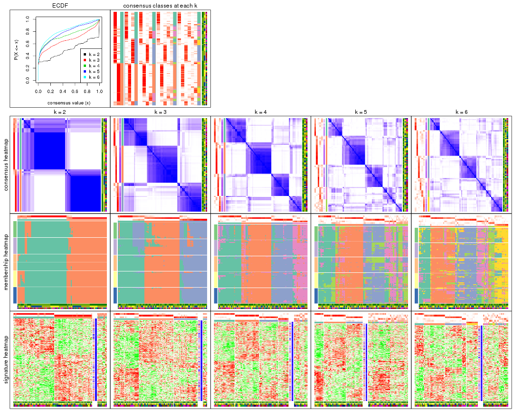

The plots are:

- The first row: a plot of the ECDF (empirical cumulative distribution
  function) curves of the consensus matrix for each `k` and the heatmap of
  predicted classes for each `k`.
- The second row: heatmaps of the consensus matrix for each `k`.
- The third row: heatmaps of the membership matrix for each `k`.
- The fouth row: heatmaps of the signatures for each `k`.

All the plots in panels can be made by individual functions and they are
plotted later in this section.

`select_partition_number()` produces several plots showing different
statistics for choosing "optimized" `k`. There are following statistics:

- ECDF curves of the consensus matrix for each `k`;
- 1-PAC. [The PAC
  score](https://en.wikipedia.org/wiki/Consensus_clustering#Over-interpretation_potential_of_consensus_clustering)
  measures the proportion of the ambiguous subgrouping.
- Mean silhouette score.
- Concordance. The mean probability of fiting the consensus class ids in all
  partitions.
- Area increased. Denote $A_k$ as the area under the ECDF curve for current
  `k`, the area increased is defined as $A_k - A_{k-1}$.
- Rand index. The percent of pairs of samples that are both in a same cluster
  or both are not in a same cluster in the partition of k and k-1.
- Jaccard index. The ratio of pairs of samples are both in a same cluster in
  the partition of k and k-1 and the pairs of samples are both in a same
  cluster in the partition k or k-1.

The detailed explanations of these statistics can be found in [the _cola_
vignette](http://bioconductor.org/packages/devel/bioc/vignettes/cola/inst/doc/cola.html#toc_13).

Generally speaking, lower PAC score, higher mean silhouette score or higher
concordance corresponds to better partition. Rand index and Jaccard index
measure how similar the current partition is compared to partition with `k-1`.
If they are too similar, we won't accept `k` is better than `k-1`.

```r
select_partition_number(res)
```


The numeric values for all these statistics can be obtained by `get_stats()`.

```r
get_stats(res)
```

```
#>   k 1-PAC mean_silhouette concordance area_increased  Rand Jaccard
#> 2 2 0.702           0.835       0.933          0.503 0.499   0.499
#> 3 3 0.640           0.748       0.869          0.324 0.768   0.563
#> 4 4 0.693           0.726       0.860          0.117 0.825   0.541
#> 5 5 0.605           0.472       0.693          0.061 0.847   0.507
#> 6 6 0.653           0.574       0.741          0.041 0.913   0.640
```

`suggest_best_k()` suggests the best $k$ based on these statistics. The rules are as follows:

- All $k$ with Jaccard index larger than 0.95 are removed because increasing
  $k$ does not provide enough extra information. If all $k$ are removed, it is
  marked as no subgroup is detected.
- For all $k$ with 1-PAC score larger than 0.9, the maximal $k$ is taken as
  the best $k$, and other $k$ are marked as optional $k$.
- If it does not fit the second rule. The $k$ with the maximal vote of the
  highest 1-PAC score, highest mean silhouette, and highest concordance is
  taken as the best $k$.

```r
suggest_best_k(res)
```

```
#> [1] 2
```


Following shows the table of the partitions (You need to click the **show/hide
code output** link to see it). The membership matrix (columns with name `p*`)
is inferred by
[`clue::cl_consensus()`](https://www.rdocumentation.org/link/cl_consensus?package=clue)
function with the `SE` method. Basically the value in the membership matrix
represents the probability to belong to a certain group. The finall class
label for an item is determined with the group with highest probability it
belongs to.

In `get_classes()` function, the entropy is calculated from the membership
matrix and the silhouette score is calculated from the consensus matrix.


<script>
$( function() {
	$( '#tabs-SD-NMF-get-classes' ).tabs();
} );
</script>
<div id='tabs-SD-NMF-get-classes'>
<ul>
<li><a href='#tab-SD-NMF-get-classes-1'>k = 2</a></li>
<li><a href='#tab-SD-NMF-get-classes-2'>k = 3</a></li>
<li><a href='#tab-SD-NMF-get-classes-3'>k = 4</a></li>
<li><a href='#tab-SD-NMF-get-classes-4'>k = 5</a></li>
<li><a href='#tab-SD-NMF-get-classes-5'>k = 6</a></li>
</ul>

<div id='tab-SD-NMF-get-classes-1'>
<p><a id='tab-SD-NMF-get-classes-1-a' style='color:#0366d6' href='#'>show/hide code output</a></p>
<pre><code class="r">cbind(get_classes(res, k = 2), get_membership(res, k = 2))
</code></pre>

<pre><code>#&gt;           class entropy silhouette    p1    p2
#&gt; GSM339455     1   0.000     0.8984 1.000 0.000
#&gt; GSM339456     2   0.000     0.9508 0.000 1.000
#&gt; GSM339457     1   0.886     0.5616 0.696 0.304
#&gt; GSM339458     2   0.000     0.9508 0.000 1.000
#&gt; GSM339459     2   0.981     0.2291 0.420 0.580
#&gt; GSM339460     2   0.000     0.9508 0.000 1.000
#&gt; GSM339461     2   0.000     0.9508 0.000 1.000
#&gt; GSM339462     1   0.000     0.8984 1.000 0.000
#&gt; GSM339463     1   0.000     0.8984 1.000 0.000
#&gt; GSM339464     1   0.722     0.7239 0.800 0.200
#&gt; GSM339465     1   0.000     0.8984 1.000 0.000
#&gt; GSM339466     2   0.000     0.9508 0.000 1.000
#&gt; GSM339467     2   0.000     0.9508 0.000 1.000
#&gt; GSM339468     2   0.000     0.9508 0.000 1.000
#&gt; GSM339469     1   0.625     0.7713 0.844 0.156
#&gt; GSM339470     1   0.760     0.6897 0.780 0.220
#&gt; GSM339471     1   0.000     0.8984 1.000 0.000
#&gt; GSM339472     2   0.000     0.9508 0.000 1.000
#&gt; GSM339473     1   0.000     0.8984 1.000 0.000
#&gt; GSM339474     2   0.000     0.9508 0.000 1.000
#&gt; GSM339475     1   0.000     0.8984 1.000 0.000
#&gt; GSM339476     1   0.000     0.8984 1.000 0.000
#&gt; GSM339477     2   0.000     0.9508 0.000 1.000
#&gt; GSM339478     2   0.802     0.6469 0.244 0.756
#&gt; GSM339479     2   0.821     0.6149 0.256 0.744
#&gt; GSM339480     1   0.929     0.4865 0.656 0.344
#&gt; GSM339481     2   0.000     0.9508 0.000 1.000
#&gt; GSM339482     1   0.000     0.8984 1.000 0.000
#&gt; GSM339483     1   0.000     0.8984 1.000 0.000
#&gt; GSM339484     1   0.000     0.8984 1.000 0.000
#&gt; GSM339485     1   0.722     0.7240 0.800 0.200
#&gt; GSM339486     1   0.000     0.8984 1.000 0.000
#&gt; GSM339487     2   0.000     0.9508 0.000 1.000
#&gt; GSM339488     2   0.000     0.9508 0.000 1.000
#&gt; GSM339489     2   0.000     0.9508 0.000 1.000
#&gt; GSM339490     1   0.714     0.7285 0.804 0.196
#&gt; GSM339491     1   0.969     0.3690 0.604 0.396
#&gt; GSM339492     1   0.000     0.8984 1.000 0.000
#&gt; GSM339493     2   0.000     0.9508 0.000 1.000
#&gt; GSM339494     1   0.000     0.8984 1.000 0.000
#&gt; GSM339495     2   0.000     0.9508 0.000 1.000
#&gt; GSM339496     1   0.000     0.8984 1.000 0.000
#&gt; GSM339497     2   0.000     0.9508 0.000 1.000
#&gt; GSM339498     2   0.714     0.7254 0.196 0.804
#&gt; GSM339499     1   0.978     0.3255 0.588 0.412
#&gt; GSM339500     2   0.373     0.8814 0.072 0.928
#&gt; GSM339501     1   0.000     0.8984 1.000 0.000
#&gt; GSM339502     2   0.000     0.9508 0.000 1.000
#&gt; GSM339503     1   0.000     0.8984 1.000 0.000
#&gt; GSM339504     1   0.000     0.8984 1.000 0.000
#&gt; GSM339505     1   0.943     0.4529 0.640 0.360
#&gt; GSM339506     1   0.000     0.8984 1.000 0.000
#&gt; GSM339507     1   0.000     0.8984 1.000 0.000
#&gt; GSM339508     2   0.000     0.9508 0.000 1.000
#&gt; GSM339509     2   0.000     0.9508 0.000 1.000
#&gt; GSM339510     2   0.000     0.9508 0.000 1.000
#&gt; GSM339511     1   0.978     0.3420 0.588 0.412
#&gt; GSM339512     2   0.000     0.9508 0.000 1.000
#&gt; GSM339513     1   0.000     0.8984 1.000 0.000
#&gt; GSM339514     2   0.000     0.9508 0.000 1.000
#&gt; GSM339515     1   0.000     0.8984 1.000 0.000
#&gt; GSM339516     2   0.000     0.9508 0.000 1.000
#&gt; GSM339517     1   0.000     0.8984 1.000 0.000
#&gt; GSM339518     2   0.000     0.9508 0.000 1.000
#&gt; GSM339519     1   0.000     0.8984 1.000 0.000
#&gt; GSM339520     2   0.966     0.3136 0.392 0.608
#&gt; GSM339521     2   0.000     0.9508 0.000 1.000
#&gt; GSM339522     2   0.000     0.9508 0.000 1.000
#&gt; GSM339523     2   0.000     0.9508 0.000 1.000
#&gt; GSM339524     1   0.000     0.8984 1.000 0.000
#&gt; GSM339525     1   0.000     0.8984 1.000 0.000
#&gt; GSM339526     1   0.000     0.8984 1.000 0.000
#&gt; GSM339527     1   0.000     0.8984 1.000 0.000
#&gt; GSM339528     1   0.000     0.8984 1.000 0.000
#&gt; GSM339529     2   0.000     0.9508 0.000 1.000
#&gt; GSM339530     1   0.999     0.0917 0.516 0.484
#&gt; GSM339531     2   0.000     0.9508 0.000 1.000
#&gt; GSM339532     1   0.971     0.3707 0.600 0.400
#&gt; GSM339533     1   0.000     0.8984 1.000 0.000
#&gt; GSM339534     1   0.000     0.8984 1.000 0.000
#&gt; GSM339535     2   0.000     0.9508 0.000 1.000
#&gt; GSM339536     1   0.000     0.8984 1.000 0.000
#&gt; GSM339537     2   0.000     0.9508 0.000 1.000
#&gt; GSM339538     1   0.000     0.8984 1.000 0.000
</code></pre>

<script>
$('#tab-SD-NMF-get-classes-1-a').parent().next().next().hide();
$('#tab-SD-NMF-get-classes-1-a').click(function(){
  $('#tab-SD-NMF-get-classes-1-a').parent().next().next().toggle();
  return(false);
});
</script>
</div>

<div id='tab-SD-NMF-get-classes-2'>
<p><a id='tab-SD-NMF-get-classes-2-a' style='color:#0366d6' href='#'>show/hide code output</a></p>
<pre><code class="r">cbind(get_classes(res, k = 3), get_membership(res, k = 3))
</code></pre>

<pre><code>#&gt;           class entropy silhouette    p1    p2    p3
#&gt; GSM339455     3  0.4002      0.625 0.160 0.000 0.840
#&gt; GSM339456     2  0.4346      0.822 0.184 0.816 0.000
#&gt; GSM339457     3  0.2959      0.774 0.000 0.100 0.900
#&gt; GSM339458     2  0.2229      0.914 0.044 0.944 0.012
#&gt; GSM339459     3  0.6054      0.662 0.180 0.052 0.768
#&gt; GSM339460     2  0.2200      0.914 0.056 0.940 0.004
#&gt; GSM339461     2  0.5058      0.784 0.244 0.756 0.000
#&gt; GSM339462     1  0.1643      0.762 0.956 0.000 0.044
#&gt; GSM339463     3  0.0592      0.801 0.012 0.000 0.988
#&gt; GSM339464     1  0.0424      0.760 0.992 0.008 0.000
#&gt; GSM339465     3  0.0237      0.804 0.004 0.000 0.996
#&gt; GSM339466     2  0.0000      0.920 0.000 1.000 0.000
#&gt; GSM339467     2  0.0424      0.918 0.000 0.992 0.008
#&gt; GSM339468     2  0.5497      0.736 0.292 0.708 0.000
#&gt; GSM339469     1  0.0237      0.762 0.996 0.004 0.000
#&gt; GSM339470     3  0.1529      0.800 0.000 0.040 0.960
#&gt; GSM339471     1  0.6026      0.622 0.624 0.000 0.376
#&gt; GSM339472     2  0.0592      0.920 0.012 0.988 0.000
#&gt; GSM339473     1  0.5760      0.668 0.672 0.000 0.328
#&gt; GSM339474     2  0.2066      0.913 0.060 0.940 0.000
#&gt; GSM339475     3  0.0237      0.805 0.004 0.000 0.996
#&gt; GSM339476     1  0.5560      0.681 0.700 0.000 0.300
#&gt; GSM339477     2  0.5016      0.797 0.240 0.760 0.000
#&gt; GSM339478     3  0.5810      0.524 0.000 0.336 0.664
#&gt; GSM339479     1  0.5956      0.554 0.720 0.264 0.016
#&gt; GSM339480     3  0.5384      0.668 0.188 0.024 0.788
#&gt; GSM339481     2  0.0000      0.920 0.000 1.000 0.000
#&gt; GSM339482     3  0.0592      0.805 0.012 0.000 0.988
#&gt; GSM339483     1  0.0237      0.762 0.996 0.004 0.000
#&gt; GSM339484     3  0.6309     -0.386 0.496 0.000 0.504
#&gt; GSM339485     1  0.0237      0.762 0.996 0.004 0.000
#&gt; GSM339486     3  0.6299     -0.337 0.476 0.000 0.524
#&gt; GSM339487     2  0.0424      0.920 0.008 0.992 0.000
#&gt; GSM339488     2  0.0592      0.917 0.000 0.988 0.012
#&gt; GSM339489     2  0.4063      0.884 0.112 0.868 0.020
#&gt; GSM339490     1  0.0237      0.762 0.996 0.004 0.000
#&gt; GSM339491     3  0.2796      0.779 0.000 0.092 0.908
#&gt; GSM339492     1  0.6180      0.557 0.584 0.000 0.416
#&gt; GSM339493     2  0.0000      0.920 0.000 1.000 0.000
#&gt; GSM339494     1  0.5733      0.669 0.676 0.000 0.324
#&gt; GSM339495     2  0.2356      0.909 0.072 0.928 0.000
#&gt; GSM339496     3  0.0000      0.805 0.000 0.000 1.000
#&gt; GSM339497     2  0.1315      0.920 0.020 0.972 0.008
#&gt; GSM339498     3  0.6537      0.634 0.196 0.064 0.740
#&gt; GSM339499     3  0.3619      0.749 0.000 0.136 0.864
#&gt; GSM339500     2  0.1529      0.901 0.000 0.960 0.040
#&gt; GSM339501     1  0.1163      0.764 0.972 0.000 0.028
#&gt; GSM339502     2  0.0424      0.918 0.000 0.992 0.008
#&gt; GSM339503     3  0.1031      0.802 0.024 0.000 0.976
#&gt; GSM339504     1  0.0424      0.764 0.992 0.000 0.008
#&gt; GSM339505     3  0.1163      0.803 0.000 0.028 0.972
#&gt; GSM339506     1  0.0237      0.763 0.996 0.000 0.004
#&gt; GSM339507     1  0.6280      0.468 0.540 0.000 0.460
#&gt; GSM339508     2  0.1860      0.915 0.052 0.948 0.000
#&gt; GSM339509     2  0.0424      0.918 0.000 0.992 0.008
#&gt; GSM339510     2  0.5968      0.649 0.364 0.636 0.000
#&gt; GSM339511     1  0.0424      0.760 0.992 0.008 0.000
#&gt; GSM339512     2  0.0424      0.918 0.000 0.992 0.008
#&gt; GSM339513     1  0.6192      0.541 0.580 0.000 0.420
#&gt; GSM339514     2  0.0424      0.918 0.000 0.992 0.008
#&gt; GSM339515     1  0.5785      0.664 0.668 0.000 0.332
#&gt; GSM339516     2  0.4399      0.837 0.188 0.812 0.000
#&gt; GSM339517     3  0.0592      0.805 0.012 0.000 0.988
#&gt; GSM339518     2  0.1015      0.920 0.012 0.980 0.008
#&gt; GSM339519     3  0.0592      0.805 0.012 0.000 0.988
#&gt; GSM339520     3  0.5497      0.602 0.000 0.292 0.708
#&gt; GSM339521     2  0.0000      0.920 0.000 1.000 0.000
#&gt; GSM339522     2  0.4178      0.852 0.172 0.828 0.000
#&gt; GSM339523     2  0.0237      0.919 0.000 0.996 0.004
#&gt; GSM339524     3  0.5948      0.165 0.360 0.000 0.640
#&gt; GSM339525     1  0.3619      0.742 0.864 0.000 0.136
#&gt; GSM339526     3  0.0424      0.804 0.008 0.000 0.992
#&gt; GSM339527     1  0.0892      0.764 0.980 0.000 0.020
#&gt; GSM339528     1  0.6062      0.608 0.616 0.000 0.384
#&gt; GSM339529     2  0.2165      0.911 0.064 0.936 0.000
#&gt; GSM339530     3  0.4555      0.695 0.000 0.200 0.800
#&gt; GSM339531     2  0.4887      0.797 0.228 0.772 0.000
#&gt; GSM339532     1  0.0424      0.760 0.992 0.008 0.000
#&gt; GSM339533     3  0.0000      0.805 0.000 0.000 1.000
#&gt; GSM339534     1  0.6154      0.576 0.592 0.000 0.408
#&gt; GSM339535     2  0.0592      0.917 0.000 0.988 0.012
#&gt; GSM339536     1  0.5785      0.664 0.668 0.000 0.332
#&gt; GSM339537     2  0.3879      0.865 0.152 0.848 0.000
#&gt; GSM339538     3  0.0592      0.805 0.012 0.000 0.988
</code></pre>

<script>
$('#tab-SD-NMF-get-classes-2-a').parent().next().next().hide();
$('#tab-SD-NMF-get-classes-2-a').click(function(){
  $('#tab-SD-NMF-get-classes-2-a').parent().next().next().toggle();
  return(false);
});
</script>
</div>

<div id='tab-SD-NMF-get-classes-3'>
<p><a id='tab-SD-NMF-get-classes-3-a' style='color:#0366d6' href='#'>show/hide code output</a></p>
<pre><code class="r">cbind(get_classes(res, k = 4), get_membership(res, k = 4))
</code></pre>

<pre><code>#&gt;           class entropy silhouette    p1    p2    p3    p4
#&gt; GSM339455     3  0.4817    0.30703 0.388 0.000 0.612 0.000
#&gt; GSM339456     2  0.5245    0.46902 0.004 0.660 0.016 0.320
#&gt; GSM339457     3  0.1042    0.86984 0.020 0.008 0.972 0.000
#&gt; GSM339458     2  0.2644    0.82789 0.060 0.908 0.000 0.032
#&gt; GSM339459     3  0.2737    0.83000 0.000 0.008 0.888 0.104
#&gt; GSM339460     2  0.1629    0.85989 0.024 0.952 0.000 0.024
#&gt; GSM339461     2  0.5857   -0.00609 0.004 0.508 0.024 0.464
#&gt; GSM339462     1  0.3024    0.75745 0.852 0.000 0.000 0.148
#&gt; GSM339463     1  0.3271    0.79993 0.856 0.000 0.132 0.012
#&gt; GSM339464     4  0.4164    0.53675 0.264 0.000 0.000 0.736
#&gt; GSM339465     1  0.3508    0.79375 0.848 0.004 0.136 0.012
#&gt; GSM339466     2  0.0895    0.87567 0.004 0.976 0.000 0.020
#&gt; GSM339467     2  0.0000    0.87757 0.000 1.000 0.000 0.000
#&gt; GSM339468     4  0.3366    0.70920 0.004 0.028 0.096 0.872
#&gt; GSM339469     1  0.4164    0.63369 0.736 0.000 0.000 0.264
#&gt; GSM339470     3  0.7092    0.54472 0.216 0.164 0.608 0.012
#&gt; GSM339471     1  0.2654    0.83032 0.888 0.000 0.108 0.004
#&gt; GSM339472     2  0.0336    0.87760 0.000 0.992 0.000 0.008
#&gt; GSM339473     1  0.0927    0.83806 0.976 0.000 0.016 0.008
#&gt; GSM339474     2  0.1022    0.87139 0.000 0.968 0.000 0.032
#&gt; GSM339475     3  0.0657    0.87160 0.012 0.000 0.984 0.004
#&gt; GSM339476     1  0.4907    0.73987 0.764 0.000 0.176 0.060
#&gt; GSM339477     4  0.4843    0.33043 0.000 0.396 0.000 0.604
#&gt; GSM339478     2  0.5653    0.16168 0.016 0.532 0.448 0.004
#&gt; GSM339479     1  0.4375    0.66768 0.788 0.180 0.000 0.032
#&gt; GSM339480     3  0.3074    0.80096 0.000 0.000 0.848 0.152
#&gt; GSM339481     2  0.0188    0.87778 0.000 0.996 0.000 0.004
#&gt; GSM339482     3  0.0817    0.87062 0.000 0.000 0.976 0.024
#&gt; GSM339483     1  0.2149    0.80404 0.912 0.000 0.000 0.088
#&gt; GSM339484     1  0.2730    0.82587 0.896 0.000 0.088 0.016
#&gt; GSM339485     4  0.3024    0.68045 0.148 0.000 0.000 0.852
#&gt; GSM339486     1  0.2473    0.83003 0.908 0.000 0.080 0.012
#&gt; GSM339487     2  0.1716    0.84945 0.000 0.936 0.000 0.064
#&gt; GSM339488     2  0.0188    0.87663 0.000 0.996 0.000 0.004
#&gt; GSM339489     2  0.5472    0.07472 0.000 0.544 0.016 0.440
#&gt; GSM339490     4  0.5000   -0.13517 0.500 0.000 0.000 0.500
#&gt; GSM339491     2  0.6785    0.48361 0.208 0.640 0.140 0.012
#&gt; GSM339492     1  0.3945    0.75281 0.780 0.000 0.216 0.004
#&gt; GSM339493     2  0.0592    0.87627 0.000 0.984 0.000 0.016
#&gt; GSM339494     1  0.1059    0.83719 0.972 0.000 0.016 0.012
#&gt; GSM339495     2  0.3486    0.71152 0.000 0.812 0.000 0.188
#&gt; GSM339496     3  0.0779    0.87114 0.016 0.000 0.980 0.004
#&gt; GSM339497     2  0.1624    0.86930 0.020 0.952 0.000 0.028
#&gt; GSM339498     3  0.4434    0.70419 0.004 0.016 0.772 0.208
#&gt; GSM339499     3  0.1297    0.86824 0.020 0.016 0.964 0.000
#&gt; GSM339500     2  0.3927    0.78346 0.060 0.856 0.072 0.012
#&gt; GSM339501     4  0.2546    0.71520 0.008 0.000 0.092 0.900
#&gt; GSM339502     2  0.0336    0.87510 0.000 0.992 0.000 0.008
#&gt; GSM339503     3  0.2101    0.85851 0.012 0.000 0.928 0.060
#&gt; GSM339504     1  0.4746    0.41594 0.632 0.000 0.000 0.368
#&gt; GSM339505     3  0.2334    0.83685 0.088 0.004 0.908 0.000
#&gt; GSM339506     4  0.2053    0.72275 0.072 0.000 0.004 0.924
#&gt; GSM339507     1  0.2222    0.83414 0.924 0.000 0.060 0.016
#&gt; GSM339508     2  0.0707    0.87568 0.000 0.980 0.000 0.020
#&gt; GSM339509     2  0.0000    0.87757 0.000 1.000 0.000 0.000
#&gt; GSM339510     4  0.2189    0.74275 0.004 0.044 0.020 0.932
#&gt; GSM339511     4  0.3610    0.64012 0.200 0.000 0.000 0.800
#&gt; GSM339512     2  0.0188    0.87725 0.004 0.996 0.000 0.000
#&gt; GSM339513     1  0.2480    0.83553 0.904 0.000 0.088 0.008
#&gt; GSM339514     2  0.0000    0.87757 0.000 1.000 0.000 0.000
#&gt; GSM339515     1  0.1042    0.83850 0.972 0.000 0.020 0.008
#&gt; GSM339516     4  0.4746    0.42901 0.000 0.368 0.000 0.632
#&gt; GSM339517     3  0.1389    0.86548 0.000 0.000 0.952 0.048
#&gt; GSM339518     2  0.0895    0.87602 0.004 0.976 0.000 0.020
#&gt; GSM339519     3  0.1677    0.86662 0.012 0.000 0.948 0.040
#&gt; GSM339520     3  0.1610    0.86316 0.016 0.032 0.952 0.000
#&gt; GSM339521     2  0.0804    0.87755 0.008 0.980 0.000 0.012
#&gt; GSM339522     4  0.5173    0.70472 0.004 0.132 0.096 0.768
#&gt; GSM339523     2  0.0000    0.87757 0.000 1.000 0.000 0.000
#&gt; GSM339524     3  0.2483    0.85958 0.032 0.000 0.916 0.052
#&gt; GSM339525     1  0.2053    0.81582 0.924 0.000 0.004 0.072
#&gt; GSM339526     3  0.0592    0.87143 0.016 0.000 0.984 0.000
#&gt; GSM339527     4  0.1798    0.73029 0.040 0.000 0.016 0.944
#&gt; GSM339528     1  0.2101    0.83548 0.928 0.000 0.060 0.012
#&gt; GSM339529     2  0.0817    0.87460 0.000 0.976 0.000 0.024
#&gt; GSM339530     3  0.3130    0.83205 0.024 0.072 0.892 0.012
#&gt; GSM339531     4  0.4388    0.71523 0.004 0.124 0.056 0.816
#&gt; GSM339532     1  0.4992    0.12116 0.524 0.000 0.000 0.476
#&gt; GSM339533     3  0.5363    0.42311 0.372 0.004 0.612 0.012
#&gt; GSM339534     1  0.3852    0.78483 0.808 0.000 0.180 0.012
#&gt; GSM339535     2  0.0336    0.87760 0.000 0.992 0.000 0.008
#&gt; GSM339536     1  0.1151    0.83902 0.968 0.000 0.024 0.008
#&gt; GSM339537     4  0.4843    0.36468 0.000 0.396 0.000 0.604
#&gt; GSM339538     3  0.1488    0.87027 0.012 0.000 0.956 0.032
</code></pre>

<script>
$('#tab-SD-NMF-get-classes-3-a').parent().next().next().hide();
$('#tab-SD-NMF-get-classes-3-a').click(function(){
  $('#tab-SD-NMF-get-classes-3-a').parent().next().next().toggle();
  return(false);
});
</script>
</div>

<div id='tab-SD-NMF-get-classes-4'>
<p><a id='tab-SD-NMF-get-classes-4-a' style='color:#0366d6' href='#'>show/hide code output</a></p>
<pre><code class="r">cbind(get_classes(res, k = 5), get_membership(res, k = 5))
</code></pre>

<pre><code>#&gt;           class entropy silhouette    p1    p2    p3    p4    p5
#&gt; GSM339455     3  0.7054   -0.01437 0.032 0.000 0.416 0.160 0.392
#&gt; GSM339456     2  0.5571    0.45215 0.000 0.620 0.028 0.044 0.308
#&gt; GSM339457     3  0.3132    0.66208 0.000 0.000 0.820 0.008 0.172
#&gt; GSM339458     5  0.7382    0.08387 0.020 0.156 0.024 0.368 0.432
#&gt; GSM339459     3  0.3387    0.63570 0.004 0.004 0.796 0.000 0.196
#&gt; GSM339460     4  0.6632   -0.12821 0.000 0.228 0.000 0.428 0.344
#&gt; GSM339461     2  0.7431    0.09099 0.000 0.380 0.032 0.272 0.316
#&gt; GSM339462     1  0.5322    0.36731 0.660 0.000 0.000 0.228 0.112
#&gt; GSM339463     5  0.7102   -0.13388 0.328 0.000 0.208 0.024 0.440
#&gt; GSM339464     4  0.3862    0.46478 0.088 0.000 0.000 0.808 0.104
#&gt; GSM339465     1  0.5513    0.29729 0.524 0.000 0.068 0.000 0.408
#&gt; GSM339466     2  0.2447    0.78960 0.000 0.912 0.024 0.032 0.032
#&gt; GSM339467     2  0.0798    0.80514 0.000 0.976 0.000 0.008 0.016
#&gt; GSM339468     5  0.7043    0.02923 0.000 0.032 0.284 0.192 0.492
#&gt; GSM339469     4  0.4789    0.32058 0.392 0.000 0.000 0.584 0.024
#&gt; GSM339470     5  0.8497    0.13023 0.212 0.196 0.276 0.000 0.316
#&gt; GSM339471     1  0.5782    0.51100 0.704 0.000 0.084 0.100 0.112
#&gt; GSM339472     2  0.0000    0.80598 0.000 1.000 0.000 0.000 0.000
#&gt; GSM339473     1  0.0324    0.65504 0.992 0.000 0.004 0.000 0.004
#&gt; GSM339474     2  0.1725    0.79552 0.000 0.936 0.000 0.044 0.020
#&gt; GSM339475     3  0.0324    0.73565 0.004 0.000 0.992 0.000 0.004
#&gt; GSM339476     1  0.6600    0.09362 0.544 0.000 0.100 0.312 0.044
#&gt; GSM339477     2  0.5322    0.58279 0.000 0.660 0.000 0.228 0.112
#&gt; GSM339478     3  0.6296    0.36504 0.000 0.204 0.584 0.012 0.200
#&gt; GSM339479     5  0.7330    0.01015 0.116 0.032 0.024 0.408 0.420
#&gt; GSM339480     3  0.4060    0.58777 0.004 0.004 0.748 0.012 0.232
#&gt; GSM339481     2  0.0000    0.80598 0.000 1.000 0.000 0.000 0.000
#&gt; GSM339482     3  0.1408    0.73328 0.008 0.000 0.948 0.000 0.044
#&gt; GSM339483     1  0.2685    0.59986 0.880 0.000 0.000 0.092 0.028
#&gt; GSM339484     1  0.2519    0.64508 0.884 0.000 0.016 0.000 0.100
#&gt; GSM339485     4  0.4069    0.46519 0.096 0.000 0.000 0.792 0.112
#&gt; GSM339486     1  0.5324    0.33591 0.536 0.000 0.036 0.008 0.420
#&gt; GSM339487     2  0.2012    0.79222 0.000 0.920 0.000 0.060 0.020
#&gt; GSM339488     2  0.0833    0.80507 0.004 0.976 0.000 0.004 0.016
#&gt; GSM339489     2  0.5123    0.50786 0.004 0.600 0.008 0.364 0.024
#&gt; GSM339490     4  0.4505    0.35254 0.384 0.000 0.000 0.604 0.012
#&gt; GSM339491     2  0.6497    0.25571 0.272 0.540 0.012 0.000 0.176
#&gt; GSM339492     3  0.8216   -0.17168 0.332 0.000 0.340 0.140 0.188
#&gt; GSM339493     2  0.0671    0.80409 0.000 0.980 0.000 0.004 0.016
#&gt; GSM339494     1  0.0960    0.65170 0.972 0.000 0.004 0.008 0.016
#&gt; GSM339495     2  0.3151    0.73965 0.000 0.836 0.000 0.144 0.020
#&gt; GSM339496     3  0.0566    0.73590 0.004 0.000 0.984 0.000 0.012
#&gt; GSM339497     5  0.7236    0.10300 0.004 0.308 0.016 0.256 0.416
#&gt; GSM339498     3  0.4735    0.46799 0.000 0.012 0.668 0.020 0.300
#&gt; GSM339499     3  0.3461    0.61080 0.000 0.000 0.772 0.004 0.224
#&gt; GSM339500     5  0.8353    0.22389 0.016 0.108 0.240 0.216 0.420
#&gt; GSM339501     4  0.6008    0.19291 0.012 0.008 0.276 0.612 0.092
#&gt; GSM339502     2  0.0955    0.80240 0.000 0.968 0.000 0.004 0.028
#&gt; GSM339503     3  0.2513    0.70503 0.008 0.000 0.876 0.000 0.116
#&gt; GSM339504     4  0.5811    0.36798 0.340 0.000 0.000 0.552 0.108
#&gt; GSM339505     3  0.3617    0.66715 0.044 0.004 0.824 0.000 0.128
#&gt; GSM339506     5  0.6162   -0.14438 0.044 0.000 0.048 0.392 0.516
#&gt; GSM339507     1  0.2722    0.63192 0.868 0.000 0.008 0.004 0.120
#&gt; GSM339508     2  0.1408    0.80070 0.000 0.948 0.000 0.044 0.008
#&gt; GSM339509     2  0.0898    0.80433 0.000 0.972 0.000 0.008 0.020
#&gt; GSM339510     4  0.5325    0.07417 0.000 0.024 0.016 0.520 0.440
#&gt; GSM339511     4  0.2740    0.47724 0.096 0.000 0.000 0.876 0.028
#&gt; GSM339512     2  0.1124    0.79961 0.004 0.960 0.000 0.000 0.036
#&gt; GSM339513     1  0.2199    0.63437 0.916 0.000 0.060 0.016 0.008
#&gt; GSM339514     2  0.0671    0.80509 0.000 0.980 0.000 0.004 0.016
#&gt; GSM339515     1  0.0451    0.65409 0.988 0.000 0.004 0.000 0.008
#&gt; GSM339516     2  0.5012    0.50091 0.016 0.600 0.000 0.368 0.016
#&gt; GSM339517     3  0.2249    0.71442 0.008 0.000 0.896 0.000 0.096
#&gt; GSM339518     2  0.6795    0.07365 0.000 0.460 0.016 0.172 0.352
#&gt; GSM339519     3  0.1628    0.72694 0.008 0.000 0.936 0.000 0.056
#&gt; GSM339520     3  0.3852    0.64799 0.000 0.028 0.796 0.008 0.168
#&gt; GSM339521     2  0.2597    0.77516 0.004 0.896 0.000 0.040 0.060
#&gt; GSM339522     4  0.4272    0.32737 0.000 0.124 0.020 0.796 0.060
#&gt; GSM339523     2  0.0671    0.80563 0.000 0.980 0.000 0.004 0.016
#&gt; GSM339524     3  0.2473    0.71895 0.032 0.000 0.896 0.000 0.072
#&gt; GSM339525     1  0.4863    0.30636 0.656 0.000 0.000 0.296 0.048
#&gt; GSM339526     3  0.1211    0.73402 0.016 0.000 0.960 0.000 0.024
#&gt; GSM339527     5  0.6513   -0.09733 0.036 0.000 0.092 0.356 0.516
#&gt; GSM339528     1  0.5283    0.36446 0.552 0.000 0.020 0.020 0.408
#&gt; GSM339529     2  0.2358    0.77223 0.000 0.888 0.000 0.104 0.008
#&gt; GSM339530     3  0.4562    0.61193 0.000 0.128 0.760 0.004 0.108
#&gt; GSM339531     5  0.8248    0.03609 0.000 0.244 0.192 0.168 0.396
#&gt; GSM339532     4  0.4434    0.21178 0.460 0.000 0.000 0.536 0.004
#&gt; GSM339533     1  0.6752    0.01618 0.384 0.000 0.352 0.000 0.264
#&gt; GSM339534     5  0.8602    0.00894 0.232 0.000 0.256 0.240 0.272
#&gt; GSM339535     2  0.0290    0.80611 0.000 0.992 0.000 0.000 0.008
#&gt; GSM339536     1  0.0566    0.65456 0.984 0.000 0.004 0.000 0.012
#&gt; GSM339537     2  0.4917    0.43584 0.000 0.556 0.000 0.416 0.028
#&gt; GSM339538     3  0.1764    0.72615 0.008 0.000 0.928 0.000 0.064
</code></pre>

<script>
$('#tab-SD-NMF-get-classes-4-a').parent().next().next().hide();
$('#tab-SD-NMF-get-classes-4-a').click(function(){
  $('#tab-SD-NMF-get-classes-4-a').parent().next().next().toggle();
  return(false);
});
</script>
</div>

<div id='tab-SD-NMF-get-classes-5'>
<p><a id='tab-SD-NMF-get-classes-5-a' style='color:#0366d6' href='#'>show/hide code output</a></p>
<pre><code class="r">cbind(get_classes(res, k = 6), get_membership(res, k = 6))
</code></pre>

<pre><code>#&gt;           class entropy silhouette    p1    p2    p3    p4    p5    p6
#&gt; GSM339455     4  0.6551     0.0421 0.004 0.000 0.336 0.404 0.020 0.236
#&gt; GSM339456     2  0.4394     0.4718 0.000 0.656 0.032 0.008 0.304 0.000
#&gt; GSM339457     3  0.3257     0.7075 0.000 0.000 0.816 0.012 0.020 0.152
#&gt; GSM339458     6  0.2207     0.7018 0.004 0.008 0.000 0.060 0.020 0.908
#&gt; GSM339459     3  0.2257     0.7170 0.000 0.008 0.876 0.000 0.116 0.000
#&gt; GSM339460     6  0.4998     0.5653 0.004 0.048 0.000 0.152 0.080 0.716
#&gt; GSM339461     5  0.5374     0.4128 0.000 0.244 0.016 0.012 0.640 0.088
#&gt; GSM339462     1  0.7143     0.3574 0.472 0.000 0.004 0.212 0.128 0.184
#&gt; GSM339463     6  0.4138     0.6984 0.116 0.000 0.092 0.004 0.012 0.776
#&gt; GSM339464     4  0.4575     0.4170 0.044 0.000 0.000 0.704 0.224 0.028
#&gt; GSM339465     6  0.3865     0.6773 0.216 0.000 0.020 0.000 0.016 0.748
#&gt; GSM339466     2  0.4822     0.6893 0.000 0.752 0.028 0.032 0.116 0.072
#&gt; GSM339467     2  0.2018     0.7275 0.016 0.924 0.000 0.004 0.028 0.028
#&gt; GSM339468     5  0.5588     0.5312 0.000 0.060 0.176 0.100 0.660 0.004
#&gt; GSM339469     4  0.3268     0.5551 0.144 0.000 0.000 0.812 0.000 0.044
#&gt; GSM339470     6  0.6486     0.6456 0.112 0.056 0.128 0.012 0.052 0.640
#&gt; GSM339471     1  0.5950     0.5486 0.632 0.000 0.108 0.168 0.004 0.088
#&gt; GSM339472     2  0.1245     0.7470 0.000 0.952 0.000 0.000 0.032 0.016
#&gt; GSM339473     1  0.0862     0.7727 0.972 0.000 0.008 0.016 0.000 0.004
#&gt; GSM339474     2  0.4070     0.6932 0.000 0.776 0.000 0.020 0.136 0.068
#&gt; GSM339475     3  0.1261     0.7542 0.000 0.000 0.952 0.000 0.024 0.024
#&gt; GSM339476     4  0.4611     0.4617 0.240 0.000 0.020 0.700 0.016 0.024
#&gt; GSM339477     2  0.4912     0.5534 0.000 0.632 0.000 0.028 0.300 0.040
#&gt; GSM339478     3  0.5537     0.6354 0.000 0.064 0.696 0.056 0.036 0.148
#&gt; GSM339479     6  0.2125     0.6974 0.004 0.004 0.000 0.068 0.016 0.908
#&gt; GSM339480     3  0.2673     0.7033 0.000 0.012 0.852 0.000 0.132 0.004
#&gt; GSM339481     2  0.1720     0.7467 0.000 0.928 0.000 0.000 0.040 0.032
#&gt; GSM339482     3  0.2050     0.7544 0.008 0.000 0.920 0.004 0.032 0.036
#&gt; GSM339483     1  0.4979     0.6396 0.712 0.000 0.004 0.168 0.048 0.068
#&gt; GSM339484     1  0.2890     0.7077 0.852 0.000 0.004 0.008 0.016 0.120
#&gt; GSM339485     4  0.4885     0.4381 0.060 0.000 0.000 0.700 0.196 0.044
#&gt; GSM339486     6  0.3510     0.6818 0.212 0.000 0.012 0.004 0.004 0.768
#&gt; GSM339487     2  0.4596     0.6718 0.000 0.736 0.000 0.128 0.112 0.024
#&gt; GSM339488     2  0.2001     0.7279 0.012 0.924 0.004 0.000 0.032 0.028
#&gt; GSM339489     2  0.5801     0.5072 0.000 0.592 0.000 0.120 0.248 0.040
#&gt; GSM339490     4  0.3111     0.5755 0.120 0.000 0.000 0.840 0.020 0.020
#&gt; GSM339491     6  0.6993     0.4529 0.224 0.240 0.004 0.012 0.048 0.472
#&gt; GSM339492     3  0.7303     0.1819 0.160 0.000 0.460 0.220 0.008 0.152
#&gt; GSM339493     2  0.1801     0.7425 0.000 0.924 0.000 0.004 0.056 0.016
#&gt; GSM339494     1  0.0520     0.7692 0.984 0.000 0.008 0.008 0.000 0.000
#&gt; GSM339495     2  0.4492     0.6581 0.000 0.724 0.000 0.020 0.192 0.064
#&gt; GSM339496     3  0.1629     0.7545 0.004 0.000 0.940 0.004 0.028 0.024
#&gt; GSM339497     6  0.4008     0.6483 0.004 0.080 0.004 0.032 0.072 0.808
#&gt; GSM339498     3  0.4366     0.1757 0.000 0.016 0.540 0.000 0.440 0.004
#&gt; GSM339499     3  0.3421     0.6794 0.004 0.000 0.780 0.004 0.012 0.200
#&gt; GSM339500     6  0.2817     0.7126 0.004 0.016 0.060 0.028 0.008 0.884
#&gt; GSM339501     4  0.6824     0.0596 0.000 0.012 0.364 0.388 0.204 0.032
#&gt; GSM339502     2  0.2100     0.7266 0.016 0.916 0.000 0.000 0.032 0.036
#&gt; GSM339503     3  0.2773     0.7006 0.000 0.000 0.828 0.004 0.164 0.004
#&gt; GSM339504     4  0.7281     0.1968 0.224 0.000 0.004 0.448 0.144 0.180
#&gt; GSM339505     3  0.4618     0.4850 0.020 0.000 0.640 0.000 0.028 0.312
#&gt; GSM339506     5  0.4828     0.4558 0.012 0.000 0.052 0.204 0.708 0.024
#&gt; GSM339507     1  0.1956     0.7293 0.908 0.004 0.000 0.000 0.008 0.080
#&gt; GSM339508     2  0.4949     0.5084 0.000 0.656 0.004 0.268 0.048 0.024
#&gt; GSM339509     2  0.1965     0.7290 0.008 0.924 0.000 0.004 0.040 0.024
#&gt; GSM339510     5  0.4781     0.4762 0.000 0.076 0.004 0.116 0.744 0.060
#&gt; GSM339511     4  0.2725     0.5574 0.020 0.000 0.000 0.880 0.040 0.060
#&gt; GSM339512     2  0.1901     0.7246 0.004 0.912 0.000 0.000 0.008 0.076
#&gt; GSM339513     1  0.3086     0.7350 0.852 0.000 0.056 0.080 0.000 0.012
#&gt; GSM339514     2  0.0622     0.7436 0.012 0.980 0.000 0.000 0.000 0.008
#&gt; GSM339515     1  0.1007     0.7730 0.968 0.000 0.008 0.016 0.004 0.004
#&gt; GSM339516     2  0.5506     0.5692 0.004 0.632 0.000 0.132 0.212 0.020
#&gt; GSM339517     3  0.3309     0.6951 0.004 0.000 0.816 0.028 0.148 0.004
#&gt; GSM339518     6  0.4989     0.5375 0.000 0.156 0.000 0.048 0.088 0.708
#&gt; GSM339519     3  0.1477     0.7465 0.004 0.000 0.940 0.008 0.048 0.000
#&gt; GSM339520     3  0.4029     0.6963 0.000 0.024 0.780 0.008 0.032 0.156
#&gt; GSM339521     2  0.5245     0.0345 0.004 0.468 0.000 0.020 0.040 0.468
#&gt; GSM339522     4  0.7665    -0.0872 0.000 0.160 0.032 0.416 0.276 0.116
#&gt; GSM339523     2  0.1485     0.7367 0.004 0.944 0.000 0.000 0.028 0.024
#&gt; GSM339524     3  0.3406     0.7101 0.056 0.000 0.824 0.004 0.112 0.004
#&gt; GSM339525     1  0.6057     0.3367 0.496 0.000 0.000 0.308 0.016 0.180
#&gt; GSM339526     3  0.1863     0.7549 0.004 0.000 0.928 0.004 0.032 0.032
#&gt; GSM339527     5  0.4961     0.4847 0.012 0.000 0.088 0.180 0.704 0.016
#&gt; GSM339528     6  0.3463     0.6561 0.240 0.000 0.004 0.008 0.000 0.748
#&gt; GSM339529     2  0.5260     0.3983 0.000 0.576 0.004 0.348 0.048 0.024
#&gt; GSM339530     3  0.5329     0.6027 0.000 0.156 0.696 0.012 0.048 0.088
#&gt; GSM339531     5  0.6299     0.2944 0.000 0.368 0.136 0.032 0.460 0.004
#&gt; GSM339532     4  0.3702     0.5119 0.208 0.000 0.000 0.760 0.008 0.024
#&gt; GSM339533     6  0.6421     0.4529 0.312 0.004 0.120 0.004 0.048 0.512
#&gt; GSM339534     3  0.7494    -0.0438 0.092 0.000 0.368 0.280 0.012 0.248
#&gt; GSM339535     2  0.0881     0.7472 0.008 0.972 0.000 0.000 0.012 0.008
#&gt; GSM339536     1  0.0912     0.7724 0.972 0.000 0.008 0.012 0.004 0.004
#&gt; GSM339537     2  0.5986     0.5204 0.000 0.592 0.000 0.108 0.232 0.068
#&gt; GSM339538     3  0.2469     0.7377 0.012 0.000 0.896 0.028 0.060 0.004
</code></pre>

<script>
$('#tab-SD-NMF-get-classes-5-a').parent().next().next().hide();
$('#tab-SD-NMF-get-classes-5-a').click(function(){
  $('#tab-SD-NMF-get-classes-5-a').parent().next().next().toggle();
  return(false);
});
</script>
</div>
</div>

Heatmaps for the consensus matrix. It visualizes the probability of two
samples to be in a same group.


<script>
$( function() {
	$( '#tabs-SD-NMF-consensus-heatmap' ).tabs();
} );
</script>
<div id='tabs-SD-NMF-consensus-heatmap'>
<ul>
<li><a href='#tab-SD-NMF-consensus-heatmap-1'>k = 2</a></li>
<li><a href='#tab-SD-NMF-consensus-heatmap-2'>k = 3</a></li>
<li><a href='#tab-SD-NMF-consensus-heatmap-3'>k = 4</a></li>
<li><a href='#tab-SD-NMF-consensus-heatmap-4'>k = 5</a></li>
<li><a href='#tab-SD-NMF-consensus-heatmap-5'>k = 6</a></li>
</ul>
<div id='tab-SD-NMF-consensus-heatmap-1'>
<pre><code class="r">consensus_heatmap(res, k = 2)
</code></pre>

<p></p>

</div>
<div id='tab-SD-NMF-consensus-heatmap-2'>
<pre><code class="r">consensus_heatmap(res, k = 3)
</code></pre>

<p></p>

</div>
<div id='tab-SD-NMF-consensus-heatmap-3'>
<pre><code class="r">consensus_heatmap(res, k = 4)
</code></pre>

<p></p>

</div>
<div id='tab-SD-NMF-consensus-heatmap-4'>
<pre><code class="r">consensus_heatmap(res, k = 5)
</code></pre>

<p></p>

</div>
<div id='tab-SD-NMF-consensus-heatmap-5'>
<pre><code class="r">consensus_heatmap(res, k = 6)
</code></pre>

<p></p>

</div>
</div>

Heatmaps for the membership of samples in all partitions to see how consistent they are:


<script>
$( function() {
	$( '#tabs-SD-NMF-membership-heatmap' ).tabs();
} );
</script>
<div id='tabs-SD-NMF-membership-heatmap'>
<ul>
<li><a href='#tab-SD-NMF-membership-heatmap-1'>k = 2</a></li>
<li><a href='#tab-SD-NMF-membership-heatmap-2'>k = 3</a></li>
<li><a href='#tab-SD-NMF-membership-heatmap-3'>k = 4</a></li>
<li><a href='#tab-SD-NMF-membership-heatmap-4'>k = 5</a></li>
<li><a href='#tab-SD-NMF-membership-heatmap-5'>k = 6</a></li>
</ul>
<div id='tab-SD-NMF-membership-heatmap-1'>
<pre><code class="r">membership_heatmap(res, k = 2)
</code></pre>

<p></p>

</div>
<div id='tab-SD-NMF-membership-heatmap-2'>
<pre><code class="r">membership_heatmap(res, k = 3)
</code></pre>

<p></p>

</div>
<div id='tab-SD-NMF-membership-heatmap-3'>
<pre><code class="r">membership_heatmap(res, k = 4)
</code></pre>

<p></p>

</div>
<div id='tab-SD-NMF-membership-heatmap-4'>
<pre><code class="r">membership_heatmap(res, k = 5)
</code></pre>

<p></p>

</div>
<div id='tab-SD-NMF-membership-heatmap-5'>
<pre><code class="r">membership_heatmap(res, k = 6)
</code></pre>

<p></p>

</div>
</div>

As soon as we have had the classes for columns, we can look for signatures
which are significantly different between classes which can be candidate marks
for certain classes. Following are the heatmaps for signatures.


Signature heatmaps where rows are scaled:


<script>
$( function() {
	$( '#tabs-SD-NMF-get-signatures' ).tabs();
} );
</script>
<div id='tabs-SD-NMF-get-signatures'>
<ul>
<li><a href='#tab-SD-NMF-get-signatures-1'>k = 2</a></li>
<li><a href='#tab-SD-NMF-get-signatures-2'>k = 3</a></li>
<li><a href='#tab-SD-NMF-get-signatures-3'>k = 4</a></li>
<li><a href='#tab-SD-NMF-get-signatures-4'>k = 5</a></li>
<li><a href='#tab-SD-NMF-get-signatures-5'>k = 6</a></li>
</ul>
<div id='tab-SD-NMF-get-signatures-1'>
<pre><code class="r">get_signatures(res, k = 2)
</code></pre>

<p></p>

</div>
<div id='tab-SD-NMF-get-signatures-2'>
<pre><code class="r">get_signatures(res, k = 3)
</code></pre>

<p></p>

</div>
<div id='tab-SD-NMF-get-signatures-3'>
<pre><code class="r">get_signatures(res, k = 4)
</code></pre>

<p></p>

</div>
<div id='tab-SD-NMF-get-signatures-4'>
<pre><code class="r">get_signatures(res, k = 5)
</code></pre>

<p></p>

</div>
<div id='tab-SD-NMF-get-signatures-5'>
<pre><code class="r">get_signatures(res, k = 6)
</code></pre>

<p></p>

</div>
</div>


Signature heatmaps where rows are not scaled:


<script>
$( function() {
	$( '#tabs-SD-NMF-get-signatures-no-scale' ).tabs();
} );
</script>
<div id='tabs-SD-NMF-get-signatures-no-scale'>
<ul>
<li><a href='#tab-SD-NMF-get-signatures-no-scale-1'>k = 2</a></li>
<li><a href='#tab-SD-NMF-get-signatures-no-scale-2'>k = 3</a></li>
<li><a href='#tab-SD-NMF-get-signatures-no-scale-3'>k = 4</a></li>
<li><a href='#tab-SD-NMF-get-signatures-no-scale-4'>k = 5</a></li>
<li><a href='#tab-SD-NMF-get-signatures-no-scale-5'>k = 6</a></li>
</ul>
<div id='tab-SD-NMF-get-signatures-no-scale-1'>
<pre><code class="r">get_signatures(res, k = 2, scale_rows = FALSE)
</code></pre>

<p></p>

</div>
<div id='tab-SD-NMF-get-signatures-no-scale-2'>
<pre><code class="r">get_signatures(res, k = 3, scale_rows = FALSE)
</code></pre>

<p></p>

</div>
<div id='tab-SD-NMF-get-signatures-no-scale-3'>
<pre><code class="r">get_signatures(res, k = 4, scale_rows = FALSE)
</code></pre>

<p></p>

</div>
<div id='tab-SD-NMF-get-signatures-no-scale-4'>
<pre><code class="r">get_signatures(res, k = 5, scale_rows = FALSE)
</code></pre>

<p></p>

</div>
<div id='tab-SD-NMF-get-signatures-no-scale-5'>
<pre><code class="r">get_signatures(res, k = 6, scale_rows = FALSE)
</code></pre>

<p></p>

</div>
</div>


Compare the overlap of signatures from different k:

```r
compare_signatures(res)
```


`get_signature()` returns a data frame invisibly. TO get the list of signatures, the function
call should be assigned to a variable explicitly. In following code, if `plot` argument is set
to `FALSE`, no heatmap is plotted while only the differential analysis is performed.

```r
# code only for demonstration
tb = get_signature(res, k = ..., plot = FALSE)
```

An example of the output of `tb` is:

```
#>   which_row         fdr    mean_1    mean_2 scaled_mean_1 scaled_mean_2 km
#> 1        38 0.042760348  8.373488  9.131774    -0.5533452     0.5164555  1
#> 2        40 0.018707592  7.106213  8.469186    -0.6173731     0.5762149  1
#> 3        55 0.019134737 10.221463 11.207825    -0.6159697     0.5749050  1
#> 4        59 0.006059896  5.921854  7.869574    -0.6899429     0.6439467  1
#> 5        60 0.018055526  8.928898 10.211722    -0.6204761     0.5791110  1
#> 6        98 0.009384629 15.714769 14.887706     0.6635654    -0.6193277  2
...
```

The columns in `tb` are:

1. `which_row`: row indices corresponding to the input matrix.
2. `fdr`: FDR for the differential test. 
3. `mean_x`: The mean value in group x.
4. `scaled_mean_x`: The mean value in group x after rows are scaled.
5. `km`: Row groups if k-means clustering is applied to rows.


UMAP plot which shows how samples are separated.


<script>
$( function() {
	$( '#tabs-SD-NMF-dimension-reduction' ).tabs();
} );
</script>
<div id='tabs-SD-NMF-dimension-reduction'>
<ul>
<li><a href='#tab-SD-NMF-dimension-reduction-1'>k = 2</a></li>
<li><a href='#tab-SD-NMF-dimension-reduction-2'>k = 3</a></li>
<li><a href='#tab-SD-NMF-dimension-reduction-3'>k = 4</a></li>
<li><a href='#tab-SD-NMF-dimension-reduction-4'>k = 5</a></li>
<li><a href='#tab-SD-NMF-dimension-reduction-5'>k = 6</a></li>
</ul>
<div id='tab-SD-NMF-dimension-reduction-1'>
<pre><code class="r">dimension_reduction(res, k = 2, method = &quot;UMAP&quot;)
</code></pre>

<p></p>

</div>
<div id='tab-SD-NMF-dimension-reduction-2'>
<pre><code class="r">dimension_reduction(res, k = 3, method = &quot;UMAP&quot;)
</code></pre>

<p></p>

</div>
<div id='tab-SD-NMF-dimension-reduction-3'>
<pre><code class="r">dimension_reduction(res, k = 4, method = &quot;UMAP&quot;)
</code></pre>

<p></p>

</div>
<div id='tab-SD-NMF-dimension-reduction-4'>
<pre><code class="r">dimension_reduction(res, k = 5, method = &quot;UMAP&quot;)
</code></pre>

<p></p>

</div>
<div id='tab-SD-NMF-dimension-reduction-5'>
<pre><code class="r">dimension_reduction(res, k = 6, method = &quot;UMAP&quot;)
</code></pre>

<p></p>

</div>
</div>


Following heatmap shows how subgroups are split when increasing `k`:

```r
collect_classes(res)
```


Test correlation between subgroups and known annotations. If the known
annotation is numeric, one-way ANOVA test is applied, and if the known
annotation is discrete, chi-squared contingency table test is applied.

```r
test_to_known_factors(res)
```

```
#>         n protocol(p) agent(p) individual(p) k
#> SD:NMF 75       0.919    0.925      4.13e-03 2
#> SD:NMF 80       0.964    0.957      4.46e-05 3
#> SD:NMF 71       0.239    0.723      7.00e-07 4
#> SD:NMF 46       0.585    0.556      5.01e-03 5
#> SD:NMF 61       0.852    0.842      1.06e-04 6
```


If matrix rows can be associated to genes, consider to use `functional_enrichment(res,
...)` to perform function enrichment for the signature genes. See [this vignette](http://bioconductor.org/packages/devel/bioc/vignettes/cola/inst/doc/functional_enrichment.html) for more detailed explanations.


 

---------------------------------------------------


### CV:hclust


The object with results only for a single top-value method and a single partition method 
can be extracted as:

```r
res = res_list["CV", "hclust"]
# you can also extract it by
# res = res_list["CV:hclust"]
```

A summary of `res` and all the functions that can be applied to it:

```r
res
```

```
#> A 'ConsensusPartition' object with k = 2, 3, 4, 5, 6.
#>   On a matrix with 15497 rows and 84 columns.
#>   Top rows (1000, 2000, 3000, 4000, 5000) are extracted by 'CV' method.
#>   Subgroups are detected by 'hclust' method.
#>   Performed in total 1250 partitions by row resampling.
#>   Best k for subgroups seems to be 2.
#> 
#> Following methods can be applied to this 'ConsensusPartition' object:
#>  [1] "cola_report"             "collect_classes"         "collect_plots"          
#>  [4] "collect_stats"           "colnames"                "compare_signatures"     
#>  [7] "consensus_heatmap"       "dimension_reduction"     "functional_enrichment"  
#> [10] "get_anno_col"            "get_anno"                "get_classes"            
#> [13] "get_consensus"           "get_matrix"              "get_membership"         
#> [16] "get_param"               "get_signatures"          "get_stats"              
#> [19] "is_best_k"               "is_stable_k"             "membership_heatmap"     
#> [22] "ncol"                    "nrow"                    "plot_ecdf"              
#> [25] "rownames"                "select_partition_number" "show"                   
#> [28] "suggest_best_k"          "test_to_known_factors"
```

`collect_plots()` function collects all the plots made from `res` for all `k` (number of partitions)
into one single page to provide an easy and fast comparison between different `k`.

```r
collect_plots(res)
```


The plots are:

- The first row: a plot of the ECDF (empirical cumulative distribution
  function) curves of the consensus matrix for each `k` and the heatmap of
  predicted classes for each `k`.
- The second row: heatmaps of the consensus matrix for each `k`.
- The third row: heatmaps of the membership matrix for each `k`.
- The fouth row: heatmaps of the signatures for each `k`.

All the plots in panels can be made by individual functions and they are
plotted later in this section.

`select_partition_number()` produces several plots showing different
statistics for choosing "optimized" `k`. There are following statistics:

- ECDF curves of the consensus matrix for each `k`;
- 1-PAC. [The PAC
  score](https://en.wikipedia.org/wiki/Consensus_clustering#Over-interpretation_potential_of_consensus_clustering)
  measures the proportion of the ambiguous subgrouping.
- Mean silhouette score.
- Concordance. The mean probability of fiting the consensus class ids in all
  partitions.
- Area increased. Denote $A_k$ as the area under the ECDF curve for current
  `k`, the area increased is defined as $A_k - A_{k-1}$.
- Rand index. The percent of pairs of samples that are both in a same cluster
  or both are not in a same cluster in the partition of k and k-1.
- Jaccard index. The ratio of pairs of samples are both in a same cluster in
  the partition of k and k-1 and the pairs of samples are both in a same
  cluster in the partition k or k-1.

The detailed explanations of these statistics can be found in [the _cola_
vignette](http://bioconductor.org/packages/devel/bioc/vignettes/cola/inst/doc/cola.html#toc_13).

Generally speaking, lower PAC score, higher mean silhouette score or higher
concordance corresponds to better partition. Rand index and Jaccard index
measure how similar the current partition is compared to partition with `k-1`.
If they are too similar, we won't accept `k` is better than `k-1`.

```r
select_partition_number(res)
```


The numeric values for all these statistics can be obtained by `get_stats()`.

```r
get_stats(res)
```

```
#>   k 1-PAC mean_silhouette concordance area_increased  Rand Jaccard
#> 2 2 0.378           0.622       0.820         0.4572 0.512   0.512
#> 3 3 0.298           0.500       0.727         0.3698 0.789   0.599
#> 4 4 0.436           0.409       0.631         0.1569 0.888   0.683
#> 5 5 0.556           0.478       0.688         0.0704 0.820   0.439
#> 6 6 0.628           0.465       0.680         0.0504 0.935   0.701
```

`suggest_best_k()` suggests the best $k$ based on these statistics. The rules are as follows:

- All $k$ with Jaccard index larger than 0.95 are removed because increasing
  $k$ does not provide enough extra information. If all $k$ are removed, it is
  marked as no subgroup is detected.
- For all $k$ with 1-PAC score larger than 0.9, the maximal $k$ is taken as
  the best $k$, and other $k$ are marked as optional $k$.
- If it does not fit the second rule. The $k$ with the maximal vote of the
  highest 1-PAC score, highest mean silhouette, and highest concordance is
  taken as the best $k$.

```r
suggest_best_k(res)
```

```
#> [1] 2
```


Following shows the table of the partitions (You need to click the **show/hide
code output** link to see it). The membership matrix (columns with name `p*`)
is inferred by
[`clue::cl_consensus()`](https://www.rdocumentation.org/link/cl_consensus?package=clue)
function with the `SE` method. Basically the value in the membership matrix
represents the probability to belong to a certain group. The finall class
label for an item is determined with the group with highest probability it
belongs to.

In `get_classes()` function, the entropy is calculated from the membership
matrix and the silhouette score is calculated from the consensus matrix.


<script>
$( function() {
	$( '#tabs-CV-hclust-get-classes' ).tabs();
} );
</script>
<div id='tabs-CV-hclust-get-classes'>
<ul>
<li><a href='#tab-CV-hclust-get-classes-1'>k = 2</a></li>
<li><a href='#tab-CV-hclust-get-classes-2'>k = 3</a></li>
<li><a href='#tab-CV-hclust-get-classes-3'>k = 4</a></li>
<li><a href='#tab-CV-hclust-get-classes-4'>k = 5</a></li>
<li><a href='#tab-CV-hclust-get-classes-5'>k = 6</a></li>
</ul>

<div id='tab-CV-hclust-get-classes-1'>
<p><a id='tab-CV-hclust-get-classes-1-a' style='color:#0366d6' href='#'>show/hide code output</a></p>
<pre><code class="r">cbind(get_classes(res, k = 2), get_membership(res, k = 2))
</code></pre>

<pre><code>#&gt;           class entropy silhouette    p1    p2
#&gt; GSM339455     1  0.4431     0.7305 0.908 0.092
#&gt; GSM339456     2  0.9608     0.3272 0.384 0.616
#&gt; GSM339457     1  0.9358     0.4086 0.648 0.352
#&gt; GSM339458     2  0.9286     0.4847 0.344 0.656
#&gt; GSM339459     1  0.9977     0.1698 0.528 0.472
#&gt; GSM339460     2  0.3431     0.7987 0.064 0.936
#&gt; GSM339461     2  0.0672     0.8035 0.008 0.992
#&gt; GSM339462     1  0.1184     0.7624 0.984 0.016
#&gt; GSM339463     1  0.0000     0.7663 1.000 0.000
#&gt; GSM339464     1  0.9170     0.5132 0.668 0.332
#&gt; GSM339465     1  0.0000     0.7663 1.000 0.000
#&gt; GSM339466     2  0.6247     0.7384 0.156 0.844
#&gt; GSM339467     2  0.0376     0.8038 0.004 0.996
#&gt; GSM339468     1  0.9963     0.2165 0.536 0.464
#&gt; GSM339469     1  0.9129     0.5188 0.672 0.328
#&gt; GSM339470     2  0.9087     0.5374 0.324 0.676
#&gt; GSM339471     1  0.0000     0.7663 1.000 0.000
#&gt; GSM339472     2  0.0938     0.8047 0.012 0.988
#&gt; GSM339473     1  0.0000     0.7663 1.000 0.000
#&gt; GSM339474     2  0.0000     0.8008 0.000 1.000
#&gt; GSM339475     1  0.0000     0.7663 1.000 0.000
#&gt; GSM339476     1  0.4431     0.7305 0.908 0.092
#&gt; GSM339477     2  0.0376     0.8029 0.004 0.996
#&gt; GSM339478     1  0.9358     0.4086 0.648 0.352
#&gt; GSM339479     2  0.9286     0.4847 0.344 0.656
#&gt; GSM339480     1  0.9977     0.1698 0.528 0.472
#&gt; GSM339481     2  0.2948     0.8034 0.052 0.948
#&gt; GSM339482     1  0.0000     0.7663 1.000 0.000
#&gt; GSM339483     1  0.1184     0.7624 0.984 0.016
#&gt; GSM339484     1  0.0000     0.7663 1.000 0.000
#&gt; GSM339485     1  0.9170     0.5132 0.668 0.332
#&gt; GSM339486     1  0.0000     0.7663 1.000 0.000
#&gt; GSM339487     2  0.6247     0.7384 0.156 0.844
#&gt; GSM339488     2  0.6247     0.7359 0.156 0.844
#&gt; GSM339489     1  0.9963     0.2165 0.536 0.464
#&gt; GSM339490     1  0.9129     0.5188 0.672 0.328
#&gt; GSM339491     2  0.9087     0.5374 0.324 0.676
#&gt; GSM339492     1  0.0000     0.7663 1.000 0.000
#&gt; GSM339493     2  0.0938     0.8047 0.012 0.988
#&gt; GSM339494     1  0.0000     0.7663 1.000 0.000
#&gt; GSM339495     2  0.0000     0.8008 0.000 1.000
#&gt; GSM339496     1  0.0000     0.7663 1.000 0.000
#&gt; GSM339497     2  0.2778     0.8044 0.048 0.952
#&gt; GSM339498     2  1.0000    -0.1106 0.500 0.500
#&gt; GSM339499     1  0.9358     0.4086 0.648 0.352
#&gt; GSM339500     2  0.9286     0.4847 0.344 0.656
#&gt; GSM339501     1  0.9881     0.2930 0.564 0.436
#&gt; GSM339502     2  0.2948     0.8034 0.052 0.948
#&gt; GSM339503     1  0.0000     0.7663 1.000 0.000
#&gt; GSM339504     1  0.1184     0.7624 0.984 0.016
#&gt; GSM339505     1  0.7674     0.6014 0.776 0.224
#&gt; GSM339506     1  0.9170     0.5132 0.668 0.332
#&gt; GSM339507     1  0.0000     0.7663 1.000 0.000
#&gt; GSM339508     2  0.0672     0.8048 0.008 0.992
#&gt; GSM339509     2  0.0376     0.8038 0.004 0.996
#&gt; GSM339510     1  0.9963     0.2165 0.536 0.464
#&gt; GSM339511     1  0.9129     0.5188 0.672 0.328
#&gt; GSM339512     2  0.9087     0.5374 0.324 0.676
#&gt; GSM339513     1  0.0000     0.7663 1.000 0.000
#&gt; GSM339514     2  0.0938     0.8047 0.012 0.988
#&gt; GSM339515     1  0.0000     0.7663 1.000 0.000
#&gt; GSM339516     2  0.0376     0.8039 0.004 0.996
#&gt; GSM339517     1  0.0000     0.7663 1.000 0.000
#&gt; GSM339518     2  0.2778     0.8044 0.048 0.952
#&gt; GSM339519     1  0.9996     0.1102 0.512 0.488
#&gt; GSM339520     1  0.9358     0.4086 0.648 0.352
#&gt; GSM339521     2  0.9286     0.4847 0.344 0.656
#&gt; GSM339522     1  0.9881     0.2930 0.564 0.436
#&gt; GSM339523     2  0.2948     0.8034 0.052 0.948
#&gt; GSM339524     1  0.0000     0.7663 1.000 0.000
#&gt; GSM339525     1  0.1184     0.7624 0.984 0.016
#&gt; GSM339526     1  0.0000     0.7663 1.000 0.000
#&gt; GSM339527     1  0.9170     0.5132 0.668 0.332
#&gt; GSM339528     1  0.0000     0.7663 1.000 0.000
#&gt; GSM339529     2  0.0672     0.8048 0.008 0.992
#&gt; GSM339530     2  1.0000     0.0386 0.496 0.504
#&gt; GSM339531     1  0.9963     0.2165 0.536 0.464
#&gt; GSM339532     1  0.9129     0.5188 0.672 0.328
#&gt; GSM339533     2  0.9087     0.5374 0.324 0.676
#&gt; GSM339534     1  0.0000     0.7663 1.000 0.000
#&gt; GSM339535     2  0.0938     0.8047 0.012 0.988
#&gt; GSM339536     1  0.0000     0.7663 1.000 0.000
#&gt; GSM339537     2  0.0376     0.8039 0.004 0.996
#&gt; GSM339538     1  0.0000     0.7663 1.000 0.000
</code></pre>

<script>
$('#tab-CV-hclust-get-classes-1-a').parent().next().next().hide();
$('#tab-CV-hclust-get-classes-1-a').click(function(){
  $('#tab-CV-hclust-get-classes-1-a').parent().next().next().toggle();
  return(false);
});
</script>
</div>

<div id='tab-CV-hclust-get-classes-2'>
<p><a id='tab-CV-hclust-get-classes-2-a' style='color:#0366d6' href='#'>show/hide code output</a></p>
<pre><code class="r">cbind(get_classes(res, k = 3), get_membership(res, k = 3))
</code></pre>

<pre><code>#&gt;           class entropy silhouette    p1    p2    p3
#&gt; GSM339455     1  0.8454     0.2625 0.480 0.088 0.432
#&gt; GSM339456     2  0.9342     0.1021 0.168 0.452 0.380
#&gt; GSM339457     3  0.7825     0.4207 0.080 0.300 0.620
#&gt; GSM339458     2  0.8643     0.5291 0.188 0.600 0.212
#&gt; GSM339459     3  0.9457     0.2370 0.236 0.264 0.500
#&gt; GSM339460     2  0.3983     0.7902 0.068 0.884 0.048
#&gt; GSM339461     2  0.4291     0.7072 0.152 0.840 0.008
#&gt; GSM339462     1  0.4605     0.5562 0.796 0.000 0.204
#&gt; GSM339463     3  0.4062     0.4482 0.164 0.000 0.836
#&gt; GSM339464     1  0.5677     0.5078 0.804 0.124 0.072
#&gt; GSM339465     3  0.5621     0.2338 0.308 0.000 0.692
#&gt; GSM339466     2  0.5507     0.7451 0.056 0.808 0.136
#&gt; GSM339467     2  0.0424     0.7900 0.000 0.992 0.008
#&gt; GSM339468     1  0.9866    -0.1481 0.388 0.256 0.356
#&gt; GSM339469     1  0.5307     0.5193 0.820 0.124 0.056
#&gt; GSM339470     2  0.7670     0.5378 0.068 0.620 0.312
#&gt; GSM339471     1  0.5678     0.5104 0.684 0.000 0.316
#&gt; GSM339472     2  0.0983     0.7889 0.004 0.980 0.016
#&gt; GSM339473     1  0.5138     0.5329 0.748 0.000 0.252
#&gt; GSM339474     2  0.0475     0.7871 0.004 0.992 0.004
#&gt; GSM339475     3  0.1529     0.5408 0.040 0.000 0.960
#&gt; GSM339476     1  0.8454     0.2625 0.480 0.088 0.432
#&gt; GSM339477     2  0.4110     0.7076 0.152 0.844 0.004
#&gt; GSM339478     3  0.7825     0.4207 0.080 0.300 0.620
#&gt; GSM339479     2  0.8643     0.5291 0.188 0.600 0.212
#&gt; GSM339480     3  0.9457     0.2370 0.236 0.264 0.500
#&gt; GSM339481     2  0.3692     0.7937 0.056 0.896 0.048
#&gt; GSM339482     3  0.1643     0.5392 0.044 0.000 0.956
#&gt; GSM339483     1  0.4605     0.5562 0.796 0.000 0.204
#&gt; GSM339484     3  0.4062     0.4482 0.164 0.000 0.836
#&gt; GSM339485     1  0.5677     0.5078 0.804 0.124 0.072
#&gt; GSM339486     3  0.5621     0.2338 0.308 0.000 0.692
#&gt; GSM339487     2  0.5507     0.7451 0.056 0.808 0.136
#&gt; GSM339488     2  0.4172     0.7294 0.004 0.840 0.156
#&gt; GSM339489     1  0.9866    -0.1481 0.388 0.256 0.356
#&gt; GSM339490     1  0.5307     0.5193 0.820 0.124 0.056
#&gt; GSM339491     2  0.7670     0.5378 0.068 0.620 0.312
#&gt; GSM339492     1  0.5678     0.5104 0.684 0.000 0.316
#&gt; GSM339493     2  0.0983     0.7889 0.004 0.980 0.016
#&gt; GSM339494     1  0.5138     0.5329 0.748 0.000 0.252
#&gt; GSM339495     2  0.0475     0.7871 0.004 0.992 0.004
#&gt; GSM339496     3  0.1529     0.5408 0.040 0.000 0.960
#&gt; GSM339497     2  0.3155     0.7977 0.044 0.916 0.040
#&gt; GSM339498     3  0.9624     0.1867 0.240 0.292 0.468
#&gt; GSM339499     3  0.7825     0.4207 0.080 0.300 0.620
#&gt; GSM339500     2  0.8643     0.5291 0.188 0.600 0.212
#&gt; GSM339501     3  0.9757     0.1142 0.384 0.228 0.388
#&gt; GSM339502     2  0.3692     0.7937 0.056 0.896 0.048
#&gt; GSM339503     3  0.1643     0.5392 0.044 0.000 0.956
#&gt; GSM339504     1  0.4605     0.5562 0.796 0.000 0.204
#&gt; GSM339505     3  0.7339     0.4782 0.088 0.224 0.688
#&gt; GSM339506     1  0.5677     0.5078 0.804 0.124 0.072
#&gt; GSM339507     3  0.5621     0.2338 0.308 0.000 0.692
#&gt; GSM339508     2  0.3995     0.7738 0.116 0.868 0.016
#&gt; GSM339509     2  0.0424     0.7900 0.000 0.992 0.008
#&gt; GSM339510     1  0.9866    -0.1481 0.388 0.256 0.356
#&gt; GSM339511     1  0.5307     0.5193 0.820 0.124 0.056
#&gt; GSM339512     2  0.7670     0.5378 0.068 0.620 0.312
#&gt; GSM339513     1  0.5678     0.5104 0.684 0.000 0.316
#&gt; GSM339514     2  0.0983     0.7889 0.004 0.980 0.016
#&gt; GSM339515     1  0.5138     0.5329 0.748 0.000 0.252
#&gt; GSM339516     2  0.0661     0.7885 0.008 0.988 0.004
#&gt; GSM339517     3  0.1529     0.5408 0.040 0.000 0.960
#&gt; GSM339518     2  0.3155     0.7977 0.044 0.916 0.040
#&gt; GSM339519     3  0.9569     0.2087 0.240 0.280 0.480
#&gt; GSM339520     3  0.7825     0.4207 0.080 0.300 0.620
#&gt; GSM339521     2  0.8643     0.5291 0.188 0.600 0.212
#&gt; GSM339522     3  0.9757     0.1142 0.384 0.228 0.388
#&gt; GSM339523     2  0.3692     0.7937 0.056 0.896 0.048
#&gt; GSM339524     3  0.1643     0.5392 0.044 0.000 0.956
#&gt; GSM339525     1  0.4605     0.5562 0.796 0.000 0.204
#&gt; GSM339526     3  0.4062     0.4482 0.164 0.000 0.836
#&gt; GSM339527     1  0.5677     0.5078 0.804 0.124 0.072
#&gt; GSM339528     3  0.5621     0.2338 0.308 0.000 0.692
#&gt; GSM339529     2  0.3995     0.7738 0.116 0.868 0.016
#&gt; GSM339530     3  0.8341     0.0342 0.080 0.452 0.468
#&gt; GSM339531     1  0.9866    -0.1481 0.388 0.256 0.356
#&gt; GSM339532     1  0.5307     0.5193 0.820 0.124 0.056
#&gt; GSM339533     2  0.7670     0.5378 0.068 0.620 0.312
#&gt; GSM339534     1  0.5678     0.5104 0.684 0.000 0.316
#&gt; GSM339535     2  0.0983     0.7889 0.004 0.980 0.016
#&gt; GSM339536     1  0.5138     0.5329 0.748 0.000 0.252
#&gt; GSM339537     2  0.0661     0.7885 0.008 0.988 0.004
#&gt; GSM339538     3  0.1529     0.5408 0.040 0.000 0.960
</code></pre>

<script>
$('#tab-CV-hclust-get-classes-2-a').parent().next().next().hide();
$('#tab-CV-hclust-get-classes-2-a').click(function(){
  $('#tab-CV-hclust-get-classes-2-a').parent().next().next().toggle();
  return(false);
});
</script>
</div>

<div id='tab-CV-hclust-get-classes-3'>
<p><a id='tab-CV-hclust-get-classes-3-a' style='color:#0366d6' href='#'>show/hide code output</a></p>
<pre><code class="r">cbind(get_classes(res, k = 4), get_membership(res, k = 4))
</code></pre>

<pre><code>#&gt;           class entropy silhouette    p1    p2    p3    p4
#&gt; GSM339455     4  0.7895    -0.0824 0.232 0.004 0.356 0.408
#&gt; GSM339456     3  0.8517     0.1511 0.032 0.304 0.420 0.244
#&gt; GSM339457     3  0.5972     0.4727 0.112 0.148 0.724 0.016
#&gt; GSM339458     2  0.9209     0.3712 0.080 0.380 0.276 0.264
#&gt; GSM339459     3  0.7990     0.2377 0.060 0.112 0.536 0.292
#&gt; GSM339460     2  0.3945     0.7206 0.008 0.852 0.064 0.076
#&gt; GSM339461     2  0.3831     0.5745 0.000 0.792 0.004 0.204
#&gt; GSM339462     1  0.5590     0.5170 0.524 0.000 0.020 0.456
#&gt; GSM339463     3  0.5558     0.2320 0.364 0.000 0.608 0.028
#&gt; GSM339464     4  0.0336     0.4595 0.000 0.000 0.008 0.992
#&gt; GSM339465     1  0.6607     0.1375 0.476 0.000 0.444 0.080
#&gt; GSM339466     2  0.5885     0.6608 0.028 0.728 0.180 0.064
#&gt; GSM339467     2  0.4469     0.6900 0.112 0.808 0.080 0.000
#&gt; GSM339468     4  0.6634     0.2135 0.020 0.044 0.412 0.524
#&gt; GSM339469     4  0.0895     0.4477 0.020 0.000 0.004 0.976
#&gt; GSM339470     2  0.8546     0.3757 0.112 0.424 0.380 0.084
#&gt; GSM339471     4  0.7732    -0.4130 0.384 0.000 0.228 0.388
#&gt; GSM339472     2  0.0992     0.7112 0.008 0.976 0.012 0.004
#&gt; GSM339473     1  0.5548     0.5780 0.628 0.000 0.032 0.340
#&gt; GSM339474     2  0.0524     0.7095 0.008 0.988 0.000 0.004
#&gt; GSM339475     3  0.5022     0.5024 0.264 0.000 0.708 0.028
#&gt; GSM339476     4  0.7895    -0.0824 0.232 0.004 0.356 0.408
#&gt; GSM339477     2  0.3688     0.5727 0.000 0.792 0.000 0.208
#&gt; GSM339478     3  0.5972     0.4727 0.112 0.148 0.724 0.016
#&gt; GSM339479     2  0.9209     0.3712 0.080 0.380 0.276 0.264
#&gt; GSM339480     3  0.7990     0.2377 0.060 0.112 0.536 0.292
#&gt; GSM339481     2  0.3728     0.7230 0.008 0.864 0.064 0.064
#&gt; GSM339482     3  0.5050     0.4984 0.268 0.000 0.704 0.028
#&gt; GSM339483     1  0.5590     0.5170 0.524 0.000 0.020 0.456
#&gt; GSM339484     3  0.5558     0.2320 0.364 0.000 0.608 0.028
#&gt; GSM339485     4  0.0336     0.4595 0.000 0.000 0.008 0.992
#&gt; GSM339486     1  0.6607     0.1375 0.476 0.000 0.444 0.080
#&gt; GSM339487     2  0.5885     0.6608 0.028 0.728 0.180 0.064
#&gt; GSM339488     2  0.6617     0.5644 0.124 0.628 0.244 0.004
#&gt; GSM339489     4  0.6634     0.2135 0.020 0.044 0.412 0.524
#&gt; GSM339490     4  0.0895     0.4477 0.020 0.000 0.004 0.976
#&gt; GSM339491     2  0.8546     0.3757 0.112 0.424 0.380 0.084
#&gt; GSM339492     4  0.7732    -0.4130 0.384 0.000 0.228 0.388
#&gt; GSM339493     2  0.0992     0.7112 0.008 0.976 0.012 0.004
#&gt; GSM339494     1  0.5548     0.5780 0.628 0.000 0.032 0.340
#&gt; GSM339495     2  0.0524     0.7095 0.008 0.988 0.000 0.004
#&gt; GSM339496     3  0.5022     0.5024 0.264 0.000 0.708 0.028
#&gt; GSM339497     2  0.2830     0.7245 0.000 0.900 0.040 0.060
#&gt; GSM339498     3  0.7955     0.2023 0.040 0.132 0.512 0.316
#&gt; GSM339499     3  0.5972     0.4727 0.112 0.148 0.724 0.016
#&gt; GSM339500     2  0.9209     0.3712 0.080 0.380 0.276 0.264
#&gt; GSM339501     4  0.6205     0.1671 0.020 0.020 0.460 0.500
#&gt; GSM339502     2  0.3728     0.7230 0.008 0.864 0.064 0.064
#&gt; GSM339503     3  0.5050     0.4984 0.268 0.000 0.704 0.028
#&gt; GSM339504     1  0.5590     0.5170 0.524 0.000 0.020 0.456
#&gt; GSM339505     3  0.7117     0.4452 0.236 0.152 0.600 0.012
#&gt; GSM339506     4  0.0336     0.4595 0.000 0.000 0.008 0.992
#&gt; GSM339507     1  0.6607     0.1375 0.476 0.000 0.444 0.080
#&gt; GSM339508     2  0.7646     0.6027 0.104 0.632 0.132 0.132
#&gt; GSM339509     2  0.4469     0.6900 0.112 0.808 0.080 0.000
#&gt; GSM339510     4  0.6634     0.2135 0.020 0.044 0.412 0.524
#&gt; GSM339511     4  0.0895     0.4477 0.020 0.000 0.004 0.976
#&gt; GSM339512     2  0.8546     0.3757 0.112 0.424 0.380 0.084
#&gt; GSM339513     4  0.7732    -0.4130 0.384 0.000 0.228 0.388
#&gt; GSM339514     2  0.0992     0.7112 0.008 0.976 0.012 0.004
#&gt; GSM339515     1  0.5548     0.5780 0.628 0.000 0.032 0.340
#&gt; GSM339516     2  0.1042     0.7145 0.008 0.972 0.000 0.020
#&gt; GSM339517     3  0.5022     0.5024 0.264 0.000 0.708 0.028
#&gt; GSM339518     2  0.2830     0.7245 0.000 0.900 0.040 0.060
#&gt; GSM339519     3  0.7833     0.2043 0.040 0.120 0.524 0.316
#&gt; GSM339520     3  0.5972     0.4727 0.112 0.148 0.724 0.016
#&gt; GSM339521     2  0.9209     0.3712 0.080 0.380 0.276 0.264
#&gt; GSM339522     4  0.6205     0.1671 0.020 0.020 0.460 0.500
#&gt; GSM339523     2  0.3728     0.7230 0.008 0.864 0.064 0.064
#&gt; GSM339524     3  0.5050     0.4984 0.268 0.000 0.704 0.028
#&gt; GSM339525     1  0.5590     0.5170 0.524 0.000 0.020 0.456
#&gt; GSM339526     3  0.5558     0.2320 0.364 0.000 0.608 0.028
#&gt; GSM339527     4  0.0336     0.4595 0.000 0.000 0.008 0.992
#&gt; GSM339528     1  0.6607     0.1375 0.476 0.000 0.444 0.080
#&gt; GSM339529     2  0.7646     0.6027 0.104 0.632 0.132 0.132
#&gt; GSM339530     3  0.7406     0.2579 0.184 0.220 0.580 0.016
#&gt; GSM339531     4  0.6634     0.2135 0.020 0.044 0.412 0.524
#&gt; GSM339532     4  0.0895     0.4477 0.020 0.000 0.004 0.976
#&gt; GSM339533     2  0.8546     0.3757 0.112 0.424 0.380 0.084
#&gt; GSM339534     4  0.7732    -0.4130 0.384 0.000 0.228 0.388
#&gt; GSM339535     2  0.0992     0.7112 0.008 0.976 0.012 0.004
#&gt; GSM339536     1  0.5548     0.5780 0.628 0.000 0.032 0.340
#&gt; GSM339537     2  0.1042     0.7145 0.008 0.972 0.000 0.020
#&gt; GSM339538     3  0.5022     0.5024 0.264 0.000 0.708 0.028
</code></pre>

<script>
$('#tab-CV-hclust-get-classes-3-a').parent().next().next().hide();
$('#tab-CV-hclust-get-classes-3-a').click(function(){
  $('#tab-CV-hclust-get-classes-3-a').parent().next().next().toggle();
  return(false);
});
</script>
</div>

<div id='tab-CV-hclust-get-classes-4'>
<p><a id='tab-CV-hclust-get-classes-4-a' style='color:#0366d6' href='#'>show/hide code output</a></p>
<pre><code class="r">cbind(get_classes(res, k = 5), get_membership(res, k = 5))
</code></pre>

<pre><code>#&gt;           class entropy silhouette    p1    p2    p3    p4    p5
#&gt; GSM339455     1  0.8460    0.23713 0.328 0.000 0.220 0.272 0.180
#&gt; GSM339456     5  0.8381    0.12737 0.000 0.196 0.280 0.176 0.348
#&gt; GSM339457     5  0.4088    0.18032 0.000 0.000 0.368 0.000 0.632
#&gt; GSM339458     5  0.6665    0.32602 0.000 0.312 0.000 0.252 0.436
#&gt; GSM339459     3  0.6738   -0.11331 0.000 0.008 0.440 0.192 0.360
#&gt; GSM339460     2  0.3375    0.73353 0.000 0.840 0.000 0.056 0.104
#&gt; GSM339461     2  0.4210    0.57979 0.000 0.788 0.008 0.140 0.064
#&gt; GSM339462     1  0.2329    0.73642 0.876 0.000 0.000 0.124 0.000
#&gt; GSM339463     3  0.5983    0.54138 0.140 0.000 0.652 0.028 0.180
#&gt; GSM339464     4  0.1788    0.60693 0.056 0.000 0.008 0.932 0.004
#&gt; GSM339465     3  0.6901    0.36391 0.300 0.000 0.500 0.028 0.172
#&gt; GSM339466     2  0.5196    0.24306 0.000 0.576 0.004 0.040 0.380
#&gt; GSM339467     2  0.4768    0.26842 0.000 0.592 0.000 0.024 0.384
#&gt; GSM339468     4  0.7235    0.34931 0.000 0.036 0.216 0.464 0.284
#&gt; GSM339469     4  0.3946    0.54130 0.080 0.000 0.000 0.800 0.120
#&gt; GSM339470     5  0.5807    0.46798 0.004 0.236 0.060 0.040 0.660
#&gt; GSM339471     1  0.6201    0.63074 0.648 0.000 0.196 0.072 0.084
#&gt; GSM339472     2  0.0451    0.78403 0.000 0.988 0.008 0.000 0.004
#&gt; GSM339473     1  0.0451    0.72439 0.988 0.000 0.008 0.000 0.004
#&gt; GSM339474     2  0.0000    0.78178 0.000 1.000 0.000 0.000 0.000
#&gt; GSM339475     3  0.1121    0.62890 0.044 0.000 0.956 0.000 0.000
#&gt; GSM339476     1  0.8460    0.23713 0.328 0.000 0.220 0.272 0.180
#&gt; GSM339477     2  0.4082    0.58081 0.000 0.796 0.008 0.140 0.056
#&gt; GSM339478     5  0.4088    0.18032 0.000 0.000 0.368 0.000 0.632
#&gt; GSM339479     5  0.6665    0.32602 0.000 0.312 0.000 0.252 0.436
#&gt; GSM339480     3  0.6738   -0.11331 0.000 0.008 0.440 0.192 0.360
#&gt; GSM339481     2  0.3164    0.74318 0.000 0.852 0.000 0.044 0.104
#&gt; GSM339482     3  0.1197    0.63006 0.048 0.000 0.952 0.000 0.000
#&gt; GSM339483     1  0.2329    0.73642 0.876 0.000 0.000 0.124 0.000
#&gt; GSM339484     3  0.5983    0.54138 0.140 0.000 0.652 0.028 0.180
#&gt; GSM339485     4  0.1788    0.60693 0.056 0.000 0.008 0.932 0.004
#&gt; GSM339486     3  0.6901    0.36391 0.300 0.000 0.500 0.028 0.172
#&gt; GSM339487     2  0.5196    0.24306 0.000 0.576 0.004 0.040 0.380
#&gt; GSM339488     5  0.4973    0.20446 0.000 0.408 0.004 0.024 0.564
#&gt; GSM339489     4  0.7235    0.34931 0.000 0.036 0.216 0.464 0.284
#&gt; GSM339490     4  0.3946    0.54130 0.080 0.000 0.000 0.800 0.120
#&gt; GSM339491     5  0.5807    0.46798 0.004 0.236 0.060 0.040 0.660
#&gt; GSM339492     1  0.6201    0.63074 0.648 0.000 0.196 0.072 0.084
#&gt; GSM339493     2  0.0451    0.78403 0.000 0.988 0.008 0.000 0.004
#&gt; GSM339494     1  0.0451    0.72439 0.988 0.000 0.008 0.000 0.004
#&gt; GSM339495     2  0.0000    0.78178 0.000 1.000 0.000 0.000 0.000
#&gt; GSM339496     3  0.1121    0.62890 0.044 0.000 0.956 0.000 0.000
#&gt; GSM339497     2  0.2813    0.75820 0.000 0.876 0.000 0.040 0.084
#&gt; GSM339498     5  0.7202    0.00402 0.000 0.024 0.356 0.224 0.396
#&gt; GSM339499     5  0.4088    0.18032 0.000 0.000 0.368 0.000 0.632
#&gt; GSM339500     5  0.6665    0.32602 0.000 0.312 0.000 0.252 0.436
#&gt; GSM339501     4  0.7013    0.32599 0.000 0.012 0.268 0.428 0.292
#&gt; GSM339502     2  0.3164    0.74318 0.000 0.852 0.000 0.044 0.104
#&gt; GSM339503     3  0.1197    0.63006 0.048 0.000 0.952 0.000 0.000
#&gt; GSM339504     1  0.2329    0.73642 0.876 0.000 0.000 0.124 0.000
#&gt; GSM339505     3  0.5897    0.15583 0.048 0.012 0.472 0.008 0.460
#&gt; GSM339506     4  0.1788    0.60693 0.056 0.000 0.008 0.932 0.004
#&gt; GSM339507     3  0.6901    0.36391 0.300 0.000 0.500 0.028 0.172
#&gt; GSM339508     5  0.5190   -0.09104 0.008 0.424 0.000 0.028 0.540
#&gt; GSM339509     2  0.4768    0.26842 0.000 0.592 0.000 0.024 0.384
#&gt; GSM339510     4  0.7235    0.34931 0.000 0.036 0.216 0.464 0.284
#&gt; GSM339511     4  0.3946    0.54130 0.080 0.000 0.000 0.800 0.120
#&gt; GSM339512     5  0.5807    0.46798 0.004 0.236 0.060 0.040 0.660
#&gt; GSM339513     1  0.6201    0.63074 0.648 0.000 0.196 0.072 0.084
#&gt; GSM339514     2  0.0451    0.78403 0.000 0.988 0.008 0.000 0.004
#&gt; GSM339515     1  0.0451    0.72439 0.988 0.000 0.008 0.000 0.004
#&gt; GSM339516     2  0.0693    0.78394 0.000 0.980 0.000 0.012 0.008
#&gt; GSM339517     3  0.1121    0.62890 0.044 0.000 0.956 0.000 0.000
#&gt; GSM339518     2  0.2813    0.75820 0.000 0.876 0.000 0.040 0.084
#&gt; GSM339519     5  0.6969    0.00495 0.000 0.012 0.356 0.224 0.408
#&gt; GSM339520     5  0.4088    0.18032 0.000 0.000 0.368 0.000 0.632
#&gt; GSM339521     5  0.6665    0.32602 0.000 0.312 0.000 0.252 0.436
#&gt; GSM339522     4  0.7013    0.32599 0.000 0.012 0.268 0.428 0.292
#&gt; GSM339523     2  0.3164    0.74318 0.000 0.852 0.000 0.044 0.104
#&gt; GSM339524     3  0.1197    0.63006 0.048 0.000 0.952 0.000 0.000
#&gt; GSM339525     1  0.2329    0.73642 0.876 0.000 0.000 0.124 0.000
#&gt; GSM339526     3  0.5983    0.54138 0.140 0.000 0.652 0.028 0.180
#&gt; GSM339527     4  0.1788    0.60693 0.056 0.000 0.008 0.932 0.004
#&gt; GSM339528     3  0.6901    0.36391 0.300 0.000 0.500 0.028 0.172
#&gt; GSM339529     5  0.5190   -0.09104 0.008 0.424 0.000 0.028 0.540
#&gt; GSM339530     5  0.4058    0.29792 0.000 0.000 0.236 0.024 0.740
#&gt; GSM339531     4  0.7235    0.34931 0.000 0.036 0.216 0.464 0.284
#&gt; GSM339532     4  0.3946    0.54130 0.080 0.000 0.000 0.800 0.120
#&gt; GSM339533     5  0.5807    0.46798 0.004 0.236 0.060 0.040 0.660
#&gt; GSM339534     1  0.6201    0.63074 0.648 0.000 0.196 0.072 0.084
#&gt; GSM339535     2  0.0451    0.78403 0.000 0.988 0.008 0.000 0.004
#&gt; GSM339536     1  0.0451    0.72439 0.988 0.000 0.008 0.000 0.004
#&gt; GSM339537     2  0.0693    0.78394 0.000 0.980 0.000 0.012 0.008
#&gt; GSM339538     3  0.1121    0.62890 0.044 0.000 0.956 0.000 0.000
</code></pre>

<script>
$('#tab-CV-hclust-get-classes-4-a').parent().next().next().hide();
$('#tab-CV-hclust-get-classes-4-a').click(function(){
  $('#tab-CV-hclust-get-classes-4-a').parent().next().next().toggle();
  return(false);
});
</script>
</div>

<div id='tab-CV-hclust-get-classes-5'>
<p><a id='tab-CV-hclust-get-classes-5-a' style='color:#0366d6' href='#'>show/hide code output</a></p>
<pre><code class="r">cbind(get_classes(res, k = 6), get_membership(res, k = 6))
</code></pre>

<pre><code>#&gt;           class entropy silhouette    p1    p2    p3    p4    p5    p6
#&gt; GSM339455     5  0.7254    -0.0792 0.312 0.000 0.080 0.080 0.464 0.064
#&gt; GSM339456     6  0.7669    -0.1358 0.000 0.188 0.184 0.004 0.300 0.324
#&gt; GSM339457     6  0.5774     0.3075 0.004 0.000 0.216 0.000 0.248 0.532
#&gt; GSM339458     6  0.6048     0.3023 0.000 0.236 0.000 0.020 0.212 0.532
#&gt; GSM339459     5  0.6086     0.2078 0.000 0.000 0.328 0.000 0.388 0.284
#&gt; GSM339460     2  0.3507     0.6819 0.000 0.764 0.000 0.012 0.008 0.216
#&gt; GSM339461     2  0.3858     0.5689 0.000 0.780 0.000 0.004 0.084 0.132
#&gt; GSM339462     1  0.2261     0.7767 0.884 0.000 0.000 0.104 0.004 0.008
#&gt; GSM339463     3  0.5394     0.3955 0.036 0.000 0.508 0.000 0.412 0.044
#&gt; GSM339464     4  0.4697     0.7586 0.004 0.000 0.000 0.688 0.200 0.108
#&gt; GSM339465     5  0.6458    -0.2557 0.176 0.000 0.364 0.000 0.424 0.036
#&gt; GSM339466     2  0.4399     0.2210 0.000 0.516 0.000 0.000 0.024 0.460
#&gt; GSM339467     2  0.4150     0.2854 0.000 0.592 0.000 0.000 0.016 0.392
#&gt; GSM339468     5  0.6613     0.3569 0.004 0.024 0.112 0.044 0.536 0.280
#&gt; GSM339469     4  0.0547     0.7856 0.020 0.000 0.000 0.980 0.000 0.000
#&gt; GSM339470     6  0.4034     0.4363 0.000 0.160 0.036 0.000 0.032 0.772
#&gt; GSM339471     1  0.5696     0.6577 0.640 0.000 0.064 0.072 0.216 0.008
#&gt; GSM339472     2  0.0458     0.7572 0.000 0.984 0.000 0.000 0.000 0.016
#&gt; GSM339473     1  0.1643     0.7653 0.924 0.000 0.008 0.000 0.068 0.000
#&gt; GSM339474     2  0.0000     0.7540 0.000 1.000 0.000 0.000 0.000 0.000
#&gt; GSM339475     3  0.0146     0.7708 0.004 0.000 0.996 0.000 0.000 0.000
#&gt; GSM339476     5  0.7254    -0.0792 0.312 0.000 0.080 0.080 0.464 0.064
#&gt; GSM339477     2  0.3777     0.5700 0.000 0.788 0.000 0.004 0.084 0.124
#&gt; GSM339478     6  0.5774     0.3075 0.004 0.000 0.216 0.000 0.248 0.532
#&gt; GSM339479     6  0.6048     0.3023 0.000 0.236 0.000 0.020 0.212 0.532
#&gt; GSM339480     5  0.6086     0.2078 0.000 0.000 0.328 0.000 0.388 0.284
#&gt; GSM339481     2  0.3161     0.6881 0.000 0.776 0.000 0.000 0.008 0.216
#&gt; GSM339482     3  0.0291     0.7711 0.004 0.000 0.992 0.000 0.004 0.000
#&gt; GSM339483     1  0.2261     0.7767 0.884 0.000 0.000 0.104 0.004 0.008
#&gt; GSM339484     3  0.5394     0.3955 0.036 0.000 0.508 0.000 0.412 0.044
#&gt; GSM339485     4  0.4697     0.7586 0.004 0.000 0.000 0.688 0.200 0.108
#&gt; GSM339486     5  0.6458    -0.2557 0.176 0.000 0.364 0.000 0.424 0.036
#&gt; GSM339487     2  0.4399     0.2210 0.000 0.516 0.000 0.000 0.024 0.460
#&gt; GSM339488     6  0.4261     0.1232 0.000 0.408 0.000 0.000 0.020 0.572
#&gt; GSM339489     5  0.6613     0.3569 0.004 0.024 0.112 0.044 0.536 0.280
#&gt; GSM339490     4  0.0547     0.7856 0.020 0.000 0.000 0.980 0.000 0.000
#&gt; GSM339491     6  0.4034     0.4363 0.000 0.160 0.036 0.000 0.032 0.772
#&gt; GSM339492     1  0.5696     0.6577 0.640 0.000 0.064 0.072 0.216 0.008
#&gt; GSM339493     2  0.0458     0.7572 0.000 0.984 0.000 0.000 0.000 0.016
#&gt; GSM339494     1  0.1643     0.7653 0.924 0.000 0.008 0.000 0.068 0.000
#&gt; GSM339495     2  0.0000     0.7540 0.000 1.000 0.000 0.000 0.000 0.000
#&gt; GSM339496     3  0.0146     0.7708 0.004 0.000 0.996 0.000 0.000 0.000
#&gt; GSM339497     2  0.2912     0.7113 0.000 0.816 0.000 0.000 0.012 0.172
#&gt; GSM339498     6  0.6439    -0.2357 0.004 0.012 0.244 0.000 0.348 0.392
#&gt; GSM339499     6  0.5774     0.3075 0.004 0.000 0.216 0.000 0.248 0.532
#&gt; GSM339500     6  0.6048     0.3023 0.000 0.236 0.000 0.020 0.212 0.532
#&gt; GSM339501     5  0.6079     0.3538 0.000 0.004 0.160 0.044 0.588 0.204
#&gt; GSM339502     2  0.3161     0.6881 0.000 0.776 0.000 0.000 0.008 0.216
#&gt; GSM339503     3  0.0291     0.7711 0.004 0.000 0.992 0.000 0.004 0.000
#&gt; GSM339504     1  0.2261     0.7767 0.884 0.000 0.000 0.104 0.004 0.008
#&gt; GSM339505     6  0.6362    -0.0571 0.004 0.004 0.324 0.000 0.308 0.360
#&gt; GSM339506     4  0.4697     0.7586 0.004 0.000 0.000 0.688 0.200 0.108
#&gt; GSM339507     5  0.6458    -0.2557 0.176 0.000 0.364 0.000 0.424 0.036
#&gt; GSM339508     6  0.5919    -0.1278 0.000 0.424 0.000 0.132 0.016 0.428
#&gt; GSM339509     2  0.4150     0.2854 0.000 0.592 0.000 0.000 0.016 0.392
#&gt; GSM339510     5  0.6613     0.3569 0.004 0.024 0.112 0.044 0.536 0.280
#&gt; GSM339511     4  0.0547     0.7856 0.020 0.000 0.000 0.980 0.000 0.000
#&gt; GSM339512     6  0.4034     0.4363 0.000 0.160 0.036 0.000 0.032 0.772
#&gt; GSM339513     1  0.5696     0.6577 0.640 0.000 0.064 0.072 0.216 0.008
#&gt; GSM339514     2  0.0458     0.7572 0.000 0.984 0.000 0.000 0.000 0.016
#&gt; GSM339515     1  0.1643     0.7653 0.924 0.000 0.008 0.000 0.068 0.000
#&gt; GSM339516     2  0.0622     0.7557 0.000 0.980 0.000 0.000 0.008 0.012
#&gt; GSM339517     3  0.0146     0.7708 0.004 0.000 0.996 0.000 0.000 0.000
#&gt; GSM339518     2  0.2912     0.7113 0.000 0.816 0.000 0.000 0.012 0.172
#&gt; GSM339519     6  0.6146    -0.2385 0.004 0.000 0.244 0.000 0.360 0.392
#&gt; GSM339520     6  0.5774     0.3075 0.004 0.000 0.216 0.000 0.248 0.532
#&gt; GSM339521     6  0.6048     0.3023 0.000 0.236 0.000 0.020 0.212 0.532
#&gt; GSM339522     5  0.6079     0.3538 0.000 0.004 0.160 0.044 0.588 0.204
#&gt; GSM339523     2  0.3161     0.6881 0.000 0.776 0.000 0.000 0.008 0.216
#&gt; GSM339524     3  0.0291     0.7711 0.004 0.000 0.992 0.000 0.004 0.000
#&gt; GSM339525     1  0.2261     0.7767 0.884 0.000 0.000 0.104 0.004 0.008
#&gt; GSM339526     3  0.5394     0.3955 0.036 0.000 0.508 0.000 0.412 0.044
#&gt; GSM339527     4  0.4697     0.7586 0.004 0.000 0.000 0.688 0.200 0.108
#&gt; GSM339528     5  0.6458    -0.2557 0.176 0.000 0.364 0.000 0.424 0.036
#&gt; GSM339529     6  0.5919    -0.1278 0.000 0.424 0.000 0.132 0.016 0.428
#&gt; GSM339530     6  0.4707     0.3628 0.004 0.000 0.092 0.000 0.228 0.676
#&gt; GSM339531     5  0.6613     0.3569 0.004 0.024 0.112 0.044 0.536 0.280
#&gt; GSM339532     4  0.0547     0.7856 0.020 0.000 0.000 0.980 0.000 0.000
#&gt; GSM339533     6  0.4034     0.4363 0.000 0.160 0.036 0.000 0.032 0.772
#&gt; GSM339534     1  0.5696     0.6577 0.640 0.000 0.064 0.072 0.216 0.008
#&gt; GSM339535     2  0.0458     0.7572 0.000 0.984 0.000 0.000 0.000 0.016
#&gt; GSM339536     1  0.1643     0.7653 0.924 0.000 0.008 0.000 0.068 0.000
#&gt; GSM339537     2  0.0622     0.7557 0.000 0.980 0.000 0.000 0.008 0.012
#&gt; GSM339538     3  0.0146     0.7708 0.004 0.000 0.996 0.000 0.000 0.000
</code></pre>

<script>
$('#tab-CV-hclust-get-classes-5-a').parent().next().next().hide();
$('#tab-CV-hclust-get-classes-5-a').click(function(){
  $('#tab-CV-hclust-get-classes-5-a').parent().next().next().toggle();
  return(false);
});
</script>
</div>
</div>

Heatmaps for the consensus matrix. It visualizes the probability of two
samples to be in a same group.


<script>
$( function() {
	$( '#tabs-CV-hclust-consensus-heatmap' ).tabs();
} );
</script>
<div id='tabs-CV-hclust-consensus-heatmap'>
<ul>
<li><a href='#tab-CV-hclust-consensus-heatmap-1'>k = 2</a></li>
<li><a href='#tab-CV-hclust-consensus-heatmap-2'>k = 3</a></li>
<li><a href='#tab-CV-hclust-consensus-heatmap-3'>k = 4</a></li>
<li><a href='#tab-CV-hclust-consensus-heatmap-4'>k = 5</a></li>
<li><a href='#tab-CV-hclust-consensus-heatmap-5'>k = 6</a></li>
</ul>
<div id='tab-CV-hclust-consensus-heatmap-1'>
<pre><code class="r">consensus_heatmap(res, k = 2)
</code></pre>

<p></p>

</div>
<div id='tab-CV-hclust-consensus-heatmap-2'>
<pre><code class="r">consensus_heatmap(res, k = 3)
</code></pre>

<p></p>

</div>
<div id='tab-CV-hclust-consensus-heatmap-3'>
<pre><code class="r">consensus_heatmap(res, k = 4)
</code></pre>

<p></p>

</div>
<div id='tab-CV-hclust-consensus-heatmap-4'>
<pre><code class="r">consensus_heatmap(res, k = 5)
</code></pre>

<p></p>

</div>
<div id='tab-CV-hclust-consensus-heatmap-5'>
<pre><code class="r">consensus_heatmap(res, k = 6)
</code></pre>

<p></p>

</div>
</div>

Heatmaps for the membership of samples in all partitions to see how consistent they are:


<script>
$( function() {
	$( '#tabs-CV-hclust-membership-heatmap' ).tabs();
} );
</script>
<div id='tabs-CV-hclust-membership-heatmap'>
<ul>
<li><a href='#tab-CV-hclust-membership-heatmap-1'>k = 2</a></li>
<li><a href='#tab-CV-hclust-membership-heatmap-2'>k = 3</a></li>
<li><a href='#tab-CV-hclust-membership-heatmap-3'>k = 4</a></li>
<li><a href='#tab-CV-hclust-membership-heatmap-4'>k = 5</a></li>
<li><a href='#tab-CV-hclust-membership-heatmap-5'>k = 6</a></li>
</ul>
<div id='tab-CV-hclust-membership-heatmap-1'>
<pre><code class="r">membership_heatmap(res, k = 2)
</code></pre>

<p></p>

</div>
<div id='tab-CV-hclust-membership-heatmap-2'>
<pre><code class="r">membership_heatmap(res, k = 3)
</code></pre>

<p></p>

</div>
<div id='tab-CV-hclust-membership-heatmap-3'>
<pre><code class="r">membership_heatmap(res, k = 4)
</code></pre>

<p></p>

</div>
<div id='tab-CV-hclust-membership-heatmap-4'>
<pre><code class="r">membership_heatmap(res, k = 5)
</code></pre>

<p></p>

</div>
<div id='tab-CV-hclust-membership-heatmap-5'>
<pre><code class="r">membership_heatmap(res, k = 6)
</code></pre>

<p></p>

</div>
</div>

As soon as we have had the classes for columns, we can look for signatures
which are significantly different between classes which can be candidate marks
for certain classes. Following are the heatmaps for signatures.


Signature heatmaps where rows are scaled:


<script>
$( function() {
	$( '#tabs-CV-hclust-get-signatures' ).tabs();
} );
</script>
<div id='tabs-CV-hclust-get-signatures'>
<ul>
<li><a href='#tab-CV-hclust-get-signatures-1'>k = 2</a></li>
<li><a href='#tab-CV-hclust-get-signatures-2'>k = 3</a></li>
<li><a href='#tab-CV-hclust-get-signatures-3'>k = 4</a></li>
<li><a href='#tab-CV-hclust-get-signatures-4'>k = 5</a></li>
<li><a href='#tab-CV-hclust-get-signatures-5'>k = 6</a></li>
</ul>
<div id='tab-CV-hclust-get-signatures-1'>
<pre><code class="r">get_signatures(res, k = 2)
</code></pre>

<p></p>

</div>
<div id='tab-CV-hclust-get-signatures-2'>
<pre><code class="r">get_signatures(res, k = 3)
</code></pre>

<p></p>

</div>
<div id='tab-CV-hclust-get-signatures-3'>
<pre><code class="r">get_signatures(res, k = 4)
</code></pre>

<p></p>

</div>
<div id='tab-CV-hclust-get-signatures-4'>
<pre><code class="r">get_signatures(res, k = 5)
</code></pre>

<p></p>

</div>
<div id='tab-CV-hclust-get-signatures-5'>
<pre><code class="r">get_signatures(res, k = 6)
</code></pre>

<p></p>

</div>
</div>


Signature heatmaps where rows are not scaled:


<script>
$( function() {
	$( '#tabs-CV-hclust-get-signatures-no-scale' ).tabs();
} );
</script>
<div id='tabs-CV-hclust-get-signatures-no-scale'>
<ul>
<li><a href='#tab-CV-hclust-get-signatures-no-scale-1'>k = 2</a></li>
<li><a href='#tab-CV-hclust-get-signatures-no-scale-2'>k = 3</a></li>
<li><a href='#tab-CV-hclust-get-signatures-no-scale-3'>k = 4</a></li>
<li><a href='#tab-CV-hclust-get-signatures-no-scale-4'>k = 5</a></li>
<li><a href='#tab-CV-hclust-get-signatures-no-scale-5'>k = 6</a></li>
</ul>
<div id='tab-CV-hclust-get-signatures-no-scale-1'>
<pre><code class="r">get_signatures(res, k = 2, scale_rows = FALSE)
</code></pre>

<p></p>

</div>
<div id='tab-CV-hclust-get-signatures-no-scale-2'>
<pre><code class="r">get_signatures(res, k = 3, scale_rows = FALSE)
</code></pre>

<p></p>

</div>
<div id='tab-CV-hclust-get-signatures-no-scale-3'>
<pre><code class="r">get_signatures(res, k = 4, scale_rows = FALSE)
</code></pre>

<p></p>

</div>
<div id='tab-CV-hclust-get-signatures-no-scale-4'>
<pre><code class="r">get_signatures(res, k = 5, scale_rows = FALSE)
</code></pre>

<p></p>

</div>
<div id='tab-CV-hclust-get-signatures-no-scale-5'>
<pre><code class="r">get_signatures(res, k = 6, scale_rows = FALSE)
</code></pre>

<p></p>

</div>
</div>


Compare the overlap of signatures from different k:

```r
compare_signatures(res)
```


`get_signature()` returns a data frame invisibly. TO get the list of signatures, the function
call should be assigned to a variable explicitly. In following code, if `plot` argument is set
to `FALSE`, no heatmap is plotted while only the differential analysis is performed.

```r
# code only for demonstration
tb = get_signature(res, k = ..., plot = FALSE)
```

An example of the output of `tb` is:

```
#>   which_row         fdr    mean_1    mean_2 scaled_mean_1 scaled_mean_2 km
#> 1        38 0.042760348  8.373488  9.131774    -0.5533452     0.5164555  1
#> 2        40 0.018707592  7.106213  8.469186    -0.6173731     0.5762149  1
#> 3        55 0.019134737 10.221463 11.207825    -0.6159697     0.5749050  1
#> 4        59 0.006059896  5.921854  7.869574    -0.6899429     0.6439467  1
#> 5        60 0.018055526  8.928898 10.211722    -0.6204761     0.5791110  1
#> 6        98 0.009384629 15.714769 14.887706     0.6635654    -0.6193277  2
...
```

The columns in `tb` are:

1. `which_row`: row indices corresponding to the input matrix.
2. `fdr`: FDR for the differential test. 
3. `mean_x`: The mean value in group x.
4. `scaled_mean_x`: The mean value in group x after rows are scaled.
5. `km`: Row groups if k-means clustering is applied to rows.


UMAP plot which shows how samples are separated.


<script>
$( function() {
	$( '#tabs-CV-hclust-dimension-reduction' ).tabs();
} );
</script>
<div id='tabs-CV-hclust-dimension-reduction'>
<ul>
<li><a href='#tab-CV-hclust-dimension-reduction-1'>k = 2</a></li>
<li><a href='#tab-CV-hclust-dimension-reduction-2'>k = 3</a></li>
<li><a href='#tab-CV-hclust-dimension-reduction-3'>k = 4</a></li>
<li><a href='#tab-CV-hclust-dimension-reduction-4'>k = 5</a></li>
<li><a href='#tab-CV-hclust-dimension-reduction-5'>k = 6</a></li>
</ul>
<div id='tab-CV-hclust-dimension-reduction-1'>
<pre><code class="r">dimension_reduction(res, k = 2, method = &quot;UMAP&quot;)
</code></pre>

<p></p>

</div>
<div id='tab-CV-hclust-dimension-reduction-2'>
<pre><code class="r">dimension_reduction(res, k = 3, method = &quot;UMAP&quot;)
</code></pre>

<p></p>

</div>
<div id='tab-CV-hclust-dimension-reduction-3'>
<pre><code class="r">dimension_reduction(res, k = 4, method = &quot;UMAP&quot;)
</code></pre>

<p></p>

</div>
<div id='tab-CV-hclust-dimension-reduction-4'>
<pre><code class="r">dimension_reduction(res, k = 5, method = &quot;UMAP&quot;)
</code></pre>

<p></p>

</div>
<div id='tab-CV-hclust-dimension-reduction-5'>
<pre><code class="r">dimension_reduction(res, k = 6, method = &quot;UMAP&quot;)
</code></pre>

<p></p>

</div>
</div>


Following heatmap shows how subgroups are split when increasing `k`:

```r
collect_classes(res)
```


Test correlation between subgroups and known annotations. If the known
annotation is numeric, one-way ANOVA test is applied, and if the known
annotation is discrete, chi-squared contingency table test is applied.

```r
test_to_known_factors(res)
```

```
#>            n protocol(p) agent(p) individual(p) k
#> CV:hclust 64       1.000    0.966      1.16e-03 2
#> CV:hclust 58       0.916    0.995      3.57e-05 3
#> CV:hclust 35       0.993    1.000      5.86e-04 4
#> CV:hclust 46       1.000    0.999      4.30e-06 5
#> CV:hclust 43       0.989    1.000      6.16e-06 6
```


If matrix rows can be associated to genes, consider to use `functional_enrichment(res,
...)` to perform function enrichment for the signature genes. See [this vignette](http://bioconductor.org/packages/devel/bioc/vignettes/cola/inst/doc/functional_enrichment.html) for more detailed explanations.


 

---------------------------------------------------


### CV:kmeans*


The object with results only for a single top-value method and a single partition method 
can be extracted as:

```r
res = res_list["CV", "kmeans"]
# you can also extract it by
# res = res_list["CV:kmeans"]
```

A summary of `res` and all the functions that can be applied to it:

```r
res
```

```
#> A 'ConsensusPartition' object with k = 2, 3, 4, 5, 6.
#>   On a matrix with 15497 rows and 84 columns.
#>   Top rows (1000, 2000, 3000, 4000, 5000) are extracted by 'CV' method.
#>   Subgroups are detected by 'kmeans' method.
#>   Performed in total 1250 partitions by row resampling.
#>   Best k for subgroups seems to be 2.
#> 
#> Following methods can be applied to this 'ConsensusPartition' object:
#>  [1] "cola_report"             "collect_classes"         "collect_plots"          
#>  [4] "collect_stats"           "colnames"                "compare_signatures"     
#>  [7] "consensus_heatmap"       "dimension_reduction"     "functional_enrichment"  
#> [10] "get_anno_col"            "get_anno"                "get_classes"            
#> [13] "get_consensus"           "get_matrix"              "get_membership"         
#> [16] "get_param"               "get_signatures"          "get_stats"              
#> [19] "is_best_k"               "is_stable_k"             "membership_heatmap"     
#> [22] "ncol"                    "nrow"                    "plot_ecdf"              
#> [25] "rownames"                "select_partition_number" "show"                   
#> [28] "suggest_best_k"          "test_to_known_factors"
```

`collect_plots()` function collects all the plots made from `res` for all `k` (number of partitions)
into one single page to provide an easy and fast comparison between different `k`.

```r
collect_plots(res)
```


The plots are:

- The first row: a plot of the ECDF (empirical cumulative distribution
  function) curves of the consensus matrix for each `k` and the heatmap of
  predicted classes for each `k`.
- The second row: heatmaps of the consensus matrix for each `k`.
- The third row: heatmaps of the membership matrix for each `k`.
- The fouth row: heatmaps of the signatures for each `k`.

All the plots in panels can be made by individual functions and they are
plotted later in this section.

`select_partition_number()` produces several plots showing different
statistics for choosing "optimized" `k`. There are following statistics:

- ECDF curves of the consensus matrix for each `k`;
- 1-PAC. [The PAC
  score](https://en.wikipedia.org/wiki/Consensus_clustering#Over-interpretation_potential_of_consensus_clustering)
  measures the proportion of the ambiguous subgrouping.
- Mean silhouette score.
- Concordance. The mean probability of fiting the consensus class ids in all
  partitions.
- Area increased. Denote $A_k$ as the area under the ECDF curve for current
  `k`, the area increased is defined as $A_k - A_{k-1}$.
- Rand index. The percent of pairs of samples that are both in a same cluster
  or both are not in a same cluster in the partition of k and k-1.
- Jaccard index. The ratio of pairs of samples are both in a same cluster in
  the partition of k and k-1 and the pairs of samples are both in a same
  cluster in the partition k or k-1.

The detailed explanations of these statistics can be found in [the _cola_
vignette](http://bioconductor.org/packages/devel/bioc/vignettes/cola/inst/doc/cola.html#toc_13).

Generally speaking, lower PAC score, higher mean silhouette score or higher
concordance corresponds to better partition. Rand index and Jaccard index
measure how similar the current partition is compared to partition with `k-1`.
If they are too similar, we won't accept `k` is better than `k-1`.

```r
select_partition_number(res)
```


The numeric values for all these statistics can be obtained by `get_stats()`.

```r
get_stats(res)
```

```
#>   k 1-PAC mean_silhouette concordance area_increased  Rand Jaccard
#> 2 2 0.927           0.939       0.965         0.5038 0.497   0.497
#> 3 3 0.604           0.689       0.828         0.2877 0.755   0.544
#> 4 4 0.548           0.689       0.733         0.1195 0.915   0.765
#> 5 5 0.589           0.493       0.651         0.0675 0.982   0.940
#> 6 6 0.611           0.389       0.571         0.0461 0.859   0.541
```

`suggest_best_k()` suggests the best $k$ based on these statistics. The rules are as follows:

- All $k$ with Jaccard index larger than 0.95 are removed because increasing
  $k$ does not provide enough extra information. If all $k$ are removed, it is
  marked as no subgroup is detected.
- For all $k$ with 1-PAC score larger than 0.9, the maximal $k$ is taken as
  the best $k$, and other $k$ are marked as optional $k$.
- If it does not fit the second rule. The $k$ with the maximal vote of the
  highest 1-PAC score, highest mean silhouette, and highest concordance is
  taken as the best $k$.

```r
suggest_best_k(res)
```

```
#> [1] 2
```


Following shows the table of the partitions (You need to click the **show/hide
code output** link to see it). The membership matrix (columns with name `p*`)
is inferred by
[`clue::cl_consensus()`](https://www.rdocumentation.org/link/cl_consensus?package=clue)
function with the `SE` method. Basically the value in the membership matrix
represents the probability to belong to a certain group. The finall class
label for an item is determined with the group with highest probability it
belongs to.

In `get_classes()` function, the entropy is calculated from the membership
matrix and the silhouette score is calculated from the consensus matrix.


<script>
$( function() {
	$( '#tabs-CV-kmeans-get-classes' ).tabs();
} );
</script>
<div id='tabs-CV-kmeans-get-classes'>
<ul>
<li><a href='#tab-CV-kmeans-get-classes-1'>k = 2</a></li>
<li><a href='#tab-CV-kmeans-get-classes-2'>k = 3</a></li>
<li><a href='#tab-CV-kmeans-get-classes-3'>k = 4</a></li>
<li><a href='#tab-CV-kmeans-get-classes-4'>k = 5</a></li>
<li><a href='#tab-CV-kmeans-get-classes-5'>k = 6</a></li>
</ul>

<div id='tab-CV-kmeans-get-classes-1'>
<p><a id='tab-CV-kmeans-get-classes-1-a' style='color:#0366d6' href='#'>show/hide code output</a></p>
<pre><code class="r">cbind(get_classes(res, k = 2), get_membership(res, k = 2))
</code></pre>

<pre><code>#&gt;           class entropy silhouette    p1    p2
#&gt; GSM339455     1  0.0000      0.974 1.000 0.000
#&gt; GSM339456     2  0.0000      0.956 0.000 1.000
#&gt; GSM339457     2  0.6887      0.817 0.184 0.816
#&gt; GSM339458     2  0.1414      0.957 0.020 0.980
#&gt; GSM339459     2  0.8661      0.617 0.288 0.712
#&gt; GSM339460     2  0.0672      0.957 0.008 0.992
#&gt; GSM339461     2  0.0000      0.956 0.000 1.000
#&gt; GSM339462     1  0.2236      0.965 0.964 0.036
#&gt; GSM339463     1  0.0672      0.971 0.992 0.008
#&gt; GSM339464     1  0.2423      0.963 0.960 0.040
#&gt; GSM339465     1  0.0000      0.974 1.000 0.000
#&gt; GSM339466     2  0.0672      0.957 0.008 0.992
#&gt; GSM339467     2  0.1843      0.955 0.028 0.972
#&gt; GSM339468     2  0.2043      0.941 0.032 0.968
#&gt; GSM339469     1  0.2236      0.965 0.964 0.036
#&gt; GSM339470     2  0.2043      0.953 0.032 0.968
#&gt; GSM339471     1  0.0000      0.974 1.000 0.000
#&gt; GSM339472     2  0.0000      0.956 0.000 1.000
#&gt; GSM339473     1  0.0000      0.974 1.000 0.000
#&gt; GSM339474     2  0.0000      0.956 0.000 1.000
#&gt; GSM339475     1  0.0672      0.971 0.992 0.008
#&gt; GSM339476     1  0.0000      0.974 1.000 0.000
#&gt; GSM339477     2  0.0000      0.956 0.000 1.000
#&gt; GSM339478     2  0.2423      0.948 0.040 0.960
#&gt; GSM339479     2  0.1414      0.957 0.020 0.980
#&gt; GSM339480     2  0.8661      0.617 0.288 0.712
#&gt; GSM339481     2  0.0000      0.956 0.000 1.000
#&gt; GSM339482     1  0.0000      0.974 1.000 0.000
#&gt; GSM339483     1  0.2236      0.965 0.964 0.036
#&gt; GSM339484     1  0.0000      0.974 1.000 0.000
#&gt; GSM339485     1  0.2423      0.963 0.960 0.040
#&gt; GSM339486     1  0.0000      0.974 1.000 0.000
#&gt; GSM339487     2  0.0672      0.957 0.008 0.992
#&gt; GSM339488     2  0.1843      0.955 0.028 0.972
#&gt; GSM339489     2  0.2043      0.941 0.032 0.968
#&gt; GSM339490     1  0.2236      0.965 0.964 0.036
#&gt; GSM339491     2  0.1843      0.955 0.028 0.972
#&gt; GSM339492     1  0.0000      0.974 1.000 0.000
#&gt; GSM339493     2  0.0000      0.956 0.000 1.000
#&gt; GSM339494     1  0.0000      0.974 1.000 0.000
#&gt; GSM339495     2  0.0000      0.956 0.000 1.000
#&gt; GSM339496     1  0.0672      0.971 0.992 0.008
#&gt; GSM339497     2  0.1414      0.957 0.020 0.980
#&gt; GSM339498     2  0.6623      0.801 0.172 0.828
#&gt; GSM339499     2  0.6887      0.817 0.184 0.816
#&gt; GSM339500     2  0.1414      0.957 0.020 0.980
#&gt; GSM339501     1  0.2236      0.965 0.964 0.036
#&gt; GSM339502     2  0.1843      0.955 0.028 0.972
#&gt; GSM339503     1  0.2948      0.944 0.948 0.052
#&gt; GSM339504     1  0.2236      0.965 0.964 0.036
#&gt; GSM339505     2  0.2236      0.950 0.036 0.964
#&gt; GSM339506     1  0.2423      0.963 0.960 0.040
#&gt; GSM339507     1  0.0000      0.974 1.000 0.000
#&gt; GSM339508     2  0.0000      0.956 0.000 1.000
#&gt; GSM339509     2  0.1843      0.955 0.028 0.972
#&gt; GSM339510     2  0.2043      0.941 0.032 0.968
#&gt; GSM339511     1  0.9710      0.382 0.600 0.400
#&gt; GSM339512     2  0.1843      0.955 0.028 0.972
#&gt; GSM339513     1  0.0000      0.974 1.000 0.000
#&gt; GSM339514     2  0.1843      0.955 0.028 0.972
#&gt; GSM339515     1  0.0000      0.974 1.000 0.000
#&gt; GSM339516     2  0.0000      0.956 0.000 1.000
#&gt; GSM339517     1  0.2948      0.944 0.948 0.052
#&gt; GSM339518     2  0.1414      0.957 0.020 0.980
#&gt; GSM339519     1  0.0672      0.972 0.992 0.008
#&gt; GSM339520     2  0.2423      0.948 0.040 0.960
#&gt; GSM339521     2  0.0672      0.957 0.008 0.992
#&gt; GSM339522     2  0.0000      0.956 0.000 1.000
#&gt; GSM339523     2  0.0672      0.957 0.008 0.992
#&gt; GSM339524     1  0.0672      0.972 0.992 0.008
#&gt; GSM339525     1  0.2236      0.965 0.964 0.036
#&gt; GSM339526     1  0.0000      0.974 1.000 0.000
#&gt; GSM339527     1  0.2423      0.963 0.960 0.040
#&gt; GSM339528     1  0.0000      0.974 1.000 0.000
#&gt; GSM339529     2  0.0000      0.956 0.000 1.000
#&gt; GSM339530     2  0.6887      0.817 0.184 0.816
#&gt; GSM339531     2  0.2043      0.941 0.032 0.968
#&gt; GSM339532     1  0.2778      0.958 0.952 0.048
#&gt; GSM339533     1  0.0672      0.971 0.992 0.008
#&gt; GSM339534     1  0.0000      0.974 1.000 0.000
#&gt; GSM339535     2  0.1843      0.955 0.028 0.972
#&gt; GSM339536     1  0.0000      0.974 1.000 0.000
#&gt; GSM339537     2  0.0000      0.956 0.000 1.000
#&gt; GSM339538     1  0.0672      0.972 0.992 0.008
</code></pre>

<script>
$('#tab-CV-kmeans-get-classes-1-a').parent().next().next().hide();
$('#tab-CV-kmeans-get-classes-1-a').click(function(){
  $('#tab-CV-kmeans-get-classes-1-a').parent().next().next().toggle();
  return(false);
});
</script>
</div>

<div id='tab-CV-kmeans-get-classes-2'>
<p><a id='tab-CV-kmeans-get-classes-2-a' style='color:#0366d6' href='#'>show/hide code output</a></p>
<pre><code class="r">cbind(get_classes(res, k = 3), get_membership(res, k = 3))
</code></pre>

<pre><code>#&gt;           class entropy silhouette    p1    p2    p3
#&gt; GSM339455     3  0.6359      0.694 0.404 0.004 0.592
#&gt; GSM339456     2  0.3116      0.892 0.000 0.892 0.108
#&gt; GSM339457     3  0.8576      0.693 0.240 0.160 0.600
#&gt; GSM339458     2  0.1765      0.936 0.004 0.956 0.040
#&gt; GSM339459     3  0.7192      0.538 0.120 0.164 0.716
#&gt; GSM339460     2  0.0747      0.949 0.000 0.984 0.016
#&gt; GSM339461     2  0.1964      0.927 0.000 0.944 0.056
#&gt; GSM339462     1  0.6081      0.668 0.652 0.004 0.344
#&gt; GSM339463     3  0.6398      0.693 0.416 0.004 0.580
#&gt; GSM339464     1  0.6701      0.652 0.576 0.012 0.412
#&gt; GSM339465     3  0.6244      0.672 0.440 0.000 0.560
#&gt; GSM339466     2  0.0237      0.950 0.000 0.996 0.004
#&gt; GSM339467     2  0.1765      0.942 0.004 0.956 0.040
#&gt; GSM339468     2  0.5223      0.800 0.024 0.800 0.176
#&gt; GSM339469     1  0.6434      0.662 0.612 0.008 0.380
#&gt; GSM339470     3  0.6633      0.340 0.008 0.444 0.548
#&gt; GSM339471     1  0.2537      0.502 0.920 0.000 0.080
#&gt; GSM339472     2  0.0237      0.950 0.000 0.996 0.004
#&gt; GSM339473     1  0.0747      0.554 0.984 0.000 0.016
#&gt; GSM339474     2  0.0000      0.950 0.000 1.000 0.000
#&gt; GSM339475     3  0.6386      0.695 0.412 0.004 0.584
#&gt; GSM339476     1  0.2711      0.554 0.912 0.000 0.088
#&gt; GSM339477     2  0.2625      0.907 0.000 0.916 0.084
#&gt; GSM339478     3  0.8675      0.661 0.184 0.220 0.596
#&gt; GSM339479     2  0.1765      0.936 0.004 0.956 0.040
#&gt; GSM339480     3  0.7192      0.538 0.120 0.164 0.716
#&gt; GSM339481     2  0.0000      0.950 0.000 1.000 0.000
#&gt; GSM339482     3  0.6192      0.687 0.420 0.000 0.580
#&gt; GSM339483     1  0.6081      0.668 0.652 0.004 0.344
#&gt; GSM339484     1  0.6252     -0.501 0.556 0.000 0.444
#&gt; GSM339485     1  0.6701      0.652 0.576 0.012 0.412
#&gt; GSM339486     1  0.6252     -0.498 0.556 0.000 0.444
#&gt; GSM339487     2  0.0000      0.950 0.000 1.000 0.000
#&gt; GSM339488     2  0.1765      0.942 0.004 0.956 0.040
#&gt; GSM339489     2  0.4602      0.836 0.016 0.832 0.152
#&gt; GSM339490     1  0.6483      0.661 0.600 0.008 0.392
#&gt; GSM339491     3  0.6664      0.289 0.008 0.464 0.528
#&gt; GSM339492     1  0.2537      0.502 0.920 0.000 0.080
#&gt; GSM339493     2  0.0237      0.950 0.000 0.996 0.004
#&gt; GSM339494     1  0.0747      0.554 0.984 0.000 0.016
#&gt; GSM339495     2  0.0892      0.946 0.000 0.980 0.020
#&gt; GSM339496     3  0.6373      0.697 0.408 0.004 0.588
#&gt; GSM339497     2  0.0592      0.949 0.000 0.988 0.012
#&gt; GSM339498     3  0.6684      0.449 0.032 0.292 0.676
#&gt; GSM339499     3  0.8576      0.693 0.240 0.160 0.600
#&gt; GSM339500     2  0.1765      0.936 0.004 0.956 0.040
#&gt; GSM339501     1  0.6540      0.657 0.584 0.008 0.408
#&gt; GSM339502     2  0.1647      0.944 0.004 0.960 0.036
#&gt; GSM339503     3  0.6737      0.673 0.384 0.016 0.600
#&gt; GSM339504     1  0.6081      0.668 0.652 0.004 0.344
#&gt; GSM339505     3  0.8872      0.612 0.152 0.296 0.552
#&gt; GSM339506     1  0.6724      0.651 0.568 0.012 0.420
#&gt; GSM339507     1  0.6252     -0.503 0.556 0.000 0.444
#&gt; GSM339508     2  0.2066      0.940 0.000 0.940 0.060
#&gt; GSM339509     2  0.1765      0.942 0.004 0.956 0.040
#&gt; GSM339510     2  0.4934      0.819 0.024 0.820 0.156
#&gt; GSM339511     1  0.8649      0.589 0.528 0.112 0.360
#&gt; GSM339512     2  0.1399      0.946 0.004 0.968 0.028
#&gt; GSM339513     1  0.1643      0.528 0.956 0.000 0.044
#&gt; GSM339514     2  0.1647      0.944 0.004 0.960 0.036
#&gt; GSM339515     1  0.0747      0.554 0.984 0.000 0.016
#&gt; GSM339516     2  0.0892      0.946 0.000 0.980 0.020
#&gt; GSM339517     3  0.6701      0.688 0.412 0.012 0.576
#&gt; GSM339518     2  0.0592      0.949 0.000 0.988 0.012
#&gt; GSM339519     3  0.6398      0.665 0.416 0.004 0.580
#&gt; GSM339520     3  0.8675      0.661 0.184 0.220 0.596
#&gt; GSM339521     2  0.0424      0.950 0.000 0.992 0.008
#&gt; GSM339522     2  0.1031      0.945 0.000 0.976 0.024
#&gt; GSM339523     2  0.1411      0.945 0.000 0.964 0.036
#&gt; GSM339524     3  0.6386      0.662 0.412 0.004 0.584
#&gt; GSM339525     1  0.6081      0.668 0.652 0.004 0.344
#&gt; GSM339526     3  0.6215      0.685 0.428 0.000 0.572
#&gt; GSM339527     1  0.6724      0.651 0.568 0.012 0.420
#&gt; GSM339528     1  0.6252     -0.498 0.556 0.000 0.444
#&gt; GSM339529     2  0.2066      0.940 0.000 0.940 0.060
#&gt; GSM339530     3  0.8544      0.694 0.248 0.152 0.600
#&gt; GSM339531     2  0.4602      0.836 0.016 0.832 0.152
#&gt; GSM339532     1  0.6832      0.658 0.604 0.020 0.376
#&gt; GSM339533     3  0.6553      0.696 0.412 0.008 0.580
#&gt; GSM339534     1  0.2625      0.497 0.916 0.000 0.084
#&gt; GSM339535     2  0.0829      0.949 0.004 0.984 0.012
#&gt; GSM339536     1  0.0747      0.554 0.984 0.000 0.016
#&gt; GSM339537     2  0.0892      0.946 0.000 0.980 0.020
#&gt; GSM339538     3  0.6235      0.672 0.436 0.000 0.564
</code></pre>

<script>
$('#tab-CV-kmeans-get-classes-2-a').parent().next().next().hide();
$('#tab-CV-kmeans-get-classes-2-a').click(function(){
  $('#tab-CV-kmeans-get-classes-2-a').parent().next().next().toggle();
  return(false);
});
</script>
</div>

<div id='tab-CV-kmeans-get-classes-3'>
<p><a id='tab-CV-kmeans-get-classes-3-a' style='color:#0366d6' href='#'>show/hide code output</a></p>
<pre><code class="r">cbind(get_classes(res, k = 4), get_membership(res, k = 4))
</code></pre>

<pre><code>#&gt;           class entropy silhouette    p1    p2    p3    p4
#&gt; GSM339455     3  0.5674      0.602 0.132 0.000 0.720 0.148
#&gt; GSM339456     2  0.3245      0.817 0.028 0.884 0.008 0.080
#&gt; GSM339457     3  0.2441      0.633 0.056 0.020 0.920 0.004
#&gt; GSM339458     2  0.8120      0.585 0.116 0.564 0.232 0.088
#&gt; GSM339459     3  0.8837      0.445 0.160 0.108 0.492 0.240
#&gt; GSM339460     2  0.4889      0.827 0.088 0.808 0.080 0.024
#&gt; GSM339461     2  0.2896      0.840 0.056 0.904 0.008 0.032
#&gt; GSM339462     4  0.4594      0.652 0.280 0.000 0.008 0.712
#&gt; GSM339463     3  0.5442      0.614 0.164 0.008 0.748 0.080
#&gt; GSM339464     4  0.0657      0.697 0.012 0.004 0.000 0.984
#&gt; GSM339465     3  0.6625      0.381 0.380 0.004 0.540 0.076
#&gt; GSM339466     2  0.2385      0.846 0.052 0.920 0.028 0.000
#&gt; GSM339467     2  0.4568      0.802 0.076 0.800 0.124 0.000
#&gt; GSM339468     2  0.6983      0.635 0.076 0.640 0.048 0.236
#&gt; GSM339469     4  0.4012      0.715 0.184 0.000 0.016 0.800
#&gt; GSM339470     3  0.6256      0.521 0.072 0.216 0.688 0.024
#&gt; GSM339471     1  0.6651      0.853 0.616 0.000 0.148 0.236
#&gt; GSM339472     2  0.0592      0.848 0.016 0.984 0.000 0.000
#&gt; GSM339473     1  0.5444      0.863 0.688 0.000 0.048 0.264
#&gt; GSM339474     2  0.1151      0.848 0.024 0.968 0.000 0.008
#&gt; GSM339475     3  0.4955      0.629 0.268 0.000 0.708 0.024
#&gt; GSM339476     4  0.6025      0.291 0.172 0.000 0.140 0.688
#&gt; GSM339477     2  0.2635      0.823 0.016 0.908 0.004 0.072
#&gt; GSM339478     3  0.2706      0.628 0.064 0.024 0.908 0.004
#&gt; GSM339479     2  0.8120      0.585 0.116 0.564 0.232 0.088
#&gt; GSM339480     3  0.8837      0.445 0.160 0.108 0.492 0.240
#&gt; GSM339481     2  0.0817      0.850 0.024 0.976 0.000 0.000
#&gt; GSM339482     3  0.5366      0.624 0.276 0.000 0.684 0.040
#&gt; GSM339483     4  0.4594      0.652 0.280 0.000 0.008 0.712
#&gt; GSM339484     3  0.7002      0.328 0.352 0.000 0.520 0.128
#&gt; GSM339485     4  0.0657      0.697 0.012 0.004 0.000 0.984
#&gt; GSM339486     3  0.6894      0.305 0.376 0.000 0.512 0.112
#&gt; GSM339487     2  0.2385      0.846 0.052 0.920 0.028 0.000
#&gt; GSM339488     2  0.4568      0.802 0.076 0.800 0.124 0.000
#&gt; GSM339489     2  0.6830      0.655 0.072 0.656 0.048 0.224
#&gt; GSM339490     4  0.3725      0.720 0.180 0.000 0.008 0.812
#&gt; GSM339491     3  0.6321      0.513 0.072 0.224 0.680 0.024
#&gt; GSM339492     1  0.6651      0.853 0.616 0.000 0.148 0.236
#&gt; GSM339493     2  0.0592      0.848 0.016 0.984 0.000 0.000
#&gt; GSM339494     1  0.5444      0.863 0.688 0.000 0.048 0.264
#&gt; GSM339495     2  0.1151      0.847 0.024 0.968 0.000 0.008
#&gt; GSM339496     3  0.4955      0.629 0.268 0.000 0.708 0.024
#&gt; GSM339497     2  0.4983      0.822 0.088 0.808 0.064 0.040
#&gt; GSM339498     3  0.8943      0.434 0.132 0.172 0.496 0.200
#&gt; GSM339499     3  0.2441      0.633 0.056 0.020 0.920 0.004
#&gt; GSM339500     2  0.7162      0.662 0.100 0.632 0.224 0.044
#&gt; GSM339501     4  0.4786      0.620 0.132 0.008 0.064 0.796
#&gt; GSM339502     2  0.4426      0.813 0.096 0.812 0.092 0.000
#&gt; GSM339503     3  0.6326      0.609 0.256 0.000 0.636 0.108
#&gt; GSM339504     4  0.4594      0.652 0.280 0.000 0.008 0.712
#&gt; GSM339505     3  0.4050      0.611 0.036 0.144 0.820 0.000
#&gt; GSM339506     4  0.3110      0.638 0.056 0.004 0.048 0.892
#&gt; GSM339507     3  0.6840      0.316 0.372 0.000 0.520 0.108
#&gt; GSM339508     2  0.5424      0.791 0.076 0.784 0.092 0.048
#&gt; GSM339509     2  0.4621      0.800 0.076 0.796 0.128 0.000
#&gt; GSM339510     2  0.6967      0.636 0.080 0.640 0.044 0.236
#&gt; GSM339511     4  0.4999      0.699 0.172 0.044 0.012 0.772
#&gt; GSM339512     2  0.4083      0.830 0.068 0.832 0.100 0.000
#&gt; GSM339513     1  0.6400      0.857 0.632 0.000 0.116 0.252
#&gt; GSM339514     2  0.3679      0.827 0.060 0.856 0.084 0.000
#&gt; GSM339515     1  0.5444      0.863 0.688 0.000 0.048 0.264
#&gt; GSM339516     2  0.1256      0.847 0.028 0.964 0.000 0.008
#&gt; GSM339517     3  0.5835      0.618 0.280 0.000 0.656 0.064
#&gt; GSM339518     2  0.3754      0.837 0.084 0.852 0.064 0.000
#&gt; GSM339519     3  0.6245      0.606 0.268 0.000 0.636 0.096
#&gt; GSM339520     3  0.2706      0.628 0.064 0.024 0.908 0.004
#&gt; GSM339521     2  0.3617      0.838 0.076 0.860 0.064 0.000
#&gt; GSM339522     2  0.4041      0.827 0.060 0.856 0.024 0.060
#&gt; GSM339523     2  0.4297      0.816 0.096 0.820 0.084 0.000
#&gt; GSM339524     3  0.6664      0.593 0.272 0.000 0.600 0.128
#&gt; GSM339525     4  0.4594      0.652 0.280 0.000 0.008 0.712
#&gt; GSM339526     3  0.4776      0.628 0.272 0.000 0.712 0.016
#&gt; GSM339527     4  0.3110      0.638 0.056 0.004 0.048 0.892
#&gt; GSM339528     3  0.6979      0.291 0.376 0.000 0.504 0.120
#&gt; GSM339529     2  0.5424      0.791 0.076 0.784 0.092 0.048
#&gt; GSM339530     3  0.2821      0.626 0.076 0.020 0.900 0.004
#&gt; GSM339531     2  0.6893      0.650 0.076 0.652 0.048 0.224
#&gt; GSM339532     4  0.4132      0.718 0.176 0.008 0.012 0.804
#&gt; GSM339533     3  0.4512      0.636 0.148 0.008 0.804 0.040
#&gt; GSM339534     1  0.6651      0.853 0.616 0.000 0.148 0.236
#&gt; GSM339535     2  0.1624      0.848 0.020 0.952 0.028 0.000
#&gt; GSM339536     1  0.5444      0.863 0.688 0.000 0.048 0.264
#&gt; GSM339537     2  0.1256      0.847 0.028 0.964 0.000 0.008
#&gt; GSM339538     3  0.5859      0.613 0.284 0.000 0.652 0.064
</code></pre>

<script>
$('#tab-CV-kmeans-get-classes-3-a').parent().next().next().hide();
$('#tab-CV-kmeans-get-classes-3-a').click(function(){
  $('#tab-CV-kmeans-get-classes-3-a').parent().next().next().toggle();
  return(false);
});
</script>
</div>

<div id='tab-CV-kmeans-get-classes-4'>
<p><a id='tab-CV-kmeans-get-classes-4-a' style='color:#0366d6' href='#'>show/hide code output</a></p>
<pre><code class="r">cbind(get_classes(res, k = 5), get_membership(res, k = 5))
</code></pre>

<pre><code>#&gt;           class entropy silhouette    p1    p2    p3    p4    p5
#&gt; GSM339455     3   0.774      0.449 0.112 0.004 0.436 0.116 0.332
#&gt; GSM339456     2   0.550      0.471 0.028 0.740 0.040 0.056 0.136
#&gt; GSM339457     3   0.552      0.516 0.052 0.000 0.552 0.008 0.388
#&gt; GSM339458     5   0.729      1.000 0.044 0.412 0.036 0.072 0.436
#&gt; GSM339459     3   0.753      0.345 0.056 0.072 0.580 0.196 0.096
#&gt; GSM339460     2   0.554      0.194 0.028 0.688 0.012 0.048 0.224
#&gt; GSM339461     2   0.320      0.488 0.020 0.876 0.012 0.020 0.072
#&gt; GSM339462     4   0.556      0.622 0.320 0.000 0.036 0.612 0.032
#&gt; GSM339463     3   0.618      0.547 0.104 0.000 0.588 0.024 0.284
#&gt; GSM339464     4   0.207      0.676 0.016 0.004 0.008 0.928 0.044
#&gt; GSM339465     3   0.705      0.268 0.380 0.000 0.412 0.024 0.184
#&gt; GSM339466     2   0.247      0.495 0.000 0.896 0.008 0.012 0.084
#&gt; GSM339467     2   0.508      0.261 0.020 0.508 0.008 0.000 0.464
#&gt; GSM339468     2   0.738      0.188 0.036 0.584 0.068 0.192 0.120
#&gt; GSM339469     4   0.432      0.696 0.208 0.000 0.004 0.748 0.040
#&gt; GSM339470     3   0.703      0.310 0.028 0.124 0.484 0.012 0.352
#&gt; GSM339471     1   0.533      0.848 0.724 0.000 0.124 0.120 0.032
#&gt; GSM339472     2   0.252      0.545 0.012 0.880 0.000 0.000 0.108
#&gt; GSM339473     1   0.327      0.864 0.848 0.000 0.056 0.096 0.000
#&gt; GSM339474     2   0.146      0.543 0.016 0.952 0.000 0.004 0.028
#&gt; GSM339475     3   0.268      0.582 0.100 0.000 0.880 0.004 0.016
#&gt; GSM339476     4   0.727      0.243 0.208 0.000 0.148 0.544 0.100
#&gt; GSM339477     2   0.414      0.520 0.024 0.820 0.008 0.048 0.100
#&gt; GSM339478     3   0.555      0.499 0.052 0.000 0.532 0.008 0.408
#&gt; GSM339479     5   0.729      1.000 0.044 0.412 0.036 0.072 0.436
#&gt; GSM339480     3   0.753      0.345 0.056 0.072 0.580 0.196 0.096
#&gt; GSM339481     2   0.230      0.525 0.008 0.892 0.000 0.000 0.100
#&gt; GSM339482     3   0.251      0.578 0.088 0.000 0.892 0.016 0.004
#&gt; GSM339483     4   0.556      0.622 0.320 0.000 0.036 0.612 0.032
#&gt; GSM339484     3   0.694      0.338 0.320 0.000 0.476 0.024 0.180
#&gt; GSM339485     4   0.217      0.678 0.020 0.004 0.008 0.924 0.044
#&gt; GSM339486     3   0.703      0.256 0.384 0.000 0.412 0.024 0.180
#&gt; GSM339487     2   0.247      0.495 0.000 0.896 0.008 0.012 0.084
#&gt; GSM339488     2   0.490      0.260 0.012 0.516 0.008 0.000 0.464
#&gt; GSM339489     2   0.737      0.188 0.036 0.584 0.068 0.196 0.116
#&gt; GSM339490     4   0.432      0.696 0.208 0.000 0.004 0.748 0.040
#&gt; GSM339491     3   0.708      0.291 0.028 0.132 0.480 0.012 0.348
#&gt; GSM339492     1   0.537      0.846 0.720 0.000 0.128 0.120 0.032
#&gt; GSM339493     2   0.256      0.540 0.008 0.872 0.000 0.000 0.120
#&gt; GSM339494     1   0.327      0.864 0.848 0.000 0.056 0.096 0.000
#&gt; GSM339495     2   0.146      0.542 0.016 0.952 0.000 0.004 0.028
#&gt; GSM339496     3   0.262      0.583 0.096 0.000 0.884 0.004 0.016
#&gt; GSM339497     2   0.508      0.287 0.024 0.740 0.012 0.048 0.176
#&gt; GSM339498     3   0.796      0.268 0.036 0.148 0.536 0.168 0.112
#&gt; GSM339499     3   0.552      0.512 0.052 0.000 0.548 0.008 0.392
#&gt; GSM339500     2   0.645     -0.633 0.024 0.540 0.032 0.044 0.360
#&gt; GSM339501     4   0.589      0.531 0.044 0.020 0.120 0.712 0.104
#&gt; GSM339502     2   0.469      0.302 0.016 0.560 0.000 0.000 0.424
#&gt; GSM339503     3   0.348      0.558 0.052 0.004 0.860 0.064 0.020
#&gt; GSM339504     4   0.554      0.625 0.316 0.000 0.036 0.616 0.032
#&gt; GSM339505     3   0.596      0.503 0.024 0.072 0.632 0.008 0.264
#&gt; GSM339506     4   0.315      0.647 0.012 0.004 0.056 0.876 0.052
#&gt; GSM339507     3   0.703      0.254 0.380 0.000 0.416 0.024 0.180
#&gt; GSM339508     2   0.585      0.348 0.020 0.584 0.012 0.040 0.344
#&gt; GSM339509     2   0.508      0.261 0.020 0.508 0.008 0.000 0.464
#&gt; GSM339510     2   0.724      0.193 0.032 0.592 0.064 0.196 0.116
#&gt; GSM339511     4   0.471      0.694 0.188 0.020 0.000 0.744 0.048
#&gt; GSM339512     2   0.487      0.255 0.004 0.624 0.020 0.004 0.348
#&gt; GSM339513     1   0.525      0.849 0.724 0.000 0.128 0.124 0.024
#&gt; GSM339514     2   0.411      0.421 0.008 0.684 0.000 0.000 0.308
#&gt; GSM339515     1   0.327      0.864 0.848 0.000 0.056 0.096 0.000
#&gt; GSM339516     2   0.170      0.532 0.016 0.944 0.000 0.012 0.028
#&gt; GSM339517     3   0.262      0.578 0.052 0.000 0.900 0.036 0.012
#&gt; GSM339518     2   0.455      0.337 0.024 0.772 0.012 0.024 0.168
#&gt; GSM339519     3   0.354      0.564 0.088 0.000 0.848 0.044 0.020
#&gt; GSM339520     3   0.555      0.499 0.052 0.000 0.532 0.008 0.408
#&gt; GSM339521     2   0.391      0.386 0.012 0.796 0.008 0.012 0.172
#&gt; GSM339522     2   0.435      0.404 0.020 0.800 0.004 0.064 0.112
#&gt; GSM339523     2   0.467      0.313 0.016 0.572 0.000 0.000 0.412
#&gt; GSM339524     3   0.401      0.550 0.096 0.000 0.820 0.060 0.024
#&gt; GSM339525     4   0.550      0.617 0.324 0.000 0.032 0.612 0.032
#&gt; GSM339526     3   0.252      0.583 0.100 0.000 0.884 0.000 0.016
#&gt; GSM339527     4   0.315      0.647 0.012 0.004 0.056 0.876 0.052
#&gt; GSM339528     3   0.703      0.256 0.384 0.000 0.412 0.024 0.180
#&gt; GSM339529     2   0.585      0.348 0.020 0.584 0.012 0.040 0.344
#&gt; GSM339530     3   0.555      0.460 0.056 0.000 0.476 0.004 0.464
#&gt; GSM339531     2   0.738      0.188 0.036 0.584 0.068 0.192 0.120
#&gt; GSM339532     4   0.444      0.697 0.204 0.004 0.004 0.748 0.040
#&gt; GSM339533     3   0.577      0.567 0.088 0.000 0.624 0.016 0.272
#&gt; GSM339534     1   0.543      0.829 0.720 0.000 0.120 0.120 0.040
#&gt; GSM339535     2   0.281      0.527 0.004 0.844 0.000 0.000 0.152
#&gt; GSM339536     1   0.327      0.864 0.848 0.000 0.056 0.096 0.000
#&gt; GSM339537     2   0.118      0.538 0.016 0.964 0.000 0.004 0.016
#&gt; GSM339538     3   0.281      0.574 0.084 0.000 0.880 0.032 0.004
</code></pre>

<script>
$('#tab-CV-kmeans-get-classes-4-a').parent().next().next().hide();
$('#tab-CV-kmeans-get-classes-4-a').click(function(){
  $('#tab-CV-kmeans-get-classes-4-a').parent().next().next().toggle();
  return(false);
});
</script>
</div>

<div id='tab-CV-kmeans-get-classes-5'>
<p><a id='tab-CV-kmeans-get-classes-5-a' style='color:#0366d6' href='#'>show/hide code output</a></p>
<pre><code class="r">cbind(get_classes(res, k = 6), get_membership(res, k = 6))
</code></pre>

<pre><code>#&gt;           class entropy silhouette    p1    p2    p3    p4    p5    p6
#&gt; GSM339455     5  0.7674   -0.30112 0.156 0.000 0.268 0.012 0.380 0.184
#&gt; GSM339456     2  0.4466    0.38792 0.004 0.716 0.000 0.000 0.180 0.100
#&gt; GSM339457     3  0.6962    0.46718 0.064 0.004 0.464 0.008 0.160 0.300
#&gt; GSM339458     5  0.7366    0.09697 0.096 0.244 0.008 0.000 0.404 0.248
#&gt; GSM339459     3  0.5796    0.14657 0.016 0.048 0.520 0.012 0.388 0.016
#&gt; GSM339460     2  0.6293    0.38411 0.036 0.520 0.000 0.000 0.232 0.212
#&gt; GSM339461     2  0.3134    0.50240 0.000 0.808 0.000 0.000 0.168 0.024
#&gt; GSM339462     4  0.5121    0.60408 0.192 0.000 0.028 0.700 0.056 0.024
#&gt; GSM339463     3  0.7097    0.24192 0.152 0.000 0.452 0.000 0.252 0.144
#&gt; GSM339464     4  0.4319    0.64805 0.040 0.000 0.000 0.736 0.196 0.028
#&gt; GSM339465     1  0.7173    0.29414 0.412 0.000 0.276 0.000 0.204 0.108
#&gt; GSM339466     2  0.3563    0.55837 0.012 0.808 0.000 0.000 0.132 0.048
#&gt; GSM339467     6  0.3881    0.60138 0.004 0.396 0.000 0.000 0.000 0.600
#&gt; GSM339468     5  0.5287    0.29943 0.000 0.420 0.032 0.012 0.516 0.020
#&gt; GSM339469     4  0.0405    0.70637 0.000 0.000 0.000 0.988 0.008 0.004
#&gt; GSM339470     3  0.7930    0.30905 0.052 0.088 0.356 0.000 0.204 0.300
#&gt; GSM339471     1  0.6897    0.48679 0.532 0.000 0.112 0.248 0.036 0.072
#&gt; GSM339472     2  0.3580    0.39477 0.004 0.772 0.000 0.000 0.028 0.196
#&gt; GSM339473     1  0.3915    0.49072 0.756 0.000 0.052 0.188 0.000 0.004
#&gt; GSM339474     2  0.0951    0.55285 0.008 0.968 0.000 0.000 0.004 0.020
#&gt; GSM339475     3  0.1390    0.57830 0.032 0.000 0.948 0.000 0.004 0.016
#&gt; GSM339476     4  0.8220    0.03199 0.188 0.000 0.108 0.404 0.200 0.100
#&gt; GSM339477     2  0.3260    0.48863 0.004 0.832 0.000 0.000 0.092 0.072
#&gt; GSM339478     3  0.6962    0.46718 0.064 0.004 0.464 0.008 0.160 0.300
#&gt; GSM339479     5  0.7366    0.09697 0.096 0.244 0.008 0.000 0.404 0.248
#&gt; GSM339480     3  0.5796    0.14657 0.016 0.048 0.520 0.012 0.388 0.016
#&gt; GSM339481     2  0.3091    0.48822 0.004 0.824 0.000 0.000 0.024 0.148
#&gt; GSM339482     3  0.2034    0.58129 0.024 0.000 0.912 0.000 0.060 0.004
#&gt; GSM339483     4  0.5121    0.60408 0.192 0.000 0.028 0.700 0.056 0.024
#&gt; GSM339484     1  0.7284    0.19260 0.360 0.000 0.356 0.008 0.184 0.092
#&gt; GSM339485     4  0.4289    0.65035 0.040 0.000 0.000 0.740 0.192 0.028
#&gt; GSM339486     1  0.7343    0.32200 0.420 0.000 0.268 0.008 0.196 0.108
#&gt; GSM339487     2  0.3563    0.55837 0.012 0.808 0.000 0.000 0.132 0.048
#&gt; GSM339488     6  0.3890    0.60095 0.004 0.400 0.000 0.000 0.000 0.596
#&gt; GSM339489     5  0.5232    0.29186 0.000 0.428 0.028 0.012 0.512 0.020
#&gt; GSM339490     4  0.0405    0.70637 0.000 0.000 0.000 0.988 0.008 0.004
#&gt; GSM339491     3  0.7930    0.30905 0.052 0.088 0.356 0.000 0.204 0.300
#&gt; GSM339492     1  0.6897    0.48679 0.532 0.000 0.112 0.248 0.036 0.072
#&gt; GSM339493     2  0.3187    0.41491 0.004 0.796 0.000 0.000 0.012 0.188
#&gt; GSM339494     1  0.3915    0.49072 0.756 0.000 0.052 0.188 0.000 0.004
#&gt; GSM339495     2  0.0951    0.55285 0.008 0.968 0.000 0.000 0.004 0.020
#&gt; GSM339496     3  0.1390    0.57830 0.032 0.000 0.948 0.000 0.004 0.016
#&gt; GSM339497     2  0.5979    0.33837 0.036 0.560 0.000 0.000 0.264 0.140
#&gt; GSM339498     5  0.6015   -0.02256 0.000 0.116 0.396 0.008 0.464 0.016
#&gt; GSM339499     3  0.6962    0.46718 0.064 0.004 0.464 0.008 0.160 0.300
#&gt; GSM339500     2  0.7027   -0.00327 0.048 0.376 0.008 0.000 0.332 0.236
#&gt; GSM339501     5  0.6906   -0.18057 0.020 0.040 0.108 0.352 0.464 0.016
#&gt; GSM339502     6  0.4433    0.53735 0.008 0.416 0.000 0.000 0.016 0.560
#&gt; GSM339503     3  0.2312    0.57684 0.012 0.000 0.876 0.000 0.112 0.000
#&gt; GSM339504     4  0.5121    0.60408 0.192 0.000 0.028 0.700 0.056 0.024
#&gt; GSM339505     3  0.7302    0.44695 0.048 0.084 0.512 0.000 0.156 0.200
#&gt; GSM339506     4  0.5720    0.57772 0.052 0.000 0.024 0.592 0.300 0.032
#&gt; GSM339507     1  0.7327    0.30993 0.416 0.000 0.284 0.008 0.184 0.108
#&gt; GSM339508     2  0.5597   -0.23559 0.016 0.508 0.000 0.044 0.024 0.408
#&gt; GSM339509     6  0.3881    0.60138 0.004 0.396 0.000 0.000 0.000 0.600
#&gt; GSM339510     5  0.5084    0.28083 0.000 0.436 0.028 0.012 0.512 0.012
#&gt; GSM339511     4  0.1262    0.70006 0.000 0.020 0.000 0.956 0.016 0.008
#&gt; GSM339512     2  0.5555   -0.03750 0.004 0.492 0.008 0.000 0.092 0.404
#&gt; GSM339513     1  0.6860    0.47642 0.532 0.000 0.128 0.244 0.032 0.064
#&gt; GSM339514     2  0.4070   -0.27498 0.004 0.568 0.000 0.000 0.004 0.424
#&gt; GSM339515     1  0.3915    0.49072 0.756 0.000 0.052 0.188 0.000 0.004
#&gt; GSM339516     2  0.1230    0.56607 0.008 0.956 0.000 0.000 0.028 0.008
#&gt; GSM339517     3  0.1624    0.58656 0.012 0.000 0.936 0.000 0.044 0.008
#&gt; GSM339518     2  0.5719    0.40410 0.032 0.600 0.000 0.000 0.236 0.132
#&gt; GSM339519     3  0.3463    0.55917 0.032 0.000 0.800 0.000 0.160 0.008
#&gt; GSM339520     3  0.6962    0.46718 0.064 0.004 0.464 0.008 0.160 0.300
#&gt; GSM339521     2  0.5584    0.44394 0.028 0.620 0.000 0.000 0.212 0.140
#&gt; GSM339522     2  0.4538    0.26788 0.020 0.660 0.004 0.000 0.296 0.020
#&gt; GSM339523     6  0.4457    0.50686 0.008 0.432 0.000 0.000 0.016 0.544
#&gt; GSM339524     3  0.2939    0.55770 0.044 0.000 0.864 0.004 0.080 0.008
#&gt; GSM339525     4  0.5076    0.60311 0.196 0.000 0.024 0.700 0.056 0.024
#&gt; GSM339526     3  0.1974    0.56827 0.048 0.000 0.920 0.000 0.020 0.012
#&gt; GSM339527     4  0.5720    0.57772 0.052 0.000 0.024 0.592 0.300 0.032
#&gt; GSM339528     1  0.7343    0.32200 0.420 0.000 0.268 0.008 0.196 0.108
#&gt; GSM339529     2  0.5597   -0.23559 0.016 0.508 0.000 0.044 0.024 0.408
#&gt; GSM339530     6  0.6387   -0.50739 0.060 0.000 0.412 0.004 0.096 0.428
#&gt; GSM339531     5  0.5235    0.28825 0.000 0.432 0.028 0.012 0.508 0.020
#&gt; GSM339532     4  0.0551    0.70625 0.000 0.004 0.000 0.984 0.008 0.004
#&gt; GSM339533     3  0.6841    0.34392 0.128 0.000 0.504 0.000 0.216 0.152
#&gt; GSM339534     1  0.6996    0.48065 0.528 0.000 0.104 0.248 0.048 0.072
#&gt; GSM339535     2  0.3481    0.36744 0.004 0.756 0.000 0.000 0.012 0.228
#&gt; GSM339536     1  0.3915    0.49072 0.756 0.000 0.052 0.188 0.000 0.004
#&gt; GSM339537     2  0.0976    0.56383 0.008 0.968 0.000 0.000 0.016 0.008
#&gt; GSM339538     3  0.1930    0.57928 0.028 0.000 0.924 0.000 0.036 0.012
</code></pre>

<script>
$('#tab-CV-kmeans-get-classes-5-a').parent().next().next().hide();
$('#tab-CV-kmeans-get-classes-5-a').click(function(){
  $('#tab-CV-kmeans-get-classes-5-a').parent().next().next().toggle();
  return(false);
});
</script>
</div>
</div>

Heatmaps for the consensus matrix. It visualizes the probability of two
samples to be in a same group.


<script>
$( function() {
	$( '#tabs-CV-kmeans-consensus-heatmap' ).tabs();
} );
</script>
<div id='tabs-CV-kmeans-consensus-heatmap'>
<ul>
<li><a href='#tab-CV-kmeans-consensus-heatmap-1'>k = 2</a></li>
<li><a href='#tab-CV-kmeans-consensus-heatmap-2'>k = 3</a></li>
<li><a href='#tab-CV-kmeans-consensus-heatmap-3'>k = 4</a></li>
<li><a href='#tab-CV-kmeans-consensus-heatmap-4'>k = 5</a></li>
<li><a href='#tab-CV-kmeans-consensus-heatmap-5'>k = 6</a></li>
</ul>
<div id='tab-CV-kmeans-consensus-heatmap-1'>
<pre><code class="r">consensus_heatmap(res, k = 2)
</code></pre>

<p></p>

</div>
<div id='tab-CV-kmeans-consensus-heatmap-2'>
<pre><code class="r">consensus_heatmap(res, k = 3)
</code></pre>

<p></p>

</div>
<div id='tab-CV-kmeans-consensus-heatmap-3'>
<pre><code class="r">consensus_heatmap(res, k = 4)
</code></pre>

<p></p>

</div>
<div id='tab-CV-kmeans-consensus-heatmap-4'>
<pre><code class="r">consensus_heatmap(res, k = 5)
</code></pre>

<p></p>

</div>
<div id='tab-CV-kmeans-consensus-heatmap-5'>
<pre><code class="r">consensus_heatmap(res, k = 6)
</code></pre>

<p></p>

</div>
</div>

Heatmaps for the membership of samples in all partitions to see how consistent they are:


<script>
$( function() {
	$( '#tabs-CV-kmeans-membership-heatmap' ).tabs();
} );
</script>
<div id='tabs-CV-kmeans-membership-heatmap'>
<ul>
<li><a href='#tab-CV-kmeans-membership-heatmap-1'>k = 2</a></li>
<li><a href='#tab-CV-kmeans-membership-heatmap-2'>k = 3</a></li>
<li><a href='#tab-CV-kmeans-membership-heatmap-3'>k = 4</a></li>
<li><a href='#tab-CV-kmeans-membership-heatmap-4'>k = 5</a></li>
<li><a href='#tab-CV-kmeans-membership-heatmap-5'>k = 6</a></li>
</ul>
<div id='tab-CV-kmeans-membership-heatmap-1'>
<pre><code class="r">membership_heatmap(res, k = 2)
</code></pre>

<p></p>

</div>
<div id='tab-CV-kmeans-membership-heatmap-2'>
<pre><code class="r">membership_heatmap(res, k = 3)
</code></pre>

<p></p>

</div>
<div id='tab-CV-kmeans-membership-heatmap-3'>
<pre><code class="r">membership_heatmap(res, k = 4)
</code></pre>

<p></p>

</div>
<div id='tab-CV-kmeans-membership-heatmap-4'>
<pre><code class="r">membership_heatmap(res, k = 5)
</code></pre>

<p></p>

</div>
<div id='tab-CV-kmeans-membership-heatmap-5'>
<pre><code class="r">membership_heatmap(res, k = 6)
</code></pre>

<p></p>

</div>
</div>

As soon as we have had the classes for columns, we can look for signatures
which are significantly different between classes which can be candidate marks
for certain classes. Following are the heatmaps for signatures.


Signature heatmaps where rows are scaled:


<script>
$( function() {
	$( '#tabs-CV-kmeans-get-signatures' ).tabs();
} );
</script>
<div id='tabs-CV-kmeans-get-signatures'>
<ul>
<li><a href='#tab-CV-kmeans-get-signatures-1'>k = 2</a></li>
<li><a href='#tab-CV-kmeans-get-signatures-2'>k = 3</a></li>
<li><a href='#tab-CV-kmeans-get-signatures-3'>k = 4</a></li>
<li><a href='#tab-CV-kmeans-get-signatures-4'>k = 5</a></li>
<li><a href='#tab-CV-kmeans-get-signatures-5'>k = 6</a></li>
</ul>
<div id='tab-CV-kmeans-get-signatures-1'>
<pre><code class="r">get_signatures(res, k = 2)
</code></pre>

<p></p>

</div>
<div id='tab-CV-kmeans-get-signatures-2'>
<pre><code class="r">get_signatures(res, k = 3)
</code></pre>

<p></p>

</div>
<div id='tab-CV-kmeans-get-signatures-3'>
<pre><code class="r">get_signatures(res, k = 4)
</code></pre>

<p></p>

</div>
<div id='tab-CV-kmeans-get-signatures-4'>
<pre><code class="r">get_signatures(res, k = 5)
</code></pre>

<p></p>

</div>
<div id='tab-CV-kmeans-get-signatures-5'>
<pre><code class="r">get_signatures(res, k = 6)
</code></pre>

<p></p>

</div>
</div>


Signature heatmaps where rows are not scaled:


<script>
$( function() {
	$( '#tabs-CV-kmeans-get-signatures-no-scale' ).tabs();
} );
</script>
<div id='tabs-CV-kmeans-get-signatures-no-scale'>
<ul>
<li><a href='#tab-CV-kmeans-get-signatures-no-scale-1'>k = 2</a></li>
<li><a href='#tab-CV-kmeans-get-signatures-no-scale-2'>k = 3</a></li>
<li><a href='#tab-CV-kmeans-get-signatures-no-scale-3'>k = 4</a></li>
<li><a href='#tab-CV-kmeans-get-signatures-no-scale-4'>k = 5</a></li>
<li><a href='#tab-CV-kmeans-get-signatures-no-scale-5'>k = 6</a></li>
</ul>
<div id='tab-CV-kmeans-get-signatures-no-scale-1'>
<pre><code class="r">get_signatures(res, k = 2, scale_rows = FALSE)
</code></pre>

<p></p>

</div>
<div id='tab-CV-kmeans-get-signatures-no-scale-2'>
<pre><code class="r">get_signatures(res, k = 3, scale_rows = FALSE)
</code></pre>

<p></p>

</div>
<div id='tab-CV-kmeans-get-signatures-no-scale-3'>
<pre><code class="r">get_signatures(res, k = 4, scale_rows = FALSE)
</code></pre>

<p></p>

</div>
<div id='tab-CV-kmeans-get-signatures-no-scale-4'>
<pre><code class="r">get_signatures(res, k = 5, scale_rows = FALSE)
</code></pre>

<p></p>

</div>
<div id='tab-CV-kmeans-get-signatures-no-scale-5'>
<pre><code class="r">get_signatures(res, k = 6, scale_rows = FALSE)
</code></pre>

<p></p>

</div>
</div>


Compare the overlap of signatures from different k:

```r
compare_signatures(res)
```


`get_signature()` returns a data frame invisibly. TO get the list of signatures, the function
call should be assigned to a variable explicitly. In following code, if `plot` argument is set
to `FALSE`, no heatmap is plotted while only the differential analysis is performed.

```r
# code only for demonstration
tb = get_signature(res, k = ..., plot = FALSE)
```

An example of the output of `tb` is:

```
#>   which_row         fdr    mean_1    mean_2 scaled_mean_1 scaled_mean_2 km
#> 1        38 0.042760348  8.373488  9.131774    -0.5533452     0.5164555  1
#> 2        40 0.018707592  7.106213  8.469186    -0.6173731     0.5762149  1
#> 3        55 0.019134737 10.221463 11.207825    -0.6159697     0.5749050  1
#> 4        59 0.006059896  5.921854  7.869574    -0.6899429     0.6439467  1
#> 5        60 0.018055526  8.928898 10.211722    -0.6204761     0.5791110  1
#> 6        98 0.009384629 15.714769 14.887706     0.6635654    -0.6193277  2
...
```

The columns in `tb` are:

1. `which_row`: row indices corresponding to the input matrix.
2. `fdr`: FDR for the differential test. 
3. `mean_x`: The mean value in group x.
4. `scaled_mean_x`: The mean value in group x after rows are scaled.
5. `km`: Row groups if k-means clustering is applied to rows.


UMAP plot which shows how samples are separated.


<script>
$( function() {
	$( '#tabs-CV-kmeans-dimension-reduction' ).tabs();
} );
</script>
<div id='tabs-CV-kmeans-dimension-reduction'>
<ul>
<li><a href='#tab-CV-kmeans-dimension-reduction-1'>k = 2</a></li>
<li><a href='#tab-CV-kmeans-dimension-reduction-2'>k = 3</a></li>
<li><a href='#tab-CV-kmeans-dimension-reduction-3'>k = 4</a></li>
<li><a href='#tab-CV-kmeans-dimension-reduction-4'>k = 5</a></li>
<li><a href='#tab-CV-kmeans-dimension-reduction-5'>k = 6</a></li>
</ul>
<div id='tab-CV-kmeans-dimension-reduction-1'>
<pre><code class="r">dimension_reduction(res, k = 2, method = &quot;UMAP&quot;)
</code></pre>

<p></p>

</div>
<div id='tab-CV-kmeans-dimension-reduction-2'>
<pre><code class="r">dimension_reduction(res, k = 3, method = &quot;UMAP&quot;)
</code></pre>

<p></p>

</div>
<div id='tab-CV-kmeans-dimension-reduction-3'>
<pre><code class="r">dimension_reduction(res, k = 4, method = &quot;UMAP&quot;)
</code></pre>

<p></p>

</div>
<div id='tab-CV-kmeans-dimension-reduction-4'>
<pre><code class="r">dimension_reduction(res, k = 5, method = &quot;UMAP&quot;)
</code></pre>

<p></p>

</div>
<div id='tab-CV-kmeans-dimension-reduction-5'>
<pre><code class="r">dimension_reduction(res, k = 6, method = &quot;UMAP&quot;)
</code></pre>

<p></p>

</div>
</div>


Following heatmap shows how subgroups are split when increasing `k`:

```r
collect_classes(res)
```


Test correlation between subgroups and known annotations. If the known
annotation is numeric, one-way ANOVA test is applied, and if the known
annotation is discrete, chi-squared contingency table test is applied.

```r
test_to_known_factors(res)
```

```
#>            n protocol(p) agent(p) individual(p) k
#> CV:kmeans 83       1.000    0.703      1.57e-03 2
#> CV:kmeans 76       0.953    0.846      4.54e-05 3
#> CV:kmeans 75       0.984    0.986      6.91e-08 4
#> CV:kmeans 46       0.377    0.854      7.15e-06 5
#> CV:kmeans 33       0.483    0.889      1.90e-04 6
```


If matrix rows can be associated to genes, consider to use `functional_enrichment(res,
...)` to perform function enrichment for the signature genes. See [this vignette](http://bioconductor.org/packages/devel/bioc/vignettes/cola/inst/doc/functional_enrichment.html) for more detailed explanations.


 

---------------------------------------------------


### CV:skmeans*


The object with results only for a single top-value method and a single partition method 
can be extracted as:

```r
res = res_list["CV", "skmeans"]
# you can also extract it by
# res = res_list["CV:skmeans"]
```

A summary of `res` and all the functions that can be applied to it:

```r
res
```

```
#> A 'ConsensusPartition' object with k = 2, 3, 4, 5, 6.
#>   On a matrix with 15497 rows and 84 columns.
#>   Top rows (1000, 2000, 3000, 4000, 5000) are extracted by 'CV' method.
#>   Subgroups are detected by 'skmeans' method.
#>   Performed in total 1250 partitions by row resampling.
#>   Best k for subgroups seems to be 2.
#> 
#> Following methods can be applied to this 'ConsensusPartition' object:
#>  [1] "cola_report"             "collect_classes"         "collect_plots"          
#>  [4] "collect_stats"           "colnames"                "compare_signatures"     
#>  [7] "consensus_heatmap"       "dimension_reduction"     "functional_enrichment"  
#> [10] "get_anno_col"            "get_anno"                "get_classes"            
#> [13] "get_consensus"           "get_matrix"              "get_membership"         
#> [16] "get_param"               "get_signatures"          "get_stats"              
#> [19] "is_best_k"               "is_stable_k"             "membership_heatmap"     
#> [22] "ncol"                    "nrow"                    "plot_ecdf"              
#> [25] "rownames"                "select_partition_number" "show"                   
#> [28] "suggest_best_k"          "test_to_known_factors"
```

`collect_plots()` function collects all the plots made from `res` for all `k` (number of partitions)
into one single page to provide an easy and fast comparison between different `k`.

```r
collect_plots(res)
```


The plots are:

- The first row: a plot of the ECDF (empirical cumulative distribution
  function) curves of the consensus matrix for each `k` and the heatmap of
  predicted classes for each `k`.
- The second row: heatmaps of the consensus matrix for each `k`.
- The third row: heatmaps of the membership matrix for each `k`.
- The fouth row: heatmaps of the signatures for each `k`.

All the plots in panels can be made by individual functions and they are
plotted later in this section.

`select_partition_number()` produces several plots showing different
statistics for choosing "optimized" `k`. There are following statistics:

- ECDF curves of the consensus matrix for each `k`;
- 1-PAC. [The PAC
  score](https://en.wikipedia.org/wiki/Consensus_clustering#Over-interpretation_potential_of_consensus_clustering)
  measures the proportion of the ambiguous subgrouping.
- Mean silhouette score.
- Concordance. The mean probability of fiting the consensus class ids in all
  partitions.
- Area increased. Denote $A_k$ as the area under the ECDF curve for current
  `k`, the area increased is defined as $A_k - A_{k-1}$.
- Rand index. The percent of pairs of samples that are both in a same cluster
  or both are not in a same cluster in the partition of k and k-1.
- Jaccard index. The ratio of pairs of samples are both in a same cluster in
  the partition of k and k-1 and the pairs of samples are both in a same
  cluster in the partition k or k-1.

The detailed explanations of these statistics can be found in [the _cola_
vignette](http://bioconductor.org/packages/devel/bioc/vignettes/cola/inst/doc/cola.html#toc_13).

Generally speaking, lower PAC score, higher mean silhouette score or higher
concordance corresponds to better partition. Rand index and Jaccard index
measure how similar the current partition is compared to partition with `k-1`.
If they are too similar, we won't accept `k` is better than `k-1`.

```r
select_partition_number(res)
```


The numeric values for all these statistics can be obtained by `get_stats()`.

```r
get_stats(res)
```

```
#>   k 1-PAC mean_silhouette concordance area_increased  Rand Jaccard
#> 2 2 0.926           0.945       0.977         0.5047 0.497   0.497
#> 3 3 0.709           0.756       0.892         0.3192 0.742   0.526
#> 4 4 0.654           0.678       0.785         0.1062 0.913   0.751
#> 5 5 0.642           0.557       0.715         0.0695 0.880   0.610
#> 6 6 0.650           0.530       0.671         0.0453 0.944   0.761
```

`suggest_best_k()` suggests the best $k$ based on these statistics. The rules are as follows:

- All $k$ with Jaccard index larger than 0.95 are removed because increasing
  $k$ does not provide enough extra information. If all $k$ are removed, it is
  marked as no subgroup is detected.
- For all $k$ with 1-PAC score larger than 0.9, the maximal $k$ is taken as
  the best $k$, and other $k$ are marked as optional $k$.
- If it does not fit the second rule. The $k$ with the maximal vote of the
  highest 1-PAC score, highest mean silhouette, and highest concordance is
  taken as the best $k$.

```r
suggest_best_k(res)
```

```
#> [1] 2
```


Following shows the table of the partitions (You need to click the **show/hide
code output** link to see it). The membership matrix (columns with name `p*`)
is inferred by
[`clue::cl_consensus()`](https://www.rdocumentation.org/link/cl_consensus?package=clue)
function with the `SE` method. Basically the value in the membership matrix
represents the probability to belong to a certain group. The finall class
label for an item is determined with the group with highest probability it
belongs to.

In `get_classes()` function, the entropy is calculated from the membership
matrix and the silhouette score is calculated from the consensus matrix.


<script>
$( function() {
	$( '#tabs-CV-skmeans-get-classes' ).tabs();
} );
</script>
<div id='tabs-CV-skmeans-get-classes'>
<ul>
<li><a href='#tab-CV-skmeans-get-classes-1'>k = 2</a></li>
<li><a href='#tab-CV-skmeans-get-classes-2'>k = 3</a></li>
<li><a href='#tab-CV-skmeans-get-classes-3'>k = 4</a></li>
<li><a href='#tab-CV-skmeans-get-classes-4'>k = 5</a></li>
<li><a href='#tab-CV-skmeans-get-classes-5'>k = 6</a></li>
</ul>

<div id='tab-CV-skmeans-get-classes-1'>
<p><a id='tab-CV-skmeans-get-classes-1-a' style='color:#0366d6' href='#'>show/hide code output</a></p>
<pre><code class="r">cbind(get_classes(res, k = 2), get_membership(res, k = 2))
</code></pre>

<pre><code>#&gt;           class entropy silhouette    p1    p2
#&gt; GSM339455     1  0.0000      0.988 1.000 0.000
#&gt; GSM339456     2  0.0000      0.965 0.000 1.000
#&gt; GSM339457     2  0.7219      0.761 0.200 0.800
#&gt; GSM339458     2  0.0000      0.965 0.000 1.000
#&gt; GSM339459     2  0.9686      0.393 0.396 0.604
#&gt; GSM339460     2  0.0000      0.965 0.000 1.000
#&gt; GSM339461     2  0.0000      0.965 0.000 1.000
#&gt; GSM339462     1  0.0000      0.988 1.000 0.000
#&gt; GSM339463     1  0.0000      0.988 1.000 0.000
#&gt; GSM339464     1  0.0000      0.988 1.000 0.000
#&gt; GSM339465     1  0.0000      0.988 1.000 0.000
#&gt; GSM339466     2  0.0000      0.965 0.000 1.000
#&gt; GSM339467     2  0.0000      0.965 0.000 1.000
#&gt; GSM339468     2  0.0376      0.962 0.004 0.996
#&gt; GSM339469     1  0.0000      0.988 1.000 0.000
#&gt; GSM339470     2  0.0000      0.965 0.000 1.000
#&gt; GSM339471     1  0.0000      0.988 1.000 0.000
#&gt; GSM339472     2  0.0000      0.965 0.000 1.000
#&gt; GSM339473     1  0.0000      0.988 1.000 0.000
#&gt; GSM339474     2  0.0000      0.965 0.000 1.000
#&gt; GSM339475     1  0.0000      0.988 1.000 0.000
#&gt; GSM339476     1  0.0000      0.988 1.000 0.000
#&gt; GSM339477     2  0.0000      0.965 0.000 1.000
#&gt; GSM339478     2  0.0000      0.965 0.000 1.000
#&gt; GSM339479     2  0.0000      0.965 0.000 1.000
#&gt; GSM339480     2  0.9686      0.393 0.396 0.604
#&gt; GSM339481     2  0.0000      0.965 0.000 1.000
#&gt; GSM339482     1  0.0000      0.988 1.000 0.000
#&gt; GSM339483     1  0.0000      0.988 1.000 0.000
#&gt; GSM339484     1  0.0000      0.988 1.000 0.000
#&gt; GSM339485     1  0.0000      0.988 1.000 0.000
#&gt; GSM339486     1  0.0000      0.988 1.000 0.000
#&gt; GSM339487     2  0.0000      0.965 0.000 1.000
#&gt; GSM339488     2  0.0000      0.965 0.000 1.000
#&gt; GSM339489     2  0.0376      0.962 0.004 0.996
#&gt; GSM339490     1  0.0000      0.988 1.000 0.000
#&gt; GSM339491     2  0.0000      0.965 0.000 1.000
#&gt; GSM339492     1  0.0000      0.988 1.000 0.000
#&gt; GSM339493     2  0.0000      0.965 0.000 1.000
#&gt; GSM339494     1  0.0000      0.988 1.000 0.000
#&gt; GSM339495     2  0.0000      0.965 0.000 1.000
#&gt; GSM339496     1  0.0000      0.988 1.000 0.000
#&gt; GSM339497     2  0.0000      0.965 0.000 1.000
#&gt; GSM339498     2  0.6343      0.812 0.160 0.840
#&gt; GSM339499     2  0.6712      0.793 0.176 0.824
#&gt; GSM339500     2  0.0000      0.965 0.000 1.000
#&gt; GSM339501     1  0.0000      0.988 1.000 0.000
#&gt; GSM339502     2  0.0000      0.965 0.000 1.000
#&gt; GSM339503     1  0.0000      0.988 1.000 0.000
#&gt; GSM339504     1  0.0000      0.988 1.000 0.000
#&gt; GSM339505     2  0.0000      0.965 0.000 1.000
#&gt; GSM339506     1  0.0000      0.988 1.000 0.000
#&gt; GSM339507     1  0.0000      0.988 1.000 0.000
#&gt; GSM339508     2  0.0000      0.965 0.000 1.000
#&gt; GSM339509     2  0.0000      0.965 0.000 1.000
#&gt; GSM339510     2  0.0376      0.962 0.004 0.996
#&gt; GSM339511     1  0.9710      0.322 0.600 0.400
#&gt; GSM339512     2  0.0000      0.965 0.000 1.000
#&gt; GSM339513     1  0.0000      0.988 1.000 0.000
#&gt; GSM339514     2  0.0000      0.965 0.000 1.000
#&gt; GSM339515     1  0.0000      0.988 1.000 0.000
#&gt; GSM339516     2  0.0000      0.965 0.000 1.000
#&gt; GSM339517     1  0.0000      0.988 1.000 0.000
#&gt; GSM339518     2  0.0000      0.965 0.000 1.000
#&gt; GSM339519     1  0.0000      0.988 1.000 0.000
#&gt; GSM339520     2  0.0000      0.965 0.000 1.000
#&gt; GSM339521     2  0.0000      0.965 0.000 1.000
#&gt; GSM339522     2  0.0000      0.965 0.000 1.000
#&gt; GSM339523     2  0.0000      0.965 0.000 1.000
#&gt; GSM339524     1  0.0000      0.988 1.000 0.000
#&gt; GSM339525     1  0.0000      0.988 1.000 0.000
#&gt; GSM339526     1  0.0000      0.988 1.000 0.000
#&gt; GSM339527     1  0.0000      0.988 1.000 0.000
#&gt; GSM339528     1  0.0000      0.988 1.000 0.000
#&gt; GSM339529     2  0.0000      0.965 0.000 1.000
#&gt; GSM339530     2  0.6712      0.793 0.176 0.824
#&gt; GSM339531     2  0.0376      0.962 0.004 0.996
#&gt; GSM339532     1  0.1414      0.968 0.980 0.020
#&gt; GSM339533     1  0.0000      0.988 1.000 0.000
#&gt; GSM339534     1  0.0000      0.988 1.000 0.000
#&gt; GSM339535     2  0.0000      0.965 0.000 1.000
#&gt; GSM339536     1  0.0000      0.988 1.000 0.000
#&gt; GSM339537     2  0.0000      0.965 0.000 1.000
#&gt; GSM339538     1  0.0000      0.988 1.000 0.000
</code></pre>

<script>
$('#tab-CV-skmeans-get-classes-1-a').parent().next().next().hide();
$('#tab-CV-skmeans-get-classes-1-a').click(function(){
  $('#tab-CV-skmeans-get-classes-1-a').parent().next().next().toggle();
  return(false);
});
</script>
</div>

<div id='tab-CV-skmeans-get-classes-2'>
<p><a id='tab-CV-skmeans-get-classes-2-a' style='color:#0366d6' href='#'>show/hide code output</a></p>
<pre><code class="r">cbind(get_classes(res, k = 3), get_membership(res, k = 3))
</code></pre>

<pre><code>#&gt;           class entropy silhouette    p1    p2    p3
#&gt; GSM339455     1  0.6299     0.3275 0.524 0.000 0.476
#&gt; GSM339456     2  0.4399     0.8017 0.188 0.812 0.000
#&gt; GSM339457     3  0.0000     0.7878 0.000 0.000 1.000
#&gt; GSM339458     2  0.0237     0.9448 0.000 0.996 0.004
#&gt; GSM339459     3  0.6307     0.5117 0.328 0.012 0.660
#&gt; GSM339460     2  0.0000     0.9475 0.000 1.000 0.000
#&gt; GSM339461     2  0.3340     0.8614 0.120 0.880 0.000
#&gt; GSM339462     1  0.0000     0.7958 1.000 0.000 0.000
#&gt; GSM339463     3  0.0000     0.7878 0.000 0.000 1.000
#&gt; GSM339464     1  0.0000     0.7958 1.000 0.000 0.000
#&gt; GSM339465     3  0.2165     0.7385 0.064 0.000 0.936
#&gt; GSM339466     2  0.0000     0.9475 0.000 1.000 0.000
#&gt; GSM339467     2  0.0000     0.9475 0.000 1.000 0.000
#&gt; GSM339468     2  0.5529     0.6824 0.296 0.704 0.000
#&gt; GSM339469     1  0.0000     0.7958 1.000 0.000 0.000
#&gt; GSM339470     3  0.5363     0.5703 0.000 0.276 0.724
#&gt; GSM339471     1  0.5591     0.6859 0.696 0.000 0.304
#&gt; GSM339472     2  0.0000     0.9475 0.000 1.000 0.000
#&gt; GSM339473     1  0.5560     0.6899 0.700 0.000 0.300
#&gt; GSM339474     2  0.0000     0.9475 0.000 1.000 0.000
#&gt; GSM339475     3  0.0000     0.7878 0.000 0.000 1.000
#&gt; GSM339476     1  0.5254     0.7087 0.736 0.000 0.264
#&gt; GSM339477     2  0.4178     0.8170 0.172 0.828 0.000
#&gt; GSM339478     3  0.0000     0.7878 0.000 0.000 1.000
#&gt; GSM339479     2  0.0424     0.9417 0.000 0.992 0.008
#&gt; GSM339480     3  0.6307     0.5117 0.328 0.012 0.660
#&gt; GSM339481     2  0.0000     0.9475 0.000 1.000 0.000
#&gt; GSM339482     3  0.0000     0.7878 0.000 0.000 1.000
#&gt; GSM339483     1  0.0000     0.7958 1.000 0.000 0.000
#&gt; GSM339484     3  0.6252    -0.1131 0.444 0.000 0.556
#&gt; GSM339485     1  0.0000     0.7958 1.000 0.000 0.000
#&gt; GSM339486     3  0.6252    -0.1131 0.444 0.000 0.556
#&gt; GSM339487     2  0.0000     0.9475 0.000 1.000 0.000
#&gt; GSM339488     2  0.0000     0.9475 0.000 1.000 0.000
#&gt; GSM339489     2  0.5497     0.6873 0.292 0.708 0.000
#&gt; GSM339490     1  0.0000     0.7958 1.000 0.000 0.000
#&gt; GSM339491     3  0.5431     0.5624 0.000 0.284 0.716
#&gt; GSM339492     1  0.5591     0.6859 0.696 0.000 0.304
#&gt; GSM339493     2  0.0000     0.9475 0.000 1.000 0.000
#&gt; GSM339494     1  0.5560     0.6899 0.700 0.000 0.300
#&gt; GSM339495     2  0.0000     0.9475 0.000 1.000 0.000
#&gt; GSM339496     3  0.0000     0.7878 0.000 0.000 1.000
#&gt; GSM339497     2  0.0000     0.9475 0.000 1.000 0.000
#&gt; GSM339498     3  0.6357     0.5389 0.296 0.020 0.684
#&gt; GSM339499     3  0.0000     0.7878 0.000 0.000 1.000
#&gt; GSM339500     2  0.0237     0.9448 0.000 0.996 0.004
#&gt; GSM339501     1  0.0000     0.7958 1.000 0.000 0.000
#&gt; GSM339502     2  0.0000     0.9475 0.000 1.000 0.000
#&gt; GSM339503     3  0.3941     0.6917 0.156 0.000 0.844
#&gt; GSM339504     1  0.0000     0.7958 1.000 0.000 0.000
#&gt; GSM339505     3  0.2878     0.7303 0.000 0.096 0.904
#&gt; GSM339506     1  0.0000     0.7958 1.000 0.000 0.000
#&gt; GSM339507     3  0.6244    -0.0997 0.440 0.000 0.560
#&gt; GSM339508     2  0.0000     0.9475 0.000 1.000 0.000
#&gt; GSM339509     2  0.0000     0.9475 0.000 1.000 0.000
#&gt; GSM339510     2  0.5529     0.6824 0.296 0.704 0.000
#&gt; GSM339511     1  0.2356     0.7524 0.928 0.072 0.000
#&gt; GSM339512     2  0.0000     0.9475 0.000 1.000 0.000
#&gt; GSM339513     1  0.5560     0.6899 0.700 0.000 0.300
#&gt; GSM339514     2  0.0000     0.9475 0.000 1.000 0.000
#&gt; GSM339515     1  0.5560     0.6899 0.700 0.000 0.300
#&gt; GSM339516     2  0.0000     0.9475 0.000 1.000 0.000
#&gt; GSM339517     3  0.0592     0.7842 0.012 0.000 0.988
#&gt; GSM339518     2  0.0000     0.9475 0.000 1.000 0.000
#&gt; GSM339519     3  0.4399     0.6674 0.188 0.000 0.812
#&gt; GSM339520     3  0.0000     0.7878 0.000 0.000 1.000
#&gt; GSM339521     2  0.0000     0.9475 0.000 1.000 0.000
#&gt; GSM339522     2  0.0237     0.9453 0.004 0.996 0.000
#&gt; GSM339523     2  0.0000     0.9475 0.000 1.000 0.000
#&gt; GSM339524     1  0.5650     0.5609 0.688 0.000 0.312
#&gt; GSM339525     1  0.0000     0.7958 1.000 0.000 0.000
#&gt; GSM339526     3  0.0000     0.7878 0.000 0.000 1.000
#&gt; GSM339527     1  0.0000     0.7958 1.000 0.000 0.000
#&gt; GSM339528     3  0.6260    -0.1281 0.448 0.000 0.552
#&gt; GSM339529     2  0.0000     0.9475 0.000 1.000 0.000
#&gt; GSM339530     3  0.0000     0.7878 0.000 0.000 1.000
#&gt; GSM339531     2  0.5497     0.6873 0.292 0.708 0.000
#&gt; GSM339532     1  0.0000     0.7958 1.000 0.000 0.000
#&gt; GSM339533     3  0.0000     0.7878 0.000 0.000 1.000
#&gt; GSM339534     1  0.5591     0.6859 0.696 0.000 0.304
#&gt; GSM339535     2  0.0000     0.9475 0.000 1.000 0.000
#&gt; GSM339536     1  0.5560     0.6899 0.700 0.000 0.300
#&gt; GSM339537     2  0.0000     0.9475 0.000 1.000 0.000
#&gt; GSM339538     3  0.0424     0.7855 0.008 0.000 0.992
</code></pre>

<script>
$('#tab-CV-skmeans-get-classes-2-a').parent().next().next().hide();
$('#tab-CV-skmeans-get-classes-2-a').click(function(){
  $('#tab-CV-skmeans-get-classes-2-a').parent().next().next().toggle();
  return(false);
});
</script>
</div>

<div id='tab-CV-skmeans-get-classes-3'>
<p><a id='tab-CV-skmeans-get-classes-3-a' style='color:#0366d6' href='#'>show/hide code output</a></p>
<pre><code class="r">cbind(get_classes(res, k = 4), get_membership(res, k = 4))
</code></pre>

<pre><code>#&gt;           class entropy silhouette    p1    p2    p3    p4
#&gt; GSM339455     1  0.7595      0.275 0.428 0.000 0.372 0.200
#&gt; GSM339456     2  0.4079      0.759 0.000 0.800 0.020 0.180
#&gt; GSM339457     3  0.0895      0.687 0.020 0.000 0.976 0.004
#&gt; GSM339458     2  0.7649      0.385 0.004 0.496 0.224 0.276
#&gt; GSM339459     3  0.7403      0.553 0.064 0.060 0.572 0.304
#&gt; GSM339460     2  0.3286      0.842 0.000 0.876 0.080 0.044
#&gt; GSM339461     2  0.2662      0.830 0.000 0.900 0.016 0.084
#&gt; GSM339462     4  0.4989      0.878 0.472 0.000 0.000 0.528
#&gt; GSM339463     3  0.7513      0.173 0.284 0.000 0.492 0.224
#&gt; GSM339464     4  0.4830      0.869 0.392 0.000 0.000 0.608
#&gt; GSM339465     1  0.7491      0.353 0.500 0.000 0.268 0.232
#&gt; GSM339466     2  0.0657      0.863 0.000 0.984 0.004 0.012
#&gt; GSM339467     2  0.2610      0.849 0.000 0.900 0.088 0.012
#&gt; GSM339468     2  0.5193      0.607 0.000 0.656 0.020 0.324
#&gt; GSM339469     4  0.6071      0.869 0.452 0.000 0.044 0.504
#&gt; GSM339470     3  0.6526      0.540 0.072 0.080 0.712 0.136
#&gt; GSM339471     1  0.1474      0.571 0.948 0.000 0.052 0.000
#&gt; GSM339472     2  0.0000      0.863 0.000 1.000 0.000 0.000
#&gt; GSM339473     1  0.0000      0.564 1.000 0.000 0.000 0.000
#&gt; GSM339474     2  0.0188      0.863 0.000 0.996 0.000 0.004
#&gt; GSM339475     3  0.5394      0.665 0.228 0.000 0.712 0.060
#&gt; GSM339476     1  0.5723     -0.173 0.696 0.000 0.084 0.220
#&gt; GSM339477     2  0.2859      0.817 0.000 0.880 0.008 0.112
#&gt; GSM339478     3  0.0895      0.687 0.020 0.000 0.976 0.004
#&gt; GSM339479     2  0.8064      0.332 0.016 0.464 0.224 0.296
#&gt; GSM339480     3  0.7403      0.553 0.064 0.060 0.572 0.304
#&gt; GSM339481     2  0.0188      0.863 0.000 0.996 0.000 0.004
#&gt; GSM339482     3  0.6084      0.664 0.204 0.000 0.676 0.120
#&gt; GSM339483     4  0.4989      0.878 0.472 0.000 0.000 0.528
#&gt; GSM339484     1  0.6973      0.441 0.584 0.000 0.220 0.196
#&gt; GSM339485     4  0.4855      0.872 0.400 0.000 0.000 0.600
#&gt; GSM339486     1  0.7301      0.419 0.536 0.000 0.236 0.228
#&gt; GSM339487     2  0.0657      0.863 0.000 0.984 0.004 0.012
#&gt; GSM339488     2  0.2610      0.849 0.000 0.900 0.088 0.012
#&gt; GSM339489     2  0.5193      0.611 0.000 0.656 0.020 0.324
#&gt; GSM339490     4  0.6071      0.869 0.452 0.000 0.044 0.504
#&gt; GSM339491     3  0.6746      0.529 0.068 0.096 0.696 0.140
#&gt; GSM339492     1  0.1474      0.571 0.948 0.000 0.052 0.000
#&gt; GSM339493     2  0.0000      0.863 0.000 1.000 0.000 0.000
#&gt; GSM339494     1  0.0000      0.564 1.000 0.000 0.000 0.000
#&gt; GSM339495     2  0.0469      0.862 0.000 0.988 0.000 0.012
#&gt; GSM339496     3  0.5361      0.666 0.224 0.000 0.716 0.060
#&gt; GSM339497     2  0.2816      0.846 0.000 0.900 0.036 0.064
#&gt; GSM339498     3  0.6878      0.507 0.008 0.092 0.552 0.348
#&gt; GSM339499     3  0.0895      0.687 0.020 0.000 0.976 0.004
#&gt; GSM339500     2  0.7036      0.507 0.000 0.576 0.216 0.208
#&gt; GSM339501     4  0.4406      0.787 0.300 0.000 0.000 0.700
#&gt; GSM339502     2  0.2610      0.849 0.000 0.900 0.088 0.012
#&gt; GSM339503     3  0.6352      0.645 0.156 0.000 0.656 0.188
#&gt; GSM339504     4  0.4985      0.880 0.468 0.000 0.000 0.532
#&gt; GSM339505     3  0.4773      0.658 0.100 0.036 0.816 0.048
#&gt; GSM339506     4  0.4277      0.776 0.280 0.000 0.000 0.720
#&gt; GSM339507     1  0.7347      0.407 0.528 0.000 0.244 0.228
#&gt; GSM339508     2  0.2300      0.852 0.000 0.920 0.064 0.016
#&gt; GSM339509     2  0.2610      0.849 0.000 0.900 0.088 0.012
#&gt; GSM339510     2  0.5233      0.600 0.000 0.648 0.020 0.332
#&gt; GSM339511     4  0.6546      0.857 0.448 0.012 0.048 0.492
#&gt; GSM339512     2  0.3161      0.828 0.000 0.864 0.124 0.012
#&gt; GSM339513     1  0.0707      0.556 0.980 0.000 0.020 0.000
#&gt; GSM339514     2  0.2473      0.850 0.000 0.908 0.080 0.012
#&gt; GSM339515     1  0.0000      0.564 1.000 0.000 0.000 0.000
#&gt; GSM339516     2  0.0469      0.862 0.000 0.988 0.000 0.012
#&gt; GSM339517     3  0.6027      0.667 0.192 0.000 0.684 0.124
#&gt; GSM339518     2  0.2399      0.857 0.000 0.920 0.048 0.032
#&gt; GSM339519     3  0.7315      0.475 0.308 0.000 0.512 0.180
#&gt; GSM339520     3  0.0895      0.687 0.020 0.000 0.976 0.004
#&gt; GSM339521     2  0.2450      0.852 0.000 0.912 0.072 0.016
#&gt; GSM339522     2  0.2271      0.842 0.000 0.916 0.008 0.076
#&gt; GSM339523     2  0.2610      0.849 0.000 0.900 0.088 0.012
#&gt; GSM339524     1  0.7170      0.132 0.540 0.000 0.288 0.172
#&gt; GSM339525     4  0.4998      0.865 0.488 0.000 0.000 0.512
#&gt; GSM339526     3  0.5520      0.660 0.244 0.000 0.696 0.060
#&gt; GSM339527     4  0.4277      0.776 0.280 0.000 0.000 0.720
#&gt; GSM339528     1  0.7301      0.419 0.536 0.000 0.236 0.228
#&gt; GSM339529     2  0.2300      0.852 0.000 0.920 0.064 0.016
#&gt; GSM339530     3  0.1004      0.687 0.024 0.000 0.972 0.004
#&gt; GSM339531     2  0.5173      0.613 0.000 0.660 0.020 0.320
#&gt; GSM339532     4  0.6071      0.869 0.452 0.000 0.044 0.504
#&gt; GSM339533     3  0.6463      0.484 0.196 0.000 0.644 0.160
#&gt; GSM339534     1  0.1743      0.570 0.940 0.000 0.056 0.004
#&gt; GSM339535     2  0.0895      0.863 0.000 0.976 0.020 0.004
#&gt; GSM339536     1  0.0000      0.564 1.000 0.000 0.000 0.000
#&gt; GSM339537     2  0.0469      0.862 0.000 0.988 0.000 0.012
#&gt; GSM339538     3  0.6167      0.657 0.220 0.000 0.664 0.116
</code></pre>

<script>
$('#tab-CV-skmeans-get-classes-3-a').parent().next().next().hide();
$('#tab-CV-skmeans-get-classes-3-a').click(function(){
  $('#tab-CV-skmeans-get-classes-3-a').parent().next().next().toggle();
  return(false);
});
</script>
</div>

<div id='tab-CV-skmeans-get-classes-4'>
<p><a id='tab-CV-skmeans-get-classes-4-a' style='color:#0366d6' href='#'>show/hide code output</a></p>
<pre><code class="r">cbind(get_classes(res, k = 5), get_membership(res, k = 5))
</code></pre>

<pre><code>#&gt;           class entropy silhouette    p1    p2    p3    p4    p5
#&gt; GSM339455     1  0.7565    0.21293 0.440 0.000 0.336 0.104 0.120
#&gt; GSM339456     2  0.4675    0.31237 0.000 0.640 0.004 0.020 0.336
#&gt; GSM339457     3  0.0290    0.52105 0.008 0.000 0.992 0.000 0.000
#&gt; GSM339458     3  0.8520    0.11591 0.196 0.256 0.316 0.000 0.232
#&gt; GSM339459     5  0.6074    0.26983 0.052 0.016 0.260 0.036 0.636
#&gt; GSM339460     2  0.5587    0.68955 0.012 0.712 0.096 0.024 0.156
#&gt; GSM339461     2  0.3768    0.62709 0.004 0.760 0.000 0.008 0.228
#&gt; GSM339462     4  0.2124    0.82915 0.056 0.000 0.000 0.916 0.028
#&gt; GSM339463     1  0.6121   -0.22896 0.464 0.000 0.408 0.000 0.128
#&gt; GSM339464     4  0.2390    0.81674 0.020 0.000 0.000 0.896 0.084
#&gt; GSM339465     1  0.3055    0.53085 0.864 0.000 0.064 0.000 0.072
#&gt; GSM339466     2  0.1952    0.79026 0.004 0.912 0.000 0.000 0.084
#&gt; GSM339467     2  0.3639    0.75771 0.000 0.812 0.144 0.000 0.044
#&gt; GSM339468     5  0.4958    0.38909 0.000 0.400 0.000 0.032 0.568
#&gt; GSM339469     4  0.0451    0.84425 0.004 0.000 0.008 0.988 0.000
#&gt; GSM339470     3  0.6730    0.47307 0.172 0.072 0.604 0.000 0.152
#&gt; GSM339471     1  0.5563    0.61558 0.640 0.000 0.072 0.272 0.016
#&gt; GSM339472     2  0.1168    0.79637 0.000 0.960 0.008 0.000 0.032
#&gt; GSM339473     1  0.4114    0.63232 0.712 0.000 0.000 0.272 0.016
#&gt; GSM339474     2  0.1571    0.79195 0.004 0.936 0.000 0.000 0.060
#&gt; GSM339475     3  0.6423    0.39886 0.276 0.000 0.504 0.000 0.220
#&gt; GSM339476     4  0.5847    0.18004 0.308 0.000 0.108 0.580 0.004
#&gt; GSM339477     2  0.3224    0.68554 0.000 0.824 0.000 0.016 0.160
#&gt; GSM339478     3  0.0162    0.51927 0.004 0.000 0.996 0.000 0.000
#&gt; GSM339479     3  0.8537    0.12779 0.204 0.252 0.312 0.000 0.232
#&gt; GSM339480     5  0.6029    0.27942 0.052 0.016 0.252 0.036 0.644
#&gt; GSM339481     2  0.1285    0.80042 0.004 0.956 0.004 0.000 0.036
#&gt; GSM339482     3  0.6835    0.30192 0.276 0.000 0.428 0.004 0.292
#&gt; GSM339483     4  0.2124    0.82915 0.056 0.000 0.000 0.916 0.028
#&gt; GSM339484     1  0.3240    0.57003 0.868 0.000 0.072 0.036 0.024
#&gt; GSM339485     4  0.2069    0.82391 0.012 0.000 0.000 0.912 0.076
#&gt; GSM339486     1  0.2954    0.54684 0.876 0.000 0.064 0.004 0.056
#&gt; GSM339487     2  0.2011    0.78892 0.004 0.908 0.000 0.000 0.088
#&gt; GSM339488     2  0.3639    0.75771 0.000 0.812 0.144 0.000 0.044
#&gt; GSM339489     5  0.4940    0.39357 0.000 0.392 0.000 0.032 0.576
#&gt; GSM339490     4  0.0451    0.84425 0.004 0.000 0.008 0.988 0.000
#&gt; GSM339491     3  0.6957    0.45953 0.168 0.096 0.588 0.000 0.148
#&gt; GSM339492     1  0.5563    0.61558 0.640 0.000 0.072 0.272 0.016
#&gt; GSM339493     2  0.0693    0.79857 0.000 0.980 0.008 0.000 0.012
#&gt; GSM339494     1  0.4114    0.63232 0.712 0.000 0.000 0.272 0.016
#&gt; GSM339495     2  0.1704    0.78755 0.004 0.928 0.000 0.000 0.068
#&gt; GSM339496     3  0.6438    0.39650 0.280 0.000 0.500 0.000 0.220
#&gt; GSM339497     2  0.5144    0.66686 0.040 0.720 0.048 0.000 0.192
#&gt; GSM339498     5  0.5701    0.33963 0.012 0.064 0.236 0.020 0.668
#&gt; GSM339499     3  0.0404    0.52198 0.012 0.000 0.988 0.000 0.000
#&gt; GSM339500     3  0.8216   -0.00666 0.120 0.324 0.328 0.000 0.228
#&gt; GSM339501     4  0.3934    0.66483 0.008 0.000 0.000 0.716 0.276
#&gt; GSM339502     2  0.3647    0.76080 0.000 0.816 0.132 0.000 0.052
#&gt; GSM339503     5  0.6798   -0.26773 0.180 0.000 0.404 0.012 0.404
#&gt; GSM339504     4  0.2054    0.83122 0.052 0.000 0.000 0.920 0.028
#&gt; GSM339505     3  0.6451    0.49470 0.204 0.036 0.604 0.000 0.156
#&gt; GSM339506     4  0.3944    0.73197 0.032 0.000 0.000 0.768 0.200
#&gt; GSM339507     1  0.2878    0.55082 0.880 0.000 0.068 0.004 0.048
#&gt; GSM339508     2  0.4411    0.74672 0.000 0.796 0.104 0.032 0.068
#&gt; GSM339509     2  0.3565    0.75921 0.000 0.816 0.144 0.000 0.040
#&gt; GSM339510     5  0.5002    0.40103 0.000 0.364 0.000 0.040 0.596
#&gt; GSM339511     4  0.0486    0.84397 0.004 0.000 0.004 0.988 0.004
#&gt; GSM339512     2  0.5815    0.51749 0.020 0.628 0.264 0.000 0.088
#&gt; GSM339513     1  0.5175    0.62071 0.668 0.000 0.036 0.272 0.024
#&gt; GSM339514     2  0.2754    0.78422 0.000 0.880 0.080 0.000 0.040
#&gt; GSM339515     1  0.4114    0.63232 0.712 0.000 0.000 0.272 0.016
#&gt; GSM339516     2  0.1991    0.78316 0.004 0.916 0.000 0.004 0.076
#&gt; GSM339517     3  0.6666    0.33126 0.232 0.000 0.476 0.004 0.288
#&gt; GSM339518     2  0.4814    0.70389 0.032 0.752 0.052 0.000 0.164
#&gt; GSM339519     1  0.7330   -0.19073 0.352 0.000 0.276 0.024 0.348
#&gt; GSM339520     3  0.0290    0.52105 0.008 0.000 0.992 0.000 0.000
#&gt; GSM339521     2  0.4697    0.72117 0.020 0.760 0.068 0.000 0.152
#&gt; GSM339522     2  0.4037    0.56103 0.004 0.704 0.004 0.000 0.288
#&gt; GSM339523     2  0.3622    0.76246 0.000 0.820 0.124 0.000 0.056
#&gt; GSM339524     1  0.7189    0.23040 0.512 0.000 0.132 0.072 0.284
#&gt; GSM339525     4  0.2236    0.82036 0.068 0.000 0.000 0.908 0.024
#&gt; GSM339526     3  0.6515    0.37502 0.328 0.000 0.464 0.000 0.208
#&gt; GSM339527     4  0.3877    0.72409 0.024 0.000 0.000 0.764 0.212
#&gt; GSM339528     1  0.2888    0.54983 0.880 0.000 0.060 0.004 0.056
#&gt; GSM339529     2  0.4330    0.74993 0.000 0.800 0.104 0.028 0.068
#&gt; GSM339530     3  0.0960    0.52120 0.016 0.004 0.972 0.000 0.008
#&gt; GSM339531     5  0.4966    0.37971 0.000 0.404 0.000 0.032 0.564
#&gt; GSM339532     4  0.0451    0.84425 0.004 0.000 0.008 0.988 0.000
#&gt; GSM339533     3  0.6062    0.38919 0.324 0.004 0.548 0.000 0.124
#&gt; GSM339534     1  0.5919    0.60348 0.620 0.000 0.080 0.272 0.028
#&gt; GSM339535     2  0.1012    0.79992 0.000 0.968 0.012 0.000 0.020
#&gt; GSM339536     1  0.4114    0.63232 0.712 0.000 0.000 0.272 0.016
#&gt; GSM339537     2  0.1892    0.78441 0.004 0.916 0.000 0.000 0.080
#&gt; GSM339538     3  0.6739    0.29443 0.336 0.000 0.400 0.000 0.264
</code></pre>

<script>
$('#tab-CV-skmeans-get-classes-4-a').parent().next().next().hide();
$('#tab-CV-skmeans-get-classes-4-a').click(function(){
  $('#tab-CV-skmeans-get-classes-4-a').parent().next().next().toggle();
  return(false);
});
</script>
</div>

<div id='tab-CV-skmeans-get-classes-5'>
<p><a id='tab-CV-skmeans-get-classes-5-a' style='color:#0366d6' href='#'>show/hide code output</a></p>
<pre><code class="r">cbind(get_classes(res, k = 6), get_membership(res, k = 6))
</code></pre>

<pre><code>#&gt;           class entropy silhouette    p1    p2    p3    p4    p5    p6
#&gt; GSM339455     6  0.8394      0.104 0.268 0.004 0.152 0.116 0.096 0.364
#&gt; GSM339456     2  0.4277      0.205 0.000 0.576 0.004 0.004 0.408 0.008
#&gt; GSM339457     3  0.5596     -0.366 0.024 0.004 0.464 0.004 0.052 0.452
#&gt; GSM339458     6  0.6212      0.291 0.108 0.176 0.000 0.004 0.108 0.604
#&gt; GSM339459     3  0.4545      0.276 0.004 0.000 0.568 0.016 0.404 0.008
#&gt; GSM339460     2  0.5721      0.460 0.008 0.560 0.000 0.036 0.064 0.332
#&gt; GSM339461     2  0.4892      0.508 0.000 0.628 0.000 0.000 0.272 0.100
#&gt; GSM339462     4  0.2790      0.792 0.132 0.000 0.000 0.844 0.024 0.000
#&gt; GSM339463     1  0.7362     -0.148 0.344 0.000 0.252 0.000 0.112 0.292
#&gt; GSM339464     4  0.2123      0.807 0.020 0.000 0.008 0.908 0.064 0.000
#&gt; GSM339465     1  0.4938      0.536 0.720 0.000 0.060 0.000 0.084 0.136
#&gt; GSM339466     2  0.2930      0.662 0.000 0.840 0.000 0.000 0.124 0.036
#&gt; GSM339467     2  0.3725      0.631 0.000 0.776 0.004 0.000 0.048 0.172
#&gt; GSM339468     5  0.3641      0.812 0.000 0.224 0.000 0.028 0.748 0.000
#&gt; GSM339469     4  0.0146      0.831 0.004 0.000 0.000 0.996 0.000 0.000
#&gt; GSM339470     6  0.7529      0.290 0.096 0.072 0.316 0.000 0.084 0.432
#&gt; GSM339471     1  0.5021      0.662 0.700 0.000 0.056 0.176 0.000 0.068
#&gt; GSM339472     2  0.2383      0.674 0.000 0.880 0.000 0.000 0.096 0.024
#&gt; GSM339473     1  0.3385      0.687 0.788 0.000 0.032 0.180 0.000 0.000
#&gt; GSM339474     2  0.2983      0.656 0.000 0.832 0.000 0.000 0.136 0.032
#&gt; GSM339475     3  0.1701      0.616 0.072 0.000 0.920 0.000 0.000 0.008
#&gt; GSM339476     4  0.6547      0.247 0.292 0.000 0.044 0.532 0.032 0.100
#&gt; GSM339477     2  0.3584      0.549 0.000 0.740 0.000 0.004 0.244 0.012
#&gt; GSM339478     6  0.5739      0.278 0.024 0.008 0.440 0.004 0.056 0.468
#&gt; GSM339479     6  0.6165      0.304 0.112 0.164 0.000 0.004 0.108 0.612
#&gt; GSM339480     3  0.4566      0.250 0.004 0.000 0.556 0.016 0.416 0.008
#&gt; GSM339481     2  0.2672      0.678 0.000 0.868 0.000 0.000 0.052 0.080
#&gt; GSM339482     3  0.3078      0.637 0.108 0.000 0.836 0.000 0.056 0.000
#&gt; GSM339483     4  0.2790      0.792 0.132 0.000 0.000 0.844 0.024 0.000
#&gt; GSM339484     1  0.5638      0.534 0.688 0.000 0.116 0.020 0.072 0.104
#&gt; GSM339485     4  0.1655      0.818 0.008 0.000 0.008 0.932 0.052 0.000
#&gt; GSM339486     1  0.4775      0.547 0.732 0.000 0.052 0.000 0.080 0.136
#&gt; GSM339487     2  0.3083      0.657 0.000 0.828 0.000 0.000 0.132 0.040
#&gt; GSM339488     2  0.3819      0.628 0.000 0.768 0.004 0.000 0.052 0.176
#&gt; GSM339489     5  0.3586      0.812 0.000 0.216 0.000 0.028 0.756 0.000
#&gt; GSM339490     4  0.0146      0.831 0.004 0.000 0.000 0.996 0.000 0.000
#&gt; GSM339491     6  0.7618      0.293 0.096 0.076 0.304 0.000 0.092 0.432
#&gt; GSM339492     1  0.5021      0.662 0.700 0.000 0.056 0.176 0.000 0.068
#&gt; GSM339493     2  0.1686      0.681 0.000 0.924 0.000 0.000 0.064 0.012
#&gt; GSM339494     1  0.3385      0.687 0.788 0.000 0.032 0.180 0.000 0.000
#&gt; GSM339495     2  0.3027      0.645 0.000 0.824 0.000 0.000 0.148 0.028
#&gt; GSM339496     3  0.1802      0.614 0.072 0.000 0.916 0.000 0.000 0.012
#&gt; GSM339497     2  0.6093      0.382 0.036 0.512 0.004 0.000 0.108 0.340
#&gt; GSM339498     5  0.4804      0.025 0.000 0.012 0.392 0.016 0.568 0.012
#&gt; GSM339499     6  0.5689      0.272 0.024 0.004 0.448 0.004 0.060 0.460
#&gt; GSM339500     6  0.5895      0.111 0.052 0.280 0.004 0.000 0.084 0.580
#&gt; GSM339501     4  0.5054      0.586 0.036 0.000 0.044 0.632 0.288 0.000
#&gt; GSM339502     2  0.4147      0.627 0.000 0.736 0.004 0.000 0.064 0.196
#&gt; GSM339503     3  0.3486      0.600 0.024 0.000 0.788 0.008 0.180 0.000
#&gt; GSM339504     4  0.2748      0.795 0.128 0.000 0.000 0.848 0.024 0.000
#&gt; GSM339505     3  0.7368     -0.141 0.124 0.060 0.472 0.000 0.068 0.276
#&gt; GSM339506     4  0.3821      0.714 0.020 0.000 0.024 0.768 0.188 0.000
#&gt; GSM339507     1  0.4812      0.547 0.728 0.000 0.052 0.000 0.080 0.140
#&gt; GSM339508     2  0.5349      0.586 0.000 0.692 0.012 0.056 0.168 0.072
#&gt; GSM339509     2  0.3662      0.632 0.000 0.780 0.004 0.000 0.044 0.172
#&gt; GSM339510     5  0.3630      0.809 0.000 0.212 0.000 0.032 0.756 0.000
#&gt; GSM339511     4  0.0551      0.829 0.004 0.004 0.000 0.984 0.008 0.000
#&gt; GSM339512     2  0.6087      0.273 0.012 0.516 0.048 0.000 0.068 0.356
#&gt; GSM339513     1  0.4683      0.668 0.724 0.000 0.068 0.172 0.000 0.036
#&gt; GSM339514     2  0.2404      0.673 0.000 0.884 0.000 0.000 0.036 0.080
#&gt; GSM339515     1  0.3385      0.687 0.788 0.000 0.032 0.180 0.000 0.000
#&gt; GSM339516     2  0.3799      0.606 0.000 0.764 0.000 0.016 0.196 0.024
#&gt; GSM339517     3  0.1924      0.622 0.048 0.000 0.920 0.000 0.028 0.004
#&gt; GSM339518     2  0.5408      0.473 0.012 0.580 0.004 0.000 0.088 0.316
#&gt; GSM339519     3  0.5849      0.496 0.256 0.000 0.588 0.024 0.124 0.008
#&gt; GSM339520     6  0.5642      0.279 0.024 0.004 0.444 0.004 0.056 0.468
#&gt; GSM339521     2  0.4972      0.476 0.008 0.580 0.000 0.000 0.060 0.352
#&gt; GSM339522     2  0.5338      0.133 0.000 0.508 0.004 0.004 0.404 0.080
#&gt; GSM339523     2  0.3953      0.634 0.000 0.744 0.000 0.000 0.060 0.196
#&gt; GSM339524     3  0.5307      0.439 0.312 0.000 0.592 0.012 0.080 0.004
#&gt; GSM339525     4  0.2790      0.792 0.132 0.000 0.000 0.844 0.024 0.000
#&gt; GSM339526     3  0.3429      0.561 0.144 0.000 0.812 0.000 0.028 0.016
#&gt; GSM339527     4  0.4022      0.700 0.016 0.000 0.040 0.756 0.188 0.000
#&gt; GSM339528     1  0.4823      0.545 0.728 0.000 0.052 0.000 0.084 0.136
#&gt; GSM339529     2  0.5349      0.586 0.000 0.692 0.012 0.056 0.168 0.072
#&gt; GSM339530     6  0.5872      0.278 0.024 0.008 0.436 0.004 0.068 0.460
#&gt; GSM339531     5  0.3645      0.798 0.000 0.236 0.000 0.024 0.740 0.000
#&gt; GSM339532     4  0.0436      0.829 0.004 0.004 0.000 0.988 0.004 0.000
#&gt; GSM339533     6  0.7289      0.175 0.232 0.000 0.320 0.000 0.104 0.344
#&gt; GSM339534     1  0.5290      0.650 0.684 0.000 0.056 0.180 0.004 0.076
#&gt; GSM339535     2  0.1341      0.686 0.000 0.948 0.000 0.000 0.024 0.028
#&gt; GSM339536     1  0.3385      0.687 0.788 0.000 0.032 0.180 0.000 0.000
#&gt; GSM339537     2  0.3175      0.636 0.000 0.808 0.000 0.000 0.164 0.028
#&gt; GSM339538     3  0.2869      0.627 0.148 0.000 0.832 0.000 0.020 0.000
</code></pre>

<script>
$('#tab-CV-skmeans-get-classes-5-a').parent().next().next().hide();
$('#tab-CV-skmeans-get-classes-5-a').click(function(){
  $('#tab-CV-skmeans-get-classes-5-a').parent().next().next().toggle();
  return(false);
});
</script>
</div>
</div>

Heatmaps for the consensus matrix. It visualizes the probability of two
samples to be in a same group.


<script>
$( function() {
	$( '#tabs-CV-skmeans-consensus-heatmap' ).tabs();
} );
</script>
<div id='tabs-CV-skmeans-consensus-heatmap'>
<ul>
<li><a href='#tab-CV-skmeans-consensus-heatmap-1'>k = 2</a></li>
<li><a href='#tab-CV-skmeans-consensus-heatmap-2'>k = 3</a></li>
<li><a href='#tab-CV-skmeans-consensus-heatmap-3'>k = 4</a></li>
<li><a href='#tab-CV-skmeans-consensus-heatmap-4'>k = 5</a></li>
<li><a href='#tab-CV-skmeans-consensus-heatmap-5'>k = 6</a></li>
</ul>
<div id='tab-CV-skmeans-consensus-heatmap-1'>
<pre><code class="r">consensus_heatmap(res, k = 2)
</code></pre>

<p></p>

</div>
<div id='tab-CV-skmeans-consensus-heatmap-2'>
<pre><code class="r">consensus_heatmap(res, k = 3)
</code></pre>

<p></p>

</div>
<div id='tab-CV-skmeans-consensus-heatmap-3'>
<pre><code class="r">consensus_heatmap(res, k = 4)
</code></pre>

<p></p>

</div>
<div id='tab-CV-skmeans-consensus-heatmap-4'>
<pre><code class="r">consensus_heatmap(res, k = 5)
</code></pre>

<p></p>

</div>
<div id='tab-CV-skmeans-consensus-heatmap-5'>
<pre><code class="r">consensus_heatmap(res, k = 6)
</code></pre>

<p></p>

</div>
</div>

Heatmaps for the membership of samples in all partitions to see how consistent they are:


<script>
$( function() {
	$( '#tabs-CV-skmeans-membership-heatmap' ).tabs();
} );
</script>
<div id='tabs-CV-skmeans-membership-heatmap'>
<ul>
<li><a href='#tab-CV-skmeans-membership-heatmap-1'>k = 2</a></li>
<li><a href='#tab-CV-skmeans-membership-heatmap-2'>k = 3</a></li>
<li><a href='#tab-CV-skmeans-membership-heatmap-3'>k = 4</a></li>
<li><a href='#tab-CV-skmeans-membership-heatmap-4'>k = 5</a></li>
<li><a href='#tab-CV-skmeans-membership-heatmap-5'>k = 6</a></li>
</ul>
<div id='tab-CV-skmeans-membership-heatmap-1'>
<pre><code class="r">membership_heatmap(res, k = 2)
</code></pre>

<p></p>

</div>
<div id='tab-CV-skmeans-membership-heatmap-2'>
<pre><code class="r">membership_heatmap(res, k = 3)
</code></pre>

<p></p>

</div>
<div id='tab-CV-skmeans-membership-heatmap-3'>
<pre><code class="r">membership_heatmap(res, k = 4)
</code></pre>

<p></p>

</div>
<div id='tab-CV-skmeans-membership-heatmap-4'>
<pre><code class="r">membership_heatmap(res, k = 5)
</code></pre>

<p></p>

</div>
<div id='tab-CV-skmeans-membership-heatmap-5'>
<pre><code class="r">membership_heatmap(res, k = 6)
</code></pre>

<p>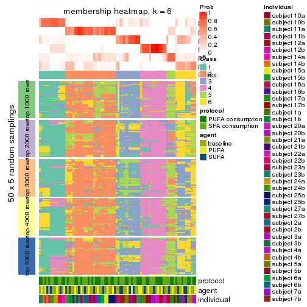</p>

</div>
</div>

As soon as we have had the classes for columns, we can look for signatures
which are significantly different between classes which can be candidate marks
for certain classes. Following are the heatmaps for signatures.


Signature heatmaps where rows are scaled:


<script>
$( function() {
	$( '#tabs-CV-skmeans-get-signatures' ).tabs();
} );
</script>
<div id='tabs-CV-skmeans-get-signatures'>
<ul>
<li><a href='#tab-CV-skmeans-get-signatures-1'>k = 2</a></li>
<li><a href='#tab-CV-skmeans-get-signatures-2'>k = 3</a></li>
<li><a href='#tab-CV-skmeans-get-signatures-3'>k = 4</a></li>
<li><a href='#tab-CV-skmeans-get-signatures-4'>k = 5</a></li>
<li><a href='#tab-CV-skmeans-get-signatures-5'>k = 6</a></li>
</ul>
<div id='tab-CV-skmeans-get-signatures-1'>
<pre><code class="r">get_signatures(res, k = 2)
</code></pre>

<p></p>

</div>
<div id='tab-CV-skmeans-get-signatures-2'>
<pre><code class="r">get_signatures(res, k = 3)
</code></pre>

<p></p>

</div>
<div id='tab-CV-skmeans-get-signatures-3'>
<pre><code class="r">get_signatures(res, k = 4)
</code></pre>

<p></p>

</div>
<div id='tab-CV-skmeans-get-signatures-4'>
<pre><code class="r">get_signatures(res, k = 5)
</code></pre>

<p></p>

</div>
<div id='tab-CV-skmeans-get-signatures-5'>
<pre><code class="r">get_signatures(res, k = 6)
</code></pre>

<p></p>

</div>
</div>


Signature heatmaps where rows are not scaled:


<script>
$( function() {
	$( '#tabs-CV-skmeans-get-signatures-no-scale' ).tabs();
} );
</script>
<div id='tabs-CV-skmeans-get-signatures-no-scale'>
<ul>
<li><a href='#tab-CV-skmeans-get-signatures-no-scale-1'>k = 2</a></li>
<li><a href='#tab-CV-skmeans-get-signatures-no-scale-2'>k = 3</a></li>
<li><a href='#tab-CV-skmeans-get-signatures-no-scale-3'>k = 4</a></li>
<li><a href='#tab-CV-skmeans-get-signatures-no-scale-4'>k = 5</a></li>
<li><a href='#tab-CV-skmeans-get-signatures-no-scale-5'>k = 6</a></li>
</ul>
<div id='tab-CV-skmeans-get-signatures-no-scale-1'>
<pre><code class="r">get_signatures(res, k = 2, scale_rows = FALSE)
</code></pre>

<p></p>

</div>
<div id='tab-CV-skmeans-get-signatures-no-scale-2'>
<pre><code class="r">get_signatures(res, k = 3, scale_rows = FALSE)
</code></pre>

<p></p>

</div>
<div id='tab-CV-skmeans-get-signatures-no-scale-3'>
<pre><code class="r">get_signatures(res, k = 4, scale_rows = FALSE)
</code></pre>

<p></p>

</div>
<div id='tab-CV-skmeans-get-signatures-no-scale-4'>
<pre><code class="r">get_signatures(res, k = 5, scale_rows = FALSE)
</code></pre>

<p></p>

</div>
<div id='tab-CV-skmeans-get-signatures-no-scale-5'>
<pre><code class="r">get_signatures(res, k = 6, scale_rows = FALSE)
</code></pre>

<p></p>

</div>
</div>


Compare the overlap of signatures from different k:

```r
compare_signatures(res)
```


`get_signature()` returns a data frame invisibly. TO get the list of signatures, the function
call should be assigned to a variable explicitly. In following code, if `plot` argument is set
to `FALSE`, no heatmap is plotted while only the differential analysis is performed.

```r
# code only for demonstration
tb = get_signature(res, k = ..., plot = FALSE)
```

An example of the output of `tb` is:

```
#>   which_row         fdr    mean_1    mean_2 scaled_mean_1 scaled_mean_2 km
#> 1        38 0.042760348  8.373488  9.131774    -0.5533452     0.5164555  1
#> 2        40 0.018707592  7.106213  8.469186    -0.6173731     0.5762149  1
#> 3        55 0.019134737 10.221463 11.207825    -0.6159697     0.5749050  1
#> 4        59 0.006059896  5.921854  7.869574    -0.6899429     0.6439467  1
#> 5        60 0.018055526  8.928898 10.211722    -0.6204761     0.5791110  1
#> 6        98 0.009384629 15.714769 14.887706     0.6635654    -0.6193277  2
...
```

The columns in `tb` are:

1. `which_row`: row indices corresponding to the input matrix.
2. `fdr`: FDR for the differential test. 
3. `mean_x`: The mean value in group x.
4. `scaled_mean_x`: The mean value in group x after rows are scaled.
5. `km`: Row groups if k-means clustering is applied to rows.


UMAP plot which shows how samples are separated.


<script>
$( function() {
	$( '#tabs-CV-skmeans-dimension-reduction' ).tabs();
} );
</script>
<div id='tabs-CV-skmeans-dimension-reduction'>
<ul>
<li><a href='#tab-CV-skmeans-dimension-reduction-1'>k = 2</a></li>
<li><a href='#tab-CV-skmeans-dimension-reduction-2'>k = 3</a></li>
<li><a href='#tab-CV-skmeans-dimension-reduction-3'>k = 4</a></li>
<li><a href='#tab-CV-skmeans-dimension-reduction-4'>k = 5</a></li>
<li><a href='#tab-CV-skmeans-dimension-reduction-5'>k = 6</a></li>
</ul>
<div id='tab-CV-skmeans-dimension-reduction-1'>
<pre><code class="r">dimension_reduction(res, k = 2, method = &quot;UMAP&quot;)
</code></pre>

<p></p>

</div>
<div id='tab-CV-skmeans-dimension-reduction-2'>
<pre><code class="r">dimension_reduction(res, k = 3, method = &quot;UMAP&quot;)
</code></pre>

<p></p>

</div>
<div id='tab-CV-skmeans-dimension-reduction-3'>
<pre><code class="r">dimension_reduction(res, k = 4, method = &quot;UMAP&quot;)
</code></pre>

<p></p>

</div>
<div id='tab-CV-skmeans-dimension-reduction-4'>
<pre><code class="r">dimension_reduction(res, k = 5, method = &quot;UMAP&quot;)
</code></pre>

<p></p>

</div>
<div id='tab-CV-skmeans-dimension-reduction-5'>
<pre><code class="r">dimension_reduction(res, k = 6, method = &quot;UMAP&quot;)
</code></pre>

<p></p>

</div>
</div>


Following heatmap shows how subgroups are split when increasing `k`:

```r
collect_classes(res)
```


Test correlation between subgroups and known annotations. If the known
annotation is numeric, one-way ANOVA test is applied, and if the known
annotation is discrete, chi-squared contingency table test is applied.

```r
test_to_known_factors(res)
```

```
#>             n protocol(p) agent(p) individual(p) k
#> CV:skmeans 81       1.000    0.726      1.84e-03 2
#> CV:skmeans 79       0.985    0.995      2.05e-05 3
#> CV:skmeans 71       0.995    1.000      8.77e-08 4
#> CV:skmeans 57       0.950    0.989      6.44e-06 5
#> CV:skmeans 57       0.975    1.000      1.38e-07 6
```


If matrix rows can be associated to genes, consider to use `functional_enrichment(res,
...)` to perform function enrichment for the signature genes. See [this vignette](http://bioconductor.org/packages/devel/bioc/vignettes/cola/inst/doc/functional_enrichment.html) for more detailed explanations.


 

---------------------------------------------------


### CV:pam


The object with results only for a single top-value method and a single partition method 
can be extracted as:

```r
res = res_list["CV", "pam"]
# you can also extract it by
# res = res_list["CV:pam"]
```

A summary of `res` and all the functions that can be applied to it:

```r
res
```

```
#> A 'ConsensusPartition' object with k = 2, 3, 4, 5, 6.
#>   On a matrix with 15497 rows and 84 columns.
#>   Top rows (1000, 2000, 3000, 4000, 5000) are extracted by 'CV' method.
#>   Subgroups are detected by 'pam' method.
#>   Performed in total 1250 partitions by row resampling.
#>   Best k for subgroups seems to be 5.
#> 
#> Following methods can be applied to this 'ConsensusPartition' object:
#>  [1] "cola_report"             "collect_classes"         "collect_plots"          
#>  [4] "collect_stats"           "colnames"                "compare_signatures"     
#>  [7] "consensus_heatmap"       "dimension_reduction"     "functional_enrichment"  
#> [10] "get_anno_col"            "get_anno"                "get_classes"            
#> [13] "get_consensus"           "get_matrix"              "get_membership"         
#> [16] "get_param"               "get_signatures"          "get_stats"              
#> [19] "is_best_k"               "is_stable_k"             "membership_heatmap"     
#> [22] "ncol"                    "nrow"                    "plot_ecdf"              
#> [25] "rownames"                "select_partition_number" "show"                   
#> [28] "suggest_best_k"          "test_to_known_factors"
```

`collect_plots()` function collects all the plots made from `res` for all `k` (number of partitions)
into one single page to provide an easy and fast comparison between different `k`.

```r
collect_plots(res)
```


The plots are:

- The first row: a plot of the ECDF (empirical cumulative distribution
  function) curves of the consensus matrix for each `k` and the heatmap of
  predicted classes for each `k`.
- The second row: heatmaps of the consensus matrix for each `k`.
- The third row: heatmaps of the membership matrix for each `k`.
- The fouth row: heatmaps of the signatures for each `k`.

All the plots in panels can be made by individual functions and they are
plotted later in this section.

`select_partition_number()` produces several plots showing different
statistics for choosing "optimized" `k`. There are following statistics:

- ECDF curves of the consensus matrix for each `k`;
- 1-PAC. [The PAC
  score](https://en.wikipedia.org/wiki/Consensus_clustering#Over-interpretation_potential_of_consensus_clustering)
  measures the proportion of the ambiguous subgrouping.
- Mean silhouette score.
- Concordance. The mean probability of fiting the consensus class ids in all
  partitions.
- Area increased. Denote $A_k$ as the area under the ECDF curve for current
  `k`, the area increased is defined as $A_k - A_{k-1}$.
- Rand index. The percent of pairs of samples that are both in a same cluster
  or both are not in a same cluster in the partition of k and k-1.
- Jaccard index. The ratio of pairs of samples are both in a same cluster in
  the partition of k and k-1 and the pairs of samples are both in a same
  cluster in the partition k or k-1.

The detailed explanations of these statistics can be found in [the _cola_
vignette](http://bioconductor.org/packages/devel/bioc/vignettes/cola/inst/doc/cola.html#toc_13).

Generally speaking, lower PAC score, higher mean silhouette score or higher
concordance corresponds to better partition. Rand index and Jaccard index
measure how similar the current partition is compared to partition with `k-1`.
If they are too similar, we won't accept `k` is better than `k-1`.

```r
select_partition_number(res)
```


The numeric values for all these statistics can be obtained by `get_stats()`.

```r
get_stats(res)
```

```
#>   k 1-PAC mean_silhouette concordance area_increased  Rand Jaccard
#> 2 2 0.290           0.658       0.790         0.4952 0.495   0.495
#> 3 3 0.484           0.606       0.805         0.3173 0.724   0.507
#> 4 4 0.555           0.432       0.684         0.0978 0.772   0.472
#> 5 5 0.668           0.661       0.825         0.0842 0.760   0.352
#> 6 6 0.669           0.613       0.764         0.0507 0.905   0.605
```

`suggest_best_k()` suggests the best $k$ based on these statistics. The rules are as follows:

- All $k$ with Jaccard index larger than 0.95 are removed because increasing
  $k$ does not provide enough extra information. If all $k$ are removed, it is
  marked as no subgroup is detected.
- For all $k$ with 1-PAC score larger than 0.9, the maximal $k$ is taken as
  the best $k$, and other $k$ are marked as optional $k$.
- If it does not fit the second rule. The $k$ with the maximal vote of the
  highest 1-PAC score, highest mean silhouette, and highest concordance is
  taken as the best $k$.

```r
suggest_best_k(res)
```

```
#> [1] 5
```


Following shows the table of the partitions (You need to click the **show/hide
code output** link to see it). The membership matrix (columns with name `p*`)
is inferred by
[`clue::cl_consensus()`](https://www.rdocumentation.org/link/cl_consensus?package=clue)
function with the `SE` method. Basically the value in the membership matrix
represents the probability to belong to a certain group. The finall class
label for an item is determined with the group with highest probability it
belongs to.

In `get_classes()` function, the entropy is calculated from the membership
matrix and the silhouette score is calculated from the consensus matrix.


<script>
$( function() {
	$( '#tabs-CV-pam-get-classes' ).tabs();
} );
</script>
<div id='tabs-CV-pam-get-classes'>
<ul>
<li><a href='#tab-CV-pam-get-classes-1'>k = 2</a></li>
<li><a href='#tab-CV-pam-get-classes-2'>k = 3</a></li>
<li><a href='#tab-CV-pam-get-classes-3'>k = 4</a></li>
<li><a href='#tab-CV-pam-get-classes-4'>k = 5</a></li>
<li><a href='#tab-CV-pam-get-classes-5'>k = 6</a></li>
</ul>

<div id='tab-CV-pam-get-classes-1'>
<p><a id='tab-CV-pam-get-classes-1-a' style='color:#0366d6' href='#'>show/hide code output</a></p>
<pre><code class="r">cbind(get_classes(res, k = 2), get_membership(res, k = 2))
</code></pre>

<pre><code>#&gt;           class entropy silhouette    p1    p2
#&gt; GSM339455     1  0.9896     0.3250 0.560 0.440
#&gt; GSM339456     2  0.8661     0.4581 0.288 0.712
#&gt; GSM339457     1  0.9580     0.3223 0.620 0.380
#&gt; GSM339458     2  0.8813     0.5634 0.300 0.700
#&gt; GSM339459     1  1.0000     0.2256 0.504 0.496
#&gt; GSM339460     2  0.2423     0.8070 0.040 0.960
#&gt; GSM339461     2  0.0000     0.8180 0.000 1.000
#&gt; GSM339462     1  0.0672     0.7842 0.992 0.008
#&gt; GSM339463     2  0.9850     0.3264 0.428 0.572
#&gt; GSM339464     1  0.9661     0.4763 0.608 0.392
#&gt; GSM339465     1  0.8443     0.5502 0.728 0.272
#&gt; GSM339466     2  0.0938     0.8169 0.012 0.988
#&gt; GSM339467     2  0.0938     0.8158 0.012 0.988
#&gt; GSM339468     2  0.7219     0.6410 0.200 0.800
#&gt; GSM339469     1  0.4815     0.7691 0.896 0.104
#&gt; GSM339470     2  0.9044     0.5392 0.320 0.680
#&gt; GSM339471     1  0.0000     0.7819 1.000 0.000
#&gt; GSM339472     2  0.0000     0.8180 0.000 1.000
#&gt; GSM339473     1  0.0000     0.7819 1.000 0.000
#&gt; GSM339474     2  0.0000     0.8180 0.000 1.000
#&gt; GSM339475     1  0.0938     0.7845 0.988 0.012
#&gt; GSM339476     1  0.6973     0.7207 0.812 0.188
#&gt; GSM339477     2  0.6048     0.6986 0.148 0.852
#&gt; GSM339478     2  0.4431     0.7804 0.092 0.908
#&gt; GSM339479     2  0.9491     0.4557 0.368 0.632
#&gt; GSM339480     2  0.9988    -0.1814 0.480 0.520
#&gt; GSM339481     2  0.0000     0.8180 0.000 1.000
#&gt; GSM339482     1  0.5178     0.7512 0.884 0.116
#&gt; GSM339483     1  0.8016     0.6709 0.756 0.244
#&gt; GSM339484     1  0.1184     0.7846 0.984 0.016
#&gt; GSM339485     1  0.9944     0.3452 0.544 0.456
#&gt; GSM339486     1  0.1184     0.7846 0.984 0.016
#&gt; GSM339487     2  0.0376     0.8175 0.004 0.996
#&gt; GSM339488     2  0.2043     0.8099 0.032 0.968
#&gt; GSM339489     2  0.9393     0.3272 0.356 0.644
#&gt; GSM339490     1  0.7815     0.6724 0.768 0.232
#&gt; GSM339491     1  0.9954     0.0267 0.540 0.460
#&gt; GSM339492     1  0.0376     0.7833 0.996 0.004
#&gt; GSM339493     2  0.0000     0.8180 0.000 1.000
#&gt; GSM339494     1  0.4562     0.7719 0.904 0.096
#&gt; GSM339495     2  0.0000     0.8180 0.000 1.000
#&gt; GSM339496     1  0.8327     0.6402 0.736 0.264
#&gt; GSM339497     2  0.1184     0.8149 0.016 0.984
#&gt; GSM339498     2  0.9933    -0.0248 0.452 0.548
#&gt; GSM339499     2  0.9996     0.1383 0.488 0.512
#&gt; GSM339500     2  0.8207     0.6175 0.256 0.744
#&gt; GSM339501     1  0.9833     0.4108 0.576 0.424
#&gt; GSM339502     2  0.2948     0.8008 0.052 0.948
#&gt; GSM339503     1  0.8555     0.5482 0.720 0.280
#&gt; GSM339504     1  0.4161     0.7770 0.916 0.084
#&gt; GSM339505     2  0.8955     0.5485 0.312 0.688
#&gt; GSM339506     1  0.5519     0.7589 0.872 0.128
#&gt; GSM339507     1  0.1414     0.7845 0.980 0.020
#&gt; GSM339508     2  0.0000     0.8180 0.000 1.000
#&gt; GSM339509     2  0.0000     0.8180 0.000 1.000
#&gt; GSM339510     2  0.6531     0.6961 0.168 0.832
#&gt; GSM339511     2  0.0938     0.8158 0.012 0.988
#&gt; GSM339512     2  0.7528     0.6594 0.216 0.784
#&gt; GSM339513     1  0.0000     0.7819 1.000 0.000
#&gt; GSM339514     2  0.0000     0.8180 0.000 1.000
#&gt; GSM339515     1  0.0000     0.7819 1.000 0.000
#&gt; GSM339516     2  0.0000     0.8180 0.000 1.000
#&gt; GSM339517     1  0.4690     0.7543 0.900 0.100
#&gt; GSM339518     2  0.0000     0.8180 0.000 1.000
#&gt; GSM339519     1  0.7528     0.6897 0.784 0.216
#&gt; GSM339520     2  0.8955     0.5469 0.312 0.688
#&gt; GSM339521     2  0.6623     0.6975 0.172 0.828
#&gt; GSM339522     2  0.0000     0.8180 0.000 1.000
#&gt; GSM339523     2  0.0000     0.8180 0.000 1.000
#&gt; GSM339524     1  0.0376     0.7833 0.996 0.004
#&gt; GSM339525     1  0.6801     0.7223 0.820 0.180
#&gt; GSM339526     1  0.0938     0.7846 0.988 0.012
#&gt; GSM339527     1  0.7815     0.6839 0.768 0.232
#&gt; GSM339528     1  0.1184     0.7846 0.984 0.016
#&gt; GSM339529     2  0.0000     0.8180 0.000 1.000
#&gt; GSM339530     1  0.8909     0.5037 0.692 0.308
#&gt; GSM339531     2  0.6887     0.6565 0.184 0.816
#&gt; GSM339532     2  0.7056     0.6497 0.192 0.808
#&gt; GSM339533     1  0.6887     0.6696 0.816 0.184
#&gt; GSM339534     1  0.9552     0.3572 0.624 0.376
#&gt; GSM339535     2  0.0000     0.8180 0.000 1.000
#&gt; GSM339536     1  0.2603     0.7838 0.956 0.044
#&gt; GSM339537     2  0.0000     0.8180 0.000 1.000
#&gt; GSM339538     1  0.0000     0.7819 1.000 0.000
</code></pre>

<script>
$('#tab-CV-pam-get-classes-1-a').parent().next().next().hide();
$('#tab-CV-pam-get-classes-1-a').click(function(){
  $('#tab-CV-pam-get-classes-1-a').parent().next().next().toggle();
  return(false);
});
</script>
</div>

<div id='tab-CV-pam-get-classes-2'>
<p><a id='tab-CV-pam-get-classes-2-a' style='color:#0366d6' href='#'>show/hide code output</a></p>
<pre><code class="r">cbind(get_classes(res, k = 3), get_membership(res, k = 3))
</code></pre>

<pre><code>#&gt;           class entropy silhouette    p1    p2    p3
#&gt; GSM339455     3  0.5939     0.5911 0.224 0.028 0.748
#&gt; GSM339456     2  0.3752     0.7490 0.096 0.884 0.020
#&gt; GSM339457     3  0.7471    -0.1253 0.036 0.448 0.516
#&gt; GSM339458     3  0.6045     0.4053 0.000 0.380 0.620
#&gt; GSM339459     2  0.7289     0.3331 0.468 0.504 0.028
#&gt; GSM339460     2  0.2492     0.7849 0.016 0.936 0.048
#&gt; GSM339461     2  0.2063     0.7870 0.044 0.948 0.008
#&gt; GSM339462     1  0.1289     0.7299 0.968 0.000 0.032
#&gt; GSM339463     3  0.2550     0.7277 0.012 0.056 0.932
#&gt; GSM339464     1  0.6051     0.4526 0.696 0.012 0.292
#&gt; GSM339465     3  0.2200     0.7279 0.004 0.056 0.940
#&gt; GSM339466     2  0.6646     0.6190 0.048 0.712 0.240
#&gt; GSM339467     2  0.1643     0.7854 0.000 0.956 0.044
#&gt; GSM339468     2  0.7178     0.3481 0.464 0.512 0.024
#&gt; GSM339469     1  0.2066     0.7269 0.940 0.000 0.060
#&gt; GSM339470     3  0.2703     0.7268 0.016 0.056 0.928
#&gt; GSM339471     1  0.6111     0.3781 0.604 0.000 0.396
#&gt; GSM339472     2  0.1411     0.7863 0.000 0.964 0.036
#&gt; GSM339473     1  0.6079     0.3801 0.612 0.000 0.388
#&gt; GSM339474     2  0.0829     0.7879 0.012 0.984 0.004
#&gt; GSM339475     3  0.2959     0.7198 0.100 0.000 0.900
#&gt; GSM339476     1  0.4912     0.6140 0.796 0.008 0.196
#&gt; GSM339477     2  0.3375     0.7614 0.100 0.892 0.008
#&gt; GSM339478     2  0.3183     0.7776 0.016 0.908 0.076
#&gt; GSM339479     3  0.4411     0.6594 0.016 0.140 0.844
#&gt; GSM339480     2  0.7072     0.3380 0.476 0.504 0.020
#&gt; GSM339481     2  0.1411     0.7863 0.000 0.964 0.036
#&gt; GSM339482     3  0.6421     0.2417 0.424 0.004 0.572
#&gt; GSM339483     1  0.1453     0.7257 0.968 0.008 0.024
#&gt; GSM339484     3  0.2200     0.7421 0.056 0.004 0.940
#&gt; GSM339485     1  0.6522     0.4779 0.696 0.032 0.272
#&gt; GSM339486     3  0.2384     0.7445 0.056 0.008 0.936
#&gt; GSM339487     2  0.7978     0.6045 0.176 0.660 0.164
#&gt; GSM339488     2  0.1643     0.7861 0.000 0.956 0.044
#&gt; GSM339489     2  0.8268     0.3168 0.440 0.484 0.076
#&gt; GSM339490     1  0.1289     0.7299 0.968 0.000 0.032
#&gt; GSM339491     3  0.1950     0.7380 0.040 0.008 0.952
#&gt; GSM339492     1  0.4605     0.6555 0.796 0.000 0.204
#&gt; GSM339493     2  0.0829     0.7879 0.012 0.984 0.004
#&gt; GSM339494     1  0.6548     0.3992 0.616 0.012 0.372
#&gt; GSM339495     2  0.0829     0.7879 0.012 0.984 0.004
#&gt; GSM339496     3  0.3030     0.7310 0.092 0.004 0.904
#&gt; GSM339497     2  0.7360     0.6165 0.096 0.692 0.212
#&gt; GSM339498     2  0.9301     0.3082 0.360 0.472 0.168
#&gt; GSM339499     3  0.2443     0.7371 0.028 0.032 0.940
#&gt; GSM339500     2  0.4235     0.6903 0.000 0.824 0.176
#&gt; GSM339501     2  0.7074     0.3297 0.480 0.500 0.020
#&gt; GSM339502     2  0.1860     0.7847 0.000 0.948 0.052
#&gt; GSM339503     3  0.5536     0.5927 0.236 0.012 0.752
#&gt; GSM339504     1  0.1289     0.7299 0.968 0.000 0.032
#&gt; GSM339505     3  0.3129     0.7151 0.008 0.088 0.904
#&gt; GSM339506     3  0.6500     0.1575 0.464 0.004 0.532
#&gt; GSM339507     3  0.2261     0.7432 0.068 0.000 0.932
#&gt; GSM339508     2  0.0237     0.7883 0.000 0.996 0.004
#&gt; GSM339509     2  0.2066     0.7824 0.000 0.940 0.060
#&gt; GSM339510     2  0.7049     0.3760 0.452 0.528 0.020
#&gt; GSM339511     1  0.7023     0.2059 0.624 0.344 0.032
#&gt; GSM339512     2  0.2625     0.7712 0.000 0.916 0.084
#&gt; GSM339513     1  0.1289     0.7299 0.968 0.000 0.032
#&gt; GSM339514     2  0.1411     0.7863 0.000 0.964 0.036
#&gt; GSM339515     1  0.3192     0.7125 0.888 0.000 0.112
#&gt; GSM339516     2  0.6255     0.5626 0.320 0.668 0.012
#&gt; GSM339517     3  0.3038     0.7171 0.104 0.000 0.896
#&gt; GSM339518     2  0.1170     0.7885 0.016 0.976 0.008
#&gt; GSM339519     1  0.5291     0.5054 0.732 0.000 0.268
#&gt; GSM339520     2  0.6235     0.2498 0.000 0.564 0.436
#&gt; GSM339521     2  0.1643     0.7854 0.000 0.956 0.044
#&gt; GSM339522     2  0.6617     0.4730 0.388 0.600 0.012
#&gt; GSM339523     2  0.1411     0.7863 0.000 0.964 0.036
#&gt; GSM339524     3  0.6309     0.0658 0.496 0.000 0.504
#&gt; GSM339525     1  0.2774     0.7262 0.920 0.008 0.072
#&gt; GSM339526     3  0.2066     0.7392 0.060 0.000 0.940
#&gt; GSM339527     3  0.6659     0.1420 0.460 0.008 0.532
#&gt; GSM339528     3  0.2486     0.7445 0.060 0.008 0.932
#&gt; GSM339529     2  0.1636     0.7887 0.020 0.964 0.016
#&gt; GSM339530     3  0.5968     0.4036 0.000 0.364 0.636
#&gt; GSM339531     2  0.8091     0.5068 0.320 0.592 0.088
#&gt; GSM339532     1  0.3690     0.6786 0.884 0.100 0.016
#&gt; GSM339533     3  0.2066     0.7422 0.060 0.000 0.940
#&gt; GSM339534     1  0.4281     0.7031 0.872 0.072 0.056
#&gt; GSM339535     2  0.1620     0.7877 0.024 0.964 0.012
#&gt; GSM339536     1  0.6008     0.4114 0.628 0.000 0.372
#&gt; GSM339537     2  0.1877     0.7868 0.032 0.956 0.012
#&gt; GSM339538     1  0.5733     0.4442 0.676 0.000 0.324
</code></pre>

<script>
$('#tab-CV-pam-get-classes-2-a').parent().next().next().hide();
$('#tab-CV-pam-get-classes-2-a').click(function(){
  $('#tab-CV-pam-get-classes-2-a').parent().next().next().toggle();
  return(false);
});
</script>
</div>

<div id='tab-CV-pam-get-classes-3'>
<p><a id='tab-CV-pam-get-classes-3-a' style='color:#0366d6' href='#'>show/hide code output</a></p>
<pre><code class="r">cbind(get_classes(res, k = 4), get_membership(res, k = 4))
</code></pre>

<pre><code>#&gt;           class entropy silhouette    p1    p2    p3    p4
#&gt; GSM339455     4  0.7786    -0.0043 0.224 0.004 0.316 0.456
#&gt; GSM339456     2  0.2928     0.7267 0.056 0.904 0.012 0.028
#&gt; GSM339457     4  0.7890    -0.3709 0.008 0.220 0.316 0.456
#&gt; GSM339458     2  0.7001    -0.1604 0.000 0.464 0.420 0.116
#&gt; GSM339459     1  0.7881     0.0391 0.492 0.232 0.012 0.264
#&gt; GSM339460     2  0.1297     0.7646 0.016 0.964 0.000 0.020
#&gt; GSM339461     2  0.3312     0.7275 0.052 0.876 0.000 0.072
#&gt; GSM339462     1  0.3907     0.3889 0.768 0.000 0.000 0.232
#&gt; GSM339463     3  0.5273     0.8699 0.000 0.008 0.536 0.456
#&gt; GSM339464     4  0.5861    -0.3288 0.480 0.000 0.032 0.488
#&gt; GSM339465     3  0.5273     0.8699 0.000 0.008 0.536 0.456
#&gt; GSM339466     4  0.6615     0.2199 0.052 0.384 0.016 0.548
#&gt; GSM339467     2  0.0000     0.7722 0.000 1.000 0.000 0.000
#&gt; GSM339468     1  0.8045     0.0212 0.476 0.244 0.016 0.264
#&gt; GSM339469     1  0.4838     0.3774 0.724 0.000 0.024 0.252
#&gt; GSM339470     3  0.5273     0.8699 0.000 0.008 0.536 0.456
#&gt; GSM339471     1  0.7176     0.1763 0.552 0.000 0.196 0.252
#&gt; GSM339472     2  0.0707     0.7680 0.000 0.980 0.000 0.020
#&gt; GSM339473     1  0.4972     0.2934 0.544 0.000 0.456 0.000
#&gt; GSM339474     2  0.1389     0.7652 0.000 0.952 0.000 0.048
#&gt; GSM339475     3  0.6252     0.8506 0.056 0.000 0.512 0.432
#&gt; GSM339476     1  0.5673     0.2501 0.528 0.000 0.024 0.448
#&gt; GSM339477     2  0.2961     0.7355 0.044 0.904 0.012 0.040
#&gt; GSM339478     2  0.4769     0.4891 0.000 0.684 0.008 0.308
#&gt; GSM339479     3  0.6983     0.7445 0.000 0.124 0.516 0.360
#&gt; GSM339480     1  0.7899     0.0377 0.488 0.232 0.012 0.268
#&gt; GSM339481     2  0.0000     0.7722 0.000 1.000 0.000 0.000
#&gt; GSM339482     3  0.6445     0.0517 0.444 0.000 0.488 0.068
#&gt; GSM339483     1  0.5060     0.3057 0.584 0.000 0.004 0.412
#&gt; GSM339484     3  0.5650     0.8816 0.024 0.000 0.544 0.432
#&gt; GSM339485     1  0.5478     0.2901 0.540 0.016 0.000 0.444
#&gt; GSM339486     3  0.5908     0.8801 0.028 0.004 0.536 0.432
#&gt; GSM339487     4  0.7962     0.2799 0.224 0.340 0.008 0.428
#&gt; GSM339488     2  0.0376     0.7714 0.000 0.992 0.004 0.004
#&gt; GSM339489     1  0.8154    -0.0337 0.444 0.240 0.016 0.300
#&gt; GSM339490     1  0.4103     0.3860 0.744 0.000 0.000 0.256
#&gt; GSM339491     3  0.6079     0.8769 0.016 0.020 0.532 0.432
#&gt; GSM339492     1  0.6469     0.2592 0.644 0.000 0.192 0.164
#&gt; GSM339493     2  0.1637     0.7628 0.000 0.940 0.000 0.060
#&gt; GSM339494     1  0.4977     0.2928 0.540 0.000 0.460 0.000
#&gt; GSM339495     2  0.1474     0.7644 0.000 0.948 0.000 0.052
#&gt; GSM339496     4  0.5903    -0.5350 0.052 0.000 0.332 0.616
#&gt; GSM339497     4  0.7714     0.3103 0.160 0.360 0.012 0.468
#&gt; GSM339498     4  0.8233     0.1625 0.316 0.228 0.020 0.436
#&gt; GSM339499     3  0.5268     0.8760 0.008 0.000 0.540 0.452
#&gt; GSM339500     2  0.7093     0.1528 0.000 0.568 0.216 0.216
#&gt; GSM339501     1  0.7881     0.0402 0.492 0.232 0.012 0.264
#&gt; GSM339502     2  0.0524     0.7716 0.000 0.988 0.008 0.004
#&gt; GSM339503     3  0.7527     0.5468 0.216 0.000 0.484 0.300
#&gt; GSM339504     1  0.4134     0.3849 0.740 0.000 0.000 0.260
#&gt; GSM339505     3  0.5388     0.8676 0.000 0.012 0.532 0.456
#&gt; GSM339506     1  0.6010    -0.0822 0.488 0.000 0.472 0.040
#&gt; GSM339507     3  0.5650     0.8816 0.024 0.000 0.544 0.432
#&gt; GSM339508     2  0.1209     0.7705 0.000 0.964 0.004 0.032
#&gt; GSM339509     2  0.0376     0.7710 0.000 0.992 0.004 0.004
#&gt; GSM339510     1  0.7714     0.0260 0.484 0.236 0.004 0.276
#&gt; GSM339511     1  0.5937     0.2747 0.512 0.028 0.004 0.456
#&gt; GSM339512     2  0.2965     0.7248 0.000 0.892 0.036 0.072
#&gt; GSM339513     1  0.3356     0.3637 0.824 0.000 0.176 0.000
#&gt; GSM339514     2  0.0000     0.7722 0.000 1.000 0.000 0.000
#&gt; GSM339515     1  0.4961     0.2931 0.552 0.000 0.448 0.000
#&gt; GSM339516     2  0.7889    -0.2810 0.348 0.364 0.000 0.288
#&gt; GSM339517     3  0.6552     0.8256 0.076 0.000 0.484 0.440
#&gt; GSM339518     2  0.2760     0.7229 0.000 0.872 0.000 0.128
#&gt; GSM339519     1  0.5032     0.3456 0.764 0.000 0.156 0.080
#&gt; GSM339520     2  0.5383     0.5149 0.000 0.744 0.128 0.128
#&gt; GSM339521     2  0.0188     0.7725 0.000 0.996 0.000 0.004
#&gt; GSM339522     1  0.7773    -0.0630 0.432 0.284 0.000 0.284
#&gt; GSM339523     2  0.0000     0.7722 0.000 1.000 0.000 0.000
#&gt; GSM339524     1  0.4948    -0.0166 0.560 0.000 0.440 0.000
#&gt; GSM339525     1  0.5839     0.3236 0.604 0.000 0.044 0.352
#&gt; GSM339526     3  0.5650     0.8816 0.024 0.000 0.544 0.432
#&gt; GSM339527     1  0.7557     0.0166 0.488 0.000 0.252 0.260
#&gt; GSM339528     3  0.5908     0.8822 0.028 0.004 0.536 0.432
#&gt; GSM339529     2  0.4343     0.5413 0.000 0.732 0.004 0.264
#&gt; GSM339530     2  0.5365     0.3834 0.000 0.692 0.264 0.044
#&gt; GSM339531     2  0.8298    -0.3461 0.324 0.336 0.012 0.328
#&gt; GSM339532     1  0.5769     0.3296 0.588 0.036 0.000 0.376
#&gt; GSM339533     3  0.5650     0.8816 0.024 0.000 0.544 0.432
#&gt; GSM339534     1  0.5394     0.3384 0.748 0.012 0.180 0.060
#&gt; GSM339535     2  0.3942     0.5988 0.000 0.764 0.000 0.236
#&gt; GSM339536     1  0.4972     0.2934 0.544 0.000 0.456 0.000
#&gt; GSM339537     2  0.4456     0.5251 0.004 0.716 0.000 0.280
#&gt; GSM339538     1  0.5292     0.2671 0.512 0.000 0.480 0.008
</code></pre>

<script>
$('#tab-CV-pam-get-classes-3-a').parent().next().next().hide();
$('#tab-CV-pam-get-classes-3-a').click(function(){
  $('#tab-CV-pam-get-classes-3-a').parent().next().next().toggle();
  return(false);
});
</script>
</div>

<div id='tab-CV-pam-get-classes-4'>
<p><a id='tab-CV-pam-get-classes-4-a' style='color:#0366d6' href='#'>show/hide code output</a></p>
<pre><code class="r">cbind(get_classes(res, k = 5), get_membership(res, k = 5))
</code></pre>

<pre><code>#&gt;           class entropy silhouette    p1    p2    p3    p4    p5
#&gt; GSM339455     3  0.5383     0.5475 0.000 0.004 0.644 0.084 0.268
#&gt; GSM339456     2  0.4752     0.4471 0.000 0.648 0.036 0.000 0.316
#&gt; GSM339457     3  0.4920     0.1430 0.000 0.008 0.568 0.016 0.408
#&gt; GSM339458     3  0.4452     0.0580 0.000 0.496 0.500 0.000 0.004
#&gt; GSM339459     5  0.3323     0.6649 0.004 0.000 0.036 0.116 0.844
#&gt; GSM339460     2  0.1498     0.7798 0.000 0.952 0.008 0.024 0.016
#&gt; GSM339461     5  0.4972     0.3673 0.000 0.336 0.000 0.044 0.620
#&gt; GSM339462     4  0.4737     0.7153 0.156 0.000 0.020 0.756 0.068
#&gt; GSM339463     3  0.1082     0.8339 0.000 0.008 0.964 0.000 0.028
#&gt; GSM339464     4  0.3919     0.7378 0.000 0.000 0.036 0.776 0.188
#&gt; GSM339465     3  0.1082     0.8339 0.000 0.008 0.964 0.000 0.028
#&gt; GSM339466     5  0.2722     0.6960 0.000 0.060 0.040 0.008 0.892
#&gt; GSM339467     2  0.0290     0.7953 0.000 0.992 0.000 0.000 0.008
#&gt; GSM339468     5  0.3623     0.6768 0.004 0.004 0.052 0.104 0.836
#&gt; GSM339469     4  0.0898     0.8281 0.020 0.000 0.008 0.972 0.000
#&gt; GSM339470     3  0.1082     0.8339 0.000 0.008 0.964 0.000 0.028
#&gt; GSM339471     1  0.3280     0.8043 0.808 0.000 0.184 0.004 0.004
#&gt; GSM339472     2  0.0703     0.7938 0.000 0.976 0.000 0.000 0.024
#&gt; GSM339473     1  0.0000     0.8677 1.000 0.000 0.000 0.000 0.000
#&gt; GSM339474     2  0.4464     0.2933 0.000 0.584 0.000 0.008 0.408
#&gt; GSM339475     3  0.0609     0.8351 0.000 0.000 0.980 0.000 0.020
#&gt; GSM339476     4  0.5892     0.5856 0.040 0.000 0.068 0.636 0.256
#&gt; GSM339477     2  0.3262     0.7120 0.000 0.840 0.036 0.000 0.124
#&gt; GSM339478     5  0.4905     0.5462 0.000 0.256 0.036 0.016 0.692
#&gt; GSM339479     3  0.2233     0.7921 0.000 0.104 0.892 0.000 0.004
#&gt; GSM339480     5  0.3165     0.6651 0.000 0.000 0.036 0.116 0.848
#&gt; GSM339481     2  0.0404     0.7950 0.000 0.988 0.000 0.000 0.012
#&gt; GSM339482     3  0.3548     0.7412 0.008 0.000 0.836 0.112 0.044
#&gt; GSM339483     4  0.3516     0.7847 0.004 0.000 0.020 0.812 0.164
#&gt; GSM339484     3  0.0000     0.8392 0.000 0.000 1.000 0.000 0.000
#&gt; GSM339485     4  0.0740     0.8343 0.000 0.008 0.008 0.980 0.004
#&gt; GSM339486     3  0.0451     0.8398 0.000 0.000 0.988 0.008 0.004
#&gt; GSM339487     5  0.3483     0.6783 0.000 0.088 0.052 0.012 0.848
#&gt; GSM339488     2  0.0162     0.7951 0.000 0.996 0.000 0.000 0.004
#&gt; GSM339489     5  0.3693     0.6857 0.000 0.012 0.072 0.080 0.836
#&gt; GSM339490     4  0.0798     0.8299 0.016 0.000 0.008 0.976 0.000
#&gt; GSM339491     3  0.0609     0.8378 0.000 0.020 0.980 0.000 0.000
#&gt; GSM339492     1  0.4059     0.8201 0.804 0.008 0.148 0.020 0.020
#&gt; GSM339493     5  0.4549     0.0174 0.000 0.464 0.000 0.008 0.528
#&gt; GSM339494     1  0.0000     0.8677 1.000 0.000 0.000 0.000 0.000
#&gt; GSM339495     5  0.4533     0.0658 0.000 0.448 0.000 0.008 0.544
#&gt; GSM339496     3  0.3003     0.7072 0.000 0.000 0.812 0.000 0.188
#&gt; GSM339497     5  0.3924     0.6879 0.000 0.096 0.080 0.008 0.816
#&gt; GSM339498     5  0.3527     0.6537 0.000 0.000 0.056 0.116 0.828
#&gt; GSM339499     3  0.1836     0.8255 0.000 0.008 0.936 0.016 0.040
#&gt; GSM339500     5  0.6756     0.1708 0.000 0.308 0.288 0.000 0.404
#&gt; GSM339501     5  0.3565     0.6387 0.000 0.000 0.024 0.176 0.800
#&gt; GSM339502     2  0.0807     0.7930 0.000 0.976 0.012 0.000 0.012
#&gt; GSM339503     3  0.4013     0.7153 0.004 0.000 0.804 0.108 0.084
#&gt; GSM339504     4  0.4206     0.7814 0.048 0.000 0.024 0.800 0.128
#&gt; GSM339505     3  0.1082     0.8339 0.000 0.008 0.964 0.000 0.028
#&gt; GSM339506     3  0.5572     0.5215 0.000 0.000 0.644 0.164 0.192
#&gt; GSM339507     3  0.0162     0.8394 0.004 0.000 0.996 0.000 0.000
#&gt; GSM339508     2  0.4517     0.1324 0.000 0.556 0.000 0.008 0.436
#&gt; GSM339509     2  0.0693     0.7871 0.000 0.980 0.000 0.008 0.012
#&gt; GSM339510     5  0.3106     0.6651 0.000 0.000 0.020 0.140 0.840
#&gt; GSM339511     4  0.2172     0.8020 0.000 0.016 0.000 0.908 0.076
#&gt; GSM339512     2  0.4989     0.1250 0.000 0.552 0.032 0.000 0.416
#&gt; GSM339513     1  0.3849     0.8004 0.820 0.000 0.036 0.124 0.020
#&gt; GSM339514     2  0.0510     0.7940 0.000 0.984 0.000 0.000 0.016
#&gt; GSM339515     1  0.0000     0.8677 1.000 0.000 0.000 0.000 0.000
#&gt; GSM339516     5  0.1845     0.6997 0.000 0.056 0.000 0.016 0.928
#&gt; GSM339517     3  0.1525     0.8247 0.012 0.000 0.948 0.004 0.036
#&gt; GSM339518     5  0.4415     0.2932 0.000 0.388 0.000 0.008 0.604
#&gt; GSM339519     1  0.4387     0.7835 0.796 0.000 0.040 0.116 0.048
#&gt; GSM339520     2  0.3860     0.6555 0.000 0.808 0.148 0.016 0.028
#&gt; GSM339521     2  0.4150     0.2332 0.000 0.612 0.000 0.000 0.388
#&gt; GSM339522     5  0.3413     0.6932 0.000 0.044 0.000 0.124 0.832
#&gt; GSM339523     2  0.0290     0.7953 0.000 0.992 0.000 0.000 0.008
#&gt; GSM339524     3  0.6548     0.3314 0.288 0.000 0.556 0.124 0.032
#&gt; GSM339525     4  0.1282     0.8310 0.000 0.000 0.044 0.952 0.004
#&gt; GSM339526     3  0.0000     0.8392 0.000 0.000 1.000 0.000 0.000
#&gt; GSM339527     5  0.6373    -0.1212 0.000 0.000 0.412 0.164 0.424
#&gt; GSM339528     3  0.0324     0.8401 0.000 0.000 0.992 0.004 0.004
#&gt; GSM339529     5  0.4003     0.5388 0.000 0.288 0.000 0.008 0.704
#&gt; GSM339530     2  0.1904     0.7681 0.000 0.936 0.020 0.016 0.028
#&gt; GSM339531     5  0.1996     0.7057 0.000 0.032 0.036 0.004 0.928
#&gt; GSM339532     4  0.2616     0.7706 0.000 0.020 0.000 0.880 0.100
#&gt; GSM339533     3  0.0000     0.8392 0.000 0.000 1.000 0.000 0.000
#&gt; GSM339534     1  0.4626     0.8292 0.804 0.016 0.056 0.076 0.048
#&gt; GSM339535     5  0.3910     0.5230 0.000 0.272 0.000 0.008 0.720
#&gt; GSM339536     1  0.0000     0.8677 1.000 0.000 0.000 0.000 0.000
#&gt; GSM339537     5  0.1956     0.6943 0.000 0.076 0.000 0.008 0.916
#&gt; GSM339538     1  0.2607     0.8638 0.904 0.000 0.040 0.032 0.024
</code></pre>

<script>
$('#tab-CV-pam-get-classes-4-a').parent().next().next().hide();
$('#tab-CV-pam-get-classes-4-a').click(function(){
  $('#tab-CV-pam-get-classes-4-a').parent().next().next().toggle();
  return(false);
});
</script>
</div>

<div id='tab-CV-pam-get-classes-5'>
<p><a id='tab-CV-pam-get-classes-5-a' style='color:#0366d6' href='#'>show/hide code output</a></p>
<pre><code class="r">cbind(get_classes(res, k = 6), get_membership(res, k = 6))
</code></pre>

<pre><code>#&gt;           class entropy silhouette    p1    p2    p3    p4    p5    p6
#&gt; GSM339455     6  0.3919     0.1815 0.000 0.016 0.020 0.004 0.204 0.756
#&gt; GSM339456     2  0.4512     0.5275 0.000 0.708 0.096 0.004 0.192 0.000
#&gt; GSM339457     6  0.3877     0.1887 0.000 0.016 0.024 0.004 0.188 0.768
#&gt; GSM339458     2  0.5708     0.0564 0.000 0.520 0.216 0.000 0.000 0.264
#&gt; GSM339459     3  0.5303     0.4757 0.000 0.000 0.644 0.060 0.052 0.244
#&gt; GSM339460     2  0.0653     0.7955 0.000 0.980 0.004 0.004 0.012 0.000
#&gt; GSM339461     3  0.5385     0.1562 0.000 0.060 0.572 0.032 0.336 0.000
#&gt; GSM339462     4  0.3325     0.7798 0.092 0.000 0.032 0.840 0.036 0.000
#&gt; GSM339463     6  0.4249     0.7584 0.000 0.000 0.328 0.000 0.032 0.640
#&gt; GSM339464     4  0.3825     0.7286 0.000 0.000 0.076 0.788 0.128 0.008
#&gt; GSM339465     6  0.4249     0.7584 0.000 0.000 0.328 0.000 0.032 0.640
#&gt; GSM339466     5  0.1088     0.7148 0.000 0.016 0.000 0.000 0.960 0.024
#&gt; GSM339467     2  0.0458     0.7976 0.000 0.984 0.000 0.000 0.016 0.000
#&gt; GSM339468     5  0.4400     0.6315 0.000 0.008 0.120 0.064 0.772 0.036
#&gt; GSM339469     4  0.0547     0.8320 0.000 0.000 0.000 0.980 0.000 0.020
#&gt; GSM339470     6  0.4249     0.7584 0.000 0.000 0.328 0.000 0.032 0.640
#&gt; GSM339471     1  0.5215     0.7192 0.696 0.000 0.120 0.060 0.000 0.124
#&gt; GSM339472     2  0.0748     0.7925 0.000 0.976 0.004 0.004 0.016 0.000
#&gt; GSM339473     1  0.0000     0.8046 1.000 0.000 0.000 0.000 0.000 0.000
#&gt; GSM339474     5  0.3789     0.3031 0.000 0.416 0.000 0.000 0.584 0.000
#&gt; GSM339475     3  0.3737    -0.3255 0.000 0.000 0.608 0.000 0.000 0.392
#&gt; GSM339476     4  0.6656     0.5438 0.028 0.016 0.092 0.588 0.220 0.056
#&gt; GSM339477     2  0.3477     0.6727 0.000 0.808 0.056 0.004 0.132 0.000
#&gt; GSM339478     5  0.6001     0.3537 0.000 0.140 0.012 0.004 0.460 0.384
#&gt; GSM339479     6  0.5405     0.6665 0.000 0.112 0.312 0.000 0.008 0.568
#&gt; GSM339480     3  0.5500     0.4809 0.000 0.000 0.640 0.060 0.076 0.224
#&gt; GSM339481     2  0.0458     0.7976 0.000 0.984 0.000 0.000 0.016 0.000
#&gt; GSM339482     3  0.2325     0.6191 0.000 0.000 0.892 0.060 0.000 0.048
#&gt; GSM339483     4  0.2633     0.8050 0.000 0.000 0.032 0.864 0.104 0.000
#&gt; GSM339484     6  0.3930     0.7542 0.000 0.000 0.364 0.004 0.004 0.628
#&gt; GSM339485     4  0.0520     0.8339 0.000 0.000 0.008 0.984 0.008 0.000
#&gt; GSM339486     6  0.4102     0.7568 0.000 0.000 0.356 0.012 0.004 0.628
#&gt; GSM339487     5  0.1418     0.7156 0.000 0.024 0.000 0.000 0.944 0.032
#&gt; GSM339488     2  0.0363     0.7975 0.000 0.988 0.000 0.000 0.012 0.000
#&gt; GSM339489     5  0.4726     0.5969 0.000 0.000 0.124 0.044 0.736 0.096
#&gt; GSM339490     4  0.0146     0.8324 0.000 0.000 0.004 0.996 0.000 0.000
#&gt; GSM339491     6  0.4196     0.7534 0.000 0.028 0.332 0.000 0.000 0.640
#&gt; GSM339492     1  0.5680     0.7276 0.680 0.016 0.092 0.056 0.004 0.152
#&gt; GSM339493     5  0.3266     0.5580 0.000 0.272 0.000 0.000 0.728 0.000
#&gt; GSM339494     1  0.0000     0.8046 1.000 0.000 0.000 0.000 0.000 0.000
#&gt; GSM339495     5  0.3244     0.5622 0.000 0.268 0.000 0.000 0.732 0.000
#&gt; GSM339496     6  0.4175     0.3223 0.000 0.000 0.136 0.004 0.108 0.752
#&gt; GSM339497     5  0.3957     0.6887 0.000 0.072 0.056 0.000 0.804 0.068
#&gt; GSM339498     5  0.4897     0.3242 0.000 0.000 0.344 0.064 0.588 0.004
#&gt; GSM339499     6  0.0862     0.4230 0.000 0.016 0.000 0.004 0.008 0.972
#&gt; GSM339500     5  0.6178     0.3865 0.000 0.308 0.024 0.000 0.492 0.176
#&gt; GSM339501     5  0.4524     0.5608 0.000 0.000 0.092 0.200 0.704 0.004
#&gt; GSM339502     2  0.0603     0.7978 0.000 0.980 0.000 0.000 0.016 0.004
#&gt; GSM339503     3  0.2714     0.6131 0.000 0.000 0.872 0.060 0.004 0.064
#&gt; GSM339504     4  0.2986     0.8161 0.032 0.000 0.032 0.876 0.048 0.012
#&gt; GSM339505     6  0.4438     0.7512 0.000 0.000 0.328 0.000 0.044 0.628
#&gt; GSM339506     3  0.6553     0.0213 0.000 0.000 0.460 0.156 0.056 0.328
#&gt; GSM339507     6  0.3861     0.7593 0.008 0.000 0.352 0.000 0.000 0.640
#&gt; GSM339508     5  0.4350     0.3648 0.000 0.428 0.000 0.004 0.552 0.016
#&gt; GSM339509     2  0.0000     0.7934 0.000 1.000 0.000 0.000 0.000 0.000
#&gt; GSM339510     5  0.4721     0.6079 0.000 0.000 0.092 0.116 0.740 0.052
#&gt; GSM339511     4  0.3109     0.7078 0.000 0.004 0.000 0.772 0.224 0.000
#&gt; GSM339512     5  0.4875     0.2726 0.000 0.460 0.008 0.000 0.492 0.040
#&gt; GSM339513     1  0.4252     0.7549 0.752 0.000 0.120 0.120 0.000 0.008
#&gt; GSM339514     2  0.0632     0.7936 0.000 0.976 0.000 0.000 0.024 0.000
#&gt; GSM339515     1  0.0000     0.8046 1.000 0.000 0.000 0.000 0.000 0.000
#&gt; GSM339516     5  0.0993     0.7156 0.000 0.024 0.012 0.000 0.964 0.000
#&gt; GSM339517     3  0.1219     0.5469 0.000 0.000 0.948 0.004 0.000 0.048
#&gt; GSM339518     5  0.2902     0.6502 0.000 0.196 0.000 0.000 0.800 0.004
#&gt; GSM339519     1  0.5509     0.6895 0.676 0.000 0.184 0.060 0.064 0.016
#&gt; GSM339520     2  0.4222     0.3971 0.000 0.516 0.000 0.004 0.008 0.472
#&gt; GSM339521     2  0.3868    -0.3025 0.000 0.504 0.000 0.000 0.496 0.000
#&gt; GSM339522     5  0.1863     0.7025 0.000 0.016 0.004 0.060 0.920 0.000
#&gt; GSM339523     2  0.0458     0.7976 0.000 0.984 0.000 0.000 0.016 0.000
#&gt; GSM339524     3  0.3450     0.6188 0.060 0.000 0.836 0.072 0.000 0.032
#&gt; GSM339525     4  0.1523     0.8290 0.000 0.000 0.008 0.940 0.008 0.044
#&gt; GSM339526     6  0.3737     0.7409 0.000 0.000 0.392 0.000 0.000 0.608
#&gt; GSM339527     3  0.4123     0.5974 0.000 0.000 0.772 0.124 0.088 0.016
#&gt; GSM339528     6  0.4022     0.7563 0.000 0.000 0.360 0.008 0.004 0.628
#&gt; GSM339529     5  0.4105     0.6695 0.000 0.152 0.000 0.008 0.760 0.080
#&gt; GSM339530     2  0.3940     0.5539 0.000 0.652 0.000 0.004 0.008 0.336
#&gt; GSM339531     5  0.2196     0.6841 0.000 0.004 0.108 0.004 0.884 0.000
#&gt; GSM339532     4  0.2300     0.7702 0.000 0.000 0.000 0.856 0.144 0.000
#&gt; GSM339533     6  0.3769     0.7578 0.000 0.000 0.356 0.004 0.000 0.640
#&gt; GSM339534     1  0.6016     0.7414 0.680 0.012 0.040 0.116 0.052 0.100
#&gt; GSM339535     5  0.2378     0.6778 0.000 0.152 0.000 0.000 0.848 0.000
#&gt; GSM339536     1  0.0000     0.8046 1.000 0.000 0.000 0.000 0.000 0.000
#&gt; GSM339537     5  0.0790     0.7173 0.000 0.032 0.000 0.000 0.968 0.000
#&gt; GSM339538     1  0.3652     0.7066 0.720 0.000 0.264 0.016 0.000 0.000
</code></pre>

<script>
$('#tab-CV-pam-get-classes-5-a').parent().next().next().hide();
$('#tab-CV-pam-get-classes-5-a').click(function(){
  $('#tab-CV-pam-get-classes-5-a').parent().next().next().toggle();
  return(false);
});
</script>
</div>
</div>

Heatmaps for the consensus matrix. It visualizes the probability of two
samples to be in a same group.


<script>
$( function() {
	$( '#tabs-CV-pam-consensus-heatmap' ).tabs();
} );
</script>
<div id='tabs-CV-pam-consensus-heatmap'>
<ul>
<li><a href='#tab-CV-pam-consensus-heatmap-1'>k = 2</a></li>
<li><a href='#tab-CV-pam-consensus-heatmap-2'>k = 3</a></li>
<li><a href='#tab-CV-pam-consensus-heatmap-3'>k = 4</a></li>
<li><a href='#tab-CV-pam-consensus-heatmap-4'>k = 5</a></li>
<li><a href='#tab-CV-pam-consensus-heatmap-5'>k = 6</a></li>
</ul>
<div id='tab-CV-pam-consensus-heatmap-1'>
<pre><code class="r">consensus_heatmap(res, k = 2)
</code></pre>

<p></p>

</div>
<div id='tab-CV-pam-consensus-heatmap-2'>
<pre><code class="r">consensus_heatmap(res, k = 3)
</code></pre>

<p></p>

</div>
<div id='tab-CV-pam-consensus-heatmap-3'>
<pre><code class="r">consensus_heatmap(res, k = 4)
</code></pre>

<p></p>

</div>
<div id='tab-CV-pam-consensus-heatmap-4'>
<pre><code class="r">consensus_heatmap(res, k = 5)
</code></pre>

<p></p>

</div>
<div id='tab-CV-pam-consensus-heatmap-5'>
<pre><code class="r">consensus_heatmap(res, k = 6)
</code></pre>

<p></p>

</div>
</div>

Heatmaps for the membership of samples in all partitions to see how consistent they are:


<script>
$( function() {
	$( '#tabs-CV-pam-membership-heatmap' ).tabs();
} );
</script>
<div id='tabs-CV-pam-membership-heatmap'>
<ul>
<li><a href='#tab-CV-pam-membership-heatmap-1'>k = 2</a></li>
<li><a href='#tab-CV-pam-membership-heatmap-2'>k = 3</a></li>
<li><a href='#tab-CV-pam-membership-heatmap-3'>k = 4</a></li>
<li><a href='#tab-CV-pam-membership-heatmap-4'>k = 5</a></li>
<li><a href='#tab-CV-pam-membership-heatmap-5'>k = 6</a></li>
</ul>
<div id='tab-CV-pam-membership-heatmap-1'>
<pre><code class="r">membership_heatmap(res, k = 2)
</code></pre>

<p></p>

</div>
<div id='tab-CV-pam-membership-heatmap-2'>
<pre><code class="r">membership_heatmap(res, k = 3)
</code></pre>

<p>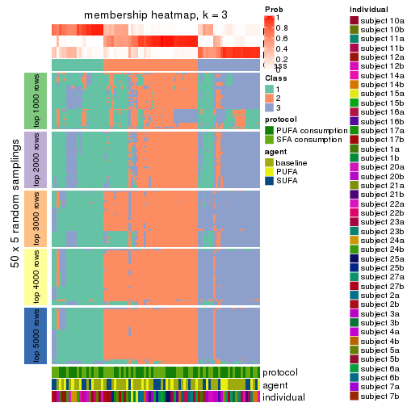</p>

</div>
<div id='tab-CV-pam-membership-heatmap-3'>
<pre><code class="r">membership_heatmap(res, k = 4)
</code></pre>

<p></p>

</div>
<div id='tab-CV-pam-membership-heatmap-4'>
<pre><code class="r">membership_heatmap(res, k = 5)
</code></pre>

<p></p>

</div>
<div id='tab-CV-pam-membership-heatmap-5'>
<pre><code class="r">membership_heatmap(res, k = 6)
</code></pre>

<p></p>

</div>
</div>

As soon as we have had the classes for columns, we can look for signatures
which are significantly different between classes which can be candidate marks
for certain classes. Following are the heatmaps for signatures.


Signature heatmaps where rows are scaled:


<script>
$( function() {
	$( '#tabs-CV-pam-get-signatures' ).tabs();
} );
</script>
<div id='tabs-CV-pam-get-signatures'>
<ul>
<li><a href='#tab-CV-pam-get-signatures-1'>k = 2</a></li>
<li><a href='#tab-CV-pam-get-signatures-2'>k = 3</a></li>
<li><a href='#tab-CV-pam-get-signatures-3'>k = 4</a></li>
<li><a href='#tab-CV-pam-get-signatures-4'>k = 5</a></li>
<li><a href='#tab-CV-pam-get-signatures-5'>k = 6</a></li>
</ul>
<div id='tab-CV-pam-get-signatures-1'>
<pre><code class="r">get_signatures(res, k = 2)
</code></pre>

<p></p>

</div>
<div id='tab-CV-pam-get-signatures-2'>
<pre><code class="r">get_signatures(res, k = 3)
</code></pre>

<p></p>

</div>
<div id='tab-CV-pam-get-signatures-3'>
<pre><code class="r">get_signatures(res, k = 4)
</code></pre>

<p></p>

</div>
<div id='tab-CV-pam-get-signatures-4'>
<pre><code class="r">get_signatures(res, k = 5)
</code></pre>

<p></p>

</div>
<div id='tab-CV-pam-get-signatures-5'>
<pre><code class="r">get_signatures(res, k = 6)
</code></pre>

<p></p>

</div>
</div>


Signature heatmaps where rows are not scaled:


<script>
$( function() {
	$( '#tabs-CV-pam-get-signatures-no-scale' ).tabs();
} );
</script>
<div id='tabs-CV-pam-get-signatures-no-scale'>
<ul>
<li><a href='#tab-CV-pam-get-signatures-no-scale-1'>k = 2</a></li>
<li><a href='#tab-CV-pam-get-signatures-no-scale-2'>k = 3</a></li>
<li><a href='#tab-CV-pam-get-signatures-no-scale-3'>k = 4</a></li>
<li><a href='#tab-CV-pam-get-signatures-no-scale-4'>k = 5</a></li>
<li><a href='#tab-CV-pam-get-signatures-no-scale-5'>k = 6</a></li>
</ul>
<div id='tab-CV-pam-get-signatures-no-scale-1'>
<pre><code class="r">get_signatures(res, k = 2, scale_rows = FALSE)
</code></pre>

<p></p>

</div>
<div id='tab-CV-pam-get-signatures-no-scale-2'>
<pre><code class="r">get_signatures(res, k = 3, scale_rows = FALSE)
</code></pre>

<p></p>

</div>
<div id='tab-CV-pam-get-signatures-no-scale-3'>
<pre><code class="r">get_signatures(res, k = 4, scale_rows = FALSE)
</code></pre>

<p></p>

</div>
<div id='tab-CV-pam-get-signatures-no-scale-4'>
<pre><code class="r">get_signatures(res, k = 5, scale_rows = FALSE)
</code></pre>

<p></p>

</div>
<div id='tab-CV-pam-get-signatures-no-scale-5'>
<pre><code class="r">get_signatures(res, k = 6, scale_rows = FALSE)
</code></pre>

<p></p>

</div>
</div>


Compare the overlap of signatures from different k:

```r
compare_signatures(res)
```


`get_signature()` returns a data frame invisibly. TO get the list of signatures, the function
call should be assigned to a variable explicitly. In following code, if `plot` argument is set
to `FALSE`, no heatmap is plotted while only the differential analysis is performed.

```r
# code only for demonstration
tb = get_signature(res, k = ..., plot = FALSE)
```

An example of the output of `tb` is:

```
#>   which_row         fdr    mean_1    mean_2 scaled_mean_1 scaled_mean_2 km
#> 1        38 0.042760348  8.373488  9.131774    -0.5533452     0.5164555  1
#> 2        40 0.018707592  7.106213  8.469186    -0.6173731     0.5762149  1
#> 3        55 0.019134737 10.221463 11.207825    -0.6159697     0.5749050  1
#> 4        59 0.006059896  5.921854  7.869574    -0.6899429     0.6439467  1
#> 5        60 0.018055526  8.928898 10.211722    -0.6204761     0.5791110  1
#> 6        98 0.009384629 15.714769 14.887706     0.6635654    -0.6193277  2
...
```

The columns in `tb` are:

1. `which_row`: row indices corresponding to the input matrix.
2. `fdr`: FDR for the differential test. 
3. `mean_x`: The mean value in group x.
4. `scaled_mean_x`: The mean value in group x after rows are scaled.
5. `km`: Row groups if k-means clustering is applied to rows.


UMAP plot which shows how samples are separated.


<script>
$( function() {
	$( '#tabs-CV-pam-dimension-reduction' ).tabs();
} );
</script>
<div id='tabs-CV-pam-dimension-reduction'>
<ul>
<li><a href='#tab-CV-pam-dimension-reduction-1'>k = 2</a></li>
<li><a href='#tab-CV-pam-dimension-reduction-2'>k = 3</a></li>
<li><a href='#tab-CV-pam-dimension-reduction-3'>k = 4</a></li>
<li><a href='#tab-CV-pam-dimension-reduction-4'>k = 5</a></li>
<li><a href='#tab-CV-pam-dimension-reduction-5'>k = 6</a></li>
</ul>
<div id='tab-CV-pam-dimension-reduction-1'>
<pre><code class="r">dimension_reduction(res, k = 2, method = &quot;UMAP&quot;)
</code></pre>

<p></p>

</div>
<div id='tab-CV-pam-dimension-reduction-2'>
<pre><code class="r">dimension_reduction(res, k = 3, method = &quot;UMAP&quot;)
</code></pre>

<p></p>

</div>
<div id='tab-CV-pam-dimension-reduction-3'>
<pre><code class="r">dimension_reduction(res, k = 4, method = &quot;UMAP&quot;)
</code></pre>

<p></p>

</div>
<div id='tab-CV-pam-dimension-reduction-4'>
<pre><code class="r">dimension_reduction(res, k = 5, method = &quot;UMAP&quot;)
</code></pre>

<p></p>

</div>
<div id='tab-CV-pam-dimension-reduction-5'>
<pre><code class="r">dimension_reduction(res, k = 6, method = &quot;UMAP&quot;)
</code></pre>

<p></p>

</div>
</div>


Following heatmap shows how subgroups are split when increasing `k`:

```r
collect_classes(res)
```


Test correlation between subgroups and known annotations. If the known
annotation is numeric, one-way ANOVA test is applied, and if the known
annotation is discrete, chi-squared contingency table test is applied.

```r
test_to_known_factors(res)
```

```
#>         n protocol(p) agent(p) individual(p) k
#> CV:pam 69       0.952    0.502      1.38e-02 2
#> CV:pam 60       0.846    0.862      8.09e-04 3
#> CV:pam 39       1.000    0.713      5.36e-02 4
#> CV:pam 70       0.745    0.926      1.03e-06 5
#> CV:pam 66       0.463    0.956      5.30e-09 6
```


If matrix rows can be associated to genes, consider to use `functional_enrichment(res,
...)` to perform function enrichment for the signature genes. See [this vignette](http://bioconductor.org/packages/devel/bioc/vignettes/cola/inst/doc/functional_enrichment.html) for more detailed explanations.


 

---------------------------------------------------


### CV:mclust


The object with results only for a single top-value method and a single partition method 
can be extracted as:

```r
res = res_list["CV", "mclust"]
# you can also extract it by
# res = res_list["CV:mclust"]
```

A summary of `res` and all the functions that can be applied to it:

```r
res
```

```
#> A 'ConsensusPartition' object with k = 2, 3, 4, 5, 6.
#>   On a matrix with 15497 rows and 84 columns.
#>   Top rows (1000, 2000, 3000, 4000, 5000) are extracted by 'CV' method.
#>   Subgroups are detected by 'mclust' method.
#>   Performed in total 1250 partitions by row resampling.
#>   Best k for subgroups seems to be 5.
#> 
#> Following methods can be applied to this 'ConsensusPartition' object:
#>  [1] "cola_report"             "collect_classes"         "collect_plots"          
#>  [4] "collect_stats"           "colnames"                "compare_signatures"     
#>  [7] "consensus_heatmap"       "dimension_reduction"     "functional_enrichment"  
#> [10] "get_anno_col"            "get_anno"                "get_classes"            
#> [13] "get_consensus"           "get_matrix"              "get_membership"         
#> [16] "get_param"               "get_signatures"          "get_stats"              
#> [19] "is_best_k"               "is_stable_k"             "membership_heatmap"     
#> [22] "ncol"                    "nrow"                    "plot_ecdf"              
#> [25] "rownames"                "select_partition_number" "show"                   
#> [28] "suggest_best_k"          "test_to_known_factors"
```

`collect_plots()` function collects all the plots made from `res` for all `k` (number of partitions)
into one single page to provide an easy and fast comparison between different `k`.

```r
collect_plots(res)
```


The plots are:

- The first row: a plot of the ECDF (empirical cumulative distribution
  function) curves of the consensus matrix for each `k` and the heatmap of
  predicted classes for each `k`.
- The second row: heatmaps of the consensus matrix for each `k`.
- The third row: heatmaps of the membership matrix for each `k`.
- The fouth row: heatmaps of the signatures for each `k`.

All the plots in panels can be made by individual functions and they are
plotted later in this section.

`select_partition_number()` produces several plots showing different
statistics for choosing "optimized" `k`. There are following statistics:

- ECDF curves of the consensus matrix for each `k`;
- 1-PAC. [The PAC
  score](https://en.wikipedia.org/wiki/Consensus_clustering#Over-interpretation_potential_of_consensus_clustering)
  measures the proportion of the ambiguous subgrouping.
- Mean silhouette score.
- Concordance. The mean probability of fiting the consensus class ids in all
  partitions.
- Area increased. Denote $A_k$ as the area under the ECDF curve for current
  `k`, the area increased is defined as $A_k - A_{k-1}$.
- Rand index. The percent of pairs of samples that are both in a same cluster
  or both are not in a same cluster in the partition of k and k-1.
- Jaccard index. The ratio of pairs of samples are both in a same cluster in
  the partition of k and k-1 and the pairs of samples are both in a same
  cluster in the partition k or k-1.

The detailed explanations of these statistics can be found in [the _cola_
vignette](http://bioconductor.org/packages/devel/bioc/vignettes/cola/inst/doc/cola.html#toc_13).

Generally speaking, lower PAC score, higher mean silhouette score or higher
concordance corresponds to better partition. Rand index and Jaccard index
measure how similar the current partition is compared to partition with `k-1`.
If they are too similar, we won't accept `k` is better than `k-1`.

```r
select_partition_number(res)
```


The numeric values for all these statistics can be obtained by `get_stats()`.

```r
get_stats(res)
```

```
#>   k 1-PAC mean_silhouette concordance area_increased  Rand Jaccard
#> 2 2 0.485           0.853       0.900         0.4470 0.535   0.535
#> 3 3 0.445           0.655       0.813         0.3543 0.627   0.416
#> 4 4 0.706           0.837       0.864         0.1194 0.768   0.502
#> 5 5 0.770           0.881       0.886         0.1197 0.852   0.590
#> 6 6 0.766           0.706       0.805         0.0578 0.958   0.829
```

`suggest_best_k()` suggests the best $k$ based on these statistics. The rules are as follows:

- All $k$ with Jaccard index larger than 0.95 are removed because increasing
  $k$ does not provide enough extra information. If all $k$ are removed, it is
  marked as no subgroup is detected.
- For all $k$ with 1-PAC score larger than 0.9, the maximal $k$ is taken as
  the best $k$, and other $k$ are marked as optional $k$.
- If it does not fit the second rule. The $k$ with the maximal vote of the
  highest 1-PAC score, highest mean silhouette, and highest concordance is
  taken as the best $k$.

```r
suggest_best_k(res)
```

```
#> [1] 5
```


Following shows the table of the partitions (You need to click the **show/hide
code output** link to see it). The membership matrix (columns with name `p*`)
is inferred by
[`clue::cl_consensus()`](https://www.rdocumentation.org/link/cl_consensus?package=clue)
function with the `SE` method. Basically the value in the membership matrix
represents the probability to belong to a certain group. The finall class
label for an item is determined with the group with highest probability it
belongs to.

In `get_classes()` function, the entropy is calculated from the membership
matrix and the silhouette score is calculated from the consensus matrix.


<script>
$( function() {
	$( '#tabs-CV-mclust-get-classes' ).tabs();
} );
</script>
<div id='tabs-CV-mclust-get-classes'>
<ul>
<li><a href='#tab-CV-mclust-get-classes-1'>k = 2</a></li>
<li><a href='#tab-CV-mclust-get-classes-2'>k = 3</a></li>
<li><a href='#tab-CV-mclust-get-classes-3'>k = 4</a></li>
<li><a href='#tab-CV-mclust-get-classes-4'>k = 5</a></li>
<li><a href='#tab-CV-mclust-get-classes-5'>k = 6</a></li>
</ul>

<div id='tab-CV-mclust-get-classes-1'>
<p><a id='tab-CV-mclust-get-classes-1-a' style='color:#0366d6' href='#'>show/hide code output</a></p>
<pre><code class="r">cbind(get_classes(res, k = 2), get_membership(res, k = 2))
</code></pre>

<pre><code>#&gt;           class entropy silhouette    p1    p2
#&gt; GSM339455     1  0.5294      0.866 0.880 0.120
#&gt; GSM339456     2  0.8861      0.647 0.304 0.696
#&gt; GSM339457     1  0.5408      0.863 0.876 0.124
#&gt; GSM339458     1  0.9988      0.241 0.520 0.480
#&gt; GSM339459     1  0.1843      0.902 0.972 0.028
#&gt; GSM339460     2  0.2236      0.921 0.036 0.964
#&gt; GSM339461     2  0.4815      0.908 0.104 0.896
#&gt; GSM339462     1  0.2778      0.898 0.952 0.048
#&gt; GSM339463     1  0.6438      0.849 0.836 0.164
#&gt; GSM339464     1  0.0376      0.896 0.996 0.004
#&gt; GSM339465     1  0.6438      0.849 0.836 0.164
#&gt; GSM339466     2  0.2236      0.921 0.036 0.964
#&gt; GSM339467     2  0.4298      0.919 0.088 0.912
#&gt; GSM339468     1  0.9795      0.315 0.584 0.416
#&gt; GSM339469     1  0.0376      0.896 0.996 0.004
#&gt; GSM339470     1  0.7528      0.803 0.784 0.216
#&gt; GSM339471     1  0.2043      0.874 0.968 0.032
#&gt; GSM339472     2  0.4022      0.922 0.080 0.920
#&gt; GSM339473     1  0.3733      0.886 0.928 0.072
#&gt; GSM339474     2  0.4161      0.921 0.084 0.916
#&gt; GSM339475     1  0.1843      0.903 0.972 0.028
#&gt; GSM339476     1  0.0376      0.896 0.996 0.004
#&gt; GSM339477     2  0.5737      0.886 0.136 0.864
#&gt; GSM339478     1  0.5519      0.861 0.872 0.128
#&gt; GSM339479     1  0.8267      0.764 0.740 0.260
#&gt; GSM339480     1  0.1843      0.902 0.972 0.028
#&gt; GSM339481     2  0.3879      0.923 0.076 0.924
#&gt; GSM339482     1  0.1843      0.903 0.972 0.028
#&gt; GSM339483     1  0.2778      0.898 0.952 0.048
#&gt; GSM339484     1  0.5946      0.859 0.856 0.144
#&gt; GSM339485     1  0.0376      0.896 0.996 0.004
#&gt; GSM339486     1  0.6623      0.859 0.828 0.172
#&gt; GSM339487     2  0.2043      0.920 0.032 0.968
#&gt; GSM339488     2  0.4022      0.922 0.080 0.920
#&gt; GSM339489     2  0.9850      0.218 0.428 0.572
#&gt; GSM339490     1  0.0376      0.896 0.996 0.004
#&gt; GSM339491     1  0.9000      0.645 0.684 0.316
#&gt; GSM339492     1  0.2236      0.876 0.964 0.036
#&gt; GSM339493     2  0.2423      0.922 0.040 0.960
#&gt; GSM339494     1  0.3733      0.886 0.928 0.072
#&gt; GSM339495     2  0.4161      0.921 0.084 0.916
#&gt; GSM339496     1  0.2948      0.900 0.948 0.052
#&gt; GSM339497     2  0.2043      0.920 0.032 0.968
#&gt; GSM339498     1  0.5737      0.862 0.864 0.136
#&gt; GSM339499     1  0.5294      0.866 0.880 0.120
#&gt; GSM339500     2  0.2043      0.920 0.032 0.968
#&gt; GSM339501     1  0.1184      0.900 0.984 0.016
#&gt; GSM339502     2  0.2043      0.920 0.032 0.968
#&gt; GSM339503     1  0.2043      0.902 0.968 0.032
#&gt; GSM339504     1  0.2778      0.898 0.952 0.048
#&gt; GSM339505     1  0.7453      0.808 0.788 0.212
#&gt; GSM339506     1  0.1184      0.900 0.984 0.016
#&gt; GSM339507     1  0.5946      0.859 0.856 0.144
#&gt; GSM339508     2  0.6531      0.870 0.168 0.832
#&gt; GSM339509     2  0.6247      0.880 0.156 0.844
#&gt; GSM339510     1  0.9866      0.312 0.568 0.432
#&gt; GSM339511     1  0.1843      0.899 0.972 0.028
#&gt; GSM339512     2  0.2043      0.920 0.032 0.968
#&gt; GSM339513     1  0.1414      0.896 0.980 0.020
#&gt; GSM339514     2  0.2423      0.922 0.040 0.960
#&gt; GSM339515     1  0.3733      0.886 0.928 0.072
#&gt; GSM339516     2  0.4022      0.922 0.080 0.920
#&gt; GSM339517     1  0.1843      0.903 0.972 0.028
#&gt; GSM339518     2  0.2043      0.920 0.032 0.968
#&gt; GSM339519     1  0.2043      0.902 0.968 0.032
#&gt; GSM339520     1  0.5519      0.861 0.872 0.128
#&gt; GSM339521     2  0.2043      0.920 0.032 0.968
#&gt; GSM339522     2  0.5519      0.893 0.128 0.872
#&gt; GSM339523     2  0.2043      0.920 0.032 0.968
#&gt; GSM339524     1  0.1843      0.903 0.972 0.028
#&gt; GSM339525     1  0.2778      0.898 0.952 0.048
#&gt; GSM339526     1  0.2043      0.903 0.968 0.032
#&gt; GSM339527     1  0.1184      0.900 0.984 0.016
#&gt; GSM339528     1  0.6531      0.863 0.832 0.168
#&gt; GSM339529     2  0.6531      0.870 0.168 0.832
#&gt; GSM339530     1  0.5408      0.863 0.876 0.124
#&gt; GSM339531     2  0.8813      0.605 0.300 0.700
#&gt; GSM339532     1  0.0672      0.898 0.992 0.008
#&gt; GSM339533     1  0.6438      0.849 0.836 0.164
#&gt; GSM339534     1  0.2423      0.900 0.960 0.040
#&gt; GSM339535     2  0.2043      0.920 0.032 0.968
#&gt; GSM339536     1  0.3733      0.886 0.928 0.072
#&gt; GSM339537     2  0.4022      0.922 0.080 0.920
#&gt; GSM339538     1  0.1843      0.903 0.972 0.028
</code></pre>

<script>
$('#tab-CV-mclust-get-classes-1-a').parent().next().next().hide();
$('#tab-CV-mclust-get-classes-1-a').click(function(){
  $('#tab-CV-mclust-get-classes-1-a').parent().next().next().toggle();
  return(false);
});
</script>
</div>

<div id='tab-CV-mclust-get-classes-2'>
<p><a id='tab-CV-mclust-get-classes-2-a' style='color:#0366d6' href='#'>show/hide code output</a></p>
<pre><code class="r">cbind(get_classes(res, k = 3), get_membership(res, k = 3))
</code></pre>

<pre><code>#&gt;           class entropy silhouette    p1    p2    p3
#&gt; GSM339455     3  0.7389     -0.121 0.032 0.464 0.504
#&gt; GSM339456     2  0.6096      0.646 0.016 0.704 0.280
#&gt; GSM339457     3  0.7394     -0.140 0.032 0.472 0.496
#&gt; GSM339458     2  0.3030      0.799 0.004 0.904 0.092
#&gt; GSM339459     3  0.2339      0.686 0.048 0.012 0.940
#&gt; GSM339460     2  0.0424      0.825 0.000 0.992 0.008
#&gt; GSM339461     2  0.3532      0.806 0.008 0.884 0.108
#&gt; GSM339462     1  0.5012      0.759 0.788 0.008 0.204
#&gt; GSM339463     2  0.8382      0.144 0.084 0.492 0.424
#&gt; GSM339464     1  0.5216      0.735 0.740 0.000 0.260
#&gt; GSM339465     2  0.8820      0.119 0.116 0.476 0.408
#&gt; GSM339466     2  0.0000      0.823 0.000 1.000 0.000
#&gt; GSM339467     2  0.1765      0.828 0.004 0.956 0.040
#&gt; GSM339468     2  0.7230      0.497 0.040 0.616 0.344
#&gt; GSM339469     1  0.5016      0.743 0.760 0.000 0.240
#&gt; GSM339470     2  0.6057      0.490 0.004 0.656 0.340
#&gt; GSM339471     1  0.4796      0.735 0.780 0.000 0.220
#&gt; GSM339472     2  0.2269      0.826 0.016 0.944 0.040
#&gt; GSM339473     1  0.4589      0.727 0.820 0.008 0.172
#&gt; GSM339474     2  0.2383      0.826 0.016 0.940 0.044
#&gt; GSM339475     3  0.1163      0.679 0.028 0.000 0.972
#&gt; GSM339476     1  0.6026      0.709 0.624 0.000 0.376
#&gt; GSM339477     2  0.4749      0.760 0.012 0.816 0.172
#&gt; GSM339478     2  0.6952      0.442 0.024 0.600 0.376
#&gt; GSM339479     2  0.4172      0.750 0.004 0.840 0.156
#&gt; GSM339480     3  0.2599      0.682 0.052 0.016 0.932
#&gt; GSM339481     2  0.1751      0.826 0.012 0.960 0.028
#&gt; GSM339482     3  0.1031      0.688 0.024 0.000 0.976
#&gt; GSM339483     1  0.5012      0.759 0.788 0.008 0.204
#&gt; GSM339484     1  0.6661      0.604 0.588 0.012 0.400
#&gt; GSM339485     1  0.5291      0.735 0.732 0.000 0.268
#&gt; GSM339486     1  0.6180      0.640 0.660 0.008 0.332
#&gt; GSM339487     2  0.0237      0.823 0.004 0.996 0.000
#&gt; GSM339488     2  0.1129      0.828 0.004 0.976 0.020
#&gt; GSM339489     2  0.4121      0.761 0.000 0.832 0.168
#&gt; GSM339490     1  0.4931      0.738 0.768 0.000 0.232
#&gt; GSM339491     2  0.5291      0.633 0.000 0.732 0.268
#&gt; GSM339492     1  0.4974      0.739 0.764 0.000 0.236
#&gt; GSM339493     2  0.0829      0.823 0.012 0.984 0.004
#&gt; GSM339494     1  0.4700      0.731 0.812 0.008 0.180
#&gt; GSM339495     2  0.2383      0.826 0.016 0.940 0.044
#&gt; GSM339496     3  0.0747      0.691 0.016 0.000 0.984
#&gt; GSM339497     2  0.0000      0.823 0.000 1.000 0.000
#&gt; GSM339498     3  0.3356      0.670 0.056 0.036 0.908
#&gt; GSM339499     3  0.7394     -0.140 0.032 0.472 0.496
#&gt; GSM339500     2  0.0000      0.823 0.000 1.000 0.000
#&gt; GSM339501     3  0.4883      0.477 0.208 0.004 0.788
#&gt; GSM339502     2  0.0237      0.823 0.004 0.996 0.000
#&gt; GSM339503     3  0.0747      0.700 0.016 0.000 0.984
#&gt; GSM339504     1  0.5012      0.759 0.788 0.008 0.204
#&gt; GSM339505     2  0.6104      0.480 0.004 0.648 0.348
#&gt; GSM339506     3  0.4834      0.478 0.204 0.004 0.792
#&gt; GSM339507     1  0.9520      0.227 0.416 0.188 0.396
#&gt; GSM339508     2  0.4413      0.790 0.036 0.860 0.104
#&gt; GSM339509     2  0.3445      0.808 0.016 0.896 0.088
#&gt; GSM339510     2  0.6276      0.680 0.040 0.736 0.224
#&gt; GSM339511     1  0.7062      0.710 0.696 0.068 0.236
#&gt; GSM339512     2  0.0000      0.823 0.000 1.000 0.000
#&gt; GSM339513     1  0.6104      0.728 0.648 0.004 0.348
#&gt; GSM339514     2  0.0475      0.825 0.004 0.992 0.004
#&gt; GSM339515     1  0.4645      0.729 0.816 0.008 0.176
#&gt; GSM339516     2  0.2229      0.827 0.012 0.944 0.044
#&gt; GSM339517     3  0.0237      0.701 0.004 0.000 0.996
#&gt; GSM339518     2  0.0000      0.823 0.000 1.000 0.000
#&gt; GSM339519     3  0.0424      0.701 0.008 0.000 0.992
#&gt; GSM339520     2  0.7164      0.244 0.024 0.524 0.452
#&gt; GSM339521     2  0.0000      0.823 0.000 1.000 0.000
#&gt; GSM339522     2  0.3637      0.810 0.024 0.892 0.084
#&gt; GSM339523     2  0.0000      0.823 0.000 1.000 0.000
#&gt; GSM339524     3  0.0000      0.700 0.000 0.000 1.000
#&gt; GSM339525     1  0.5012      0.759 0.788 0.008 0.204
#&gt; GSM339526     3  0.2165      0.645 0.064 0.000 0.936
#&gt; GSM339527     3  0.4465      0.527 0.176 0.004 0.820
#&gt; GSM339528     1  0.5420      0.706 0.752 0.008 0.240
#&gt; GSM339529     2  0.4413      0.790 0.036 0.860 0.104
#&gt; GSM339530     3  0.7186     -0.150 0.024 0.476 0.500
#&gt; GSM339531     2  0.4755      0.747 0.008 0.808 0.184
#&gt; GSM339532     1  0.5315      0.739 0.772 0.012 0.216
#&gt; GSM339533     2  0.8113      0.171 0.068 0.504 0.428
#&gt; GSM339534     1  0.6673      0.728 0.636 0.020 0.344
#&gt; GSM339535     2  0.0000      0.823 0.000 1.000 0.000
#&gt; GSM339536     1  0.4700      0.731 0.812 0.008 0.180
#&gt; GSM339537     2  0.2269      0.826 0.016 0.944 0.040
#&gt; GSM339538     3  0.0424      0.700 0.008 0.000 0.992
</code></pre>

<script>
$('#tab-CV-mclust-get-classes-2-a').parent().next().next().hide();
$('#tab-CV-mclust-get-classes-2-a').click(function(){
  $('#tab-CV-mclust-get-classes-2-a').parent().next().next().toggle();
  return(false);
});
</script>
</div>

<div id='tab-CV-mclust-get-classes-3'>
<p><a id='tab-CV-mclust-get-classes-3-a' style='color:#0366d6' href='#'>show/hide code output</a></p>
<pre><code class="r">cbind(get_classes(res, k = 4), get_membership(res, k = 4))
</code></pre>

<pre><code>#&gt;           class entropy silhouette    p1    p2    p3    p4
#&gt; GSM339455     3  0.4814      0.783 0.172 0.004 0.776 0.048
#&gt; GSM339456     2  0.4343      0.883 0.040 0.844 0.060 0.056
#&gt; GSM339457     3  0.4573      0.783 0.124 0.024 0.816 0.036
#&gt; GSM339458     2  0.0524      0.947 0.008 0.988 0.004 0.000
#&gt; GSM339459     3  0.2207      0.790 0.012 0.004 0.928 0.056
#&gt; GSM339460     2  0.0188      0.949 0.000 0.996 0.000 0.004
#&gt; GSM339461     2  0.2505      0.942 0.036 0.920 0.004 0.040
#&gt; GSM339462     4  0.2222      0.912 0.060 0.000 0.016 0.924
#&gt; GSM339463     3  0.5021      0.756 0.180 0.064 0.756 0.000
#&gt; GSM339464     4  0.2125      0.906 0.004 0.000 0.076 0.920
#&gt; GSM339465     3  0.4690      0.723 0.260 0.016 0.724 0.000
#&gt; GSM339466     2  0.1356      0.947 0.032 0.960 0.000 0.008
#&gt; GSM339467     2  0.0712      0.951 0.004 0.984 0.008 0.004
#&gt; GSM339468     3  0.7470      0.401 0.036 0.360 0.520 0.084
#&gt; GSM339469     4  0.1890      0.916 0.008 0.000 0.056 0.936
#&gt; GSM339470     3  0.5417      0.638 0.040 0.284 0.676 0.000
#&gt; GSM339471     1  0.4188      0.841 0.824 0.000 0.112 0.064
#&gt; GSM339472     2  0.1489      0.947 0.004 0.952 0.000 0.044
#&gt; GSM339473     1  0.2945      0.880 0.904 0.012 0.052 0.032
#&gt; GSM339474     2  0.1489      0.947 0.004 0.952 0.000 0.044
#&gt; GSM339475     3  0.0592      0.792 0.016 0.000 0.984 0.000
#&gt; GSM339476     3  0.5257      0.756 0.144 0.000 0.752 0.104
#&gt; GSM339477     2  0.2170      0.942 0.012 0.936 0.016 0.036
#&gt; GSM339478     3  0.5908      0.725 0.084 0.136 0.744 0.036
#&gt; GSM339479     2  0.1356      0.937 0.008 0.960 0.032 0.000
#&gt; GSM339480     3  0.2186      0.789 0.012 0.008 0.932 0.048
#&gt; GSM339481     2  0.1211      0.949 0.000 0.960 0.000 0.040
#&gt; GSM339482     3  0.1510      0.790 0.016 0.000 0.956 0.028
#&gt; GSM339483     4  0.2222      0.912 0.060 0.000 0.016 0.924
#&gt; GSM339484     3  0.5795      0.717 0.212 0.048 0.716 0.024
#&gt; GSM339485     4  0.2125      0.906 0.004 0.000 0.076 0.920
#&gt; GSM339486     3  0.5718      0.567 0.344 0.012 0.624 0.020
#&gt; GSM339487     2  0.1452      0.947 0.036 0.956 0.000 0.008
#&gt; GSM339488     2  0.0376      0.950 0.004 0.992 0.004 0.000
#&gt; GSM339489     2  0.3410      0.925 0.036 0.888 0.032 0.044
#&gt; GSM339490     4  0.1890      0.916 0.008 0.000 0.056 0.936
#&gt; GSM339491     3  0.5828      0.589 0.036 0.316 0.640 0.008
#&gt; GSM339492     1  0.4336      0.837 0.812 0.000 0.128 0.060
#&gt; GSM339493     2  0.1724      0.947 0.032 0.948 0.000 0.020
#&gt; GSM339494     1  0.2945      0.880 0.904 0.012 0.052 0.032
#&gt; GSM339495     2  0.1635      0.946 0.008 0.948 0.000 0.044
#&gt; GSM339496     3  0.1576      0.793 0.048 0.000 0.948 0.004
#&gt; GSM339497     2  0.0817      0.948 0.024 0.976 0.000 0.000
#&gt; GSM339498     3  0.3657      0.788 0.016 0.024 0.864 0.096
#&gt; GSM339499     3  0.4672      0.782 0.124 0.028 0.812 0.036
#&gt; GSM339500     2  0.1022      0.945 0.032 0.968 0.000 0.000
#&gt; GSM339501     3  0.4313      0.699 0.004 0.000 0.736 0.260
#&gt; GSM339502     2  0.0188      0.948 0.004 0.996 0.000 0.000
#&gt; GSM339503     3  0.2300      0.788 0.016 0.000 0.920 0.064
#&gt; GSM339504     4  0.2222      0.912 0.060 0.000 0.016 0.924
#&gt; GSM339505     3  0.5137      0.681 0.040 0.244 0.716 0.000
#&gt; GSM339506     3  0.4535      0.673 0.000 0.004 0.704 0.292
#&gt; GSM339507     3  0.5658      0.725 0.208 0.048 0.724 0.020
#&gt; GSM339508     2  0.3641      0.889 0.008 0.868 0.052 0.072
#&gt; GSM339509     2  0.3272      0.904 0.004 0.884 0.052 0.060
#&gt; GSM339510     2  0.5109      0.831 0.036 0.800 0.080 0.084
#&gt; GSM339511     4  0.3828      0.832 0.000 0.084 0.068 0.848
#&gt; GSM339512     2  0.1118      0.945 0.036 0.964 0.000 0.000
#&gt; GSM339513     1  0.6058      0.486 0.604 0.000 0.336 0.060
#&gt; GSM339514     2  0.0376      0.950 0.004 0.992 0.004 0.000
#&gt; GSM339515     1  0.2945      0.880 0.904 0.012 0.052 0.032
#&gt; GSM339516     2  0.1635      0.948 0.008 0.948 0.000 0.044
#&gt; GSM339517     3  0.0937      0.792 0.012 0.000 0.976 0.012
#&gt; GSM339518     2  0.0000      0.948 0.000 1.000 0.000 0.000
#&gt; GSM339519     3  0.1854      0.790 0.012 0.000 0.940 0.048
#&gt; GSM339520     3  0.5174      0.764 0.088 0.080 0.796 0.036
#&gt; GSM339521     2  0.0707      0.949 0.020 0.980 0.000 0.000
#&gt; GSM339522     2  0.3116      0.933 0.032 0.900 0.024 0.044
#&gt; GSM339523     2  0.0000      0.948 0.000 1.000 0.000 0.000
#&gt; GSM339524     3  0.1635      0.790 0.008 0.000 0.948 0.044
#&gt; GSM339525     4  0.2837      0.895 0.068 0.012 0.016 0.904
#&gt; GSM339526     3  0.3084      0.793 0.064 0.012 0.896 0.028
#&gt; GSM339527     3  0.4164      0.703 0.000 0.000 0.736 0.264
#&gt; GSM339528     3  0.5993      0.528 0.344 0.012 0.612 0.032
#&gt; GSM339529     2  0.3769      0.885 0.012 0.864 0.052 0.072
#&gt; GSM339530     3  0.4859      0.781 0.124 0.036 0.804 0.036
#&gt; GSM339531     2  0.3843      0.900 0.036 0.868 0.056 0.040
#&gt; GSM339532     4  0.2300      0.914 0.000 0.028 0.048 0.924
#&gt; GSM339533     3  0.4636      0.773 0.140 0.068 0.792 0.000
#&gt; GSM339534     3  0.5259      0.744 0.164 0.032 0.768 0.036
#&gt; GSM339535     2  0.0469      0.949 0.012 0.988 0.000 0.000
#&gt; GSM339536     1  0.2945      0.880 0.904 0.012 0.052 0.032
#&gt; GSM339537     2  0.1489      0.947 0.004 0.952 0.000 0.044
#&gt; GSM339538     3  0.0804      0.792 0.012 0.000 0.980 0.008
</code></pre>

<script>
$('#tab-CV-mclust-get-classes-3-a').parent().next().next().hide();
$('#tab-CV-mclust-get-classes-3-a').click(function(){
  $('#tab-CV-mclust-get-classes-3-a').parent().next().next().toggle();
  return(false);
});
</script>
</div>

<div id='tab-CV-mclust-get-classes-4'>
<p><a id='tab-CV-mclust-get-classes-4-a' style='color:#0366d6' href='#'>show/hide code output</a></p>
<pre><code class="r">cbind(get_classes(res, k = 5), get_membership(res, k = 5))
</code></pre>

<pre><code>#&gt;           class entropy silhouette    p1    p2    p3    p4    p5
#&gt; GSM339455     3  0.4899      0.768 0.088 0.008 0.776 0.036 0.092
#&gt; GSM339456     2  0.2729      0.854 0.000 0.884 0.000 0.056 0.060
#&gt; GSM339457     3  0.0703      0.856 0.000 0.000 0.976 0.000 0.024
#&gt; GSM339458     2  0.2877      0.870 0.004 0.848 0.144 0.000 0.004
#&gt; GSM339459     5  0.1764      0.924 0.000 0.000 0.008 0.064 0.928
#&gt; GSM339460     2  0.1341      0.895 0.000 0.944 0.056 0.000 0.000
#&gt; GSM339461     2  0.1403      0.890 0.000 0.952 0.000 0.024 0.024
#&gt; GSM339462     4  0.2131      0.915 0.056 0.008 0.000 0.920 0.016
#&gt; GSM339463     3  0.4735      0.764 0.196 0.036 0.740 0.000 0.028
#&gt; GSM339464     4  0.1872      0.934 0.000 0.000 0.020 0.928 0.052
#&gt; GSM339465     3  0.4867      0.674 0.260 0.020 0.692 0.000 0.028
#&gt; GSM339466     2  0.1732      0.892 0.000 0.920 0.080 0.000 0.000
#&gt; GSM339467     2  0.2877      0.874 0.004 0.848 0.144 0.000 0.004
#&gt; GSM339468     2  0.3234      0.817 0.000 0.852 0.000 0.064 0.084
#&gt; GSM339469     4  0.1484      0.934 0.000 0.000 0.008 0.944 0.048
#&gt; GSM339470     3  0.3308      0.804 0.004 0.144 0.832 0.000 0.020
#&gt; GSM339471     1  0.2727      0.899 0.888 0.000 0.020 0.012 0.080
#&gt; GSM339472     2  0.1469      0.889 0.000 0.948 0.000 0.016 0.036
#&gt; GSM339473     1  0.0880      0.914 0.968 0.000 0.000 0.032 0.000
#&gt; GSM339474     2  0.1386      0.890 0.000 0.952 0.000 0.016 0.032
#&gt; GSM339475     5  0.2011      0.927 0.044 0.000 0.020 0.008 0.928
#&gt; GSM339476     1  0.5137      0.757 0.724 0.000 0.016 0.152 0.108
#&gt; GSM339477     2  0.1668      0.888 0.000 0.940 0.000 0.032 0.028
#&gt; GSM339478     3  0.0771      0.855 0.000 0.004 0.976 0.000 0.020
#&gt; GSM339479     2  0.2877      0.870 0.004 0.848 0.144 0.000 0.004
#&gt; GSM339480     5  0.1764      0.924 0.000 0.000 0.008 0.064 0.928
#&gt; GSM339481     2  0.1106      0.892 0.000 0.964 0.000 0.012 0.024
#&gt; GSM339482     5  0.1682      0.929 0.044 0.000 0.012 0.004 0.940
#&gt; GSM339483     4  0.2131      0.915 0.056 0.008 0.000 0.920 0.016
#&gt; GSM339484     1  0.1399      0.908 0.952 0.020 0.000 0.000 0.028
#&gt; GSM339485     4  0.1872      0.934 0.000 0.000 0.020 0.928 0.052
#&gt; GSM339486     1  0.1082      0.915 0.964 0.000 0.008 0.000 0.028
#&gt; GSM339487     2  0.0880      0.897 0.000 0.968 0.032 0.000 0.000
#&gt; GSM339488     2  0.2719      0.872 0.004 0.852 0.144 0.000 0.000
#&gt; GSM339489     2  0.2372      0.893 0.016 0.920 0.028 0.028 0.008
#&gt; GSM339490     4  0.1557      0.934 0.000 0.000 0.008 0.940 0.052
#&gt; GSM339491     3  0.4342      0.750 0.024 0.188 0.764 0.000 0.024
#&gt; GSM339492     1  0.2727      0.899 0.888 0.000 0.020 0.012 0.080
#&gt; GSM339493     2  0.1267      0.893 0.004 0.960 0.000 0.012 0.024
#&gt; GSM339494     1  0.1041      0.915 0.964 0.000 0.000 0.032 0.004
#&gt; GSM339495     2  0.1485      0.890 0.000 0.948 0.000 0.020 0.032
#&gt; GSM339496     5  0.3885      0.763 0.040 0.000 0.176 0.000 0.784
#&gt; GSM339497     2  0.2629      0.876 0.004 0.860 0.136 0.000 0.000
#&gt; GSM339498     5  0.2869      0.899 0.008 0.036 0.004 0.064 0.888
#&gt; GSM339499     3  0.0703      0.856 0.000 0.000 0.976 0.000 0.024
#&gt; GSM339500     2  0.2516      0.875 0.000 0.860 0.140 0.000 0.000
#&gt; GSM339501     4  0.2575      0.922 0.004 0.000 0.012 0.884 0.100
#&gt; GSM339502     2  0.2719      0.872 0.004 0.852 0.144 0.000 0.000
#&gt; GSM339503     5  0.1547      0.941 0.016 0.000 0.004 0.032 0.948
#&gt; GSM339504     4  0.2131      0.915 0.056 0.008 0.000 0.920 0.016
#&gt; GSM339505     3  0.3308      0.804 0.004 0.144 0.832 0.000 0.020
#&gt; GSM339506     4  0.2589      0.925 0.008 0.000 0.012 0.888 0.092
#&gt; GSM339507     1  0.2599      0.880 0.904 0.024 0.044 0.000 0.028
#&gt; GSM339508     2  0.3188      0.839 0.000 0.860 0.100 0.028 0.012
#&gt; GSM339509     2  0.4273      0.811 0.000 0.732 0.240 0.020 0.008
#&gt; GSM339510     2  0.2856      0.863 0.032 0.892 0.000 0.044 0.032
#&gt; GSM339511     4  0.3423      0.882 0.000 0.068 0.016 0.856 0.060
#&gt; GSM339512     2  0.2833      0.875 0.004 0.852 0.140 0.004 0.000
#&gt; GSM339513     1  0.2629      0.889 0.880 0.000 0.004 0.012 0.104
#&gt; GSM339514     2  0.2719      0.872 0.004 0.852 0.144 0.000 0.000
#&gt; GSM339515     1  0.0880      0.914 0.968 0.000 0.000 0.032 0.000
#&gt; GSM339516     2  0.1195      0.891 0.000 0.960 0.000 0.012 0.028
#&gt; GSM339517     5  0.1806      0.941 0.016 0.000 0.016 0.028 0.940
#&gt; GSM339518     2  0.2629      0.876 0.004 0.860 0.136 0.000 0.000
#&gt; GSM339519     5  0.1710      0.940 0.016 0.000 0.004 0.040 0.940
#&gt; GSM339520     3  0.0703      0.856 0.000 0.000 0.976 0.000 0.024
#&gt; GSM339521     2  0.0880      0.897 0.000 0.968 0.032 0.000 0.000
#&gt; GSM339522     2  0.1653      0.888 0.000 0.944 0.004 0.028 0.024
#&gt; GSM339523     2  0.2516      0.876 0.000 0.860 0.140 0.000 0.000
#&gt; GSM339524     5  0.1630      0.941 0.016 0.000 0.004 0.036 0.944
#&gt; GSM339525     4  0.2199      0.912 0.060 0.008 0.000 0.916 0.016
#&gt; GSM339526     5  0.2859      0.894 0.096 0.000 0.016 0.012 0.876
#&gt; GSM339527     4  0.2520      0.924 0.004 0.000 0.012 0.888 0.096
#&gt; GSM339528     1  0.1243      0.916 0.960 0.000 0.008 0.004 0.028
#&gt; GSM339529     2  0.3188      0.839 0.000 0.860 0.100 0.028 0.012
#&gt; GSM339530     3  0.0703      0.856 0.000 0.000 0.976 0.000 0.024
#&gt; GSM339531     2  0.2362      0.872 0.028 0.916 0.000 0.032 0.024
#&gt; GSM339532     4  0.1956      0.934 0.000 0.012 0.008 0.928 0.052
#&gt; GSM339533     3  0.4293      0.804 0.156 0.032 0.784 0.000 0.028
#&gt; GSM339534     1  0.2604      0.903 0.896 0.020 0.012 0.000 0.072
#&gt; GSM339535     2  0.2674      0.873 0.004 0.856 0.140 0.000 0.000
#&gt; GSM339536     1  0.0880      0.914 0.968 0.000 0.000 0.032 0.000
#&gt; GSM339537     2  0.1300      0.890 0.000 0.956 0.000 0.016 0.028
#&gt; GSM339538     5  0.1701      0.941 0.016 0.000 0.012 0.028 0.944
</code></pre>

<script>
$('#tab-CV-mclust-get-classes-4-a').parent().next().next().hide();
$('#tab-CV-mclust-get-classes-4-a').click(function(){
  $('#tab-CV-mclust-get-classes-4-a').parent().next().next().toggle();
  return(false);
});
</script>
</div>

<div id='tab-CV-mclust-get-classes-5'>
<p><a id='tab-CV-mclust-get-classes-5-a' style='color:#0366d6' href='#'>show/hide code output</a></p>
<pre><code class="r">cbind(get_classes(res, k = 6), get_membership(res, k = 6))
</code></pre>

<pre><code>#&gt;           class entropy silhouette    p1    p2    p3    p4    p5    p6
#&gt; GSM339455     6  0.5659     0.0794 0.072 0.000 0.400 0.032 0.000 0.496
#&gt; GSM339456     2  0.3926     0.6013 0.000 0.796 0.024 0.080 0.100 0.000
#&gt; GSM339457     6  0.0260     0.8133 0.000 0.000 0.008 0.000 0.000 0.992
#&gt; GSM339458     2  0.3979     0.3701 0.000 0.628 0.000 0.000 0.360 0.012
#&gt; GSM339459     3  0.4512     0.7311 0.000 0.000 0.708 0.096 0.192 0.004
#&gt; GSM339460     2  0.3221     0.5738 0.000 0.736 0.000 0.000 0.264 0.000
#&gt; GSM339461     2  0.1708     0.7033 0.000 0.932 0.004 0.024 0.040 0.000
#&gt; GSM339462     4  0.2372     0.8005 0.036 0.000 0.024 0.908 0.024 0.008
#&gt; GSM339463     6  0.4878     0.7075 0.156 0.024 0.092 0.000 0.008 0.720
#&gt; GSM339464     4  0.0146     0.8077 0.000 0.000 0.004 0.996 0.000 0.000
#&gt; GSM339465     6  0.5798     0.4728 0.312 0.004 0.144 0.000 0.008 0.532
#&gt; GSM339466     2  0.3271     0.5995 0.000 0.760 0.000 0.000 0.232 0.008
#&gt; GSM339467     5  0.4049     0.9632 0.000 0.256 0.000 0.004 0.708 0.032
#&gt; GSM339468     2  0.5310     0.4571 0.000 0.668 0.044 0.100 0.188 0.000
#&gt; GSM339469     4  0.0458     0.8053 0.000 0.000 0.016 0.984 0.000 0.000
#&gt; GSM339470     6  0.3045     0.7329 0.000 0.060 0.000 0.000 0.100 0.840
#&gt; GSM339471     1  0.2425     0.9102 0.884 0.000 0.088 0.000 0.004 0.024
#&gt; GSM339472     2  0.0405     0.7139 0.000 0.988 0.004 0.000 0.008 0.000
#&gt; GSM339473     1  0.0260     0.9380 0.992 0.000 0.000 0.000 0.008 0.000
#&gt; GSM339474     2  0.0713     0.7075 0.000 0.972 0.000 0.000 0.028 0.000
#&gt; GSM339475     3  0.1616     0.8351 0.028 0.000 0.940 0.012 0.000 0.020
#&gt; GSM339476     1  0.3782     0.8432 0.808 0.000 0.080 0.088 0.000 0.024
#&gt; GSM339477     2  0.2007     0.7024 0.000 0.916 0.004 0.036 0.044 0.000
#&gt; GSM339478     6  0.0520     0.8128 0.000 0.000 0.008 0.000 0.008 0.984
#&gt; GSM339479     2  0.4102     0.3730 0.000 0.628 0.004 0.000 0.356 0.012
#&gt; GSM339480     3  0.4556     0.7269 0.000 0.000 0.704 0.100 0.192 0.004
#&gt; GSM339481     2  0.1007     0.7118 0.000 0.956 0.000 0.000 0.044 0.000
#&gt; GSM339482     3  0.1649     0.8611 0.032 0.000 0.932 0.036 0.000 0.000
#&gt; GSM339483     4  0.2372     0.8005 0.036 0.000 0.024 0.908 0.024 0.008
#&gt; GSM339484     1  0.0551     0.9362 0.984 0.004 0.004 0.000 0.008 0.000
#&gt; GSM339485     4  0.0146     0.8077 0.000 0.000 0.004 0.996 0.000 0.000
#&gt; GSM339486     1  0.0551     0.9366 0.984 0.000 0.004 0.000 0.004 0.008
#&gt; GSM339487     2  0.2805     0.6431 0.000 0.812 0.000 0.000 0.184 0.004
#&gt; GSM339488     5  0.4071     0.9616 0.000 0.248 0.000 0.004 0.712 0.036
#&gt; GSM339489     2  0.2144     0.7120 0.000 0.908 0.000 0.040 0.048 0.004
#&gt; GSM339490     4  0.0260     0.8073 0.000 0.000 0.008 0.992 0.000 0.000
#&gt; GSM339491     6  0.3616     0.6774 0.000 0.076 0.000 0.000 0.132 0.792
#&gt; GSM339492     1  0.2476     0.9080 0.880 0.000 0.092 0.000 0.004 0.024
#&gt; GSM339493     2  0.0260     0.7150 0.000 0.992 0.000 0.000 0.008 0.000
#&gt; GSM339494     1  0.0260     0.9380 0.992 0.000 0.000 0.000 0.008 0.000
#&gt; GSM339495     2  0.0790     0.7065 0.000 0.968 0.000 0.000 0.032 0.000
#&gt; GSM339496     3  0.5011     0.5122 0.036 0.000 0.632 0.040 0.000 0.292
#&gt; GSM339497     2  0.3729     0.5078 0.000 0.692 0.000 0.000 0.296 0.012
#&gt; GSM339498     3  0.4876     0.6952 0.000 0.020 0.688 0.088 0.204 0.000
#&gt; GSM339499     6  0.0405     0.8131 0.000 0.000 0.008 0.004 0.000 0.988
#&gt; GSM339500     2  0.3905     0.4667 0.000 0.668 0.000 0.000 0.316 0.016
#&gt; GSM339501     4  0.5781     0.0109 0.000 0.000 0.396 0.428 0.176 0.000
#&gt; GSM339502     5  0.3711     0.9606 0.000 0.260 0.000 0.000 0.720 0.020
#&gt; GSM339503     3  0.1624     0.8559 0.008 0.000 0.936 0.044 0.012 0.000
#&gt; GSM339504     4  0.2372     0.8005 0.036 0.000 0.024 0.908 0.024 0.008
#&gt; GSM339505     6  0.2948     0.7398 0.000 0.060 0.000 0.000 0.092 0.848
#&gt; GSM339506     4  0.5829     0.0467 0.000 0.000 0.380 0.432 0.188 0.000
#&gt; GSM339507     1  0.1836     0.9056 0.928 0.012 0.004 0.000 0.008 0.048
#&gt; GSM339508     2  0.2929     0.6785 0.000 0.868 0.008 0.040 0.008 0.076
#&gt; GSM339509     2  0.5951    -0.1576 0.000 0.472 0.008 0.016 0.396 0.108
#&gt; GSM339510     2  0.4142     0.5478 0.000 0.752 0.008 0.072 0.168 0.000
#&gt; GSM339511     4  0.2252     0.7606 0.000 0.072 0.016 0.900 0.012 0.000
#&gt; GSM339512     2  0.3969     0.4643 0.000 0.668 0.000 0.000 0.312 0.020
#&gt; GSM339513     1  0.2457     0.8853 0.880 0.000 0.084 0.036 0.000 0.000
#&gt; GSM339514     5  0.3888     0.9651 0.000 0.252 0.000 0.000 0.716 0.032
#&gt; GSM339515     1  0.0260     0.9380 0.992 0.000 0.000 0.000 0.008 0.000
#&gt; GSM339516     2  0.0000     0.7142 0.000 1.000 0.000 0.000 0.000 0.000
#&gt; GSM339517     3  0.1780     0.8610 0.028 0.000 0.924 0.048 0.000 0.000
#&gt; GSM339518     2  0.3871     0.4825 0.000 0.676 0.000 0.000 0.308 0.016
#&gt; GSM339519     3  0.1511     0.8589 0.012 0.000 0.940 0.044 0.000 0.004
#&gt; GSM339520     6  0.0405     0.8134 0.000 0.000 0.008 0.000 0.004 0.988
#&gt; GSM339521     2  0.3050     0.6042 0.000 0.764 0.000 0.000 0.236 0.000
#&gt; GSM339522     2  0.1922     0.7129 0.000 0.924 0.012 0.040 0.024 0.000
#&gt; GSM339523     5  0.3816     0.9095 0.000 0.296 0.000 0.000 0.688 0.016
#&gt; GSM339524     3  0.1572     0.8615 0.028 0.000 0.936 0.036 0.000 0.000
#&gt; GSM339525     4  0.2272     0.7996 0.040 0.000 0.016 0.912 0.024 0.008
#&gt; GSM339526     3  0.2358     0.8093 0.108 0.000 0.876 0.000 0.000 0.016
#&gt; GSM339527     4  0.5848     0.0390 0.000 0.000 0.380 0.428 0.192 0.000
#&gt; GSM339528     1  0.0405     0.9372 0.988 0.000 0.004 0.000 0.000 0.008
#&gt; GSM339529     2  0.3191     0.6783 0.000 0.856 0.008 0.036 0.020 0.080
#&gt; GSM339530     6  0.0260     0.8133 0.000 0.000 0.008 0.000 0.000 0.992
#&gt; GSM339531     2  0.3314     0.6322 0.000 0.828 0.008 0.052 0.112 0.000
#&gt; GSM339532     4  0.1059     0.8035 0.000 0.016 0.016 0.964 0.004 0.000
#&gt; GSM339533     6  0.3490     0.7622 0.152 0.024 0.008 0.000 0.008 0.808
#&gt; GSM339534     1  0.2731     0.9069 0.892 0.008 0.044 0.036 0.008 0.012
#&gt; GSM339535     2  0.3986     0.4552 0.000 0.664 0.000 0.000 0.316 0.020
#&gt; GSM339536     1  0.0260     0.9380 0.992 0.000 0.000 0.000 0.008 0.000
#&gt; GSM339537     2  0.0363     0.7126 0.000 0.988 0.000 0.000 0.012 0.000
#&gt; GSM339538     3  0.1780     0.8610 0.028 0.000 0.924 0.048 0.000 0.000
</code></pre>

<script>
$('#tab-CV-mclust-get-classes-5-a').parent().next().next().hide();
$('#tab-CV-mclust-get-classes-5-a').click(function(){
  $('#tab-CV-mclust-get-classes-5-a').parent().next().next().toggle();
  return(false);
});
</script>
</div>
</div>

Heatmaps for the consensus matrix. It visualizes the probability of two
samples to be in a same group.


<script>
$( function() {
	$( '#tabs-CV-mclust-consensus-heatmap' ).tabs();
} );
</script>
<div id='tabs-CV-mclust-consensus-heatmap'>
<ul>
<li><a href='#tab-CV-mclust-consensus-heatmap-1'>k = 2</a></li>
<li><a href='#tab-CV-mclust-consensus-heatmap-2'>k = 3</a></li>
<li><a href='#tab-CV-mclust-consensus-heatmap-3'>k = 4</a></li>
<li><a href='#tab-CV-mclust-consensus-heatmap-4'>k = 5</a></li>
<li><a href='#tab-CV-mclust-consensus-heatmap-5'>k = 6</a></li>
</ul>
<div id='tab-CV-mclust-consensus-heatmap-1'>
<pre><code class="r">consensus_heatmap(res, k = 2)
</code></pre>

<p></p>

</div>
<div id='tab-CV-mclust-consensus-heatmap-2'>
<pre><code class="r">consensus_heatmap(res, k = 3)
</code></pre>

<p></p>

</div>
<div id='tab-CV-mclust-consensus-heatmap-3'>
<pre><code class="r">consensus_heatmap(res, k = 4)
</code></pre>

<p></p>

</div>
<div id='tab-CV-mclust-consensus-heatmap-4'>
<pre><code class="r">consensus_heatmap(res, k = 5)
</code></pre>

<p></p>

</div>
<div id='tab-CV-mclust-consensus-heatmap-5'>
<pre><code class="r">consensus_heatmap(res, k = 6)
</code></pre>

<p></p>

</div>
</div>

Heatmaps for the membership of samples in all partitions to see how consistent they are:


<script>
$( function() {
	$( '#tabs-CV-mclust-membership-heatmap' ).tabs();
} );
</script>
<div id='tabs-CV-mclust-membership-heatmap'>
<ul>
<li><a href='#tab-CV-mclust-membership-heatmap-1'>k = 2</a></li>
<li><a href='#tab-CV-mclust-membership-heatmap-2'>k = 3</a></li>
<li><a href='#tab-CV-mclust-membership-heatmap-3'>k = 4</a></li>
<li><a href='#tab-CV-mclust-membership-heatmap-4'>k = 5</a></li>
<li><a href='#tab-CV-mclust-membership-heatmap-5'>k = 6</a></li>
</ul>
<div id='tab-CV-mclust-membership-heatmap-1'>
<pre><code class="r">membership_heatmap(res, k = 2)
</code></pre>

<p></p>

</div>
<div id='tab-CV-mclust-membership-heatmap-2'>
<pre><code class="r">membership_heatmap(res, k = 3)
</code></pre>

<p></p>

</div>
<div id='tab-CV-mclust-membership-heatmap-3'>
<pre><code class="r">membership_heatmap(res, k = 4)
</code></pre>

<p></p>

</div>
<div id='tab-CV-mclust-membership-heatmap-4'>
<pre><code class="r">membership_heatmap(res, k = 5)
</code></pre>

<p></p>

</div>
<div id='tab-CV-mclust-membership-heatmap-5'>
<pre><code class="r">membership_heatmap(res, k = 6)
</code></pre>

<p>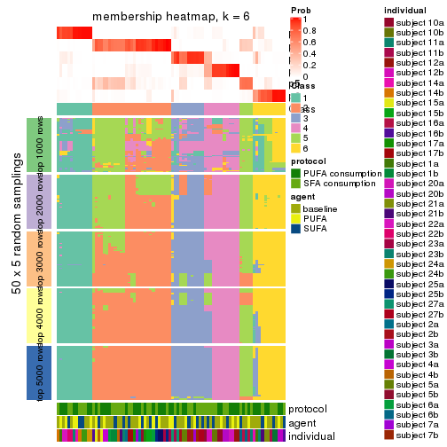</p>

</div>
</div>

As soon as we have had the classes for columns, we can look for signatures
which are significantly different between classes which can be candidate marks
for certain classes. Following are the heatmaps for signatures.


Signature heatmaps where rows are scaled:


<script>
$( function() {
	$( '#tabs-CV-mclust-get-signatures' ).tabs();
} );
</script>
<div id='tabs-CV-mclust-get-signatures'>
<ul>
<li><a href='#tab-CV-mclust-get-signatures-1'>k = 2</a></li>
<li><a href='#tab-CV-mclust-get-signatures-2'>k = 3</a></li>
<li><a href='#tab-CV-mclust-get-signatures-3'>k = 4</a></li>
<li><a href='#tab-CV-mclust-get-signatures-4'>k = 5</a></li>
<li><a href='#tab-CV-mclust-get-signatures-5'>k = 6</a></li>
</ul>
<div id='tab-CV-mclust-get-signatures-1'>
<pre><code class="r">get_signatures(res, k = 2)
</code></pre>

<p></p>

</div>
<div id='tab-CV-mclust-get-signatures-2'>
<pre><code class="r">get_signatures(res, k = 3)
</code></pre>

<p></p>

</div>
<div id='tab-CV-mclust-get-signatures-3'>
<pre><code class="r">get_signatures(res, k = 4)
</code></pre>

<p></p>

</div>
<div id='tab-CV-mclust-get-signatures-4'>
<pre><code class="r">get_signatures(res, k = 5)
</code></pre>

<p></p>

</div>
<div id='tab-CV-mclust-get-signatures-5'>
<pre><code class="r">get_signatures(res, k = 6)
</code></pre>

<p></p>

</div>
</div>


Signature heatmaps where rows are not scaled:


<script>
$( function() {
	$( '#tabs-CV-mclust-get-signatures-no-scale' ).tabs();
} );
</script>
<div id='tabs-CV-mclust-get-signatures-no-scale'>
<ul>
<li><a href='#tab-CV-mclust-get-signatures-no-scale-1'>k = 2</a></li>
<li><a href='#tab-CV-mclust-get-signatures-no-scale-2'>k = 3</a></li>
<li><a href='#tab-CV-mclust-get-signatures-no-scale-3'>k = 4</a></li>
<li><a href='#tab-CV-mclust-get-signatures-no-scale-4'>k = 5</a></li>
<li><a href='#tab-CV-mclust-get-signatures-no-scale-5'>k = 6</a></li>
</ul>
<div id='tab-CV-mclust-get-signatures-no-scale-1'>
<pre><code class="r">get_signatures(res, k = 2, scale_rows = FALSE)
</code></pre>

<p></p>

</div>
<div id='tab-CV-mclust-get-signatures-no-scale-2'>
<pre><code class="r">get_signatures(res, k = 3, scale_rows = FALSE)
</code></pre>

<p></p>

</div>
<div id='tab-CV-mclust-get-signatures-no-scale-3'>
<pre><code class="r">get_signatures(res, k = 4, scale_rows = FALSE)
</code></pre>

<p></p>

</div>
<div id='tab-CV-mclust-get-signatures-no-scale-4'>
<pre><code class="r">get_signatures(res, k = 5, scale_rows = FALSE)
</code></pre>

<p></p>

</div>
<div id='tab-CV-mclust-get-signatures-no-scale-5'>
<pre><code class="r">get_signatures(res, k = 6, scale_rows = FALSE)
</code></pre>

<p></p>

</div>
</div>


Compare the overlap of signatures from different k:

```r
compare_signatures(res)
```


`get_signature()` returns a data frame invisibly. TO get the list of signatures, the function
call should be assigned to a variable explicitly. In following code, if `plot` argument is set
to `FALSE`, no heatmap is plotted while only the differential analysis is performed.

```r
# code only for demonstration
tb = get_signature(res, k = ..., plot = FALSE)
```

An example of the output of `tb` is:

```
#>   which_row         fdr    mean_1    mean_2 scaled_mean_1 scaled_mean_2 km
#> 1        38 0.042760348  8.373488  9.131774    -0.5533452     0.5164555  1
#> 2        40 0.018707592  7.106213  8.469186    -0.6173731     0.5762149  1
#> 3        55 0.019134737 10.221463 11.207825    -0.6159697     0.5749050  1
#> 4        59 0.006059896  5.921854  7.869574    -0.6899429     0.6439467  1
#> 5        60 0.018055526  8.928898 10.211722    -0.6204761     0.5791110  1
#> 6        98 0.009384629 15.714769 14.887706     0.6635654    -0.6193277  2
...
```

The columns in `tb` are:

1. `which_row`: row indices corresponding to the input matrix.
2. `fdr`: FDR for the differential test. 
3. `mean_x`: The mean value in group x.
4. `scaled_mean_x`: The mean value in group x after rows are scaled.
5. `km`: Row groups if k-means clustering is applied to rows.


UMAP plot which shows how samples are separated.


<script>
$( function() {
	$( '#tabs-CV-mclust-dimension-reduction' ).tabs();
} );
</script>
<div id='tabs-CV-mclust-dimension-reduction'>
<ul>
<li><a href='#tab-CV-mclust-dimension-reduction-1'>k = 2</a></li>
<li><a href='#tab-CV-mclust-dimension-reduction-2'>k = 3</a></li>
<li><a href='#tab-CV-mclust-dimension-reduction-3'>k = 4</a></li>
<li><a href='#tab-CV-mclust-dimension-reduction-4'>k = 5</a></li>
<li><a href='#tab-CV-mclust-dimension-reduction-5'>k = 6</a></li>
</ul>
<div id='tab-CV-mclust-dimension-reduction-1'>
<pre><code class="r">dimension_reduction(res, k = 2, method = &quot;UMAP&quot;)
</code></pre>

<p></p>

</div>
<div id='tab-CV-mclust-dimension-reduction-2'>
<pre><code class="r">dimension_reduction(res, k = 3, method = &quot;UMAP&quot;)
</code></pre>

<p></p>

</div>
<div id='tab-CV-mclust-dimension-reduction-3'>
<pre><code class="r">dimension_reduction(res, k = 4, method = &quot;UMAP&quot;)
</code></pre>

<p></p>

</div>
<div id='tab-CV-mclust-dimension-reduction-4'>
<pre><code class="r">dimension_reduction(res, k = 5, method = &quot;UMAP&quot;)
</code></pre>

<p></p>

</div>
<div id='tab-CV-mclust-dimension-reduction-5'>
<pre><code class="r">dimension_reduction(res, k = 6, method = &quot;UMAP&quot;)
</code></pre>

<p></p>

</div>
</div>


Following heatmap shows how subgroups are split when increasing `k`:

```r
collect_classes(res)
```


Test correlation between subgroups and known annotations. If the known
annotation is numeric, one-way ANOVA test is applied, and if the known
annotation is discrete, chi-squared contingency table test is applied.

```r
test_to_known_factors(res)
```

```
#>            n protocol(p) agent(p) individual(p) k
#> CV:mclust 80       0.767    0.798      1.67e-03 2
#> CV:mclust 69       0.495    0.739      7.74e-05 3
#> CV:mclust 82       0.713    0.985      3.88e-09 4
#> CV:mclust 84       0.936    0.962      4.66e-09 5
#> CV:mclust 71       0.933    0.996      1.02e-09 6
```


If matrix rows can be associated to genes, consider to use `functional_enrichment(res,
...)` to perform function enrichment for the signature genes. See [this vignette](http://bioconductor.org/packages/devel/bioc/vignettes/cola/inst/doc/functional_enrichment.html) for more detailed explanations.


 

---------------------------------------------------


### CV:NMF


The object with results only for a single top-value method and a single partition method 
can be extracted as:

```r
res = res_list["CV", "NMF"]
# you can also extract it by
# res = res_list["CV:NMF"]
```

A summary of `res` and all the functions that can be applied to it:

```r
res
```

```
#> A 'ConsensusPartition' object with k = 2, 3, 4, 5, 6.
#>   On a matrix with 15497 rows and 84 columns.
#>   Top rows (1000, 2000, 3000, 4000, 5000) are extracted by 'CV' method.
#>   Subgroups are detected by 'NMF' method.
#>   Performed in total 1250 partitions by row resampling.
#>   Best k for subgroups seems to be 2.
#> 
#> Following methods can be applied to this 'ConsensusPartition' object:
#>  [1] "cola_report"             "collect_classes"         "collect_plots"          
#>  [4] "collect_stats"           "colnames"                "compare_signatures"     
#>  [7] "consensus_heatmap"       "dimension_reduction"     "functional_enrichment"  
#> [10] "get_anno_col"            "get_anno"                "get_classes"            
#> [13] "get_consensus"           "get_matrix"              "get_membership"         
#> [16] "get_param"               "get_signatures"          "get_stats"              
#> [19] "is_best_k"               "is_stable_k"             "membership_heatmap"     
#> [22] "ncol"                    "nrow"                    "plot_ecdf"              
#> [25] "rownames"                "select_partition_number" "show"                   
#> [28] "suggest_best_k"          "test_to_known_factors"
```

`collect_plots()` function collects all the plots made from `res` for all `k` (number of partitions)
into one single page to provide an easy and fast comparison between different `k`.

```r
collect_plots(res)
```


The plots are:

- The first row: a plot of the ECDF (empirical cumulative distribution
  function) curves of the consensus matrix for each `k` and the heatmap of
  predicted classes for each `k`.
- The second row: heatmaps of the consensus matrix for each `k`.
- The third row: heatmaps of the membership matrix for each `k`.
- The fouth row: heatmaps of the signatures for each `k`.

All the plots in panels can be made by individual functions and they are
plotted later in this section.

`select_partition_number()` produces several plots showing different
statistics for choosing "optimized" `k`. There are following statistics:

- ECDF curves of the consensus matrix for each `k`;
- 1-PAC. [The PAC
  score](https://en.wikipedia.org/wiki/Consensus_clustering#Over-interpretation_potential_of_consensus_clustering)
  measures the proportion of the ambiguous subgrouping.
- Mean silhouette score.
- Concordance. The mean probability of fiting the consensus class ids in all
  partitions.
- Area increased. Denote $A_k$ as the area under the ECDF curve for current
  `k`, the area increased is defined as $A_k - A_{k-1}$.
- Rand index. The percent of pairs of samples that are both in a same cluster
  or both are not in a same cluster in the partition of k and k-1.
- Jaccard index. The ratio of pairs of samples are both in a same cluster in
  the partition of k and k-1 and the pairs of samples are both in a same
  cluster in the partition k or k-1.

The detailed explanations of these statistics can be found in [the _cola_
vignette](http://bioconductor.org/packages/devel/bioc/vignettes/cola/inst/doc/cola.html#toc_13).

Generally speaking, lower PAC score, higher mean silhouette score or higher
concordance corresponds to better partition. Rand index and Jaccard index
measure how similar the current partition is compared to partition with `k-1`.
If they are too similar, we won't accept `k` is better than `k-1`.

```r
select_partition_number(res)
```


The numeric values for all these statistics can be obtained by `get_stats()`.

```r
get_stats(res)
```

```
#>   k 1-PAC mean_silhouette concordance area_increased  Rand Jaccard
#> 2 2 0.745           0.814       0.927         0.5045 0.494   0.494
#> 3 3 0.517           0.462       0.724         0.3200 0.794   0.607
#> 4 4 0.595           0.670       0.808         0.1164 0.784   0.471
#> 5 5 0.549           0.414       0.670         0.0640 0.874   0.572
#> 6 6 0.612           0.340       0.604         0.0459 0.822   0.358
```

`suggest_best_k()` suggests the best $k$ based on these statistics. The rules are as follows:

- All $k$ with Jaccard index larger than 0.95 are removed because increasing
  $k$ does not provide enough extra information. If all $k$ are removed, it is
  marked as no subgroup is detected.
- For all $k$ with 1-PAC score larger than 0.9, the maximal $k$ is taken as
  the best $k$, and other $k$ are marked as optional $k$.
- If it does not fit the second rule. The $k$ with the maximal vote of the
  highest 1-PAC score, highest mean silhouette, and highest concordance is
  taken as the best $k$.

```r
suggest_best_k(res)
```

```
#> [1] 2
```


Following shows the table of the partitions (You need to click the **show/hide
code output** link to see it). The membership matrix (columns with name `p*`)
is inferred by
[`clue::cl_consensus()`](https://www.rdocumentation.org/link/cl_consensus?package=clue)
function with the `SE` method. Basically the value in the membership matrix
represents the probability to belong to a certain group. The finall class
label for an item is determined with the group with highest probability it
belongs to.

In `get_classes()` function, the entropy is calculated from the membership
matrix and the silhouette score is calculated from the consensus matrix.


<script>
$( function() {
	$( '#tabs-CV-NMF-get-classes' ).tabs();
} );
</script>
<div id='tabs-CV-NMF-get-classes'>
<ul>
<li><a href='#tab-CV-NMF-get-classes-1'>k = 2</a></li>
<li><a href='#tab-CV-NMF-get-classes-2'>k = 3</a></li>
<li><a href='#tab-CV-NMF-get-classes-3'>k = 4</a></li>
<li><a href='#tab-CV-NMF-get-classes-4'>k = 5</a></li>
<li><a href='#tab-CV-NMF-get-classes-5'>k = 6</a></li>
</ul>

<div id='tab-CV-NMF-get-classes-1'>
<p><a id='tab-CV-NMF-get-classes-1-a' style='color:#0366d6' href='#'>show/hide code output</a></p>
<pre><code class="r">cbind(get_classes(res, k = 2), get_membership(res, k = 2))
</code></pre>

<pre><code>#&gt;           class entropy silhouette    p1    p2
#&gt; GSM339455     1  0.0376    0.90425 0.996 0.004
#&gt; GSM339456     2  0.0376    0.92516 0.004 0.996
#&gt; GSM339457     1  0.5294    0.80015 0.880 0.120
#&gt; GSM339458     2  0.1184    0.91683 0.016 0.984
#&gt; GSM339459     2  0.9881    0.26732 0.436 0.564
#&gt; GSM339460     2  0.0000    0.92587 0.000 1.000
#&gt; GSM339461     2  0.0376    0.92516 0.004 0.996
#&gt; GSM339462     1  0.0000    0.90497 1.000 0.000
#&gt; GSM339463     1  0.0376    0.90425 0.996 0.004
#&gt; GSM339464     1  0.9552    0.42756 0.624 0.376
#&gt; GSM339465     1  0.0376    0.90425 0.996 0.004
#&gt; GSM339466     2  0.0000    0.92587 0.000 1.000
#&gt; GSM339467     2  0.0000    0.92587 0.000 1.000
#&gt; GSM339468     2  0.0376    0.92516 0.004 0.996
#&gt; GSM339469     1  0.2423    0.87994 0.960 0.040
#&gt; GSM339470     1  0.9988   -0.00977 0.520 0.480
#&gt; GSM339471     1  0.0376    0.90425 0.996 0.004
#&gt; GSM339472     2  0.0376    0.92516 0.004 0.996
#&gt; GSM339473     1  0.0000    0.90497 1.000 0.000
#&gt; GSM339474     2  0.0000    0.92587 0.000 1.000
#&gt; GSM339475     1  0.0000    0.90497 1.000 0.000
#&gt; GSM339476     1  0.0000    0.90497 1.000 0.000
#&gt; GSM339477     2  0.0376    0.92516 0.004 0.996
#&gt; GSM339478     2  0.9170    0.51009 0.332 0.668
#&gt; GSM339479     2  0.4161    0.85831 0.084 0.916
#&gt; GSM339480     2  0.9710    0.36073 0.400 0.600
#&gt; GSM339481     2  0.0000    0.92587 0.000 1.000
#&gt; GSM339482     1  0.0000    0.90497 1.000 0.000
#&gt; GSM339483     1  0.0376    0.90330 0.996 0.004
#&gt; GSM339484     1  0.0000    0.90497 1.000 0.000
#&gt; GSM339485     1  0.9661    0.39369 0.608 0.392
#&gt; GSM339486     1  0.0376    0.90425 0.996 0.004
#&gt; GSM339487     2  0.0000    0.92587 0.000 1.000
#&gt; GSM339488     2  0.0376    0.92423 0.004 0.996
#&gt; GSM339489     2  0.0672    0.92348 0.008 0.992
#&gt; GSM339490     1  0.6343    0.76717 0.840 0.160
#&gt; GSM339491     2  0.9427    0.45535 0.360 0.640
#&gt; GSM339492     1  0.0376    0.90425 0.996 0.004
#&gt; GSM339493     2  0.0000    0.92587 0.000 1.000
#&gt; GSM339494     1  0.0000    0.90497 1.000 0.000
#&gt; GSM339495     2  0.0376    0.92516 0.004 0.996
#&gt; GSM339496     1  0.0376    0.90425 0.996 0.004
#&gt; GSM339497     2  0.0376    0.92423 0.004 0.996
#&gt; GSM339498     2  0.3114    0.88550 0.056 0.944
#&gt; GSM339499     1  0.9393    0.38850 0.644 0.356
#&gt; GSM339500     2  0.2948    0.88796 0.052 0.948
#&gt; GSM339501     1  0.0938    0.89929 0.988 0.012
#&gt; GSM339502     2  0.0000    0.92587 0.000 1.000
#&gt; GSM339503     1  0.0000    0.90497 1.000 0.000
#&gt; GSM339504     1  0.0376    0.90330 0.996 0.004
#&gt; GSM339505     2  0.9815    0.31074 0.420 0.580
#&gt; GSM339506     1  0.4690    0.83052 0.900 0.100
#&gt; GSM339507     1  0.0376    0.90425 0.996 0.004
#&gt; GSM339508     2  0.0000    0.92587 0.000 1.000
#&gt; GSM339509     2  0.0000    0.92587 0.000 1.000
#&gt; GSM339510     2  0.0376    0.92516 0.004 0.996
#&gt; GSM339511     1  0.9993    0.15030 0.516 0.484
#&gt; GSM339512     2  0.0000    0.92587 0.000 1.000
#&gt; GSM339513     1  0.0000    0.90497 1.000 0.000
#&gt; GSM339514     2  0.0000    0.92587 0.000 1.000
#&gt; GSM339515     1  0.0000    0.90497 1.000 0.000
#&gt; GSM339516     2  0.0376    0.92516 0.004 0.996
#&gt; GSM339517     1  0.0000    0.90497 1.000 0.000
#&gt; GSM339518     2  0.0376    0.92423 0.004 0.996
#&gt; GSM339519     1  0.0000    0.90497 1.000 0.000
#&gt; GSM339520     2  0.9608    0.39962 0.384 0.616
#&gt; GSM339521     2  0.0000    0.92587 0.000 1.000
#&gt; GSM339522     2  0.0376    0.92516 0.004 0.996
#&gt; GSM339523     2  0.0000    0.92587 0.000 1.000
#&gt; GSM339524     1  0.0000    0.90497 1.000 0.000
#&gt; GSM339525     1  0.0000    0.90497 1.000 0.000
#&gt; GSM339526     1  0.0000    0.90497 1.000 0.000
#&gt; GSM339527     1  0.4022    0.84864 0.920 0.080
#&gt; GSM339528     1  0.0376    0.90425 0.996 0.004
#&gt; GSM339529     2  0.0000    0.92587 0.000 1.000
#&gt; GSM339530     1  0.9998   -0.05696 0.508 0.492
#&gt; GSM339531     2  0.0376    0.92516 0.004 0.996
#&gt; GSM339532     1  0.9608    0.41106 0.616 0.384
#&gt; GSM339533     1  0.0376    0.90425 0.996 0.004
#&gt; GSM339534     1  0.0376    0.90425 0.996 0.004
#&gt; GSM339535     2  0.0000    0.92587 0.000 1.000
#&gt; GSM339536     1  0.0000    0.90497 1.000 0.000
#&gt; GSM339537     2  0.0376    0.92516 0.004 0.996
#&gt; GSM339538     1  0.0000    0.90497 1.000 0.000
</code></pre>

<script>
$('#tab-CV-NMF-get-classes-1-a').parent().next().next().hide();
$('#tab-CV-NMF-get-classes-1-a').click(function(){
  $('#tab-CV-NMF-get-classes-1-a').parent().next().next().toggle();
  return(false);
});
</script>
</div>

<div id='tab-CV-NMF-get-classes-2'>
<p><a id='tab-CV-NMF-get-classes-2-a' style='color:#0366d6' href='#'>show/hide code output</a></p>
<pre><code class="r">cbind(get_classes(res, k = 3), get_membership(res, k = 3))
</code></pre>

<pre><code>#&gt;           class entropy silhouette    p1    p2    p3
#&gt; GSM339455     1  0.7640     0.5616 0.576 0.052 0.372
#&gt; GSM339456     2  0.5621     0.5796 0.000 0.692 0.308
#&gt; GSM339457     3  0.9510    -0.0940 0.196 0.348 0.456
#&gt; GSM339458     2  0.3482     0.7519 0.000 0.872 0.128
#&gt; GSM339459     3  0.6699     0.1574 0.092 0.164 0.744
#&gt; GSM339460     2  0.4654     0.7033 0.000 0.792 0.208
#&gt; GSM339461     2  0.5810     0.5600 0.000 0.664 0.336
#&gt; GSM339462     1  0.5926    -0.1937 0.644 0.000 0.356
#&gt; GSM339463     1  0.7049     0.5567 0.528 0.020 0.452
#&gt; GSM339464     3  0.6641     0.4127 0.448 0.008 0.544
#&gt; GSM339465     1  0.7661     0.5351 0.504 0.044 0.452
#&gt; GSM339466     2  0.0000     0.7682 0.000 1.000 0.000
#&gt; GSM339467     2  0.0747     0.7643 0.000 0.984 0.016
#&gt; GSM339468     2  0.6008     0.5046 0.000 0.628 0.372
#&gt; GSM339469     3  0.6309     0.3743 0.496 0.000 0.504
#&gt; GSM339470     3  0.9706    -0.2008 0.276 0.268 0.456
#&gt; GSM339471     1  0.1765     0.4919 0.956 0.004 0.040
#&gt; GSM339472     2  0.2261     0.7660 0.000 0.932 0.068
#&gt; GSM339473     1  0.0424     0.4669 0.992 0.000 0.008
#&gt; GSM339474     2  0.4121     0.7394 0.000 0.832 0.168
#&gt; GSM339475     1  0.6654     0.5600 0.536 0.008 0.456
#&gt; GSM339476     1  0.1399     0.4398 0.968 0.004 0.028
#&gt; GSM339477     2  0.6302     0.4044 0.000 0.520 0.480
#&gt; GSM339478     2  0.6925     0.0728 0.016 0.532 0.452
#&gt; GSM339479     2  0.4589     0.7249 0.008 0.820 0.172
#&gt; GSM339480     3  0.6463     0.1945 0.080 0.164 0.756
#&gt; GSM339481     2  0.1643     0.7724 0.000 0.956 0.044
#&gt; GSM339482     1  0.6225     0.5741 0.568 0.000 0.432
#&gt; GSM339483     1  0.6309    -0.4193 0.500 0.000 0.500
#&gt; GSM339484     1  0.5859     0.5838 0.656 0.000 0.344
#&gt; GSM339485     3  0.6641     0.4127 0.448 0.008 0.544
#&gt; GSM339486     1  0.6832     0.5815 0.604 0.020 0.376
#&gt; GSM339487     2  0.1411     0.7734 0.000 0.964 0.036
#&gt; GSM339488     2  0.1860     0.7434 0.000 0.948 0.052
#&gt; GSM339489     2  0.6416     0.5539 0.008 0.616 0.376
#&gt; GSM339490     3  0.6286     0.4046 0.464 0.000 0.536
#&gt; GSM339491     3  0.9730    -0.1592 0.256 0.296 0.448
#&gt; GSM339492     1  0.1525     0.4895 0.964 0.004 0.032
#&gt; GSM339493     2  0.1643     0.7724 0.000 0.956 0.044
#&gt; GSM339494     1  0.0592     0.4567 0.988 0.000 0.012
#&gt; GSM339495     2  0.5058     0.6925 0.000 0.756 0.244
#&gt; GSM339496     1  0.6654     0.5610 0.536 0.008 0.456
#&gt; GSM339497     2  0.2711     0.7630 0.000 0.912 0.088
#&gt; GSM339498     3  0.6523     0.2040 0.048 0.228 0.724
#&gt; GSM339499     3  0.9550    -0.1000 0.204 0.340 0.456
#&gt; GSM339500     2  0.1163     0.7593 0.000 0.972 0.028
#&gt; GSM339501     3  0.6295     0.3992 0.472 0.000 0.528
#&gt; GSM339502     2  0.0892     0.7630 0.000 0.980 0.020
#&gt; GSM339503     1  0.6521     0.5167 0.504 0.004 0.492
#&gt; GSM339504     1  0.6295    -0.3831 0.528 0.000 0.472
#&gt; GSM339505     3  0.9701    -0.2153 0.284 0.260 0.456
#&gt; GSM339506     3  0.6305     0.3911 0.484 0.000 0.516
#&gt; GSM339507     1  0.7112     0.5699 0.552 0.024 0.424
#&gt; GSM339508     2  0.3686     0.7526 0.000 0.860 0.140
#&gt; GSM339509     2  0.0592     0.7657 0.000 0.988 0.012
#&gt; GSM339510     3  0.6952    -0.3786 0.016 0.480 0.504
#&gt; GSM339511     3  0.7256     0.4112 0.440 0.028 0.532
#&gt; GSM339512     2  0.1031     0.7614 0.000 0.976 0.024
#&gt; GSM339513     1  0.1163     0.4835 0.972 0.000 0.028
#&gt; GSM339514     2  0.1031     0.7614 0.000 0.976 0.024
#&gt; GSM339515     1  0.0592     0.4567 0.988 0.000 0.012
#&gt; GSM339516     2  0.6869     0.4740 0.016 0.560 0.424
#&gt; GSM339517     1  0.7493     0.5219 0.484 0.036 0.480
#&gt; GSM339518     2  0.2165     0.7695 0.000 0.936 0.064
#&gt; GSM339519     1  0.6215     0.5673 0.572 0.000 0.428
#&gt; GSM339520     2  0.7169     0.0483 0.024 0.520 0.456
#&gt; GSM339521     2  0.0892     0.7716 0.000 0.980 0.020
#&gt; GSM339522     2  0.6008     0.5673 0.000 0.628 0.372
#&gt; GSM339523     2  0.0237     0.7674 0.000 0.996 0.004
#&gt; GSM339524     1  0.6062     0.5728 0.616 0.000 0.384
#&gt; GSM339525     1  0.4887     0.0919 0.772 0.000 0.228
#&gt; GSM339526     1  0.6267     0.5664 0.548 0.000 0.452
#&gt; GSM339527     3  0.6520     0.3880 0.488 0.004 0.508
#&gt; GSM339528     1  0.5072     0.5444 0.792 0.012 0.196
#&gt; GSM339529     2  0.3551     0.7539 0.000 0.868 0.132
#&gt; GSM339530     2  0.8209    -0.0522 0.072 0.472 0.456
#&gt; GSM339531     2  0.6026     0.5049 0.000 0.624 0.376
#&gt; GSM339532     3  0.6912     0.4132 0.444 0.016 0.540
#&gt; GSM339533     1  0.7278     0.5468 0.516 0.028 0.456
#&gt; GSM339534     1  0.1781     0.4704 0.960 0.020 0.020
#&gt; GSM339535     2  0.0592     0.7656 0.000 0.988 0.012
#&gt; GSM339536     1  0.0747     0.4807 0.984 0.000 0.016
#&gt; GSM339537     2  0.5465     0.6561 0.000 0.712 0.288
#&gt; GSM339538     1  0.6192     0.5772 0.580 0.000 0.420
</code></pre>

<script>
$('#tab-CV-NMF-get-classes-2-a').parent().next().next().hide();
$('#tab-CV-NMF-get-classes-2-a').click(function(){
  $('#tab-CV-NMF-get-classes-2-a').parent().next().next().toggle();
  return(false);
});
</script>
</div>

<div id='tab-CV-NMF-get-classes-3'>
<p><a id='tab-CV-NMF-get-classes-3-a' style='color:#0366d6' href='#'>show/hide code output</a></p>
<pre><code class="r">cbind(get_classes(res, k = 4), get_membership(res, k = 4))
</code></pre>

<pre><code>#&gt;           class entropy silhouette    p1    p2    p3    p4
#&gt; GSM339455     1  0.5522   0.613745 0.648 0.012 0.324 0.016
#&gt; GSM339456     4  0.6501   0.447821 0.000 0.316 0.096 0.588
#&gt; GSM339457     3  0.4640   0.673752 0.076 0.116 0.804 0.004
#&gt; GSM339458     2  0.2563   0.832736 0.060 0.916 0.012 0.012
#&gt; GSM339459     3  0.4429   0.594199 0.012 0.004 0.764 0.220
#&gt; GSM339460     2  0.3266   0.821743 0.064 0.884 0.004 0.048
#&gt; GSM339461     4  0.5678   0.494332 0.000 0.316 0.044 0.640
#&gt; GSM339462     1  0.3933   0.688682 0.792 0.000 0.008 0.200
#&gt; GSM339463     1  0.5832   0.452694 0.640 0.044 0.312 0.004
#&gt; GSM339464     4  0.2805   0.680910 0.100 0.000 0.012 0.888
#&gt; GSM339465     1  0.4805   0.715410 0.780 0.052 0.164 0.004
#&gt; GSM339466     2  0.1398   0.852793 0.000 0.956 0.004 0.040
#&gt; GSM339467     2  0.0188   0.859905 0.000 0.996 0.000 0.004
#&gt; GSM339468     4  0.5990   0.311917 0.008 0.036 0.352 0.604
#&gt; GSM339469     1  0.5977   0.594645 0.688 0.000 0.120 0.192
#&gt; GSM339470     3  0.7594   0.260818 0.152 0.400 0.440 0.008
#&gt; GSM339471     1  0.1617   0.831156 0.956 0.008 0.024 0.012
#&gt; GSM339472     2  0.1489   0.851498 0.000 0.952 0.004 0.044
#&gt; GSM339473     1  0.1452   0.831639 0.956 0.000 0.036 0.008
#&gt; GSM339474     2  0.2654   0.803473 0.000 0.888 0.004 0.108
#&gt; GSM339475     3  0.2216   0.757743 0.092 0.000 0.908 0.000
#&gt; GSM339476     1  0.4711   0.727072 0.784 0.000 0.152 0.064
#&gt; GSM339477     4  0.3751   0.668361 0.000 0.196 0.004 0.800
#&gt; GSM339478     2  0.5430   0.644166 0.036 0.716 0.236 0.012
#&gt; GSM339479     2  0.5124   0.618171 0.244 0.724 0.016 0.016
#&gt; GSM339480     3  0.5034   0.501351 0.012 0.008 0.700 0.280
#&gt; GSM339481     2  0.0921   0.856199 0.000 0.972 0.000 0.028
#&gt; GSM339482     3  0.3333   0.758869 0.088 0.000 0.872 0.040
#&gt; GSM339483     1  0.4086   0.674489 0.776 0.000 0.008 0.216
#&gt; GSM339484     1  0.3575   0.780371 0.852 0.020 0.124 0.004
#&gt; GSM339485     4  0.2924   0.680592 0.100 0.000 0.016 0.884
#&gt; GSM339486     1  0.3681   0.781049 0.848 0.024 0.124 0.004
#&gt; GSM339487     2  0.1489   0.851337 0.000 0.952 0.004 0.044
#&gt; GSM339488     2  0.1771   0.839728 0.012 0.948 0.036 0.004
#&gt; GSM339489     4  0.4647   0.566512 0.008 0.288 0.000 0.704
#&gt; GSM339490     4  0.6532   0.138986 0.420 0.000 0.076 0.504
#&gt; GSM339491     2  0.6480   0.478708 0.124 0.660 0.208 0.008
#&gt; GSM339492     1  0.1739   0.831377 0.952 0.008 0.024 0.016
#&gt; GSM339493     2  0.1302   0.850406 0.000 0.956 0.000 0.044
#&gt; GSM339494     1  0.1724   0.831163 0.948 0.000 0.032 0.020
#&gt; GSM339495     2  0.4964   0.317236 0.000 0.616 0.004 0.380
#&gt; GSM339496     3  0.2675   0.753906 0.100 0.008 0.892 0.000
#&gt; GSM339497     2  0.1362   0.858998 0.020 0.964 0.004 0.012
#&gt; GSM339498     3  0.4933   0.518998 0.000 0.016 0.688 0.296
#&gt; GSM339499     3  0.5271   0.657918 0.068 0.180 0.748 0.004
#&gt; GSM339500     2  0.1854   0.847780 0.020 0.948 0.024 0.008
#&gt; GSM339501     4  0.2586   0.674511 0.040 0.000 0.048 0.912
#&gt; GSM339502     2  0.0992   0.853951 0.008 0.976 0.012 0.004
#&gt; GSM339503     3  0.3796   0.731608 0.056 0.000 0.848 0.096
#&gt; GSM339504     1  0.5039   0.325078 0.592 0.000 0.004 0.404
#&gt; GSM339505     3  0.6471   0.633899 0.144 0.196 0.656 0.004
#&gt; GSM339506     4  0.2882   0.661144 0.024 0.000 0.084 0.892
#&gt; GSM339507     1  0.3914   0.774551 0.840 0.036 0.120 0.004
#&gt; GSM339508     2  0.4372   0.780845 0.012 0.828 0.104 0.056
#&gt; GSM339509     2  0.1082   0.856950 0.004 0.972 0.020 0.004
#&gt; GSM339510     4  0.2840   0.679236 0.000 0.044 0.056 0.900
#&gt; GSM339511     4  0.5363   0.576092 0.212 0.004 0.056 0.728
#&gt; GSM339512     2  0.0992   0.860514 0.004 0.976 0.008 0.012
#&gt; GSM339513     1  0.2443   0.825369 0.916 0.000 0.060 0.024
#&gt; GSM339514     2  0.0712   0.856689 0.004 0.984 0.008 0.004
#&gt; GSM339515     1  0.1929   0.830576 0.940 0.000 0.036 0.024
#&gt; GSM339516     4  0.5498   0.510408 0.028 0.312 0.004 0.656
#&gt; GSM339517     3  0.3164   0.753028 0.064 0.000 0.884 0.052
#&gt; GSM339518     2  0.0844   0.859906 0.004 0.980 0.004 0.012
#&gt; GSM339519     3  0.4477   0.741281 0.108 0.000 0.808 0.084
#&gt; GSM339520     3  0.5964   0.240598 0.028 0.396 0.568 0.008
#&gt; GSM339521     2  0.0817   0.857226 0.000 0.976 0.000 0.024
#&gt; GSM339522     4  0.5585   0.649325 0.020 0.200 0.048 0.732
#&gt; GSM339523     2  0.0844   0.860071 0.004 0.980 0.004 0.012
#&gt; GSM339524     3  0.4037   0.752212 0.112 0.000 0.832 0.056
#&gt; GSM339525     1  0.2466   0.783106 0.900 0.000 0.004 0.096
#&gt; GSM339526     3  0.3450   0.723151 0.156 0.008 0.836 0.000
#&gt; GSM339527     4  0.3658   0.624242 0.020 0.000 0.144 0.836
#&gt; GSM339528     1  0.2861   0.805939 0.892 0.012 0.092 0.004
#&gt; GSM339529     2  0.4449   0.778075 0.012 0.824 0.104 0.060
#&gt; GSM339530     2  0.6673  -0.101325 0.072 0.464 0.460 0.004
#&gt; GSM339531     4  0.5179   0.548475 0.000 0.052 0.220 0.728
#&gt; GSM339532     4  0.6380  -0.000352 0.464 0.004 0.052 0.480
#&gt; GSM339533     3  0.5888   0.517254 0.308 0.048 0.640 0.004
#&gt; GSM339534     1  0.1509   0.826112 0.960 0.012 0.008 0.020
#&gt; GSM339535     2  0.0524   0.859629 0.004 0.988 0.000 0.008
#&gt; GSM339536     1  0.2111   0.829480 0.932 0.000 0.044 0.024
#&gt; GSM339537     2  0.5105   0.154628 0.000 0.564 0.004 0.432
#&gt; GSM339538     3  0.3453   0.756971 0.080 0.000 0.868 0.052
</code></pre>

<script>
$('#tab-CV-NMF-get-classes-3-a').parent().next().next().hide();
$('#tab-CV-NMF-get-classes-3-a').click(function(){
  $('#tab-CV-NMF-get-classes-3-a').parent().next().next().toggle();
  return(false);
});
</script>
</div>

<div id='tab-CV-NMF-get-classes-4'>
<p><a id='tab-CV-NMF-get-classes-4-a' style='color:#0366d6' href='#'>show/hide code output</a></p>
<pre><code class="r">cbind(get_classes(res, k = 5), get_membership(res, k = 5))
</code></pre>

<pre><code>#&gt;           class entropy silhouette    p1    p2    p3    p4    p5
#&gt; GSM339455     1  0.7235   -0.05759 0.392 0.000 0.308 0.280 0.020
#&gt; GSM339456     5  0.5599    0.40507 0.000 0.328 0.092 0.000 0.580
#&gt; GSM339457     3  0.7420    0.44019 0.212 0.056 0.560 0.144 0.028
#&gt; GSM339458     1  0.6572   -0.27583 0.460 0.392 0.000 0.132 0.016
#&gt; GSM339459     3  0.4429    0.45467 0.004 0.000 0.712 0.028 0.256
#&gt; GSM339460     2  0.7906    0.35562 0.216 0.460 0.000 0.192 0.132
#&gt; GSM339461     5  0.4848    0.40037 0.028 0.272 0.016 0.000 0.684
#&gt; GSM339462     4  0.5488    0.40733 0.404 0.000 0.008 0.540 0.048
#&gt; GSM339463     1  0.4217    0.33907 0.704 0.004 0.280 0.000 0.012
#&gt; GSM339464     5  0.4549    0.22682 0.008 0.000 0.000 0.464 0.528
#&gt; GSM339465     1  0.2848    0.40538 0.840 0.004 0.156 0.000 0.000
#&gt; GSM339466     2  0.2930    0.73447 0.048 0.888 0.000 0.032 0.032
#&gt; GSM339467     2  0.1256    0.73490 0.012 0.964 0.004 0.008 0.012
#&gt; GSM339468     5  0.4449    0.25922 0.000 0.004 0.352 0.008 0.636
#&gt; GSM339469     4  0.3081    0.55777 0.072 0.000 0.004 0.868 0.056
#&gt; GSM339470     2  0.6740    0.29394 0.260 0.512 0.216 0.004 0.008
#&gt; GSM339471     1  0.5406   -0.27504 0.476 0.000 0.056 0.468 0.000
#&gt; GSM339472     2  0.0703    0.74207 0.000 0.976 0.000 0.000 0.024
#&gt; GSM339473     1  0.4841   -0.11574 0.560 0.000 0.024 0.416 0.000
#&gt; GSM339474     2  0.4485    0.66798 0.040 0.772 0.000 0.028 0.160
#&gt; GSM339475     3  0.1357    0.66531 0.048 0.000 0.948 0.000 0.004
#&gt; GSM339476     4  0.5076    0.48888 0.188 0.000 0.060 0.724 0.028
#&gt; GSM339477     5  0.5636    0.19762 0.012 0.372 0.000 0.056 0.560
#&gt; GSM339478     3  0.8582    0.29773 0.128 0.276 0.404 0.164 0.028
#&gt; GSM339479     1  0.6878    0.00357 0.528 0.280 0.008 0.164 0.020
#&gt; GSM339480     3  0.4822    0.27807 0.000 0.000 0.616 0.032 0.352
#&gt; GSM339481     2  0.3063    0.72232 0.036 0.864 0.000 0.004 0.096
#&gt; GSM339482     3  0.1281    0.66509 0.032 0.000 0.956 0.000 0.012
#&gt; GSM339483     4  0.5376    0.40094 0.404 0.000 0.004 0.544 0.048
#&gt; GSM339484     1  0.5010    0.32965 0.708 0.000 0.144 0.148 0.000
#&gt; GSM339485     5  0.4294    0.23162 0.000 0.000 0.000 0.468 0.532
#&gt; GSM339486     1  0.3413    0.39690 0.832 0.000 0.124 0.044 0.000
#&gt; GSM339487     2  0.3372    0.72391 0.044 0.864 0.000 0.032 0.060
#&gt; GSM339488     2  0.1362    0.73512 0.016 0.960 0.004 0.008 0.012
#&gt; GSM339489     5  0.6046    0.12383 0.020 0.360 0.000 0.076 0.544
#&gt; GSM339490     4  0.3802    0.53138 0.036 0.000 0.020 0.824 0.120
#&gt; GSM339491     2  0.4399    0.62684 0.168 0.768 0.056 0.004 0.004
#&gt; GSM339492     4  0.6257    0.20494 0.392 0.000 0.148 0.460 0.000
#&gt; GSM339493     2  0.1393    0.74136 0.008 0.956 0.000 0.012 0.024
#&gt; GSM339494     1  0.5347   -0.11830 0.528 0.004 0.044 0.424 0.000
#&gt; GSM339495     2  0.5587    0.52201 0.036 0.640 0.000 0.044 0.280
#&gt; GSM339496     3  0.1478    0.66271 0.064 0.000 0.936 0.000 0.000
#&gt; GSM339497     2  0.6327    0.48117 0.348 0.540 0.000 0.040 0.072
#&gt; GSM339498     3  0.4437    0.11784 0.004 0.000 0.532 0.000 0.464
#&gt; GSM339499     3  0.6220    0.36135 0.324 0.028 0.580 0.052 0.016
#&gt; GSM339500     2  0.7658    0.25475 0.404 0.412 0.068 0.084 0.032
#&gt; GSM339501     5  0.6838    0.46735 0.016 0.000 0.200 0.300 0.484
#&gt; GSM339502     2  0.1243    0.74201 0.028 0.960 0.000 0.008 0.004
#&gt; GSM339503     3  0.3224    0.59742 0.016 0.000 0.824 0.000 0.160
#&gt; GSM339504     4  0.5656    0.50361 0.308 0.000 0.000 0.588 0.104
#&gt; GSM339505     3  0.6427    0.36011 0.244 0.200 0.548 0.000 0.008
#&gt; GSM339506     5  0.3504    0.50465 0.008 0.000 0.160 0.016 0.816
#&gt; GSM339507     1  0.4195    0.36539 0.796 0.008 0.092 0.104 0.000
#&gt; GSM339508     2  0.5961    0.41345 0.032 0.628 0.032 0.284 0.024
#&gt; GSM339509     2  0.1362    0.73094 0.008 0.960 0.004 0.012 0.016
#&gt; GSM339510     5  0.2549    0.55730 0.008 0.024 0.060 0.004 0.904
#&gt; GSM339511     4  0.4642    0.37110 0.060 0.008 0.000 0.740 0.192
#&gt; GSM339512     2  0.0451    0.74179 0.008 0.988 0.000 0.004 0.000
#&gt; GSM339513     1  0.5733   -0.14918 0.476 0.000 0.084 0.440 0.000
#&gt; GSM339514     2  0.0290    0.74254 0.008 0.992 0.000 0.000 0.000
#&gt; GSM339515     1  0.5206   -0.12609 0.528 0.000 0.044 0.428 0.000
#&gt; GSM339516     2  0.6979    0.13261 0.020 0.476 0.000 0.224 0.280
#&gt; GSM339517     3  0.2825    0.62206 0.016 0.000 0.860 0.000 0.124
#&gt; GSM339518     2  0.5809    0.60746 0.216 0.660 0.000 0.032 0.092
#&gt; GSM339519     3  0.3005    0.65034 0.032 0.000 0.880 0.020 0.068
#&gt; GSM339520     3  0.8047    0.40450 0.188 0.176 0.504 0.108 0.024
#&gt; GSM339521     2  0.4400    0.69264 0.108 0.780 0.000 0.008 0.104
#&gt; GSM339522     5  0.6832    0.34604 0.052 0.084 0.004 0.364 0.496
#&gt; GSM339523     2  0.0833    0.74314 0.016 0.976 0.000 0.004 0.004
#&gt; GSM339524     3  0.3209    0.64083 0.060 0.000 0.860 0.004 0.076
#&gt; GSM339525     4  0.4470    0.42433 0.396 0.000 0.004 0.596 0.004
#&gt; GSM339526     3  0.2818    0.62865 0.132 0.000 0.856 0.000 0.012
#&gt; GSM339527     5  0.3455    0.46851 0.000 0.000 0.208 0.008 0.784
#&gt; GSM339528     1  0.3409    0.38650 0.836 0.000 0.112 0.052 0.000
#&gt; GSM339529     2  0.6052    0.35261 0.032 0.592 0.032 0.324 0.020
#&gt; GSM339530     3  0.7553    0.35892 0.108 0.316 0.488 0.068 0.020
#&gt; GSM339531     5  0.4973    0.39919 0.004 0.044 0.272 0.004 0.676
#&gt; GSM339532     4  0.3176    0.57218 0.080 0.000 0.000 0.856 0.064
#&gt; GSM339533     1  0.4688    0.16448 0.616 0.004 0.364 0.000 0.016
#&gt; GSM339534     4  0.5896    0.30349 0.396 0.008 0.080 0.516 0.000
#&gt; GSM339535     2  0.0727    0.74283 0.004 0.980 0.000 0.004 0.012
#&gt; GSM339536     1  0.5345   -0.08038 0.540 0.000 0.056 0.404 0.000
#&gt; GSM339537     2  0.6041    0.42633 0.044 0.580 0.000 0.052 0.324
#&gt; GSM339538     3  0.1828    0.66057 0.032 0.000 0.936 0.004 0.028
</code></pre>

<script>
$('#tab-CV-NMF-get-classes-4-a').parent().next().next().hide();
$('#tab-CV-NMF-get-classes-4-a').click(function(){
  $('#tab-CV-NMF-get-classes-4-a').parent().next().next().toggle();
  return(false);
});
</script>
</div>

<div id='tab-CV-NMF-get-classes-5'>
<p><a id='tab-CV-NMF-get-classes-5-a' style='color:#0366d6' href='#'>show/hide code output</a></p>
<pre><code class="r">cbind(get_classes(res, k = 6), get_membership(res, k = 6))
</code></pre>

<pre><code>#&gt;           class entropy silhouette    p1    p2    p3    p4    p5    p6
#&gt; GSM339455     4  0.5489     0.0825 0.008 0.000 0.000 0.496 0.100 0.396
#&gt; GSM339456     3  0.5324    -0.1078 0.004 0.428 0.500 0.008 0.056 0.004
#&gt; GSM339457     4  0.4543     0.1739 0.004 0.008 0.036 0.660 0.000 0.292
#&gt; GSM339458     6  0.5349     0.3283 0.016 0.044 0.000 0.024 0.308 0.608
#&gt; GSM339459     3  0.4524     0.4919 0.000 0.000 0.616 0.336 0.000 0.048
#&gt; GSM339460     5  0.5672     0.2150 0.004 0.088 0.000 0.056 0.636 0.216
#&gt; GSM339461     5  0.6092     0.2966 0.000 0.196 0.352 0.004 0.444 0.004
#&gt; GSM339462     1  0.5438     0.6397 0.704 0.000 0.036 0.068 0.144 0.048
#&gt; GSM339463     6  0.1124     0.4753 0.036 0.000 0.008 0.000 0.000 0.956
#&gt; GSM339464     5  0.6811     0.1833 0.064 0.000 0.172 0.268 0.488 0.008
#&gt; GSM339465     6  0.1788     0.4795 0.076 0.000 0.000 0.004 0.004 0.916
#&gt; GSM339466     2  0.4371     0.5174 0.000 0.664 0.000 0.000 0.284 0.052
#&gt; GSM339467     2  0.1542     0.6666 0.004 0.936 0.000 0.052 0.000 0.008
#&gt; GSM339468     3  0.2238     0.4683 0.004 0.004 0.908 0.020 0.060 0.004
#&gt; GSM339469     4  0.6097     0.0169 0.244 0.000 0.000 0.472 0.276 0.008
#&gt; GSM339470     2  0.5874     0.1827 0.024 0.516 0.052 0.020 0.004 0.384
#&gt; GSM339471     1  0.4930     0.6408 0.716 0.000 0.000 0.136 0.044 0.104
#&gt; GSM339472     2  0.1267     0.6845 0.000 0.940 0.000 0.000 0.060 0.000
#&gt; GSM339473     1  0.0937     0.7225 0.960 0.000 0.000 0.000 0.000 0.040
#&gt; GSM339474     2  0.3937     0.3825 0.000 0.572 0.000 0.000 0.424 0.004
#&gt; GSM339475     3  0.6129     0.2381 0.000 0.000 0.340 0.320 0.000 0.340
#&gt; GSM339476     4  0.6659     0.0186 0.244 0.000 0.004 0.480 0.228 0.044
#&gt; GSM339477     5  0.6465     0.1210 0.008 0.356 0.236 0.004 0.392 0.004
#&gt; GSM339478     4  0.4269     0.2970 0.000 0.080 0.004 0.760 0.012 0.144
#&gt; GSM339479     6  0.5221     0.3191 0.016 0.032 0.000 0.024 0.324 0.604
#&gt; GSM339480     3  0.4593     0.5156 0.000 0.000 0.660 0.280 0.008 0.052
#&gt; GSM339481     2  0.3488     0.5825 0.000 0.744 0.000 0.004 0.244 0.008
#&gt; GSM339482     6  0.6228    -0.2675 0.004 0.000 0.312 0.308 0.000 0.376
#&gt; GSM339483     1  0.2865     0.7061 0.868 0.000 0.000 0.032 0.080 0.020
#&gt; GSM339484     1  0.4372     0.2475 0.544 0.000 0.024 0.000 0.000 0.432
#&gt; GSM339485     5  0.6685     0.2048 0.080 0.000 0.184 0.232 0.504 0.000
#&gt; GSM339486     6  0.2398     0.4739 0.104 0.000 0.000 0.000 0.020 0.876
#&gt; GSM339487     2  0.3758     0.5132 0.000 0.668 0.000 0.000 0.324 0.008
#&gt; GSM339488     2  0.1410     0.6710 0.004 0.944 0.000 0.044 0.000 0.008
#&gt; GSM339489     5  0.6753     0.2359 0.004 0.312 0.152 0.036 0.480 0.016
#&gt; GSM339490     4  0.6268     0.0522 0.216 0.000 0.020 0.472 0.292 0.000
#&gt; GSM339491     2  0.4648     0.5329 0.072 0.756 0.024 0.012 0.004 0.132
#&gt; GSM339492     6  0.7020    -0.0551 0.308 0.000 0.000 0.292 0.060 0.340
#&gt; GSM339493     2  0.2003     0.6680 0.000 0.884 0.000 0.000 0.116 0.000
#&gt; GSM339494     1  0.1096     0.7216 0.964 0.008 0.000 0.004 0.004 0.020
#&gt; GSM339495     2  0.3950     0.3584 0.000 0.564 0.004 0.000 0.432 0.000
#&gt; GSM339496     4  0.6713    -0.3136 0.032 0.000 0.292 0.344 0.000 0.332
#&gt; GSM339497     6  0.5397     0.1311 0.000 0.092 0.000 0.008 0.384 0.516
#&gt; GSM339498     3  0.2053     0.5382 0.000 0.004 0.916 0.052 0.004 0.024
#&gt; GSM339499     6  0.4450     0.1762 0.000 0.024 0.016 0.308 0.000 0.652
#&gt; GSM339500     6  0.4810     0.2833 0.000 0.040 0.000 0.012 0.360 0.588
#&gt; GSM339501     5  0.6615     0.0396 0.024 0.000 0.300 0.204 0.460 0.012
#&gt; GSM339502     2  0.1225     0.6793 0.000 0.952 0.000 0.036 0.000 0.012
#&gt; GSM339503     3  0.5357     0.4787 0.000 0.000 0.588 0.180 0.000 0.232
#&gt; GSM339504     1  0.6520     0.4284 0.504 0.000 0.040 0.084 0.336 0.036
#&gt; GSM339505     6  0.4787     0.3250 0.000 0.044 0.140 0.088 0.000 0.728
#&gt; GSM339506     3  0.3938     0.3367 0.020 0.000 0.788 0.028 0.152 0.012
#&gt; GSM339507     1  0.4349     0.3928 0.632 0.020 0.000 0.004 0.004 0.340
#&gt; GSM339508     2  0.4753     0.1642 0.000 0.496 0.000 0.456 0.048 0.000
#&gt; GSM339509     2  0.1812     0.6535 0.000 0.912 0.000 0.080 0.000 0.008
#&gt; GSM339510     3  0.4407     0.0875 0.004 0.008 0.640 0.008 0.332 0.008
#&gt; GSM339511     5  0.5493    -0.0333 0.120 0.000 0.004 0.356 0.520 0.000
#&gt; GSM339512     2  0.0551     0.6856 0.008 0.984 0.000 0.004 0.000 0.004
#&gt; GSM339513     1  0.2461     0.7193 0.900 0.000 0.004 0.048 0.020 0.028
#&gt; GSM339514     2  0.1116     0.6881 0.008 0.960 0.000 0.004 0.028 0.000
#&gt; GSM339515     1  0.1003     0.7231 0.964 0.004 0.000 0.004 0.000 0.028
#&gt; GSM339516     2  0.5416     0.2119 0.060 0.528 0.004 0.012 0.392 0.004
#&gt; GSM339517     3  0.5388     0.4994 0.004 0.000 0.600 0.228 0.000 0.168
#&gt; GSM339518     5  0.6102     0.0897 0.000 0.256 0.000 0.004 0.440 0.300
#&gt; GSM339519     3  0.6325     0.4246 0.036 0.000 0.472 0.332 0.000 0.160
#&gt; GSM339520     4  0.5800    -0.0176 0.000 0.072 0.040 0.448 0.000 0.440
#&gt; GSM339521     2  0.6171     0.0989 0.000 0.416 0.004 0.004 0.364 0.212
#&gt; GSM339522     5  0.3060     0.4343 0.000 0.084 0.020 0.032 0.860 0.004
#&gt; GSM339523     2  0.1232     0.6871 0.000 0.956 0.000 0.024 0.016 0.004
#&gt; GSM339524     3  0.6101     0.4204 0.016 0.000 0.504 0.212 0.000 0.268
#&gt; GSM339525     1  0.4735     0.6451 0.720 0.000 0.000 0.072 0.172 0.036
#&gt; GSM339526     6  0.6125    -0.2123 0.004 0.000 0.312 0.256 0.000 0.428
#&gt; GSM339527     3  0.2926     0.4105 0.012 0.000 0.852 0.024 0.112 0.000
#&gt; GSM339528     6  0.3023     0.4577 0.140 0.000 0.000 0.000 0.032 0.828
#&gt; GSM339529     4  0.4787    -0.1500 0.000 0.432 0.000 0.516 0.052 0.000
#&gt; GSM339530     4  0.6305     0.1515 0.000 0.276 0.020 0.468 0.000 0.236
#&gt; GSM339531     3  0.2670     0.4335 0.000 0.040 0.872 0.000 0.084 0.004
#&gt; GSM339532     1  0.5992     0.1369 0.412 0.000 0.000 0.352 0.236 0.000
#&gt; GSM339533     6  0.3656     0.4427 0.060 0.020 0.060 0.024 0.000 0.836
#&gt; GSM339534     6  0.7590    -0.0400 0.224 0.000 0.000 0.284 0.172 0.320
#&gt; GSM339535     2  0.1908     0.6768 0.004 0.900 0.000 0.000 0.096 0.000
#&gt; GSM339536     1  0.1443     0.7200 0.948 0.004 0.004 0.004 0.004 0.036
#&gt; GSM339537     5  0.3955    -0.1884 0.000 0.436 0.004 0.000 0.560 0.000
#&gt; GSM339538     3  0.6563     0.3802 0.036 0.000 0.436 0.312 0.000 0.216
</code></pre>

<script>
$('#tab-CV-NMF-get-classes-5-a').parent().next().next().hide();
$('#tab-CV-NMF-get-classes-5-a').click(function(){
  $('#tab-CV-NMF-get-classes-5-a').parent().next().next().toggle();
  return(false);
});
</script>
</div>
</div>

Heatmaps for the consensus matrix. It visualizes the probability of two
samples to be in a same group.


<script>
$( function() {
	$( '#tabs-CV-NMF-consensus-heatmap' ).tabs();
} );
</script>
<div id='tabs-CV-NMF-consensus-heatmap'>
<ul>
<li><a href='#tab-CV-NMF-consensus-heatmap-1'>k = 2</a></li>
<li><a href='#tab-CV-NMF-consensus-heatmap-2'>k = 3</a></li>
<li><a href='#tab-CV-NMF-consensus-heatmap-3'>k = 4</a></li>
<li><a href='#tab-CV-NMF-consensus-heatmap-4'>k = 5</a></li>
<li><a href='#tab-CV-NMF-consensus-heatmap-5'>k = 6</a></li>
</ul>
<div id='tab-CV-NMF-consensus-heatmap-1'>
<pre><code class="r">consensus_heatmap(res, k = 2)
</code></pre>

<p></p>

</div>
<div id='tab-CV-NMF-consensus-heatmap-2'>
<pre><code class="r">consensus_heatmap(res, k = 3)
</code></pre>

<p></p>

</div>
<div id='tab-CV-NMF-consensus-heatmap-3'>
<pre><code class="r">consensus_heatmap(res, k = 4)
</code></pre>

<p></p>

</div>
<div id='tab-CV-NMF-consensus-heatmap-4'>
<pre><code class="r">consensus_heatmap(res, k = 5)
</code></pre>

<p></p>

</div>
<div id='tab-CV-NMF-consensus-heatmap-5'>
<pre><code class="r">consensus_heatmap(res, k = 6)
</code></pre>

<p></p>

</div>
</div>

Heatmaps for the membership of samples in all partitions to see how consistent they are:


<script>
$( function() {
	$( '#tabs-CV-NMF-membership-heatmap' ).tabs();
} );
</script>
<div id='tabs-CV-NMF-membership-heatmap'>
<ul>
<li><a href='#tab-CV-NMF-membership-heatmap-1'>k = 2</a></li>
<li><a href='#tab-CV-NMF-membership-heatmap-2'>k = 3</a></li>
<li><a href='#tab-CV-NMF-membership-heatmap-3'>k = 4</a></li>
<li><a href='#tab-CV-NMF-membership-heatmap-4'>k = 5</a></li>
<li><a href='#tab-CV-NMF-membership-heatmap-5'>k = 6</a></li>
</ul>
<div id='tab-CV-NMF-membership-heatmap-1'>
<pre><code class="r">membership_heatmap(res, k = 2)
</code></pre>

<p></p>

</div>
<div id='tab-CV-NMF-membership-heatmap-2'>
<pre><code class="r">membership_heatmap(res, k = 3)
</code></pre>

<p></p>

</div>
<div id='tab-CV-NMF-membership-heatmap-3'>
<pre><code class="r">membership_heatmap(res, k = 4)
</code></pre>

<p></p>

</div>
<div id='tab-CV-NMF-membership-heatmap-4'>
<pre><code class="r">membership_heatmap(res, k = 5)
</code></pre>

<p></p>

</div>
<div id='tab-CV-NMF-membership-heatmap-5'>
<pre><code class="r">membership_heatmap(res, k = 6)
</code></pre>

<p></p>

</div>
</div>

As soon as we have had the classes for columns, we can look for signatures
which are significantly different between classes which can be candidate marks
for certain classes. Following are the heatmaps for signatures.


Signature heatmaps where rows are scaled:


<script>
$( function() {
	$( '#tabs-CV-NMF-get-signatures' ).tabs();
} );
</script>
<div id='tabs-CV-NMF-get-signatures'>
<ul>
<li><a href='#tab-CV-NMF-get-signatures-1'>k = 2</a></li>
<li><a href='#tab-CV-NMF-get-signatures-2'>k = 3</a></li>
<li><a href='#tab-CV-NMF-get-signatures-3'>k = 4</a></li>
<li><a href='#tab-CV-NMF-get-signatures-4'>k = 5</a></li>
<li><a href='#tab-CV-NMF-get-signatures-5'>k = 6</a></li>
</ul>
<div id='tab-CV-NMF-get-signatures-1'>
<pre><code class="r">get_signatures(res, k = 2)
</code></pre>

<p></p>

</div>
<div id='tab-CV-NMF-get-signatures-2'>
<pre><code class="r">get_signatures(res, k = 3)
</code></pre>

<p></p>

</div>
<div id='tab-CV-NMF-get-signatures-3'>
<pre><code class="r">get_signatures(res, k = 4)
</code></pre>

<p></p>

</div>
<div id='tab-CV-NMF-get-signatures-4'>
<pre><code class="r">get_signatures(res, k = 5)
</code></pre>

<p></p>

</div>
<div id='tab-CV-NMF-get-signatures-5'>
<pre><code class="r">get_signatures(res, k = 6)
</code></pre>

<p></p>

</div>
</div>


Signature heatmaps where rows are not scaled:


<script>
$( function() {
	$( '#tabs-CV-NMF-get-signatures-no-scale' ).tabs();
} );
</script>
<div id='tabs-CV-NMF-get-signatures-no-scale'>
<ul>
<li><a href='#tab-CV-NMF-get-signatures-no-scale-1'>k = 2</a></li>
<li><a href='#tab-CV-NMF-get-signatures-no-scale-2'>k = 3</a></li>
<li><a href='#tab-CV-NMF-get-signatures-no-scale-3'>k = 4</a></li>
<li><a href='#tab-CV-NMF-get-signatures-no-scale-4'>k = 5</a></li>
<li><a href='#tab-CV-NMF-get-signatures-no-scale-5'>k = 6</a></li>
</ul>
<div id='tab-CV-NMF-get-signatures-no-scale-1'>
<pre><code class="r">get_signatures(res, k = 2, scale_rows = FALSE)
</code></pre>

<p></p>

</div>
<div id='tab-CV-NMF-get-signatures-no-scale-2'>
<pre><code class="r">get_signatures(res, k = 3, scale_rows = FALSE)
</code></pre>

<p></p>

</div>
<div id='tab-CV-NMF-get-signatures-no-scale-3'>
<pre><code class="r">get_signatures(res, k = 4, scale_rows = FALSE)
</code></pre>

<p></p>

</div>
<div id='tab-CV-NMF-get-signatures-no-scale-4'>
<pre><code class="r">get_signatures(res, k = 5, scale_rows = FALSE)
</code></pre>

<p></p>

</div>
<div id='tab-CV-NMF-get-signatures-no-scale-5'>
<pre><code class="r">get_signatures(res, k = 6, scale_rows = FALSE)
</code></pre>

<p></p>

</div>
</div>


Compare the overlap of signatures from different k:

```r
compare_signatures(res)
```


`get_signature()` returns a data frame invisibly. TO get the list of signatures, the function
call should be assigned to a variable explicitly. In following code, if `plot` argument is set
to `FALSE`, no heatmap is plotted while only the differential analysis is performed.

```r
# code only for demonstration
tb = get_signature(res, k = ..., plot = FALSE)
```

An example of the output of `tb` is:

```
#>   which_row         fdr    mean_1    mean_2 scaled_mean_1 scaled_mean_2 km
#> 1        38 0.042760348  8.373488  9.131774    -0.5533452     0.5164555  1
#> 2        40 0.018707592  7.106213  8.469186    -0.6173731     0.5762149  1
#> 3        55 0.019134737 10.221463 11.207825    -0.6159697     0.5749050  1
#> 4        59 0.006059896  5.921854  7.869574    -0.6899429     0.6439467  1
#> 5        60 0.018055526  8.928898 10.211722    -0.6204761     0.5791110  1
#> 6        98 0.009384629 15.714769 14.887706     0.6635654    -0.6193277  2
...
```

The columns in `tb` are:

1. `which_row`: row indices corresponding to the input matrix.
2. `fdr`: FDR for the differential test. 
3. `mean_x`: The mean value in group x.
4. `scaled_mean_x`: The mean value in group x after rows are scaled.
5. `km`: Row groups if k-means clustering is applied to rows.


UMAP plot which shows how samples are separated.


<script>
$( function() {
	$( '#tabs-CV-NMF-dimension-reduction' ).tabs();
} );
</script>
<div id='tabs-CV-NMF-dimension-reduction'>
<ul>
<li><a href='#tab-CV-NMF-dimension-reduction-1'>k = 2</a></li>
<li><a href='#tab-CV-NMF-dimension-reduction-2'>k = 3</a></li>
<li><a href='#tab-CV-NMF-dimension-reduction-3'>k = 4</a></li>
<li><a href='#tab-CV-NMF-dimension-reduction-4'>k = 5</a></li>
<li><a href='#tab-CV-NMF-dimension-reduction-5'>k = 6</a></li>
</ul>
<div id='tab-CV-NMF-dimension-reduction-1'>
<pre><code class="r">dimension_reduction(res, k = 2, method = &quot;UMAP&quot;)
</code></pre>

<p></p>

</div>
<div id='tab-CV-NMF-dimension-reduction-2'>
<pre><code class="r">dimension_reduction(res, k = 3, method = &quot;UMAP&quot;)
</code></pre>

<p></p>

</div>
<div id='tab-CV-NMF-dimension-reduction-3'>
<pre><code class="r">dimension_reduction(res, k = 4, method = &quot;UMAP&quot;)
</code></pre>

<p></p>

</div>
<div id='tab-CV-NMF-dimension-reduction-4'>
<pre><code class="r">dimension_reduction(res, k = 5, method = &quot;UMAP&quot;)
</code></pre>

<p></p>

</div>
<div id='tab-CV-NMF-dimension-reduction-5'>
<pre><code class="r">dimension_reduction(res, k = 6, method = &quot;UMAP&quot;)
</code></pre>

<p></p>

</div>
</div>


Following heatmap shows how subgroups are split when increasing `k`:

```r
collect_classes(res)
```


Test correlation between subgroups and known annotations. If the known
annotation is numeric, one-way ANOVA test is applied, and if the known
annotation is discrete, chi-squared contingency table test is applied.

```r
test_to_known_factors(res)
```

```
#>         n protocol(p) agent(p) individual(p) k
#> CV:NMF 72       1.000    0.846      4.52e-03 2
#> CV:NMF 48       1.000    0.744      2.26e-02 3
#> CV:NMF 71       0.317    0.977      1.90e-06 4
#> CV:NMF 33       0.396    0.650      5.33e-03 5
#> CV:NMF 25       0.981    0.890      2.23e-02 6
```


If matrix rows can be associated to genes, consider to use `functional_enrichment(res,
...)` to perform function enrichment for the signature genes. See [this vignette](http://bioconductor.org/packages/devel/bioc/vignettes/cola/inst/doc/functional_enrichment.html) for more detailed explanations.


 

---------------------------------------------------


### MAD:hclust


The object with results only for a single top-value method and a single partition method 
can be extracted as:

```r
res = res_list["MAD", "hclust"]
# you can also extract it by
# res = res_list["MAD:hclust"]
```

A summary of `res` and all the functions that can be applied to it:

```r
res
```

```
#> A 'ConsensusPartition' object with k = 2, 3, 4, 5, 6.
#>   On a matrix with 15497 rows and 84 columns.
#>   Top rows (1000, 2000, 3000, 4000, 5000) are extracted by 'MAD' method.
#>   Subgroups are detected by 'hclust' method.
#>   Performed in total 1250 partitions by row resampling.
#>   Best k for subgroups seems to be 3.
#> 
#> Following methods can be applied to this 'ConsensusPartition' object:
#>  [1] "cola_report"             "collect_classes"         "collect_plots"          
#>  [4] "collect_stats"           "colnames"                "compare_signatures"     
#>  [7] "consensus_heatmap"       "dimension_reduction"     "functional_enrichment"  
#> [10] "get_anno_col"            "get_anno"                "get_classes"            
#> [13] "get_consensus"           "get_matrix"              "get_membership"         
#> [16] "get_param"               "get_signatures"          "get_stats"              
#> [19] "is_best_k"               "is_stable_k"             "membership_heatmap"     
#> [22] "ncol"                    "nrow"                    "plot_ecdf"              
#> [25] "rownames"                "select_partition_number" "show"                   
#> [28] "suggest_best_k"          "test_to_known_factors"
```

`collect_plots()` function collects all the plots made from `res` for all `k` (number of partitions)
into one single page to provide an easy and fast comparison between different `k`.

```r
collect_plots(res)
```


The plots are:

- The first row: a plot of the ECDF (empirical cumulative distribution
  function) curves of the consensus matrix for each `k` and the heatmap of
  predicted classes for each `k`.
- The second row: heatmaps of the consensus matrix for each `k`.
- The third row: heatmaps of the membership matrix for each `k`.
- The fouth row: heatmaps of the signatures for each `k`.

All the plots in panels can be made by individual functions and they are
plotted later in this section.

`select_partition_number()` produces several plots showing different
statistics for choosing "optimized" `k`. There are following statistics:

- ECDF curves of the consensus matrix for each `k`;
- 1-PAC. [The PAC
  score](https://en.wikipedia.org/wiki/Consensus_clustering#Over-interpretation_potential_of_consensus_clustering)
  measures the proportion of the ambiguous subgrouping.
- Mean silhouette score.
- Concordance. The mean probability of fiting the consensus class ids in all
  partitions.
- Area increased. Denote $A_k$ as the area under the ECDF curve for current
  `k`, the area increased is defined as $A_k - A_{k-1}$.
- Rand index. The percent of pairs of samples that are both in a same cluster
  or both are not in a same cluster in the partition of k and k-1.
- Jaccard index. The ratio of pairs of samples are both in a same cluster in
  the partition of k and k-1 and the pairs of samples are both in a same
  cluster in the partition k or k-1.

The detailed explanations of these statistics can be found in [the _cola_
vignette](http://bioconductor.org/packages/devel/bioc/vignettes/cola/inst/doc/cola.html#toc_13).

Generally speaking, lower PAC score, higher mean silhouette score or higher
concordance corresponds to better partition. Rand index and Jaccard index
measure how similar the current partition is compared to partition with `k-1`.
If they are too similar, we won't accept `k` is better than `k-1`.

```r
select_partition_number(res)
```


The numeric values for all these statistics can be obtained by `get_stats()`.

```r
get_stats(res)
```

```
#>   k 1-PAC mean_silhouette concordance area_increased  Rand Jaccard
#> 2 2 0.374           0.736       0.875         0.4451 0.523   0.523
#> 3 3 0.435           0.721       0.830         0.4682 0.806   0.629
#> 4 4 0.567           0.603       0.729         0.1294 0.900   0.707
#> 5 5 0.591           0.696       0.751         0.0674 0.900   0.638
#> 6 6 0.749           0.762       0.845         0.0469 0.972   0.862
```

`suggest_best_k()` suggests the best $k$ based on these statistics. The rules are as follows:

- All $k$ with Jaccard index larger than 0.95 are removed because increasing
  $k$ does not provide enough extra information. If all $k$ are removed, it is
  marked as no subgroup is detected.
- For all $k$ with 1-PAC score larger than 0.9, the maximal $k$ is taken as
  the best $k$, and other $k$ are marked as optional $k$.
- If it does not fit the second rule. The $k$ with the maximal vote of the
  highest 1-PAC score, highest mean silhouette, and highest concordance is
  taken as the best $k$.

```r
suggest_best_k(res)
```

```
#> [1] 3
```


Following shows the table of the partitions (You need to click the **show/hide
code output** link to see it). The membership matrix (columns with name `p*`)
is inferred by
[`clue::cl_consensus()`](https://www.rdocumentation.org/link/cl_consensus?package=clue)
function with the `SE` method. Basically the value in the membership matrix
represents the probability to belong to a certain group. The finall class
label for an item is determined with the group with highest probability it
belongs to.

In `get_classes()` function, the entropy is calculated from the membership
matrix and the silhouette score is calculated from the consensus matrix.


<script>
$( function() {
	$( '#tabs-MAD-hclust-get-classes' ).tabs();
} );
</script>
<div id='tabs-MAD-hclust-get-classes'>
<ul>
<li><a href='#tab-MAD-hclust-get-classes-1'>k = 2</a></li>
<li><a href='#tab-MAD-hclust-get-classes-2'>k = 3</a></li>
<li><a href='#tab-MAD-hclust-get-classes-3'>k = 4</a></li>
<li><a href='#tab-MAD-hclust-get-classes-4'>k = 5</a></li>
<li><a href='#tab-MAD-hclust-get-classes-5'>k = 6</a></li>
</ul>

<div id='tab-MAD-hclust-get-classes-1'>
<p><a id='tab-MAD-hclust-get-classes-1-a' style='color:#0366d6' href='#'>show/hide code output</a></p>
<pre><code class="r">cbind(get_classes(res, k = 2), get_membership(res, k = 2))
</code></pre>

<pre><code>#&gt;           class entropy silhouette    p1    p2
#&gt; GSM339455     1  0.4939      0.842 0.892 0.108
#&gt; GSM339456     2  0.6048      0.718 0.148 0.852
#&gt; GSM339457     1  0.4022      0.835 0.920 0.080
#&gt; GSM339458     2  0.9460      0.480 0.364 0.636
#&gt; GSM339459     1  0.7745      0.742 0.772 0.228
#&gt; GSM339460     2  0.4431      0.784 0.092 0.908
#&gt; GSM339461     2  0.0376      0.808 0.004 0.996
#&gt; GSM339462     1  0.5842      0.831 0.860 0.140
#&gt; GSM339463     1  0.0000      0.862 1.000 0.000
#&gt; GSM339464     1  0.5842      0.831 0.860 0.140
#&gt; GSM339465     1  0.0000      0.862 1.000 0.000
#&gt; GSM339466     2  0.9850      0.214 0.428 0.572
#&gt; GSM339467     2  0.0000      0.808 0.000 1.000
#&gt; GSM339468     1  0.9775      0.365 0.588 0.412
#&gt; GSM339469     1  0.5842      0.831 0.860 0.140
#&gt; GSM339470     2  0.9970      0.202 0.468 0.532
#&gt; GSM339471     1  0.0000      0.862 1.000 0.000
#&gt; GSM339472     2  0.0000      0.808 0.000 1.000
#&gt; GSM339473     1  0.0000      0.862 1.000 0.000
#&gt; GSM339474     2  0.0000      0.808 0.000 1.000
#&gt; GSM339475     1  0.0000      0.862 1.000 0.000
#&gt; GSM339476     1  0.4939      0.842 0.892 0.108
#&gt; GSM339477     2  0.0000      0.808 0.000 1.000
#&gt; GSM339478     1  0.4022      0.835 0.920 0.080
#&gt; GSM339479     2  0.9460      0.480 0.364 0.636
#&gt; GSM339480     1  0.7745      0.742 0.772 0.228
#&gt; GSM339481     2  0.3274      0.798 0.060 0.940
#&gt; GSM339482     1  0.0000      0.862 1.000 0.000
#&gt; GSM339483     1  0.5842      0.831 0.860 0.140
#&gt; GSM339484     1  0.0000      0.862 1.000 0.000
#&gt; GSM339485     1  0.5842      0.831 0.860 0.140
#&gt; GSM339486     1  0.0000      0.862 1.000 0.000
#&gt; GSM339487     2  0.9850      0.214 0.428 0.572
#&gt; GSM339488     2  0.0000      0.808 0.000 1.000
#&gt; GSM339489     1  0.9775      0.365 0.588 0.412
#&gt; GSM339490     1  0.5842      0.831 0.860 0.140
#&gt; GSM339491     2  0.9970      0.202 0.468 0.532
#&gt; GSM339492     1  0.0000      0.862 1.000 0.000
#&gt; GSM339493     2  0.0000      0.808 0.000 1.000
#&gt; GSM339494     1  0.0000      0.862 1.000 0.000
#&gt; GSM339495     2  0.0000      0.808 0.000 1.000
#&gt; GSM339496     1  0.0000      0.862 1.000 0.000
#&gt; GSM339497     2  0.5408      0.768 0.124 0.876
#&gt; GSM339498     1  0.8955      0.608 0.688 0.312
#&gt; GSM339499     1  0.4022      0.835 0.920 0.080
#&gt; GSM339500     2  0.9460      0.480 0.364 0.636
#&gt; GSM339501     1  0.8813      0.632 0.700 0.300
#&gt; GSM339502     2  0.3274      0.798 0.060 0.940
#&gt; GSM339503     1  0.0000      0.862 1.000 0.000
#&gt; GSM339504     1  0.5842      0.831 0.860 0.140
#&gt; GSM339505     1  0.0000      0.862 1.000 0.000
#&gt; GSM339506     1  0.5842      0.831 0.860 0.140
#&gt; GSM339507     1  0.0000      0.862 1.000 0.000
#&gt; GSM339508     2  0.0000      0.808 0.000 1.000
#&gt; GSM339509     2  0.0000      0.808 0.000 1.000
#&gt; GSM339510     1  0.9775      0.365 0.588 0.412
#&gt; GSM339511     1  0.5842      0.831 0.860 0.140
#&gt; GSM339512     2  0.9970      0.202 0.468 0.532
#&gt; GSM339513     1  0.0000      0.862 1.000 0.000
#&gt; GSM339514     2  0.0000      0.808 0.000 1.000
#&gt; GSM339515     1  0.0000      0.862 1.000 0.000
#&gt; GSM339516     2  0.1184      0.807 0.016 0.984
#&gt; GSM339517     1  0.0000      0.862 1.000 0.000
#&gt; GSM339518     2  0.5408      0.768 0.124 0.876
#&gt; GSM339519     1  0.8661      0.653 0.712 0.288
#&gt; GSM339520     1  0.4022      0.835 0.920 0.080
#&gt; GSM339521     2  0.9460      0.480 0.364 0.636
#&gt; GSM339522     1  0.8813      0.632 0.700 0.300
#&gt; GSM339523     2  0.3274      0.798 0.060 0.940
#&gt; GSM339524     1  0.0000      0.862 1.000 0.000
#&gt; GSM339525     1  0.5842      0.831 0.860 0.140
#&gt; GSM339526     1  0.0000      0.862 1.000 0.000
#&gt; GSM339527     1  0.5842      0.831 0.860 0.140
#&gt; GSM339528     1  0.0000      0.862 1.000 0.000
#&gt; GSM339529     2  0.0000      0.808 0.000 1.000
#&gt; GSM339530     1  0.4022      0.835 0.920 0.080
#&gt; GSM339531     1  0.9775      0.365 0.588 0.412
#&gt; GSM339532     1  0.5842      0.831 0.860 0.140
#&gt; GSM339533     2  0.9983      0.171 0.476 0.524
#&gt; GSM339534     1  0.0000      0.862 1.000 0.000
#&gt; GSM339535     2  0.0000      0.808 0.000 1.000
#&gt; GSM339536     1  0.0000      0.862 1.000 0.000
#&gt; GSM339537     2  0.1184      0.807 0.016 0.984
#&gt; GSM339538     1  0.0000      0.862 1.000 0.000
</code></pre>

<script>
$('#tab-MAD-hclust-get-classes-1-a').parent().next().next().hide();
$('#tab-MAD-hclust-get-classes-1-a').click(function(){
  $('#tab-MAD-hclust-get-classes-1-a').parent().next().next().toggle();
  return(false);
});
</script>
</div>

<div id='tab-MAD-hclust-get-classes-2'>
<p><a id='tab-MAD-hclust-get-classes-2-a' style='color:#0366d6' href='#'>show/hide code output</a></p>
<pre><code class="r">cbind(get_classes(res, k = 3), get_membership(res, k = 3))
</code></pre>

<pre><code>#&gt;           class entropy silhouette    p1    p2    p3
#&gt; GSM339455     1  0.6435     0.7676 0.756 0.076 0.168
#&gt; GSM339456     2  0.7281     0.6017 0.140 0.712 0.148
#&gt; GSM339457     3  0.1647     0.7942 0.004 0.036 0.960
#&gt; GSM339458     2  0.8752     0.5483 0.284 0.568 0.148
#&gt; GSM339459     3  0.5835     0.7258 0.164 0.052 0.784
#&gt; GSM339460     2  0.4443     0.7564 0.052 0.864 0.084
#&gt; GSM339461     2  0.3918     0.7229 0.140 0.856 0.004
#&gt; GSM339462     1  0.0592     0.8464 0.988 0.000 0.012
#&gt; GSM339463     3  0.2878     0.7685 0.096 0.000 0.904
#&gt; GSM339464     1  0.0237     0.8441 0.996 0.000 0.004
#&gt; GSM339465     1  0.4842     0.8199 0.776 0.000 0.224
#&gt; GSM339466     2  0.7159     0.0787 0.024 0.528 0.448
#&gt; GSM339467     2  0.0000     0.7795 0.000 1.000 0.000
#&gt; GSM339468     3  0.8868     0.5211 0.196 0.228 0.576
#&gt; GSM339469     1  0.0237     0.8441 0.996 0.000 0.004
#&gt; GSM339470     2  0.9725     0.3853 0.276 0.452 0.272
#&gt; GSM339471     1  0.5497     0.7703 0.708 0.000 0.292
#&gt; GSM339472     2  0.0000     0.7795 0.000 1.000 0.000
#&gt; GSM339473     1  0.4346     0.8318 0.816 0.000 0.184
#&gt; GSM339474     2  0.0000     0.7795 0.000 1.000 0.000
#&gt; GSM339475     3  0.2356     0.7847 0.072 0.000 0.928
#&gt; GSM339476     1  0.6435     0.7676 0.756 0.076 0.168
#&gt; GSM339477     2  0.3686     0.7239 0.140 0.860 0.000
#&gt; GSM339478     3  0.1647     0.7942 0.004 0.036 0.960
#&gt; GSM339479     2  0.8752     0.5483 0.284 0.568 0.148
#&gt; GSM339480     3  0.5835     0.7258 0.164 0.052 0.784
#&gt; GSM339481     2  0.3370     0.7683 0.024 0.904 0.072
#&gt; GSM339482     3  0.3192     0.7617 0.112 0.000 0.888
#&gt; GSM339483     1  0.0592     0.8464 0.988 0.000 0.012
#&gt; GSM339484     3  0.2878     0.7685 0.096 0.000 0.904
#&gt; GSM339485     1  0.0237     0.8441 0.996 0.000 0.004
#&gt; GSM339486     1  0.4842     0.8199 0.776 0.000 0.224
#&gt; GSM339487     2  0.7159     0.0787 0.024 0.528 0.448
#&gt; GSM339488     2  0.0000     0.7795 0.000 1.000 0.000
#&gt; GSM339489     3  0.8868     0.5211 0.196 0.228 0.576
#&gt; GSM339490     1  0.0237     0.8441 0.996 0.000 0.004
#&gt; GSM339491     2  0.9725     0.3853 0.276 0.452 0.272
#&gt; GSM339492     1  0.5497     0.7703 0.708 0.000 0.292
#&gt; GSM339493     2  0.0000     0.7795 0.000 1.000 0.000
#&gt; GSM339494     1  0.4346     0.8318 0.816 0.000 0.184
#&gt; GSM339495     2  0.0000     0.7795 0.000 1.000 0.000
#&gt; GSM339496     3  0.2356     0.7847 0.072 0.000 0.928
#&gt; GSM339497     2  0.5582     0.7370 0.088 0.812 0.100
#&gt; GSM339498     3  0.7572     0.6555 0.184 0.128 0.688
#&gt; GSM339499     3  0.1647     0.7942 0.004 0.036 0.960
#&gt; GSM339500     2  0.8752     0.5483 0.284 0.568 0.148
#&gt; GSM339501     3  0.7412     0.6777 0.176 0.124 0.700
#&gt; GSM339502     2  0.3370     0.7683 0.024 0.904 0.072
#&gt; GSM339503     3  0.3192     0.7617 0.112 0.000 0.888
#&gt; GSM339504     1  0.0592     0.8464 0.988 0.000 0.012
#&gt; GSM339505     3  0.1964     0.7851 0.056 0.000 0.944
#&gt; GSM339506     1  0.0237     0.8441 0.996 0.000 0.004
#&gt; GSM339507     1  0.4842     0.8199 0.776 0.000 0.224
#&gt; GSM339508     2  0.0000     0.7795 0.000 1.000 0.000
#&gt; GSM339509     2  0.0000     0.7795 0.000 1.000 0.000
#&gt; GSM339510     3  0.8868     0.5211 0.196 0.228 0.576
#&gt; GSM339511     1  0.0237     0.8441 0.996 0.000 0.004
#&gt; GSM339512     2  0.9725     0.3853 0.276 0.452 0.272
#&gt; GSM339513     1  0.5497     0.7703 0.708 0.000 0.292
#&gt; GSM339514     2  0.0000     0.7795 0.000 1.000 0.000
#&gt; GSM339515     1  0.4346     0.8318 0.816 0.000 0.184
#&gt; GSM339516     2  0.0829     0.7793 0.012 0.984 0.004
#&gt; GSM339517     3  0.2356     0.7847 0.072 0.000 0.928
#&gt; GSM339518     2  0.5582     0.7370 0.088 0.812 0.100
#&gt; GSM339519     3  0.8395     0.5830 0.328 0.104 0.568
#&gt; GSM339520     3  0.1647     0.7942 0.004 0.036 0.960
#&gt; GSM339521     2  0.8752     0.5483 0.284 0.568 0.148
#&gt; GSM339522     3  0.7412     0.6777 0.176 0.124 0.700
#&gt; GSM339523     2  0.3370     0.7683 0.024 0.904 0.072
#&gt; GSM339524     3  0.3192     0.7617 0.112 0.000 0.888
#&gt; GSM339525     1  0.0592     0.8464 0.988 0.000 0.012
#&gt; GSM339526     3  0.2878     0.7685 0.096 0.000 0.904
#&gt; GSM339527     1  0.0237     0.8441 0.996 0.000 0.004
#&gt; GSM339528     1  0.4842     0.8199 0.776 0.000 0.224
#&gt; GSM339529     2  0.0000     0.7795 0.000 1.000 0.000
#&gt; GSM339530     3  0.1647     0.7942 0.004 0.036 0.960
#&gt; GSM339531     3  0.8868     0.5211 0.196 0.228 0.576
#&gt; GSM339532     1  0.0237     0.8441 0.996 0.000 0.004
#&gt; GSM339533     2  0.9760     0.3702 0.276 0.444 0.280
#&gt; GSM339534     1  0.5497     0.7703 0.708 0.000 0.292
#&gt; GSM339535     2  0.0000     0.7795 0.000 1.000 0.000
#&gt; GSM339536     1  0.4346     0.8318 0.816 0.000 0.184
#&gt; GSM339537     2  0.0829     0.7793 0.012 0.984 0.004
#&gt; GSM339538     3  0.2356     0.7847 0.072 0.000 0.928
</code></pre>

<script>
$('#tab-MAD-hclust-get-classes-2-a').parent().next().next().hide();
$('#tab-MAD-hclust-get-classes-2-a').click(function(){
  $('#tab-MAD-hclust-get-classes-2-a').parent().next().next().toggle();
  return(false);
});
</script>
</div>

<div id='tab-MAD-hclust-get-classes-3'>
<p><a id='tab-MAD-hclust-get-classes-3-a' style='color:#0366d6' href='#'>show/hide code output</a></p>
<pre><code class="r">cbind(get_classes(res, k = 4), get_membership(res, k = 4))
</code></pre>

<pre><code>#&gt;           class entropy silhouette    p1    p2    p3    p4
#&gt; GSM339455     1  0.6833     0.6049 0.668 0.052 0.200 0.080
#&gt; GSM339456     2  0.6170     0.5541 0.008 0.696 0.136 0.160
#&gt; GSM339457     3  0.3725     0.6196 0.008 0.000 0.812 0.180
#&gt; GSM339458     4  0.5031     0.5553 0.000 0.212 0.048 0.740
#&gt; GSM339459     3  0.5159     0.4309 0.012 0.000 0.624 0.364
#&gt; GSM339460     2  0.5249     0.6064 0.000 0.708 0.044 0.248
#&gt; GSM339461     2  0.3870     0.7196 0.008 0.820 0.008 0.164
#&gt; GSM339462     1  0.4898     0.6537 0.584 0.000 0.000 0.416
#&gt; GSM339463     3  0.1824     0.6626 0.060 0.000 0.936 0.004
#&gt; GSM339464     1  0.4961     0.6404 0.552 0.000 0.000 0.448
#&gt; GSM339465     1  0.2408     0.6383 0.896 0.000 0.104 0.000
#&gt; GSM339466     4  0.7892     0.3001 0.000 0.340 0.292 0.368
#&gt; GSM339467     2  0.0000     0.8417 0.000 1.000 0.000 0.000
#&gt; GSM339468     4  0.6773     0.0734 0.008 0.072 0.420 0.500
#&gt; GSM339469     1  0.4961     0.6404 0.552 0.000 0.000 0.448
#&gt; GSM339470     4  0.4610     0.6260 0.000 0.100 0.100 0.800
#&gt; GSM339471     1  0.4632     0.5881 0.688 0.000 0.308 0.004
#&gt; GSM339472     2  0.0469     0.8412 0.000 0.988 0.000 0.012
#&gt; GSM339473     1  0.1209     0.6708 0.964 0.000 0.032 0.004
#&gt; GSM339474     2  0.0000     0.8417 0.000 1.000 0.000 0.000
#&gt; GSM339475     3  0.3486     0.6648 0.188 0.000 0.812 0.000
#&gt; GSM339476     1  0.6833     0.6049 0.668 0.052 0.200 0.080
#&gt; GSM339477     2  0.3360     0.7353 0.008 0.860 0.008 0.124
#&gt; GSM339478     3  0.3725     0.6196 0.008 0.000 0.812 0.180
#&gt; GSM339479     4  0.5031     0.5553 0.000 0.212 0.048 0.740
#&gt; GSM339480     3  0.5159     0.4309 0.012 0.000 0.624 0.364
#&gt; GSM339481     2  0.4914     0.6648 0.000 0.748 0.044 0.208
#&gt; GSM339482     3  0.3873     0.6504 0.228 0.000 0.772 0.000
#&gt; GSM339483     1  0.4898     0.6537 0.584 0.000 0.000 0.416
#&gt; GSM339484     3  0.1824     0.6626 0.060 0.000 0.936 0.004
#&gt; GSM339485     1  0.4961     0.6404 0.552 0.000 0.000 0.448
#&gt; GSM339486     1  0.2408     0.6383 0.896 0.000 0.104 0.000
#&gt; GSM339487     4  0.7892     0.3001 0.000 0.340 0.292 0.368
#&gt; GSM339488     2  0.0000     0.8417 0.000 1.000 0.000 0.000
#&gt; GSM339489     4  0.6773     0.0734 0.008 0.072 0.420 0.500
#&gt; GSM339490     1  0.4961     0.6404 0.552 0.000 0.000 0.448
#&gt; GSM339491     4  0.4610     0.6260 0.000 0.100 0.100 0.800
#&gt; GSM339492     1  0.4632     0.5881 0.688 0.000 0.308 0.004
#&gt; GSM339493     2  0.0469     0.8412 0.000 0.988 0.000 0.012
#&gt; GSM339494     1  0.1209     0.6708 0.964 0.000 0.032 0.004
#&gt; GSM339495     2  0.0000     0.8417 0.000 1.000 0.000 0.000
#&gt; GSM339496     3  0.3486     0.6648 0.188 0.000 0.812 0.000
#&gt; GSM339497     2  0.5898     0.5037 0.000 0.628 0.056 0.316
#&gt; GSM339498     3  0.6032     0.1992 0.008 0.028 0.536 0.428
#&gt; GSM339499     3  0.3725     0.6196 0.008 0.000 0.812 0.180
#&gt; GSM339500     4  0.5031     0.5553 0.000 0.212 0.048 0.740
#&gt; GSM339501     3  0.5673     0.2712 0.012 0.008 0.536 0.444
#&gt; GSM339502     2  0.4914     0.6648 0.000 0.748 0.044 0.208
#&gt; GSM339503     3  0.3873     0.6504 0.228 0.000 0.772 0.000
#&gt; GSM339504     1  0.4898     0.6537 0.584 0.000 0.000 0.416
#&gt; GSM339505     3  0.1174     0.6661 0.020 0.000 0.968 0.012
#&gt; GSM339506     1  0.4961     0.6404 0.552 0.000 0.000 0.448
#&gt; GSM339507     1  0.2408     0.6383 0.896 0.000 0.104 0.000
#&gt; GSM339508     2  0.0000     0.8417 0.000 1.000 0.000 0.000
#&gt; GSM339509     2  0.0000     0.8417 0.000 1.000 0.000 0.000
#&gt; GSM339510     4  0.6773     0.0734 0.008 0.072 0.420 0.500
#&gt; GSM339511     1  0.4961     0.6404 0.552 0.000 0.000 0.448
#&gt; GSM339512     4  0.4610     0.6260 0.000 0.100 0.100 0.800
#&gt; GSM339513     1  0.4632     0.5881 0.688 0.000 0.308 0.004
#&gt; GSM339514     2  0.0469     0.8412 0.000 0.988 0.000 0.012
#&gt; GSM339515     1  0.1209     0.6708 0.964 0.000 0.032 0.004
#&gt; GSM339516     2  0.2149     0.7995 0.000 0.912 0.000 0.088
#&gt; GSM339517     3  0.3486     0.6648 0.188 0.000 0.812 0.000
#&gt; GSM339518     2  0.5898     0.5037 0.000 0.628 0.056 0.316
#&gt; GSM339519     3  0.7889     0.1072 0.152 0.020 0.436 0.392
#&gt; GSM339520     3  0.3725     0.6196 0.008 0.000 0.812 0.180
#&gt; GSM339521     4  0.5031     0.5553 0.000 0.212 0.048 0.740
#&gt; GSM339522     3  0.5673     0.2712 0.012 0.008 0.536 0.444
#&gt; GSM339523     2  0.4914     0.6648 0.000 0.748 0.044 0.208
#&gt; GSM339524     3  0.3873     0.6504 0.228 0.000 0.772 0.000
#&gt; GSM339525     1  0.4898     0.6537 0.584 0.000 0.000 0.416
#&gt; GSM339526     3  0.1824     0.6626 0.060 0.000 0.936 0.004
#&gt; GSM339527     1  0.4961     0.6404 0.552 0.000 0.000 0.448
#&gt; GSM339528     1  0.2408     0.6383 0.896 0.000 0.104 0.000
#&gt; GSM339529     2  0.0000     0.8417 0.000 1.000 0.000 0.000
#&gt; GSM339530     3  0.3725     0.6196 0.008 0.000 0.812 0.180
#&gt; GSM339531     4  0.6773     0.0734 0.008 0.072 0.420 0.500
#&gt; GSM339532     1  0.4961     0.6404 0.552 0.000 0.000 0.448
#&gt; GSM339533     4  0.4718     0.6171 0.000 0.092 0.116 0.792
#&gt; GSM339534     1  0.4632     0.5881 0.688 0.000 0.308 0.004
#&gt; GSM339535     2  0.0469     0.8412 0.000 0.988 0.000 0.012
#&gt; GSM339536     1  0.1209     0.6708 0.964 0.000 0.032 0.004
#&gt; GSM339537     2  0.2149     0.7995 0.000 0.912 0.000 0.088
#&gt; GSM339538     3  0.3486     0.6648 0.188 0.000 0.812 0.000
</code></pre>

<script>
$('#tab-MAD-hclust-get-classes-3-a').parent().next().next().hide();
$('#tab-MAD-hclust-get-classes-3-a').click(function(){
  $('#tab-MAD-hclust-get-classes-3-a').parent().next().next().toggle();
  return(false);
});
</script>
</div>

<div id='tab-MAD-hclust-get-classes-4'>
<p><a id='tab-MAD-hclust-get-classes-4-a' style='color:#0366d6' href='#'>show/hide code output</a></p>
<pre><code class="r">cbind(get_classes(res, k = 5), get_membership(res, k = 5))
</code></pre>

<pre><code>#&gt;           class entropy silhouette    p1    p2    p3    p4    p5
#&gt; GSM339455     1  0.7579      0.694 0.496 0.000 0.132 0.248 0.124
#&gt; GSM339456     2  0.6443      0.581 0.044 0.684 0.056 0.092 0.124
#&gt; GSM339457     3  0.3236      0.686 0.020 0.000 0.828 0.000 0.152
#&gt; GSM339458     5  0.8757      0.389 0.176 0.124 0.044 0.240 0.416
#&gt; GSM339459     5  0.6383      0.409 0.060 0.000 0.212 0.104 0.624
#&gt; GSM339460     2  0.5868      0.558 0.024 0.624 0.028 0.028 0.296
#&gt; GSM339461     2  0.3865      0.721 0.000 0.808 0.000 0.092 0.100
#&gt; GSM339462     4  0.2127      0.873 0.108 0.000 0.000 0.892 0.000
#&gt; GSM339463     3  0.1851      0.762 0.088 0.000 0.912 0.000 0.000
#&gt; GSM339464     4  0.0000      0.943 0.000 0.000 0.000 1.000 0.000
#&gt; GSM339465     1  0.4646      0.817 0.712 0.000 0.060 0.228 0.000
#&gt; GSM339466     5  0.5275      0.317 0.008 0.324 0.040 0.004 0.624
#&gt; GSM339467     2  0.0000      0.827 0.000 1.000 0.000 0.000 0.000
#&gt; GSM339468     5  0.5222      0.558 0.000 0.044 0.100 0.116 0.740
#&gt; GSM339469     4  0.0000      0.943 0.000 0.000 0.000 1.000 0.000
#&gt; GSM339470     5  0.7870      0.422 0.176 0.016 0.080 0.240 0.488
#&gt; GSM339471     1  0.6410      0.747 0.504 0.000 0.284 0.212 0.000
#&gt; GSM339472     2  0.0404      0.827 0.000 0.988 0.000 0.000 0.012
#&gt; GSM339473     1  0.3534      0.797 0.744 0.000 0.000 0.256 0.000
#&gt; GSM339474     2  0.0000      0.827 0.000 1.000 0.000 0.000 0.000
#&gt; GSM339475     3  0.3550      0.758 0.236 0.000 0.760 0.000 0.004
#&gt; GSM339476     1  0.7579      0.694 0.496 0.000 0.132 0.248 0.124
#&gt; GSM339477     2  0.3281      0.737 0.000 0.848 0.000 0.092 0.060
#&gt; GSM339478     3  0.3236      0.686 0.020 0.000 0.828 0.000 0.152
#&gt; GSM339479     5  0.8757      0.389 0.176 0.124 0.044 0.240 0.416
#&gt; GSM339480     5  0.6383      0.409 0.060 0.000 0.212 0.104 0.624
#&gt; GSM339481     2  0.4880      0.611 0.012 0.664 0.028 0.000 0.296
#&gt; GSM339482     3  0.3661      0.739 0.276 0.000 0.724 0.000 0.000
#&gt; GSM339483     4  0.2127      0.873 0.108 0.000 0.000 0.892 0.000
#&gt; GSM339484     3  0.1851      0.762 0.088 0.000 0.912 0.000 0.000
#&gt; GSM339485     4  0.0000      0.943 0.000 0.000 0.000 1.000 0.000
#&gt; GSM339486     1  0.4646      0.817 0.712 0.000 0.060 0.228 0.000
#&gt; GSM339487     5  0.5275      0.317 0.008 0.324 0.040 0.004 0.624
#&gt; GSM339488     2  0.0000      0.827 0.000 1.000 0.000 0.000 0.000
#&gt; GSM339489     5  0.5222      0.558 0.000 0.044 0.100 0.116 0.740
#&gt; GSM339490     4  0.0000      0.943 0.000 0.000 0.000 1.000 0.000
#&gt; GSM339491     5  0.7870      0.422 0.176 0.016 0.080 0.240 0.488
#&gt; GSM339492     1  0.6410      0.747 0.504 0.000 0.284 0.212 0.000
#&gt; GSM339493     2  0.0404      0.827 0.000 0.988 0.000 0.000 0.012
#&gt; GSM339494     1  0.3534      0.797 0.744 0.000 0.000 0.256 0.000
#&gt; GSM339495     2  0.0000      0.827 0.000 1.000 0.000 0.000 0.000
#&gt; GSM339496     3  0.3550      0.758 0.236 0.000 0.760 0.000 0.004
#&gt; GSM339497     2  0.6683      0.488 0.020 0.564 0.040 0.068 0.308
#&gt; GSM339498     5  0.6048      0.502 0.044 0.008 0.156 0.112 0.680
#&gt; GSM339499     3  0.3236      0.686 0.020 0.000 0.828 0.000 0.152
#&gt; GSM339500     5  0.8757      0.389 0.176 0.124 0.044 0.240 0.416
#&gt; GSM339501     5  0.5223      0.477 0.012 0.000 0.172 0.108 0.708
#&gt; GSM339502     2  0.4880      0.611 0.012 0.664 0.028 0.000 0.296
#&gt; GSM339503     3  0.3661      0.739 0.276 0.000 0.724 0.000 0.000
#&gt; GSM339504     4  0.2127      0.873 0.108 0.000 0.000 0.892 0.000
#&gt; GSM339505     3  0.1800      0.769 0.048 0.000 0.932 0.000 0.020
#&gt; GSM339506     4  0.0000      0.943 0.000 0.000 0.000 1.000 0.000
#&gt; GSM339507     1  0.4646      0.817 0.712 0.000 0.060 0.228 0.000
#&gt; GSM339508     2  0.0000      0.827 0.000 1.000 0.000 0.000 0.000
#&gt; GSM339509     2  0.0000      0.827 0.000 1.000 0.000 0.000 0.000
#&gt; GSM339510     5  0.5222      0.558 0.000 0.044 0.100 0.116 0.740
#&gt; GSM339511     4  0.0000      0.943 0.000 0.000 0.000 1.000 0.000
#&gt; GSM339512     5  0.7870      0.422 0.176 0.016 0.080 0.240 0.488
#&gt; GSM339513     1  0.6410      0.747 0.504 0.000 0.284 0.212 0.000
#&gt; GSM339514     2  0.0404      0.827 0.000 0.988 0.000 0.000 0.012
#&gt; GSM339515     1  0.3534      0.797 0.744 0.000 0.000 0.256 0.000
#&gt; GSM339516     2  0.2068      0.782 0.000 0.904 0.000 0.004 0.092
#&gt; GSM339517     3  0.3550      0.758 0.236 0.000 0.760 0.000 0.004
#&gt; GSM339518     2  0.6683      0.488 0.020 0.564 0.040 0.068 0.308
#&gt; GSM339519     5  0.6655      0.453 0.084 0.000 0.124 0.176 0.616
#&gt; GSM339520     3  0.3236      0.686 0.020 0.000 0.828 0.000 0.152
#&gt; GSM339521     5  0.8757      0.389 0.176 0.124 0.044 0.240 0.416
#&gt; GSM339522     5  0.5223      0.477 0.012 0.000 0.172 0.108 0.708
#&gt; GSM339523     2  0.4880      0.611 0.012 0.664 0.028 0.000 0.296
#&gt; GSM339524     3  0.3661      0.739 0.276 0.000 0.724 0.000 0.000
#&gt; GSM339525     4  0.2127      0.873 0.108 0.000 0.000 0.892 0.000
#&gt; GSM339526     3  0.1851      0.762 0.088 0.000 0.912 0.000 0.000
#&gt; GSM339527     4  0.0000      0.943 0.000 0.000 0.000 1.000 0.000
#&gt; GSM339528     1  0.4646      0.817 0.712 0.000 0.060 0.228 0.000
#&gt; GSM339529     2  0.0000      0.827 0.000 1.000 0.000 0.000 0.000
#&gt; GSM339530     3  0.3236      0.686 0.020 0.000 0.828 0.000 0.152
#&gt; GSM339531     5  0.5222      0.558 0.000 0.044 0.100 0.116 0.740
#&gt; GSM339532     4  0.0000      0.943 0.000 0.000 0.000 1.000 0.000
#&gt; GSM339533     5  0.7855      0.414 0.176 0.008 0.096 0.240 0.480
#&gt; GSM339534     1  0.6410      0.747 0.504 0.000 0.284 0.212 0.000
#&gt; GSM339535     2  0.0404      0.827 0.000 0.988 0.000 0.000 0.012
#&gt; GSM339536     1  0.3534      0.797 0.744 0.000 0.000 0.256 0.000
#&gt; GSM339537     2  0.2068      0.782 0.000 0.904 0.000 0.004 0.092
#&gt; GSM339538     3  0.3550      0.758 0.236 0.000 0.760 0.000 0.004
</code></pre>

<script>
$('#tab-MAD-hclust-get-classes-4-a').parent().next().next().hide();
$('#tab-MAD-hclust-get-classes-4-a').click(function(){
  $('#tab-MAD-hclust-get-classes-4-a').parent().next().next().toggle();
  return(false);
});
</script>
</div>

<div id='tab-MAD-hclust-get-classes-5'>
<p><a id='tab-MAD-hclust-get-classes-5-a' style='color:#0366d6' href='#'>show/hide code output</a></p>
<pre><code class="r">cbind(get_classes(res, k = 6), get_membership(res, k = 6))
</code></pre>

<pre><code>#&gt;           class entropy silhouette    p1    p2    p3    p4    p5    p6
#&gt; GSM339455     1  0.5060      0.723 0.688 0.000 0.108 0.004 0.020 0.180
#&gt; GSM339456     2  0.4308      0.572 0.000 0.676 0.000 0.004 0.280 0.040
#&gt; GSM339457     3  0.4095      0.696 0.000 0.000 0.748 0.000 0.152 0.100
#&gt; GSM339458     6  0.1901      0.876 0.000 0.076 0.004 0.000 0.008 0.912
#&gt; GSM339459     5  0.0551      0.731 0.000 0.000 0.004 0.004 0.984 0.008
#&gt; GSM339460     2  0.3756      0.444 0.000 0.600 0.000 0.000 0.000 0.400
#&gt; GSM339461     2  0.3897      0.710 0.000 0.776 0.000 0.004 0.136 0.084
#&gt; GSM339462     4  0.2048      0.893 0.120 0.000 0.000 0.880 0.000 0.000
#&gt; GSM339463     3  0.2106      0.730 0.064 0.000 0.904 0.000 0.000 0.032
#&gt; GSM339464     4  0.0000      0.950 0.000 0.000 0.000 1.000 0.000 0.000
#&gt; GSM339465     1  0.1007      0.824 0.956 0.000 0.044 0.000 0.000 0.000
#&gt; GSM339466     5  0.5978      0.383 0.000 0.296 0.000 0.000 0.444 0.260
#&gt; GSM339467     2  0.0000      0.816 0.000 1.000 0.000 0.000 0.000 0.000
#&gt; GSM339468     5  0.3781      0.768 0.000 0.036 0.000 0.004 0.756 0.204
#&gt; GSM339469     4  0.0000      0.950 0.000 0.000 0.000 1.000 0.000 0.000
#&gt; GSM339470     6  0.2266      0.864 0.000 0.000 0.012 0.000 0.108 0.880
#&gt; GSM339471     1  0.3897      0.731 0.696 0.000 0.280 0.000 0.000 0.024
#&gt; GSM339472     2  0.0363      0.816 0.000 0.988 0.000 0.000 0.000 0.012
#&gt; GSM339473     1  0.0972      0.815 0.964 0.000 0.000 0.008 0.000 0.028
#&gt; GSM339474     2  0.0000      0.816 0.000 1.000 0.000 0.000 0.000 0.000
#&gt; GSM339475     3  0.3577      0.732 0.200 0.000 0.772 0.000 0.012 0.016
#&gt; GSM339476     1  0.5060      0.723 0.688 0.000 0.108 0.004 0.020 0.180
#&gt; GSM339477     2  0.2714      0.735 0.000 0.848 0.000 0.004 0.136 0.012
#&gt; GSM339478     3  0.4095      0.696 0.000 0.000 0.748 0.000 0.152 0.100
#&gt; GSM339479     6  0.1901      0.876 0.000 0.076 0.004 0.000 0.008 0.912
#&gt; GSM339480     5  0.0551      0.731 0.000 0.000 0.004 0.004 0.984 0.008
#&gt; GSM339481     2  0.3647      0.520 0.000 0.640 0.000 0.000 0.000 0.360
#&gt; GSM339482     3  0.3314      0.726 0.224 0.000 0.764 0.000 0.012 0.000
#&gt; GSM339483     4  0.2048      0.893 0.120 0.000 0.000 0.880 0.000 0.000
#&gt; GSM339484     3  0.2106      0.730 0.064 0.000 0.904 0.000 0.000 0.032
#&gt; GSM339485     4  0.0000      0.950 0.000 0.000 0.000 1.000 0.000 0.000
#&gt; GSM339486     1  0.1007      0.824 0.956 0.000 0.044 0.000 0.000 0.000
#&gt; GSM339487     5  0.5978      0.383 0.000 0.296 0.000 0.000 0.444 0.260
#&gt; GSM339488     2  0.0000      0.816 0.000 1.000 0.000 0.000 0.000 0.000
#&gt; GSM339489     5  0.3781      0.768 0.000 0.036 0.000 0.004 0.756 0.204
#&gt; GSM339490     4  0.0000      0.950 0.000 0.000 0.000 1.000 0.000 0.000
#&gt; GSM339491     6  0.2266      0.864 0.000 0.000 0.012 0.000 0.108 0.880
#&gt; GSM339492     1  0.3897      0.731 0.696 0.000 0.280 0.000 0.000 0.024
#&gt; GSM339493     2  0.0458      0.815 0.000 0.984 0.000 0.000 0.000 0.016
#&gt; GSM339494     1  0.0972      0.815 0.964 0.000 0.000 0.008 0.000 0.028
#&gt; GSM339495     2  0.0000      0.816 0.000 1.000 0.000 0.000 0.000 0.000
#&gt; GSM339496     3  0.3577      0.732 0.200 0.000 0.772 0.000 0.012 0.016
#&gt; GSM339497     2  0.4581      0.326 0.000 0.524 0.004 0.004 0.020 0.448
#&gt; GSM339498     5  0.2504      0.754 0.000 0.000 0.004 0.004 0.856 0.136
#&gt; GSM339499     3  0.4095      0.696 0.000 0.000 0.748 0.000 0.152 0.100
#&gt; GSM339500     6  0.1901      0.876 0.000 0.076 0.004 0.000 0.008 0.912
#&gt; GSM339501     5  0.1897      0.766 0.000 0.000 0.004 0.004 0.908 0.084
#&gt; GSM339502     2  0.3647      0.520 0.000 0.640 0.000 0.000 0.000 0.360
#&gt; GSM339503     3  0.3314      0.726 0.224 0.000 0.764 0.000 0.012 0.000
#&gt; GSM339504     4  0.2048      0.893 0.120 0.000 0.000 0.880 0.000 0.000
#&gt; GSM339505     3  0.2620      0.739 0.040 0.000 0.888 0.000 0.024 0.048
#&gt; GSM339506     4  0.0000      0.950 0.000 0.000 0.000 1.000 0.000 0.000
#&gt; GSM339507     1  0.1007      0.824 0.956 0.000 0.044 0.000 0.000 0.000
#&gt; GSM339508     2  0.0000      0.816 0.000 1.000 0.000 0.000 0.000 0.000
#&gt; GSM339509     2  0.0000      0.816 0.000 1.000 0.000 0.000 0.000 0.000
#&gt; GSM339510     5  0.3781      0.768 0.000 0.036 0.000 0.004 0.756 0.204
#&gt; GSM339511     4  0.0000      0.950 0.000 0.000 0.000 1.000 0.000 0.000
#&gt; GSM339512     6  0.2266      0.864 0.000 0.000 0.012 0.000 0.108 0.880
#&gt; GSM339513     1  0.3897      0.731 0.696 0.000 0.280 0.000 0.000 0.024
#&gt; GSM339514     2  0.0363      0.816 0.000 0.988 0.000 0.000 0.000 0.012
#&gt; GSM339515     1  0.0972      0.815 0.964 0.000 0.000 0.008 0.000 0.028
#&gt; GSM339516     2  0.2212      0.756 0.000 0.880 0.000 0.000 0.008 0.112
#&gt; GSM339517     3  0.3577      0.732 0.200 0.000 0.772 0.000 0.012 0.016
#&gt; GSM339518     2  0.4581      0.326 0.000 0.524 0.004 0.004 0.020 0.448
#&gt; GSM339519     5  0.4982      0.682 0.136 0.000 0.036 0.004 0.716 0.108
#&gt; GSM339520     3  0.4095      0.696 0.000 0.000 0.748 0.000 0.152 0.100
#&gt; GSM339521     6  0.1901      0.876 0.000 0.076 0.004 0.000 0.008 0.912
#&gt; GSM339522     5  0.1897      0.766 0.000 0.000 0.004 0.004 0.908 0.084
#&gt; GSM339523     2  0.3647      0.520 0.000 0.640 0.000 0.000 0.000 0.360
#&gt; GSM339524     3  0.3314      0.726 0.224 0.000 0.764 0.000 0.012 0.000
#&gt; GSM339525     4  0.2048      0.893 0.120 0.000 0.000 0.880 0.000 0.000
#&gt; GSM339526     3  0.2106      0.730 0.064 0.000 0.904 0.000 0.000 0.032
#&gt; GSM339527     4  0.0000      0.950 0.000 0.000 0.000 1.000 0.000 0.000
#&gt; GSM339528     1  0.1007      0.824 0.956 0.000 0.044 0.000 0.000 0.000
#&gt; GSM339529     2  0.0000      0.816 0.000 1.000 0.000 0.000 0.000 0.000
#&gt; GSM339530     3  0.4095      0.696 0.000 0.000 0.748 0.000 0.152 0.100
#&gt; GSM339531     5  0.3781      0.768 0.000 0.036 0.000 0.004 0.756 0.204
#&gt; GSM339532     4  0.0000      0.950 0.000 0.000 0.000 1.000 0.000 0.000
#&gt; GSM339533     6  0.2510      0.857 0.000 0.000 0.028 0.000 0.100 0.872
#&gt; GSM339534     1  0.3897      0.731 0.696 0.000 0.280 0.000 0.000 0.024
#&gt; GSM339535     2  0.0458      0.815 0.000 0.984 0.000 0.000 0.000 0.016
#&gt; GSM339536     1  0.0972      0.815 0.964 0.000 0.000 0.008 0.000 0.028
#&gt; GSM339537     2  0.2212      0.756 0.000 0.880 0.000 0.000 0.008 0.112
#&gt; GSM339538     3  0.3577      0.732 0.200 0.000 0.772 0.000 0.012 0.016
</code></pre>

<script>
$('#tab-MAD-hclust-get-classes-5-a').parent().next().next().hide();
$('#tab-MAD-hclust-get-classes-5-a').click(function(){
  $('#tab-MAD-hclust-get-classes-5-a').parent().next().next().toggle();
  return(false);
});
</script>
</div>
</div>

Heatmaps for the consensus matrix. It visualizes the probability of two
samples to be in a same group.


<script>
$( function() {
	$( '#tabs-MAD-hclust-consensus-heatmap' ).tabs();
} );
</script>
<div id='tabs-MAD-hclust-consensus-heatmap'>
<ul>
<li><a href='#tab-MAD-hclust-consensus-heatmap-1'>k = 2</a></li>
<li><a href='#tab-MAD-hclust-consensus-heatmap-2'>k = 3</a></li>
<li><a href='#tab-MAD-hclust-consensus-heatmap-3'>k = 4</a></li>
<li><a href='#tab-MAD-hclust-consensus-heatmap-4'>k = 5</a></li>
<li><a href='#tab-MAD-hclust-consensus-heatmap-5'>k = 6</a></li>
</ul>
<div id='tab-MAD-hclust-consensus-heatmap-1'>
<pre><code class="r">consensus_heatmap(res, k = 2)
</code></pre>

<p></p>

</div>
<div id='tab-MAD-hclust-consensus-heatmap-2'>
<pre><code class="r">consensus_heatmap(res, k = 3)
</code></pre>

<p></p>

</div>
<div id='tab-MAD-hclust-consensus-heatmap-3'>
<pre><code class="r">consensus_heatmap(res, k = 4)
</code></pre>

<p></p>

</div>
<div id='tab-MAD-hclust-consensus-heatmap-4'>
<pre><code class="r">consensus_heatmap(res, k = 5)
</code></pre>

<p></p>

</div>
<div id='tab-MAD-hclust-consensus-heatmap-5'>
<pre><code class="r">consensus_heatmap(res, k = 6)
</code></pre>

<p></p>

</div>
</div>

Heatmaps for the membership of samples in all partitions to see how consistent they are:


<script>
$( function() {
	$( '#tabs-MAD-hclust-membership-heatmap' ).tabs();
} );
</script>
<div id='tabs-MAD-hclust-membership-heatmap'>
<ul>
<li><a href='#tab-MAD-hclust-membership-heatmap-1'>k = 2</a></li>
<li><a href='#tab-MAD-hclust-membership-heatmap-2'>k = 3</a></li>
<li><a href='#tab-MAD-hclust-membership-heatmap-3'>k = 4</a></li>
<li><a href='#tab-MAD-hclust-membership-heatmap-4'>k = 5</a></li>
<li><a href='#tab-MAD-hclust-membership-heatmap-5'>k = 6</a></li>
</ul>
<div id='tab-MAD-hclust-membership-heatmap-1'>
<pre><code class="r">membership_heatmap(res, k = 2)
</code></pre>

<p></p>

</div>
<div id='tab-MAD-hclust-membership-heatmap-2'>
<pre><code class="r">membership_heatmap(res, k = 3)
</code></pre>

<p></p>

</div>
<div id='tab-MAD-hclust-membership-heatmap-3'>
<pre><code class="r">membership_heatmap(res, k = 4)
</code></pre>

<p></p>

</div>
<div id='tab-MAD-hclust-membership-heatmap-4'>
<pre><code class="r">membership_heatmap(res, k = 5)
</code></pre>

<p></p>

</div>
<div id='tab-MAD-hclust-membership-heatmap-5'>
<pre><code class="r">membership_heatmap(res, k = 6)
</code></pre>

<p></p>

</div>
</div>

As soon as we have had the classes for columns, we can look for signatures
which are significantly different between classes which can be candidate marks
for certain classes. Following are the heatmaps for signatures.


Signature heatmaps where rows are scaled:


<script>
$( function() {
	$( '#tabs-MAD-hclust-get-signatures' ).tabs();
} );
</script>
<div id='tabs-MAD-hclust-get-signatures'>
<ul>
<li><a href='#tab-MAD-hclust-get-signatures-1'>k = 2</a></li>
<li><a href='#tab-MAD-hclust-get-signatures-2'>k = 3</a></li>
<li><a href='#tab-MAD-hclust-get-signatures-3'>k = 4</a></li>
<li><a href='#tab-MAD-hclust-get-signatures-4'>k = 5</a></li>
<li><a href='#tab-MAD-hclust-get-signatures-5'>k = 6</a></li>
</ul>
<div id='tab-MAD-hclust-get-signatures-1'>
<pre><code class="r">get_signatures(res, k = 2)
</code></pre>

<p></p>

</div>
<div id='tab-MAD-hclust-get-signatures-2'>
<pre><code class="r">get_signatures(res, k = 3)
</code></pre>

<p></p>

</div>
<div id='tab-MAD-hclust-get-signatures-3'>
<pre><code class="r">get_signatures(res, k = 4)
</code></pre>

<p></p>

</div>
<div id='tab-MAD-hclust-get-signatures-4'>
<pre><code class="r">get_signatures(res, k = 5)
</code></pre>

<p></p>

</div>
<div id='tab-MAD-hclust-get-signatures-5'>
<pre><code class="r">get_signatures(res, k = 6)
</code></pre>

<p></p>

</div>
</div>


Signature heatmaps where rows are not scaled:


<script>
$( function() {
	$( '#tabs-MAD-hclust-get-signatures-no-scale' ).tabs();
} );
</script>
<div id='tabs-MAD-hclust-get-signatures-no-scale'>
<ul>
<li><a href='#tab-MAD-hclust-get-signatures-no-scale-1'>k = 2</a></li>
<li><a href='#tab-MAD-hclust-get-signatures-no-scale-2'>k = 3</a></li>
<li><a href='#tab-MAD-hclust-get-signatures-no-scale-3'>k = 4</a></li>
<li><a href='#tab-MAD-hclust-get-signatures-no-scale-4'>k = 5</a></li>
<li><a href='#tab-MAD-hclust-get-signatures-no-scale-5'>k = 6</a></li>
</ul>
<div id='tab-MAD-hclust-get-signatures-no-scale-1'>
<pre><code class="r">get_signatures(res, k = 2, scale_rows = FALSE)
</code></pre>

<p></p>

</div>
<div id='tab-MAD-hclust-get-signatures-no-scale-2'>
<pre><code class="r">get_signatures(res, k = 3, scale_rows = FALSE)
</code></pre>

<p></p>

</div>
<div id='tab-MAD-hclust-get-signatures-no-scale-3'>
<pre><code class="r">get_signatures(res, k = 4, scale_rows = FALSE)
</code></pre>

<p></p>

</div>
<div id='tab-MAD-hclust-get-signatures-no-scale-4'>
<pre><code class="r">get_signatures(res, k = 5, scale_rows = FALSE)
</code></pre>

<p></p>

</div>
<div id='tab-MAD-hclust-get-signatures-no-scale-5'>
<pre><code class="r">get_signatures(res, k = 6, scale_rows = FALSE)
</code></pre>

<p></p>

</div>
</div>


Compare the overlap of signatures from different k:

```r
compare_signatures(res)
```


`get_signature()` returns a data frame invisibly. TO get the list of signatures, the function
call should be assigned to a variable explicitly. In following code, if `plot` argument is set
to `FALSE`, no heatmap is plotted while only the differential analysis is performed.

```r
# code only for demonstration
tb = get_signature(res, k = ..., plot = FALSE)
```

An example of the output of `tb` is:

```
#>   which_row         fdr    mean_1    mean_2 scaled_mean_1 scaled_mean_2 km
#> 1        38 0.042760348  8.373488  9.131774    -0.5533452     0.5164555  1
#> 2        40 0.018707592  7.106213  8.469186    -0.6173731     0.5762149  1
#> 3        55 0.019134737 10.221463 11.207825    -0.6159697     0.5749050  1
#> 4        59 0.006059896  5.921854  7.869574    -0.6899429     0.6439467  1
#> 5        60 0.018055526  8.928898 10.211722    -0.6204761     0.5791110  1
#> 6        98 0.009384629 15.714769 14.887706     0.6635654    -0.6193277  2
...
```

The columns in `tb` are:

1. `which_row`: row indices corresponding to the input matrix.
2. `fdr`: FDR for the differential test. 
3. `mean_x`: The mean value in group x.
4. `scaled_mean_x`: The mean value in group x after rows are scaled.
5. `km`: Row groups if k-means clustering is applied to rows.


UMAP plot which shows how samples are separated.


<script>
$( function() {
	$( '#tabs-MAD-hclust-dimension-reduction' ).tabs();
} );
</script>
<div id='tabs-MAD-hclust-dimension-reduction'>
<ul>
<li><a href='#tab-MAD-hclust-dimension-reduction-1'>k = 2</a></li>
<li><a href='#tab-MAD-hclust-dimension-reduction-2'>k = 3</a></li>
<li><a href='#tab-MAD-hclust-dimension-reduction-3'>k = 4</a></li>
<li><a href='#tab-MAD-hclust-dimension-reduction-4'>k = 5</a></li>
<li><a href='#tab-MAD-hclust-dimension-reduction-5'>k = 6</a></li>
</ul>
<div id='tab-MAD-hclust-dimension-reduction-1'>
<pre><code class="r">dimension_reduction(res, k = 2, method = &quot;UMAP&quot;)
</code></pre>

<p></p>

</div>
<div id='tab-MAD-hclust-dimension-reduction-2'>
<pre><code class="r">dimension_reduction(res, k = 3, method = &quot;UMAP&quot;)
</code></pre>

<p></p>

</div>
<div id='tab-MAD-hclust-dimension-reduction-3'>
<pre><code class="r">dimension_reduction(res, k = 4, method = &quot;UMAP&quot;)
</code></pre>

<p></p>

</div>
<div id='tab-MAD-hclust-dimension-reduction-4'>
<pre><code class="r">dimension_reduction(res, k = 5, method = &quot;UMAP&quot;)
</code></pre>

<p></p>

</div>
<div id='tab-MAD-hclust-dimension-reduction-5'>
<pre><code class="r">dimension_reduction(res, k = 6, method = &quot;UMAP&quot;)
</code></pre>

<p></p>

</div>
</div>


Following heatmap shows how subgroups are split when increasing `k`:

```r
collect_classes(res)
```


Test correlation between subgroups and known annotations. If the known
annotation is numeric, one-way ANOVA test is applied, and if the known
annotation is discrete, chi-squared contingency table test is applied.

```r
test_to_known_factors(res)
```

```
#>             n protocol(p) agent(p) individual(p) k
#> MAD:hclust 70       1.000    0.871      9.70e-04 2
#> MAD:hclust 78       0.698    0.956      8.95e-07 3
#> MAD:hclust 72       0.939    0.996      8.45e-09 4
#> MAD:hclust 67       0.922    0.998      1.89e-10 5
#> MAD:hclust 79       0.964    1.000      1.14e-14 6
```


If matrix rows can be associated to genes, consider to use `functional_enrichment(res,
...)` to perform function enrichment for the signature genes. See [this vignette](http://bioconductor.org/packages/devel/bioc/vignettes/cola/inst/doc/functional_enrichment.html) for more detailed explanations.


 

---------------------------------------------------


### MAD:kmeans


The object with results only for a single top-value method and a single partition method 
can be extracted as:

```r
res = res_list["MAD", "kmeans"]
# you can also extract it by
# res = res_list["MAD:kmeans"]
```

A summary of `res` and all the functions that can be applied to it:

```r
res
```

```
#> A 'ConsensusPartition' object with k = 2, 3, 4, 5, 6.
#>   On a matrix with 15497 rows and 84 columns.
#>   Top rows (1000, 2000, 3000, 4000, 5000) are extracted by 'MAD' method.
#>   Subgroups are detected by 'kmeans' method.
#>   Performed in total 1250 partitions by row resampling.
#>   Best k for subgroups seems to be 2.
#> 
#> Following methods can be applied to this 'ConsensusPartition' object:
#>  [1] "cola_report"             "collect_classes"         "collect_plots"          
#>  [4] "collect_stats"           "colnames"                "compare_signatures"     
#>  [7] "consensus_heatmap"       "dimension_reduction"     "functional_enrichment"  
#> [10] "get_anno_col"            "get_anno"                "get_classes"            
#> [13] "get_consensus"           "get_matrix"              "get_membership"         
#> [16] "get_param"               "get_signatures"          "get_stats"              
#> [19] "is_best_k"               "is_stable_k"             "membership_heatmap"     
#> [22] "ncol"                    "nrow"                    "plot_ecdf"              
#> [25] "rownames"                "select_partition_number" "show"                   
#> [28] "suggest_best_k"          "test_to_known_factors"
```

`collect_plots()` function collects all the plots made from `res` for all `k` (number of partitions)
into one single page to provide an easy and fast comparison between different `k`.

```r
collect_plots(res)
```


The plots are:

- The first row: a plot of the ECDF (empirical cumulative distribution
  function) curves of the consensus matrix for each `k` and the heatmap of
  predicted classes for each `k`.
- The second row: heatmaps of the consensus matrix for each `k`.
- The third row: heatmaps of the membership matrix for each `k`.
- The fouth row: heatmaps of the signatures for each `k`.

All the plots in panels can be made by individual functions and they are
plotted later in this section.

`select_partition_number()` produces several plots showing different
statistics for choosing "optimized" `k`. There are following statistics:

- ECDF curves of the consensus matrix for each `k`;
- 1-PAC. [The PAC
  score](https://en.wikipedia.org/wiki/Consensus_clustering#Over-interpretation_potential_of_consensus_clustering)
  measures the proportion of the ambiguous subgrouping.
- Mean silhouette score.
- Concordance. The mean probability of fiting the consensus class ids in all
  partitions.
- Area increased. Denote $A_k$ as the area under the ECDF curve for current
  `k`, the area increased is defined as $A_k - A_{k-1}$.
- Rand index. The percent of pairs of samples that are both in a same cluster
  or both are not in a same cluster in the partition of k and k-1.
- Jaccard index. The ratio of pairs of samples are both in a same cluster in
  the partition of k and k-1 and the pairs of samples are both in a same
  cluster in the partition k or k-1.

The detailed explanations of these statistics can be found in [the _cola_
vignette](http://bioconductor.org/packages/devel/bioc/vignettes/cola/inst/doc/cola.html#toc_13).

Generally speaking, lower PAC score, higher mean silhouette score or higher
concordance corresponds to better partition. Rand index and Jaccard index
measure how similar the current partition is compared to partition with `k-1`.
If they are too similar, we won't accept `k` is better than `k-1`.

```r
select_partition_number(res)
```


The numeric values for all these statistics can be obtained by `get_stats()`.

```r
get_stats(res)
```

```
#>   k 1-PAC mean_silhouette concordance area_increased  Rand Jaccard
#> 2 2 0.798           0.931       0.964         0.5025 0.497   0.497
#> 3 3 0.636           0.819       0.865         0.2931 0.762   0.554
#> 4 4 0.615           0.734       0.710         0.1239 0.937   0.815
#> 5 5 0.598           0.631       0.702         0.0677 0.892   0.632
#> 6 6 0.639           0.566       0.689         0.0453 0.951   0.777
```

`suggest_best_k()` suggests the best $k$ based on these statistics. The rules are as follows:

- All $k$ with Jaccard index larger than 0.95 are removed because increasing
  $k$ does not provide enough extra information. If all $k$ are removed, it is
  marked as no subgroup is detected.
- For all $k$ with 1-PAC score larger than 0.9, the maximal $k$ is taken as
  the best $k$, and other $k$ are marked as optional $k$.
- If it does not fit the second rule. The $k$ with the maximal vote of the
  highest 1-PAC score, highest mean silhouette, and highest concordance is
  taken as the best $k$.

```r
suggest_best_k(res)
```

```
#> [1] 2
```


Following shows the table of the partitions (You need to click the **show/hide
code output** link to see it). The membership matrix (columns with name `p*`)
is inferred by
[`clue::cl_consensus()`](https://www.rdocumentation.org/link/cl_consensus?package=clue)
function with the `SE` method. Basically the value in the membership matrix
represents the probability to belong to a certain group. The finall class
label for an item is determined with the group with highest probability it
belongs to.

In `get_classes()` function, the entropy is calculated from the membership
matrix and the silhouette score is calculated from the consensus matrix.


<script>
$( function() {
	$( '#tabs-MAD-kmeans-get-classes' ).tabs();
} );
</script>
<div id='tabs-MAD-kmeans-get-classes'>
<ul>
<li><a href='#tab-MAD-kmeans-get-classes-1'>k = 2</a></li>
<li><a href='#tab-MAD-kmeans-get-classes-2'>k = 3</a></li>
<li><a href='#tab-MAD-kmeans-get-classes-3'>k = 4</a></li>
<li><a href='#tab-MAD-kmeans-get-classes-4'>k = 5</a></li>
<li><a href='#tab-MAD-kmeans-get-classes-5'>k = 6</a></li>
</ul>

<div id='tab-MAD-kmeans-get-classes-1'>
<p><a id='tab-MAD-kmeans-get-classes-1-a' style='color:#0366d6' href='#'>show/hide code output</a></p>
<pre><code class="r">cbind(get_classes(res, k = 2), get_membership(res, k = 2))
</code></pre>

<pre><code>#&gt;           class entropy silhouette    p1    p2
#&gt; GSM339455     1  0.0000      0.978 1.000 0.000
#&gt; GSM339456     2  0.0000      0.947 0.000 1.000
#&gt; GSM339457     2  0.7528      0.786 0.216 0.784
#&gt; GSM339458     2  0.0000      0.947 0.000 1.000
#&gt; GSM339459     2  0.7602      0.778 0.220 0.780
#&gt; GSM339460     2  0.0000      0.947 0.000 1.000
#&gt; GSM339461     2  0.0000      0.947 0.000 1.000
#&gt; GSM339462     1  0.0672      0.975 0.992 0.008
#&gt; GSM339463     1  0.0000      0.978 1.000 0.000
#&gt; GSM339464     1  0.2423      0.949 0.960 0.040
#&gt; GSM339465     1  0.0000      0.978 1.000 0.000
#&gt; GSM339466     2  0.0000      0.947 0.000 1.000
#&gt; GSM339467     2  0.0000      0.947 0.000 1.000
#&gt; GSM339468     2  0.0000      0.947 0.000 1.000
#&gt; GSM339469     1  0.2423      0.949 0.960 0.040
#&gt; GSM339470     2  0.7139      0.807 0.196 0.804
#&gt; GSM339471     1  0.0000      0.978 1.000 0.000
#&gt; GSM339472     2  0.0000      0.947 0.000 1.000
#&gt; GSM339473     1  0.0000      0.978 1.000 0.000
#&gt; GSM339474     2  0.0000      0.947 0.000 1.000
#&gt; GSM339475     1  0.0000      0.978 1.000 0.000
#&gt; GSM339476     1  0.0000      0.978 1.000 0.000
#&gt; GSM339477     2  0.0000      0.947 0.000 1.000
#&gt; GSM339478     2  0.6712      0.826 0.176 0.824
#&gt; GSM339479     2  0.0000      0.947 0.000 1.000
#&gt; GSM339480     2  0.7602      0.778 0.220 0.780
#&gt; GSM339481     2  0.0000      0.947 0.000 1.000
#&gt; GSM339482     1  0.0000      0.978 1.000 0.000
#&gt; GSM339483     1  0.0672      0.975 0.992 0.008
#&gt; GSM339484     1  0.0000      0.978 1.000 0.000
#&gt; GSM339485     1  0.2423      0.949 0.960 0.040
#&gt; GSM339486     1  0.0000      0.978 1.000 0.000
#&gt; GSM339487     2  0.0000      0.947 0.000 1.000
#&gt; GSM339488     2  0.0000      0.947 0.000 1.000
#&gt; GSM339489     2  0.0000      0.947 0.000 1.000
#&gt; GSM339490     1  0.2423      0.949 0.960 0.040
#&gt; GSM339491     2  0.6801      0.819 0.180 0.820
#&gt; GSM339492     1  0.0000      0.978 1.000 0.000
#&gt; GSM339493     2  0.0000      0.947 0.000 1.000
#&gt; GSM339494     1  0.0000      0.978 1.000 0.000
#&gt; GSM339495     2  0.0000      0.947 0.000 1.000
#&gt; GSM339496     1  0.0000      0.978 1.000 0.000
#&gt; GSM339497     2  0.0000      0.947 0.000 1.000
#&gt; GSM339498     2  0.7299      0.796 0.204 0.796
#&gt; GSM339499     2  0.7528      0.786 0.216 0.784
#&gt; GSM339500     2  0.0000      0.947 0.000 1.000
#&gt; GSM339501     1  0.0672      0.975 0.992 0.008
#&gt; GSM339502     2  0.0000      0.947 0.000 1.000
#&gt; GSM339503     1  0.0000      0.978 1.000 0.000
#&gt; GSM339504     1  0.0672      0.975 0.992 0.008
#&gt; GSM339505     2  0.7528      0.786 0.216 0.784
#&gt; GSM339506     1  0.0672      0.975 0.992 0.008
#&gt; GSM339507     1  0.0000      0.978 1.000 0.000
#&gt; GSM339508     2  0.0000      0.947 0.000 1.000
#&gt; GSM339509     2  0.0000      0.947 0.000 1.000
#&gt; GSM339510     2  0.0000      0.947 0.000 1.000
#&gt; GSM339511     1  0.9393      0.486 0.644 0.356
#&gt; GSM339512     2  0.0000      0.947 0.000 1.000
#&gt; GSM339513     1  0.0000      0.978 1.000 0.000
#&gt; GSM339514     2  0.0000      0.947 0.000 1.000
#&gt; GSM339515     1  0.0000      0.978 1.000 0.000
#&gt; GSM339516     2  0.0000      0.947 0.000 1.000
#&gt; GSM339517     1  0.0000      0.978 1.000 0.000
#&gt; GSM339518     2  0.0000      0.947 0.000 1.000
#&gt; GSM339519     1  0.0000      0.978 1.000 0.000
#&gt; GSM339520     2  0.7056      0.811 0.192 0.808
#&gt; GSM339521     2  0.0000      0.947 0.000 1.000
#&gt; GSM339522     2  0.0000      0.947 0.000 1.000
#&gt; GSM339523     2  0.0000      0.947 0.000 1.000
#&gt; GSM339524     1  0.0000      0.978 1.000 0.000
#&gt; GSM339525     1  0.0672      0.975 0.992 0.008
#&gt; GSM339526     1  0.0000      0.978 1.000 0.000
#&gt; GSM339527     1  0.0672      0.975 0.992 0.008
#&gt; GSM339528     1  0.0000      0.978 1.000 0.000
#&gt; GSM339529     2  0.0000      0.947 0.000 1.000
#&gt; GSM339530     2  0.7299      0.799 0.204 0.796
#&gt; GSM339531     2  0.0000      0.947 0.000 1.000
#&gt; GSM339532     1  0.7745      0.714 0.772 0.228
#&gt; GSM339533     1  0.0000      0.978 1.000 0.000
#&gt; GSM339534     1  0.0000      0.978 1.000 0.000
#&gt; GSM339535     2  0.0000      0.947 0.000 1.000
#&gt; GSM339536     1  0.0000      0.978 1.000 0.000
#&gt; GSM339537     2  0.0000      0.947 0.000 1.000
#&gt; GSM339538     1  0.0000      0.978 1.000 0.000
</code></pre>

<script>
$('#tab-MAD-kmeans-get-classes-1-a').parent().next().next().hide();
$('#tab-MAD-kmeans-get-classes-1-a').click(function(){
  $('#tab-MAD-kmeans-get-classes-1-a').parent().next().next().toggle();
  return(false);
});
</script>
</div>

<div id='tab-MAD-kmeans-get-classes-2'>
<p><a id='tab-MAD-kmeans-get-classes-2-a' style='color:#0366d6' href='#'>show/hide code output</a></p>
<pre><code class="r">cbind(get_classes(res, k = 3), get_membership(res, k = 3))
</code></pre>

<pre><code>#&gt;           class entropy silhouette    p1    p2    p3
#&gt; GSM339455     3  0.2796      0.761 0.092 0.000 0.908
#&gt; GSM339456     2  0.0661      0.950 0.004 0.988 0.008
#&gt; GSM339457     3  0.3192      0.783 0.000 0.112 0.888
#&gt; GSM339458     2  0.3193      0.931 0.004 0.896 0.100
#&gt; GSM339459     3  0.7036      0.677 0.096 0.184 0.720
#&gt; GSM339460     2  0.2860      0.939 0.004 0.912 0.084
#&gt; GSM339461     2  0.2280      0.947 0.008 0.940 0.052
#&gt; GSM339462     1  0.1129      0.766 0.976 0.004 0.020
#&gt; GSM339463     3  0.4002      0.723 0.160 0.000 0.840
#&gt; GSM339464     1  0.1453      0.761 0.968 0.008 0.024
#&gt; GSM339465     3  0.4002      0.722 0.160 0.000 0.840
#&gt; GSM339466     2  0.2165      0.943 0.000 0.936 0.064
#&gt; GSM339467     2  0.1525      0.945 0.004 0.964 0.032
#&gt; GSM339468     2  0.4914      0.882 0.088 0.844 0.068
#&gt; GSM339469     1  0.1453      0.761 0.968 0.008 0.024
#&gt; GSM339470     3  0.4033      0.770 0.008 0.136 0.856
#&gt; GSM339471     1  0.5968      0.693 0.636 0.000 0.364
#&gt; GSM339472     2  0.0661      0.950 0.004 0.988 0.008
#&gt; GSM339473     1  0.5706      0.719 0.680 0.000 0.320
#&gt; GSM339474     2  0.0475      0.949 0.004 0.992 0.004
#&gt; GSM339475     3  0.3267      0.770 0.116 0.000 0.884
#&gt; GSM339476     1  0.4002      0.752 0.840 0.000 0.160
#&gt; GSM339477     2  0.0661      0.949 0.004 0.988 0.008
#&gt; GSM339478     3  0.3941      0.754 0.000 0.156 0.844
#&gt; GSM339479     2  0.3375      0.930 0.008 0.892 0.100
#&gt; GSM339480     3  0.7036      0.677 0.096 0.184 0.720
#&gt; GSM339481     2  0.0237      0.950 0.004 0.996 0.000
#&gt; GSM339482     3  0.3482      0.767 0.128 0.000 0.872
#&gt; GSM339483     1  0.1129      0.766 0.976 0.004 0.020
#&gt; GSM339484     1  0.5968      0.689 0.636 0.000 0.364
#&gt; GSM339485     1  0.1453      0.761 0.968 0.008 0.024
#&gt; GSM339486     1  0.5968      0.691 0.636 0.000 0.364
#&gt; GSM339487     2  0.2165      0.943 0.000 0.936 0.064
#&gt; GSM339488     2  0.1525      0.945 0.004 0.964 0.032
#&gt; GSM339489     2  0.4189      0.911 0.056 0.876 0.068
#&gt; GSM339490     1  0.1453      0.761 0.968 0.008 0.024
#&gt; GSM339491     3  0.4575      0.752 0.012 0.160 0.828
#&gt; GSM339492     1  0.5968      0.693 0.636 0.000 0.364
#&gt; GSM339493     2  0.0237      0.950 0.004 0.996 0.000
#&gt; GSM339494     1  0.5706      0.719 0.680 0.000 0.320
#&gt; GSM339495     2  0.0475      0.949 0.004 0.992 0.004
#&gt; GSM339496     3  0.3267      0.770 0.116 0.000 0.884
#&gt; GSM339497     2  0.2682      0.940 0.004 0.920 0.076
#&gt; GSM339498     3  0.7741      0.602 0.104 0.236 0.660
#&gt; GSM339499     3  0.3192      0.783 0.000 0.112 0.888
#&gt; GSM339500     2  0.3193      0.931 0.004 0.896 0.100
#&gt; GSM339501     1  0.3193      0.717 0.896 0.004 0.100
#&gt; GSM339502     2  0.1525      0.945 0.004 0.964 0.032
#&gt; GSM339503     3  0.3551      0.766 0.132 0.000 0.868
#&gt; GSM339504     1  0.1129      0.766 0.976 0.004 0.020
#&gt; GSM339505     3  0.3532      0.784 0.008 0.108 0.884
#&gt; GSM339506     1  0.1399      0.765 0.968 0.004 0.028
#&gt; GSM339507     1  0.5948      0.691 0.640 0.000 0.360
#&gt; GSM339508     2  0.0475      0.949 0.004 0.992 0.004
#&gt; GSM339509     2  0.1525      0.945 0.004 0.964 0.032
#&gt; GSM339510     2  0.4995      0.878 0.092 0.840 0.068
#&gt; GSM339511     1  0.4189      0.673 0.876 0.056 0.068
#&gt; GSM339512     2  0.2590      0.945 0.004 0.924 0.072
#&gt; GSM339513     1  0.5926      0.697 0.644 0.000 0.356
#&gt; GSM339514     2  0.1525      0.945 0.004 0.964 0.032
#&gt; GSM339515     1  0.5706      0.719 0.680 0.000 0.320
#&gt; GSM339516     2  0.0475      0.949 0.004 0.992 0.004
#&gt; GSM339517     3  0.3412      0.769 0.124 0.000 0.876
#&gt; GSM339518     2  0.2448      0.941 0.000 0.924 0.076
#&gt; GSM339519     3  0.3412      0.769 0.124 0.000 0.876
#&gt; GSM339520     3  0.3551      0.773 0.000 0.132 0.868
#&gt; GSM339521     2  0.2356      0.945 0.000 0.928 0.072
#&gt; GSM339522     2  0.2680      0.940 0.008 0.924 0.068
#&gt; GSM339523     2  0.1399      0.946 0.004 0.968 0.028
#&gt; GSM339524     1  0.5926      0.694 0.644 0.000 0.356
#&gt; GSM339525     1  0.1129      0.766 0.976 0.004 0.020
#&gt; GSM339526     3  0.3340      0.769 0.120 0.000 0.880
#&gt; GSM339527     1  0.1399      0.765 0.968 0.004 0.028
#&gt; GSM339528     1  0.5968      0.691 0.636 0.000 0.364
#&gt; GSM339529     2  0.0475      0.949 0.004 0.992 0.004
#&gt; GSM339530     3  0.3425      0.782 0.004 0.112 0.884
#&gt; GSM339531     2  0.4189      0.911 0.056 0.876 0.068
#&gt; GSM339532     1  0.2743      0.723 0.928 0.052 0.020
#&gt; GSM339533     3  0.3412      0.767 0.124 0.000 0.876
#&gt; GSM339534     1  0.6045      0.682 0.620 0.000 0.380
#&gt; GSM339535     2  0.0983      0.949 0.004 0.980 0.016
#&gt; GSM339536     1  0.5706      0.719 0.680 0.000 0.320
#&gt; GSM339537     2  0.0475      0.949 0.004 0.992 0.004
#&gt; GSM339538     3  0.3482      0.767 0.128 0.000 0.872
</code></pre>

<script>
$('#tab-MAD-kmeans-get-classes-2-a').parent().next().next().hide();
$('#tab-MAD-kmeans-get-classes-2-a').click(function(){
  $('#tab-MAD-kmeans-get-classes-2-a').parent().next().next().toggle();
  return(false);
});
</script>
</div>

<div id='tab-MAD-kmeans-get-classes-3'>
<p><a id='tab-MAD-kmeans-get-classes-3-a' style='color:#0366d6' href='#'>show/hide code output</a></p>
<pre><code class="r">cbind(get_classes(res, k = 4), get_membership(res, k = 4))
</code></pre>

<pre><code>#&gt;           class entropy silhouette    p1    p2    p3    p4
#&gt; GSM339455     3  0.5977      0.622 0.120 0.000 0.688 0.192
#&gt; GSM339456     2  0.1042      0.800 0.000 0.972 0.008 0.020
#&gt; GSM339457     3  0.2870      0.759 0.036 0.012 0.908 0.044
#&gt; GSM339458     2  0.7410      0.688 0.004 0.540 0.208 0.248
#&gt; GSM339459     3  0.6059      0.666 0.044 0.036 0.700 0.220
#&gt; GSM339460     2  0.6589      0.755 0.004 0.632 0.124 0.240
#&gt; GSM339461     2  0.5433      0.780 0.004 0.720 0.056 0.220
#&gt; GSM339462     4  0.5285      0.870 0.468 0.000 0.008 0.524
#&gt; GSM339463     3  0.5436      0.462 0.356 0.000 0.620 0.024
#&gt; GSM339464     4  0.5284      0.881 0.436 0.004 0.004 0.556
#&gt; GSM339465     1  0.5560      0.213 0.584 0.000 0.392 0.024
#&gt; GSM339466     2  0.6229      0.755 0.000 0.656 0.116 0.228
#&gt; GSM339467     2  0.2909      0.785 0.008 0.904 0.036 0.052
#&gt; GSM339468     2  0.7008      0.684 0.004 0.540 0.116 0.340
#&gt; GSM339469     4  0.5126      0.881 0.444 0.004 0.000 0.552
#&gt; GSM339470     3  0.4597      0.722 0.060 0.024 0.824 0.092
#&gt; GSM339471     1  0.2611      0.783 0.896 0.000 0.096 0.008
#&gt; GSM339472     2  0.0524      0.800 0.004 0.988 0.008 0.000
#&gt; GSM339473     1  0.2494      0.725 0.916 0.000 0.036 0.048
#&gt; GSM339474     2  0.0817      0.799 0.000 0.976 0.000 0.024
#&gt; GSM339475     3  0.5073      0.718 0.200 0.000 0.744 0.056
#&gt; GSM339476     1  0.6367     -0.299 0.584 0.000 0.080 0.336
#&gt; GSM339477     2  0.1022      0.799 0.000 0.968 0.000 0.032
#&gt; GSM339478     3  0.3026      0.753 0.032 0.012 0.900 0.056
#&gt; GSM339479     2  0.7718      0.671 0.012 0.520 0.208 0.260
#&gt; GSM339480     3  0.6059      0.666 0.044 0.036 0.700 0.220
#&gt; GSM339481     2  0.0859      0.800 0.004 0.980 0.008 0.008
#&gt; GSM339482     3  0.5363      0.704 0.216 0.000 0.720 0.064
#&gt; GSM339483     4  0.5285      0.870 0.468 0.000 0.008 0.524
#&gt; GSM339484     1  0.3991      0.763 0.808 0.000 0.172 0.020
#&gt; GSM339485     4  0.5284      0.881 0.436 0.004 0.004 0.556
#&gt; GSM339486     1  0.3853      0.768 0.820 0.000 0.160 0.020
#&gt; GSM339487     2  0.6229      0.755 0.000 0.656 0.116 0.228
#&gt; GSM339488     2  0.2909      0.785 0.008 0.904 0.036 0.052
#&gt; GSM339489     2  0.6920      0.701 0.004 0.556 0.112 0.328
#&gt; GSM339490     4  0.5126      0.881 0.444 0.004 0.000 0.552
#&gt; GSM339491     3  0.4867      0.717 0.064 0.032 0.812 0.092
#&gt; GSM339492     1  0.2611      0.783 0.896 0.000 0.096 0.008
#&gt; GSM339493     2  0.1296      0.806 0.004 0.964 0.004 0.028
#&gt; GSM339494     1  0.2494      0.725 0.916 0.000 0.036 0.048
#&gt; GSM339495     2  0.0817      0.799 0.000 0.976 0.000 0.024
#&gt; GSM339496     3  0.5144      0.714 0.216 0.000 0.732 0.052
#&gt; GSM339497     2  0.6878      0.740 0.004 0.604 0.148 0.244
#&gt; GSM339498     3  0.5607      0.640 0.004 0.072 0.716 0.208
#&gt; GSM339499     3  0.2870      0.759 0.036 0.012 0.908 0.044
#&gt; GSM339500     2  0.7444      0.680 0.004 0.536 0.220 0.240
#&gt; GSM339501     4  0.5946      0.298 0.136 0.004 0.152 0.708
#&gt; GSM339502     2  0.2909      0.785 0.008 0.904 0.036 0.052
#&gt; GSM339503     3  0.5594      0.707 0.192 0.000 0.716 0.092
#&gt; GSM339504     4  0.5285      0.870 0.468 0.000 0.008 0.524
#&gt; GSM339505     3  0.3070      0.764 0.068 0.016 0.896 0.020
#&gt; GSM339506     4  0.5236      0.879 0.432 0.000 0.008 0.560
#&gt; GSM339507     1  0.3910      0.767 0.820 0.000 0.156 0.024
#&gt; GSM339508     2  0.1909      0.791 0.004 0.940 0.008 0.048
#&gt; GSM339509     2  0.2909      0.785 0.008 0.904 0.036 0.052
#&gt; GSM339510     2  0.7089      0.673 0.004 0.524 0.120 0.352
#&gt; GSM339511     4  0.5437      0.758 0.356 0.012 0.008 0.624
#&gt; GSM339512     2  0.5379      0.774 0.004 0.752 0.144 0.100
#&gt; GSM339513     1  0.2610      0.779 0.900 0.000 0.088 0.012
#&gt; GSM339514     2  0.2909      0.785 0.008 0.904 0.036 0.052
#&gt; GSM339515     1  0.2494      0.725 0.916 0.000 0.036 0.048
#&gt; GSM339516     2  0.2868      0.802 0.000 0.864 0.000 0.136
#&gt; GSM339517     3  0.5184      0.717 0.204 0.000 0.736 0.060
#&gt; GSM339518     2  0.6669      0.751 0.004 0.628 0.136 0.232
#&gt; GSM339519     3  0.5109      0.718 0.196 0.000 0.744 0.060
#&gt; GSM339520     3  0.2870      0.759 0.036 0.012 0.908 0.044
#&gt; GSM339521     2  0.6905      0.737 0.004 0.604 0.156 0.236
#&gt; GSM339522     2  0.6765      0.718 0.000 0.576 0.124 0.300
#&gt; GSM339523     2  0.2814      0.786 0.008 0.908 0.032 0.052
#&gt; GSM339524     1  0.5412      0.664 0.736 0.000 0.168 0.096
#&gt; GSM339525     4  0.5285      0.870 0.468 0.000 0.008 0.524
#&gt; GSM339526     3  0.5148      0.711 0.208 0.000 0.736 0.056
#&gt; GSM339527     4  0.5236      0.879 0.432 0.000 0.008 0.560
#&gt; GSM339528     1  0.3853      0.768 0.820 0.000 0.160 0.020
#&gt; GSM339529     2  0.1909      0.791 0.004 0.940 0.008 0.048
#&gt; GSM339530     3  0.2961      0.759 0.044 0.012 0.904 0.040
#&gt; GSM339531     2  0.6904      0.701 0.004 0.560 0.112 0.324
#&gt; GSM339532     4  0.5452      0.867 0.428 0.016 0.000 0.556
#&gt; GSM339533     3  0.4361      0.707 0.208 0.000 0.772 0.020
#&gt; GSM339534     1  0.3032      0.774 0.868 0.000 0.124 0.008
#&gt; GSM339535     2  0.2555      0.803 0.008 0.920 0.032 0.040
#&gt; GSM339536     1  0.2494      0.725 0.916 0.000 0.036 0.048
#&gt; GSM339537     2  0.2760      0.803 0.000 0.872 0.000 0.128
#&gt; GSM339538     3  0.5257      0.709 0.212 0.000 0.728 0.060
</code></pre>

<script>
$('#tab-MAD-kmeans-get-classes-3-a').parent().next().next().hide();
$('#tab-MAD-kmeans-get-classes-3-a').click(function(){
  $('#tab-MAD-kmeans-get-classes-3-a').parent().next().next().toggle();
  return(false);
});
</script>
</div>

<div id='tab-MAD-kmeans-get-classes-4'>
<p><a id='tab-MAD-kmeans-get-classes-4-a' style='color:#0366d6' href='#'>show/hide code output</a></p>
<pre><code class="r">cbind(get_classes(res, k = 5), get_membership(res, k = 5))
</code></pre>

<pre><code>#&gt;           class entropy silhouette    p1    p2    p3    p4    p5
#&gt; GSM339455     5  0.6606    -0.2735 0.192 0.000 0.344 0.004 0.460
#&gt; GSM339456     2  0.3724     0.7024 0.028 0.788 0.000 0.000 0.184
#&gt; GSM339457     3  0.5128     0.6607 0.064 0.020 0.708 0.000 0.208
#&gt; GSM339458     5  0.6368     0.5220 0.072 0.228 0.080 0.000 0.620
#&gt; GSM339459     3  0.6081     0.4479 0.032 0.020 0.584 0.032 0.332
#&gt; GSM339460     5  0.5870     0.4779 0.032 0.408 0.040 0.000 0.520
#&gt; GSM339461     5  0.5192     0.1898 0.032 0.476 0.000 0.004 0.488
#&gt; GSM339462     4  0.2610     0.8599 0.076 0.000 0.004 0.892 0.028
#&gt; GSM339463     3  0.6658     0.2327 0.388 0.000 0.452 0.016 0.144
#&gt; GSM339464     4  0.1978     0.8799 0.032 0.000 0.012 0.932 0.024
#&gt; GSM339465     1  0.4818     0.6189 0.732 0.000 0.196 0.016 0.056
#&gt; GSM339466     5  0.4798     0.4988 0.000 0.396 0.024 0.000 0.580
#&gt; GSM339467     2  0.2445     0.7187 0.020 0.908 0.016 0.000 0.056
#&gt; GSM339468     5  0.5086     0.5541 0.004 0.304 0.016 0.024 0.652
#&gt; GSM339469     4  0.0613     0.8855 0.004 0.000 0.004 0.984 0.008
#&gt; GSM339470     3  0.6775     0.5043 0.104 0.052 0.528 0.000 0.316
#&gt; GSM339471     1  0.5620     0.7965 0.664 0.000 0.104 0.216 0.016
#&gt; GSM339472     2  0.2519     0.7415 0.016 0.884 0.000 0.000 0.100
#&gt; GSM339473     1  0.4986     0.7545 0.700 0.000 0.032 0.240 0.028
#&gt; GSM339474     2  0.4318     0.6917 0.056 0.764 0.004 0.000 0.176
#&gt; GSM339475     3  0.3003     0.6068 0.188 0.000 0.812 0.000 0.000
#&gt; GSM339476     4  0.5726     0.2806 0.276 0.000 0.076 0.628 0.020
#&gt; GSM339477     2  0.4177     0.7002 0.052 0.776 0.004 0.000 0.168
#&gt; GSM339478     3  0.5303     0.6477 0.068 0.020 0.688 0.000 0.224
#&gt; GSM339479     5  0.6482     0.5070 0.096 0.200 0.080 0.000 0.624
#&gt; GSM339480     3  0.6081     0.4479 0.032 0.020 0.584 0.032 0.332
#&gt; GSM339481     2  0.1908     0.7384 0.000 0.908 0.000 0.000 0.092
#&gt; GSM339482     3  0.3421     0.5843 0.204 0.000 0.788 0.000 0.008
#&gt; GSM339483     4  0.2610     0.8599 0.076 0.000 0.004 0.892 0.028
#&gt; GSM339484     1  0.5663     0.7677 0.700 0.000 0.144 0.112 0.044
#&gt; GSM339485     4  0.1978     0.8799 0.032 0.000 0.012 0.932 0.024
#&gt; GSM339486     1  0.5480     0.7786 0.720 0.000 0.120 0.112 0.048
#&gt; GSM339487     5  0.4798     0.4988 0.000 0.396 0.024 0.000 0.580
#&gt; GSM339488     2  0.2445     0.7187 0.020 0.908 0.016 0.000 0.056
#&gt; GSM339489     5  0.5027     0.5603 0.004 0.292 0.016 0.024 0.664
#&gt; GSM339490     4  0.0613     0.8855 0.004 0.000 0.004 0.984 0.008
#&gt; GSM339491     3  0.6775     0.5043 0.104 0.052 0.528 0.000 0.316
#&gt; GSM339492     1  0.5755     0.7965 0.656 0.000 0.108 0.216 0.020
#&gt; GSM339493     2  0.2966     0.7198 0.016 0.848 0.000 0.000 0.136
#&gt; GSM339494     1  0.4986     0.7545 0.700 0.000 0.032 0.240 0.028
#&gt; GSM339495     2  0.4318     0.6917 0.056 0.764 0.004 0.000 0.176
#&gt; GSM339496     3  0.3563     0.6001 0.208 0.000 0.780 0.000 0.012
#&gt; GSM339497     5  0.6287     0.5602 0.044 0.348 0.064 0.000 0.544
#&gt; GSM339498     3  0.6344     0.4117 0.012 0.048 0.556 0.040 0.344
#&gt; GSM339499     3  0.5128     0.6607 0.064 0.020 0.708 0.000 0.208
#&gt; GSM339500     5  0.6358     0.5249 0.064 0.228 0.088 0.000 0.620
#&gt; GSM339501     5  0.7038     0.0546 0.056 0.004 0.100 0.356 0.484
#&gt; GSM339502     2  0.2445     0.7187 0.020 0.908 0.016 0.000 0.056
#&gt; GSM339503     3  0.4030     0.6143 0.140 0.000 0.804 0.020 0.036
#&gt; GSM339504     4  0.2610     0.8599 0.076 0.000 0.004 0.892 0.028
#&gt; GSM339505     3  0.5285     0.6599 0.108 0.008 0.692 0.000 0.192
#&gt; GSM339506     4  0.2060     0.8780 0.036 0.000 0.012 0.928 0.024
#&gt; GSM339507     1  0.5320     0.7811 0.732 0.000 0.112 0.112 0.044
#&gt; GSM339508     2  0.3548     0.7227 0.044 0.836 0.008 0.000 0.112
#&gt; GSM339509     2  0.2445     0.7187 0.020 0.908 0.016 0.000 0.056
#&gt; GSM339510     5  0.5012     0.5609 0.004 0.292 0.012 0.028 0.664
#&gt; GSM339511     4  0.1924     0.8464 0.008 0.000 0.004 0.924 0.064
#&gt; GSM339512     2  0.6578    -0.0614 0.044 0.520 0.088 0.000 0.348
#&gt; GSM339513     1  0.5657     0.7938 0.656 0.000 0.116 0.216 0.012
#&gt; GSM339514     2  0.2445     0.7187 0.020 0.908 0.016 0.000 0.056
#&gt; GSM339515     1  0.4986     0.7545 0.700 0.000 0.032 0.240 0.028
#&gt; GSM339516     2  0.5196     0.4748 0.056 0.632 0.004 0.000 0.308
#&gt; GSM339517     3  0.2966     0.6067 0.184 0.000 0.816 0.000 0.000
#&gt; GSM339518     5  0.6218     0.5418 0.036 0.372 0.064 0.000 0.528
#&gt; GSM339519     3  0.3516     0.6189 0.152 0.000 0.820 0.008 0.020
#&gt; GSM339520     3  0.5128     0.6607 0.064 0.020 0.708 0.000 0.208
#&gt; GSM339521     5  0.6063     0.5329 0.032 0.324 0.068 0.000 0.576
#&gt; GSM339522     5  0.4568     0.5601 0.012 0.304 0.012 0.000 0.672
#&gt; GSM339523     2  0.2341     0.7195 0.020 0.912 0.012 0.000 0.056
#&gt; GSM339524     1  0.6273     0.6092 0.556 0.000 0.308 0.120 0.016
#&gt; GSM339525     4  0.2610     0.8599 0.076 0.000 0.004 0.892 0.028
#&gt; GSM339526     3  0.3003     0.6054 0.188 0.000 0.812 0.000 0.000
#&gt; GSM339527     4  0.2060     0.8780 0.036 0.000 0.012 0.928 0.024
#&gt; GSM339528     1  0.5480     0.7786 0.720 0.000 0.120 0.112 0.048
#&gt; GSM339529     2  0.3548     0.7227 0.044 0.836 0.008 0.000 0.112
#&gt; GSM339530     3  0.5435     0.6541 0.064 0.044 0.704 0.000 0.188
#&gt; GSM339531     5  0.5086     0.5541 0.004 0.304 0.016 0.024 0.652
#&gt; GSM339532     4  0.0932     0.8820 0.004 0.000 0.004 0.972 0.020
#&gt; GSM339533     3  0.5530     0.5829 0.228 0.000 0.640 0.000 0.132
#&gt; GSM339534     1  0.6155     0.7823 0.636 0.000 0.124 0.204 0.036
#&gt; GSM339535     2  0.2833     0.7252 0.012 0.864 0.004 0.000 0.120
#&gt; GSM339536     1  0.4986     0.7545 0.700 0.000 0.032 0.240 0.028
#&gt; GSM339537     2  0.5159     0.4953 0.056 0.640 0.004 0.000 0.300
#&gt; GSM339538     3  0.2966     0.6067 0.184 0.000 0.816 0.000 0.000
</code></pre>

<script>
$('#tab-MAD-kmeans-get-classes-4-a').parent().next().next().hide();
$('#tab-MAD-kmeans-get-classes-4-a').click(function(){
  $('#tab-MAD-kmeans-get-classes-4-a').parent().next().next().toggle();
  return(false);
});
</script>
</div>

<div id='tab-MAD-kmeans-get-classes-5'>
<p><a id='tab-MAD-kmeans-get-classes-5-a' style='color:#0366d6' href='#'>show/hide code output</a></p>
<pre><code class="r">cbind(get_classes(res, k = 6), get_membership(res, k = 6))
</code></pre>

<pre><code>#&gt;           class entropy silhouette    p1    p2    p3    p4 p5    p6
#&gt; GSM339455     6   0.534     0.2182 0.096 0.000 0.160 0.000 NA 0.680
#&gt; GSM339456     2   0.401     0.6746 0.012 0.764 0.004 0.000 NA 0.040
#&gt; GSM339457     3   0.664     0.4930 0.060 0.004 0.500 0.000 NA 0.268
#&gt; GSM339458     6   0.297     0.5311 0.008 0.096 0.008 0.000 NA 0.860
#&gt; GSM339459     3   0.595     0.3346 0.012 0.000 0.540 0.008 NA 0.148
#&gt; GSM339460     6   0.348     0.4082 0.000 0.316 0.000 0.000 NA 0.684
#&gt; GSM339461     2   0.643    -0.1418 0.012 0.448 0.028 0.000 NA 0.376
#&gt; GSM339462     4   0.342     0.8323 0.084 0.000 0.016 0.840 NA 0.008
#&gt; GSM339463     3   0.742     0.2328 0.300 0.000 0.376 0.008 NA 0.216
#&gt; GSM339464     4   0.204     0.8526 0.008 0.000 0.004 0.908 NA 0.004
#&gt; GSM339465     1   0.493     0.6527 0.732 0.000 0.136 0.008 NA 0.068
#&gt; GSM339466     6   0.630     0.3361 0.004 0.376 0.016 0.000 NA 0.424
#&gt; GSM339467     2   0.369     0.7137 0.004 0.804 0.008 0.000 NA 0.056
#&gt; GSM339468     6   0.686     0.4683 0.000 0.248 0.036 0.008 NA 0.416
#&gt; GSM339469     4   0.125     0.8663 0.012 0.000 0.000 0.956 NA 0.008
#&gt; GSM339470     6   0.642    -0.2903 0.084 0.000 0.352 0.000 NA 0.472
#&gt; GSM339471     1   0.532     0.7506 0.696 0.000 0.096 0.156 NA 0.016
#&gt; GSM339472     2   0.193     0.7339 0.012 0.924 0.000 0.000 NA 0.032
#&gt; GSM339473     1   0.407     0.7352 0.756 0.000 0.008 0.172 NA 0.000
#&gt; GSM339474     2   0.420     0.6901 0.028 0.768 0.004 0.000 NA 0.044
#&gt; GSM339475     3   0.249     0.5897 0.124 0.000 0.864 0.000 NA 0.008
#&gt; GSM339476     4   0.614     0.3247 0.280 0.000 0.076 0.576 NA 0.032
#&gt; GSM339477     2   0.430     0.6830 0.028 0.748 0.004 0.000 NA 0.036
#&gt; GSM339478     3   0.667     0.4850 0.060 0.004 0.492 0.000 NA 0.276
#&gt; GSM339479     6   0.294     0.5311 0.008 0.088 0.008 0.000 NA 0.864
#&gt; GSM339480     3   0.595     0.3346 0.012 0.000 0.540 0.008 NA 0.148
#&gt; GSM339481     2   0.158     0.7355 0.000 0.928 0.000 0.000 NA 0.064
#&gt; GSM339482     3   0.336     0.5491 0.140 0.000 0.808 0.000 NA 0.000
#&gt; GSM339483     4   0.342     0.8323 0.084 0.000 0.016 0.840 NA 0.008
#&gt; GSM339484     1   0.566     0.6755 0.680 0.000 0.164 0.044 NA 0.040
#&gt; GSM339485     4   0.204     0.8526 0.008 0.000 0.004 0.908 NA 0.004
#&gt; GSM339486     1   0.515     0.7088 0.736 0.000 0.112 0.044 NA 0.052
#&gt; GSM339487     6   0.630     0.3361 0.004 0.376 0.016 0.000 NA 0.424
#&gt; GSM339488     2   0.365     0.7133 0.004 0.808 0.008 0.000 NA 0.056
#&gt; GSM339489     6   0.682     0.4721 0.000 0.240 0.036 0.008 NA 0.428
#&gt; GSM339490     4   0.114     0.8671 0.012 0.000 0.000 0.960 NA 0.004
#&gt; GSM339491     6   0.642    -0.2903 0.084 0.000 0.352 0.000 NA 0.472
#&gt; GSM339492     1   0.540     0.7492 0.692 0.000 0.096 0.156 NA 0.020
#&gt; GSM339493     2   0.282     0.7184 0.008 0.868 0.000 0.000 NA 0.056
#&gt; GSM339494     1   0.407     0.7352 0.756 0.000 0.008 0.172 NA 0.000
#&gt; GSM339495     2   0.423     0.6882 0.028 0.764 0.004 0.000 NA 0.044
#&gt; GSM339496     3   0.266     0.5841 0.140 0.000 0.848 0.000 NA 0.008
#&gt; GSM339497     6   0.335     0.5302 0.000 0.176 0.000 0.000 NA 0.792
#&gt; GSM339498     3   0.693     0.1764 0.000 0.052 0.440 0.008 NA 0.212
#&gt; GSM339499     3   0.664     0.4930 0.060 0.004 0.500 0.000 NA 0.268
#&gt; GSM339500     6   0.240     0.5238 0.004 0.072 0.012 0.000 NA 0.896
#&gt; GSM339501     6   0.748     0.2524 0.008 0.000 0.100 0.244 NA 0.352
#&gt; GSM339502     2   0.370     0.7108 0.004 0.804 0.008 0.000 NA 0.060
#&gt; GSM339503     3   0.301     0.5876 0.076 0.000 0.860 0.004 NA 0.008
#&gt; GSM339504     4   0.342     0.8323 0.084 0.000 0.016 0.840 NA 0.008
#&gt; GSM339505     3   0.616     0.4962 0.084 0.000 0.540 0.000 NA 0.296
#&gt; GSM339506     4   0.242     0.8524 0.008 0.000 0.012 0.888 NA 0.004
#&gt; GSM339507     1   0.490     0.7132 0.756 0.000 0.100 0.040 NA 0.048
#&gt; GSM339508     2   0.379     0.7185 0.008 0.756 0.004 0.000 NA 0.020
#&gt; GSM339509     2   0.369     0.7137 0.004 0.804 0.008 0.000 NA 0.056
#&gt; GSM339510     6   0.685     0.4733 0.000 0.236 0.040 0.008 NA 0.432
#&gt; GSM339511     4   0.170     0.8586 0.012 0.000 0.000 0.936 NA 0.028
#&gt; GSM339512     6   0.603     0.0177 0.008 0.428 0.032 0.000 NA 0.448
#&gt; GSM339513     1   0.520     0.7495 0.696 0.000 0.108 0.156 NA 0.008
#&gt; GSM339514     2   0.347     0.7163 0.004 0.824 0.008 0.000 NA 0.056
#&gt; GSM339515     1   0.407     0.7352 0.756 0.000 0.008 0.172 NA 0.000
#&gt; GSM339516     2   0.563     0.5279 0.024 0.624 0.004 0.000 NA 0.144
#&gt; GSM339517     3   0.244     0.5884 0.120 0.000 0.868 0.000 NA 0.004
#&gt; GSM339518     6   0.331     0.4886 0.000 0.224 0.000 0.000 NA 0.764
#&gt; GSM339519     3   0.252     0.5959 0.068 0.000 0.884 0.000 NA 0.004
#&gt; GSM339520     3   0.666     0.4889 0.060 0.004 0.496 0.000 NA 0.272
#&gt; GSM339521     6   0.329     0.5086 0.000 0.200 0.008 0.000 NA 0.784
#&gt; GSM339522     6   0.661     0.4541 0.004 0.268 0.024 0.000 NA 0.424
#&gt; GSM339523     2   0.359     0.7124 0.004 0.808 0.004 0.000 NA 0.060
#&gt; GSM339524     3   0.596    -0.2462 0.400 0.000 0.480 0.044 NA 0.004
#&gt; GSM339525     4   0.342     0.8323 0.084 0.000 0.016 0.840 NA 0.008
#&gt; GSM339526     3   0.228     0.5892 0.128 0.000 0.868 0.000 NA 0.004
#&gt; GSM339527     4   0.242     0.8524 0.008 0.000 0.012 0.888 NA 0.004
#&gt; GSM339528     1   0.515     0.7088 0.736 0.000 0.112 0.044 NA 0.052
#&gt; GSM339529     2   0.379     0.7185 0.008 0.756 0.004 0.000 NA 0.020
#&gt; GSM339530     3   0.691     0.4891 0.056 0.020 0.504 0.000 NA 0.232
#&gt; GSM339531     6   0.686     0.4683 0.000 0.248 0.036 0.008 NA 0.416
#&gt; GSM339532     4   0.125     0.8663 0.012 0.000 0.000 0.956 NA 0.008
#&gt; GSM339533     3   0.664     0.4661 0.156 0.000 0.484 0.000 NA 0.288
#&gt; GSM339534     1   0.582     0.7424 0.672 0.000 0.084 0.152 NA 0.056
#&gt; GSM339535     2   0.331     0.7166 0.000 0.828 0.004 0.000 NA 0.072
#&gt; GSM339536     1   0.407     0.7352 0.756 0.000 0.008 0.172 NA 0.000
#&gt; GSM339537     2   0.542     0.5620 0.024 0.648 0.004 0.000 NA 0.120
#&gt; GSM339538     3   0.244     0.5884 0.120 0.000 0.868 0.000 NA 0.004
</code></pre>

<script>
$('#tab-MAD-kmeans-get-classes-5-a').parent().next().next().hide();
$('#tab-MAD-kmeans-get-classes-5-a').click(function(){
  $('#tab-MAD-kmeans-get-classes-5-a').parent().next().next().toggle();
  return(false);
});
</script>
</div>
</div>

Heatmaps for the consensus matrix. It visualizes the probability of two
samples to be in a same group.


<script>
$( function() {
	$( '#tabs-MAD-kmeans-consensus-heatmap' ).tabs();
} );
</script>
<div id='tabs-MAD-kmeans-consensus-heatmap'>
<ul>
<li><a href='#tab-MAD-kmeans-consensus-heatmap-1'>k = 2</a></li>
<li><a href='#tab-MAD-kmeans-consensus-heatmap-2'>k = 3</a></li>
<li><a href='#tab-MAD-kmeans-consensus-heatmap-3'>k = 4</a></li>
<li><a href='#tab-MAD-kmeans-consensus-heatmap-4'>k = 5</a></li>
<li><a href='#tab-MAD-kmeans-consensus-heatmap-5'>k = 6</a></li>
</ul>
<div id='tab-MAD-kmeans-consensus-heatmap-1'>
<pre><code class="r">consensus_heatmap(res, k = 2)
</code></pre>

<p></p>

</div>
<div id='tab-MAD-kmeans-consensus-heatmap-2'>
<pre><code class="r">consensus_heatmap(res, k = 3)
</code></pre>

<p></p>

</div>
<div id='tab-MAD-kmeans-consensus-heatmap-3'>
<pre><code class="r">consensus_heatmap(res, k = 4)
</code></pre>

<p></p>

</div>
<div id='tab-MAD-kmeans-consensus-heatmap-4'>
<pre><code class="r">consensus_heatmap(res, k = 5)
</code></pre>

<p>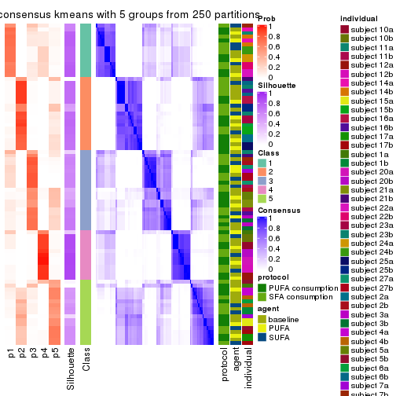</p>

</div>
<div id='tab-MAD-kmeans-consensus-heatmap-5'>
<pre><code class="r">consensus_heatmap(res, k = 6)
</code></pre>

<p></p>

</div>
</div>

Heatmaps for the membership of samples in all partitions to see how consistent they are:


<script>
$( function() {
	$( '#tabs-MAD-kmeans-membership-heatmap' ).tabs();
} );
</script>
<div id='tabs-MAD-kmeans-membership-heatmap'>
<ul>
<li><a href='#tab-MAD-kmeans-membership-heatmap-1'>k = 2</a></li>
<li><a href='#tab-MAD-kmeans-membership-heatmap-2'>k = 3</a></li>
<li><a href='#tab-MAD-kmeans-membership-heatmap-3'>k = 4</a></li>
<li><a href='#tab-MAD-kmeans-membership-heatmap-4'>k = 5</a></li>
<li><a href='#tab-MAD-kmeans-membership-heatmap-5'>k = 6</a></li>
</ul>
<div id='tab-MAD-kmeans-membership-heatmap-1'>
<pre><code class="r">membership_heatmap(res, k = 2)
</code></pre>

<p></p>

</div>
<div id='tab-MAD-kmeans-membership-heatmap-2'>
<pre><code class="r">membership_heatmap(res, k = 3)
</code></pre>

<p></p>

</div>
<div id='tab-MAD-kmeans-membership-heatmap-3'>
<pre><code class="r">membership_heatmap(res, k = 4)
</code></pre>

<p></p>

</div>
<div id='tab-MAD-kmeans-membership-heatmap-4'>
<pre><code class="r">membership_heatmap(res, k = 5)
</code></pre>

<p></p>

</div>
<div id='tab-MAD-kmeans-membership-heatmap-5'>
<pre><code class="r">membership_heatmap(res, k = 6)
</code></pre>

<p></p>

</div>
</div>

As soon as we have had the classes for columns, we can look for signatures
which are significantly different between classes which can be candidate marks
for certain classes. Following are the heatmaps for signatures.


Signature heatmaps where rows are scaled:


<script>
$( function() {
	$( '#tabs-MAD-kmeans-get-signatures' ).tabs();
} );
</script>
<div id='tabs-MAD-kmeans-get-signatures'>
<ul>
<li><a href='#tab-MAD-kmeans-get-signatures-1'>k = 2</a></li>
<li><a href='#tab-MAD-kmeans-get-signatures-2'>k = 3</a></li>
<li><a href='#tab-MAD-kmeans-get-signatures-3'>k = 4</a></li>
<li><a href='#tab-MAD-kmeans-get-signatures-4'>k = 5</a></li>
<li><a href='#tab-MAD-kmeans-get-signatures-5'>k = 6</a></li>
</ul>
<div id='tab-MAD-kmeans-get-signatures-1'>
<pre><code class="r">get_signatures(res, k = 2)
</code></pre>

<p></p>

</div>
<div id='tab-MAD-kmeans-get-signatures-2'>
<pre><code class="r">get_signatures(res, k = 3)
</code></pre>

<p></p>

</div>
<div id='tab-MAD-kmeans-get-signatures-3'>
<pre><code class="r">get_signatures(res, k = 4)
</code></pre>

<p></p>

</div>
<div id='tab-MAD-kmeans-get-signatures-4'>
<pre><code class="r">get_signatures(res, k = 5)
</code></pre>

<p></p>

</div>
<div id='tab-MAD-kmeans-get-signatures-5'>
<pre><code class="r">get_signatures(res, k = 6)
</code></pre>

<p></p>

</div>
</div>


Signature heatmaps where rows are not scaled:


<script>
$( function() {
	$( '#tabs-MAD-kmeans-get-signatures-no-scale' ).tabs();
} );
</script>
<div id='tabs-MAD-kmeans-get-signatures-no-scale'>
<ul>
<li><a href='#tab-MAD-kmeans-get-signatures-no-scale-1'>k = 2</a></li>
<li><a href='#tab-MAD-kmeans-get-signatures-no-scale-2'>k = 3</a></li>
<li><a href='#tab-MAD-kmeans-get-signatures-no-scale-3'>k = 4</a></li>
<li><a href='#tab-MAD-kmeans-get-signatures-no-scale-4'>k = 5</a></li>
<li><a href='#tab-MAD-kmeans-get-signatures-no-scale-5'>k = 6</a></li>
</ul>
<div id='tab-MAD-kmeans-get-signatures-no-scale-1'>
<pre><code class="r">get_signatures(res, k = 2, scale_rows = FALSE)
</code></pre>

<p></p>

</div>
<div id='tab-MAD-kmeans-get-signatures-no-scale-2'>
<pre><code class="r">get_signatures(res, k = 3, scale_rows = FALSE)
</code></pre>

<p></p>

</div>
<div id='tab-MAD-kmeans-get-signatures-no-scale-3'>
<pre><code class="r">get_signatures(res, k = 4, scale_rows = FALSE)
</code></pre>

<p></p>

</div>
<div id='tab-MAD-kmeans-get-signatures-no-scale-4'>
<pre><code class="r">get_signatures(res, k = 5, scale_rows = FALSE)
</code></pre>

<p></p>

</div>
<div id='tab-MAD-kmeans-get-signatures-no-scale-5'>
<pre><code class="r">get_signatures(res, k = 6, scale_rows = FALSE)
</code></pre>

<p></p>

</div>
</div>


Compare the overlap of signatures from different k:

```r
compare_signatures(res)
```


`get_signature()` returns a data frame invisibly. TO get the list of signatures, the function
call should be assigned to a variable explicitly. In following code, if `plot` argument is set
to `FALSE`, no heatmap is plotted while only the differential analysis is performed.

```r
# code only for demonstration
tb = get_signature(res, k = ..., plot = FALSE)
```

An example of the output of `tb` is:

```
#>   which_row         fdr    mean_1    mean_2 scaled_mean_1 scaled_mean_2 km
#> 1        38 0.042760348  8.373488  9.131774    -0.5533452     0.5164555  1
#> 2        40 0.018707592  7.106213  8.469186    -0.6173731     0.5762149  1
#> 3        55 0.019134737 10.221463 11.207825    -0.6159697     0.5749050  1
#> 4        59 0.006059896  5.921854  7.869574    -0.6899429     0.6439467  1
#> 5        60 0.018055526  8.928898 10.211722    -0.6204761     0.5791110  1
#> 6        98 0.009384629 15.714769 14.887706     0.6635654    -0.6193277  2
...
```

The columns in `tb` are:

1. `which_row`: row indices corresponding to the input matrix.
2. `fdr`: FDR for the differential test. 
3. `mean_x`: The mean value in group x.
4. `scaled_mean_x`: The mean value in group x after rows are scaled.
5. `km`: Row groups if k-means clustering is applied to rows.


UMAP plot which shows how samples are separated.


<script>
$( function() {
	$( '#tabs-MAD-kmeans-dimension-reduction' ).tabs();
} );
</script>
<div id='tabs-MAD-kmeans-dimension-reduction'>
<ul>
<li><a href='#tab-MAD-kmeans-dimension-reduction-1'>k = 2</a></li>
<li><a href='#tab-MAD-kmeans-dimension-reduction-2'>k = 3</a></li>
<li><a href='#tab-MAD-kmeans-dimension-reduction-3'>k = 4</a></li>
<li><a href='#tab-MAD-kmeans-dimension-reduction-4'>k = 5</a></li>
<li><a href='#tab-MAD-kmeans-dimension-reduction-5'>k = 6</a></li>
</ul>
<div id='tab-MAD-kmeans-dimension-reduction-1'>
<pre><code class="r">dimension_reduction(res, k = 2, method = &quot;UMAP&quot;)
</code></pre>

<p></p>

</div>
<div id='tab-MAD-kmeans-dimension-reduction-2'>
<pre><code class="r">dimension_reduction(res, k = 3, method = &quot;UMAP&quot;)
</code></pre>

<p></p>

</div>
<div id='tab-MAD-kmeans-dimension-reduction-3'>
<pre><code class="r">dimension_reduction(res, k = 4, method = &quot;UMAP&quot;)
</code></pre>

<p></p>

</div>
<div id='tab-MAD-kmeans-dimension-reduction-4'>
<pre><code class="r">dimension_reduction(res, k = 5, method = &quot;UMAP&quot;)
</code></pre>

<p></p>

</div>
<div id='tab-MAD-kmeans-dimension-reduction-5'>
<pre><code class="r">dimension_reduction(res, k = 6, method = &quot;UMAP&quot;)
</code></pre>

<p></p>

</div>
</div>


Following heatmap shows how subgroups are split when increasing `k`:

```r
collect_classes(res)
```


Test correlation between subgroups and known annotations. If the known
annotation is numeric, one-way ANOVA test is applied, and if the known
annotation is discrete, chi-squared contingency table test is applied.

```r
test_to_known_factors(res)
```

```
#>             n protocol(p) agent(p) individual(p) k
#> MAD:kmeans 83       1.000    0.703      1.57e-03 2
#> MAD:kmeans 84       0.961    0.957      3.97e-05 3
#> MAD:kmeans 80       0.995    0.990      4.69e-08 4
#> MAD:kmeans 70       0.849    0.986      2.77e-09 5
#> MAD:kmeans 56       0.951    0.997      9.73e-08 6
```


If matrix rows can be associated to genes, consider to use `functional_enrichment(res,
...)` to perform function enrichment for the signature genes. See [this vignette](http://bioconductor.org/packages/devel/bioc/vignettes/cola/inst/doc/functional_enrichment.html) for more detailed explanations.


 

---------------------------------------------------


### MAD:skmeans


The object with results only for a single top-value method and a single partition method 
can be extracted as:

```r
res = res_list["MAD", "skmeans"]
# you can also extract it by
# res = res_list["MAD:skmeans"]
```

A summary of `res` and all the functions that can be applied to it:

```r
res
```

```
#> A 'ConsensusPartition' object with k = 2, 3, 4, 5, 6.
#>   On a matrix with 15497 rows and 84 columns.
#>   Top rows (1000, 2000, 3000, 4000, 5000) are extracted by 'MAD' method.
#>   Subgroups are detected by 'skmeans' method.
#>   Performed in total 1250 partitions by row resampling.
#>   Best k for subgroups seems to be 2.
#> 
#> Following methods can be applied to this 'ConsensusPartition' object:
#>  [1] "cola_report"             "collect_classes"         "collect_plots"          
#>  [4] "collect_stats"           "colnames"                "compare_signatures"     
#>  [7] "consensus_heatmap"       "dimension_reduction"     "functional_enrichment"  
#> [10] "get_anno_col"            "get_anno"                "get_classes"            
#> [13] "get_consensus"           "get_matrix"              "get_membership"         
#> [16] "get_param"               "get_signatures"          "get_stats"              
#> [19] "is_best_k"               "is_stable_k"             "membership_heatmap"     
#> [22] "ncol"                    "nrow"                    "plot_ecdf"              
#> [25] "rownames"                "select_partition_number" "show"                   
#> [28] "suggest_best_k"          "test_to_known_factors"
```

`collect_plots()` function collects all the plots made from `res` for all `k` (number of partitions)
into one single page to provide an easy and fast comparison between different `k`.

```r
collect_plots(res)
```


The plots are:

- The first row: a plot of the ECDF (empirical cumulative distribution
  function) curves of the consensus matrix for each `k` and the heatmap of
  predicted classes for each `k`.
- The second row: heatmaps of the consensus matrix for each `k`.
- The third row: heatmaps of the membership matrix for each `k`.
- The fouth row: heatmaps of the signatures for each `k`.

All the plots in panels can be made by individual functions and they are
plotted later in this section.

`select_partition_number()` produces several plots showing different
statistics for choosing "optimized" `k`. There are following statistics:

- ECDF curves of the consensus matrix for each `k`;
- 1-PAC. [The PAC
  score](https://en.wikipedia.org/wiki/Consensus_clustering#Over-interpretation_potential_of_consensus_clustering)
  measures the proportion of the ambiguous subgrouping.
- Mean silhouette score.
- Concordance. The mean probability of fiting the consensus class ids in all
  partitions.
- Area increased. Denote $A_k$ as the area under the ECDF curve for current
  `k`, the area increased is defined as $A_k - A_{k-1}$.
- Rand index. The percent of pairs of samples that are both in a same cluster
  or both are not in a same cluster in the partition of k and k-1.
- Jaccard index. The ratio of pairs of samples are both in a same cluster in
  the partition of k and k-1 and the pairs of samples are both in a same
  cluster in the partition k or k-1.

The detailed explanations of these statistics can be found in [the _cola_
vignette](http://bioconductor.org/packages/devel/bioc/vignettes/cola/inst/doc/cola.html#toc_13).

Generally speaking, lower PAC score, higher mean silhouette score or higher
concordance corresponds to better partition. Rand index and Jaccard index
measure how similar the current partition is compared to partition with `k-1`.
If they are too similar, we won't accept `k` is better than `k-1`.

```r
select_partition_number(res)
```


The numeric values for all these statistics can be obtained by `get_stats()`.

```r
get_stats(res)
```

```
#>   k 1-PAC mean_silhouette concordance area_increased  Rand Jaccard
#> 2 2 0.862           0.956       0.978         0.5042 0.497   0.497
#> 3 3 0.773           0.894       0.932         0.3126 0.787   0.594
#> 4 4 0.733           0.864       0.880         0.1041 0.922   0.774
#> 5 5 0.699           0.659       0.798         0.0729 0.969   0.887
#> 6 6 0.756           0.715       0.805         0.0467 0.910   0.647
```

`suggest_best_k()` suggests the best $k$ based on these statistics. The rules are as follows:

- All $k$ with Jaccard index larger than 0.95 are removed because increasing
  $k$ does not provide enough extra information. If all $k$ are removed, it is
  marked as no subgroup is detected.
- For all $k$ with 1-PAC score larger than 0.9, the maximal $k$ is taken as
  the best $k$, and other $k$ are marked as optional $k$.
- If it does not fit the second rule. The $k$ with the maximal vote of the
  highest 1-PAC score, highest mean silhouette, and highest concordance is
  taken as the best $k$.

```r
suggest_best_k(res)
```

```
#> [1] 2
```


Following shows the table of the partitions (You need to click the **show/hide
code output** link to see it). The membership matrix (columns with name `p*`)
is inferred by
[`clue::cl_consensus()`](https://www.rdocumentation.org/link/cl_consensus?package=clue)
function with the `SE` method. Basically the value in the membership matrix
represents the probability to belong to a certain group. The finall class
label for an item is determined with the group with highest probability it
belongs to.

In `get_classes()` function, the entropy is calculated from the membership
matrix and the silhouette score is calculated from the consensus matrix.


<script>
$( function() {
	$( '#tabs-MAD-skmeans-get-classes' ).tabs();
} );
</script>
<div id='tabs-MAD-skmeans-get-classes'>
<ul>
<li><a href='#tab-MAD-skmeans-get-classes-1'>k = 2</a></li>
<li><a href='#tab-MAD-skmeans-get-classes-2'>k = 3</a></li>
<li><a href='#tab-MAD-skmeans-get-classes-3'>k = 4</a></li>
<li><a href='#tab-MAD-skmeans-get-classes-4'>k = 5</a></li>
<li><a href='#tab-MAD-skmeans-get-classes-5'>k = 6</a></li>
</ul>

<div id='tab-MAD-skmeans-get-classes-1'>
<p><a id='tab-MAD-skmeans-get-classes-1-a' style='color:#0366d6' href='#'>show/hide code output</a></p>
<pre><code class="r">cbind(get_classes(res, k = 2), get_membership(res, k = 2))
</code></pre>

<pre><code>#&gt;           class entropy silhouette    p1    p2
#&gt; GSM339455     1  0.0000      0.989 1.000 0.000
#&gt; GSM339456     2  0.0000      0.966 0.000 1.000
#&gt; GSM339457     2  0.7219      0.785 0.200 0.800
#&gt; GSM339458     2  0.0000      0.966 0.000 1.000
#&gt; GSM339459     2  0.7219      0.785 0.200 0.800
#&gt; GSM339460     2  0.0000      0.966 0.000 1.000
#&gt; GSM339461     2  0.0000      0.966 0.000 1.000
#&gt; GSM339462     1  0.0000      0.989 1.000 0.000
#&gt; GSM339463     1  0.0000      0.989 1.000 0.000
#&gt; GSM339464     1  0.0000      0.989 1.000 0.000
#&gt; GSM339465     1  0.0000      0.989 1.000 0.000
#&gt; GSM339466     2  0.0000      0.966 0.000 1.000
#&gt; GSM339467     2  0.0000      0.966 0.000 1.000
#&gt; GSM339468     2  0.0000      0.966 0.000 1.000
#&gt; GSM339469     1  0.0000      0.989 1.000 0.000
#&gt; GSM339470     2  0.3114      0.927 0.056 0.944
#&gt; GSM339471     1  0.0000      0.989 1.000 0.000
#&gt; GSM339472     2  0.0000      0.966 0.000 1.000
#&gt; GSM339473     1  0.0000      0.989 1.000 0.000
#&gt; GSM339474     2  0.0000      0.966 0.000 1.000
#&gt; GSM339475     1  0.0000      0.989 1.000 0.000
#&gt; GSM339476     1  0.0000      0.989 1.000 0.000
#&gt; GSM339477     2  0.0000      0.966 0.000 1.000
#&gt; GSM339478     2  0.0000      0.966 0.000 1.000
#&gt; GSM339479     2  0.0000      0.966 0.000 1.000
#&gt; GSM339480     2  0.7602      0.759 0.220 0.780
#&gt; GSM339481     2  0.0000      0.966 0.000 1.000
#&gt; GSM339482     1  0.0000      0.989 1.000 0.000
#&gt; GSM339483     1  0.0000      0.989 1.000 0.000
#&gt; GSM339484     1  0.0000      0.989 1.000 0.000
#&gt; GSM339485     1  0.0000      0.989 1.000 0.000
#&gt; GSM339486     1  0.0000      0.989 1.000 0.000
#&gt; GSM339487     2  0.0000      0.966 0.000 1.000
#&gt; GSM339488     2  0.0000      0.966 0.000 1.000
#&gt; GSM339489     2  0.0000      0.966 0.000 1.000
#&gt; GSM339490     1  0.0000      0.989 1.000 0.000
#&gt; GSM339491     2  0.2778      0.934 0.048 0.952
#&gt; GSM339492     1  0.0000      0.989 1.000 0.000
#&gt; GSM339493     2  0.0000      0.966 0.000 1.000
#&gt; GSM339494     1  0.0000      0.989 1.000 0.000
#&gt; GSM339495     2  0.0000      0.966 0.000 1.000
#&gt; GSM339496     1  0.0000      0.989 1.000 0.000
#&gt; GSM339497     2  0.0000      0.966 0.000 1.000
#&gt; GSM339498     2  0.7056      0.795 0.192 0.808
#&gt; GSM339499     2  0.7219      0.785 0.200 0.800
#&gt; GSM339500     2  0.0000      0.966 0.000 1.000
#&gt; GSM339501     1  0.0000      0.989 1.000 0.000
#&gt; GSM339502     2  0.0000      0.966 0.000 1.000
#&gt; GSM339503     1  0.0000      0.989 1.000 0.000
#&gt; GSM339504     1  0.0000      0.989 1.000 0.000
#&gt; GSM339505     2  0.7219      0.785 0.200 0.800
#&gt; GSM339506     1  0.0000      0.989 1.000 0.000
#&gt; GSM339507     1  0.0000      0.989 1.000 0.000
#&gt; GSM339508     2  0.0000      0.966 0.000 1.000
#&gt; GSM339509     2  0.0000      0.966 0.000 1.000
#&gt; GSM339510     2  0.0000      0.966 0.000 1.000
#&gt; GSM339511     1  0.7219      0.753 0.800 0.200
#&gt; GSM339512     2  0.0000      0.966 0.000 1.000
#&gt; GSM339513     1  0.0000      0.989 1.000 0.000
#&gt; GSM339514     2  0.0000      0.966 0.000 1.000
#&gt; GSM339515     1  0.0000      0.989 1.000 0.000
#&gt; GSM339516     2  0.0000      0.966 0.000 1.000
#&gt; GSM339517     1  0.0000      0.989 1.000 0.000
#&gt; GSM339518     2  0.0000      0.966 0.000 1.000
#&gt; GSM339519     1  0.0000      0.989 1.000 0.000
#&gt; GSM339520     2  0.0938      0.959 0.012 0.988
#&gt; GSM339521     2  0.0000      0.966 0.000 1.000
#&gt; GSM339522     2  0.0000      0.966 0.000 1.000
#&gt; GSM339523     2  0.0000      0.966 0.000 1.000
#&gt; GSM339524     1  0.0000      0.989 1.000 0.000
#&gt; GSM339525     1  0.0000      0.989 1.000 0.000
#&gt; GSM339526     1  0.0000      0.989 1.000 0.000
#&gt; GSM339527     1  0.0000      0.989 1.000 0.000
#&gt; GSM339528     1  0.0000      0.989 1.000 0.000
#&gt; GSM339529     2  0.0000      0.966 0.000 1.000
#&gt; GSM339530     2  0.4939      0.882 0.108 0.892
#&gt; GSM339531     2  0.0000      0.966 0.000 1.000
#&gt; GSM339532     1  0.7219      0.753 0.800 0.200
#&gt; GSM339533     1  0.0000      0.989 1.000 0.000
#&gt; GSM339534     1  0.0000      0.989 1.000 0.000
#&gt; GSM339535     2  0.0000      0.966 0.000 1.000
#&gt; GSM339536     1  0.0000      0.989 1.000 0.000
#&gt; GSM339537     2  0.0000      0.966 0.000 1.000
#&gt; GSM339538     1  0.0000      0.989 1.000 0.000
</code></pre>

<script>
$('#tab-MAD-skmeans-get-classes-1-a').parent().next().next().hide();
$('#tab-MAD-skmeans-get-classes-1-a').click(function(){
  $('#tab-MAD-skmeans-get-classes-1-a').parent().next().next().toggle();
  return(false);
});
</script>
</div>

<div id='tab-MAD-skmeans-get-classes-2'>
<p><a id='tab-MAD-skmeans-get-classes-2-a' style='color:#0366d6' href='#'>show/hide code output</a></p>
<pre><code class="r">cbind(get_classes(res, k = 3), get_membership(res, k = 3))
</code></pre>

<pre><code>#&gt;           class entropy silhouette    p1    p2    p3
#&gt; GSM339455     1  0.5968      0.653 0.636 0.000 0.364
#&gt; GSM339456     2  0.0000      0.970 0.000 1.000 0.000
#&gt; GSM339457     3  0.0000      0.957 0.000 0.000 1.000
#&gt; GSM339458     2  0.0000      0.970 0.000 1.000 0.000
#&gt; GSM339459     3  0.4912      0.751 0.196 0.008 0.796
#&gt; GSM339460     2  0.0000      0.970 0.000 1.000 0.000
#&gt; GSM339461     2  0.0592      0.961 0.012 0.988 0.000
#&gt; GSM339462     1  0.0000      0.839 1.000 0.000 0.000
#&gt; GSM339463     1  0.5968      0.653 0.636 0.000 0.364
#&gt; GSM339464     1  0.0000      0.839 1.000 0.000 0.000
#&gt; GSM339465     1  0.6309      0.346 0.504 0.000 0.496
#&gt; GSM339466     2  0.0000      0.970 0.000 1.000 0.000
#&gt; GSM339467     2  0.0000      0.970 0.000 1.000 0.000
#&gt; GSM339468     2  0.4504      0.806 0.196 0.804 0.000
#&gt; GSM339469     1  0.0000      0.839 1.000 0.000 0.000
#&gt; GSM339470     3  0.0000      0.957 0.000 0.000 1.000
#&gt; GSM339471     1  0.4605      0.850 0.796 0.000 0.204
#&gt; GSM339472     2  0.0000      0.970 0.000 1.000 0.000
#&gt; GSM339473     1  0.4605      0.850 0.796 0.000 0.204
#&gt; GSM339474     2  0.0000      0.970 0.000 1.000 0.000
#&gt; GSM339475     3  0.0000      0.957 0.000 0.000 1.000
#&gt; GSM339476     1  0.4452      0.851 0.808 0.000 0.192
#&gt; GSM339477     2  0.0000      0.970 0.000 1.000 0.000
#&gt; GSM339478     3  0.0000      0.957 0.000 0.000 1.000
#&gt; GSM339479     2  0.4399      0.759 0.188 0.812 0.000
#&gt; GSM339480     3  0.4654      0.745 0.208 0.000 0.792
#&gt; GSM339481     2  0.0000      0.970 0.000 1.000 0.000
#&gt; GSM339482     3  0.0000      0.957 0.000 0.000 1.000
#&gt; GSM339483     1  0.0000      0.839 1.000 0.000 0.000
#&gt; GSM339484     1  0.4654      0.848 0.792 0.000 0.208
#&gt; GSM339485     1  0.0000      0.839 1.000 0.000 0.000
#&gt; GSM339486     1  0.4654      0.848 0.792 0.000 0.208
#&gt; GSM339487     2  0.0000      0.970 0.000 1.000 0.000
#&gt; GSM339488     2  0.0000      0.970 0.000 1.000 0.000
#&gt; GSM339489     2  0.4504      0.806 0.196 0.804 0.000
#&gt; GSM339490     1  0.0000      0.839 1.000 0.000 0.000
#&gt; GSM339491     3  0.0592      0.945 0.000 0.012 0.988
#&gt; GSM339492     1  0.4605      0.850 0.796 0.000 0.204
#&gt; GSM339493     2  0.0000      0.970 0.000 1.000 0.000
#&gt; GSM339494     1  0.4605      0.850 0.796 0.000 0.204
#&gt; GSM339495     2  0.0000      0.970 0.000 1.000 0.000
#&gt; GSM339496     3  0.0000      0.957 0.000 0.000 1.000
#&gt; GSM339497     2  0.0000      0.970 0.000 1.000 0.000
#&gt; GSM339498     3  0.4912      0.751 0.196 0.008 0.796
#&gt; GSM339499     3  0.0000      0.957 0.000 0.000 1.000
#&gt; GSM339500     2  0.0000      0.970 0.000 1.000 0.000
#&gt; GSM339501     1  0.0000      0.839 1.000 0.000 0.000
#&gt; GSM339502     2  0.0000      0.970 0.000 1.000 0.000
#&gt; GSM339503     3  0.0424      0.950 0.008 0.000 0.992
#&gt; GSM339504     1  0.0000      0.839 1.000 0.000 0.000
#&gt; GSM339505     3  0.0000      0.957 0.000 0.000 1.000
#&gt; GSM339506     1  0.0000      0.839 1.000 0.000 0.000
#&gt; GSM339507     1  0.4654      0.848 0.792 0.000 0.208
#&gt; GSM339508     2  0.0000      0.970 0.000 1.000 0.000
#&gt; GSM339509     2  0.0000      0.970 0.000 1.000 0.000
#&gt; GSM339510     2  0.4504      0.806 0.196 0.804 0.000
#&gt; GSM339511     1  0.0000      0.839 1.000 0.000 0.000
#&gt; GSM339512     2  0.0000      0.970 0.000 1.000 0.000
#&gt; GSM339513     1  0.4605      0.850 0.796 0.000 0.204
#&gt; GSM339514     2  0.0000      0.970 0.000 1.000 0.000
#&gt; GSM339515     1  0.4605      0.850 0.796 0.000 0.204
#&gt; GSM339516     2  0.0000      0.970 0.000 1.000 0.000
#&gt; GSM339517     3  0.0000      0.957 0.000 0.000 1.000
#&gt; GSM339518     2  0.0000      0.970 0.000 1.000 0.000
#&gt; GSM339519     3  0.0000      0.957 0.000 0.000 1.000
#&gt; GSM339520     3  0.0000      0.957 0.000 0.000 1.000
#&gt; GSM339521     2  0.0000      0.970 0.000 1.000 0.000
#&gt; GSM339522     2  0.0000      0.970 0.000 1.000 0.000
#&gt; GSM339523     2  0.0000      0.970 0.000 1.000 0.000
#&gt; GSM339524     1  0.4504      0.851 0.804 0.000 0.196
#&gt; GSM339525     1  0.0000      0.839 1.000 0.000 0.000
#&gt; GSM339526     3  0.0000      0.957 0.000 0.000 1.000
#&gt; GSM339527     1  0.0000      0.839 1.000 0.000 0.000
#&gt; GSM339528     1  0.4605      0.850 0.796 0.000 0.204
#&gt; GSM339529     2  0.0000      0.970 0.000 1.000 0.000
#&gt; GSM339530     3  0.0000      0.957 0.000 0.000 1.000
#&gt; GSM339531     2  0.4504      0.806 0.196 0.804 0.000
#&gt; GSM339532     1  0.0000      0.839 1.000 0.000 0.000
#&gt; GSM339533     3  0.0000      0.957 0.000 0.000 1.000
#&gt; GSM339534     1  0.4605      0.850 0.796 0.000 0.204
#&gt; GSM339535     2  0.0000      0.970 0.000 1.000 0.000
#&gt; GSM339536     1  0.4605      0.850 0.796 0.000 0.204
#&gt; GSM339537     2  0.0000      0.970 0.000 1.000 0.000
#&gt; GSM339538     3  0.0000      0.957 0.000 0.000 1.000
</code></pre>

<script>
$('#tab-MAD-skmeans-get-classes-2-a').parent().next().next().hide();
$('#tab-MAD-skmeans-get-classes-2-a').click(function(){
  $('#tab-MAD-skmeans-get-classes-2-a').parent().next().next().toggle();
  return(false);
});
</script>
</div>

<div id='tab-MAD-skmeans-get-classes-3'>
<p><a id='tab-MAD-skmeans-get-classes-3-a' style='color:#0366d6' href='#'>show/hide code output</a></p>
<pre><code class="r">cbind(get_classes(res, k = 4), get_membership(res, k = 4))
</code></pre>

<pre><code>#&gt;           class entropy silhouette    p1    p2    p3    p4
#&gt; GSM339455     1  0.4312    0.81448 0.812 0.000 0.132 0.056
#&gt; GSM339456     2  0.1118    0.91860 0.000 0.964 0.036 0.000
#&gt; GSM339457     3  0.1557    0.84547 0.056 0.000 0.944 0.000
#&gt; GSM339458     2  0.5280    0.80731 0.096 0.748 0.156 0.000
#&gt; GSM339459     3  0.5267    0.75618 0.056 0.052 0.792 0.100
#&gt; GSM339460     2  0.3149    0.90709 0.032 0.880 0.088 0.000
#&gt; GSM339461     2  0.1452    0.91897 0.008 0.956 0.036 0.000
#&gt; GSM339462     4  0.0000    0.92008 0.000 0.000 0.000 1.000
#&gt; GSM339463     1  0.3107    0.84068 0.884 0.000 0.080 0.036
#&gt; GSM339464     4  0.0000    0.92008 0.000 0.000 0.000 1.000
#&gt; GSM339465     1  0.2483    0.86100 0.916 0.000 0.052 0.032
#&gt; GSM339466     2  0.0188    0.92927 0.004 0.996 0.000 0.000
#&gt; GSM339467     2  0.2011    0.92067 0.000 0.920 0.080 0.000
#&gt; GSM339468     2  0.4608    0.82420 0.048 0.828 0.040 0.084
#&gt; GSM339469     4  0.0000    0.92008 0.000 0.000 0.000 1.000
#&gt; GSM339470     3  0.3172    0.80074 0.160 0.000 0.840 0.000
#&gt; GSM339471     1  0.4322    0.92221 0.804 0.000 0.044 0.152
#&gt; GSM339472     2  0.0188    0.92979 0.000 0.996 0.004 0.000
#&gt; GSM339473     1  0.3172    0.92411 0.840 0.000 0.000 0.160
#&gt; GSM339474     2  0.0000    0.92953 0.000 1.000 0.000 0.000
#&gt; GSM339475     3  0.3610    0.83463 0.200 0.000 0.800 0.000
#&gt; GSM339476     4  0.5894    0.00671 0.392 0.000 0.040 0.568
#&gt; GSM339477     2  0.0817    0.92337 0.000 0.976 0.024 0.000
#&gt; GSM339478     3  0.1557    0.84547 0.056 0.000 0.944 0.000
#&gt; GSM339479     4  0.8442    0.45750 0.096 0.204 0.156 0.544
#&gt; GSM339480     3  0.5267    0.75618 0.056 0.052 0.792 0.100
#&gt; GSM339481     2  0.0469    0.92971 0.000 0.988 0.012 0.000
#&gt; GSM339482     3  0.4972    0.36309 0.456 0.000 0.544 0.000
#&gt; GSM339483     4  0.0000    0.92008 0.000 0.000 0.000 1.000
#&gt; GSM339484     1  0.2611    0.92053 0.896 0.000 0.008 0.096
#&gt; GSM339485     4  0.0000    0.92008 0.000 0.000 0.000 1.000
#&gt; GSM339486     1  0.2530    0.92261 0.896 0.000 0.004 0.100
#&gt; GSM339487     2  0.0188    0.92927 0.004 0.996 0.000 0.000
#&gt; GSM339488     2  0.2011    0.92067 0.000 0.920 0.080 0.000
#&gt; GSM339489     2  0.3943    0.85691 0.048 0.864 0.040 0.048
#&gt; GSM339490     4  0.0000    0.92008 0.000 0.000 0.000 1.000
#&gt; GSM339491     3  0.3172    0.80074 0.160 0.000 0.840 0.000
#&gt; GSM339492     1  0.4322    0.92221 0.804 0.000 0.044 0.152
#&gt; GSM339493     2  0.0524    0.93014 0.004 0.988 0.008 0.000
#&gt; GSM339494     1  0.3172    0.92411 0.840 0.000 0.000 0.160
#&gt; GSM339495     2  0.0000    0.92953 0.000 1.000 0.000 0.000
#&gt; GSM339496     3  0.3610    0.83463 0.200 0.000 0.800 0.000
#&gt; GSM339497     2  0.2871    0.91445 0.032 0.896 0.072 0.000
#&gt; GSM339498     3  0.5780    0.71833 0.044 0.100 0.760 0.096
#&gt; GSM339499     3  0.1557    0.84547 0.056 0.000 0.944 0.000
#&gt; GSM339500     2  0.4731    0.83596 0.060 0.780 0.160 0.000
#&gt; GSM339501     4  0.2759    0.83772 0.052 0.000 0.044 0.904
#&gt; GSM339502     2  0.2011    0.92067 0.000 0.920 0.080 0.000
#&gt; GSM339503     3  0.3448    0.83734 0.168 0.000 0.828 0.004
#&gt; GSM339504     4  0.0000    0.92008 0.000 0.000 0.000 1.000
#&gt; GSM339505     3  0.3074    0.84808 0.152 0.000 0.848 0.000
#&gt; GSM339506     4  0.0000    0.92008 0.000 0.000 0.000 1.000
#&gt; GSM339507     1  0.2408    0.92377 0.896 0.000 0.000 0.104
#&gt; GSM339508     2  0.0000    0.92953 0.000 1.000 0.000 0.000
#&gt; GSM339509     2  0.2011    0.92067 0.000 0.920 0.080 0.000
#&gt; GSM339510     2  0.4941    0.80673 0.052 0.808 0.040 0.100
#&gt; GSM339511     4  0.0000    0.92008 0.000 0.000 0.000 1.000
#&gt; GSM339512     2  0.3554    0.88034 0.020 0.844 0.136 0.000
#&gt; GSM339513     1  0.4237    0.92257 0.808 0.000 0.040 0.152
#&gt; GSM339514     2  0.2011    0.92067 0.000 0.920 0.080 0.000
#&gt; GSM339515     1  0.3172    0.92411 0.840 0.000 0.000 0.160
#&gt; GSM339516     2  0.0188    0.92927 0.004 0.996 0.000 0.000
#&gt; GSM339517     3  0.3610    0.83463 0.200 0.000 0.800 0.000
#&gt; GSM339518     2  0.3082    0.90917 0.032 0.884 0.084 0.000
#&gt; GSM339519     3  0.3219    0.83618 0.164 0.000 0.836 0.000
#&gt; GSM339520     3  0.1557    0.84547 0.056 0.000 0.944 0.000
#&gt; GSM339521     2  0.3634    0.89347 0.048 0.856 0.096 0.000
#&gt; GSM339522     2  0.2586    0.89155 0.048 0.912 0.040 0.000
#&gt; GSM339523     2  0.2011    0.92067 0.000 0.920 0.080 0.000
#&gt; GSM339524     1  0.4436    0.91429 0.800 0.000 0.052 0.148
#&gt; GSM339525     4  0.0000    0.92008 0.000 0.000 0.000 1.000
#&gt; GSM339526     3  0.3649    0.83288 0.204 0.000 0.796 0.000
#&gt; GSM339527     4  0.0000    0.92008 0.000 0.000 0.000 1.000
#&gt; GSM339528     1  0.2408    0.92377 0.896 0.000 0.000 0.104
#&gt; GSM339529     2  0.0000    0.92953 0.000 1.000 0.000 0.000
#&gt; GSM339530     3  0.1557    0.84547 0.056 0.000 0.944 0.000
#&gt; GSM339531     2  0.3943    0.85691 0.048 0.864 0.040 0.048
#&gt; GSM339532     4  0.0000    0.92008 0.000 0.000 0.000 1.000
#&gt; GSM339533     3  0.3975    0.80791 0.240 0.000 0.760 0.000
#&gt; GSM339534     1  0.4485    0.91910 0.796 0.000 0.052 0.152
#&gt; GSM339535     2  0.1978    0.92388 0.004 0.928 0.068 0.000
#&gt; GSM339536     1  0.3172    0.92411 0.840 0.000 0.000 0.160
#&gt; GSM339537     2  0.0188    0.92927 0.004 0.996 0.000 0.000
#&gt; GSM339538     3  0.3610    0.83463 0.200 0.000 0.800 0.000
</code></pre>

<script>
$('#tab-MAD-skmeans-get-classes-3-a').parent().next().next().hide();
$('#tab-MAD-skmeans-get-classes-3-a').click(function(){
  $('#tab-MAD-skmeans-get-classes-3-a').parent().next().next().toggle();
  return(false);
});
</script>
</div>

<div id='tab-MAD-skmeans-get-classes-4'>
<p><a id='tab-MAD-skmeans-get-classes-4-a' style='color:#0366d6' href='#'>show/hide code output</a></p>
<pre><code class="r">cbind(get_classes(res, k = 5), get_membership(res, k = 5))
</code></pre>

<pre><code>#&gt;           class entropy silhouette    p1    p2    p3    p4    p5
#&gt; GSM339455     1  0.6831      0.425 0.508 0.000 0.160 0.028 0.304
#&gt; GSM339456     2  0.2068      0.634 0.000 0.904 0.004 0.000 0.092
#&gt; GSM339457     3  0.2513      0.741 0.008 0.000 0.876 0.000 0.116
#&gt; GSM339458     5  0.5667      0.731 0.024 0.336 0.048 0.000 0.592
#&gt; GSM339459     3  0.6368      0.536 0.068 0.024 0.568 0.016 0.324
#&gt; GSM339460     2  0.4449     -0.477 0.000 0.512 0.004 0.000 0.484
#&gt; GSM339461     2  0.2798      0.618 0.000 0.852 0.008 0.000 0.140
#&gt; GSM339462     4  0.0162      0.932 0.004 0.000 0.000 0.996 0.000
#&gt; GSM339463     1  0.2959      0.793 0.864 0.000 0.112 0.008 0.016
#&gt; GSM339464     4  0.0000      0.934 0.000 0.000 0.000 1.000 0.000
#&gt; GSM339465     1  0.2331      0.831 0.908 0.000 0.068 0.008 0.016
#&gt; GSM339466     2  0.1484      0.663 0.008 0.944 0.000 0.000 0.048
#&gt; GSM339467     2  0.3236      0.568 0.000 0.828 0.020 0.000 0.152
#&gt; GSM339468     2  0.6098      0.333 0.060 0.552 0.008 0.020 0.360
#&gt; GSM339469     4  0.0000      0.934 0.000 0.000 0.000 1.000 0.000
#&gt; GSM339470     3  0.5341      0.608 0.124 0.000 0.664 0.000 0.212
#&gt; GSM339471     1  0.3608      0.881 0.824 0.000 0.064 0.112 0.000
#&gt; GSM339472     2  0.1121      0.657 0.000 0.956 0.000 0.000 0.044
#&gt; GSM339473     1  0.2439      0.893 0.876 0.000 0.004 0.120 0.000
#&gt; GSM339474     2  0.0404      0.667 0.000 0.988 0.000 0.000 0.012
#&gt; GSM339475     3  0.2732      0.757 0.160 0.000 0.840 0.000 0.000
#&gt; GSM339476     4  0.4957      0.290 0.332 0.000 0.044 0.624 0.000
#&gt; GSM339477     2  0.1410      0.656 0.000 0.940 0.000 0.000 0.060
#&gt; GSM339478     3  0.2563      0.739 0.008 0.000 0.872 0.000 0.120
#&gt; GSM339479     5  0.7238      0.645 0.036 0.172 0.048 0.152 0.592
#&gt; GSM339480     3  0.6454      0.535 0.068 0.020 0.564 0.024 0.324
#&gt; GSM339481     2  0.2179      0.623 0.000 0.896 0.004 0.000 0.100
#&gt; GSM339482     3  0.4182      0.492 0.352 0.000 0.644 0.000 0.004
#&gt; GSM339483     4  0.0162      0.932 0.004 0.000 0.000 0.996 0.000
#&gt; GSM339484     1  0.2800      0.884 0.888 0.000 0.024 0.072 0.016
#&gt; GSM339485     4  0.0000      0.934 0.000 0.000 0.000 1.000 0.000
#&gt; GSM339486     1  0.2507      0.887 0.900 0.000 0.012 0.072 0.016
#&gt; GSM339487     2  0.1484      0.663 0.008 0.944 0.000 0.000 0.048
#&gt; GSM339488     2  0.3236      0.568 0.000 0.828 0.020 0.000 0.152
#&gt; GSM339489     2  0.6034      0.329 0.060 0.548 0.008 0.016 0.368
#&gt; GSM339490     4  0.0000      0.934 0.000 0.000 0.000 1.000 0.000
#&gt; GSM339491     3  0.5396      0.597 0.124 0.000 0.656 0.000 0.220
#&gt; GSM339492     1  0.3608      0.881 0.824 0.000 0.064 0.112 0.000
#&gt; GSM339493     2  0.1952      0.658 0.000 0.912 0.004 0.000 0.084
#&gt; GSM339494     1  0.2439      0.893 0.876 0.000 0.004 0.120 0.000
#&gt; GSM339495     2  0.0404      0.669 0.000 0.988 0.000 0.000 0.012
#&gt; GSM339496     3  0.2773      0.756 0.164 0.000 0.836 0.000 0.000
#&gt; GSM339497     2  0.4450     -0.491 0.000 0.508 0.004 0.000 0.488
#&gt; GSM339498     3  0.6822      0.540 0.040 0.080 0.584 0.028 0.268
#&gt; GSM339499     3  0.2513      0.741 0.008 0.000 0.876 0.000 0.116
#&gt; GSM339500     5  0.5582      0.733 0.008 0.284 0.084 0.000 0.624
#&gt; GSM339501     4  0.5673      0.508 0.060 0.000 0.020 0.608 0.312
#&gt; GSM339502     2  0.3236      0.568 0.000 0.828 0.020 0.000 0.152
#&gt; GSM339503     3  0.3319      0.750 0.160 0.000 0.820 0.000 0.020
#&gt; GSM339504     4  0.0162      0.932 0.004 0.000 0.000 0.996 0.000
#&gt; GSM339505     3  0.3164      0.764 0.104 0.000 0.852 0.000 0.044
#&gt; GSM339506     4  0.0000      0.934 0.000 0.000 0.000 1.000 0.000
#&gt; GSM339507     1  0.2507      0.887 0.900 0.000 0.012 0.072 0.016
#&gt; GSM339508     2  0.0510      0.670 0.000 0.984 0.000 0.000 0.016
#&gt; GSM339509     2  0.3236      0.568 0.000 0.828 0.020 0.000 0.152
#&gt; GSM339510     2  0.6495      0.292 0.060 0.516 0.008 0.040 0.376
#&gt; GSM339511     4  0.0162      0.931 0.000 0.000 0.000 0.996 0.004
#&gt; GSM339512     2  0.5328      0.195 0.008 0.660 0.076 0.000 0.256
#&gt; GSM339513     1  0.3608      0.880 0.824 0.000 0.064 0.112 0.000
#&gt; GSM339514     2  0.3194      0.572 0.000 0.832 0.020 0.000 0.148
#&gt; GSM339515     1  0.2439      0.893 0.876 0.000 0.004 0.120 0.000
#&gt; GSM339516     2  0.1557      0.662 0.008 0.940 0.000 0.000 0.052
#&gt; GSM339517     3  0.2732      0.757 0.160 0.000 0.840 0.000 0.000
#&gt; GSM339518     2  0.4450     -0.502 0.000 0.508 0.004 0.000 0.488
#&gt; GSM339519     3  0.3527      0.758 0.116 0.000 0.828 0.000 0.056
#&gt; GSM339520     3  0.2563      0.739 0.008 0.000 0.872 0.000 0.120
#&gt; GSM339521     5  0.4705      0.469 0.008 0.484 0.004 0.000 0.504
#&gt; GSM339522     2  0.5592      0.338 0.060 0.560 0.008 0.000 0.372
#&gt; GSM339523     2  0.3141      0.568 0.000 0.832 0.016 0.000 0.152
#&gt; GSM339524     1  0.4499      0.818 0.764 0.000 0.136 0.096 0.004
#&gt; GSM339525     4  0.0162      0.932 0.004 0.000 0.000 0.996 0.000
#&gt; GSM339526     3  0.2929      0.748 0.180 0.000 0.820 0.000 0.000
#&gt; GSM339527     4  0.0000      0.934 0.000 0.000 0.000 1.000 0.000
#&gt; GSM339528     1  0.2395      0.888 0.904 0.000 0.008 0.072 0.016
#&gt; GSM339529     2  0.0609      0.670 0.000 0.980 0.000 0.000 0.020
#&gt; GSM339530     3  0.2677      0.743 0.016 0.000 0.872 0.000 0.112
#&gt; GSM339531     2  0.6013      0.337 0.060 0.556 0.008 0.016 0.360
#&gt; GSM339532     4  0.0000      0.934 0.000 0.000 0.000 1.000 0.000
#&gt; GSM339533     3  0.5354      0.638 0.240 0.000 0.652 0.000 0.108
#&gt; GSM339534     1  0.4255      0.871 0.800 0.000 0.068 0.112 0.020
#&gt; GSM339535     2  0.2574      0.641 0.000 0.876 0.012 0.000 0.112
#&gt; GSM339536     1  0.2439      0.893 0.876 0.000 0.004 0.120 0.000
#&gt; GSM339537     2  0.1557      0.662 0.008 0.940 0.000 0.000 0.052
#&gt; GSM339538     3  0.3010      0.749 0.172 0.000 0.824 0.000 0.004
</code></pre>

<script>
$('#tab-MAD-skmeans-get-classes-4-a').parent().next().next().hide();
$('#tab-MAD-skmeans-get-classes-4-a').click(function(){
  $('#tab-MAD-skmeans-get-classes-4-a').parent().next().next().toggle();
  return(false);
});
</script>
</div>

<div id='tab-MAD-skmeans-get-classes-5'>
<p><a id='tab-MAD-skmeans-get-classes-5-a' style='color:#0366d6' href='#'>show/hide code output</a></p>
<pre><code class="r">cbind(get_classes(res, k = 6), get_membership(res, k = 6))
</code></pre>

<pre><code>#&gt;           class entropy silhouette    p1    p2    p3    p4    p5    p6
#&gt; GSM339455     6  0.6515     0.2866 0.260 0.000 0.140 0.024 0.036 0.540
#&gt; GSM339456     2  0.2772     0.7327 0.000 0.816 0.000 0.000 0.180 0.004
#&gt; GSM339457     3  0.2755     0.6587 0.004 0.000 0.844 0.000 0.012 0.140
#&gt; GSM339458     6  0.2118     0.7786 0.008 0.104 0.000 0.000 0.000 0.888
#&gt; GSM339459     5  0.3844     0.1663 0.004 0.000 0.312 0.000 0.676 0.008
#&gt; GSM339460     6  0.3714     0.6272 0.000 0.340 0.000 0.000 0.004 0.656
#&gt; GSM339461     2  0.4585     0.6559 0.000 0.692 0.000 0.000 0.192 0.116
#&gt; GSM339462     4  0.0508     0.9522 0.012 0.000 0.000 0.984 0.000 0.004
#&gt; GSM339463     1  0.2838     0.8376 0.872 0.000 0.032 0.000 0.072 0.024
#&gt; GSM339464     4  0.0260     0.9535 0.000 0.000 0.000 0.992 0.008 0.000
#&gt; GSM339465     1  0.1514     0.8885 0.944 0.000 0.004 0.004 0.036 0.012
#&gt; GSM339466     2  0.3062     0.7577 0.000 0.816 0.000 0.000 0.160 0.024
#&gt; GSM339467     2  0.2554     0.7791 0.000 0.876 0.028 0.000 0.004 0.092
#&gt; GSM339468     5  0.3707     0.5324 0.000 0.312 0.000 0.008 0.680 0.000
#&gt; GSM339469     4  0.0000     0.9562 0.000 0.000 0.000 1.000 0.000 0.000
#&gt; GSM339470     3  0.6879     0.4646 0.120 0.028 0.548 0.000 0.092 0.212
#&gt; GSM339471     1  0.3562     0.8604 0.840 0.000 0.068 0.048 0.012 0.032
#&gt; GSM339472     2  0.1464     0.8132 0.000 0.944 0.004 0.000 0.016 0.036
#&gt; GSM339473     1  0.1267     0.8955 0.940 0.000 0.000 0.060 0.000 0.000
#&gt; GSM339474     2  0.2384     0.8037 0.000 0.884 0.000 0.000 0.084 0.032
#&gt; GSM339475     3  0.4187     0.6756 0.096 0.000 0.736 0.000 0.168 0.000
#&gt; GSM339476     4  0.5107     0.4399 0.288 0.000 0.044 0.636 0.012 0.020
#&gt; GSM339477     2  0.2692     0.7658 0.000 0.840 0.000 0.000 0.148 0.012
#&gt; GSM339478     3  0.2755     0.6587 0.004 0.000 0.844 0.000 0.012 0.140
#&gt; GSM339479     6  0.2535     0.7512 0.012 0.064 0.000 0.036 0.000 0.888
#&gt; GSM339480     5  0.3827     0.1753 0.004 0.000 0.308 0.000 0.680 0.008
#&gt; GSM339481     2  0.1644     0.7981 0.000 0.920 0.004 0.000 0.000 0.076
#&gt; GSM339482     3  0.6004     0.4905 0.276 0.000 0.520 0.000 0.188 0.016
#&gt; GSM339483     4  0.0508     0.9522 0.012 0.000 0.000 0.984 0.000 0.004
#&gt; GSM339484     1  0.2164     0.8819 0.916 0.000 0.020 0.008 0.044 0.012
#&gt; GSM339485     4  0.0260     0.9535 0.000 0.000 0.000 0.992 0.008 0.000
#&gt; GSM339486     1  0.1483     0.8902 0.944 0.000 0.000 0.008 0.036 0.012
#&gt; GSM339487     2  0.3098     0.7537 0.000 0.812 0.000 0.000 0.164 0.024
#&gt; GSM339488     2  0.2554     0.7791 0.000 0.876 0.028 0.000 0.004 0.092
#&gt; GSM339489     5  0.3738     0.5320 0.000 0.312 0.000 0.004 0.680 0.004
#&gt; GSM339490     4  0.0000     0.9562 0.000 0.000 0.000 1.000 0.000 0.000
#&gt; GSM339491     3  0.7142     0.4417 0.116 0.048 0.532 0.000 0.092 0.212
#&gt; GSM339492     1  0.3562     0.8604 0.840 0.000 0.068 0.048 0.012 0.032
#&gt; GSM339493     2  0.2113     0.8103 0.000 0.908 0.004 0.000 0.060 0.028
#&gt; GSM339494     1  0.1267     0.8955 0.940 0.000 0.000 0.060 0.000 0.000
#&gt; GSM339495     2  0.2282     0.8022 0.000 0.888 0.000 0.000 0.088 0.024
#&gt; GSM339496     3  0.4304     0.6780 0.100 0.000 0.736 0.000 0.160 0.004
#&gt; GSM339497     6  0.3534     0.7503 0.000 0.244 0.000 0.000 0.016 0.740
#&gt; GSM339498     5  0.4505     0.0668 0.004 0.020 0.356 0.000 0.612 0.008
#&gt; GSM339499     3  0.2755     0.6587 0.004 0.000 0.844 0.000 0.012 0.140
#&gt; GSM339500     6  0.1843     0.7581 0.000 0.080 0.004 0.000 0.004 0.912
#&gt; GSM339501     5  0.4766    -0.0161 0.004 0.000 0.020 0.444 0.520 0.012
#&gt; GSM339502     2  0.2554     0.7791 0.000 0.876 0.028 0.000 0.004 0.092
#&gt; GSM339503     3  0.5153     0.6227 0.112 0.000 0.652 0.000 0.220 0.016
#&gt; GSM339504     4  0.0508     0.9522 0.012 0.000 0.000 0.984 0.000 0.004
#&gt; GSM339505     3  0.4095     0.6782 0.088 0.000 0.792 0.000 0.072 0.048
#&gt; GSM339506     4  0.0405     0.9524 0.004 0.000 0.000 0.988 0.008 0.000
#&gt; GSM339507     1  0.1483     0.8902 0.944 0.000 0.000 0.008 0.036 0.012
#&gt; GSM339508     2  0.1967     0.8061 0.000 0.904 0.000 0.000 0.084 0.012
#&gt; GSM339509     2  0.2554     0.7791 0.000 0.876 0.028 0.000 0.004 0.092
#&gt; GSM339510     5  0.4375     0.5467 0.000 0.276 0.000 0.016 0.680 0.028
#&gt; GSM339511     4  0.0000     0.9562 0.000 0.000 0.000 1.000 0.000 0.000
#&gt; GSM339512     2  0.6765     0.1061 0.004 0.500 0.184 0.000 0.072 0.240
#&gt; GSM339513     1  0.3550     0.8562 0.844 0.000 0.056 0.048 0.036 0.016
#&gt; GSM339514     2  0.2554     0.7791 0.000 0.876 0.028 0.000 0.004 0.092
#&gt; GSM339515     1  0.1267     0.8955 0.940 0.000 0.000 0.060 0.000 0.000
#&gt; GSM339516     2  0.3062     0.7579 0.000 0.816 0.000 0.000 0.160 0.024
#&gt; GSM339517     3  0.4299     0.6667 0.092 0.000 0.720 0.000 0.188 0.000
#&gt; GSM339518     6  0.3420     0.7572 0.000 0.240 0.000 0.000 0.012 0.748
#&gt; GSM339519     3  0.4720     0.6235 0.076 0.000 0.672 0.000 0.244 0.008
#&gt; GSM339520     3  0.2755     0.6587 0.004 0.000 0.844 0.000 0.012 0.140
#&gt; GSM339521     6  0.3109     0.7510 0.000 0.224 0.000 0.000 0.004 0.772
#&gt; GSM339522     5  0.4514     0.3942 0.000 0.372 0.000 0.000 0.588 0.040
#&gt; GSM339523     2  0.2554     0.7791 0.000 0.876 0.028 0.000 0.004 0.092
#&gt; GSM339524     1  0.5249     0.6470 0.700 0.000 0.108 0.024 0.148 0.020
#&gt; GSM339525     4  0.0508     0.9522 0.012 0.000 0.000 0.984 0.000 0.004
#&gt; GSM339526     3  0.4513     0.6671 0.124 0.000 0.704 0.000 0.172 0.000
#&gt; GSM339527     4  0.0405     0.9524 0.004 0.000 0.000 0.988 0.008 0.000
#&gt; GSM339528     1  0.1483     0.8902 0.944 0.000 0.000 0.008 0.036 0.012
#&gt; GSM339529     2  0.2112     0.8041 0.000 0.896 0.000 0.000 0.088 0.016
#&gt; GSM339530     3  0.2983     0.6560 0.004 0.012 0.844 0.000 0.012 0.128
#&gt; GSM339531     5  0.3619     0.5275 0.000 0.316 0.000 0.004 0.680 0.000
#&gt; GSM339532     4  0.0000     0.9562 0.000 0.000 0.000 1.000 0.000 0.000
#&gt; GSM339533     3  0.6659     0.4904 0.188 0.000 0.532 0.000 0.108 0.172
#&gt; GSM339534     1  0.3634     0.8584 0.836 0.000 0.068 0.048 0.012 0.036
#&gt; GSM339535     2  0.3125     0.7948 0.000 0.856 0.024 0.000 0.056 0.064
#&gt; GSM339536     1  0.1267     0.8955 0.940 0.000 0.000 0.060 0.000 0.000
#&gt; GSM339537     2  0.3062     0.7579 0.000 0.816 0.000 0.000 0.160 0.024
#&gt; GSM339538     3  0.4693     0.6566 0.116 0.000 0.692 0.000 0.188 0.004
</code></pre>

<script>
$('#tab-MAD-skmeans-get-classes-5-a').parent().next().next().hide();
$('#tab-MAD-skmeans-get-classes-5-a').click(function(){
  $('#tab-MAD-skmeans-get-classes-5-a').parent().next().next().toggle();
  return(false);
});
</script>
</div>
</div>

Heatmaps for the consensus matrix. It visualizes the probability of two
samples to be in a same group.


<script>
$( function() {
	$( '#tabs-MAD-skmeans-consensus-heatmap' ).tabs();
} );
</script>
<div id='tabs-MAD-skmeans-consensus-heatmap'>
<ul>
<li><a href='#tab-MAD-skmeans-consensus-heatmap-1'>k = 2</a></li>
<li><a href='#tab-MAD-skmeans-consensus-heatmap-2'>k = 3</a></li>
<li><a href='#tab-MAD-skmeans-consensus-heatmap-3'>k = 4</a></li>
<li><a href='#tab-MAD-skmeans-consensus-heatmap-4'>k = 5</a></li>
<li><a href='#tab-MAD-skmeans-consensus-heatmap-5'>k = 6</a></li>
</ul>
<div id='tab-MAD-skmeans-consensus-heatmap-1'>
<pre><code class="r">consensus_heatmap(res, k = 2)
</code></pre>

<p></p>

</div>
<div id='tab-MAD-skmeans-consensus-heatmap-2'>
<pre><code class="r">consensus_heatmap(res, k = 3)
</code></pre>

<p></p>

</div>
<div id='tab-MAD-skmeans-consensus-heatmap-3'>
<pre><code class="r">consensus_heatmap(res, k = 4)
</code></pre>

<p></p>

</div>
<div id='tab-MAD-skmeans-consensus-heatmap-4'>
<pre><code class="r">consensus_heatmap(res, k = 5)
</code></pre>

<p></p>

</div>
<div id='tab-MAD-skmeans-consensus-heatmap-5'>
<pre><code class="r">consensus_heatmap(res, k = 6)
</code></pre>

<p></p>

</div>
</div>

Heatmaps for the membership of samples in all partitions to see how consistent they are:


<script>
$( function() {
	$( '#tabs-MAD-skmeans-membership-heatmap' ).tabs();
} );
</script>
<div id='tabs-MAD-skmeans-membership-heatmap'>
<ul>
<li><a href='#tab-MAD-skmeans-membership-heatmap-1'>k = 2</a></li>
<li><a href='#tab-MAD-skmeans-membership-heatmap-2'>k = 3</a></li>
<li><a href='#tab-MAD-skmeans-membership-heatmap-3'>k = 4</a></li>
<li><a href='#tab-MAD-skmeans-membership-heatmap-4'>k = 5</a></li>
<li><a href='#tab-MAD-skmeans-membership-heatmap-5'>k = 6</a></li>
</ul>
<div id='tab-MAD-skmeans-membership-heatmap-1'>
<pre><code class="r">membership_heatmap(res, k = 2)
</code></pre>

<p></p>

</div>
<div id='tab-MAD-skmeans-membership-heatmap-2'>
<pre><code class="r">membership_heatmap(res, k = 3)
</code></pre>

<p></p>

</div>
<div id='tab-MAD-skmeans-membership-heatmap-3'>
<pre><code class="r">membership_heatmap(res, k = 4)
</code></pre>

<p></p>

</div>
<div id='tab-MAD-skmeans-membership-heatmap-4'>
<pre><code class="r">membership_heatmap(res, k = 5)
</code></pre>

<p></p>

</div>
<div id='tab-MAD-skmeans-membership-heatmap-5'>
<pre><code class="r">membership_heatmap(res, k = 6)
</code></pre>

<p></p>

</div>
</div>

As soon as we have had the classes for columns, we can look for signatures
which are significantly different between classes which can be candidate marks
for certain classes. Following are the heatmaps for signatures.


Signature heatmaps where rows are scaled:


<script>
$( function() {
	$( '#tabs-MAD-skmeans-get-signatures' ).tabs();
} );
</script>
<div id='tabs-MAD-skmeans-get-signatures'>
<ul>
<li><a href='#tab-MAD-skmeans-get-signatures-1'>k = 2</a></li>
<li><a href='#tab-MAD-skmeans-get-signatures-2'>k = 3</a></li>
<li><a href='#tab-MAD-skmeans-get-signatures-3'>k = 4</a></li>
<li><a href='#tab-MAD-skmeans-get-signatures-4'>k = 5</a></li>
<li><a href='#tab-MAD-skmeans-get-signatures-5'>k = 6</a></li>
</ul>
<div id='tab-MAD-skmeans-get-signatures-1'>
<pre><code class="r">get_signatures(res, k = 2)
</code></pre>

<p></p>

</div>
<div id='tab-MAD-skmeans-get-signatures-2'>
<pre><code class="r">get_signatures(res, k = 3)
</code></pre>

<p></p>

</div>
<div id='tab-MAD-skmeans-get-signatures-3'>
<pre><code class="r">get_signatures(res, k = 4)
</code></pre>

<p></p>

</div>
<div id='tab-MAD-skmeans-get-signatures-4'>
<pre><code class="r">get_signatures(res, k = 5)
</code></pre>

<p></p>

</div>
<div id='tab-MAD-skmeans-get-signatures-5'>
<pre><code class="r">get_signatures(res, k = 6)
</code></pre>

<p></p>

</div>
</div>


Signature heatmaps where rows are not scaled:


<script>
$( function() {
	$( '#tabs-MAD-skmeans-get-signatures-no-scale' ).tabs();
} );
</script>
<div id='tabs-MAD-skmeans-get-signatures-no-scale'>
<ul>
<li><a href='#tab-MAD-skmeans-get-signatures-no-scale-1'>k = 2</a></li>
<li><a href='#tab-MAD-skmeans-get-signatures-no-scale-2'>k = 3</a></li>
<li><a href='#tab-MAD-skmeans-get-signatures-no-scale-3'>k = 4</a></li>
<li><a href='#tab-MAD-skmeans-get-signatures-no-scale-4'>k = 5</a></li>
<li><a href='#tab-MAD-skmeans-get-signatures-no-scale-5'>k = 6</a></li>
</ul>
<div id='tab-MAD-skmeans-get-signatures-no-scale-1'>
<pre><code class="r">get_signatures(res, k = 2, scale_rows = FALSE)
</code></pre>

<p></p>

</div>
<div id='tab-MAD-skmeans-get-signatures-no-scale-2'>
<pre><code class="r">get_signatures(res, k = 3, scale_rows = FALSE)
</code></pre>

<p></p>

</div>
<div id='tab-MAD-skmeans-get-signatures-no-scale-3'>
<pre><code class="r">get_signatures(res, k = 4, scale_rows = FALSE)
</code></pre>

<p></p>

</div>
<div id='tab-MAD-skmeans-get-signatures-no-scale-4'>
<pre><code class="r">get_signatures(res, k = 5, scale_rows = FALSE)
</code></pre>

<p></p>

</div>
<div id='tab-MAD-skmeans-get-signatures-no-scale-5'>
<pre><code class="r">get_signatures(res, k = 6, scale_rows = FALSE)
</code></pre>

<p></p>

</div>
</div>


Compare the overlap of signatures from different k:

```r
compare_signatures(res)
```

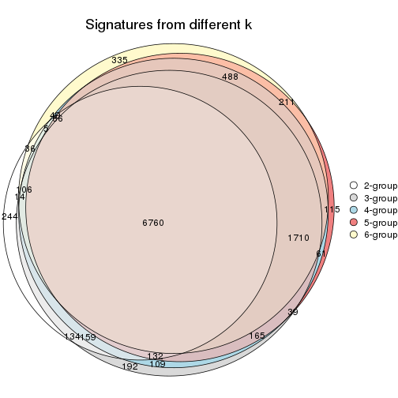

`get_signature()` returns a data frame invisibly. TO get the list of signatures, the function
call should be assigned to a variable explicitly. In following code, if `plot` argument is set
to `FALSE`, no heatmap is plotted while only the differential analysis is performed.

```r
# code only for demonstration
tb = get_signature(res, k = ..., plot = FALSE)
```

An example of the output of `tb` is:

```
#>   which_row         fdr    mean_1    mean_2 scaled_mean_1 scaled_mean_2 km
#> 1        38 0.042760348  8.373488  9.131774    -0.5533452     0.5164555  1
#> 2        40 0.018707592  7.106213  8.469186    -0.6173731     0.5762149  1
#> 3        55 0.019134737 10.221463 11.207825    -0.6159697     0.5749050  1
#> 4        59 0.006059896  5.921854  7.869574    -0.6899429     0.6439467  1
#> 5        60 0.018055526  8.928898 10.211722    -0.6204761     0.5791110  1
#> 6        98 0.009384629 15.714769 14.887706     0.6635654    -0.6193277  2
...
```

The columns in `tb` are:

1. `which_row`: row indices corresponding to the input matrix.
2. `fdr`: FDR for the differential test. 
3. `mean_x`: The mean value in group x.
4. `scaled_mean_x`: The mean value in group x after rows are scaled.
5. `km`: Row groups if k-means clustering is applied to rows.


UMAP plot which shows how samples are separated.


<script>
$( function() {
	$( '#tabs-MAD-skmeans-dimension-reduction' ).tabs();
} );
</script>
<div id='tabs-MAD-skmeans-dimension-reduction'>
<ul>
<li><a href='#tab-MAD-skmeans-dimension-reduction-1'>k = 2</a></li>
<li><a href='#tab-MAD-skmeans-dimension-reduction-2'>k = 3</a></li>
<li><a href='#tab-MAD-skmeans-dimension-reduction-3'>k = 4</a></li>
<li><a href='#tab-MAD-skmeans-dimension-reduction-4'>k = 5</a></li>
<li><a href='#tab-MAD-skmeans-dimension-reduction-5'>k = 6</a></li>
</ul>
<div id='tab-MAD-skmeans-dimension-reduction-1'>
<pre><code class="r">dimension_reduction(res, k = 2, method = &quot;UMAP&quot;)
</code></pre>

<p></p>

</div>
<div id='tab-MAD-skmeans-dimension-reduction-2'>
<pre><code class="r">dimension_reduction(res, k = 3, method = &quot;UMAP&quot;)
</code></pre>

<p></p>

</div>
<div id='tab-MAD-skmeans-dimension-reduction-3'>
<pre><code class="r">dimension_reduction(res, k = 4, method = &quot;UMAP&quot;)
</code></pre>

<p></p>

</div>
<div id='tab-MAD-skmeans-dimension-reduction-4'>
<pre><code class="r">dimension_reduction(res, k = 5, method = &quot;UMAP&quot;)
</code></pre>

<p></p>

</div>
<div id='tab-MAD-skmeans-dimension-reduction-5'>
<pre><code class="r">dimension_reduction(res, k = 6, method = &quot;UMAP&quot;)
</code></pre>

<p></p>

</div>
</div>


Following heatmap shows how subgroups are split when increasing `k`:

```r
collect_classes(res)
```


Test correlation between subgroups and known annotations. If the known
annotation is numeric, one-way ANOVA test is applied, and if the known
annotation is discrete, chi-squared contingency table test is applied.

```r
test_to_known_factors(res)
```

```
#>              n protocol(p) agent(p) individual(p) k
#> MAD:skmeans 84       1.000    0.769      1.22e-03 2
#> MAD:skmeans 83       0.895    0.973      6.95e-06 3
#> MAD:skmeans 81       0.868    0.997      3.28e-08 4
#> MAD:skmeans 71       0.850    0.979      8.45e-10 5
#> MAD:skmeans 72       0.775    0.994      2.58e-12 6
```


If matrix rows can be associated to genes, consider to use `functional_enrichment(res,
...)` to perform function enrichment for the signature genes. See [this vignette](http://bioconductor.org/packages/devel/bioc/vignettes/cola/inst/doc/functional_enrichment.html) for more detailed explanations.


 

---------------------------------------------------


### MAD:pam


The object with results only for a single top-value method and a single partition method 
can be extracted as:

```r
res = res_list["MAD", "pam"]
# you can also extract it by
# res = res_list["MAD:pam"]
```

A summary of `res` and all the functions that can be applied to it:

```r
res
```

```
#> A 'ConsensusPartition' object with k = 2, 3, 4, 5, 6.
#>   On a matrix with 15497 rows and 84 columns.
#>   Top rows (1000, 2000, 3000, 4000, 5000) are extracted by 'MAD' method.
#>   Subgroups are detected by 'pam' method.
#>   Performed in total 1250 partitions by row resampling.
#>   Best k for subgroups seems to be 2.
#> 
#> Following methods can be applied to this 'ConsensusPartition' object:
#>  [1] "cola_report"             "collect_classes"         "collect_plots"          
#>  [4] "collect_stats"           "colnames"                "compare_signatures"     
#>  [7] "consensus_heatmap"       "dimension_reduction"     "functional_enrichment"  
#> [10] "get_anno_col"            "get_anno"                "get_classes"            
#> [13] "get_consensus"           "get_matrix"              "get_membership"         
#> [16] "get_param"               "get_signatures"          "get_stats"              
#> [19] "is_best_k"               "is_stable_k"             "membership_heatmap"     
#> [22] "ncol"                    "nrow"                    "plot_ecdf"              
#> [25] "rownames"                "select_partition_number" "show"                   
#> [28] "suggest_best_k"          "test_to_known_factors"
```

`collect_plots()` function collects all the plots made from `res` for all `k` (number of partitions)
into one single page to provide an easy and fast comparison between different `k`.

```r
collect_plots(res)
```


The plots are:

- The first row: a plot of the ECDF (empirical cumulative distribution
  function) curves of the consensus matrix for each `k` and the heatmap of
  predicted classes for each `k`.
- The second row: heatmaps of the consensus matrix for each `k`.
- The third row: heatmaps of the membership matrix for each `k`.
- The fouth row: heatmaps of the signatures for each `k`.

All the plots in panels can be made by individual functions and they are
plotted later in this section.

`select_partition_number()` produces several plots showing different
statistics for choosing "optimized" `k`. There are following statistics:

- ECDF curves of the consensus matrix for each `k`;
- 1-PAC. [The PAC
  score](https://en.wikipedia.org/wiki/Consensus_clustering#Over-interpretation_potential_of_consensus_clustering)
  measures the proportion of the ambiguous subgrouping.
- Mean silhouette score.
- Concordance. The mean probability of fiting the consensus class ids in all
  partitions.
- Area increased. Denote $A_k$ as the area under the ECDF curve for current
  `k`, the area increased is defined as $A_k - A_{k-1}$.
- Rand index. The percent of pairs of samples that are both in a same cluster
  or both are not in a same cluster in the partition of k and k-1.
- Jaccard index. The ratio of pairs of samples are both in a same cluster in
  the partition of k and k-1 and the pairs of samples are both in a same
  cluster in the partition k or k-1.

The detailed explanations of these statistics can be found in [the _cola_
vignette](http://bioconductor.org/packages/devel/bioc/vignettes/cola/inst/doc/cola.html#toc_13).

Generally speaking, lower PAC score, higher mean silhouette score or higher
concordance corresponds to better partition. Rand index and Jaccard index
measure how similar the current partition is compared to partition with `k-1`.
If they are too similar, we won't accept `k` is better than `k-1`.

```r
select_partition_number(res)
```


The numeric values for all these statistics can be obtained by `get_stats()`.

```r
get_stats(res)
```

```
#>   k 1-PAC mean_silhouette concordance area_increased  Rand Jaccard
#> 2 2 0.560           0.823       0.916         0.4953 0.504   0.504
#> 3 3 0.525           0.736       0.827         0.3312 0.770   0.568
#> 4 4 0.679           0.807       0.867         0.1416 0.824   0.531
#> 5 5 0.675           0.721       0.819         0.0547 0.930   0.725
#> 6 6 0.740           0.749       0.843         0.0387 0.911   0.614
```

`suggest_best_k()` suggests the best $k$ based on these statistics. The rules are as follows:

- All $k$ with Jaccard index larger than 0.95 are removed because increasing
  $k$ does not provide enough extra information. If all $k$ are removed, it is
  marked as no subgroup is detected.
- For all $k$ with 1-PAC score larger than 0.9, the maximal $k$ is taken as
  the best $k$, and other $k$ are marked as optional $k$.
- If it does not fit the second rule. The $k$ with the maximal vote of the
  highest 1-PAC score, highest mean silhouette, and highest concordance is
  taken as the best $k$.

```r
suggest_best_k(res)
```

```
#> [1] 2
```


Following shows the table of the partitions (You need to click the **show/hide
code output** link to see it). The membership matrix (columns with name `p*`)
is inferred by
[`clue::cl_consensus()`](https://www.rdocumentation.org/link/cl_consensus?package=clue)
function with the `SE` method. Basically the value in the membership matrix
represents the probability to belong to a certain group. The finall class
label for an item is determined with the group with highest probability it
belongs to.

In `get_classes()` function, the entropy is calculated from the membership
matrix and the silhouette score is calculated from the consensus matrix.


<script>
$( function() {
	$( '#tabs-MAD-pam-get-classes' ).tabs();
} );
</script>
<div id='tabs-MAD-pam-get-classes'>
<ul>
<li><a href='#tab-MAD-pam-get-classes-1'>k = 2</a></li>
<li><a href='#tab-MAD-pam-get-classes-2'>k = 3</a></li>
<li><a href='#tab-MAD-pam-get-classes-3'>k = 4</a></li>
<li><a href='#tab-MAD-pam-get-classes-4'>k = 5</a></li>
<li><a href='#tab-MAD-pam-get-classes-5'>k = 6</a></li>
</ul>

<div id='tab-MAD-pam-get-classes-1'>
<p><a id='tab-MAD-pam-get-classes-1-a' style='color:#0366d6' href='#'>show/hide code output</a></p>
<pre><code class="r">cbind(get_classes(res, k = 2), get_membership(res, k = 2))
</code></pre>

<pre><code>#&gt;           class entropy silhouette    p1    p2
#&gt; GSM339455     1  0.3274      0.879 0.940 0.060
#&gt; GSM339456     2  0.5059      0.852 0.112 0.888
#&gt; GSM339457     1  0.9427      0.493 0.640 0.360
#&gt; GSM339458     1  0.9209      0.611 0.664 0.336
#&gt; GSM339459     2  0.5519      0.837 0.128 0.872
#&gt; GSM339460     2  0.3274      0.886 0.060 0.940
#&gt; GSM339461     2  0.0376      0.926 0.004 0.996
#&gt; GSM339462     1  0.0000      0.886 1.000 0.000
#&gt; GSM339463     1  0.3114      0.880 0.944 0.056
#&gt; GSM339464     1  0.5519      0.828 0.872 0.128
#&gt; GSM339465     1  0.2043      0.883 0.968 0.032
#&gt; GSM339466     2  0.0000      0.928 0.000 1.000
#&gt; GSM339467     2  0.0000      0.928 0.000 1.000
#&gt; GSM339468     2  0.4161      0.875 0.084 0.916
#&gt; GSM339469     1  0.5059      0.838 0.888 0.112
#&gt; GSM339470     1  0.8713      0.670 0.708 0.292
#&gt; GSM339471     1  0.0000      0.886 1.000 0.000
#&gt; GSM339472     2  0.0000      0.928 0.000 1.000
#&gt; GSM339473     1  0.1184      0.885 0.984 0.016
#&gt; GSM339474     2  0.0000      0.928 0.000 1.000
#&gt; GSM339475     1  0.1633      0.885 0.976 0.024
#&gt; GSM339476     1  0.1843      0.882 0.972 0.028
#&gt; GSM339477     2  0.2043      0.910 0.032 0.968
#&gt; GSM339478     2  0.9710      0.215 0.400 0.600
#&gt; GSM339479     1  0.5294      0.833 0.880 0.120
#&gt; GSM339480     2  0.6343      0.804 0.160 0.840
#&gt; GSM339481     2  0.0000      0.928 0.000 1.000
#&gt; GSM339482     1  0.1633      0.885 0.976 0.024
#&gt; GSM339483     1  0.3431      0.861 0.936 0.064
#&gt; GSM339484     1  0.0000      0.886 1.000 0.000
#&gt; GSM339485     1  0.6343      0.802 0.840 0.160
#&gt; GSM339486     1  0.0376      0.886 0.996 0.004
#&gt; GSM339487     2  0.0000      0.928 0.000 1.000
#&gt; GSM339488     2  0.0000      0.928 0.000 1.000
#&gt; GSM339489     2  0.5519      0.837 0.128 0.872
#&gt; GSM339490     1  0.4690      0.841 0.900 0.100
#&gt; GSM339491     1  0.7453      0.738 0.788 0.212
#&gt; GSM339492     1  0.0000      0.886 1.000 0.000
#&gt; GSM339493     2  0.0000      0.928 0.000 1.000
#&gt; GSM339494     1  0.0000      0.886 1.000 0.000
#&gt; GSM339495     2  0.0000      0.928 0.000 1.000
#&gt; GSM339496     1  0.1633      0.885 0.976 0.024
#&gt; GSM339497     2  0.6247      0.764 0.156 0.844
#&gt; GSM339498     1  0.9922      0.265 0.552 0.448
#&gt; GSM339499     1  0.7883      0.711 0.764 0.236
#&gt; GSM339500     2  0.9998     -0.194 0.492 0.508
#&gt; GSM339501     1  0.7376      0.732 0.792 0.208
#&gt; GSM339502     2  0.0000      0.928 0.000 1.000
#&gt; GSM339503     1  0.5629      0.820 0.868 0.132
#&gt; GSM339504     1  0.0000      0.886 1.000 0.000
#&gt; GSM339505     1  0.8713      0.670 0.708 0.292
#&gt; GSM339506     1  0.0000      0.886 1.000 0.000
#&gt; GSM339507     1  0.1843      0.882 0.972 0.028
#&gt; GSM339508     2  0.0000      0.928 0.000 1.000
#&gt; GSM339509     2  0.0000      0.928 0.000 1.000
#&gt; GSM339510     2  0.2236      0.909 0.036 0.964
#&gt; GSM339511     2  0.8763      0.542 0.296 0.704
#&gt; GSM339512     2  0.0000      0.928 0.000 1.000
#&gt; GSM339513     1  0.0000      0.886 1.000 0.000
#&gt; GSM339514     2  0.0000      0.928 0.000 1.000
#&gt; GSM339515     1  0.0000      0.886 1.000 0.000
#&gt; GSM339516     2  0.0000      0.928 0.000 1.000
#&gt; GSM339517     1  0.7528      0.733 0.784 0.216
#&gt; GSM339518     2  0.0000      0.928 0.000 1.000
#&gt; GSM339519     1  0.2043      0.883 0.968 0.032
#&gt; GSM339520     1  0.9815      0.358 0.580 0.420
#&gt; GSM339521     2  0.0000      0.928 0.000 1.000
#&gt; GSM339522     2  0.0000      0.928 0.000 1.000
#&gt; GSM339523     2  0.0000      0.928 0.000 1.000
#&gt; GSM339524     1  0.0000      0.886 1.000 0.000
#&gt; GSM339525     1  0.0000      0.886 1.000 0.000
#&gt; GSM339526     1  0.1633      0.885 0.976 0.024
#&gt; GSM339527     1  0.0000      0.886 1.000 0.000
#&gt; GSM339528     1  0.1843      0.882 0.972 0.028
#&gt; GSM339529     2  0.0000      0.928 0.000 1.000
#&gt; GSM339530     1  0.9248      0.538 0.660 0.340
#&gt; GSM339531     2  0.3274      0.895 0.060 0.940
#&gt; GSM339532     1  0.8016      0.711 0.756 0.244
#&gt; GSM339533     1  0.1633      0.885 0.976 0.024
#&gt; GSM339534     1  0.2778      0.876 0.952 0.048
#&gt; GSM339535     2  0.0000      0.928 0.000 1.000
#&gt; GSM339536     1  0.0000      0.886 1.000 0.000
#&gt; GSM339537     2  0.0000      0.928 0.000 1.000
#&gt; GSM339538     1  0.0000      0.886 1.000 0.000
</code></pre>

<script>
$('#tab-MAD-pam-get-classes-1-a').parent().next().next().hide();
$('#tab-MAD-pam-get-classes-1-a').click(function(){
  $('#tab-MAD-pam-get-classes-1-a').parent().next().next().toggle();
  return(false);
});
</script>
</div>

<div id='tab-MAD-pam-get-classes-2'>
<p><a id='tab-MAD-pam-get-classes-2-a' style='color:#0366d6' href='#'>show/hide code output</a></p>
<pre><code class="r">cbind(get_classes(res, k = 3), get_membership(res, k = 3))
</code></pre>

<pre><code>#&gt;           class entropy silhouette    p1    p2    p3
#&gt; GSM339455     3  0.5435      0.768 0.192 0.024 0.784
#&gt; GSM339456     2  0.4859      0.798 0.044 0.840 0.116
#&gt; GSM339457     3  0.6437      0.778 0.220 0.048 0.732
#&gt; GSM339458     3  0.9674      0.387 0.392 0.212 0.396
#&gt; GSM339459     2  0.7481      0.696 0.048 0.596 0.356
#&gt; GSM339460     2  0.2173      0.840 0.048 0.944 0.008
#&gt; GSM339461     2  0.2689      0.855 0.036 0.932 0.032
#&gt; GSM339462     1  0.0424      0.785 0.992 0.000 0.008
#&gt; GSM339463     3  0.5835      0.694 0.340 0.000 0.660
#&gt; GSM339464     1  0.2663      0.772 0.932 0.044 0.024
#&gt; GSM339465     3  0.4842      0.786 0.224 0.000 0.776
#&gt; GSM339466     2  0.5627      0.828 0.032 0.780 0.188
#&gt; GSM339467     2  0.0000      0.865 0.000 1.000 0.000
#&gt; GSM339468     2  0.6744      0.762 0.032 0.668 0.300
#&gt; GSM339469     1  0.1999      0.778 0.952 0.012 0.036
#&gt; GSM339470     3  0.5406      0.786 0.224 0.012 0.764
#&gt; GSM339471     1  0.4062      0.694 0.836 0.000 0.164
#&gt; GSM339472     2  0.0000      0.865 0.000 1.000 0.000
#&gt; GSM339473     1  0.2165      0.773 0.936 0.000 0.064
#&gt; GSM339474     2  0.0000      0.865 0.000 1.000 0.000
#&gt; GSM339475     3  0.4555      0.782 0.200 0.000 0.800
#&gt; GSM339476     1  0.4974      0.718 0.764 0.000 0.236
#&gt; GSM339477     2  0.1453      0.864 0.024 0.968 0.008
#&gt; GSM339478     3  0.7208      0.109 0.040 0.340 0.620
#&gt; GSM339479     1  0.4062      0.656 0.836 0.000 0.164
#&gt; GSM339480     2  0.7499      0.691 0.048 0.592 0.360
#&gt; GSM339481     2  0.0000      0.865 0.000 1.000 0.000
#&gt; GSM339482     3  0.4555      0.782 0.200 0.000 0.800
#&gt; GSM339483     1  0.5627      0.690 0.780 0.032 0.188
#&gt; GSM339484     3  0.5497      0.748 0.292 0.000 0.708
#&gt; GSM339485     1  0.4146      0.752 0.876 0.044 0.080
#&gt; GSM339486     3  0.5968      0.664 0.364 0.000 0.636
#&gt; GSM339487     2  0.5536      0.828 0.024 0.776 0.200
#&gt; GSM339488     2  0.0592      0.860 0.000 0.988 0.012
#&gt; GSM339489     2  0.7246      0.746 0.052 0.648 0.300
#&gt; GSM339490     1  0.5743      0.700 0.784 0.044 0.172
#&gt; GSM339491     3  0.4796      0.786 0.220 0.000 0.780
#&gt; GSM339492     1  0.3340      0.742 0.880 0.000 0.120
#&gt; GSM339493     2  0.0000      0.865 0.000 1.000 0.000
#&gt; GSM339494     1  0.2878      0.764 0.904 0.000 0.096
#&gt; GSM339495     2  0.0000      0.865 0.000 1.000 0.000
#&gt; GSM339496     3  0.4931      0.784 0.232 0.000 0.768
#&gt; GSM339497     2  0.6756      0.798 0.056 0.712 0.232
#&gt; GSM339498     3  0.5497      0.457 0.048 0.148 0.804
#&gt; GSM339499     3  0.5506      0.787 0.220 0.016 0.764
#&gt; GSM339500     3  0.9587      0.537 0.224 0.308 0.468
#&gt; GSM339501     1  0.8825      0.472 0.532 0.132 0.336
#&gt; GSM339502     2  0.0000      0.865 0.000 1.000 0.000
#&gt; GSM339503     3  0.4750      0.776 0.216 0.000 0.784
#&gt; GSM339504     1  0.0424      0.785 0.992 0.000 0.008
#&gt; GSM339505     3  0.8063      0.708 0.224 0.132 0.644
#&gt; GSM339506     1  0.5138      0.492 0.748 0.000 0.252
#&gt; GSM339507     3  0.4842      0.786 0.224 0.000 0.776
#&gt; GSM339508     2  0.0000      0.865 0.000 1.000 0.000
#&gt; GSM339509     2  0.0000      0.865 0.000 1.000 0.000
#&gt; GSM339510     2  0.6867      0.766 0.040 0.672 0.288
#&gt; GSM339511     1  0.5791      0.697 0.784 0.048 0.168
#&gt; GSM339512     3  0.6274      0.332 0.000 0.456 0.544
#&gt; GSM339513     1  0.5098      0.621 0.752 0.000 0.248
#&gt; GSM339514     2  0.0000      0.865 0.000 1.000 0.000
#&gt; GSM339515     1  0.2066      0.774 0.940 0.000 0.060
#&gt; GSM339516     2  0.5741      0.827 0.036 0.776 0.188
#&gt; GSM339517     3  0.4605      0.780 0.204 0.000 0.796
#&gt; GSM339518     2  0.4912      0.836 0.008 0.796 0.196
#&gt; GSM339519     3  0.1753      0.587 0.048 0.000 0.952
#&gt; GSM339520     3  0.6416      0.617 0.032 0.260 0.708
#&gt; GSM339521     2  0.0000      0.865 0.000 1.000 0.000
#&gt; GSM339522     2  0.5842      0.824 0.036 0.768 0.196
#&gt; GSM339523     2  0.0000      0.865 0.000 1.000 0.000
#&gt; GSM339524     3  0.6062      0.555 0.384 0.000 0.616
#&gt; GSM339525     1  0.1529      0.777 0.960 0.000 0.040
#&gt; GSM339526     3  0.4931      0.784 0.232 0.000 0.768
#&gt; GSM339527     1  0.6260      0.301 0.552 0.000 0.448
#&gt; GSM339528     3  0.6140      0.629 0.404 0.000 0.596
#&gt; GSM339529     2  0.4399      0.837 0.000 0.812 0.188
#&gt; GSM339530     3  0.6621      0.591 0.032 0.284 0.684
#&gt; GSM339531     2  0.6823      0.762 0.036 0.668 0.296
#&gt; GSM339532     1  0.6354      0.682 0.748 0.056 0.196
#&gt; GSM339533     3  0.4796      0.786 0.220 0.000 0.780
#&gt; GSM339534     1  0.1753      0.776 0.952 0.000 0.048
#&gt; GSM339535     2  0.2537      0.862 0.000 0.920 0.080
#&gt; GSM339536     1  0.2711      0.766 0.912 0.000 0.088
#&gt; GSM339537     2  0.5508      0.829 0.028 0.784 0.188
#&gt; GSM339538     3  0.4605      0.780 0.204 0.000 0.796
</code></pre>

<script>
$('#tab-MAD-pam-get-classes-2-a').parent().next().next().hide();
$('#tab-MAD-pam-get-classes-2-a').click(function(){
  $('#tab-MAD-pam-get-classes-2-a').parent().next().next().toggle();
  return(false);
});
</script>
</div>

<div id='tab-MAD-pam-get-classes-3'>
<p><a id='tab-MAD-pam-get-classes-3-a' style='color:#0366d6' href='#'>show/hide code output</a></p>
<pre><code class="r">cbind(get_classes(res, k = 4), get_membership(res, k = 4))
</code></pre>

<pre><code>#&gt;           class entropy silhouette    p1    p2    p3    p4
#&gt; GSM339455     4  0.5050      0.633 0.028 0.000 0.268 0.704
#&gt; GSM339456     2  0.4824      0.749 0.000 0.780 0.076 0.144
#&gt; GSM339457     3  0.2111      0.882 0.024 0.000 0.932 0.044
#&gt; GSM339458     4  0.7844      0.535 0.028 0.216 0.208 0.548
#&gt; GSM339459     4  0.2831      0.810 0.004 0.000 0.120 0.876
#&gt; GSM339460     2  0.2075      0.855 0.044 0.936 0.016 0.004
#&gt; GSM339461     2  0.4644      0.734 0.000 0.748 0.024 0.228
#&gt; GSM339462     1  0.0376      0.889 0.992 0.000 0.004 0.004
#&gt; GSM339463     3  0.2996      0.867 0.064 0.000 0.892 0.044
#&gt; GSM339464     1  0.1109      0.883 0.968 0.004 0.000 0.028
#&gt; GSM339465     3  0.2845      0.864 0.028 0.000 0.896 0.076
#&gt; GSM339466     4  0.2635      0.834 0.000 0.076 0.020 0.904
#&gt; GSM339467     2  0.0000      0.875 0.000 1.000 0.000 0.000
#&gt; GSM339468     4  0.3229      0.831 0.000 0.048 0.072 0.880
#&gt; GSM339469     1  0.0564      0.890 0.988 0.004 0.004 0.004
#&gt; GSM339470     3  0.2521      0.868 0.024 0.000 0.912 0.064
#&gt; GSM339471     1  0.4281      0.794 0.792 0.000 0.180 0.028
#&gt; GSM339472     2  0.0921      0.872 0.000 0.972 0.000 0.028
#&gt; GSM339473     1  0.3497      0.845 0.860 0.000 0.104 0.036
#&gt; GSM339474     2  0.1302      0.870 0.000 0.956 0.000 0.044
#&gt; GSM339475     3  0.1978      0.874 0.004 0.000 0.928 0.068
#&gt; GSM339476     1  0.2313      0.888 0.924 0.000 0.032 0.044
#&gt; GSM339477     2  0.1302      0.870 0.000 0.956 0.000 0.044
#&gt; GSM339478     4  0.4622      0.796 0.004 0.060 0.136 0.800
#&gt; GSM339479     4  0.7491      0.447 0.260 0.008 0.192 0.540
#&gt; GSM339480     4  0.3161      0.811 0.012 0.000 0.124 0.864
#&gt; GSM339481     2  0.0000      0.875 0.000 1.000 0.000 0.000
#&gt; GSM339482     3  0.2125      0.873 0.004 0.000 0.920 0.076
#&gt; GSM339483     1  0.1109      0.884 0.968 0.000 0.004 0.028
#&gt; GSM339484     3  0.2142      0.888 0.056 0.000 0.928 0.016
#&gt; GSM339485     1  0.1109      0.883 0.968 0.004 0.000 0.028
#&gt; GSM339486     3  0.3032      0.852 0.124 0.000 0.868 0.008
#&gt; GSM339487     4  0.2473      0.834 0.000 0.080 0.012 0.908
#&gt; GSM339488     2  0.0895      0.867 0.000 0.976 0.020 0.004
#&gt; GSM339489     4  0.3659      0.830 0.032 0.016 0.084 0.868
#&gt; GSM339490     1  0.1109      0.883 0.968 0.004 0.000 0.028
#&gt; GSM339491     3  0.1406      0.891 0.024 0.000 0.960 0.016
#&gt; GSM339492     1  0.3279      0.865 0.872 0.000 0.096 0.032
#&gt; GSM339493     2  0.3356      0.771 0.000 0.824 0.000 0.176
#&gt; GSM339494     1  0.3009      0.878 0.892 0.000 0.056 0.052
#&gt; GSM339495     2  0.2149      0.854 0.000 0.912 0.000 0.088
#&gt; GSM339496     3  0.1929      0.889 0.024 0.000 0.940 0.036
#&gt; GSM339497     4  0.3571      0.826 0.008 0.036 0.088 0.868
#&gt; GSM339498     4  0.3547      0.795 0.016 0.000 0.144 0.840
#&gt; GSM339499     3  0.1151      0.891 0.024 0.000 0.968 0.008
#&gt; GSM339500     2  0.7838      0.443 0.024 0.528 0.272 0.176
#&gt; GSM339501     4  0.4879      0.785 0.128 0.000 0.092 0.780
#&gt; GSM339502     2  0.0188      0.875 0.000 0.996 0.004 0.000
#&gt; GSM339503     3  0.2329      0.870 0.012 0.000 0.916 0.072
#&gt; GSM339504     1  0.0524      0.889 0.988 0.000 0.008 0.004
#&gt; GSM339505     3  0.2949      0.859 0.024 0.000 0.888 0.088
#&gt; GSM339506     1  0.4606      0.644 0.724 0.000 0.264 0.012
#&gt; GSM339507     3  0.2797      0.876 0.032 0.000 0.900 0.068
#&gt; GSM339508     2  0.2530      0.838 0.000 0.888 0.000 0.112
#&gt; GSM339509     2  0.0188      0.875 0.000 0.996 0.004 0.000
#&gt; GSM339510     4  0.2484      0.840 0.040 0.024 0.012 0.924
#&gt; GSM339511     1  0.1610      0.880 0.952 0.016 0.000 0.032
#&gt; GSM339512     3  0.5416      0.555 0.000 0.260 0.692 0.048
#&gt; GSM339513     1  0.6249      0.509 0.592 0.000 0.336 0.072
#&gt; GSM339514     2  0.0000      0.875 0.000 1.000 0.000 0.000
#&gt; GSM339515     1  0.2670      0.878 0.904 0.000 0.072 0.024
#&gt; GSM339516     4  0.2281      0.830 0.000 0.096 0.000 0.904
#&gt; GSM339517     3  0.2053      0.872 0.004 0.000 0.924 0.072
#&gt; GSM339518     4  0.4139      0.801 0.000 0.144 0.040 0.816
#&gt; GSM339519     3  0.3831      0.745 0.004 0.000 0.792 0.204
#&gt; GSM339520     2  0.4434      0.721 0.016 0.772 0.208 0.004
#&gt; GSM339521     2  0.2011      0.856 0.000 0.920 0.000 0.080
#&gt; GSM339522     4  0.2281      0.830 0.000 0.096 0.000 0.904
#&gt; GSM339523     2  0.0000      0.875 0.000 1.000 0.000 0.000
#&gt; GSM339524     3  0.5966      0.488 0.280 0.000 0.648 0.072
#&gt; GSM339525     1  0.0895      0.890 0.976 0.000 0.020 0.004
#&gt; GSM339526     3  0.2124      0.889 0.028 0.000 0.932 0.040
#&gt; GSM339527     1  0.5250      0.564 0.660 0.000 0.316 0.024
#&gt; GSM339528     3  0.3876      0.847 0.124 0.000 0.836 0.040
#&gt; GSM339529     4  0.3219      0.789 0.000 0.164 0.000 0.836
#&gt; GSM339530     2  0.5360      0.223 0.000 0.552 0.436 0.012
#&gt; GSM339531     4  0.3216      0.830 0.000 0.044 0.076 0.880
#&gt; GSM339532     1  0.2408      0.861 0.920 0.036 0.000 0.044
#&gt; GSM339533     3  0.1004      0.891 0.024 0.000 0.972 0.004
#&gt; GSM339534     1  0.3383      0.858 0.872 0.000 0.052 0.076
#&gt; GSM339535     4  0.4456      0.688 0.000 0.280 0.004 0.716
#&gt; GSM339536     1  0.2844      0.879 0.900 0.000 0.048 0.052
#&gt; GSM339537     4  0.2281      0.830 0.000 0.096 0.000 0.904
#&gt; GSM339538     3  0.2053      0.872 0.004 0.000 0.924 0.072
</code></pre>

<script>
$('#tab-MAD-pam-get-classes-3-a').parent().next().next().hide();
$('#tab-MAD-pam-get-classes-3-a').click(function(){
  $('#tab-MAD-pam-get-classes-3-a').parent().next().next().toggle();
  return(false);
});
</script>
</div>

<div id='tab-MAD-pam-get-classes-4'>
<p><a id='tab-MAD-pam-get-classes-4-a' style='color:#0366d6' href='#'>show/hide code output</a></p>
<pre><code class="r">cbind(get_classes(res, k = 5), get_membership(res, k = 5))
</code></pre>

<pre><code>#&gt;           class entropy silhouette    p1    p2    p3    p4    p5
#&gt; GSM339455     5  0.4714      0.421 0.004 0.000 0.372 0.016 0.608
#&gt; GSM339456     2  0.4785      0.745 0.004 0.732 0.088 0.000 0.176
#&gt; GSM339457     3  0.2983      0.706 0.056 0.000 0.868 0.000 0.076
#&gt; GSM339458     5  0.6146      0.217 0.000 0.116 0.392 0.004 0.488
#&gt; GSM339459     5  0.3791      0.754 0.076 0.000 0.112 0.000 0.812
#&gt; GSM339460     2  0.2316      0.847 0.000 0.916 0.036 0.036 0.012
#&gt; GSM339461     2  0.5124      0.637 0.068 0.644 0.000 0.000 0.288
#&gt; GSM339462     4  0.0290      0.905 0.000 0.000 0.000 0.992 0.008
#&gt; GSM339463     3  0.2504      0.732 0.004 0.000 0.900 0.032 0.064
#&gt; GSM339464     4  0.0000      0.905 0.000 0.000 0.000 1.000 0.000
#&gt; GSM339465     3  0.2409      0.730 0.032 0.000 0.900 0.000 0.068
#&gt; GSM339466     5  0.0404      0.806 0.000 0.012 0.000 0.000 0.988
#&gt; GSM339467     2  0.0000      0.866 0.000 1.000 0.000 0.000 0.000
#&gt; GSM339468     5  0.1704      0.794 0.000 0.004 0.068 0.000 0.928
#&gt; GSM339469     4  0.0162      0.905 0.000 0.000 0.004 0.996 0.000
#&gt; GSM339470     3  0.1544      0.740 0.000 0.000 0.932 0.000 0.068
#&gt; GSM339471     1  0.5396      0.785 0.688 0.000 0.156 0.148 0.008
#&gt; GSM339472     2  0.1792      0.859 0.000 0.916 0.000 0.000 0.084
#&gt; GSM339473     1  0.2927      0.785 0.872 0.000 0.060 0.068 0.000
#&gt; GSM339474     2  0.2179      0.852 0.000 0.888 0.000 0.000 0.112
#&gt; GSM339475     3  0.2707      0.708 0.132 0.000 0.860 0.000 0.008
#&gt; GSM339476     4  0.3183      0.814 0.020 0.000 0.048 0.872 0.060
#&gt; GSM339477     2  0.2280      0.851 0.000 0.880 0.000 0.000 0.120
#&gt; GSM339478     5  0.6098      0.351 0.020 0.084 0.344 0.000 0.552
#&gt; GSM339479     5  0.6718      0.169 0.004 0.012 0.368 0.148 0.468
#&gt; GSM339480     5  0.3839      0.757 0.072 0.000 0.108 0.004 0.816
#&gt; GSM339481     2  0.0162      0.866 0.000 0.996 0.000 0.000 0.004
#&gt; GSM339482     1  0.4533      0.305 0.544 0.000 0.448 0.000 0.008
#&gt; GSM339483     4  0.0290      0.905 0.000 0.000 0.000 0.992 0.008
#&gt; GSM339484     3  0.4040      0.533 0.000 0.000 0.712 0.276 0.012
#&gt; GSM339485     4  0.0000      0.905 0.000 0.000 0.000 1.000 0.000
#&gt; GSM339486     3  0.4779      0.508 0.024 0.000 0.672 0.292 0.012
#&gt; GSM339487     5  0.0510      0.806 0.000 0.016 0.000 0.000 0.984
#&gt; GSM339488     2  0.0000      0.866 0.000 1.000 0.000 0.000 0.000
#&gt; GSM339489     5  0.3117      0.783 0.004 0.000 0.100 0.036 0.860
#&gt; GSM339490     4  0.0000      0.905 0.000 0.000 0.000 1.000 0.000
#&gt; GSM339491     3  0.0703      0.750 0.000 0.000 0.976 0.000 0.024
#&gt; GSM339492     1  0.5533      0.776 0.672 0.000 0.144 0.176 0.008
#&gt; GSM339493     2  0.3586      0.723 0.000 0.736 0.000 0.000 0.264
#&gt; GSM339494     1  0.2830      0.785 0.876 0.000 0.044 0.080 0.000
#&gt; GSM339495     2  0.2773      0.833 0.000 0.836 0.000 0.000 0.164
#&gt; GSM339496     3  0.1670      0.744 0.052 0.000 0.936 0.000 0.012
#&gt; GSM339497     5  0.1956      0.789 0.000 0.008 0.076 0.000 0.916
#&gt; GSM339498     5  0.4275      0.747 0.076 0.000 0.120 0.012 0.792
#&gt; GSM339499     3  0.1502      0.743 0.056 0.000 0.940 0.000 0.004
#&gt; GSM339500     3  0.6398      0.407 0.012 0.204 0.568 0.000 0.216
#&gt; GSM339501     5  0.4583      0.709 0.004 0.000 0.064 0.192 0.740
#&gt; GSM339502     2  0.0000      0.866 0.000 1.000 0.000 0.000 0.000
#&gt; GSM339503     3  0.2796      0.698 0.116 0.000 0.868 0.008 0.008
#&gt; GSM339504     4  0.0290      0.905 0.000 0.000 0.000 0.992 0.008
#&gt; GSM339505     3  0.1671      0.741 0.000 0.000 0.924 0.000 0.076
#&gt; GSM339506     4  0.4217      0.551 0.012 0.000 0.280 0.704 0.004
#&gt; GSM339507     3  0.4126      0.307 0.380 0.000 0.620 0.000 0.000
#&gt; GSM339508     2  0.3242      0.789 0.000 0.784 0.000 0.000 0.216
#&gt; GSM339509     2  0.0000      0.866 0.000 1.000 0.000 0.000 0.000
#&gt; GSM339510     5  0.1341      0.800 0.000 0.000 0.000 0.056 0.944
#&gt; GSM339511     4  0.1478      0.870 0.000 0.000 0.000 0.936 0.064
#&gt; GSM339512     3  0.6290      0.138 0.000 0.332 0.500 0.000 0.168
#&gt; GSM339513     1  0.4233      0.779 0.792 0.000 0.116 0.084 0.008
#&gt; GSM339514     2  0.0000      0.866 0.000 1.000 0.000 0.000 0.000
#&gt; GSM339515     1  0.2914      0.785 0.872 0.000 0.052 0.076 0.000
#&gt; GSM339516     5  0.0404      0.806 0.000 0.012 0.000 0.000 0.988
#&gt; GSM339517     3  0.3980      0.512 0.284 0.000 0.708 0.000 0.008
#&gt; GSM339518     5  0.3639      0.759 0.000 0.144 0.044 0.000 0.812
#&gt; GSM339519     1  0.4197      0.668 0.728 0.000 0.244 0.000 0.028
#&gt; GSM339520     2  0.4970      0.329 0.020 0.580 0.392 0.000 0.008
#&gt; GSM339521     2  0.4098      0.804 0.000 0.780 0.064 0.000 0.156
#&gt; GSM339522     5  0.0404      0.806 0.000 0.012 0.000 0.000 0.988
#&gt; GSM339523     2  0.0000      0.866 0.000 1.000 0.000 0.000 0.000
#&gt; GSM339524     1  0.4153      0.721 0.740 0.000 0.236 0.016 0.008
#&gt; GSM339525     4  0.0162      0.905 0.000 0.000 0.004 0.996 0.000
#&gt; GSM339526     3  0.1894      0.736 0.072 0.000 0.920 0.000 0.008
#&gt; GSM339527     4  0.4133      0.640 0.012 0.000 0.232 0.744 0.012
#&gt; GSM339528     3  0.5548      0.450 0.012 0.000 0.612 0.312 0.064
#&gt; GSM339529     5  0.1965      0.763 0.000 0.096 0.000 0.000 0.904
#&gt; GSM339530     2  0.3110      0.776 0.028 0.856 0.112 0.000 0.004
#&gt; GSM339531     5  0.1928      0.793 0.004 0.004 0.072 0.000 0.920
#&gt; GSM339532     4  0.2488      0.807 0.000 0.004 0.000 0.872 0.124
#&gt; GSM339533     3  0.0290      0.747 0.000 0.000 0.992 0.000 0.008
#&gt; GSM339534     1  0.5925      0.727 0.672 0.000 0.072 0.188 0.068
#&gt; GSM339535     5  0.3612      0.657 0.000 0.268 0.000 0.000 0.732
#&gt; GSM339536     1  0.2793      0.785 0.876 0.000 0.036 0.088 0.000
#&gt; GSM339537     5  0.0510      0.806 0.000 0.016 0.000 0.000 0.984
#&gt; GSM339538     1  0.3487      0.720 0.780 0.000 0.212 0.000 0.008
</code></pre>

<script>
$('#tab-MAD-pam-get-classes-4-a').parent().next().next().hide();
$('#tab-MAD-pam-get-classes-4-a').click(function(){
  $('#tab-MAD-pam-get-classes-4-a').parent().next().next().toggle();
  return(false);
});
</script>
</div>

<div id='tab-MAD-pam-get-classes-5'>
<p><a id='tab-MAD-pam-get-classes-5-a' style='color:#0366d6' href='#'>show/hide code output</a></p>
<pre><code class="r">cbind(get_classes(res, k = 6), get_membership(res, k = 6))
</code></pre>

<pre><code>#&gt;           class entropy silhouette    p1    p2    p3    p4    p5    p6
#&gt; GSM339455     3  0.5460      0.219 0.000 0.000 0.492 0.004 0.396 0.108
#&gt; GSM339456     2  0.4784      0.593 0.000 0.624 0.048 0.000 0.316 0.012
#&gt; GSM339457     6  0.1910      0.831 0.000 0.000 0.108 0.000 0.000 0.892
#&gt; GSM339458     3  0.3045      0.737 0.000 0.060 0.840 0.000 0.100 0.000
#&gt; GSM339459     5  0.4307      0.663 0.000 0.000 0.072 0.000 0.704 0.224
#&gt; GSM339460     2  0.2577      0.798 0.000 0.884 0.072 0.032 0.012 0.000
#&gt; GSM339461     2  0.5640      0.540 0.000 0.580 0.032 0.000 0.292 0.096
#&gt; GSM339462     4  0.0146      0.917 0.000 0.000 0.000 0.996 0.004 0.000
#&gt; GSM339463     3  0.1801      0.773 0.000 0.000 0.924 0.016 0.004 0.056
#&gt; GSM339464     4  0.0000      0.917 0.000 0.000 0.000 1.000 0.000 0.000
#&gt; GSM339465     3  0.1829      0.777 0.036 0.000 0.928 0.000 0.028 0.008
#&gt; GSM339466     5  0.0405      0.842 0.000 0.004 0.008 0.000 0.988 0.000
#&gt; GSM339467     2  0.0146      0.833 0.000 0.996 0.000 0.000 0.000 0.004
#&gt; GSM339468     5  0.1010      0.837 0.000 0.004 0.036 0.000 0.960 0.000
#&gt; GSM339469     4  0.0146      0.916 0.000 0.000 0.004 0.996 0.000 0.000
#&gt; GSM339470     3  0.1713      0.772 0.000 0.000 0.928 0.000 0.028 0.044
#&gt; GSM339471     1  0.4427      0.788 0.764 0.000 0.108 0.100 0.008 0.020
#&gt; GSM339472     2  0.1910      0.834 0.000 0.892 0.000 0.000 0.108 0.000
#&gt; GSM339473     1  0.0000      0.804 1.000 0.000 0.000 0.000 0.000 0.000
#&gt; GSM339474     2  0.2378      0.824 0.000 0.848 0.000 0.000 0.152 0.000
#&gt; GSM339475     6  0.1219      0.749 0.004 0.000 0.048 0.000 0.000 0.948
#&gt; GSM339476     4  0.2657      0.820 0.000 0.000 0.076 0.880 0.024 0.020
#&gt; GSM339477     2  0.2416      0.823 0.000 0.844 0.000 0.000 0.156 0.000
#&gt; GSM339478     6  0.3124      0.831 0.000 0.028 0.100 0.000 0.024 0.848
#&gt; GSM339479     3  0.3626      0.749 0.000 0.012 0.812 0.092 0.084 0.000
#&gt; GSM339480     5  0.3352      0.752 0.000 0.000 0.072 0.000 0.816 0.112
#&gt; GSM339481     2  0.0363      0.836 0.000 0.988 0.000 0.000 0.012 0.000
#&gt; GSM339482     3  0.5607      0.170 0.304 0.000 0.556 0.000 0.012 0.128
#&gt; GSM339483     4  0.0146      0.917 0.000 0.000 0.000 0.996 0.004 0.000
#&gt; GSM339484     3  0.2274      0.764 0.000 0.000 0.892 0.088 0.008 0.012
#&gt; GSM339485     4  0.0000      0.917 0.000 0.000 0.000 1.000 0.000 0.000
#&gt; GSM339486     3  0.2468      0.771 0.000 0.000 0.880 0.096 0.008 0.016
#&gt; GSM339487     5  0.0508      0.843 0.000 0.012 0.004 0.000 0.984 0.000
#&gt; GSM339488     2  0.0146      0.833 0.000 0.996 0.000 0.000 0.000 0.004
#&gt; GSM339489     5  0.2744      0.807 0.000 0.000 0.052 0.060 0.876 0.012
#&gt; GSM339490     4  0.0000      0.917 0.000 0.000 0.000 1.000 0.000 0.000
#&gt; GSM339491     3  0.0837      0.779 0.000 0.020 0.972 0.000 0.004 0.004
#&gt; GSM339492     1  0.4753      0.757 0.720 0.000 0.100 0.160 0.008 0.012
#&gt; GSM339493     2  0.3672      0.580 0.000 0.632 0.000 0.000 0.368 0.000
#&gt; GSM339494     1  0.0000      0.804 1.000 0.000 0.000 0.000 0.000 0.000
#&gt; GSM339495     2  0.3482      0.685 0.000 0.684 0.000 0.000 0.316 0.000
#&gt; GSM339496     3  0.3403      0.634 0.000 0.000 0.768 0.000 0.020 0.212
#&gt; GSM339497     5  0.2793      0.702 0.000 0.000 0.200 0.000 0.800 0.000
#&gt; GSM339498     5  0.4616      0.560 0.000 0.000 0.072 0.000 0.648 0.280
#&gt; GSM339499     6  0.2092      0.829 0.000 0.000 0.124 0.000 0.000 0.876
#&gt; GSM339500     3  0.6655      0.186 0.000 0.072 0.504 0.000 0.216 0.208
#&gt; GSM339501     5  0.4234      0.555 0.000 0.000 0.032 0.324 0.644 0.000
#&gt; GSM339502     2  0.0146      0.833 0.000 0.996 0.000 0.000 0.000 0.004
#&gt; GSM339503     3  0.2520      0.709 0.008 0.000 0.872 0.000 0.012 0.108
#&gt; GSM339504     4  0.0146      0.917 0.000 0.000 0.000 0.996 0.004 0.000
#&gt; GSM339505     3  0.1341      0.780 0.000 0.000 0.948 0.000 0.028 0.024
#&gt; GSM339506     3  0.4141      0.249 0.000 0.000 0.556 0.432 0.000 0.012
#&gt; GSM339507     3  0.2300      0.752 0.144 0.000 0.856 0.000 0.000 0.000
#&gt; GSM339508     2  0.2838      0.814 0.000 0.808 0.000 0.004 0.188 0.000
#&gt; GSM339509     2  0.0146      0.833 0.000 0.996 0.000 0.000 0.000 0.004
#&gt; GSM339510     5  0.1462      0.830 0.000 0.000 0.008 0.056 0.936 0.000
#&gt; GSM339511     4  0.1556      0.858 0.000 0.000 0.000 0.920 0.080 0.000
#&gt; GSM339512     2  0.3828      0.777 0.000 0.776 0.124 0.000 0.100 0.000
#&gt; GSM339513     1  0.4349      0.805 0.780 0.000 0.080 0.028 0.012 0.100
#&gt; GSM339514     2  0.0146      0.833 0.000 0.996 0.000 0.000 0.000 0.004
#&gt; GSM339515     1  0.0000      0.804 1.000 0.000 0.000 0.000 0.000 0.000
#&gt; GSM339516     5  0.0508      0.843 0.000 0.012 0.004 0.000 0.984 0.000
#&gt; GSM339517     6  0.5549      0.323 0.176 0.000 0.212 0.000 0.012 0.600
#&gt; GSM339518     5  0.4663      0.591 0.000 0.272 0.068 0.000 0.656 0.004
#&gt; GSM339519     1  0.4744      0.775 0.716 0.000 0.116 0.000 0.020 0.148
#&gt; GSM339520     6  0.2948      0.831 0.000 0.060 0.092 0.000 0.000 0.848
#&gt; GSM339521     2  0.3141      0.794 0.000 0.788 0.012 0.000 0.200 0.000
#&gt; GSM339522     5  0.0405      0.842 0.000 0.004 0.008 0.000 0.988 0.000
#&gt; GSM339523     2  0.0146      0.833 0.000 0.996 0.000 0.000 0.000 0.004
#&gt; GSM339524     1  0.4701      0.782 0.728 0.000 0.144 0.008 0.012 0.108
#&gt; GSM339525     4  0.0146      0.916 0.000 0.000 0.004 0.996 0.000 0.000
#&gt; GSM339526     3  0.2163      0.745 0.004 0.000 0.892 0.000 0.008 0.096
#&gt; GSM339527     4  0.4238      0.401 0.000 0.000 0.340 0.636 0.016 0.008
#&gt; GSM339528     3  0.3020      0.768 0.016 0.000 0.856 0.100 0.024 0.004
#&gt; GSM339529     5  0.1471      0.820 0.000 0.064 0.004 0.000 0.932 0.000
#&gt; GSM339530     6  0.2260      0.777 0.000 0.140 0.000 0.000 0.000 0.860
#&gt; GSM339531     5  0.1226      0.835 0.000 0.004 0.040 0.000 0.952 0.004
#&gt; GSM339532     4  0.2558      0.768 0.000 0.004 0.000 0.840 0.156 0.000
#&gt; GSM339533     3  0.0976      0.780 0.000 0.000 0.968 0.016 0.008 0.008
#&gt; GSM339534     1  0.4993      0.741 0.720 0.000 0.080 0.156 0.028 0.016
#&gt; GSM339535     5  0.3215      0.715 0.000 0.240 0.000 0.000 0.756 0.004
#&gt; GSM339536     1  0.0000      0.804 1.000 0.000 0.000 0.000 0.000 0.000
#&gt; GSM339537     5  0.0603      0.842 0.000 0.016 0.004 0.000 0.980 0.000
#&gt; GSM339538     1  0.4533      0.780 0.728 0.000 0.112 0.000 0.012 0.148
</code></pre>

<script>
$('#tab-MAD-pam-get-classes-5-a').parent().next().next().hide();
$('#tab-MAD-pam-get-classes-5-a').click(function(){
  $('#tab-MAD-pam-get-classes-5-a').parent().next().next().toggle();
  return(false);
});
</script>
</div>
</div>

Heatmaps for the consensus matrix. It visualizes the probability of two
samples to be in a same group.


<script>
$( function() {
	$( '#tabs-MAD-pam-consensus-heatmap' ).tabs();
} );
</script>
<div id='tabs-MAD-pam-consensus-heatmap'>
<ul>
<li><a href='#tab-MAD-pam-consensus-heatmap-1'>k = 2</a></li>
<li><a href='#tab-MAD-pam-consensus-heatmap-2'>k = 3</a></li>
<li><a href='#tab-MAD-pam-consensus-heatmap-3'>k = 4</a></li>
<li><a href='#tab-MAD-pam-consensus-heatmap-4'>k = 5</a></li>
<li><a href='#tab-MAD-pam-consensus-heatmap-5'>k = 6</a></li>
</ul>
<div id='tab-MAD-pam-consensus-heatmap-1'>
<pre><code class="r">consensus_heatmap(res, k = 2)
</code></pre>

<p></p>

</div>
<div id='tab-MAD-pam-consensus-heatmap-2'>
<pre><code class="r">consensus_heatmap(res, k = 3)
</code></pre>

<p></p>

</div>
<div id='tab-MAD-pam-consensus-heatmap-3'>
<pre><code class="r">consensus_heatmap(res, k = 4)
</code></pre>

<p></p>

</div>
<div id='tab-MAD-pam-consensus-heatmap-4'>
<pre><code class="r">consensus_heatmap(res, k = 5)
</code></pre>

<p></p>

</div>
<div id='tab-MAD-pam-consensus-heatmap-5'>
<pre><code class="r">consensus_heatmap(res, k = 6)
</code></pre>

<p></p>

</div>
</div>

Heatmaps for the membership of samples in all partitions to see how consistent they are:


<script>
$( function() {
	$( '#tabs-MAD-pam-membership-heatmap' ).tabs();
} );
</script>
<div id='tabs-MAD-pam-membership-heatmap'>
<ul>
<li><a href='#tab-MAD-pam-membership-heatmap-1'>k = 2</a></li>
<li><a href='#tab-MAD-pam-membership-heatmap-2'>k = 3</a></li>
<li><a href='#tab-MAD-pam-membership-heatmap-3'>k = 4</a></li>
<li><a href='#tab-MAD-pam-membership-heatmap-4'>k = 5</a></li>
<li><a href='#tab-MAD-pam-membership-heatmap-5'>k = 6</a></li>
</ul>
<div id='tab-MAD-pam-membership-heatmap-1'>
<pre><code class="r">membership_heatmap(res, k = 2)
</code></pre>

<p></p>

</div>
<div id='tab-MAD-pam-membership-heatmap-2'>
<pre><code class="r">membership_heatmap(res, k = 3)
</code></pre>

<p></p>

</div>
<div id='tab-MAD-pam-membership-heatmap-3'>
<pre><code class="r">membership_heatmap(res, k = 4)
</code></pre>

<p></p>

</div>
<div id='tab-MAD-pam-membership-heatmap-4'>
<pre><code class="r">membership_heatmap(res, k = 5)
</code></pre>

<p></p>

</div>
<div id='tab-MAD-pam-membership-heatmap-5'>
<pre><code class="r">membership_heatmap(res, k = 6)
</code></pre>

<p></p>

</div>
</div>

As soon as we have had the classes for columns, we can look for signatures
which are significantly different between classes which can be candidate marks
for certain classes. Following are the heatmaps for signatures.


Signature heatmaps where rows are scaled:


<script>
$( function() {
	$( '#tabs-MAD-pam-get-signatures' ).tabs();
} );
</script>
<div id='tabs-MAD-pam-get-signatures'>
<ul>
<li><a href='#tab-MAD-pam-get-signatures-1'>k = 2</a></li>
<li><a href='#tab-MAD-pam-get-signatures-2'>k = 3</a></li>
<li><a href='#tab-MAD-pam-get-signatures-3'>k = 4</a></li>
<li><a href='#tab-MAD-pam-get-signatures-4'>k = 5</a></li>
<li><a href='#tab-MAD-pam-get-signatures-5'>k = 6</a></li>
</ul>
<div id='tab-MAD-pam-get-signatures-1'>
<pre><code class="r">get_signatures(res, k = 2)
</code></pre>

<p></p>

</div>
<div id='tab-MAD-pam-get-signatures-2'>
<pre><code class="r">get_signatures(res, k = 3)
</code></pre>

<p></p>

</div>
<div id='tab-MAD-pam-get-signatures-3'>
<pre><code class="r">get_signatures(res, k = 4)
</code></pre>

<p></p>

</div>
<div id='tab-MAD-pam-get-signatures-4'>
<pre><code class="r">get_signatures(res, k = 5)
</code></pre>

<p></p>

</div>
<div id='tab-MAD-pam-get-signatures-5'>
<pre><code class="r">get_signatures(res, k = 6)
</code></pre>

<p></p>

</div>
</div>


Signature heatmaps where rows are not scaled:


<script>
$( function() {
	$( '#tabs-MAD-pam-get-signatures-no-scale' ).tabs();
} );
</script>
<div id='tabs-MAD-pam-get-signatures-no-scale'>
<ul>
<li><a href='#tab-MAD-pam-get-signatures-no-scale-1'>k = 2</a></li>
<li><a href='#tab-MAD-pam-get-signatures-no-scale-2'>k = 3</a></li>
<li><a href='#tab-MAD-pam-get-signatures-no-scale-3'>k = 4</a></li>
<li><a href='#tab-MAD-pam-get-signatures-no-scale-4'>k = 5</a></li>
<li><a href='#tab-MAD-pam-get-signatures-no-scale-5'>k = 6</a></li>
</ul>
<div id='tab-MAD-pam-get-signatures-no-scale-1'>
<pre><code class="r">get_signatures(res, k = 2, scale_rows = FALSE)
</code></pre>

<p></p>

</div>
<div id='tab-MAD-pam-get-signatures-no-scale-2'>
<pre><code class="r">get_signatures(res, k = 3, scale_rows = FALSE)
</code></pre>

<p></p>

</div>
<div id='tab-MAD-pam-get-signatures-no-scale-3'>
<pre><code class="r">get_signatures(res, k = 4, scale_rows = FALSE)
</code></pre>

<p></p>

</div>
<div id='tab-MAD-pam-get-signatures-no-scale-4'>
<pre><code class="r">get_signatures(res, k = 5, scale_rows = FALSE)
</code></pre>

<p></p>

</div>
<div id='tab-MAD-pam-get-signatures-no-scale-5'>
<pre><code class="r">get_signatures(res, k = 6, scale_rows = FALSE)
</code></pre>

<p></p>

</div>
</div>


Compare the overlap of signatures from different k:

```r
compare_signatures(res)
```


`get_signature()` returns a data frame invisibly. TO get the list of signatures, the function
call should be assigned to a variable explicitly. In following code, if `plot` argument is set
to `FALSE`, no heatmap is plotted while only the differential analysis is performed.

```r
# code only for demonstration
tb = get_signature(res, k = ..., plot = FALSE)
```

An example of the output of `tb` is:

```
#>   which_row         fdr    mean_1    mean_2 scaled_mean_1 scaled_mean_2 km
#> 1        38 0.042760348  8.373488  9.131774    -0.5533452     0.5164555  1
#> 2        40 0.018707592  7.106213  8.469186    -0.6173731     0.5762149  1
#> 3        55 0.019134737 10.221463 11.207825    -0.6159697     0.5749050  1
#> 4        59 0.006059896  5.921854  7.869574    -0.6899429     0.6439467  1
#> 5        60 0.018055526  8.928898 10.211722    -0.6204761     0.5791110  1
#> 6        98 0.009384629 15.714769 14.887706     0.6635654    -0.6193277  2
...
```

The columns in `tb` are:

1. `which_row`: row indices corresponding to the input matrix.
2. `fdr`: FDR for the differential test. 
3. `mean_x`: The mean value in group x.
4. `scaled_mean_x`: The mean value in group x after rows are scaled.
5. `km`: Row groups if k-means clustering is applied to rows.


UMAP plot which shows how samples are separated.


<script>
$( function() {
	$( '#tabs-MAD-pam-dimension-reduction' ).tabs();
} );
</script>
<div id='tabs-MAD-pam-dimension-reduction'>
<ul>
<li><a href='#tab-MAD-pam-dimension-reduction-1'>k = 2</a></li>
<li><a href='#tab-MAD-pam-dimension-reduction-2'>k = 3</a></li>
<li><a href='#tab-MAD-pam-dimension-reduction-3'>k = 4</a></li>
<li><a href='#tab-MAD-pam-dimension-reduction-4'>k = 5</a></li>
<li><a href='#tab-MAD-pam-dimension-reduction-5'>k = 6</a></li>
</ul>
<div id='tab-MAD-pam-dimension-reduction-1'>
<pre><code class="r">dimension_reduction(res, k = 2, method = &quot;UMAP&quot;)
</code></pre>

<p></p>

</div>
<div id='tab-MAD-pam-dimension-reduction-2'>
<pre><code class="r">dimension_reduction(res, k = 3, method = &quot;UMAP&quot;)
</code></pre>

<p></p>

</div>
<div id='tab-MAD-pam-dimension-reduction-3'>
<pre><code class="r">dimension_reduction(res, k = 4, method = &quot;UMAP&quot;)
</code></pre>

<p></p>

</div>
<div id='tab-MAD-pam-dimension-reduction-4'>
<pre><code class="r">dimension_reduction(res, k = 5, method = &quot;UMAP&quot;)
</code></pre>

<p></p>

</div>
<div id='tab-MAD-pam-dimension-reduction-5'>
<pre><code class="r">dimension_reduction(res, k = 6, method = &quot;UMAP&quot;)
</code></pre>

<p></p>

</div>
</div>


Following heatmap shows how subgroups are split when increasing `k`:

```r
collect_classes(res)
```


Test correlation between subgroups and known annotations. If the known
annotation is numeric, one-way ANOVA test is applied, and if the known
annotation is discrete, chi-squared contingency table test is applied.

```r
test_to_known_factors(res)
```

```
#>          n protocol(p) agent(p) individual(p) k
#> MAD:pam 79       1.000    0.859      3.10e-03 2
#> MAD:pam 77       0.557    0.794      2.27e-05 3
#> MAD:pam 80       0.769    0.976      1.20e-06 4
#> MAD:pam 74       0.426    0.703      3.71e-08 5
#> MAD:pam 78       0.474    0.723      5.92e-10 6
```


If matrix rows can be associated to genes, consider to use `functional_enrichment(res,
...)` to perform function enrichment for the signature genes. See [this vignette](http://bioconductor.org/packages/devel/bioc/vignettes/cola/inst/doc/functional_enrichment.html) for more detailed explanations.


 

---------------------------------------------------


### MAD:mclust


The object with results only for a single top-value method and a single partition method 
can be extracted as:

```r
res = res_list["MAD", "mclust"]
# you can also extract it by
# res = res_list["MAD:mclust"]
```

A summary of `res` and all the functions that can be applied to it:

```r
res
```

```
#> A 'ConsensusPartition' object with k = 2, 3, 4, 5, 6.
#>   On a matrix with 15497 rows and 84 columns.
#>   Top rows (1000, 2000, 3000, 4000, 5000) are extracted by 'MAD' method.
#>   Subgroups are detected by 'mclust' method.
#>   Performed in total 1250 partitions by row resampling.
#>   Best k for subgroups seems to be 4.
#> 
#> Following methods can be applied to this 'ConsensusPartition' object:
#>  [1] "cola_report"             "collect_classes"         "collect_plots"          
#>  [4] "collect_stats"           "colnames"                "compare_signatures"     
#>  [7] "consensus_heatmap"       "dimension_reduction"     "functional_enrichment"  
#> [10] "get_anno_col"            "get_anno"                "get_classes"            
#> [13] "get_consensus"           "get_matrix"              "get_membership"         
#> [16] "get_param"               "get_signatures"          "get_stats"              
#> [19] "is_best_k"               "is_stable_k"             "membership_heatmap"     
#> [22] "ncol"                    "nrow"                    "plot_ecdf"              
#> [25] "rownames"                "select_partition_number" "show"                   
#> [28] "suggest_best_k"          "test_to_known_factors"
```

`collect_plots()` function collects all the plots made from `res` for all `k` (number of partitions)
into one single page to provide an easy and fast comparison between different `k`.

```r
collect_plots(res)
```


The plots are:

- The first row: a plot of the ECDF (empirical cumulative distribution
  function) curves of the consensus matrix for each `k` and the heatmap of
  predicted classes for each `k`.
- The second row: heatmaps of the consensus matrix for each `k`.
- The third row: heatmaps of the membership matrix for each `k`.
- The fouth row: heatmaps of the signatures for each `k`.

All the plots in panels can be made by individual functions and they are
plotted later in this section.

`select_partition_number()` produces several plots showing different
statistics for choosing "optimized" `k`. There are following statistics:

- ECDF curves of the consensus matrix for each `k`;
- 1-PAC. [The PAC
  score](https://en.wikipedia.org/wiki/Consensus_clustering#Over-interpretation_potential_of_consensus_clustering)
  measures the proportion of the ambiguous subgrouping.
- Mean silhouette score.
- Concordance. The mean probability of fiting the consensus class ids in all
  partitions.
- Area increased. Denote $A_k$ as the area under the ECDF curve for current
  `k`, the area increased is defined as $A_k - A_{k-1}$.
- Rand index. The percent of pairs of samples that are both in a same cluster
  or both are not in a same cluster in the partition of k and k-1.
- Jaccard index. The ratio of pairs of samples are both in a same cluster in
  the partition of k and k-1 and the pairs of samples are both in a same
  cluster in the partition k or k-1.

The detailed explanations of these statistics can be found in [the _cola_
vignette](http://bioconductor.org/packages/devel/bioc/vignettes/cola/inst/doc/cola.html#toc_13).

Generally speaking, lower PAC score, higher mean silhouette score or higher
concordance corresponds to better partition. Rand index and Jaccard index
measure how similar the current partition is compared to partition with `k-1`.
If they are too similar, we won't accept `k` is better than `k-1`.

```r
select_partition_number(res)
```


The numeric values for all these statistics can be obtained by `get_stats()`.

```r
get_stats(res)
```

```
#>   k 1-PAC mean_silhouette concordance area_increased  Rand Jaccard
#> 2 2 0.323           0.257       0.691         0.4162 0.826   0.826
#> 3 3 0.549           0.848       0.877         0.4897 0.429   0.343
#> 4 4 0.895           0.902       0.947         0.1225 0.869   0.662
#> 5 5 0.719           0.791       0.853         0.0663 0.989   0.964
#> 6 6 0.714           0.707       0.802         0.0494 0.974   0.911
```

`suggest_best_k()` suggests the best $k$ based on these statistics. The rules are as follows:

- All $k$ with Jaccard index larger than 0.95 are removed because increasing
  $k$ does not provide enough extra information. If all $k$ are removed, it is
  marked as no subgroup is detected.
- For all $k$ with 1-PAC score larger than 0.9, the maximal $k$ is taken as
  the best $k$, and other $k$ are marked as optional $k$.
- If it does not fit the second rule. The $k$ with the maximal vote of the
  highest 1-PAC score, highest mean silhouette, and highest concordance is
  taken as the best $k$.

```r
suggest_best_k(res)
```

```
#> [1] 4
```


Following shows the table of the partitions (You need to click the **show/hide
code output** link to see it). The membership matrix (columns with name `p*`)
is inferred by
[`clue::cl_consensus()`](https://www.rdocumentation.org/link/cl_consensus?package=clue)
function with the `SE` method. Basically the value in the membership matrix
represents the probability to belong to a certain group. The finall class
label for an item is determined with the group with highest probability it
belongs to.

In `get_classes()` function, the entropy is calculated from the membership
matrix and the silhouette score is calculated from the consensus matrix.


<script>
$( function() {
	$( '#tabs-MAD-mclust-get-classes' ).tabs();
} );
</script>
<div id='tabs-MAD-mclust-get-classes'>
<ul>
<li><a href='#tab-MAD-mclust-get-classes-1'>k = 2</a></li>
<li><a href='#tab-MAD-mclust-get-classes-2'>k = 3</a></li>
<li><a href='#tab-MAD-mclust-get-classes-3'>k = 4</a></li>
<li><a href='#tab-MAD-mclust-get-classes-4'>k = 5</a></li>
<li><a href='#tab-MAD-mclust-get-classes-5'>k = 6</a></li>
</ul>

<div id='tab-MAD-mclust-get-classes-1'>
<p><a id='tab-MAD-mclust-get-classes-1-a' style='color:#0366d6' href='#'>show/hide code output</a></p>
<pre><code class="r">cbind(get_classes(res, k = 2), get_membership(res, k = 2))
</code></pre>

<pre><code>#&gt;           class entropy silhouette    p1    p2
#&gt; GSM339455     2  0.0000      0.439 0.000 1.000
#&gt; GSM339456     2  0.9795      0.549 0.416 0.584
#&gt; GSM339457     2  0.0000      0.439 0.000 1.000
#&gt; GSM339458     2  0.8861      0.538 0.304 0.696
#&gt; GSM339459     2  0.0000      0.439 0.000 1.000
#&gt; GSM339460     2  0.9881      0.550 0.436 0.564
#&gt; GSM339461     2  0.9209      0.543 0.336 0.664
#&gt; GSM339462     2  0.9815     -0.692 0.420 0.580
#&gt; GSM339463     2  0.9775     -0.682 0.412 0.588
#&gt; GSM339464     2  0.9815     -0.692 0.420 0.580
#&gt; GSM339465     2  0.9996     -0.868 0.488 0.512
#&gt; GSM339466     2  0.9881      0.550 0.436 0.564
#&gt; GSM339467     2  0.9881      0.550 0.436 0.564
#&gt; GSM339468     2  0.3733      0.467 0.072 0.928
#&gt; GSM339469     2  0.9795     -0.686 0.416 0.584
#&gt; GSM339470     2  0.0000      0.439 0.000 1.000
#&gt; GSM339471     1  0.9944      0.972 0.544 0.456
#&gt; GSM339472     2  0.9881      0.550 0.436 0.564
#&gt; GSM339473     1  0.9909      0.986 0.556 0.444
#&gt; GSM339474     2  0.9881      0.550 0.436 0.564
#&gt; GSM339475     2  0.0376      0.435 0.004 0.996
#&gt; GSM339476     2  0.9775     -0.680 0.412 0.588
#&gt; GSM339477     2  0.9881      0.550 0.436 0.564
#&gt; GSM339478     2  0.0376      0.441 0.004 0.996
#&gt; GSM339479     2  0.1184      0.417 0.016 0.984
#&gt; GSM339480     2  0.0000      0.439 0.000 1.000
#&gt; GSM339481     2  0.9881      0.550 0.436 0.564
#&gt; GSM339482     2  0.0376      0.435 0.004 0.996
#&gt; GSM339483     2  0.9815     -0.692 0.420 0.580
#&gt; GSM339484     2  0.9909     -0.761 0.444 0.556
#&gt; GSM339485     2  0.9815     -0.692 0.420 0.580
#&gt; GSM339486     1  0.9909      0.986 0.556 0.444
#&gt; GSM339487     2  0.9881      0.550 0.436 0.564
#&gt; GSM339488     2  0.9881      0.550 0.436 0.564
#&gt; GSM339489     2  0.8861      0.538 0.304 0.696
#&gt; GSM339490     2  0.9815     -0.692 0.420 0.580
#&gt; GSM339491     2  0.0000      0.439 0.000 1.000
#&gt; GSM339492     2  0.9977     -0.830 0.472 0.528
#&gt; GSM339493     2  0.9881      0.550 0.436 0.564
#&gt; GSM339494     1  0.9909      0.986 0.556 0.444
#&gt; GSM339495     2  0.9881      0.550 0.436 0.564
#&gt; GSM339496     2  0.0376      0.435 0.004 0.996
#&gt; GSM339497     2  0.9522      0.546 0.372 0.628
#&gt; GSM339498     2  0.0000      0.439 0.000 1.000
#&gt; GSM339499     2  0.0000      0.439 0.000 1.000
#&gt; GSM339500     2  0.8909      0.539 0.308 0.692
#&gt; GSM339501     2  0.1184      0.417 0.016 0.984
#&gt; GSM339502     2  0.9881      0.550 0.436 0.564
#&gt; GSM339503     2  0.0376      0.435 0.004 0.996
#&gt; GSM339504     2  0.9815     -0.692 0.420 0.580
#&gt; GSM339505     2  0.0000      0.439 0.000 1.000
#&gt; GSM339506     2  0.9795     -0.686 0.416 0.584
#&gt; GSM339507     1  0.9988      0.929 0.520 0.480
#&gt; GSM339508     2  0.9881      0.550 0.436 0.564
#&gt; GSM339509     2  0.9881      0.550 0.436 0.564
#&gt; GSM339510     2  0.1633      0.449 0.024 0.976
#&gt; GSM339511     2  0.9795     -0.686 0.416 0.584
#&gt; GSM339512     2  0.9881      0.550 0.436 0.564
#&gt; GSM339513     2  0.9775     -0.680 0.412 0.588
#&gt; GSM339514     2  0.9881      0.550 0.436 0.564
#&gt; GSM339515     1  0.9909      0.986 0.556 0.444
#&gt; GSM339516     2  0.9881      0.550 0.436 0.564
#&gt; GSM339517     2  0.0376      0.435 0.004 0.996
#&gt; GSM339518     2  0.9881      0.550 0.436 0.564
#&gt; GSM339519     2  0.0376      0.435 0.004 0.996
#&gt; GSM339520     2  0.0000      0.439 0.000 1.000
#&gt; GSM339521     2  0.9881      0.550 0.436 0.564
#&gt; GSM339522     2  0.9881      0.550 0.436 0.564
#&gt; GSM339523     2  0.9881      0.550 0.436 0.564
#&gt; GSM339524     2  0.9775     -0.680 0.412 0.588
#&gt; GSM339525     2  0.9795     -0.686 0.416 0.584
#&gt; GSM339526     2  0.0376      0.435 0.004 0.996
#&gt; GSM339527     2  0.9795     -0.686 0.416 0.584
#&gt; GSM339528     1  0.9909      0.986 0.556 0.444
#&gt; GSM339529     2  0.9881      0.550 0.436 0.564
#&gt; GSM339530     2  0.0000      0.439 0.000 1.000
#&gt; GSM339531     2  0.9248      0.544 0.340 0.660
#&gt; GSM339532     2  0.9795     -0.686 0.416 0.584
#&gt; GSM339533     2  0.0376      0.435 0.004 0.996
#&gt; GSM339534     2  0.9815     -0.700 0.420 0.580
#&gt; GSM339535     2  0.9881      0.550 0.436 0.564
#&gt; GSM339536     1  0.9909      0.986 0.556 0.444
#&gt; GSM339537     2  0.9881      0.550 0.436 0.564
#&gt; GSM339538     2  0.0376      0.435 0.004 0.996
</code></pre>

<script>
$('#tab-MAD-mclust-get-classes-1-a').parent().next().next().hide();
$('#tab-MAD-mclust-get-classes-1-a').click(function(){
  $('#tab-MAD-mclust-get-classes-1-a').parent().next().next().toggle();
  return(false);
});
</script>
</div>

<div id='tab-MAD-mclust-get-classes-2'>
<p><a id='tab-MAD-mclust-get-classes-2-a' style='color:#0366d6' href='#'>show/hide code output</a></p>
<pre><code class="r">cbind(get_classes(res, k = 3), get_membership(res, k = 3))
</code></pre>

<pre><code>#&gt;           class entropy silhouette    p1    p2    p3
#&gt; GSM339455     3  0.6719      0.599 0.204 0.068 0.728
#&gt; GSM339456     2  0.1163      0.933 0.000 0.972 0.028
#&gt; GSM339457     3  0.3038      0.916 0.000 0.104 0.896
#&gt; GSM339458     2  0.2152      0.920 0.016 0.948 0.036
#&gt; GSM339459     3  0.3038      0.905 0.000 0.104 0.896
#&gt; GSM339460     2  0.0237      0.945 0.000 0.996 0.004
#&gt; GSM339461     2  0.1163      0.933 0.000 0.972 0.028
#&gt; GSM339462     1  0.3532      0.793 0.884 0.008 0.108
#&gt; GSM339463     3  0.7284      0.125 0.336 0.044 0.620
#&gt; GSM339464     1  0.3532      0.793 0.884 0.008 0.108
#&gt; GSM339465     3  0.3550      0.800 0.080 0.024 0.896
#&gt; GSM339466     2  0.0000      0.947 0.000 1.000 0.000
#&gt; GSM339467     2  0.0000      0.947 0.000 1.000 0.000
#&gt; GSM339468     2  0.3116      0.854 0.000 0.892 0.108
#&gt; GSM339469     1  0.4799      0.803 0.836 0.032 0.132
#&gt; GSM339470     3  0.3607      0.906 0.008 0.112 0.880
#&gt; GSM339471     1  0.5578      0.779 0.748 0.012 0.240
#&gt; GSM339472     2  0.0237      0.946 0.000 0.996 0.004
#&gt; GSM339473     1  0.5138      0.779 0.748 0.000 0.252
#&gt; GSM339474     2  0.0000      0.947 0.000 1.000 0.000
#&gt; GSM339475     3  0.2356      0.920 0.000 0.072 0.928
#&gt; GSM339476     1  0.7391      0.746 0.636 0.056 0.308
#&gt; GSM339477     2  0.0892      0.938 0.000 0.980 0.020
#&gt; GSM339478     2  0.5760      0.473 0.000 0.672 0.328
#&gt; GSM339479     2  0.5850      0.710 0.040 0.772 0.188
#&gt; GSM339480     3  0.3038      0.905 0.000 0.104 0.896
#&gt; GSM339481     2  0.0000      0.947 0.000 1.000 0.000
#&gt; GSM339482     3  0.2356      0.920 0.000 0.072 0.928
#&gt; GSM339483     1  0.3532      0.793 0.884 0.008 0.108
#&gt; GSM339484     1  0.6867      0.778 0.672 0.040 0.288
#&gt; GSM339485     1  0.3532      0.793 0.884 0.008 0.108
#&gt; GSM339486     1  0.5138      0.779 0.748 0.000 0.252
#&gt; GSM339487     2  0.0000      0.947 0.000 1.000 0.000
#&gt; GSM339488     2  0.0000      0.947 0.000 1.000 0.000
#&gt; GSM339489     2  0.2959      0.864 0.000 0.900 0.100
#&gt; GSM339490     1  0.3532      0.793 0.884 0.008 0.108
#&gt; GSM339491     2  0.6434      0.321 0.008 0.612 0.380
#&gt; GSM339492     1  0.6217      0.785 0.712 0.024 0.264
#&gt; GSM339493     2  0.0000      0.947 0.000 1.000 0.000
#&gt; GSM339494     1  0.5138      0.779 0.748 0.000 0.252
#&gt; GSM339495     2  0.0000      0.947 0.000 1.000 0.000
#&gt; GSM339496     3  0.2537      0.920 0.000 0.080 0.920
#&gt; GSM339497     2  0.0829      0.942 0.004 0.984 0.012
#&gt; GSM339498     3  0.4047      0.852 0.004 0.148 0.848
#&gt; GSM339499     3  0.3038      0.916 0.000 0.104 0.896
#&gt; GSM339500     2  0.3038      0.863 0.000 0.896 0.104
#&gt; GSM339501     1  0.7418      0.741 0.672 0.080 0.248
#&gt; GSM339502     2  0.0000      0.947 0.000 1.000 0.000
#&gt; GSM339503     3  0.2356      0.920 0.000 0.072 0.928
#&gt; GSM339504     1  0.3532      0.793 0.884 0.008 0.108
#&gt; GSM339505     3  0.3116      0.914 0.000 0.108 0.892
#&gt; GSM339506     1  0.4802      0.808 0.824 0.020 0.156
#&gt; GSM339507     1  0.5988      0.786 0.688 0.008 0.304
#&gt; GSM339508     2  0.0000      0.947 0.000 1.000 0.000
#&gt; GSM339509     2  0.0000      0.947 0.000 1.000 0.000
#&gt; GSM339510     2  0.3846      0.843 0.016 0.876 0.108
#&gt; GSM339511     1  0.6254      0.759 0.776 0.116 0.108
#&gt; GSM339512     2  0.0000      0.947 0.000 1.000 0.000
#&gt; GSM339513     1  0.7478      0.742 0.632 0.060 0.308
#&gt; GSM339514     2  0.0000      0.947 0.000 1.000 0.000
#&gt; GSM339515     1  0.5138      0.779 0.748 0.000 0.252
#&gt; GSM339516     2  0.0000      0.947 0.000 1.000 0.000
#&gt; GSM339517     3  0.2356      0.920 0.000 0.072 0.928
#&gt; GSM339518     2  0.0237      0.945 0.000 0.996 0.004
#&gt; GSM339519     3  0.2356      0.920 0.000 0.072 0.928
#&gt; GSM339520     3  0.3340      0.904 0.000 0.120 0.880
#&gt; GSM339521     2  0.0000      0.947 0.000 1.000 0.000
#&gt; GSM339522     2  0.0237      0.946 0.000 0.996 0.004
#&gt; GSM339523     2  0.0000      0.947 0.000 1.000 0.000
#&gt; GSM339524     1  0.7749      0.709 0.616 0.072 0.312
#&gt; GSM339525     1  0.5119      0.806 0.816 0.032 0.152
#&gt; GSM339526     3  0.2356      0.920 0.000 0.072 0.928
#&gt; GSM339527     1  0.5355      0.805 0.804 0.036 0.160
#&gt; GSM339528     1  0.5138      0.779 0.748 0.000 0.252
#&gt; GSM339529     2  0.0000      0.947 0.000 1.000 0.000
#&gt; GSM339530     3  0.3038      0.916 0.000 0.104 0.896
#&gt; GSM339531     2  0.1529      0.924 0.000 0.960 0.040
#&gt; GSM339532     1  0.5650      0.779 0.808 0.084 0.108
#&gt; GSM339533     3  0.3370      0.892 0.024 0.072 0.904
#&gt; GSM339534     1  0.7181      0.761 0.648 0.048 0.304
#&gt; GSM339535     2  0.0000      0.947 0.000 1.000 0.000
#&gt; GSM339536     1  0.5138      0.779 0.748 0.000 0.252
#&gt; GSM339537     2  0.0000      0.947 0.000 1.000 0.000
#&gt; GSM339538     3  0.2356      0.920 0.000 0.072 0.928
</code></pre>

<script>
$('#tab-MAD-mclust-get-classes-2-a').parent().next().next().hide();
$('#tab-MAD-mclust-get-classes-2-a').click(function(){
  $('#tab-MAD-mclust-get-classes-2-a').parent().next().next().toggle();
  return(false);
});
</script>
</div>

<div id='tab-MAD-mclust-get-classes-3'>
<p><a id='tab-MAD-mclust-get-classes-3-a' style='color:#0366d6' href='#'>show/hide code output</a></p>
<pre><code class="r">cbind(get_classes(res, k = 4), get_membership(res, k = 4))
</code></pre>

<pre><code>#&gt;           class entropy silhouette    p1    p2    p3    p4
#&gt; GSM339455     3  0.1745      0.904 0.020 0.008 0.952 0.020
#&gt; GSM339456     2  0.0927      0.986 0.000 0.976 0.008 0.016
#&gt; GSM339457     3  0.1369      0.907 0.004 0.016 0.964 0.016
#&gt; GSM339458     2  0.0188      0.987 0.004 0.996 0.000 0.000
#&gt; GSM339459     3  0.0188      0.909 0.000 0.000 0.996 0.004
#&gt; GSM339460     2  0.0188      0.987 0.004 0.996 0.000 0.000
#&gt; GSM339461     2  0.1114      0.985 0.004 0.972 0.008 0.016
#&gt; GSM339462     4  0.0707      0.882 0.020 0.000 0.000 0.980
#&gt; GSM339463     3  0.4018      0.746 0.224 0.004 0.772 0.000
#&gt; GSM339464     4  0.0707      0.882 0.020 0.000 0.000 0.980
#&gt; GSM339465     3  0.4313      0.699 0.260 0.004 0.736 0.000
#&gt; GSM339466     2  0.0779      0.986 0.004 0.980 0.000 0.016
#&gt; GSM339467     2  0.0336      0.984 0.008 0.992 0.000 0.000
#&gt; GSM339468     2  0.1229      0.983 0.004 0.968 0.008 0.020
#&gt; GSM339469     4  0.1229      0.877 0.020 0.008 0.004 0.968
#&gt; GSM339470     3  0.4082      0.763 0.004 0.164 0.812 0.020
#&gt; GSM339471     1  0.0524      0.945 0.988 0.004 0.008 0.000
#&gt; GSM339472     2  0.0779      0.987 0.004 0.980 0.000 0.016
#&gt; GSM339473     1  0.0524      0.945 0.988 0.004 0.008 0.000
#&gt; GSM339474     2  0.0000      0.986 0.000 1.000 0.000 0.000
#&gt; GSM339475     3  0.0376      0.909 0.004 0.004 0.992 0.000
#&gt; GSM339476     3  0.5144      0.721 0.068 0.004 0.760 0.168
#&gt; GSM339477     2  0.0336      0.985 0.000 0.992 0.008 0.000
#&gt; GSM339478     3  0.3988      0.776 0.004 0.156 0.820 0.020
#&gt; GSM339479     2  0.0524      0.984 0.004 0.988 0.008 0.000
#&gt; GSM339480     3  0.0188      0.909 0.000 0.000 0.996 0.004
#&gt; GSM339481     2  0.0188      0.987 0.004 0.996 0.000 0.000
#&gt; GSM339482     3  0.0000      0.909 0.000 0.000 1.000 0.000
#&gt; GSM339483     4  0.0707      0.882 0.020 0.000 0.000 0.980
#&gt; GSM339484     1  0.0657      0.942 0.984 0.004 0.012 0.000
#&gt; GSM339485     4  0.0707      0.882 0.020 0.000 0.000 0.980
#&gt; GSM339486     1  0.0524      0.945 0.988 0.004 0.008 0.000
#&gt; GSM339487     2  0.1042      0.985 0.008 0.972 0.000 0.020
#&gt; GSM339488     2  0.0336      0.984 0.008 0.992 0.000 0.000
#&gt; GSM339489     2  0.1042      0.985 0.008 0.972 0.000 0.020
#&gt; GSM339490     4  0.0707      0.882 0.020 0.000 0.000 0.980
#&gt; GSM339491     3  0.4504      0.707 0.004 0.204 0.772 0.020
#&gt; GSM339492     1  0.1109      0.927 0.968 0.004 0.028 0.000
#&gt; GSM339493     2  0.0927      0.986 0.008 0.976 0.000 0.016
#&gt; GSM339494     1  0.0524      0.945 0.988 0.004 0.008 0.000
#&gt; GSM339495     2  0.0188      0.987 0.004 0.996 0.000 0.000
#&gt; GSM339496     3  0.0376      0.909 0.004 0.004 0.992 0.000
#&gt; GSM339497     2  0.1042      0.985 0.008 0.972 0.000 0.020
#&gt; GSM339498     3  0.0779      0.909 0.000 0.016 0.980 0.004
#&gt; GSM339499     3  0.1369      0.907 0.004 0.016 0.964 0.016
#&gt; GSM339500     2  0.1042      0.985 0.008 0.972 0.000 0.020
#&gt; GSM339501     3  0.1510      0.902 0.000 0.016 0.956 0.028
#&gt; GSM339502     2  0.0336      0.984 0.008 0.992 0.000 0.000
#&gt; GSM339503     3  0.0000      0.909 0.000 0.000 1.000 0.000
#&gt; GSM339504     4  0.0707      0.882 0.020 0.000 0.000 0.980
#&gt; GSM339505     3  0.1369      0.907 0.004 0.016 0.964 0.016
#&gt; GSM339506     4  0.5028      0.228 0.004 0.000 0.400 0.596
#&gt; GSM339507     1  0.0524      0.945 0.988 0.004 0.008 0.000
#&gt; GSM339508     2  0.0188      0.987 0.004 0.996 0.000 0.000
#&gt; GSM339509     2  0.0336      0.984 0.008 0.992 0.000 0.000
#&gt; GSM339510     2  0.1229      0.983 0.004 0.968 0.008 0.020
#&gt; GSM339511     4  0.4163      0.697 0.020 0.188 0.000 0.792
#&gt; GSM339512     2  0.0592      0.987 0.000 0.984 0.000 0.016
#&gt; GSM339513     1  0.5060      0.320 0.584 0.004 0.412 0.000
#&gt; GSM339514     2  0.0336      0.984 0.008 0.992 0.000 0.000
#&gt; GSM339515     1  0.0524      0.945 0.988 0.004 0.008 0.000
#&gt; GSM339516     2  0.0000      0.986 0.000 1.000 0.000 0.000
#&gt; GSM339517     3  0.0000      0.909 0.000 0.000 1.000 0.000
#&gt; GSM339518     2  0.0188      0.987 0.004 0.996 0.000 0.000
#&gt; GSM339519     3  0.0000      0.909 0.000 0.000 1.000 0.000
#&gt; GSM339520     3  0.1369      0.907 0.004 0.016 0.964 0.016
#&gt; GSM339521     2  0.0927      0.986 0.008 0.976 0.000 0.016
#&gt; GSM339522     2  0.1042      0.985 0.008 0.972 0.000 0.020
#&gt; GSM339523     2  0.0336      0.984 0.008 0.992 0.000 0.000
#&gt; GSM339524     3  0.0921      0.901 0.028 0.000 0.972 0.000
#&gt; GSM339525     4  0.1174      0.875 0.020 0.000 0.012 0.968
#&gt; GSM339526     3  0.0376      0.909 0.004 0.004 0.992 0.000
#&gt; GSM339527     3  0.4832      0.577 0.004 0.004 0.680 0.312
#&gt; GSM339528     1  0.0524      0.945 0.988 0.004 0.008 0.000
#&gt; GSM339529     2  0.0188      0.987 0.004 0.996 0.000 0.000
#&gt; GSM339530     3  0.1369      0.907 0.004 0.016 0.964 0.016
#&gt; GSM339531     2  0.1229      0.984 0.008 0.968 0.004 0.020
#&gt; GSM339532     4  0.4163      0.697 0.020 0.188 0.000 0.792
#&gt; GSM339533     3  0.3232      0.852 0.108 0.004 0.872 0.016
#&gt; GSM339534     3  0.3870      0.767 0.208 0.004 0.788 0.000
#&gt; GSM339535     2  0.0779      0.986 0.004 0.980 0.000 0.016
#&gt; GSM339536     1  0.0524      0.945 0.988 0.004 0.008 0.000
#&gt; GSM339537     2  0.0592      0.987 0.000 0.984 0.000 0.016
#&gt; GSM339538     3  0.0000      0.909 0.000 0.000 1.000 0.000
</code></pre>

<script>
$('#tab-MAD-mclust-get-classes-3-a').parent().next().next().hide();
$('#tab-MAD-mclust-get-classes-3-a').click(function(){
  $('#tab-MAD-mclust-get-classes-3-a').parent().next().next().toggle();
  return(false);
});
</script>
</div>

<div id='tab-MAD-mclust-get-classes-4'>
<p><a id='tab-MAD-mclust-get-classes-4-a' style='color:#0366d6' href='#'>show/hide code output</a></p>
<pre><code class="r">cbind(get_classes(res, k = 5), get_membership(res, k = 5))
</code></pre>

<pre><code>#&gt;           class entropy silhouette    p1    p2    p3    p4 p5
#&gt; GSM339455     3  0.3022     0.8028 0.136 0.004 0.848 0.000 NA
#&gt; GSM339456     2  0.1364     0.8569 0.000 0.952 0.012 0.000 NA
#&gt; GSM339457     3  0.3109     0.7742 0.000 0.000 0.800 0.000 NA
#&gt; GSM339458     2  0.1525     0.8527 0.036 0.948 0.000 0.004 NA
#&gt; GSM339459     3  0.3661     0.7195 0.000 0.000 0.724 0.000 NA
#&gt; GSM339460     2  0.0693     0.8580 0.012 0.980 0.000 0.000 NA
#&gt; GSM339461     2  0.3890     0.7939 0.000 0.736 0.012 0.000 NA
#&gt; GSM339462     4  0.0000     0.8613 0.000 0.000 0.000 1.000 NA
#&gt; GSM339463     3  0.3774     0.6675 0.296 0.000 0.704 0.000 NA
#&gt; GSM339464     4  0.0000     0.8613 0.000 0.000 0.000 1.000 NA
#&gt; GSM339465     3  0.4015     0.5962 0.348 0.000 0.652 0.000 NA
#&gt; GSM339466     2  0.3727     0.8102 0.016 0.768 0.000 0.000 NA
#&gt; GSM339467     2  0.3838     0.7143 0.000 0.716 0.004 0.000 NA
#&gt; GSM339468     2  0.4152     0.7647 0.000 0.692 0.012 0.000 NA
#&gt; GSM339469     4  0.0000     0.8613 0.000 0.000 0.000 1.000 NA
#&gt; GSM339470     3  0.3365     0.8121 0.052 0.056 0.864 0.000 NA
#&gt; GSM339471     1  0.0162     0.9551 0.996 0.000 0.004 0.000 NA
#&gt; GSM339472     2  0.0912     0.8593 0.016 0.972 0.000 0.000 NA
#&gt; GSM339473     1  0.0000     0.9543 1.000 0.000 0.000 0.000 NA
#&gt; GSM339474     2  0.0671     0.8581 0.004 0.980 0.000 0.000 NA
#&gt; GSM339475     3  0.0510     0.8291 0.000 0.000 0.984 0.000 NA
#&gt; GSM339476     3  0.5798     0.5633 0.156 0.000 0.608 0.236 NA
#&gt; GSM339477     2  0.1281     0.8558 0.000 0.956 0.012 0.000 NA
#&gt; GSM339478     3  0.4847     0.6154 0.000 0.240 0.692 0.000 NA
#&gt; GSM339479     2  0.4428     0.7397 0.040 0.780 0.156 0.004 NA
#&gt; GSM339480     3  0.3814     0.7181 0.000 0.004 0.720 0.000 NA
#&gt; GSM339481     2  0.0451     0.8582 0.008 0.988 0.000 0.000 NA
#&gt; GSM339482     3  0.0162     0.8295 0.000 0.000 0.996 0.000 NA
#&gt; GSM339483     4  0.0000     0.8613 0.000 0.000 0.000 1.000 NA
#&gt; GSM339484     1  0.0794     0.9391 0.972 0.000 0.028 0.000 NA
#&gt; GSM339485     4  0.0000     0.8613 0.000 0.000 0.000 1.000 NA
#&gt; GSM339486     1  0.0162     0.9551 0.996 0.000 0.004 0.000 NA
#&gt; GSM339487     2  0.3789     0.8018 0.016 0.760 0.000 0.000 NA
#&gt; GSM339488     2  0.3838     0.7143 0.000 0.716 0.004 0.000 NA
#&gt; GSM339489     2  0.3970     0.8010 0.024 0.752 0.000 0.000 NA
#&gt; GSM339490     4  0.0000     0.8613 0.000 0.000 0.000 1.000 NA
#&gt; GSM339491     3  0.5555     0.4850 0.040 0.320 0.612 0.000 NA
#&gt; GSM339492     1  0.0963     0.9325 0.964 0.000 0.036 0.000 NA
#&gt; GSM339493     2  0.2818     0.8384 0.012 0.856 0.000 0.000 NA
#&gt; GSM339494     1  0.0000     0.9543 1.000 0.000 0.000 0.000 NA
#&gt; GSM339495     2  0.0566     0.8577 0.004 0.984 0.000 0.000 NA
#&gt; GSM339496     3  0.1300     0.8306 0.028 0.000 0.956 0.000 NA
#&gt; GSM339497     2  0.3236     0.8375 0.020 0.828 0.000 0.000 NA
#&gt; GSM339498     3  0.3819     0.7545 0.000 0.016 0.756 0.000 NA
#&gt; GSM339499     3  0.3109     0.7742 0.000 0.000 0.800 0.000 NA
#&gt; GSM339500     2  0.5081     0.7938 0.036 0.736 0.064 0.000 NA
#&gt; GSM339501     3  0.3902     0.7839 0.000 0.016 0.824 0.092 NA
#&gt; GSM339502     2  0.3838     0.7143 0.000 0.716 0.004 0.000 NA
#&gt; GSM339503     3  0.0510     0.8292 0.000 0.000 0.984 0.000 NA
#&gt; GSM339504     4  0.0000     0.8613 0.000 0.000 0.000 1.000 NA
#&gt; GSM339505     3  0.2012     0.8224 0.000 0.020 0.920 0.000 NA
#&gt; GSM339506     4  0.4697     0.2427 0.000 0.000 0.388 0.592 NA
#&gt; GSM339507     1  0.0324     0.9532 0.992 0.004 0.004 0.000 NA
#&gt; GSM339508     2  0.0324     0.8578 0.004 0.992 0.000 0.000 NA
#&gt; GSM339509     2  0.3838     0.7143 0.000 0.716 0.004 0.000 NA
#&gt; GSM339510     2  0.4152     0.7647 0.000 0.692 0.012 0.000 NA
#&gt; GSM339511     4  0.2377     0.7576 0.000 0.128 0.000 0.872 NA
#&gt; GSM339512     2  0.1267     0.8588 0.012 0.960 0.004 0.000 NA
#&gt; GSM339513     1  0.3774     0.5461 0.704 0.000 0.296 0.000 NA
#&gt; GSM339514     2  0.3838     0.7143 0.000 0.716 0.004 0.000 NA
#&gt; GSM339515     1  0.0000     0.9543 1.000 0.000 0.000 0.000 NA
#&gt; GSM339516     2  0.0324     0.8585 0.004 0.992 0.000 0.000 NA
#&gt; GSM339517     3  0.0609     0.8291 0.000 0.000 0.980 0.000 NA
#&gt; GSM339518     2  0.1216     0.8556 0.020 0.960 0.000 0.000 NA
#&gt; GSM339519     3  0.0510     0.8292 0.000 0.000 0.984 0.000 NA
#&gt; GSM339520     3  0.3109     0.7742 0.000 0.000 0.800 0.000 NA
#&gt; GSM339521     2  0.3496     0.8148 0.012 0.788 0.000 0.000 NA
#&gt; GSM339522     2  0.3890     0.7893 0.012 0.736 0.000 0.000 NA
#&gt; GSM339523     2  0.3333     0.7669 0.000 0.788 0.004 0.000 NA
#&gt; GSM339524     3  0.2707     0.7948 0.132 0.000 0.860 0.000 NA
#&gt; GSM339525     4  0.0162     0.8587 0.000 0.000 0.004 0.996 NA
#&gt; GSM339526     3  0.0510     0.8291 0.000 0.000 0.984 0.000 NA
#&gt; GSM339527     4  0.4829    -0.0839 0.000 0.000 0.480 0.500 NA
#&gt; GSM339528     1  0.0162     0.9551 0.996 0.000 0.004 0.000 NA
#&gt; GSM339529     2  0.0324     0.8578 0.004 0.992 0.000 0.000 NA
#&gt; GSM339530     3  0.3109     0.7742 0.000 0.000 0.800 0.000 NA
#&gt; GSM339531     2  0.4130     0.7659 0.000 0.696 0.012 0.000 NA
#&gt; GSM339532     4  0.2377     0.7576 0.000 0.128 0.000 0.872 NA
#&gt; GSM339533     3  0.2488     0.8084 0.124 0.000 0.872 0.000 NA
#&gt; GSM339534     3  0.3661     0.6913 0.276 0.000 0.724 0.000 NA
#&gt; GSM339535     2  0.2719     0.8308 0.000 0.852 0.004 0.000 NA
#&gt; GSM339536     1  0.0000     0.9543 1.000 0.000 0.000 0.000 NA
#&gt; GSM339537     2  0.0451     0.8582 0.004 0.988 0.000 0.000 NA
#&gt; GSM339538     3  0.0609     0.8291 0.000 0.000 0.980 0.000 NA
</code></pre>

<script>
$('#tab-MAD-mclust-get-classes-4-a').parent().next().next().hide();
$('#tab-MAD-mclust-get-classes-4-a').click(function(){
  $('#tab-MAD-mclust-get-classes-4-a').parent().next().next().toggle();
  return(false);
});
</script>
</div>

<div id='tab-MAD-mclust-get-classes-5'>
<p><a id='tab-MAD-mclust-get-classes-5-a' style='color:#0366d6' href='#'>show/hide code output</a></p>
<pre><code class="r">cbind(get_classes(res, k = 6), get_membership(res, k = 6))
</code></pre>

<pre><code>#&gt;           class entropy silhouette    p1    p2    p3    p4 p5    p6
#&gt; GSM339455     3  0.5251     0.5259 0.344 0.020 0.572 0.000 NA 0.064
#&gt; GSM339456     2  0.1542     0.8062 0.000 0.936 0.004 0.000 NA 0.008
#&gt; GSM339457     6  0.2631     1.0000 0.000 0.000 0.180 0.000 NA 0.820
#&gt; GSM339458     2  0.2251     0.7929 0.052 0.904 0.008 0.000 NA 0.000
#&gt; GSM339459     3  0.4549     0.5519 0.000 0.008 0.692 0.000 NA 0.068
#&gt; GSM339460     2  0.0935     0.8071 0.000 0.964 0.000 0.000 NA 0.004
#&gt; GSM339461     2  0.3215     0.7416 0.000 0.756 0.004 0.000 NA 0.000
#&gt; GSM339462     4  0.0000     0.8633 0.000 0.000 0.000 1.000 NA 0.000
#&gt; GSM339463     3  0.3851     0.4397 0.460 0.000 0.540 0.000 NA 0.000
#&gt; GSM339464     4  0.0000     0.8633 0.000 0.000 0.000 1.000 NA 0.000
#&gt; GSM339465     3  0.3868     0.3742 0.496 0.000 0.504 0.000 NA 0.000
#&gt; GSM339466     2  0.2941     0.7715 0.000 0.780 0.000 0.000 NA 0.000
#&gt; GSM339467     2  0.3991     0.4882 0.000 0.524 0.000 0.000 NA 0.004
#&gt; GSM339468     2  0.4105     0.6281 0.000 0.632 0.020 0.000 NA 0.000
#&gt; GSM339469     4  0.0146     0.8607 0.000 0.004 0.000 0.996 NA 0.000
#&gt; GSM339470     3  0.6934     0.4392 0.068 0.152 0.564 0.000 NA 0.164
#&gt; GSM339471     1  0.0000     0.9815 1.000 0.000 0.000 0.000 NA 0.000
#&gt; GSM339472     2  0.2095     0.8059 0.004 0.904 0.000 0.000 NA 0.016
#&gt; GSM339473     1  0.0260     0.9814 0.992 0.000 0.000 0.000 NA 0.008
#&gt; GSM339474     2  0.1644     0.8011 0.000 0.932 0.000 0.000 NA 0.040
#&gt; GSM339475     3  0.2618     0.5601 0.000 0.000 0.860 0.000 NA 0.116
#&gt; GSM339476     3  0.5884     0.4121 0.380 0.000 0.456 0.156 NA 0.008
#&gt; GSM339477     2  0.2451     0.7925 0.000 0.888 0.004 0.000 NA 0.040
#&gt; GSM339478     3  0.5723     0.3508 0.000 0.096 0.556 0.000 NA 0.316
#&gt; GSM339479     2  0.2633     0.7637 0.112 0.864 0.020 0.000 NA 0.000
#&gt; GSM339480     3  0.4601     0.5498 0.000 0.008 0.688 0.000 NA 0.072
#&gt; GSM339481     2  0.0717     0.8090 0.000 0.976 0.000 0.000 NA 0.008
#&gt; GSM339482     3  0.0891     0.6019 0.000 0.000 0.968 0.000 NA 0.008
#&gt; GSM339483     4  0.0000     0.8633 0.000 0.000 0.000 1.000 NA 0.000
#&gt; GSM339484     1  0.0146     0.9796 0.996 0.000 0.004 0.000 NA 0.000
#&gt; GSM339485     4  0.0000     0.8633 0.000 0.000 0.000 1.000 NA 0.000
#&gt; GSM339486     1  0.0000     0.9815 1.000 0.000 0.000 0.000 NA 0.000
#&gt; GSM339487     2  0.2823     0.7691 0.000 0.796 0.000 0.000 NA 0.000
#&gt; GSM339488     2  0.3991     0.4882 0.000 0.524 0.000 0.000 NA 0.004
#&gt; GSM339489     2  0.2762     0.7646 0.000 0.804 0.000 0.000 NA 0.000
#&gt; GSM339490     4  0.0000     0.8633 0.000 0.000 0.000 1.000 NA 0.000
#&gt; GSM339491     3  0.6971     0.4130 0.052 0.180 0.552 0.000 NA 0.156
#&gt; GSM339492     1  0.0146     0.9796 0.996 0.000 0.004 0.000 NA 0.000
#&gt; GSM339493     2  0.2135     0.7916 0.000 0.872 0.000 0.000 NA 0.000
#&gt; GSM339494     1  0.0260     0.9814 0.992 0.000 0.000 0.000 NA 0.008
#&gt; GSM339495     2  0.2066     0.7974 0.000 0.908 0.000 0.000 NA 0.040
#&gt; GSM339496     3  0.4190     0.4943 0.048 0.000 0.692 0.000 NA 0.260
#&gt; GSM339497     2  0.2950     0.7925 0.024 0.828 0.000 0.000 NA 0.000
#&gt; GSM339498     3  0.4837     0.5505 0.000 0.036 0.668 0.000 NA 0.040
#&gt; GSM339499     6  0.2631     1.0000 0.000 0.000 0.180 0.000 NA 0.820
#&gt; GSM339500     2  0.3488     0.7801 0.036 0.780 0.000 0.000 NA 0.000
#&gt; GSM339501     3  0.5968     0.5304 0.000 0.088 0.616 0.052 NA 0.016
#&gt; GSM339502     2  0.3989     0.4926 0.000 0.528 0.000 0.000 NA 0.004
#&gt; GSM339503     3  0.0146     0.6119 0.000 0.000 0.996 0.000 NA 0.004
#&gt; GSM339504     4  0.0000     0.8633 0.000 0.000 0.000 1.000 NA 0.000
#&gt; GSM339505     3  0.5253     0.0299 0.000 0.072 0.484 0.000 NA 0.436
#&gt; GSM339506     4  0.4855     0.1594 0.000 0.000 0.380 0.556 NA 0.064
#&gt; GSM339507     1  0.0146     0.9800 0.996 0.004 0.000 0.000 NA 0.000
#&gt; GSM339508     2  0.0993     0.8074 0.000 0.964 0.000 0.000 NA 0.024
#&gt; GSM339509     2  0.3991     0.4882 0.000 0.524 0.000 0.000 NA 0.004
#&gt; GSM339510     2  0.3592     0.6564 0.000 0.656 0.000 0.000 NA 0.000
#&gt; GSM339511     4  0.1444     0.7936 0.000 0.072 0.000 0.928 NA 0.000
#&gt; GSM339512     2  0.1765     0.7938 0.000 0.904 0.000 0.000 NA 0.000
#&gt; GSM339513     1  0.1958     0.8584 0.896 0.000 0.100 0.000 NA 0.004
#&gt; GSM339514     2  0.3991     0.4882 0.000 0.524 0.000 0.000 NA 0.004
#&gt; GSM339515     1  0.0260     0.9814 0.992 0.000 0.000 0.000 NA 0.008
#&gt; GSM339516     2  0.0603     0.8083 0.000 0.980 0.000 0.000 NA 0.016
#&gt; GSM339517     3  0.1341     0.5981 0.000 0.000 0.948 0.000 NA 0.028
#&gt; GSM339518     2  0.1461     0.8035 0.016 0.940 0.000 0.000 NA 0.000
#&gt; GSM339519     3  0.0632     0.6131 0.000 0.000 0.976 0.000 NA 0.000
#&gt; GSM339520     6  0.2631     1.0000 0.000 0.000 0.180 0.000 NA 0.820
#&gt; GSM339521     2  0.2730     0.7706 0.000 0.808 0.000 0.000 NA 0.000
#&gt; GSM339522     2  0.3151     0.7369 0.000 0.748 0.000 0.000 NA 0.000
#&gt; GSM339523     2  0.3961     0.5214 0.000 0.556 0.000 0.000 NA 0.004
#&gt; GSM339524     3  0.2653     0.6147 0.144 0.000 0.844 0.000 NA 0.012
#&gt; GSM339525     4  0.0000     0.8633 0.000 0.000 0.000 1.000 NA 0.000
#&gt; GSM339526     3  0.2618     0.5601 0.000 0.000 0.860 0.000 NA 0.116
#&gt; GSM339527     4  0.4978    -0.0309 0.000 0.000 0.432 0.500 NA 0.068
#&gt; GSM339528     1  0.0146     0.9820 0.996 0.000 0.000 0.000 NA 0.004
#&gt; GSM339529     2  0.1003     0.8078 0.000 0.964 0.000 0.000 NA 0.020
#&gt; GSM339530     6  0.2631     1.0000 0.000 0.000 0.180 0.000 NA 0.820
#&gt; GSM339531     2  0.3244     0.7256 0.000 0.732 0.000 0.000 NA 0.000
#&gt; GSM339532     4  0.1444     0.7936 0.000 0.072 0.000 0.928 NA 0.000
#&gt; GSM339533     3  0.5252     0.5197 0.264 0.000 0.592 0.000 NA 0.144
#&gt; GSM339534     3  0.3975     0.4524 0.452 0.000 0.544 0.000 NA 0.004
#&gt; GSM339535     2  0.2260     0.7890 0.000 0.860 0.000 0.000 NA 0.000
#&gt; GSM339536     1  0.0260     0.9814 0.992 0.000 0.000 0.000 NA 0.008
#&gt; GSM339537     2  0.0972     0.8078 0.000 0.964 0.000 0.000 NA 0.028
#&gt; GSM339538     3  0.1341     0.5981 0.000 0.000 0.948 0.000 NA 0.028
</code></pre>

<script>
$('#tab-MAD-mclust-get-classes-5-a').parent().next().next().hide();
$('#tab-MAD-mclust-get-classes-5-a').click(function(){
  $('#tab-MAD-mclust-get-classes-5-a').parent().next().next().toggle();
  return(false);
});
</script>
</div>
</div>

Heatmaps for the consensus matrix. It visualizes the probability of two
samples to be in a same group.


<script>
$( function() {
	$( '#tabs-MAD-mclust-consensus-heatmap' ).tabs();
} );
</script>
<div id='tabs-MAD-mclust-consensus-heatmap'>
<ul>
<li><a href='#tab-MAD-mclust-consensus-heatmap-1'>k = 2</a></li>
<li><a href='#tab-MAD-mclust-consensus-heatmap-2'>k = 3</a></li>
<li><a href='#tab-MAD-mclust-consensus-heatmap-3'>k = 4</a></li>
<li><a href='#tab-MAD-mclust-consensus-heatmap-4'>k = 5</a></li>
<li><a href='#tab-MAD-mclust-consensus-heatmap-5'>k = 6</a></li>
</ul>
<div id='tab-MAD-mclust-consensus-heatmap-1'>
<pre><code class="r">consensus_heatmap(res, k = 2)
</code></pre>

<p></p>

</div>
<div id='tab-MAD-mclust-consensus-heatmap-2'>
<pre><code class="r">consensus_heatmap(res, k = 3)
</code></pre>

<p></p>

</div>
<div id='tab-MAD-mclust-consensus-heatmap-3'>
<pre><code class="r">consensus_heatmap(res, k = 4)
</code></pre>

<p></p>

</div>
<div id='tab-MAD-mclust-consensus-heatmap-4'>
<pre><code class="r">consensus_heatmap(res, k = 5)
</code></pre>

<p></p>

</div>
<div id='tab-MAD-mclust-consensus-heatmap-5'>
<pre><code class="r">consensus_heatmap(res, k = 6)
</code></pre>

<p></p>

</div>
</div>

Heatmaps for the membership of samples in all partitions to see how consistent they are:


<script>
$( function() {
	$( '#tabs-MAD-mclust-membership-heatmap' ).tabs();
} );
</script>
<div id='tabs-MAD-mclust-membership-heatmap'>
<ul>
<li><a href='#tab-MAD-mclust-membership-heatmap-1'>k = 2</a></li>
<li><a href='#tab-MAD-mclust-membership-heatmap-2'>k = 3</a></li>
<li><a href='#tab-MAD-mclust-membership-heatmap-3'>k = 4</a></li>
<li><a href='#tab-MAD-mclust-membership-heatmap-4'>k = 5</a></li>
<li><a href='#tab-MAD-mclust-membership-heatmap-5'>k = 6</a></li>
</ul>
<div id='tab-MAD-mclust-membership-heatmap-1'>
<pre><code class="r">membership_heatmap(res, k = 2)
</code></pre>

<p></p>

</div>
<div id='tab-MAD-mclust-membership-heatmap-2'>
<pre><code class="r">membership_heatmap(res, k = 3)
</code></pre>

<p></p>

</div>
<div id='tab-MAD-mclust-membership-heatmap-3'>
<pre><code class="r">membership_heatmap(res, k = 4)
</code></pre>

<p></p>

</div>
<div id='tab-MAD-mclust-membership-heatmap-4'>
<pre><code class="r">membership_heatmap(res, k = 5)
</code></pre>

<p></p>

</div>
<div id='tab-MAD-mclust-membership-heatmap-5'>
<pre><code class="r">membership_heatmap(res, k = 6)
</code></pre>

<p></p>

</div>
</div>

As soon as we have had the classes for columns, we can look for signatures
which are significantly different between classes which can be candidate marks
for certain classes. Following are the heatmaps for signatures.


Signature heatmaps where rows are scaled:


<script>
$( function() {
	$( '#tabs-MAD-mclust-get-signatures' ).tabs();
} );
</script>
<div id='tabs-MAD-mclust-get-signatures'>
<ul>
<li><a href='#tab-MAD-mclust-get-signatures-1'>k = 2</a></li>
<li><a href='#tab-MAD-mclust-get-signatures-2'>k = 3</a></li>
<li><a href='#tab-MAD-mclust-get-signatures-3'>k = 4</a></li>
<li><a href='#tab-MAD-mclust-get-signatures-4'>k = 5</a></li>
<li><a href='#tab-MAD-mclust-get-signatures-5'>k = 6</a></li>
</ul>
<div id='tab-MAD-mclust-get-signatures-1'>
<pre><code class="r">get_signatures(res, k = 2)
</code></pre>

<p></p>

</div>
<div id='tab-MAD-mclust-get-signatures-2'>
<pre><code class="r">get_signatures(res, k = 3)
</code></pre>

<p></p>

</div>
<div id='tab-MAD-mclust-get-signatures-3'>
<pre><code class="r">get_signatures(res, k = 4)
</code></pre>

<p></p>

</div>
<div id='tab-MAD-mclust-get-signatures-4'>
<pre><code class="r">get_signatures(res, k = 5)
</code></pre>

<p></p>

</div>
<div id='tab-MAD-mclust-get-signatures-5'>
<pre><code class="r">get_signatures(res, k = 6)
</code></pre>

<p></p>

</div>
</div>


Signature heatmaps where rows are not scaled:


<script>
$( function() {
	$( '#tabs-MAD-mclust-get-signatures-no-scale' ).tabs();
} );
</script>
<div id='tabs-MAD-mclust-get-signatures-no-scale'>
<ul>
<li><a href='#tab-MAD-mclust-get-signatures-no-scale-1'>k = 2</a></li>
<li><a href='#tab-MAD-mclust-get-signatures-no-scale-2'>k = 3</a></li>
<li><a href='#tab-MAD-mclust-get-signatures-no-scale-3'>k = 4</a></li>
<li><a href='#tab-MAD-mclust-get-signatures-no-scale-4'>k = 5</a></li>
<li><a href='#tab-MAD-mclust-get-signatures-no-scale-5'>k = 6</a></li>
</ul>
<div id='tab-MAD-mclust-get-signatures-no-scale-1'>
<pre><code class="r">get_signatures(res, k = 2, scale_rows = FALSE)
</code></pre>

<p></p>

</div>
<div id='tab-MAD-mclust-get-signatures-no-scale-2'>
<pre><code class="r">get_signatures(res, k = 3, scale_rows = FALSE)
</code></pre>

<p></p>

</div>
<div id='tab-MAD-mclust-get-signatures-no-scale-3'>
<pre><code class="r">get_signatures(res, k = 4, scale_rows = FALSE)
</code></pre>

<p></p>

</div>
<div id='tab-MAD-mclust-get-signatures-no-scale-4'>
<pre><code class="r">get_signatures(res, k = 5, scale_rows = FALSE)
</code></pre>

<p></p>

</div>
<div id='tab-MAD-mclust-get-signatures-no-scale-5'>
<pre><code class="r">get_signatures(res, k = 6, scale_rows = FALSE)
</code></pre>

<p></p>

</div>
</div>


Compare the overlap of signatures from different k:

```r
compare_signatures(res)
```


`get_signature()` returns a data frame invisibly. TO get the list of signatures, the function
call should be assigned to a variable explicitly. In following code, if `plot` argument is set
to `FALSE`, no heatmap is plotted while only the differential analysis is performed.

```r
# code only for demonstration
tb = get_signature(res, k = ..., plot = FALSE)
```

An example of the output of `tb` is:

```
#>   which_row         fdr    mean_1    mean_2 scaled_mean_1 scaled_mean_2 km
#> 1        38 0.042760348  8.373488  9.131774    -0.5533452     0.5164555  1
#> 2        40 0.018707592  7.106213  8.469186    -0.6173731     0.5762149  1
#> 3        55 0.019134737 10.221463 11.207825    -0.6159697     0.5749050  1
#> 4        59 0.006059896  5.921854  7.869574    -0.6899429     0.6439467  1
#> 5        60 0.018055526  8.928898 10.211722    -0.6204761     0.5791110  1
#> 6        98 0.009384629 15.714769 14.887706     0.6635654    -0.6193277  2
...
```

The columns in `tb` are:

1. `which_row`: row indices corresponding to the input matrix.
2. `fdr`: FDR for the differential test. 
3. `mean_x`: The mean value in group x.
4. `scaled_mean_x`: The mean value in group x after rows are scaled.
5. `km`: Row groups if k-means clustering is applied to rows.


UMAP plot which shows how samples are separated.


<script>
$( function() {
	$( '#tabs-MAD-mclust-dimension-reduction' ).tabs();
} );
</script>
<div id='tabs-MAD-mclust-dimension-reduction'>
<ul>
<li><a href='#tab-MAD-mclust-dimension-reduction-1'>k = 2</a></li>
<li><a href='#tab-MAD-mclust-dimension-reduction-2'>k = 3</a></li>
<li><a href='#tab-MAD-mclust-dimension-reduction-3'>k = 4</a></li>
<li><a href='#tab-MAD-mclust-dimension-reduction-4'>k = 5</a></li>
<li><a href='#tab-MAD-mclust-dimension-reduction-5'>k = 6</a></li>
</ul>
<div id='tab-MAD-mclust-dimension-reduction-1'>
<pre><code class="r">dimension_reduction(res, k = 2, method = &quot;UMAP&quot;)
</code></pre>

<p></p>

</div>
<div id='tab-MAD-mclust-dimension-reduction-2'>
<pre><code class="r">dimension_reduction(res, k = 3, method = &quot;UMAP&quot;)
</code></pre>

<p></p>

</div>
<div id='tab-MAD-mclust-dimension-reduction-3'>
<pre><code class="r">dimension_reduction(res, k = 4, method = &quot;UMAP&quot;)
</code></pre>

<p></p>

</div>
<div id='tab-MAD-mclust-dimension-reduction-4'>
<pre><code class="r">dimension_reduction(res, k = 5, method = &quot;UMAP&quot;)
</code></pre>

<p></p>

</div>
<div id='tab-MAD-mclust-dimension-reduction-5'>
<pre><code class="r">dimension_reduction(res, k = 6, method = &quot;UMAP&quot;)
</code></pre>

<p></p>

</div>
</div>


Following heatmap shows how subgroups are split when increasing `k`:

```r
collect_classes(res)
```


Test correlation between subgroups and known annotations. If the known
annotation is numeric, one-way ANOVA test is applied, and if the known
annotation is discrete, chi-squared contingency table test is applied.

```r
test_to_known_factors(res)
```

```
#>             n protocol(p) agent(p) individual(p) k
#> MAD:mclust 39       1.000    0.990      1.98e-02 2
#> MAD:mclust 81       0.939    0.815      8.53e-05 3
#> MAD:mclust 82       0.827    0.899      6.82e-08 4
#> MAD:mclust 81       0.889    0.934      1.70e-07 5
#> MAD:mclust 68       0.625    0.854      8.79e-08 6
```


If matrix rows can be associated to genes, consider to use `functional_enrichment(res,
...)` to perform function enrichment for the signature genes. See [this vignette](http://bioconductor.org/packages/devel/bioc/vignettes/cola/inst/doc/functional_enrichment.html) for more detailed explanations.


 

---------------------------------------------------


### MAD:NMF


The object with results only for a single top-value method and a single partition method 
can be extracted as:

```r
res = res_list["MAD", "NMF"]
# you can also extract it by
# res = res_list["MAD:NMF"]
```

A summary of `res` and all the functions that can be applied to it:

```r
res
```

```
#> A 'ConsensusPartition' object with k = 2, 3, 4, 5, 6.
#>   On a matrix with 15497 rows and 84 columns.
#>   Top rows (1000, 2000, 3000, 4000, 5000) are extracted by 'MAD' method.
#>   Subgroups are detected by 'NMF' method.
#>   Performed in total 1250 partitions by row resampling.
#>   Best k for subgroups seems to be 2.
#> 
#> Following methods can be applied to this 'ConsensusPartition' object:
#>  [1] "cola_report"             "collect_classes"         "collect_plots"          
#>  [4] "collect_stats"           "colnames"                "compare_signatures"     
#>  [7] "consensus_heatmap"       "dimension_reduction"     "functional_enrichment"  
#> [10] "get_anno_col"            "get_anno"                "get_classes"            
#> [13] "get_consensus"           "get_matrix"              "get_membership"         
#> [16] "get_param"               "get_signatures"          "get_stats"              
#> [19] "is_best_k"               "is_stable_k"             "membership_heatmap"     
#> [22] "ncol"                    "nrow"                    "plot_ecdf"              
#> [25] "rownames"                "select_partition_number" "show"                   
#> [28] "suggest_best_k"          "test_to_known_factors"
```

`collect_plots()` function collects all the plots made from `res` for all `k` (number of partitions)
into one single page to provide an easy and fast comparison between different `k`.

```r
collect_plots(res)
```

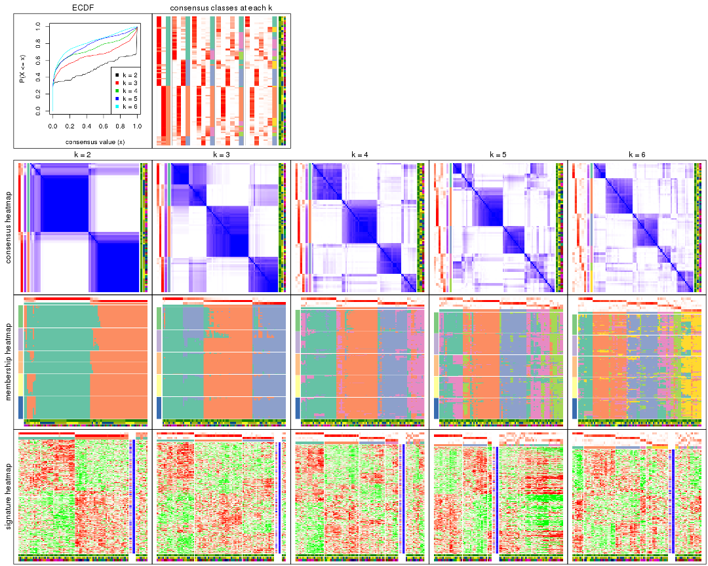

The plots are:

- The first row: a plot of the ECDF (empirical cumulative distribution
  function) curves of the consensus matrix for each `k` and the heatmap of
  predicted classes for each `k`.
- The second row: heatmaps of the consensus matrix for each `k`.
- The third row: heatmaps of the membership matrix for each `k`.
- The fouth row: heatmaps of the signatures for each `k`.

All the plots in panels can be made by individual functions and they are
plotted later in this section.

`select_partition_number()` produces several plots showing different
statistics for choosing "optimized" `k`. There are following statistics:

- ECDF curves of the consensus matrix for each `k`;
- 1-PAC. [The PAC
  score](https://en.wikipedia.org/wiki/Consensus_clustering#Over-interpretation_potential_of_consensus_clustering)
  measures the proportion of the ambiguous subgrouping.
- Mean silhouette score.
- Concordance. The mean probability of fiting the consensus class ids in all
  partitions.
- Area increased. Denote $A_k$ as the area under the ECDF curve for current
  `k`, the area increased is defined as $A_k - A_{k-1}$.
- Rand index. The percent of pairs of samples that are both in a same cluster
  or both are not in a same cluster in the partition of k and k-1.
- Jaccard index. The ratio of pairs of samples are both in a same cluster in
  the partition of k and k-1 and the pairs of samples are both in a same
  cluster in the partition k or k-1.

The detailed explanations of these statistics can be found in [the _cola_
vignette](http://bioconductor.org/packages/devel/bioc/vignettes/cola/inst/doc/cola.html#toc_13).

Generally speaking, lower PAC score, higher mean silhouette score or higher
concordance corresponds to better partition. Rand index and Jaccard index
measure how similar the current partition is compared to partition with `k-1`.
If they are too similar, we won't accept `k` is better than `k-1`.

```r
select_partition_number(res)
```


The numeric values for all these statistics can be obtained by `get_stats()`.

```r
get_stats(res)
```

```
#>   k 1-PAC mean_silhouette concordance area_increased  Rand Jaccard
#> 2 2 0.786           0.853       0.943         0.5016 0.497   0.497
#> 3 3 0.716           0.823       0.891         0.3246 0.777   0.577
#> 4 4 0.703           0.717       0.859         0.1178 0.845   0.587
#> 5 5 0.651           0.481       0.739         0.0594 0.859   0.538
#> 6 6 0.669           0.602       0.761         0.0406 0.878   0.532
```

`suggest_best_k()` suggests the best $k$ based on these statistics. The rules are as follows:

- All $k$ with Jaccard index larger than 0.95 are removed because increasing
  $k$ does not provide enough extra information. If all $k$ are removed, it is
  marked as no subgroup is detected.
- For all $k$ with 1-PAC score larger than 0.9, the maximal $k$ is taken as
  the best $k$, and other $k$ are marked as optional $k$.
- If it does not fit the second rule. The $k$ with the maximal vote of the
  highest 1-PAC score, highest mean silhouette, and highest concordance is
  taken as the best $k$.

```r
suggest_best_k(res)
```

```
#> [1] 2
```


Following shows the table of the partitions (You need to click the **show/hide
code output** link to see it). The membership matrix (columns with name `p*`)
is inferred by
[`clue::cl_consensus()`](https://www.rdocumentation.org/link/cl_consensus?package=clue)
function with the `SE` method. Basically the value in the membership matrix
represents the probability to belong to a certain group. The finall class
label for an item is determined with the group with highest probability it
belongs to.

In `get_classes()` function, the entropy is calculated from the membership
matrix and the silhouette score is calculated from the consensus matrix.


<script>
$( function() {
	$( '#tabs-MAD-NMF-get-classes' ).tabs();
} );
</script>
<div id='tabs-MAD-NMF-get-classes'>
<ul>
<li><a href='#tab-MAD-NMF-get-classes-1'>k = 2</a></li>
<li><a href='#tab-MAD-NMF-get-classes-2'>k = 3</a></li>
<li><a href='#tab-MAD-NMF-get-classes-3'>k = 4</a></li>
<li><a href='#tab-MAD-NMF-get-classes-4'>k = 5</a></li>
<li><a href='#tab-MAD-NMF-get-classes-5'>k = 6</a></li>
</ul>

<div id='tab-MAD-NMF-get-classes-1'>
<p><a id='tab-MAD-NMF-get-classes-1-a' style='color:#0366d6' href='#'>show/hide code output</a></p>
<pre><code class="r">cbind(get_classes(res, k = 2), get_membership(res, k = 2))
</code></pre>

<pre><code>#&gt;           class entropy silhouette    p1    p2
#&gt; GSM339455     1  0.0000     0.9267 1.000 0.000
#&gt; GSM339456     2  0.0000     0.9461 0.000 1.000
#&gt; GSM339457     1  0.9323     0.4530 0.652 0.348
#&gt; GSM339458     2  0.0000     0.9461 0.000 1.000
#&gt; GSM339459     2  0.8443     0.6199 0.272 0.728
#&gt; GSM339460     2  0.0000     0.9461 0.000 1.000
#&gt; GSM339461     2  0.0000     0.9461 0.000 1.000
#&gt; GSM339462     1  0.0000     0.9267 1.000 0.000
#&gt; GSM339463     1  0.0000     0.9267 1.000 0.000
#&gt; GSM339464     1  0.1184     0.9148 0.984 0.016
#&gt; GSM339465     1  0.0000     0.9267 1.000 0.000
#&gt; GSM339466     2  0.0000     0.9461 0.000 1.000
#&gt; GSM339467     2  0.0000     0.9461 0.000 1.000
#&gt; GSM339468     2  0.0000     0.9461 0.000 1.000
#&gt; GSM339469     1  0.0000     0.9267 1.000 0.000
#&gt; GSM339470     1  0.7674     0.6802 0.776 0.224
#&gt; GSM339471     1  0.0000     0.9267 1.000 0.000
#&gt; GSM339472     2  0.0000     0.9461 0.000 1.000
#&gt; GSM339473     1  0.0000     0.9267 1.000 0.000
#&gt; GSM339474     2  0.0000     0.9461 0.000 1.000
#&gt; GSM339475     1  0.0000     0.9267 1.000 0.000
#&gt; GSM339476     1  0.0000     0.9267 1.000 0.000
#&gt; GSM339477     2  0.0000     0.9461 0.000 1.000
#&gt; GSM339478     2  0.7602     0.7042 0.220 0.780
#&gt; GSM339479     1  0.9881     0.2463 0.564 0.436
#&gt; GSM339480     1  0.9983     0.0774 0.524 0.476
#&gt; GSM339481     2  0.0000     0.9461 0.000 1.000
#&gt; GSM339482     1  0.0000     0.9267 1.000 0.000
#&gt; GSM339483     1  0.0000     0.9267 1.000 0.000
#&gt; GSM339484     1  0.0000     0.9267 1.000 0.000
#&gt; GSM339485     1  0.0376     0.9238 0.996 0.004
#&gt; GSM339486     1  0.0000     0.9267 1.000 0.000
#&gt; GSM339487     2  0.0000     0.9461 0.000 1.000
#&gt; GSM339488     2  0.0000     0.9461 0.000 1.000
#&gt; GSM339489     2  0.0376     0.9431 0.004 0.996
#&gt; GSM339490     1  0.1414     0.9115 0.980 0.020
#&gt; GSM339491     1  0.9922     0.1807 0.552 0.448
#&gt; GSM339492     1  0.0000     0.9267 1.000 0.000
#&gt; GSM339493     2  0.0000     0.9461 0.000 1.000
#&gt; GSM339494     1  0.0000     0.9267 1.000 0.000
#&gt; GSM339495     2  0.0000     0.9461 0.000 1.000
#&gt; GSM339496     1  0.0000     0.9267 1.000 0.000
#&gt; GSM339497     2  0.0000     0.9461 0.000 1.000
#&gt; GSM339498     2  0.5629     0.8194 0.132 0.868
#&gt; GSM339499     2  0.9993     0.0414 0.484 0.516
#&gt; GSM339500     2  0.3114     0.8981 0.056 0.944
#&gt; GSM339501     1  0.0000     0.9267 1.000 0.000
#&gt; GSM339502     2  0.0000     0.9461 0.000 1.000
#&gt; GSM339503     1  0.0000     0.9267 1.000 0.000
#&gt; GSM339504     1  0.0000     0.9267 1.000 0.000
#&gt; GSM339505     1  0.9661     0.3458 0.608 0.392
#&gt; GSM339506     1  0.0000     0.9267 1.000 0.000
#&gt; GSM339507     1  0.0000     0.9267 1.000 0.000
#&gt; GSM339508     2  0.0000     0.9461 0.000 1.000
#&gt; GSM339509     2  0.0000     0.9461 0.000 1.000
#&gt; GSM339510     2  0.0000     0.9461 0.000 1.000
#&gt; GSM339511     1  0.9323     0.4687 0.652 0.348
#&gt; GSM339512     2  0.0000     0.9461 0.000 1.000
#&gt; GSM339513     1  0.0000     0.9267 1.000 0.000
#&gt; GSM339514     2  0.0000     0.9461 0.000 1.000
#&gt; GSM339515     1  0.0000     0.9267 1.000 0.000
#&gt; GSM339516     2  0.0000     0.9461 0.000 1.000
#&gt; GSM339517     1  0.0000     0.9267 1.000 0.000
#&gt; GSM339518     2  0.0000     0.9461 0.000 1.000
#&gt; GSM339519     1  0.0000     0.9267 1.000 0.000
#&gt; GSM339520     2  0.8267     0.6411 0.260 0.740
#&gt; GSM339521     2  0.0000     0.9461 0.000 1.000
#&gt; GSM339522     2  0.0000     0.9461 0.000 1.000
#&gt; GSM339523     2  0.0000     0.9461 0.000 1.000
#&gt; GSM339524     1  0.0000     0.9267 1.000 0.000
#&gt; GSM339525     1  0.0000     0.9267 1.000 0.000
#&gt; GSM339526     1  0.0000     0.9267 1.000 0.000
#&gt; GSM339527     1  0.0000     0.9267 1.000 0.000
#&gt; GSM339528     1  0.0000     0.9267 1.000 0.000
#&gt; GSM339529     2  0.0000     0.9461 0.000 1.000
#&gt; GSM339530     2  0.9775     0.2903 0.412 0.588
#&gt; GSM339531     2  0.0000     0.9461 0.000 1.000
#&gt; GSM339532     1  0.7674     0.6855 0.776 0.224
#&gt; GSM339533     1  0.0000     0.9267 1.000 0.000
#&gt; GSM339534     1  0.0000     0.9267 1.000 0.000
#&gt; GSM339535     2  0.0000     0.9461 0.000 1.000
#&gt; GSM339536     1  0.0000     0.9267 1.000 0.000
#&gt; GSM339537     2  0.0000     0.9461 0.000 1.000
#&gt; GSM339538     1  0.0000     0.9267 1.000 0.000
</code></pre>

<script>
$('#tab-MAD-NMF-get-classes-1-a').parent().next().next().hide();
$('#tab-MAD-NMF-get-classes-1-a').click(function(){
  $('#tab-MAD-NMF-get-classes-1-a').parent().next().next().toggle();
  return(false);
});
</script>
</div>

<div id='tab-MAD-NMF-get-classes-2'>
<p><a id='tab-MAD-NMF-get-classes-2-a' style='color:#0366d6' href='#'>show/hide code output</a></p>
<pre><code class="r">cbind(get_classes(res, k = 3), get_membership(res, k = 3))
</code></pre>

<pre><code>#&gt;           class entropy silhouette    p1    p2    p3
#&gt; GSM339455     3  0.5138      0.444 0.252 0.000 0.748
#&gt; GSM339456     2  0.2711      0.908 0.088 0.912 0.000
#&gt; GSM339457     3  0.1643      0.880 0.000 0.044 0.956
#&gt; GSM339458     2  0.2066      0.932 0.060 0.940 0.000
#&gt; GSM339459     3  0.5657      0.779 0.104 0.088 0.808
#&gt; GSM339460     2  0.1411      0.940 0.036 0.964 0.000
#&gt; GSM339461     2  0.4750      0.805 0.216 0.784 0.000
#&gt; GSM339462     1  0.0592      0.776 0.988 0.000 0.012
#&gt; GSM339463     3  0.2066      0.829 0.060 0.000 0.940
#&gt; GSM339464     1  0.0000      0.774 1.000 0.000 0.000
#&gt; GSM339465     3  0.0237      0.884 0.004 0.000 0.996
#&gt; GSM339466     2  0.0000      0.944 0.000 1.000 0.000
#&gt; GSM339467     2  0.0000      0.944 0.000 1.000 0.000
#&gt; GSM339468     2  0.5254      0.766 0.264 0.736 0.000
#&gt; GSM339469     1  0.0000      0.774 1.000 0.000 0.000
#&gt; GSM339470     3  0.0892      0.886 0.000 0.020 0.980
#&gt; GSM339471     1  0.5760      0.716 0.672 0.000 0.328
#&gt; GSM339472     2  0.0000      0.944 0.000 1.000 0.000
#&gt; GSM339473     1  0.5621      0.730 0.692 0.000 0.308
#&gt; GSM339474     2  0.1163      0.941 0.028 0.972 0.000
#&gt; GSM339475     3  0.0000      0.886 0.000 0.000 1.000
#&gt; GSM339476     1  0.5216      0.745 0.740 0.000 0.260
#&gt; GSM339477     2  0.3482      0.895 0.128 0.872 0.000
#&gt; GSM339478     3  0.5621      0.603 0.000 0.308 0.692
#&gt; GSM339479     1  0.5635      0.671 0.784 0.180 0.036
#&gt; GSM339480     3  0.4349      0.792 0.128 0.020 0.852
#&gt; GSM339481     2  0.0000      0.944 0.000 1.000 0.000
#&gt; GSM339482     3  0.0000      0.886 0.000 0.000 1.000
#&gt; GSM339483     1  0.0000      0.774 1.000 0.000 0.000
#&gt; GSM339484     1  0.6280      0.532 0.540 0.000 0.460
#&gt; GSM339485     1  0.0000      0.774 1.000 0.000 0.000
#&gt; GSM339486     1  0.6299      0.497 0.524 0.000 0.476
#&gt; GSM339487     2  0.0000      0.944 0.000 1.000 0.000
#&gt; GSM339488     2  0.0000      0.944 0.000 1.000 0.000
#&gt; GSM339489     2  0.2774      0.927 0.072 0.920 0.008
#&gt; GSM339490     1  0.0000      0.774 1.000 0.000 0.000
#&gt; GSM339491     3  0.2537      0.862 0.000 0.080 0.920
#&gt; GSM339492     1  0.6008      0.676 0.628 0.000 0.372
#&gt; GSM339493     2  0.0000      0.944 0.000 1.000 0.000
#&gt; GSM339494     1  0.5465      0.737 0.712 0.000 0.288
#&gt; GSM339495     2  0.1031      0.943 0.024 0.976 0.000
#&gt; GSM339496     3  0.0000      0.886 0.000 0.000 1.000
#&gt; GSM339497     2  0.2063      0.937 0.044 0.948 0.008
#&gt; GSM339498     3  0.7153      0.652 0.200 0.092 0.708
#&gt; GSM339499     3  0.2625      0.859 0.000 0.084 0.916
#&gt; GSM339500     2  0.1643      0.917 0.000 0.956 0.044
#&gt; GSM339501     1  0.0424      0.776 0.992 0.000 0.008
#&gt; GSM339502     2  0.0000      0.944 0.000 1.000 0.000
#&gt; GSM339503     3  0.1031      0.880 0.024 0.000 0.976
#&gt; GSM339504     1  0.0424      0.776 0.992 0.000 0.008
#&gt; GSM339505     3  0.1163      0.884 0.000 0.028 0.972
#&gt; GSM339506     1  0.0237      0.775 0.996 0.000 0.004
#&gt; GSM339507     1  0.5926      0.694 0.644 0.000 0.356
#&gt; GSM339508     2  0.1529      0.939 0.040 0.960 0.000
#&gt; GSM339509     2  0.0000      0.944 0.000 1.000 0.000
#&gt; GSM339510     2  0.5591      0.719 0.304 0.696 0.000
#&gt; GSM339511     1  0.0000      0.774 1.000 0.000 0.000
#&gt; GSM339512     2  0.0000      0.944 0.000 1.000 0.000
#&gt; GSM339513     1  0.6045      0.666 0.620 0.000 0.380
#&gt; GSM339514     2  0.0000      0.944 0.000 1.000 0.000
#&gt; GSM339515     1  0.5621      0.730 0.692 0.000 0.308
#&gt; GSM339516     2  0.4178      0.854 0.172 0.828 0.000
#&gt; GSM339517     3  0.0237      0.885 0.004 0.000 0.996
#&gt; GSM339518     2  0.0424      0.943 0.008 0.992 0.000
#&gt; GSM339519     3  0.0747      0.883 0.016 0.000 0.984
#&gt; GSM339520     3  0.4002      0.792 0.000 0.160 0.840
#&gt; GSM339521     2  0.0000      0.944 0.000 1.000 0.000
#&gt; GSM339522     2  0.2165      0.933 0.064 0.936 0.000
#&gt; GSM339523     2  0.0000      0.944 0.000 1.000 0.000
#&gt; GSM339524     1  0.6286      0.488 0.536 0.000 0.464
#&gt; GSM339525     1  0.2711      0.773 0.912 0.000 0.088
#&gt; GSM339526     3  0.0000      0.886 0.000 0.000 1.000
#&gt; GSM339527     1  0.0424      0.776 0.992 0.000 0.008
#&gt; GSM339528     1  0.5859      0.704 0.656 0.000 0.344
#&gt; GSM339529     2  0.2165      0.930 0.064 0.936 0.000
#&gt; GSM339530     3  0.3551      0.820 0.000 0.132 0.868
#&gt; GSM339531     2  0.4346      0.836 0.184 0.816 0.000
#&gt; GSM339532     1  0.0000      0.774 1.000 0.000 0.000
#&gt; GSM339533     3  0.0000      0.886 0.000 0.000 1.000
#&gt; GSM339534     1  0.6111      0.643 0.604 0.000 0.396
#&gt; GSM339535     2  0.0000      0.944 0.000 1.000 0.000
#&gt; GSM339536     1  0.5621      0.730 0.692 0.000 0.308
#&gt; GSM339537     2  0.2625      0.920 0.084 0.916 0.000
#&gt; GSM339538     3  0.0000      0.886 0.000 0.000 1.000
</code></pre>

<script>
$('#tab-MAD-NMF-get-classes-2-a').parent().next().next().hide();
$('#tab-MAD-NMF-get-classes-2-a').click(function(){
  $('#tab-MAD-NMF-get-classes-2-a').parent().next().next().toggle();
  return(false);
});
</script>
</div>

<div id='tab-MAD-NMF-get-classes-3'>
<p><a id='tab-MAD-NMF-get-classes-3-a' style='color:#0366d6' href='#'>show/hide code output</a></p>
<pre><code class="r">cbind(get_classes(res, k = 4), get_membership(res, k = 4))
</code></pre>

<pre><code>#&gt;           class entropy silhouette    p1    p2    p3    p4
#&gt; GSM339455     1  0.5404   0.159983 0.512 0.000 0.476 0.012
#&gt; GSM339456     2  0.4635   0.587514 0.000 0.720 0.012 0.268
#&gt; GSM339457     3  0.0859   0.857650 0.008 0.008 0.980 0.004
#&gt; GSM339458     2  0.4305   0.721245 0.136 0.816 0.004 0.044
#&gt; GSM339459     3  0.3695   0.789082 0.000 0.016 0.828 0.156
#&gt; GSM339460     2  0.1510   0.857790 0.028 0.956 0.000 0.016
#&gt; GSM339461     2  0.5257   0.147996 0.000 0.548 0.008 0.444
#&gt; GSM339462     1  0.2868   0.772988 0.864 0.000 0.000 0.136
#&gt; GSM339463     1  0.3962   0.770674 0.820 0.000 0.152 0.028
#&gt; GSM339464     4  0.4790   0.294387 0.380 0.000 0.000 0.620
#&gt; GSM339465     1  0.4281   0.746082 0.792 0.000 0.180 0.028
#&gt; GSM339466     2  0.0657   0.875397 0.000 0.984 0.004 0.012
#&gt; GSM339467     2  0.0188   0.876540 0.000 0.996 0.004 0.000
#&gt; GSM339468     4  0.3320   0.713488 0.000 0.056 0.068 0.876
#&gt; GSM339469     1  0.3105   0.768776 0.856 0.004 0.000 0.140
#&gt; GSM339470     3  0.6925   0.549984 0.204 0.120 0.648 0.028
#&gt; GSM339471     1  0.2124   0.834613 0.924 0.000 0.068 0.008
#&gt; GSM339472     2  0.0524   0.875966 0.000 0.988 0.004 0.008
#&gt; GSM339473     1  0.0895   0.834034 0.976 0.000 0.020 0.004
#&gt; GSM339474     2  0.0592   0.873609 0.000 0.984 0.000 0.016
#&gt; GSM339475     3  0.0657   0.858760 0.012 0.000 0.984 0.004
#&gt; GSM339476     1  0.2376   0.820294 0.916 0.000 0.016 0.068
#&gt; GSM339477     2  0.4994   0.000446 0.000 0.520 0.000 0.480
#&gt; GSM339478     3  0.5427   0.233214 0.000 0.416 0.568 0.016
#&gt; GSM339479     1  0.2297   0.820066 0.928 0.024 0.004 0.044
#&gt; GSM339480     3  0.3768   0.773597 0.000 0.008 0.808 0.184
#&gt; GSM339481     2  0.0188   0.876540 0.000 0.996 0.004 0.000
#&gt; GSM339482     3  0.1545   0.857253 0.008 0.000 0.952 0.040
#&gt; GSM339483     1  0.1940   0.810051 0.924 0.000 0.000 0.076
#&gt; GSM339484     1  0.3182   0.810022 0.876 0.000 0.096 0.028
#&gt; GSM339485     4  0.3942   0.600510 0.236 0.000 0.000 0.764
#&gt; GSM339486     1  0.3307   0.805211 0.868 0.000 0.104 0.028
#&gt; GSM339487     2  0.1716   0.844089 0.000 0.936 0.000 0.064
#&gt; GSM339488     2  0.0672   0.872999 0.000 0.984 0.008 0.008
#&gt; GSM339489     4  0.5000   0.058858 0.000 0.500 0.000 0.500
#&gt; GSM339490     1  0.4916   0.288095 0.576 0.000 0.000 0.424
#&gt; GSM339491     2  0.7540   0.387310 0.204 0.588 0.180 0.028
#&gt; GSM339492     1  0.3946   0.777267 0.812 0.000 0.168 0.020
#&gt; GSM339493     2  0.0657   0.875397 0.000 0.984 0.004 0.012
#&gt; GSM339494     1  0.0804   0.833164 0.980 0.000 0.012 0.008
#&gt; GSM339495     2  0.2345   0.811617 0.000 0.900 0.000 0.100
#&gt; GSM339496     3  0.0657   0.858760 0.012 0.000 0.984 0.004
#&gt; GSM339497     2  0.2124   0.852274 0.040 0.932 0.000 0.028
#&gt; GSM339498     3  0.4290   0.729865 0.000 0.016 0.772 0.212
#&gt; GSM339499     3  0.1139   0.855897 0.008 0.008 0.972 0.012
#&gt; GSM339500     2  0.2764   0.822932 0.052 0.908 0.036 0.004
#&gt; GSM339501     4  0.2489   0.709531 0.020 0.000 0.068 0.912
#&gt; GSM339502     2  0.0895   0.868878 0.000 0.976 0.004 0.020
#&gt; GSM339503     3  0.3037   0.828959 0.020 0.000 0.880 0.100
#&gt; GSM339504     1  0.4730   0.445639 0.636 0.000 0.000 0.364
#&gt; GSM339505     3  0.0927   0.855204 0.008 0.000 0.976 0.016
#&gt; GSM339506     4  0.2530   0.703135 0.112 0.000 0.000 0.888
#&gt; GSM339507     1  0.2596   0.820972 0.908 0.000 0.068 0.024
#&gt; GSM339508     2  0.0469   0.875208 0.000 0.988 0.000 0.012
#&gt; GSM339509     2  0.0188   0.876540 0.000 0.996 0.004 0.000
#&gt; GSM339510     4  0.2124   0.743380 0.000 0.068 0.008 0.924
#&gt; GSM339511     4  0.4283   0.583989 0.256 0.004 0.000 0.740
#&gt; GSM339512     2  0.0376   0.875972 0.000 0.992 0.004 0.004
#&gt; GSM339513     1  0.3219   0.807862 0.868 0.000 0.112 0.020
#&gt; GSM339514     2  0.0376   0.875972 0.000 0.992 0.004 0.004
#&gt; GSM339515     1  0.1182   0.832667 0.968 0.000 0.016 0.016
#&gt; GSM339516     4  0.4877   0.346527 0.000 0.408 0.000 0.592
#&gt; GSM339517     3  0.2197   0.844009 0.004 0.000 0.916 0.080
#&gt; GSM339518     2  0.1174   0.869581 0.012 0.968 0.000 0.020
#&gt; GSM339519     3  0.2256   0.849716 0.020 0.000 0.924 0.056
#&gt; GSM339520     3  0.1484   0.851416 0.004 0.020 0.960 0.016
#&gt; GSM339521     2  0.0376   0.876280 0.004 0.992 0.000 0.004
#&gt; GSM339522     4  0.5433   0.642328 0.004 0.220 0.056 0.720
#&gt; GSM339523     2  0.0376   0.875972 0.000 0.992 0.004 0.004
#&gt; GSM339524     3  0.3542   0.827169 0.060 0.000 0.864 0.076
#&gt; GSM339525     1  0.1940   0.810825 0.924 0.000 0.000 0.076
#&gt; GSM339526     3  0.0469   0.858109 0.012 0.000 0.988 0.000
#&gt; GSM339527     4  0.1743   0.722569 0.056 0.000 0.004 0.940
#&gt; GSM339528     1  0.2197   0.829243 0.928 0.000 0.048 0.024
#&gt; GSM339529     2  0.0592   0.873726 0.000 0.984 0.000 0.016
#&gt; GSM339530     3  0.2700   0.830595 0.020 0.044 0.916 0.020
#&gt; GSM339531     4  0.4182   0.675013 0.000 0.180 0.024 0.796
#&gt; GSM339532     1  0.4964   0.388461 0.616 0.004 0.000 0.380
#&gt; GSM339533     3  0.5786   0.285357 0.380 0.004 0.588 0.028
#&gt; GSM339534     1  0.2987   0.827860 0.880 0.000 0.104 0.016
#&gt; GSM339535     2  0.0188   0.876540 0.000 0.996 0.004 0.000
#&gt; GSM339536     1  0.1042   0.833864 0.972 0.000 0.020 0.008
#&gt; GSM339537     2  0.5000  -0.149194 0.000 0.504 0.000 0.496
#&gt; GSM339538     3  0.1677   0.856166 0.012 0.000 0.948 0.040
</code></pre>

<script>
$('#tab-MAD-NMF-get-classes-3-a').parent().next().next().hide();
$('#tab-MAD-NMF-get-classes-3-a').click(function(){
  $('#tab-MAD-NMF-get-classes-3-a').parent().next().next().toggle();
  return(false);
});
</script>
</div>

<div id='tab-MAD-NMF-get-classes-4'>
<p><a id='tab-MAD-NMF-get-classes-4-a' style='color:#0366d6' href='#'>show/hide code output</a></p>
<pre><code class="r">cbind(get_classes(res, k = 5), get_membership(res, k = 5))
</code></pre>

<pre><code>#&gt;           class entropy silhouette    p1    p2    p3    p4    p5
#&gt; GSM339455     1  0.6600   -0.05641 0.408 0.000 0.380 0.212 0.000
#&gt; GSM339456     2  0.3355    0.67583 0.000 0.804 0.012 0.000 0.184
#&gt; GSM339457     3  0.1704    0.85863 0.068 0.000 0.928 0.004 0.000
#&gt; GSM339458     4  0.5961    0.16540 0.448 0.092 0.004 0.456 0.000
#&gt; GSM339459     3  0.2280    0.81841 0.000 0.000 0.880 0.000 0.120
#&gt; GSM339460     4  0.6933    0.16274 0.344 0.160 0.000 0.468 0.028
#&gt; GSM339461     5  0.5506    0.14877 0.016 0.392 0.024 0.008 0.560
#&gt; GSM339462     4  0.5928    0.01417 0.392 0.000 0.000 0.500 0.108
#&gt; GSM339463     1  0.3184    0.34057 0.852 0.000 0.100 0.048 0.000
#&gt; GSM339464     5  0.5106    0.20363 0.036 0.000 0.000 0.456 0.508
#&gt; GSM339465     1  0.1818    0.37970 0.932 0.000 0.044 0.024 0.000
#&gt; GSM339466     2  0.2507    0.80998 0.004 0.908 0.016 0.056 0.016
#&gt; GSM339467     2  0.0162    0.83536 0.004 0.996 0.000 0.000 0.000
#&gt; GSM339468     5  0.3835    0.44912 0.000 0.012 0.244 0.000 0.744
#&gt; GSM339469     4  0.2903    0.39420 0.080 0.000 0.000 0.872 0.048
#&gt; GSM339470     1  0.6841    0.16241 0.492 0.240 0.256 0.008 0.004
#&gt; GSM339471     4  0.5922   -0.17998 0.420 0.000 0.104 0.476 0.000
#&gt; GSM339472     2  0.0162    0.83599 0.000 0.996 0.000 0.004 0.000
#&gt; GSM339473     1  0.4219    0.33533 0.584 0.000 0.000 0.416 0.000
#&gt; GSM339474     2  0.1564    0.82539 0.004 0.948 0.000 0.024 0.024
#&gt; GSM339475     3  0.0290    0.87539 0.008 0.000 0.992 0.000 0.000
#&gt; GSM339476     4  0.3883    0.22472 0.244 0.000 0.008 0.744 0.004
#&gt; GSM339477     2  0.3355    0.70487 0.000 0.804 0.000 0.012 0.184
#&gt; GSM339478     3  0.5836    0.49901 0.116 0.244 0.628 0.012 0.000
#&gt; GSM339479     1  0.5045   -0.23188 0.508 0.024 0.004 0.464 0.000
#&gt; GSM339480     3  0.2966    0.75235 0.000 0.000 0.816 0.000 0.184
#&gt; GSM339481     2  0.0162    0.83599 0.000 0.996 0.000 0.004 0.000
#&gt; GSM339482     3  0.1205    0.87082 0.040 0.000 0.956 0.004 0.000
#&gt; GSM339483     4  0.4449   -0.25804 0.484 0.000 0.000 0.512 0.004
#&gt; GSM339484     1  0.4251    0.35935 0.624 0.000 0.004 0.372 0.000
#&gt; GSM339485     5  0.5044    0.21145 0.032 0.000 0.000 0.464 0.504
#&gt; GSM339486     1  0.1741    0.37824 0.936 0.000 0.024 0.040 0.000
#&gt; GSM339487     2  0.2824    0.77208 0.000 0.864 0.000 0.116 0.020
#&gt; GSM339488     2  0.0162    0.83536 0.004 0.996 0.000 0.000 0.000
#&gt; GSM339489     2  0.6562    0.14178 0.000 0.496 0.032 0.100 0.372
#&gt; GSM339490     4  0.3019    0.40573 0.048 0.000 0.000 0.864 0.088
#&gt; GSM339491     2  0.4850    0.14774 0.484 0.500 0.004 0.008 0.004
#&gt; GSM339492     4  0.6344    0.04590 0.160 0.000 0.400 0.440 0.000
#&gt; GSM339493     2  0.0807    0.83207 0.000 0.976 0.000 0.012 0.012
#&gt; GSM339494     1  0.4359    0.33692 0.584 0.000 0.000 0.412 0.004
#&gt; GSM339495     2  0.1725    0.82063 0.000 0.936 0.000 0.020 0.044
#&gt; GSM339496     3  0.0566    0.87609 0.012 0.000 0.984 0.004 0.000
#&gt; GSM339497     4  0.7152    0.15965 0.392 0.164 0.004 0.412 0.028
#&gt; GSM339498     3  0.3895    0.53726 0.000 0.000 0.680 0.000 0.320
#&gt; GSM339499     3  0.2583    0.81415 0.132 0.000 0.864 0.004 0.000
#&gt; GSM339500     1  0.8006   -0.11107 0.400 0.068 0.244 0.280 0.008
#&gt; GSM339501     5  0.6682    0.25957 0.000 0.000 0.236 0.368 0.396
#&gt; GSM339502     2  0.0162    0.83536 0.004 0.996 0.000 0.000 0.000
#&gt; GSM339503     3  0.1121    0.86493 0.000 0.000 0.956 0.000 0.044
#&gt; GSM339504     4  0.5398    0.31620 0.112 0.000 0.000 0.648 0.240
#&gt; GSM339505     3  0.2387    0.85265 0.092 0.004 0.896 0.004 0.004
#&gt; GSM339506     5  0.2338    0.54638 0.016 0.000 0.036 0.032 0.916
#&gt; GSM339507     1  0.3949    0.36930 0.668 0.000 0.000 0.332 0.000
#&gt; GSM339508     2  0.0290    0.83583 0.000 0.992 0.000 0.008 0.000
#&gt; GSM339509     2  0.0000    0.83571 0.000 1.000 0.000 0.000 0.000
#&gt; GSM339510     5  0.3081    0.52714 0.000 0.000 0.012 0.156 0.832
#&gt; GSM339511     4  0.4592   -0.04730 0.024 0.000 0.000 0.644 0.332
#&gt; GSM339512     2  0.0290    0.83494 0.008 0.992 0.000 0.000 0.000
#&gt; GSM339513     1  0.5548    0.25070 0.492 0.000 0.068 0.440 0.000
#&gt; GSM339514     2  0.0000    0.83571 0.000 1.000 0.000 0.000 0.000
#&gt; GSM339515     1  0.4219    0.33597 0.584 0.000 0.000 0.416 0.000
#&gt; GSM339516     2  0.5700    0.39165 0.000 0.600 0.000 0.120 0.280
#&gt; GSM339517     3  0.1557    0.86196 0.008 0.000 0.940 0.000 0.052
#&gt; GSM339518     2  0.7358   -0.00162 0.364 0.380 0.004 0.228 0.024
#&gt; GSM339519     3  0.0771    0.87126 0.004 0.000 0.976 0.000 0.020
#&gt; GSM339520     3  0.2582    0.84591 0.080 0.024 0.892 0.004 0.000
#&gt; GSM339521     2  0.2758    0.78220 0.076 0.888 0.000 0.012 0.024
#&gt; GSM339522     4  0.6073   -0.29924 0.016 0.048 0.012 0.484 0.440
#&gt; GSM339523     2  0.0162    0.83599 0.000 0.996 0.000 0.004 0.000
#&gt; GSM339524     3  0.2546    0.84490 0.048 0.000 0.904 0.012 0.036
#&gt; GSM339525     4  0.3816    0.16833 0.304 0.000 0.000 0.696 0.000
#&gt; GSM339526     3  0.0880    0.87507 0.032 0.000 0.968 0.000 0.000
#&gt; GSM339527     5  0.2467    0.54856 0.016 0.000 0.052 0.024 0.908
#&gt; GSM339528     1  0.1981    0.37333 0.920 0.000 0.016 0.064 0.000
#&gt; GSM339529     2  0.1478    0.81451 0.000 0.936 0.000 0.064 0.000
#&gt; GSM339530     3  0.3317    0.81228 0.056 0.088 0.852 0.004 0.000
#&gt; GSM339531     5  0.6372    0.15375 0.004 0.404 0.124 0.004 0.464
#&gt; GSM339532     4  0.2376    0.39430 0.052 0.000 0.000 0.904 0.044
#&gt; GSM339533     1  0.4956    0.28902 0.644 0.000 0.312 0.040 0.004
#&gt; GSM339534     4  0.6598    0.11128 0.228 0.000 0.324 0.448 0.000
#&gt; GSM339535     2  0.0162    0.83571 0.000 0.996 0.000 0.004 0.000
#&gt; GSM339536     1  0.4201    0.33990 0.592 0.000 0.000 0.408 0.000
#&gt; GSM339537     2  0.5894    0.24038 0.000 0.532 0.000 0.112 0.356
#&gt; GSM339538     3  0.1195    0.86889 0.012 0.000 0.960 0.000 0.028
</code></pre>

<script>
$('#tab-MAD-NMF-get-classes-4-a').parent().next().next().hide();
$('#tab-MAD-NMF-get-classes-4-a').click(function(){
  $('#tab-MAD-NMF-get-classes-4-a').parent().next().next().toggle();
  return(false);
});
</script>
</div>

<div id='tab-MAD-NMF-get-classes-5'>
<p><a id='tab-MAD-NMF-get-classes-5-a' style='color:#0366d6' href='#'>show/hide code output</a></p>
<pre><code class="r">cbind(get_classes(res, k = 6), get_membership(res, k = 6))
</code></pre>

<pre><code>#&gt;           class entropy silhouette    p1    p2    p3    p4    p5    p6
#&gt; GSM339455     3  0.6180     0.2240 0.004 0.000 0.460 0.324 0.008 0.204
#&gt; GSM339456     2  0.3171     0.6966 0.000 0.784 0.012 0.000 0.204 0.000
#&gt; GSM339457     3  0.2253     0.7793 0.000 0.004 0.896 0.004 0.012 0.084
#&gt; GSM339458     6  0.2853     0.6596 0.008 0.008 0.000 0.124 0.008 0.852
#&gt; GSM339459     3  0.2432     0.7642 0.000 0.024 0.888 0.008 0.080 0.000
#&gt; GSM339460     6  0.4671     0.5500 0.000 0.044 0.000 0.228 0.032 0.696
#&gt; GSM339461     5  0.5949     0.2900 0.000 0.332 0.004 0.028 0.528 0.108
#&gt; GSM339462     1  0.6839     0.0258 0.444 0.000 0.000 0.320 0.096 0.140
#&gt; GSM339463     6  0.5256     0.6603 0.144 0.000 0.064 0.044 0.032 0.716
#&gt; GSM339464     4  0.4919     0.2037 0.020 0.000 0.000 0.612 0.324 0.044
#&gt; GSM339465     6  0.4561     0.6051 0.268 0.000 0.024 0.000 0.032 0.676
#&gt; GSM339466     2  0.3682     0.7631 0.000 0.828 0.020 0.096 0.028 0.028
#&gt; GSM339467     2  0.2364     0.7916 0.004 0.892 0.000 0.000 0.032 0.072
#&gt; GSM339468     5  0.5662     0.5927 0.000 0.160 0.108 0.080 0.652 0.000
#&gt; GSM339469     4  0.3549     0.5684 0.192 0.000 0.000 0.776 0.004 0.028
#&gt; GSM339470     6  0.6277     0.6009 0.116 0.060 0.104 0.000 0.072 0.648
#&gt; GSM339471     1  0.5223     0.4750 0.652 0.000 0.116 0.212 0.000 0.020
#&gt; GSM339472     2  0.1296     0.8072 0.000 0.948 0.000 0.004 0.004 0.044
#&gt; GSM339473     1  0.0291     0.7870 0.992 0.000 0.000 0.004 0.000 0.004
#&gt; GSM339474     2  0.3361     0.7659 0.000 0.844 0.000 0.048 0.044 0.064
#&gt; GSM339475     3  0.0603     0.7909 0.004 0.000 0.980 0.000 0.016 0.000
#&gt; GSM339476     4  0.4956     0.2482 0.412 0.000 0.024 0.540 0.004 0.020
#&gt; GSM339477     2  0.3988     0.7242 0.000 0.784 0.000 0.040 0.140 0.036
#&gt; GSM339478     3  0.3665     0.7602 0.000 0.028 0.832 0.024 0.028 0.088
#&gt; GSM339479     6  0.2742     0.6571 0.012 0.000 0.000 0.128 0.008 0.852
#&gt; GSM339480     3  0.2367     0.7655 0.000 0.016 0.888 0.008 0.088 0.000
#&gt; GSM339481     2  0.2159     0.8061 0.000 0.904 0.000 0.012 0.012 0.072
#&gt; GSM339482     3  0.2101     0.7923 0.008 0.000 0.920 0.016 0.016 0.040
#&gt; GSM339483     1  0.3868     0.6330 0.772 0.000 0.000 0.172 0.012 0.044
#&gt; GSM339484     1  0.2611     0.7298 0.880 0.000 0.012 0.000 0.028 0.080
#&gt; GSM339485     4  0.4792     0.2599 0.020 0.000 0.000 0.644 0.292 0.044
#&gt; GSM339486     6  0.4228     0.6250 0.248 0.000 0.020 0.008 0.012 0.712
#&gt; GSM339487     2  0.4624     0.5541 0.000 0.652 0.004 0.300 0.028 0.016
#&gt; GSM339488     2  0.2344     0.7915 0.000 0.892 0.004 0.000 0.028 0.076
#&gt; GSM339489     2  0.5679     0.5521 0.000 0.636 0.016 0.212 0.112 0.024
#&gt; GSM339490     4  0.3992     0.5691 0.200 0.000 0.000 0.752 0.024 0.024
#&gt; GSM339491     6  0.7046     0.4806 0.228 0.172 0.012 0.004 0.080 0.504
#&gt; GSM339492     3  0.6813     0.1785 0.188 0.000 0.472 0.272 0.004 0.064
#&gt; GSM339493     2  0.1452     0.8033 0.000 0.948 0.000 0.020 0.020 0.012
#&gt; GSM339494     1  0.0146     0.7867 0.996 0.000 0.000 0.004 0.000 0.000
#&gt; GSM339495     2  0.3023     0.7733 0.000 0.864 0.000 0.028 0.052 0.056
#&gt; GSM339496     3  0.0508     0.7918 0.000 0.000 0.984 0.000 0.012 0.004
#&gt; GSM339497     6  0.4035     0.6264 0.012 0.100 0.000 0.068 0.020 0.800
#&gt; GSM339498     3  0.4319     0.3405 0.000 0.024 0.576 0.000 0.400 0.000
#&gt; GSM339499     3  0.2425     0.7751 0.000 0.008 0.880 0.000 0.012 0.100
#&gt; GSM339500     6  0.3257     0.6672 0.004 0.016 0.040 0.084 0.004 0.852
#&gt; GSM339501     4  0.5582     0.1863 0.000 0.024 0.324 0.568 0.080 0.004
#&gt; GSM339502     2  0.2615     0.7853 0.008 0.876 0.000 0.000 0.028 0.088
#&gt; GSM339503     3  0.2951     0.7305 0.004 0.000 0.820 0.004 0.168 0.004
#&gt; GSM339504     4  0.5881     0.4549 0.224 0.000 0.000 0.608 0.084 0.084
#&gt; GSM339505     3  0.3827     0.7040 0.000 0.012 0.764 0.000 0.032 0.192
#&gt; GSM339506     5  0.3363     0.5465 0.008 0.000 0.008 0.124 0.828 0.032
#&gt; GSM339507     1  0.1807     0.7393 0.920 0.000 0.000 0.000 0.020 0.060
#&gt; GSM339508     2  0.2743     0.7922 0.000 0.880 0.000 0.060 0.028 0.032
#&gt; GSM339509     2  0.2164     0.7946 0.000 0.900 0.000 0.000 0.032 0.068
#&gt; GSM339510     5  0.5705     0.5306 0.000 0.096 0.016 0.220 0.636 0.032
#&gt; GSM339511     4  0.1708     0.5389 0.024 0.000 0.000 0.932 0.004 0.040
#&gt; GSM339512     2  0.3121     0.7672 0.008 0.844 0.004 0.000 0.032 0.112
#&gt; GSM339513     1  0.3867     0.6624 0.788 0.000 0.080 0.124 0.004 0.004
#&gt; GSM339514     2  0.1760     0.8019 0.004 0.928 0.000 0.000 0.020 0.048
#&gt; GSM339515     1  0.0146     0.7867 0.996 0.000 0.000 0.004 0.000 0.000
#&gt; GSM339516     2  0.4580     0.6258 0.004 0.692 0.000 0.232 0.068 0.004
#&gt; GSM339517     3  0.3269     0.7291 0.004 0.000 0.808 0.008 0.168 0.012
#&gt; GSM339518     6  0.4425     0.5838 0.000 0.136 0.000 0.104 0.016 0.744
#&gt; GSM339519     3  0.1736     0.7885 0.016 0.004 0.940 0.012 0.024 0.004
#&gt; GSM339520     3  0.2833     0.7699 0.000 0.012 0.860 0.000 0.024 0.104
#&gt; GSM339521     6  0.5328     0.0942 0.000 0.404 0.000 0.040 0.036 0.520
#&gt; GSM339522     4  0.6072     0.0389 0.000 0.176 0.012 0.620 0.136 0.056
#&gt; GSM339523     2  0.2066     0.7987 0.000 0.904 0.000 0.000 0.024 0.072
#&gt; GSM339524     3  0.4322     0.6995 0.128 0.000 0.764 0.008 0.088 0.012
#&gt; GSM339525     4  0.5075     0.0222 0.460 0.000 0.000 0.464 0.000 0.076
#&gt; GSM339526     3  0.1296     0.7919 0.004 0.000 0.952 0.000 0.012 0.032
#&gt; GSM339527     5  0.3191     0.5772 0.008 0.000 0.036 0.080 0.856 0.020
#&gt; GSM339528     6  0.4576     0.5763 0.296 0.000 0.016 0.012 0.016 0.660
#&gt; GSM339529     2  0.4020     0.7086 0.004 0.768 0.000 0.176 0.028 0.024
#&gt; GSM339530     3  0.4474     0.6920 0.000 0.088 0.764 0.004 0.036 0.108
#&gt; GSM339531     2  0.5849     0.1437 0.000 0.548 0.064 0.044 0.336 0.008
#&gt; GSM339532     4  0.4099     0.5161 0.272 0.000 0.000 0.696 0.008 0.024
#&gt; GSM339533     6  0.6417     0.3890 0.352 0.004 0.096 0.000 0.068 0.480
#&gt; GSM339534     3  0.6655     0.1000 0.072 0.000 0.440 0.376 0.008 0.104
#&gt; GSM339535     2  0.1036     0.8084 0.000 0.964 0.004 0.008 0.000 0.024
#&gt; GSM339536     1  0.0291     0.7870 0.992 0.000 0.000 0.004 0.000 0.004
#&gt; GSM339537     2  0.4710     0.6663 0.000 0.716 0.000 0.180 0.076 0.028
#&gt; GSM339538     3  0.1686     0.7810 0.004 0.000 0.932 0.004 0.052 0.008
</code></pre>

<script>
$('#tab-MAD-NMF-get-classes-5-a').parent().next().next().hide();
$('#tab-MAD-NMF-get-classes-5-a').click(function(){
  $('#tab-MAD-NMF-get-classes-5-a').parent().next().next().toggle();
  return(false);
});
</script>
</div>
</div>

Heatmaps for the consensus matrix. It visualizes the probability of two
samples to be in a same group.


<script>
$( function() {
	$( '#tabs-MAD-NMF-consensus-heatmap' ).tabs();
} );
</script>
<div id='tabs-MAD-NMF-consensus-heatmap'>
<ul>
<li><a href='#tab-MAD-NMF-consensus-heatmap-1'>k = 2</a></li>
<li><a href='#tab-MAD-NMF-consensus-heatmap-2'>k = 3</a></li>
<li><a href='#tab-MAD-NMF-consensus-heatmap-3'>k = 4</a></li>
<li><a href='#tab-MAD-NMF-consensus-heatmap-4'>k = 5</a></li>
<li><a href='#tab-MAD-NMF-consensus-heatmap-5'>k = 6</a></li>
</ul>
<div id='tab-MAD-NMF-consensus-heatmap-1'>
<pre><code class="r">consensus_heatmap(res, k = 2)
</code></pre>

<p></p>

</div>
<div id='tab-MAD-NMF-consensus-heatmap-2'>
<pre><code class="r">consensus_heatmap(res, k = 3)
</code></pre>

<p></p>

</div>
<div id='tab-MAD-NMF-consensus-heatmap-3'>
<pre><code class="r">consensus_heatmap(res, k = 4)
</code></pre>

<p></p>

</div>
<div id='tab-MAD-NMF-consensus-heatmap-4'>
<pre><code class="r">consensus_heatmap(res, k = 5)
</code></pre>

<p></p>

</div>
<div id='tab-MAD-NMF-consensus-heatmap-5'>
<pre><code class="r">consensus_heatmap(res, k = 6)
</code></pre>

<p></p>

</div>
</div>

Heatmaps for the membership of samples in all partitions to see how consistent they are:


<script>
$( function() {
	$( '#tabs-MAD-NMF-membership-heatmap' ).tabs();
} );
</script>
<div id='tabs-MAD-NMF-membership-heatmap'>
<ul>
<li><a href='#tab-MAD-NMF-membership-heatmap-1'>k = 2</a></li>
<li><a href='#tab-MAD-NMF-membership-heatmap-2'>k = 3</a></li>
<li><a href='#tab-MAD-NMF-membership-heatmap-3'>k = 4</a></li>
<li><a href='#tab-MAD-NMF-membership-heatmap-4'>k = 5</a></li>
<li><a href='#tab-MAD-NMF-membership-heatmap-5'>k = 6</a></li>
</ul>
<div id='tab-MAD-NMF-membership-heatmap-1'>
<pre><code class="r">membership_heatmap(res, k = 2)
</code></pre>

<p></p>

</div>
<div id='tab-MAD-NMF-membership-heatmap-2'>
<pre><code class="r">membership_heatmap(res, k = 3)
</code></pre>

<p></p>

</div>
<div id='tab-MAD-NMF-membership-heatmap-3'>
<pre><code class="r">membership_heatmap(res, k = 4)
</code></pre>

<p></p>

</div>
<div id='tab-MAD-NMF-membership-heatmap-4'>
<pre><code class="r">membership_heatmap(res, k = 5)
</code></pre>

<p></p>

</div>
<div id='tab-MAD-NMF-membership-heatmap-5'>
<pre><code class="r">membership_heatmap(res, k = 6)
</code></pre>

<p></p>

</div>
</div>

As soon as we have had the classes for columns, we can look for signatures
which are significantly different between classes which can be candidate marks
for certain classes. Following are the heatmaps for signatures.


Signature heatmaps where rows are scaled:


<script>
$( function() {
	$( '#tabs-MAD-NMF-get-signatures' ).tabs();
} );
</script>
<div id='tabs-MAD-NMF-get-signatures'>
<ul>
<li><a href='#tab-MAD-NMF-get-signatures-1'>k = 2</a></li>
<li><a href='#tab-MAD-NMF-get-signatures-2'>k = 3</a></li>
<li><a href='#tab-MAD-NMF-get-signatures-3'>k = 4</a></li>
<li><a href='#tab-MAD-NMF-get-signatures-4'>k = 5</a></li>
<li><a href='#tab-MAD-NMF-get-signatures-5'>k = 6</a></li>
</ul>
<div id='tab-MAD-NMF-get-signatures-1'>
<pre><code class="r">get_signatures(res, k = 2)
</code></pre>

<p></p>

</div>
<div id='tab-MAD-NMF-get-signatures-2'>
<pre><code class="r">get_signatures(res, k = 3)
</code></pre>

<p></p>

</div>
<div id='tab-MAD-NMF-get-signatures-3'>
<pre><code class="r">get_signatures(res, k = 4)
</code></pre>

<p>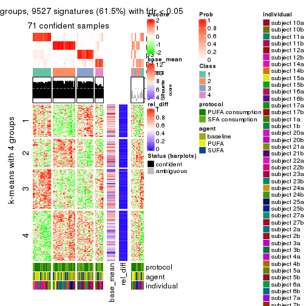</p>

</div>
<div id='tab-MAD-NMF-get-signatures-4'>
<pre><code class="r">get_signatures(res, k = 5)
</code></pre>

<p></p>

</div>
<div id='tab-MAD-NMF-get-signatures-5'>
<pre><code class="r">get_signatures(res, k = 6)
</code></pre>

<p></p>

</div>
</div>


Signature heatmaps where rows are not scaled:


<script>
$( function() {
	$( '#tabs-MAD-NMF-get-signatures-no-scale' ).tabs();
} );
</script>
<div id='tabs-MAD-NMF-get-signatures-no-scale'>
<ul>
<li><a href='#tab-MAD-NMF-get-signatures-no-scale-1'>k = 2</a></li>
<li><a href='#tab-MAD-NMF-get-signatures-no-scale-2'>k = 3</a></li>
<li><a href='#tab-MAD-NMF-get-signatures-no-scale-3'>k = 4</a></li>
<li><a href='#tab-MAD-NMF-get-signatures-no-scale-4'>k = 5</a></li>
<li><a href='#tab-MAD-NMF-get-signatures-no-scale-5'>k = 6</a></li>
</ul>
<div id='tab-MAD-NMF-get-signatures-no-scale-1'>
<pre><code class="r">get_signatures(res, k = 2, scale_rows = FALSE)
</code></pre>

<p></p>

</div>
<div id='tab-MAD-NMF-get-signatures-no-scale-2'>
<pre><code class="r">get_signatures(res, k = 3, scale_rows = FALSE)
</code></pre>

<p></p>

</div>
<div id='tab-MAD-NMF-get-signatures-no-scale-3'>
<pre><code class="r">get_signatures(res, k = 4, scale_rows = FALSE)
</code></pre>

<p>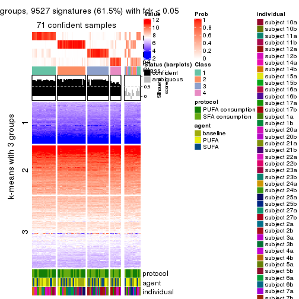</p>

</div>
<div id='tab-MAD-NMF-get-signatures-no-scale-4'>
<pre><code class="r">get_signatures(res, k = 5, scale_rows = FALSE)
</code></pre>

<p></p>

</div>
<div id='tab-MAD-NMF-get-signatures-no-scale-5'>
<pre><code class="r">get_signatures(res, k = 6, scale_rows = FALSE)
</code></pre>

<p></p>

</div>
</div>


Compare the overlap of signatures from different k:

```r
compare_signatures(res)
```


`get_signature()` returns a data frame invisibly. TO get the list of signatures, the function
call should be assigned to a variable explicitly. In following code, if `plot` argument is set
to `FALSE`, no heatmap is plotted while only the differential analysis is performed.

```r
# code only for demonstration
tb = get_signature(res, k = ..., plot = FALSE)
```

An example of the output of `tb` is:

```
#>   which_row         fdr    mean_1    mean_2 scaled_mean_1 scaled_mean_2 km
#> 1        38 0.042760348  8.373488  9.131774    -0.5533452     0.5164555  1
#> 2        40 0.018707592  7.106213  8.469186    -0.6173731     0.5762149  1
#> 3        55 0.019134737 10.221463 11.207825    -0.6159697     0.5749050  1
#> 4        59 0.006059896  5.921854  7.869574    -0.6899429     0.6439467  1
#> 5        60 0.018055526  8.928898 10.211722    -0.6204761     0.5791110  1
#> 6        98 0.009384629 15.714769 14.887706     0.6635654    -0.6193277  2
...
```

The columns in `tb` are:

1. `which_row`: row indices corresponding to the input matrix.
2. `fdr`: FDR for the differential test. 
3. `mean_x`: The mean value in group x.
4. `scaled_mean_x`: The mean value in group x after rows are scaled.
5. `km`: Row groups if k-means clustering is applied to rows.


UMAP plot which shows how samples are separated.


<script>
$( function() {
	$( '#tabs-MAD-NMF-dimension-reduction' ).tabs();
} );
</script>
<div id='tabs-MAD-NMF-dimension-reduction'>
<ul>
<li><a href='#tab-MAD-NMF-dimension-reduction-1'>k = 2</a></li>
<li><a href='#tab-MAD-NMF-dimension-reduction-2'>k = 3</a></li>
<li><a href='#tab-MAD-NMF-dimension-reduction-3'>k = 4</a></li>
<li><a href='#tab-MAD-NMF-dimension-reduction-4'>k = 5</a></li>
<li><a href='#tab-MAD-NMF-dimension-reduction-5'>k = 6</a></li>
</ul>
<div id='tab-MAD-NMF-dimension-reduction-1'>
<pre><code class="r">dimension_reduction(res, k = 2, method = &quot;UMAP&quot;)
</code></pre>

<p></p>

</div>
<div id='tab-MAD-NMF-dimension-reduction-2'>
<pre><code class="r">dimension_reduction(res, k = 3, method = &quot;UMAP&quot;)
</code></pre>

<p></p>

</div>
<div id='tab-MAD-NMF-dimension-reduction-3'>
<pre><code class="r">dimension_reduction(res, k = 4, method = &quot;UMAP&quot;)
</code></pre>

<p></p>

</div>
<div id='tab-MAD-NMF-dimension-reduction-4'>
<pre><code class="r">dimension_reduction(res, k = 5, method = &quot;UMAP&quot;)
</code></pre>

<p></p>

</div>
<div id='tab-MAD-NMF-dimension-reduction-5'>
<pre><code class="r">dimension_reduction(res, k = 6, method = &quot;UMAP&quot;)
</code></pre>

<p></p>

</div>
</div>


Following heatmap shows how subgroups are split when increasing `k`:

```r
collect_classes(res)
```


Test correlation between subgroups and known annotations. If the known
annotation is numeric, one-way ANOVA test is applied, and if the known
annotation is discrete, chi-squared contingency table test is applied.

```r
test_to_known_factors(res)
```

```
#>          n protocol(p) agent(p) individual(p) k
#> MAD:NMF 76       1.000    0.789      5.07e-03 2
#> MAD:NMF 81       0.991    0.928      2.93e-05 3
#> MAD:NMF 71       0.148    0.716      1.63e-06 4
#> MAD:NMF 40       0.145    0.668      1.25e-03 5
#> MAD:NMF 66       0.772    0.889      7.34e-08 6
```


If matrix rows can be associated to genes, consider to use `functional_enrichment(res,
...)` to perform function enrichment for the signature genes. See [this vignette](http://bioconductor.org/packages/devel/bioc/vignettes/cola/inst/doc/functional_enrichment.html) for more detailed explanations.


 

---------------------------------------------------


### ATC:hclust*


The object with results only for a single top-value method and a single partition method 
can be extracted as:

```r
res = res_list["ATC", "hclust"]
# you can also extract it by
# res = res_list["ATC:hclust"]
```

A summary of `res` and all the functions that can be applied to it:

```r
res
```

```
#> A 'ConsensusPartition' object with k = 2, 3, 4, 5, 6.
#>   On a matrix with 15497 rows and 84 columns.
#>   Top rows (1000, 2000, 3000, 4000, 5000) are extracted by 'ATC' method.
#>   Subgroups are detected by 'hclust' method.
#>   Performed in total 1250 partitions by row resampling.
#>   Best k for subgroups seems to be 2.
#> 
#> Following methods can be applied to this 'ConsensusPartition' object:
#>  [1] "cola_report"             "collect_classes"         "collect_plots"          
#>  [4] "collect_stats"           "colnames"                "compare_signatures"     
#>  [7] "consensus_heatmap"       "dimension_reduction"     "functional_enrichment"  
#> [10] "get_anno_col"            "get_anno"                "get_classes"            
#> [13] "get_consensus"           "get_matrix"              "get_membership"         
#> [16] "get_param"               "get_signatures"          "get_stats"              
#> [19] "is_best_k"               "is_stable_k"             "membership_heatmap"     
#> [22] "ncol"                    "nrow"                    "plot_ecdf"              
#> [25] "rownames"                "select_partition_number" "show"                   
#> [28] "suggest_best_k"          "test_to_known_factors"
```

`collect_plots()` function collects all the plots made from `res` for all `k` (number of partitions)
into one single page to provide an easy and fast comparison between different `k`.

```r
collect_plots(res)
```


The plots are:

- The first row: a plot of the ECDF (empirical cumulative distribution
  function) curves of the consensus matrix for each `k` and the heatmap of
  predicted classes for each `k`.
- The second row: heatmaps of the consensus matrix for each `k`.
- The third row: heatmaps of the membership matrix for each `k`.
- The fouth row: heatmaps of the signatures for each `k`.

All the plots in panels can be made by individual functions and they are
plotted later in this section.

`select_partition_number()` produces several plots showing different
statistics for choosing "optimized" `k`. There are following statistics:

- ECDF curves of the consensus matrix for each `k`;
- 1-PAC. [The PAC
  score](https://en.wikipedia.org/wiki/Consensus_clustering#Over-interpretation_potential_of_consensus_clustering)
  measures the proportion of the ambiguous subgrouping.
- Mean silhouette score.
- Concordance. The mean probability of fiting the consensus class ids in all
  partitions.
- Area increased. Denote $A_k$ as the area under the ECDF curve for current
  `k`, the area increased is defined as $A_k - A_{k-1}$.
- Rand index. The percent of pairs of samples that are both in a same cluster
  or both are not in a same cluster in the partition of k and k-1.
- Jaccard index. The ratio of pairs of samples are both in a same cluster in
  the partition of k and k-1 and the pairs of samples are both in a same
  cluster in the partition k or k-1.

The detailed explanations of these statistics can be found in [the _cola_
vignette](http://bioconductor.org/packages/devel/bioc/vignettes/cola/inst/doc/cola.html#toc_13).

Generally speaking, lower PAC score, higher mean silhouette score or higher
concordance corresponds to better partition. Rand index and Jaccard index
measure how similar the current partition is compared to partition with `k-1`.
If they are too similar, we won't accept `k` is better than `k-1`.

```r
select_partition_number(res)
```


The numeric values for all these statistics can be obtained by `get_stats()`.

```r
get_stats(res)
```

```
#>   k 1-PAC mean_silhouette concordance area_increased  Rand Jaccard
#> 2 2 0.904           0.944       0.970         0.4965 0.497   0.497
#> 3 3 0.698           0.867       0.909         0.2326 0.907   0.813
#> 4 4 0.639           0.804       0.840         0.1648 0.856   0.646
#> 5 5 0.687           0.642       0.807         0.0797 0.960   0.852
#> 6 6 0.703           0.581       0.743         0.0544 0.894   0.577
```

`suggest_best_k()` suggests the best $k$ based on these statistics. The rules are as follows:

- All $k$ with Jaccard index larger than 0.95 are removed because increasing
  $k$ does not provide enough extra information. If all $k$ are removed, it is
  marked as no subgroup is detected.
- For all $k$ with 1-PAC score larger than 0.9, the maximal $k$ is taken as
  the best $k$, and other $k$ are marked as optional $k$.
- If it does not fit the second rule. The $k$ with the maximal vote of the
  highest 1-PAC score, highest mean silhouette, and highest concordance is
  taken as the best $k$.

```r
suggest_best_k(res)
```

```
#> [1] 2
```


Following shows the table of the partitions (You need to click the **show/hide
code output** link to see it). The membership matrix (columns with name `p*`)
is inferred by
[`clue::cl_consensus()`](https://www.rdocumentation.org/link/cl_consensus?package=clue)
function with the `SE` method. Basically the value in the membership matrix
represents the probability to belong to a certain group. The finall class
label for an item is determined with the group with highest probability it
belongs to.

In `get_classes()` function, the entropy is calculated from the membership
matrix and the silhouette score is calculated from the consensus matrix.


<script>
$( function() {
	$( '#tabs-ATC-hclust-get-classes' ).tabs();
} );
</script>
<div id='tabs-ATC-hclust-get-classes'>
<ul>
<li><a href='#tab-ATC-hclust-get-classes-1'>k = 2</a></li>
<li><a href='#tab-ATC-hclust-get-classes-2'>k = 3</a></li>
<li><a href='#tab-ATC-hclust-get-classes-3'>k = 4</a></li>
<li><a href='#tab-ATC-hclust-get-classes-4'>k = 5</a></li>
<li><a href='#tab-ATC-hclust-get-classes-5'>k = 6</a></li>
</ul>

<div id='tab-ATC-hclust-get-classes-1'>
<p><a id='tab-ATC-hclust-get-classes-1-a' style='color:#0366d6' href='#'>show/hide code output</a></p>
<pre><code class="r">cbind(get_classes(res, k = 2), get_membership(res, k = 2))
</code></pre>

<pre><code>#&gt;           class entropy silhouette    p1    p2
#&gt; GSM339455     1  0.6801      0.813 0.820 0.180
#&gt; GSM339456     2  0.0000      0.985 0.000 1.000
#&gt; GSM339457     2  0.3274      0.943 0.060 0.940
#&gt; GSM339458     2  0.2236      0.961 0.036 0.964
#&gt; GSM339459     2  0.3274      0.943 0.060 0.940
#&gt; GSM339460     2  0.1843      0.967 0.028 0.972
#&gt; GSM339461     2  0.0000      0.985 0.000 1.000
#&gt; GSM339462     1  0.0000      0.949 1.000 0.000
#&gt; GSM339463     1  0.4690      0.890 0.900 0.100
#&gt; GSM339464     1  0.0000      0.949 1.000 0.000
#&gt; GSM339465     1  0.3431      0.914 0.936 0.064
#&gt; GSM339466     2  0.0000      0.985 0.000 1.000
#&gt; GSM339467     2  0.0000      0.985 0.000 1.000
#&gt; GSM339468     2  0.0000      0.985 0.000 1.000
#&gt; GSM339469     1  0.0000      0.949 1.000 0.000
#&gt; GSM339470     2  0.1414      0.973 0.020 0.980
#&gt; GSM339471     1  0.0000      0.949 1.000 0.000
#&gt; GSM339472     2  0.0000      0.985 0.000 1.000
#&gt; GSM339473     1  0.0000      0.949 1.000 0.000
#&gt; GSM339474     2  0.0000      0.985 0.000 1.000
#&gt; GSM339475     1  0.8207      0.712 0.744 0.256
#&gt; GSM339476     1  0.0000      0.949 1.000 0.000
#&gt; GSM339477     2  0.0000      0.985 0.000 1.000
#&gt; GSM339478     2  0.3274      0.943 0.060 0.940
#&gt; GSM339479     2  0.2236      0.961 0.036 0.964
#&gt; GSM339480     2  0.3274      0.943 0.060 0.940
#&gt; GSM339481     2  0.0000      0.985 0.000 1.000
#&gt; GSM339482     1  0.1633      0.939 0.976 0.024
#&gt; GSM339483     1  0.0000      0.949 1.000 0.000
#&gt; GSM339484     1  0.0000      0.949 1.000 0.000
#&gt; GSM339485     1  0.0000      0.949 1.000 0.000
#&gt; GSM339486     1  0.0000      0.949 1.000 0.000
#&gt; GSM339487     2  0.0000      0.985 0.000 1.000
#&gt; GSM339488     2  0.0000      0.985 0.000 1.000
#&gt; GSM339489     2  0.0000      0.985 0.000 1.000
#&gt; GSM339490     1  0.0000      0.949 1.000 0.000
#&gt; GSM339491     2  0.1414      0.973 0.020 0.980
#&gt; GSM339492     1  0.0000      0.949 1.000 0.000
#&gt; GSM339493     2  0.0000      0.985 0.000 1.000
#&gt; GSM339494     1  0.0000      0.949 1.000 0.000
#&gt; GSM339495     2  0.0000      0.985 0.000 1.000
#&gt; GSM339496     1  0.8144      0.718 0.748 0.252
#&gt; GSM339497     2  0.0000      0.985 0.000 1.000
#&gt; GSM339498     2  0.3274      0.943 0.060 0.940
#&gt; GSM339499     2  0.3274      0.943 0.060 0.940
#&gt; GSM339500     2  0.0000      0.985 0.000 1.000
#&gt; GSM339501     1  0.7883      0.750 0.764 0.236
#&gt; GSM339502     2  0.0000      0.985 0.000 1.000
#&gt; GSM339503     1  0.4815      0.886 0.896 0.104
#&gt; GSM339504     1  0.0000      0.949 1.000 0.000
#&gt; GSM339505     2  0.0000      0.985 0.000 1.000
#&gt; GSM339506     1  0.0000      0.949 1.000 0.000
#&gt; GSM339507     1  0.0000      0.949 1.000 0.000
#&gt; GSM339508     2  0.0000      0.985 0.000 1.000
#&gt; GSM339509     2  0.0000      0.985 0.000 1.000
#&gt; GSM339510     2  0.0000      0.985 0.000 1.000
#&gt; GSM339511     1  0.0000      0.949 1.000 0.000
#&gt; GSM339512     2  0.0000      0.985 0.000 1.000
#&gt; GSM339513     1  0.0000      0.949 1.000 0.000
#&gt; GSM339514     2  0.0000      0.985 0.000 1.000
#&gt; GSM339515     1  0.0000      0.949 1.000 0.000
#&gt; GSM339516     2  0.0000      0.985 0.000 1.000
#&gt; GSM339517     1  0.8661      0.657 0.712 0.288
#&gt; GSM339518     2  0.0000      0.985 0.000 1.000
#&gt; GSM339519     1  0.2236      0.933 0.964 0.036
#&gt; GSM339520     2  0.3274      0.943 0.060 0.940
#&gt; GSM339521     2  0.0000      0.985 0.000 1.000
#&gt; GSM339522     2  0.0000      0.985 0.000 1.000
#&gt; GSM339523     2  0.0000      0.985 0.000 1.000
#&gt; GSM339524     1  0.0376      0.947 0.996 0.004
#&gt; GSM339525     1  0.0000      0.949 1.000 0.000
#&gt; GSM339526     1  0.7674      0.757 0.776 0.224
#&gt; GSM339527     1  0.0000      0.949 1.000 0.000
#&gt; GSM339528     1  0.0000      0.949 1.000 0.000
#&gt; GSM339529     2  0.0000      0.985 0.000 1.000
#&gt; GSM339530     2  0.3274      0.943 0.060 0.940
#&gt; GSM339531     2  0.0000      0.985 0.000 1.000
#&gt; GSM339532     1  0.0000      0.949 1.000 0.000
#&gt; GSM339533     1  0.5178      0.876 0.884 0.116
#&gt; GSM339534     1  0.1184      0.943 0.984 0.016
#&gt; GSM339535     2  0.0000      0.985 0.000 1.000
#&gt; GSM339536     1  0.0000      0.949 1.000 0.000
#&gt; GSM339537     2  0.0000      0.985 0.000 1.000
#&gt; GSM339538     1  0.1633      0.939 0.976 0.024
</code></pre>

<script>
$('#tab-ATC-hclust-get-classes-1-a').parent().next().next().hide();
$('#tab-ATC-hclust-get-classes-1-a').click(function(){
  $('#tab-ATC-hclust-get-classes-1-a').parent().next().next().toggle();
  return(false);
});
</script>
</div>

<div id='tab-ATC-hclust-get-classes-2'>
<p><a id='tab-ATC-hclust-get-classes-2-a' style='color:#0366d6' href='#'>show/hide code output</a></p>
<pre><code class="r">cbind(get_classes(res, k = 3), get_membership(res, k = 3))
</code></pre>

<pre><code>#&gt;           class entropy silhouette    p1    p2    p3
#&gt; GSM339455     3  0.7606      0.747 0.244 0.092 0.664
#&gt; GSM339456     2  0.1753      0.894 0.000 0.952 0.048
#&gt; GSM339457     2  0.5098      0.794 0.000 0.752 0.248
#&gt; GSM339458     2  0.4235      0.851 0.000 0.824 0.176
#&gt; GSM339459     2  0.5098      0.794 0.000 0.752 0.248
#&gt; GSM339460     2  0.3412      0.880 0.000 0.876 0.124
#&gt; GSM339461     2  0.2711      0.899 0.000 0.912 0.088
#&gt; GSM339462     1  0.0000      0.959 1.000 0.000 0.000
#&gt; GSM339463     3  0.5167      0.806 0.192 0.016 0.792
#&gt; GSM339464     1  0.0000      0.959 1.000 0.000 0.000
#&gt; GSM339465     1  0.4702      0.657 0.788 0.000 0.212
#&gt; GSM339466     2  0.0747      0.905 0.000 0.984 0.016
#&gt; GSM339467     2  0.1753      0.894 0.000 0.952 0.048
#&gt; GSM339468     2  0.0592      0.905 0.000 0.988 0.012
#&gt; GSM339469     1  0.0000      0.959 1.000 0.000 0.000
#&gt; GSM339470     2  0.3941      0.866 0.000 0.844 0.156
#&gt; GSM339471     1  0.0000      0.959 1.000 0.000 0.000
#&gt; GSM339472     2  0.1753      0.894 0.000 0.952 0.048
#&gt; GSM339473     1  0.0000      0.959 1.000 0.000 0.000
#&gt; GSM339474     2  0.1753      0.894 0.000 0.952 0.048
#&gt; GSM339475     3  0.1753      0.781 0.000 0.048 0.952
#&gt; GSM339476     1  0.0424      0.953 0.992 0.000 0.008
#&gt; GSM339477     2  0.1753      0.894 0.000 0.952 0.048
#&gt; GSM339478     2  0.5098      0.794 0.000 0.752 0.248
#&gt; GSM339479     2  0.4235      0.851 0.000 0.824 0.176
#&gt; GSM339480     2  0.5098      0.794 0.000 0.752 0.248
#&gt; GSM339481     2  0.1753      0.894 0.000 0.952 0.048
#&gt; GSM339482     3  0.6172      0.695 0.308 0.012 0.680
#&gt; GSM339483     1  0.0000      0.959 1.000 0.000 0.000
#&gt; GSM339484     1  0.0424      0.953 0.992 0.000 0.008
#&gt; GSM339485     1  0.0000      0.959 1.000 0.000 0.000
#&gt; GSM339486     1  0.0424      0.953 0.992 0.000 0.008
#&gt; GSM339487     2  0.0747      0.905 0.000 0.984 0.016
#&gt; GSM339488     2  0.1753      0.894 0.000 0.952 0.048
#&gt; GSM339489     2  0.0592      0.905 0.000 0.988 0.012
#&gt; GSM339490     1  0.0000      0.959 1.000 0.000 0.000
#&gt; GSM339491     2  0.3941      0.866 0.000 0.844 0.156
#&gt; GSM339492     1  0.0000      0.959 1.000 0.000 0.000
#&gt; GSM339493     2  0.0000      0.903 0.000 1.000 0.000
#&gt; GSM339494     1  0.0000      0.959 1.000 0.000 0.000
#&gt; GSM339495     2  0.1753      0.894 0.000 0.952 0.048
#&gt; GSM339496     3  0.1878      0.784 0.004 0.044 0.952
#&gt; GSM339497     2  0.2261      0.897 0.000 0.932 0.068
#&gt; GSM339498     2  0.5098      0.794 0.000 0.752 0.248
#&gt; GSM339499     2  0.5098      0.794 0.000 0.752 0.248
#&gt; GSM339500     2  0.3116      0.886 0.000 0.892 0.108
#&gt; GSM339501     3  0.7860      0.729 0.228 0.116 0.656
#&gt; GSM339502     2  0.1753      0.894 0.000 0.952 0.048
#&gt; GSM339503     3  0.4840      0.813 0.168 0.016 0.816
#&gt; GSM339504     1  0.0000      0.959 1.000 0.000 0.000
#&gt; GSM339505     2  0.3619      0.874 0.000 0.864 0.136
#&gt; GSM339506     1  0.0000      0.959 1.000 0.000 0.000
#&gt; GSM339507     1  0.0424      0.953 0.992 0.000 0.008
#&gt; GSM339508     2  0.1753      0.894 0.000 0.952 0.048
#&gt; GSM339509     2  0.1753      0.894 0.000 0.952 0.048
#&gt; GSM339510     2  0.0592      0.905 0.000 0.988 0.012
#&gt; GSM339511     1  0.0000      0.959 1.000 0.000 0.000
#&gt; GSM339512     2  0.3192      0.888 0.000 0.888 0.112
#&gt; GSM339513     1  0.0000      0.959 1.000 0.000 0.000
#&gt; GSM339514     2  0.1753      0.894 0.000 0.952 0.048
#&gt; GSM339515     1  0.0000      0.959 1.000 0.000 0.000
#&gt; GSM339516     2  0.0592      0.905 0.000 0.988 0.012
#&gt; GSM339517     3  0.2537      0.766 0.000 0.080 0.920
#&gt; GSM339518     2  0.2261      0.897 0.000 0.932 0.068
#&gt; GSM339519     3  0.6600      0.575 0.384 0.012 0.604
#&gt; GSM339520     2  0.5098      0.794 0.000 0.752 0.248
#&gt; GSM339521     2  0.3116      0.886 0.000 0.892 0.108
#&gt; GSM339522     2  0.3038      0.887 0.000 0.896 0.104
#&gt; GSM339523     2  0.1753      0.894 0.000 0.952 0.048
#&gt; GSM339524     1  0.6104      0.267 0.648 0.004 0.348
#&gt; GSM339525     1  0.0000      0.959 1.000 0.000 0.000
#&gt; GSM339526     3  0.2313      0.795 0.032 0.024 0.944
#&gt; GSM339527     1  0.0000      0.959 1.000 0.000 0.000
#&gt; GSM339528     1  0.0424      0.953 0.992 0.000 0.008
#&gt; GSM339529     2  0.1753      0.894 0.000 0.952 0.048
#&gt; GSM339530     2  0.5098      0.794 0.000 0.752 0.248
#&gt; GSM339531     2  0.0592      0.905 0.000 0.988 0.012
#&gt; GSM339532     1  0.0000      0.959 1.000 0.000 0.000
#&gt; GSM339533     3  0.4663      0.815 0.156 0.016 0.828
#&gt; GSM339534     1  0.5244      0.582 0.756 0.004 0.240
#&gt; GSM339535     2  0.0000      0.903 0.000 1.000 0.000
#&gt; GSM339536     1  0.0000      0.959 1.000 0.000 0.000
#&gt; GSM339537     2  0.0592      0.905 0.000 0.988 0.012
#&gt; GSM339538     3  0.6051      0.713 0.292 0.012 0.696
</code></pre>

<script>
$('#tab-ATC-hclust-get-classes-2-a').parent().next().next().hide();
$('#tab-ATC-hclust-get-classes-2-a').click(function(){
  $('#tab-ATC-hclust-get-classes-2-a').parent().next().next().toggle();
  return(false);
});
</script>
</div>

<div id='tab-ATC-hclust-get-classes-3'>
<p><a id='tab-ATC-hclust-get-classes-3-a' style='color:#0366d6' href='#'>show/hide code output</a></p>
<pre><code class="r">cbind(get_classes(res, k = 4), get_membership(res, k = 4))
</code></pre>

<pre><code>#&gt;           class entropy silhouette    p1    p2    p3    p4
#&gt; GSM339455     3  0.6500      0.778 0.100 0.152 0.704 0.044
#&gt; GSM339456     4  0.2760      0.888 0.000 0.128 0.000 0.872
#&gt; GSM339457     2  0.1557      0.790 0.000 0.944 0.056 0.000
#&gt; GSM339458     2  0.3464      0.809 0.000 0.860 0.032 0.108
#&gt; GSM339459     2  0.1389      0.793 0.000 0.952 0.048 0.000
#&gt; GSM339460     2  0.4095      0.794 0.000 0.792 0.016 0.192
#&gt; GSM339461     2  0.4522      0.539 0.000 0.680 0.000 0.320
#&gt; GSM339462     1  0.1716      0.908 0.936 0.000 0.000 0.064
#&gt; GSM339463     3  0.2759      0.828 0.044 0.052 0.904 0.000
#&gt; GSM339464     1  0.0707      0.917 0.980 0.000 0.020 0.000
#&gt; GSM339465     1  0.5463      0.556 0.692 0.052 0.256 0.000
#&gt; GSM339466     2  0.3688      0.778 0.000 0.792 0.000 0.208
#&gt; GSM339467     4  0.2760      0.888 0.000 0.128 0.000 0.872
#&gt; GSM339468     2  0.3726      0.776 0.000 0.788 0.000 0.212
#&gt; GSM339469     1  0.1406      0.913 0.960 0.000 0.024 0.016
#&gt; GSM339470     2  0.2796      0.822 0.000 0.892 0.016 0.092
#&gt; GSM339471     1  0.3471      0.878 0.868 0.000 0.060 0.072
#&gt; GSM339472     4  0.2760      0.888 0.000 0.128 0.000 0.872
#&gt; GSM339473     1  0.1716      0.908 0.936 0.000 0.000 0.064
#&gt; GSM339474     4  0.2760      0.888 0.000 0.128 0.000 0.872
#&gt; GSM339475     3  0.3972      0.789 0.000 0.204 0.788 0.008
#&gt; GSM339476     1  0.1211      0.913 0.960 0.000 0.040 0.000
#&gt; GSM339477     4  0.2760      0.888 0.000 0.128 0.000 0.872
#&gt; GSM339478     2  0.1557      0.790 0.000 0.944 0.056 0.000
#&gt; GSM339479     2  0.3464      0.809 0.000 0.860 0.032 0.108
#&gt; GSM339480     2  0.1389      0.793 0.000 0.952 0.048 0.000
#&gt; GSM339481     4  0.3123      0.882 0.000 0.156 0.000 0.844
#&gt; GSM339482     3  0.2805      0.783 0.100 0.000 0.888 0.012
#&gt; GSM339483     1  0.1716      0.908 0.936 0.000 0.000 0.064
#&gt; GSM339484     1  0.1211      0.913 0.960 0.000 0.040 0.000
#&gt; GSM339485     1  0.0707      0.917 0.980 0.000 0.020 0.000
#&gt; GSM339486     1  0.1211      0.913 0.960 0.000 0.040 0.000
#&gt; GSM339487     2  0.3688      0.778 0.000 0.792 0.000 0.208
#&gt; GSM339488     4  0.2760      0.888 0.000 0.128 0.000 0.872
#&gt; GSM339489     2  0.3726      0.776 0.000 0.788 0.000 0.212
#&gt; GSM339490     1  0.1406      0.913 0.960 0.000 0.024 0.016
#&gt; GSM339491     2  0.2796      0.822 0.000 0.892 0.016 0.092
#&gt; GSM339492     1  0.3471      0.878 0.868 0.000 0.060 0.072
#&gt; GSM339493     4  0.4843      0.467 0.000 0.396 0.000 0.604
#&gt; GSM339494     1  0.1716      0.908 0.936 0.000 0.000 0.064
#&gt; GSM339495     4  0.2760      0.888 0.000 0.128 0.000 0.872
#&gt; GSM339496     3  0.3972      0.790 0.000 0.204 0.788 0.008
#&gt; GSM339497     2  0.4134      0.672 0.000 0.740 0.000 0.260
#&gt; GSM339498     2  0.1557      0.790 0.000 0.944 0.056 0.000
#&gt; GSM339499     2  0.1557      0.790 0.000 0.944 0.056 0.000
#&gt; GSM339500     2  0.2469      0.825 0.000 0.892 0.000 0.108
#&gt; GSM339501     3  0.6901      0.750 0.088 0.212 0.656 0.044
#&gt; GSM339502     4  0.3172      0.880 0.000 0.160 0.000 0.840
#&gt; GSM339503     3  0.2174      0.826 0.020 0.052 0.928 0.000
#&gt; GSM339504     1  0.1716      0.908 0.936 0.000 0.000 0.064
#&gt; GSM339505     2  0.1978      0.826 0.000 0.928 0.004 0.068
#&gt; GSM339506     1  0.0707      0.917 0.980 0.000 0.020 0.000
#&gt; GSM339507     1  0.1211      0.913 0.960 0.000 0.040 0.000
#&gt; GSM339508     4  0.4661      0.616 0.000 0.348 0.000 0.652
#&gt; GSM339509     4  0.2868      0.888 0.000 0.136 0.000 0.864
#&gt; GSM339510     2  0.3726      0.776 0.000 0.788 0.000 0.212
#&gt; GSM339511     1  0.1406      0.913 0.960 0.000 0.024 0.016
#&gt; GSM339512     2  0.2647      0.823 0.000 0.880 0.000 0.120
#&gt; GSM339513     1  0.3471      0.878 0.868 0.000 0.060 0.072
#&gt; GSM339514     4  0.3311      0.869 0.000 0.172 0.000 0.828
#&gt; GSM339515     1  0.1716      0.908 0.936 0.000 0.000 0.064
#&gt; GSM339516     2  0.3726      0.776 0.000 0.788 0.000 0.212
#&gt; GSM339517     3  0.4422      0.751 0.000 0.256 0.736 0.008
#&gt; GSM339518     2  0.4134      0.672 0.000 0.740 0.000 0.260
#&gt; GSM339519     3  0.5142      0.733 0.160 0.016 0.772 0.052
#&gt; GSM339520     2  0.1557      0.790 0.000 0.944 0.056 0.000
#&gt; GSM339521     2  0.2469      0.825 0.000 0.892 0.000 0.108
#&gt; GSM339522     2  0.3945      0.725 0.000 0.780 0.004 0.216
#&gt; GSM339523     4  0.3074      0.884 0.000 0.152 0.000 0.848
#&gt; GSM339524     3  0.5383      0.151 0.452 0.000 0.536 0.012
#&gt; GSM339525     1  0.1716      0.908 0.936 0.000 0.000 0.064
#&gt; GSM339526     3  0.3863      0.804 0.004 0.176 0.812 0.008
#&gt; GSM339527     1  0.0707      0.917 0.980 0.000 0.020 0.000
#&gt; GSM339528     1  0.1211      0.913 0.960 0.000 0.040 0.000
#&gt; GSM339529     4  0.4661      0.616 0.000 0.348 0.000 0.652
#&gt; GSM339530     2  0.1557      0.790 0.000 0.944 0.056 0.000
#&gt; GSM339531     2  0.3726      0.776 0.000 0.788 0.000 0.212
#&gt; GSM339532     1  0.1406      0.913 0.960 0.000 0.024 0.016
#&gt; GSM339533     3  0.2376      0.827 0.016 0.068 0.916 0.000
#&gt; GSM339534     1  0.6450      0.284 0.572 0.012 0.364 0.052
#&gt; GSM339535     4  0.4843      0.467 0.000 0.396 0.000 0.604
#&gt; GSM339536     1  0.1716      0.908 0.936 0.000 0.000 0.064
#&gt; GSM339537     2  0.3726      0.776 0.000 0.788 0.000 0.212
#&gt; GSM339538     3  0.3614      0.788 0.100 0.016 0.864 0.020
</code></pre>

<script>
$('#tab-ATC-hclust-get-classes-3-a').parent().next().next().hide();
$('#tab-ATC-hclust-get-classes-3-a').click(function(){
  $('#tab-ATC-hclust-get-classes-3-a').parent().next().next().toggle();
  return(false);
});
</script>
</div>

<div id='tab-ATC-hclust-get-classes-4'>
<p><a id='tab-ATC-hclust-get-classes-4-a' style='color:#0366d6' href='#'>show/hide code output</a></p>
<pre><code class="r">cbind(get_classes(res, k = 5), get_membership(res, k = 5))
</code></pre>

<pre><code>#&gt;           class entropy silhouette    p1    p2    p3    p4    p5
#&gt; GSM339455     3  0.5722     0.6894 0.000 0.008 0.600 0.304 0.088
#&gt; GSM339456     2  0.0404     0.8623 0.000 0.988 0.000 0.000 0.012
#&gt; GSM339457     5  0.2886     0.8099 0.000 0.000 0.148 0.008 0.844
#&gt; GSM339458     5  0.2910     0.8248 0.000 0.012 0.044 0.060 0.884
#&gt; GSM339459     5  0.2798     0.8122 0.000 0.000 0.140 0.008 0.852
#&gt; GSM339460     5  0.3948     0.8186 0.000 0.096 0.024 0.056 0.824
#&gt; GSM339461     5  0.3561     0.6344 0.000 0.260 0.000 0.000 0.740
#&gt; GSM339462     1  0.0609     0.5119 0.980 0.000 0.000 0.020 0.000
#&gt; GSM339463     3  0.3143     0.7786 0.000 0.000 0.796 0.204 0.000
#&gt; GSM339464     1  0.4291     0.2295 0.536 0.000 0.000 0.464 0.000
#&gt; GSM339465     4  0.6166     0.2049 0.272 0.000 0.180 0.548 0.000
#&gt; GSM339466     5  0.3016     0.8236 0.000 0.132 0.000 0.020 0.848
#&gt; GSM339467     2  0.0404     0.8623 0.000 0.988 0.000 0.000 0.012
#&gt; GSM339468     5  0.3193     0.8221 0.000 0.132 0.000 0.028 0.840
#&gt; GSM339469     4  0.4434     0.3979 0.460 0.000 0.004 0.536 0.000
#&gt; GSM339470     5  0.1524     0.8429 0.000 0.016 0.016 0.016 0.952
#&gt; GSM339471     1  0.2852     0.3713 0.828 0.000 0.000 0.172 0.000
#&gt; GSM339472     2  0.0404     0.8623 0.000 0.988 0.000 0.000 0.012
#&gt; GSM339473     1  0.1270     0.5336 0.948 0.000 0.000 0.052 0.000
#&gt; GSM339474     2  0.0404     0.8623 0.000 0.988 0.000 0.000 0.012
#&gt; GSM339475     3  0.1341     0.7545 0.000 0.000 0.944 0.000 0.056
#&gt; GSM339476     1  0.4434     0.2451 0.536 0.000 0.004 0.460 0.000
#&gt; GSM339477     2  0.0404     0.8623 0.000 0.988 0.000 0.000 0.012
#&gt; GSM339478     5  0.2886     0.8099 0.000 0.000 0.148 0.008 0.844
#&gt; GSM339479     5  0.2910     0.8248 0.000 0.012 0.044 0.060 0.884
#&gt; GSM339480     5  0.2798     0.8122 0.000 0.000 0.140 0.008 0.852
#&gt; GSM339481     2  0.1478     0.8571 0.000 0.936 0.000 0.000 0.064
#&gt; GSM339482     3  0.3913     0.7399 0.000 0.000 0.676 0.324 0.000
#&gt; GSM339483     1  0.0609     0.5119 0.980 0.000 0.000 0.020 0.000
#&gt; GSM339484     1  0.4434     0.2451 0.536 0.000 0.004 0.460 0.000
#&gt; GSM339485     1  0.4291     0.2295 0.536 0.000 0.000 0.464 0.000
#&gt; GSM339486     1  0.4297     0.2395 0.528 0.000 0.000 0.472 0.000
#&gt; GSM339487     5  0.3016     0.8236 0.000 0.132 0.000 0.020 0.848
#&gt; GSM339488     2  0.0404     0.8623 0.000 0.988 0.000 0.000 0.012
#&gt; GSM339489     5  0.3193     0.8221 0.000 0.132 0.000 0.028 0.840
#&gt; GSM339490     4  0.4434     0.3979 0.460 0.000 0.004 0.536 0.000
#&gt; GSM339491     5  0.1524     0.8429 0.000 0.016 0.016 0.016 0.952
#&gt; GSM339492     1  0.2852     0.3713 0.828 0.000 0.000 0.172 0.000
#&gt; GSM339493     2  0.4088     0.4352 0.000 0.632 0.000 0.000 0.368
#&gt; GSM339494     1  0.1270     0.5336 0.948 0.000 0.000 0.052 0.000
#&gt; GSM339495     2  0.0404     0.8623 0.000 0.988 0.000 0.000 0.012
#&gt; GSM339496     3  0.1341     0.7561 0.000 0.000 0.944 0.000 0.056
#&gt; GSM339497     5  0.3109     0.7286 0.000 0.200 0.000 0.000 0.800
#&gt; GSM339498     5  0.2886     0.8099 0.000 0.000 0.148 0.008 0.844
#&gt; GSM339499     5  0.2886     0.8099 0.000 0.000 0.148 0.008 0.844
#&gt; GSM339500     5  0.1205     0.8475 0.000 0.040 0.000 0.004 0.956
#&gt; GSM339501     3  0.6261     0.6099 0.000 0.008 0.576 0.228 0.188
#&gt; GSM339502     2  0.1608     0.8545 0.000 0.928 0.000 0.000 0.072
#&gt; GSM339503     3  0.2929     0.7843 0.000 0.000 0.820 0.180 0.000
#&gt; GSM339504     1  0.0609     0.5119 0.980 0.000 0.000 0.020 0.000
#&gt; GSM339505     5  0.0693     0.8458 0.000 0.000 0.008 0.012 0.980
#&gt; GSM339506     1  0.4291     0.2295 0.536 0.000 0.000 0.464 0.000
#&gt; GSM339507     1  0.4297     0.2395 0.528 0.000 0.000 0.472 0.000
#&gt; GSM339508     2  0.4047     0.5539 0.000 0.676 0.000 0.004 0.320
#&gt; GSM339509     2  0.0703     0.8625 0.000 0.976 0.000 0.000 0.024
#&gt; GSM339510     5  0.3193     0.8221 0.000 0.132 0.000 0.028 0.840
#&gt; GSM339511     4  0.4430     0.3999 0.456 0.000 0.004 0.540 0.000
#&gt; GSM339512     5  0.1430     0.8478 0.000 0.052 0.000 0.004 0.944
#&gt; GSM339513     1  0.2852     0.3713 0.828 0.000 0.000 0.172 0.000
#&gt; GSM339514     2  0.1732     0.8455 0.000 0.920 0.000 0.000 0.080
#&gt; GSM339515     1  0.1270     0.5336 0.948 0.000 0.000 0.052 0.000
#&gt; GSM339516     5  0.3193     0.8221 0.000 0.132 0.000 0.028 0.840
#&gt; GSM339517     3  0.2304     0.7205 0.000 0.000 0.892 0.008 0.100
#&gt; GSM339518     5  0.3109     0.7286 0.000 0.200 0.000 0.000 0.800
#&gt; GSM339519     3  0.4651     0.6594 0.000 0.008 0.560 0.428 0.004
#&gt; GSM339520     5  0.2886     0.8099 0.000 0.000 0.148 0.008 0.844
#&gt; GSM339521     5  0.1205     0.8475 0.000 0.040 0.000 0.004 0.956
#&gt; GSM339522     5  0.3340     0.7602 0.000 0.156 0.016 0.004 0.824
#&gt; GSM339523     2  0.1410     0.8580 0.000 0.940 0.000 0.000 0.060
#&gt; GSM339524     4  0.5338    -0.0987 0.072 0.000 0.324 0.604 0.000
#&gt; GSM339525     1  0.0880     0.5103 0.968 0.000 0.000 0.032 0.000
#&gt; GSM339526     3  0.1168     0.7616 0.000 0.000 0.960 0.008 0.032
#&gt; GSM339527     1  0.4291     0.2295 0.536 0.000 0.000 0.464 0.000
#&gt; GSM339528     1  0.4297     0.2395 0.528 0.000 0.000 0.472 0.000
#&gt; GSM339529     2  0.4047     0.5539 0.000 0.676 0.000 0.004 0.320
#&gt; GSM339530     5  0.2886     0.8099 0.000 0.000 0.148 0.008 0.844
#&gt; GSM339531     5  0.3193     0.8221 0.000 0.132 0.000 0.028 0.840
#&gt; GSM339532     4  0.4430     0.3999 0.456 0.000 0.004 0.540 0.000
#&gt; GSM339533     3  0.3304     0.7898 0.000 0.000 0.816 0.168 0.016
#&gt; GSM339534     4  0.6209     0.2585 0.184 0.008 0.224 0.584 0.000
#&gt; GSM339535     2  0.4088     0.4352 0.000 0.632 0.000 0.000 0.368
#&gt; GSM339536     1  0.1270     0.5336 0.948 0.000 0.000 0.052 0.000
#&gt; GSM339537     5  0.3193     0.8221 0.000 0.132 0.000 0.028 0.840
#&gt; GSM339538     3  0.3796     0.7482 0.000 0.000 0.700 0.300 0.000
</code></pre>

<script>
$('#tab-ATC-hclust-get-classes-4-a').parent().next().next().hide();
$('#tab-ATC-hclust-get-classes-4-a').click(function(){
  $('#tab-ATC-hclust-get-classes-4-a').parent().next().next().toggle();
  return(false);
});
</script>
</div>

<div id='tab-ATC-hclust-get-classes-5'>
<p><a id='tab-ATC-hclust-get-classes-5-a' style='color:#0366d6' href='#'>show/hide code output</a></p>
<pre><code class="r">cbind(get_classes(res, k = 6), get_membership(res, k = 6))
</code></pre>

<pre><code>#&gt;           class entropy silhouette    p1    p2    p3    p4    p5    p6
#&gt; GSM339455     3  0.4049      0.746 0.004 0.000 0.768 0.036 0.020 0.172
#&gt; GSM339456     2  0.0000      0.864 0.000 1.000 0.000 0.000 0.000 0.000
#&gt; GSM339457     6  0.3515      0.865 0.000 0.000 0.000 0.000 0.324 0.676
#&gt; GSM339458     5  0.3568      0.364 0.008 0.000 0.016 0.000 0.764 0.212
#&gt; GSM339459     6  0.3547      0.859 0.000 0.000 0.000 0.000 0.332 0.668
#&gt; GSM339460     5  0.4464      0.430 0.008 0.084 0.004 0.000 0.732 0.172
#&gt; GSM339461     5  0.5889      0.165 0.000 0.260 0.000 0.000 0.476 0.264
#&gt; GSM339462     1  0.3684      0.706 0.628 0.000 0.000 0.372 0.000 0.000
#&gt; GSM339463     3  0.0790      0.798 0.000 0.000 0.968 0.032 0.000 0.000
#&gt; GSM339464     4  0.0260      0.674 0.008 0.000 0.000 0.992 0.000 0.000
#&gt; GSM339465     4  0.3409      0.421 0.000 0.000 0.300 0.700 0.000 0.000
#&gt; GSM339466     5  0.4650      0.429 0.000 0.132 0.000 0.000 0.688 0.180
#&gt; GSM339467     2  0.0000      0.864 0.000 1.000 0.000 0.000 0.000 0.000
#&gt; GSM339468     5  0.2178      0.554 0.000 0.132 0.000 0.000 0.868 0.000
#&gt; GSM339469     4  0.5007      0.415 0.416 0.000 0.000 0.512 0.000 0.072
#&gt; GSM339470     6  0.4226      0.223 0.000 0.008 0.004 0.000 0.484 0.504
#&gt; GSM339471     1  0.3361      0.608 0.788 0.000 0.020 0.188 0.000 0.004
#&gt; GSM339472     2  0.0000      0.864 0.000 1.000 0.000 0.000 0.000 0.000
#&gt; GSM339473     1  0.3862      0.664 0.524 0.000 0.000 0.476 0.000 0.000
#&gt; GSM339474     2  0.0000      0.864 0.000 1.000 0.000 0.000 0.000 0.000
#&gt; GSM339475     3  0.3109      0.758 0.004 0.000 0.772 0.000 0.000 0.224
#&gt; GSM339476     4  0.2265      0.633 0.076 0.000 0.024 0.896 0.000 0.004
#&gt; GSM339477     2  0.0000      0.864 0.000 1.000 0.000 0.000 0.000 0.000
#&gt; GSM339478     6  0.3515      0.865 0.000 0.000 0.000 0.000 0.324 0.676
#&gt; GSM339479     5  0.3568      0.364 0.008 0.000 0.016 0.000 0.764 0.212
#&gt; GSM339480     6  0.3547      0.859 0.000 0.000 0.000 0.000 0.332 0.668
#&gt; GSM339481     2  0.1219      0.852 0.000 0.948 0.000 0.000 0.048 0.004
#&gt; GSM339482     3  0.2981      0.774 0.116 0.000 0.848 0.020 0.000 0.016
#&gt; GSM339483     1  0.3684      0.706 0.628 0.000 0.000 0.372 0.000 0.000
#&gt; GSM339484     4  0.2265      0.633 0.076 0.000 0.024 0.896 0.000 0.004
#&gt; GSM339485     4  0.0260      0.674 0.008 0.000 0.000 0.992 0.000 0.000
#&gt; GSM339486     4  0.1867      0.650 0.064 0.000 0.020 0.916 0.000 0.000
#&gt; GSM339487     5  0.4650      0.429 0.000 0.132 0.000 0.000 0.688 0.180
#&gt; GSM339488     2  0.0000      0.864 0.000 1.000 0.000 0.000 0.000 0.000
#&gt; GSM339489     5  0.2178      0.554 0.000 0.132 0.000 0.000 0.868 0.000
#&gt; GSM339490     4  0.5007      0.415 0.416 0.000 0.000 0.512 0.000 0.072
#&gt; GSM339491     6  0.4226      0.223 0.000 0.008 0.004 0.000 0.484 0.504
#&gt; GSM339492     1  0.3361      0.608 0.788 0.000 0.020 0.188 0.000 0.004
#&gt; GSM339493     2  0.3874      0.355 0.000 0.636 0.000 0.000 0.356 0.008
#&gt; GSM339494     1  0.3862      0.664 0.524 0.000 0.000 0.476 0.000 0.000
#&gt; GSM339495     2  0.0000      0.864 0.000 1.000 0.000 0.000 0.000 0.000
#&gt; GSM339496     3  0.3109      0.760 0.004 0.000 0.772 0.000 0.000 0.224
#&gt; GSM339497     5  0.5710      0.169 0.000 0.200 0.000 0.000 0.512 0.288
#&gt; GSM339498     6  0.3515      0.865 0.000 0.000 0.000 0.000 0.324 0.676
#&gt; GSM339499     6  0.3515      0.865 0.000 0.000 0.000 0.000 0.324 0.676
#&gt; GSM339500     5  0.4603     -0.252 0.000 0.040 0.000 0.000 0.544 0.416
#&gt; GSM339501     3  0.5628      0.688 0.012 0.000 0.648 0.036 0.204 0.100
#&gt; GSM339502     2  0.1411      0.847 0.000 0.936 0.000 0.000 0.060 0.004
#&gt; GSM339503     3  0.0260      0.800 0.000 0.000 0.992 0.008 0.000 0.000
#&gt; GSM339504     1  0.3684      0.706 0.628 0.000 0.000 0.372 0.000 0.000
#&gt; GSM339505     5  0.3998     -0.473 0.000 0.000 0.004 0.000 0.504 0.492
#&gt; GSM339506     4  0.0260      0.674 0.008 0.000 0.000 0.992 0.000 0.000
#&gt; GSM339507     4  0.1867      0.650 0.064 0.000 0.020 0.916 0.000 0.000
#&gt; GSM339508     2  0.3784      0.545 0.000 0.680 0.000 0.000 0.308 0.012
#&gt; GSM339509     2  0.0458      0.862 0.000 0.984 0.000 0.000 0.016 0.000
#&gt; GSM339510     5  0.2178      0.554 0.000 0.132 0.000 0.000 0.868 0.000
#&gt; GSM339511     4  0.5040      0.419 0.408 0.000 0.000 0.516 0.000 0.076
#&gt; GSM339512     5  0.4768     -0.269 0.000 0.052 0.000 0.000 0.532 0.416
#&gt; GSM339513     1  0.3361      0.608 0.788 0.000 0.020 0.188 0.000 0.004
#&gt; GSM339514     2  0.1643      0.830 0.000 0.924 0.000 0.000 0.068 0.008
#&gt; GSM339515     1  0.3862      0.664 0.524 0.000 0.000 0.476 0.000 0.000
#&gt; GSM339516     5  0.2320      0.552 0.000 0.132 0.000 0.000 0.864 0.004
#&gt; GSM339517     3  0.3543      0.727 0.004 0.000 0.720 0.000 0.004 0.272
#&gt; GSM339518     5  0.5710      0.169 0.000 0.200 0.000 0.000 0.512 0.288
#&gt; GSM339519     3  0.4944      0.732 0.120 0.000 0.732 0.036 0.012 0.100
#&gt; GSM339520     6  0.3515      0.865 0.000 0.000 0.000 0.000 0.324 0.676
#&gt; GSM339521     5  0.4603     -0.252 0.000 0.040 0.000 0.000 0.544 0.416
#&gt; GSM339522     5  0.4881      0.339 0.008 0.156 0.000 0.000 0.684 0.152
#&gt; GSM339523     2  0.1152      0.853 0.000 0.952 0.000 0.000 0.044 0.004
#&gt; GSM339524     3  0.5845      0.272 0.128 0.000 0.488 0.368 0.000 0.016
#&gt; GSM339525     1  0.3717      0.696 0.616 0.000 0.000 0.384 0.000 0.000
#&gt; GSM339526     3  0.3043      0.766 0.004 0.000 0.796 0.004 0.000 0.196
#&gt; GSM339527     4  0.0260      0.674 0.008 0.000 0.000 0.992 0.000 0.000
#&gt; GSM339528     4  0.1867      0.650 0.064 0.000 0.020 0.916 0.000 0.000
#&gt; GSM339529     2  0.3784      0.545 0.000 0.680 0.000 0.000 0.308 0.012
#&gt; GSM339530     6  0.3515      0.865 0.000 0.000 0.000 0.000 0.324 0.676
#&gt; GSM339531     5  0.2178      0.554 0.000 0.132 0.000 0.000 0.868 0.000
#&gt; GSM339532     4  0.5040      0.419 0.408 0.000 0.000 0.516 0.000 0.076
#&gt; GSM339533     3  0.0717      0.803 0.000 0.000 0.976 0.008 0.000 0.016
#&gt; GSM339534     1  0.7509     -0.294 0.376 0.000 0.296 0.212 0.012 0.104
#&gt; GSM339535     2  0.3874      0.355 0.000 0.636 0.000 0.000 0.356 0.008
#&gt; GSM339536     1  0.3862      0.664 0.524 0.000 0.000 0.476 0.000 0.000
#&gt; GSM339537     5  0.2178      0.554 0.000 0.132 0.000 0.000 0.868 0.000
#&gt; GSM339538     3  0.3307      0.780 0.120 0.000 0.828 0.012 0.000 0.040
</code></pre>

<script>
$('#tab-ATC-hclust-get-classes-5-a').parent().next().next().hide();
$('#tab-ATC-hclust-get-classes-5-a').click(function(){
  $('#tab-ATC-hclust-get-classes-5-a').parent().next().next().toggle();
  return(false);
});
</script>
</div>
</div>

Heatmaps for the consensus matrix. It visualizes the probability of two
samples to be in a same group.


<script>
$( function() {
	$( '#tabs-ATC-hclust-consensus-heatmap' ).tabs();
} );
</script>
<div id='tabs-ATC-hclust-consensus-heatmap'>
<ul>
<li><a href='#tab-ATC-hclust-consensus-heatmap-1'>k = 2</a></li>
<li><a href='#tab-ATC-hclust-consensus-heatmap-2'>k = 3</a></li>
<li><a href='#tab-ATC-hclust-consensus-heatmap-3'>k = 4</a></li>
<li><a href='#tab-ATC-hclust-consensus-heatmap-4'>k = 5</a></li>
<li><a href='#tab-ATC-hclust-consensus-heatmap-5'>k = 6</a></li>
</ul>
<div id='tab-ATC-hclust-consensus-heatmap-1'>
<pre><code class="r">consensus_heatmap(res, k = 2)
</code></pre>

<p></p>

</div>
<div id='tab-ATC-hclust-consensus-heatmap-2'>
<pre><code class="r">consensus_heatmap(res, k = 3)
</code></pre>

<p>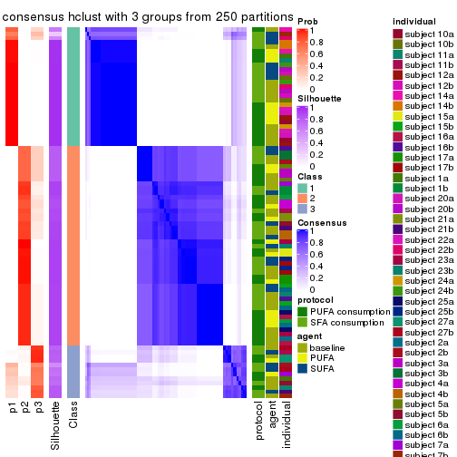</p>

</div>
<div id='tab-ATC-hclust-consensus-heatmap-3'>
<pre><code class="r">consensus_heatmap(res, k = 4)
</code></pre>

<p></p>

</div>
<div id='tab-ATC-hclust-consensus-heatmap-4'>
<pre><code class="r">consensus_heatmap(res, k = 5)
</code></pre>

<p></p>

</div>
<div id='tab-ATC-hclust-consensus-heatmap-5'>
<pre><code class="r">consensus_heatmap(res, k = 6)
</code></pre>

<p></p>

</div>
</div>

Heatmaps for the membership of samples in all partitions to see how consistent they are:


<script>
$( function() {
	$( '#tabs-ATC-hclust-membership-heatmap' ).tabs();
} );
</script>
<div id='tabs-ATC-hclust-membership-heatmap'>
<ul>
<li><a href='#tab-ATC-hclust-membership-heatmap-1'>k = 2</a></li>
<li><a href='#tab-ATC-hclust-membership-heatmap-2'>k = 3</a></li>
<li><a href='#tab-ATC-hclust-membership-heatmap-3'>k = 4</a></li>
<li><a href='#tab-ATC-hclust-membership-heatmap-4'>k = 5</a></li>
<li><a href='#tab-ATC-hclust-membership-heatmap-5'>k = 6</a></li>
</ul>
<div id='tab-ATC-hclust-membership-heatmap-1'>
<pre><code class="r">membership_heatmap(res, k = 2)
</code></pre>

<p></p>

</div>
<div id='tab-ATC-hclust-membership-heatmap-2'>
<pre><code class="r">membership_heatmap(res, k = 3)
</code></pre>

<p></p>

</div>
<div id='tab-ATC-hclust-membership-heatmap-3'>
<pre><code class="r">membership_heatmap(res, k = 4)
</code></pre>

<p></p>

</div>
<div id='tab-ATC-hclust-membership-heatmap-4'>
<pre><code class="r">membership_heatmap(res, k = 5)
</code></pre>

<p>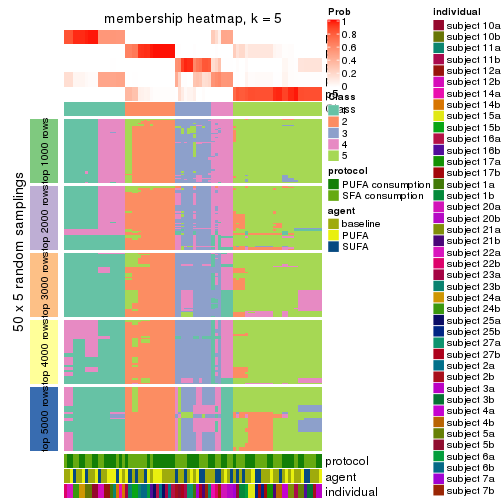</p>

</div>
<div id='tab-ATC-hclust-membership-heatmap-5'>
<pre><code class="r">membership_heatmap(res, k = 6)
</code></pre>

<p></p>

</div>
</div>

As soon as we have had the classes for columns, we can look for signatures
which are significantly different between classes which can be candidate marks
for certain classes. Following are the heatmaps for signatures.


Signature heatmaps where rows are scaled:


<script>
$( function() {
	$( '#tabs-ATC-hclust-get-signatures' ).tabs();
} );
</script>
<div id='tabs-ATC-hclust-get-signatures'>
<ul>
<li><a href='#tab-ATC-hclust-get-signatures-1'>k = 2</a></li>
<li><a href='#tab-ATC-hclust-get-signatures-2'>k = 3</a></li>
<li><a href='#tab-ATC-hclust-get-signatures-3'>k = 4</a></li>
<li><a href='#tab-ATC-hclust-get-signatures-4'>k = 5</a></li>
<li><a href='#tab-ATC-hclust-get-signatures-5'>k = 6</a></li>
</ul>
<div id='tab-ATC-hclust-get-signatures-1'>
<pre><code class="r">get_signatures(res, k = 2)
</code></pre>

<p></p>

</div>
<div id='tab-ATC-hclust-get-signatures-2'>
<pre><code class="r">get_signatures(res, k = 3)
</code></pre>

<p></p>

</div>
<div id='tab-ATC-hclust-get-signatures-3'>
<pre><code class="r">get_signatures(res, k = 4)
</code></pre>

<p></p>

</div>
<div id='tab-ATC-hclust-get-signatures-4'>
<pre><code class="r">get_signatures(res, k = 5)
</code></pre>

<p></p>

</div>
<div id='tab-ATC-hclust-get-signatures-5'>
<pre><code class="r">get_signatures(res, k = 6)
</code></pre>

<p></p>

</div>
</div>


Signature heatmaps where rows are not scaled:


<script>
$( function() {
	$( '#tabs-ATC-hclust-get-signatures-no-scale' ).tabs();
} );
</script>
<div id='tabs-ATC-hclust-get-signatures-no-scale'>
<ul>
<li><a href='#tab-ATC-hclust-get-signatures-no-scale-1'>k = 2</a></li>
<li><a href='#tab-ATC-hclust-get-signatures-no-scale-2'>k = 3</a></li>
<li><a href='#tab-ATC-hclust-get-signatures-no-scale-3'>k = 4</a></li>
<li><a href='#tab-ATC-hclust-get-signatures-no-scale-4'>k = 5</a></li>
<li><a href='#tab-ATC-hclust-get-signatures-no-scale-5'>k = 6</a></li>
</ul>
<div id='tab-ATC-hclust-get-signatures-no-scale-1'>
<pre><code class="r">get_signatures(res, k = 2, scale_rows = FALSE)
</code></pre>

<p></p>

</div>
<div id='tab-ATC-hclust-get-signatures-no-scale-2'>
<pre><code class="r">get_signatures(res, k = 3, scale_rows = FALSE)
</code></pre>

<p></p>

</div>
<div id='tab-ATC-hclust-get-signatures-no-scale-3'>
<pre><code class="r">get_signatures(res, k = 4, scale_rows = FALSE)
</code></pre>

<p></p>

</div>
<div id='tab-ATC-hclust-get-signatures-no-scale-4'>
<pre><code class="r">get_signatures(res, k = 5, scale_rows = FALSE)
</code></pre>

<p>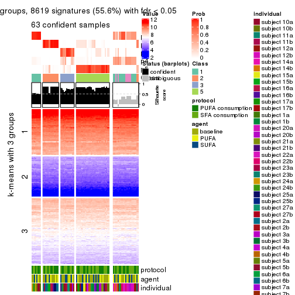</p>

</div>
<div id='tab-ATC-hclust-get-signatures-no-scale-5'>
<pre><code class="r">get_signatures(res, k = 6, scale_rows = FALSE)
</code></pre>

<p></p>

</div>
</div>


Compare the overlap of signatures from different k:

```r
compare_signatures(res)
```


`get_signature()` returns a data frame invisibly. TO get the list of signatures, the function
call should be assigned to a variable explicitly. In following code, if `plot` argument is set
to `FALSE`, no heatmap is plotted while only the differential analysis is performed.

```r
# code only for demonstration
tb = get_signature(res, k = ..., plot = FALSE)
```

An example of the output of `tb` is:

```
#>   which_row         fdr    mean_1    mean_2 scaled_mean_1 scaled_mean_2 km
#> 1        38 0.042760348  8.373488  9.131774    -0.5533452     0.5164555  1
#> 2        40 0.018707592  7.106213  8.469186    -0.6173731     0.5762149  1
#> 3        55 0.019134737 10.221463 11.207825    -0.6159697     0.5749050  1
#> 4        59 0.006059896  5.921854  7.869574    -0.6899429     0.6439467  1
#> 5        60 0.018055526  8.928898 10.211722    -0.6204761     0.5791110  1
#> 6        98 0.009384629 15.714769 14.887706     0.6635654    -0.6193277  2
...
```

The columns in `tb` are:

1. `which_row`: row indices corresponding to the input matrix.
2. `fdr`: FDR for the differential test. 
3. `mean_x`: The mean value in group x.
4. `scaled_mean_x`: The mean value in group x after rows are scaled.
5. `km`: Row groups if k-means clustering is applied to rows.


UMAP plot which shows how samples are separated.


<script>
$( function() {
	$( '#tabs-ATC-hclust-dimension-reduction' ).tabs();
} );
</script>
<div id='tabs-ATC-hclust-dimension-reduction'>
<ul>
<li><a href='#tab-ATC-hclust-dimension-reduction-1'>k = 2</a></li>
<li><a href='#tab-ATC-hclust-dimension-reduction-2'>k = 3</a></li>
<li><a href='#tab-ATC-hclust-dimension-reduction-3'>k = 4</a></li>
<li><a href='#tab-ATC-hclust-dimension-reduction-4'>k = 5</a></li>
<li><a href='#tab-ATC-hclust-dimension-reduction-5'>k = 6</a></li>
</ul>
<div id='tab-ATC-hclust-dimension-reduction-1'>
<pre><code class="r">dimension_reduction(res, k = 2, method = &quot;UMAP&quot;)
</code></pre>

<p></p>

</div>
<div id='tab-ATC-hclust-dimension-reduction-2'>
<pre><code class="r">dimension_reduction(res, k = 3, method = &quot;UMAP&quot;)
</code></pre>

<p></p>

</div>
<div id='tab-ATC-hclust-dimension-reduction-3'>
<pre><code class="r">dimension_reduction(res, k = 4, method = &quot;UMAP&quot;)
</code></pre>

<p></p>

</div>
<div id='tab-ATC-hclust-dimension-reduction-4'>
<pre><code class="r">dimension_reduction(res, k = 5, method = &quot;UMAP&quot;)
</code></pre>

<p></p>

</div>
<div id='tab-ATC-hclust-dimension-reduction-5'>
<pre><code class="r">dimension_reduction(res, k = 6, method = &quot;UMAP&quot;)
</code></pre>

<p></p>

</div>
</div>


Following heatmap shows how subgroups are split when increasing `k`:

```r
collect_classes(res)
```


Test correlation between subgroups and known annotations. If the known
annotation is numeric, one-way ANOVA test is applied, and if the known
annotation is discrete, chi-squared contingency table test is applied.

```r
test_to_known_factors(res)
```

```
#>             n protocol(p) agent(p) individual(p) k
#> ATC:hclust 84       1.000    0.769      1.22e-03 2
#> ATC:hclust 83       0.780    0.854      2.57e-04 3
#> ATC:hclust 80       0.810    0.872      2.07e-05 4
#> ATC:hclust 63       0.888    0.955      4.61e-05 5
#> ATC:hclust 60       0.914    0.953      4.75e-07 6
```


If matrix rows can be associated to genes, consider to use `functional_enrichment(res,
...)` to perform function enrichment for the signature genes. See [this vignette](http://bioconductor.org/packages/devel/bioc/vignettes/cola/inst/doc/functional_enrichment.html) for more detailed explanations.


 

---------------------------------------------------


### ATC:kmeans**


The object with results only for a single top-value method and a single partition method 
can be extracted as:

```r
res = res_list["ATC", "kmeans"]
# you can also extract it by
# res = res_list["ATC:kmeans"]
```

A summary of `res` and all the functions that can be applied to it:

```r
res
```

```
#> A 'ConsensusPartition' object with k = 2, 3, 4, 5, 6.
#>   On a matrix with 15497 rows and 84 columns.
#>   Top rows (1000, 2000, 3000, 4000, 5000) are extracted by 'ATC' method.
#>   Subgroups are detected by 'kmeans' method.
#>   Performed in total 1250 partitions by row resampling.
#>   Best k for subgroups seems to be 2.
#> 
#> Following methods can be applied to this 'ConsensusPartition' object:
#>  [1] "cola_report"             "collect_classes"         "collect_plots"          
#>  [4] "collect_stats"           "colnames"                "compare_signatures"     
#>  [7] "consensus_heatmap"       "dimension_reduction"     "functional_enrichment"  
#> [10] "get_anno_col"            "get_anno"                "get_classes"            
#> [13] "get_consensus"           "get_matrix"              "get_membership"         
#> [16] "get_param"               "get_signatures"          "get_stats"              
#> [19] "is_best_k"               "is_stable_k"             "membership_heatmap"     
#> [22] "ncol"                    "nrow"                    "plot_ecdf"              
#> [25] "rownames"                "select_partition_number" "show"                   
#> [28] "suggest_best_k"          "test_to_known_factors"
```

`collect_plots()` function collects all the plots made from `res` for all `k` (number of partitions)
into one single page to provide an easy and fast comparison between different `k`.

```r
collect_plots(res)
```


The plots are:

- The first row: a plot of the ECDF (empirical cumulative distribution
  function) curves of the consensus matrix for each `k` and the heatmap of
  predicted classes for each `k`.
- The second row: heatmaps of the consensus matrix for each `k`.
- The third row: heatmaps of the membership matrix for each `k`.
- The fouth row: heatmaps of the signatures for each `k`.

All the plots in panels can be made by individual functions and they are
plotted later in this section.

`select_partition_number()` produces several plots showing different
statistics for choosing "optimized" `k`. There are following statistics:

- ECDF curves of the consensus matrix for each `k`;
- 1-PAC. [The PAC
  score](https://en.wikipedia.org/wiki/Consensus_clustering#Over-interpretation_potential_of_consensus_clustering)
  measures the proportion of the ambiguous subgrouping.
- Mean silhouette score.
- Concordance. The mean probability of fiting the consensus class ids in all
  partitions.
- Area increased. Denote $A_k$ as the area under the ECDF curve for current
  `k`, the area increased is defined as $A_k - A_{k-1}$.
- Rand index. The percent of pairs of samples that are both in a same cluster
  or both are not in a same cluster in the partition of k and k-1.
- Jaccard index. The ratio of pairs of samples are both in a same cluster in
  the partition of k and k-1 and the pairs of samples are both in a same
  cluster in the partition k or k-1.

The detailed explanations of these statistics can be found in [the _cola_
vignette](http://bioconductor.org/packages/devel/bioc/vignettes/cola/inst/doc/cola.html#toc_13).

Generally speaking, lower PAC score, higher mean silhouette score or higher
concordance corresponds to better partition. Rand index and Jaccard index
measure how similar the current partition is compared to partition with `k-1`.
If they are too similar, we won't accept `k` is better than `k-1`.

```r
select_partition_number(res)
```


The numeric values for all these statistics can be obtained by `get_stats()`.

```r
get_stats(res)
```

```
#>   k 1-PAC mean_silhouette concordance area_increased  Rand Jaccard
#> 2 2 1.000           0.950       0.980         0.4932 0.501   0.501
#> 3 3 0.662           0.740       0.883         0.3225 0.741   0.526
#> 4 4 0.681           0.726       0.789         0.1221 0.811   0.515
#> 5 5 0.680           0.670       0.715         0.0688 0.922   0.727
#> 6 6 0.720           0.762       0.772         0.0452 0.923   0.681
```

`suggest_best_k()` suggests the best $k$ based on these statistics. The rules are as follows:

- All $k$ with Jaccard index larger than 0.95 are removed because increasing
  $k$ does not provide enough extra information. If all $k$ are removed, it is
  marked as no subgroup is detected.
- For all $k$ with 1-PAC score larger than 0.9, the maximal $k$ is taken as
  the best $k$, and other $k$ are marked as optional $k$.
- If it does not fit the second rule. The $k$ with the maximal vote of the
  highest 1-PAC score, highest mean silhouette, and highest concordance is
  taken as the best $k$.

```r
suggest_best_k(res)
```

```
#> [1] 2
```


Following shows the table of the partitions (You need to click the **show/hide
code output** link to see it). The membership matrix (columns with name `p*`)
is inferred by
[`clue::cl_consensus()`](https://www.rdocumentation.org/link/cl_consensus?package=clue)
function with the `SE` method. Basically the value in the membership matrix
represents the probability to belong to a certain group. The finall class
label for an item is determined with the group with highest probability it
belongs to.

In `get_classes()` function, the entropy is calculated from the membership
matrix and the silhouette score is calculated from the consensus matrix.


<script>
$( function() {
	$( '#tabs-ATC-kmeans-get-classes' ).tabs();
} );
</script>
<div id='tabs-ATC-kmeans-get-classes'>
<ul>
<li><a href='#tab-ATC-kmeans-get-classes-1'>k = 2</a></li>
<li><a href='#tab-ATC-kmeans-get-classes-2'>k = 3</a></li>
<li><a href='#tab-ATC-kmeans-get-classes-3'>k = 4</a></li>
<li><a href='#tab-ATC-kmeans-get-classes-4'>k = 5</a></li>
<li><a href='#tab-ATC-kmeans-get-classes-5'>k = 6</a></li>
</ul>

<div id='tab-ATC-kmeans-get-classes-1'>
<p><a id='tab-ATC-kmeans-get-classes-1-a' style='color:#0366d6' href='#'>show/hide code output</a></p>
<pre><code class="r">cbind(get_classes(res, k = 2), get_membership(res, k = 2))
</code></pre>

<pre><code>#&gt;           class entropy silhouette    p1    p2
#&gt; GSM339455     1   0.995      0.210 0.540 0.460
#&gt; GSM339456     2   0.000      0.999 0.000 1.000
#&gt; GSM339457     2   0.000      0.999 0.000 1.000
#&gt; GSM339458     2   0.000      0.999 0.000 1.000
#&gt; GSM339459     2   0.000      0.999 0.000 1.000
#&gt; GSM339460     2   0.000      0.999 0.000 1.000
#&gt; GSM339461     2   0.000      0.999 0.000 1.000
#&gt; GSM339462     1   0.000      0.954 1.000 0.000
#&gt; GSM339463     1   0.000      0.954 1.000 0.000
#&gt; GSM339464     1   0.000      0.954 1.000 0.000
#&gt; GSM339465     1   0.000      0.954 1.000 0.000
#&gt; GSM339466     2   0.000      0.999 0.000 1.000
#&gt; GSM339467     2   0.000      0.999 0.000 1.000
#&gt; GSM339468     2   0.000      0.999 0.000 1.000
#&gt; GSM339469     1   0.000      0.954 1.000 0.000
#&gt; GSM339470     2   0.000      0.999 0.000 1.000
#&gt; GSM339471     1   0.000      0.954 1.000 0.000
#&gt; GSM339472     2   0.000      0.999 0.000 1.000
#&gt; GSM339473     1   0.000      0.954 1.000 0.000
#&gt; GSM339474     2   0.000      0.999 0.000 1.000
#&gt; GSM339475     2   0.000      0.999 0.000 1.000
#&gt; GSM339476     1   0.000      0.954 1.000 0.000
#&gt; GSM339477     2   0.000      0.999 0.000 1.000
#&gt; GSM339478     2   0.000      0.999 0.000 1.000
#&gt; GSM339479     2   0.278      0.946 0.048 0.952
#&gt; GSM339480     2   0.000      0.999 0.000 1.000
#&gt; GSM339481     2   0.000      0.999 0.000 1.000
#&gt; GSM339482     1   0.000      0.954 1.000 0.000
#&gt; GSM339483     1   0.000      0.954 1.000 0.000
#&gt; GSM339484     1   0.000      0.954 1.000 0.000
#&gt; GSM339485     1   0.000      0.954 1.000 0.000
#&gt; GSM339486     1   0.000      0.954 1.000 0.000
#&gt; GSM339487     2   0.000      0.999 0.000 1.000
#&gt; GSM339488     2   0.000      0.999 0.000 1.000
#&gt; GSM339489     2   0.000      0.999 0.000 1.000
#&gt; GSM339490     1   0.000      0.954 1.000 0.000
#&gt; GSM339491     2   0.000      0.999 0.000 1.000
#&gt; GSM339492     1   0.000      0.954 1.000 0.000
#&gt; GSM339493     2   0.000      0.999 0.000 1.000
#&gt; GSM339494     1   0.000      0.954 1.000 0.000
#&gt; GSM339495     2   0.000      0.999 0.000 1.000
#&gt; GSM339496     1   0.998      0.171 0.528 0.472
#&gt; GSM339497     2   0.000      0.999 0.000 1.000
#&gt; GSM339498     2   0.000      0.999 0.000 1.000
#&gt; GSM339499     2   0.000      0.999 0.000 1.000
#&gt; GSM339500     2   0.000      0.999 0.000 1.000
#&gt; GSM339501     1   0.000      0.954 1.000 0.000
#&gt; GSM339502     2   0.000      0.999 0.000 1.000
#&gt; GSM339503     1   0.943      0.470 0.640 0.360
#&gt; GSM339504     1   0.000      0.954 1.000 0.000
#&gt; GSM339505     2   0.000      0.999 0.000 1.000
#&gt; GSM339506     1   0.000      0.954 1.000 0.000
#&gt; GSM339507     1   0.000      0.954 1.000 0.000
#&gt; GSM339508     2   0.000      0.999 0.000 1.000
#&gt; GSM339509     2   0.000      0.999 0.000 1.000
#&gt; GSM339510     2   0.000      0.999 0.000 1.000
#&gt; GSM339511     1   0.000      0.954 1.000 0.000
#&gt; GSM339512     2   0.000      0.999 0.000 1.000
#&gt; GSM339513     1   0.000      0.954 1.000 0.000
#&gt; GSM339514     2   0.000      0.999 0.000 1.000
#&gt; GSM339515     1   0.000      0.954 1.000 0.000
#&gt; GSM339516     2   0.000      0.999 0.000 1.000
#&gt; GSM339517     2   0.000      0.999 0.000 1.000
#&gt; GSM339518     2   0.000      0.999 0.000 1.000
#&gt; GSM339519     1   0.000      0.954 1.000 0.000
#&gt; GSM339520     2   0.000      0.999 0.000 1.000
#&gt; GSM339521     2   0.000      0.999 0.000 1.000
#&gt; GSM339522     2   0.000      0.999 0.000 1.000
#&gt; GSM339523     2   0.000      0.999 0.000 1.000
#&gt; GSM339524     1   0.000      0.954 1.000 0.000
#&gt; GSM339525     1   0.000      0.954 1.000 0.000
#&gt; GSM339526     1   0.000      0.954 1.000 0.000
#&gt; GSM339527     1   0.000      0.954 1.000 0.000
#&gt; GSM339528     1   0.000      0.954 1.000 0.000
#&gt; GSM339529     2   0.000      0.999 0.000 1.000
#&gt; GSM339530     2   0.000      0.999 0.000 1.000
#&gt; GSM339531     2   0.000      0.999 0.000 1.000
#&gt; GSM339532     1   0.000      0.954 1.000 0.000
#&gt; GSM339533     1   0.909      0.542 0.676 0.324
#&gt; GSM339534     1   0.000      0.954 1.000 0.000
#&gt; GSM339535     2   0.000      0.999 0.000 1.000
#&gt; GSM339536     1   0.000      0.954 1.000 0.000
#&gt; GSM339537     2   0.000      0.999 0.000 1.000
#&gt; GSM339538     1   0.000      0.954 1.000 0.000
</code></pre>

<script>
$('#tab-ATC-kmeans-get-classes-1-a').parent().next().next().hide();
$('#tab-ATC-kmeans-get-classes-1-a').click(function(){
  $('#tab-ATC-kmeans-get-classes-1-a').parent().next().next().toggle();
  return(false);
});
</script>
</div>

<div id='tab-ATC-kmeans-get-classes-2'>
<p><a id='tab-ATC-kmeans-get-classes-2-a' style='color:#0366d6' href='#'>show/hide code output</a></p>
<pre><code class="r">cbind(get_classes(res, k = 3), get_membership(res, k = 3))
</code></pre>

<pre><code>#&gt;           class entropy silhouette    p1    p2    p3
#&gt; GSM339455     3  0.0000      0.719 0.000 0.000 1.000
#&gt; GSM339456     2  0.0000      0.846 0.000 1.000 0.000
#&gt; GSM339457     3  0.5785      0.456 0.000 0.332 0.668
#&gt; GSM339458     2  0.5905      0.538 0.000 0.648 0.352
#&gt; GSM339459     3  0.6308      0.138 0.000 0.492 0.508
#&gt; GSM339460     2  0.5016      0.704 0.000 0.760 0.240
#&gt; GSM339461     2  0.0000      0.846 0.000 1.000 0.000
#&gt; GSM339462     1  0.0000      0.958 1.000 0.000 0.000
#&gt; GSM339463     3  0.4887      0.481 0.228 0.000 0.772
#&gt; GSM339464     1  0.0000      0.958 1.000 0.000 0.000
#&gt; GSM339465     3  0.5178      0.433 0.256 0.000 0.744
#&gt; GSM339466     2  0.0000      0.846 0.000 1.000 0.000
#&gt; GSM339467     2  0.0000      0.846 0.000 1.000 0.000
#&gt; GSM339468     2  0.5835      0.560 0.000 0.660 0.340
#&gt; GSM339469     1  0.0000      0.958 1.000 0.000 0.000
#&gt; GSM339470     3  0.3192      0.677 0.000 0.112 0.888
#&gt; GSM339471     1  0.0000      0.958 1.000 0.000 0.000
#&gt; GSM339472     2  0.0000      0.846 0.000 1.000 0.000
#&gt; GSM339473     1  0.0000      0.958 1.000 0.000 0.000
#&gt; GSM339474     2  0.0000      0.846 0.000 1.000 0.000
#&gt; GSM339475     3  0.0000      0.719 0.000 0.000 1.000
#&gt; GSM339476     1  0.0000      0.958 1.000 0.000 0.000
#&gt; GSM339477     2  0.0000      0.846 0.000 1.000 0.000
#&gt; GSM339478     3  0.6126      0.318 0.000 0.400 0.600
#&gt; GSM339479     3  0.4974      0.519 0.000 0.236 0.764
#&gt; GSM339480     3  0.5560      0.503 0.000 0.300 0.700
#&gt; GSM339481     2  0.0000      0.846 0.000 1.000 0.000
#&gt; GSM339482     3  0.5098      0.448 0.248 0.000 0.752
#&gt; GSM339483     1  0.0000      0.958 1.000 0.000 0.000
#&gt; GSM339484     1  0.3192      0.893 0.888 0.000 0.112
#&gt; GSM339485     1  0.0000      0.958 1.000 0.000 0.000
#&gt; GSM339486     1  0.3192      0.893 0.888 0.000 0.112
#&gt; GSM339487     2  0.5138      0.691 0.000 0.748 0.252
#&gt; GSM339488     2  0.0000      0.846 0.000 1.000 0.000
#&gt; GSM339489     2  0.5835      0.560 0.000 0.660 0.340
#&gt; GSM339490     1  0.0000      0.958 1.000 0.000 0.000
#&gt; GSM339491     3  0.3192      0.677 0.000 0.112 0.888
#&gt; GSM339492     1  0.0000      0.958 1.000 0.000 0.000
#&gt; GSM339493     2  0.0000      0.846 0.000 1.000 0.000
#&gt; GSM339494     1  0.0000      0.958 1.000 0.000 0.000
#&gt; GSM339495     2  0.0000      0.846 0.000 1.000 0.000
#&gt; GSM339496     3  0.0000      0.719 0.000 0.000 1.000
#&gt; GSM339497     2  0.5835      0.560 0.000 0.660 0.340
#&gt; GSM339498     3  0.6168      0.297 0.000 0.412 0.588
#&gt; GSM339499     3  0.6168      0.297 0.000 0.412 0.588
#&gt; GSM339500     2  0.5650      0.603 0.000 0.688 0.312
#&gt; GSM339501     3  0.0000      0.719 0.000 0.000 1.000
#&gt; GSM339502     2  0.0000      0.846 0.000 1.000 0.000
#&gt; GSM339503     3  0.0000      0.719 0.000 0.000 1.000
#&gt; GSM339504     1  0.0000      0.958 1.000 0.000 0.000
#&gt; GSM339505     3  0.5810      0.450 0.000 0.336 0.664
#&gt; GSM339506     1  0.2878      0.904 0.904 0.000 0.096
#&gt; GSM339507     1  0.0892      0.948 0.980 0.000 0.020
#&gt; GSM339508     2  0.0000      0.846 0.000 1.000 0.000
#&gt; GSM339509     2  0.0000      0.846 0.000 1.000 0.000
#&gt; GSM339510     2  0.5835      0.560 0.000 0.660 0.340
#&gt; GSM339511     1  0.0000      0.958 1.000 0.000 0.000
#&gt; GSM339512     2  0.0000      0.846 0.000 1.000 0.000
#&gt; GSM339513     1  0.0000      0.958 1.000 0.000 0.000
#&gt; GSM339514     2  0.0000      0.846 0.000 1.000 0.000
#&gt; GSM339515     1  0.0000      0.958 1.000 0.000 0.000
#&gt; GSM339516     2  0.5178      0.688 0.000 0.744 0.256
#&gt; GSM339517     3  0.0000      0.719 0.000 0.000 1.000
#&gt; GSM339518     2  0.4235      0.753 0.000 0.824 0.176
#&gt; GSM339519     3  0.0000      0.719 0.000 0.000 1.000
#&gt; GSM339520     3  0.6309      0.128 0.000 0.496 0.504
#&gt; GSM339521     2  0.4974      0.706 0.000 0.764 0.236
#&gt; GSM339522     2  0.4504      0.737 0.000 0.804 0.196
#&gt; GSM339523     2  0.0000      0.846 0.000 1.000 0.000
#&gt; GSM339524     1  0.3192      0.893 0.888 0.000 0.112
#&gt; GSM339525     1  0.0000      0.958 1.000 0.000 0.000
#&gt; GSM339526     3  0.0747      0.712 0.016 0.000 0.984
#&gt; GSM339527     1  0.5760      0.619 0.672 0.000 0.328
#&gt; GSM339528     1  0.2356      0.919 0.928 0.000 0.072
#&gt; GSM339529     2  0.0000      0.846 0.000 1.000 0.000
#&gt; GSM339530     3  0.6302      0.171 0.000 0.480 0.520
#&gt; GSM339531     2  0.5465      0.642 0.000 0.712 0.288
#&gt; GSM339532     1  0.0000      0.958 1.000 0.000 0.000
#&gt; GSM339533     3  0.0000      0.719 0.000 0.000 1.000
#&gt; GSM339534     1  0.4842      0.749 0.776 0.000 0.224
#&gt; GSM339535     2  0.0000      0.846 0.000 1.000 0.000
#&gt; GSM339536     1  0.0000      0.958 1.000 0.000 0.000
#&gt; GSM339537     2  0.0000      0.846 0.000 1.000 0.000
#&gt; GSM339538     3  0.5138      0.441 0.252 0.000 0.748
</code></pre>

<script>
$('#tab-ATC-kmeans-get-classes-2-a').parent().next().next().hide();
$('#tab-ATC-kmeans-get-classes-2-a').click(function(){
  $('#tab-ATC-kmeans-get-classes-2-a').parent().next().next().toggle();
  return(false);
});
</script>
</div>

<div id='tab-ATC-kmeans-get-classes-3'>
<p><a id='tab-ATC-kmeans-get-classes-3-a' style='color:#0366d6' href='#'>show/hide code output</a></p>
<pre><code class="r">cbind(get_classes(res, k = 4), get_membership(res, k = 4))
</code></pre>

<pre><code>#&gt;           class entropy silhouette    p1    p2    p3    p4
#&gt; GSM339455     4  0.3444     0.7699 0.000 0.000 0.184 0.816
#&gt; GSM339456     2  0.0000     0.8862 0.000 1.000 0.000 0.000
#&gt; GSM339457     3  0.5764     0.6164 0.000 0.052 0.644 0.304
#&gt; GSM339458     3  0.4542     0.7326 0.000 0.228 0.752 0.020
#&gt; GSM339459     3  0.6474     0.6672 0.000 0.120 0.624 0.256
#&gt; GSM339460     3  0.4331     0.6904 0.000 0.288 0.712 0.000
#&gt; GSM339461     2  0.0469     0.8837 0.000 0.988 0.012 0.000
#&gt; GSM339462     1  0.0188     0.8599 0.996 0.000 0.004 0.000
#&gt; GSM339463     4  0.3557     0.7556 0.036 0.000 0.108 0.856
#&gt; GSM339464     1  0.5279     0.8018 0.736 0.000 0.192 0.072
#&gt; GSM339465     4  0.3958     0.7132 0.032 0.000 0.144 0.824
#&gt; GSM339466     3  0.4761     0.5648 0.000 0.372 0.628 0.000
#&gt; GSM339467     2  0.0000     0.8862 0.000 1.000 0.000 0.000
#&gt; GSM339468     3  0.4434     0.7336 0.000 0.228 0.756 0.016
#&gt; GSM339469     1  0.0817     0.8576 0.976 0.000 0.024 0.000
#&gt; GSM339470     3  0.4720     0.5559 0.000 0.004 0.672 0.324
#&gt; GSM339471     1  0.0895     0.8576 0.976 0.000 0.020 0.004
#&gt; GSM339472     2  0.0000     0.8862 0.000 1.000 0.000 0.000
#&gt; GSM339473     1  0.1890     0.8603 0.936 0.000 0.056 0.008
#&gt; GSM339474     2  0.0469     0.8837 0.000 0.988 0.012 0.000
#&gt; GSM339475     4  0.2647     0.8316 0.000 0.000 0.120 0.880
#&gt; GSM339476     1  0.5412     0.7933 0.736 0.000 0.168 0.096
#&gt; GSM339477     2  0.0469     0.8837 0.000 0.988 0.012 0.000
#&gt; GSM339478     3  0.5842     0.6849 0.000 0.092 0.688 0.220
#&gt; GSM339479     3  0.6130    -0.0926 0.004 0.044 0.564 0.388
#&gt; GSM339480     3  0.5720     0.6221 0.000 0.052 0.652 0.296
#&gt; GSM339481     2  0.0188     0.8855 0.000 0.996 0.004 0.000
#&gt; GSM339482     4  0.1724     0.8199 0.032 0.000 0.020 0.948
#&gt; GSM339483     1  0.0336     0.8597 0.992 0.000 0.008 0.000
#&gt; GSM339484     1  0.6473     0.7283 0.644 0.000 0.168 0.188
#&gt; GSM339485     1  0.4677     0.8154 0.768 0.000 0.192 0.040
#&gt; GSM339486     1  0.6511     0.7268 0.640 0.000 0.172 0.188
#&gt; GSM339487     3  0.4277     0.6985 0.000 0.280 0.720 0.000
#&gt; GSM339488     2  0.0000     0.8862 0.000 1.000 0.000 0.000
#&gt; GSM339489     3  0.4434     0.7336 0.000 0.228 0.756 0.016
#&gt; GSM339490     1  0.0921     0.8567 0.972 0.000 0.028 0.000
#&gt; GSM339491     3  0.4655     0.5714 0.000 0.004 0.684 0.312
#&gt; GSM339492     1  0.0895     0.8576 0.976 0.000 0.020 0.004
#&gt; GSM339493     2  0.4948    -0.0262 0.000 0.560 0.440 0.000
#&gt; GSM339494     1  0.1890     0.8603 0.936 0.000 0.056 0.008
#&gt; GSM339495     2  0.0469     0.8837 0.000 0.988 0.012 0.000
#&gt; GSM339496     4  0.2589     0.8329 0.000 0.000 0.116 0.884
#&gt; GSM339497     3  0.4387     0.7309 0.000 0.236 0.752 0.012
#&gt; GSM339498     3  0.6138     0.6644 0.000 0.092 0.648 0.260
#&gt; GSM339499     3  0.6133     0.6578 0.000 0.088 0.644 0.268
#&gt; GSM339500     3  0.4137     0.7344 0.000 0.208 0.780 0.012
#&gt; GSM339501     4  0.3870     0.7550 0.004 0.000 0.208 0.788
#&gt; GSM339502     2  0.0000     0.8862 0.000 1.000 0.000 0.000
#&gt; GSM339503     4  0.2216     0.8433 0.000 0.000 0.092 0.908
#&gt; GSM339504     1  0.0336     0.8597 0.992 0.000 0.008 0.000
#&gt; GSM339505     3  0.5764     0.6164 0.000 0.052 0.644 0.304
#&gt; GSM339506     1  0.6511     0.7330 0.640 0.000 0.188 0.172
#&gt; GSM339507     1  0.5979     0.7699 0.692 0.000 0.172 0.136
#&gt; GSM339508     2  0.0469     0.8837 0.000 0.988 0.012 0.000
#&gt; GSM339509     2  0.0000     0.8862 0.000 1.000 0.000 0.000
#&gt; GSM339510     3  0.4468     0.7323 0.000 0.232 0.752 0.016
#&gt; GSM339511     1  0.2224     0.8543 0.928 0.000 0.032 0.040
#&gt; GSM339512     3  0.4981     0.3873 0.000 0.464 0.536 0.000
#&gt; GSM339513     1  0.0895     0.8576 0.976 0.000 0.020 0.004
#&gt; GSM339514     2  0.0000     0.8862 0.000 1.000 0.000 0.000
#&gt; GSM339515     1  0.1890     0.8603 0.936 0.000 0.056 0.008
#&gt; GSM339516     3  0.4331     0.6904 0.000 0.288 0.712 0.000
#&gt; GSM339517     4  0.2760     0.8240 0.000 0.000 0.128 0.872
#&gt; GSM339518     3  0.4356     0.6851 0.000 0.292 0.708 0.000
#&gt; GSM339519     4  0.2216     0.8436 0.000 0.000 0.092 0.908
#&gt; GSM339520     3  0.6524     0.6628 0.000 0.120 0.616 0.264
#&gt; GSM339521     3  0.4277     0.6985 0.000 0.280 0.720 0.000
#&gt; GSM339522     3  0.4304     0.6954 0.000 0.284 0.716 0.000
#&gt; GSM339523     2  0.0000     0.8862 0.000 1.000 0.000 0.000
#&gt; GSM339524     1  0.6576     0.7157 0.632 0.000 0.168 0.200
#&gt; GSM339525     1  0.0469     0.8593 0.988 0.000 0.012 0.000
#&gt; GSM339526     4  0.0336     0.8335 0.000 0.000 0.008 0.992
#&gt; GSM339527     4  0.7105     0.1830 0.256 0.000 0.184 0.560
#&gt; GSM339528     1  0.6401     0.7383 0.652 0.000 0.172 0.176
#&gt; GSM339529     2  0.4830     0.1626 0.000 0.608 0.392 0.000
#&gt; GSM339530     3  0.6378     0.6640 0.000 0.108 0.628 0.264
#&gt; GSM339531     3  0.4262     0.7307 0.000 0.236 0.756 0.008
#&gt; GSM339532     1  0.0921     0.8567 0.972 0.000 0.028 0.000
#&gt; GSM339533     4  0.2216     0.8433 0.000 0.000 0.092 0.908
#&gt; GSM339534     1  0.5231     0.3923 0.604 0.000 0.012 0.384
#&gt; GSM339535     3  0.4817     0.5414 0.000 0.388 0.612 0.000
#&gt; GSM339536     1  0.1890     0.8603 0.936 0.000 0.056 0.008
#&gt; GSM339537     2  0.4948    -0.0262 0.000 0.560 0.440 0.000
#&gt; GSM339538     4  0.1256     0.8258 0.028 0.000 0.008 0.964
</code></pre>

<script>
$('#tab-ATC-kmeans-get-classes-3-a').parent().next().next().hide();
$('#tab-ATC-kmeans-get-classes-3-a').click(function(){
  $('#tab-ATC-kmeans-get-classes-3-a').parent().next().next().toggle();
  return(false);
});
</script>
</div>

<div id='tab-ATC-kmeans-get-classes-4'>
<p><a id='tab-ATC-kmeans-get-classes-4-a' style='color:#0366d6' href='#'>show/hide code output</a></p>
<pre><code class="r">cbind(get_classes(res, k = 5), get_membership(res, k = 5))
</code></pre>

<pre><code>#&gt;           class entropy silhouette    p1    p2    p3    p4    p5
#&gt; GSM339455     3  0.5066     0.5929 0.084 0.000 0.676 0.000 0.240
#&gt; GSM339456     2  0.1300     0.9847 0.016 0.956 0.000 0.000 0.028
#&gt; GSM339457     5  0.6585     0.4487 0.268 0.000 0.264 0.000 0.468
#&gt; GSM339458     5  0.4202     0.6815 0.124 0.068 0.012 0.000 0.796
#&gt; GSM339459     5  0.6795     0.4721 0.252 0.012 0.244 0.000 0.492
#&gt; GSM339460     5  0.3888     0.6898 0.120 0.076 0.000 0.000 0.804
#&gt; GSM339461     2  0.1774     0.9680 0.016 0.932 0.000 0.000 0.052
#&gt; GSM339462     4  0.0510     0.7510 0.016 0.000 0.000 0.984 0.000
#&gt; GSM339463     3  0.4353     0.4738 0.328 0.000 0.660 0.008 0.004
#&gt; GSM339464     4  0.4747    -0.6029 0.484 0.000 0.000 0.500 0.016
#&gt; GSM339465     3  0.4706     0.0814 0.488 0.000 0.500 0.008 0.004
#&gt; GSM339466     5  0.3993     0.6199 0.028 0.216 0.000 0.000 0.756
#&gt; GSM339467     2  0.1082     0.9869 0.008 0.964 0.000 0.000 0.028
#&gt; GSM339468     5  0.2046     0.6998 0.016 0.068 0.000 0.000 0.916
#&gt; GSM339469     4  0.0324     0.7484 0.004 0.000 0.000 0.992 0.004
#&gt; GSM339470     5  0.5848     0.5302 0.192 0.000 0.200 0.000 0.608
#&gt; GSM339471     4  0.3721     0.7255 0.088 0.024 0.024 0.848 0.016
#&gt; GSM339472     2  0.1300     0.9847 0.016 0.956 0.000 0.000 0.028
#&gt; GSM339473     4  0.4715     0.6851 0.140 0.028 0.024 0.780 0.028
#&gt; GSM339474     2  0.1668     0.9819 0.028 0.940 0.000 0.000 0.032
#&gt; GSM339475     3  0.2450     0.7749 0.048 0.000 0.900 0.000 0.052
#&gt; GSM339476     1  0.5389     0.7901 0.508 0.000 0.056 0.436 0.000
#&gt; GSM339477     2  0.1668     0.9819 0.028 0.940 0.000 0.000 0.032
#&gt; GSM339478     5  0.6249     0.5289 0.284 0.004 0.164 0.000 0.548
#&gt; GSM339479     5  0.5941     0.3153 0.168 0.000 0.244 0.000 0.588
#&gt; GSM339480     5  0.6510     0.4584 0.252 0.000 0.260 0.000 0.488
#&gt; GSM339481     2  0.0794     0.9874 0.000 0.972 0.000 0.000 0.028
#&gt; GSM339482     3  0.2605     0.7329 0.148 0.000 0.852 0.000 0.000
#&gt; GSM339483     4  0.0000     0.7508 0.000 0.000 0.000 1.000 0.000
#&gt; GSM339484     1  0.5707     0.8717 0.544 0.000 0.092 0.364 0.000
#&gt; GSM339485     4  0.4738    -0.5445 0.464 0.000 0.000 0.520 0.016
#&gt; GSM339486     1  0.5595     0.8730 0.560 0.000 0.084 0.356 0.000
#&gt; GSM339487     5  0.2362     0.6995 0.024 0.076 0.000 0.000 0.900
#&gt; GSM339488     2  0.0955     0.9871 0.004 0.968 0.000 0.000 0.028
#&gt; GSM339489     5  0.3056     0.6896 0.068 0.068 0.000 0.000 0.864
#&gt; GSM339490     4  0.0324     0.7484 0.004 0.000 0.000 0.992 0.004
#&gt; GSM339491     5  0.5702     0.5482 0.192 0.000 0.180 0.000 0.628
#&gt; GSM339492     4  0.3244     0.7330 0.088 0.012 0.016 0.868 0.016
#&gt; GSM339493     5  0.4761     0.4091 0.028 0.356 0.000 0.000 0.616
#&gt; GSM339494     4  0.4715     0.6851 0.140 0.028 0.024 0.780 0.028
#&gt; GSM339495     2  0.1668     0.9819 0.028 0.940 0.000 0.000 0.032
#&gt; GSM339496     3  0.1282     0.8023 0.004 0.000 0.952 0.000 0.044
#&gt; GSM339497     5  0.3719     0.6882 0.116 0.068 0.000 0.000 0.816
#&gt; GSM339498     5  0.6637     0.4692 0.260 0.004 0.248 0.000 0.488
#&gt; GSM339499     5  0.6637     0.4692 0.260 0.004 0.248 0.000 0.488
#&gt; GSM339500     5  0.3578     0.6903 0.132 0.048 0.000 0.000 0.820
#&gt; GSM339501     3  0.4714     0.5343 0.032 0.000 0.644 0.000 0.324
#&gt; GSM339502     2  0.0955     0.9871 0.004 0.968 0.000 0.000 0.028
#&gt; GSM339503     3  0.1168     0.8073 0.008 0.000 0.960 0.000 0.032
#&gt; GSM339504     4  0.0000     0.7508 0.000 0.000 0.000 1.000 0.000
#&gt; GSM339505     5  0.6556     0.4493 0.260 0.000 0.264 0.000 0.476
#&gt; GSM339506     1  0.5850     0.8372 0.544 0.000 0.072 0.372 0.012
#&gt; GSM339507     1  0.5439     0.8613 0.560 0.000 0.068 0.372 0.000
#&gt; GSM339508     2  0.1386     0.9835 0.016 0.952 0.000 0.000 0.032
#&gt; GSM339509     2  0.1082     0.9869 0.008 0.964 0.000 0.000 0.028
#&gt; GSM339510     5  0.3056     0.6896 0.068 0.068 0.000 0.000 0.864
#&gt; GSM339511     4  0.2228     0.6517 0.092 0.000 0.004 0.900 0.004
#&gt; GSM339512     5  0.5812     0.4034 0.100 0.372 0.000 0.000 0.528
#&gt; GSM339513     4  0.3244     0.7330 0.088 0.012 0.016 0.868 0.016
#&gt; GSM339514     2  0.0955     0.9871 0.004 0.968 0.000 0.000 0.028
#&gt; GSM339515     4  0.4715     0.6851 0.140 0.028 0.024 0.780 0.028
#&gt; GSM339516     5  0.3362     0.6859 0.080 0.076 0.000 0.000 0.844
#&gt; GSM339517     3  0.2927     0.7506 0.068 0.000 0.872 0.000 0.060
#&gt; GSM339518     5  0.3849     0.6902 0.112 0.080 0.000 0.000 0.808
#&gt; GSM339519     3  0.0880     0.8065 0.000 0.000 0.968 0.000 0.032
#&gt; GSM339520     5  0.6931     0.4665 0.260 0.016 0.248 0.000 0.476
#&gt; GSM339521     5  0.2983     0.7027 0.056 0.076 0.000 0.000 0.868
#&gt; GSM339522     5  0.2388     0.6995 0.028 0.072 0.000 0.000 0.900
#&gt; GSM339523     2  0.0794     0.9874 0.000 0.972 0.000 0.000 0.028
#&gt; GSM339524     1  0.5822     0.8552 0.548 0.000 0.108 0.344 0.000
#&gt; GSM339525     4  0.0000     0.7508 0.000 0.000 0.000 1.000 0.000
#&gt; GSM339526     3  0.1270     0.7960 0.052 0.000 0.948 0.000 0.000
#&gt; GSM339527     1  0.6535     0.5604 0.536 0.000 0.268 0.184 0.012
#&gt; GSM339528     1  0.5520     0.8700 0.560 0.000 0.076 0.364 0.000
#&gt; GSM339529     5  0.4886     0.3455 0.032 0.372 0.000 0.000 0.596
#&gt; GSM339530     5  0.6843     0.4674 0.260 0.012 0.248 0.000 0.480
#&gt; GSM339531     5  0.1704     0.6997 0.004 0.068 0.000 0.000 0.928
#&gt; GSM339532     4  0.0451     0.7460 0.008 0.000 0.000 0.988 0.004
#&gt; GSM339533     3  0.2209     0.8014 0.056 0.000 0.912 0.000 0.032
#&gt; GSM339534     4  0.5274     0.1016 0.064 0.000 0.336 0.600 0.000
#&gt; GSM339535     5  0.4083     0.6135 0.028 0.228 0.000 0.000 0.744
#&gt; GSM339536     4  0.4715     0.6851 0.140 0.028 0.024 0.780 0.028
#&gt; GSM339537     5  0.4339     0.4240 0.012 0.336 0.000 0.000 0.652
#&gt; GSM339538     3  0.1544     0.7888 0.068 0.000 0.932 0.000 0.000
</code></pre>

<script>
$('#tab-ATC-kmeans-get-classes-4-a').parent().next().next().hide();
$('#tab-ATC-kmeans-get-classes-4-a').click(function(){
  $('#tab-ATC-kmeans-get-classes-4-a').parent().next().next().toggle();
  return(false);
});
</script>
</div>

<div id='tab-ATC-kmeans-get-classes-5'>
<p><a id='tab-ATC-kmeans-get-classes-5-a' style='color:#0366d6' href='#'>show/hide code output</a></p>
<pre><code class="r">cbind(get_classes(res, k = 6), get_membership(res, k = 6))
</code></pre>

<pre><code>#&gt;           class entropy silhouette    p1    p2    p3    p4    p5    p6
#&gt; GSM339455     3  0.5902      0.514 0.000 0.004 0.612 0.056 0.220 0.108
#&gt; GSM339456     2  0.1675      0.960 0.000 0.936 0.000 0.024 0.008 0.032
#&gt; GSM339457     6  0.5451      0.959 0.000 0.000 0.148 0.000 0.308 0.544
#&gt; GSM339458     5  0.5581      0.598 0.000 0.024 0.024 0.108 0.664 0.180
#&gt; GSM339459     6  0.5694      0.935 0.000 0.000 0.124 0.016 0.316 0.544
#&gt; GSM339460     5  0.5084      0.631 0.000 0.028 0.016 0.100 0.716 0.140
#&gt; GSM339461     2  0.3116      0.924 0.000 0.860 0.000 0.044 0.044 0.052
#&gt; GSM339462     1  0.0547      0.833 0.980 0.000 0.000 0.020 0.000 0.000
#&gt; GSM339463     3  0.4597      0.304 0.000 0.004 0.584 0.376 0.000 0.036
#&gt; GSM339464     4  0.4626      0.789 0.228 0.000 0.000 0.688 0.008 0.076
#&gt; GSM339465     4  0.3766      0.471 0.000 0.000 0.304 0.684 0.000 0.012
#&gt; GSM339466     5  0.4024      0.578 0.000 0.128 0.000 0.012 0.776 0.084
#&gt; GSM339467     2  0.0405      0.965 0.000 0.988 0.000 0.000 0.008 0.004
#&gt; GSM339468     5  0.1743      0.667 0.000 0.024 0.008 0.004 0.936 0.028
#&gt; GSM339469     1  0.0951      0.827 0.968 0.000 0.000 0.020 0.008 0.004
#&gt; GSM339470     5  0.6645      0.328 0.000 0.000 0.128 0.108 0.516 0.248
#&gt; GSM339471     1  0.3249      0.812 0.836 0.000 0.000 0.060 0.008 0.096
#&gt; GSM339472     2  0.1515      0.962 0.000 0.944 0.000 0.020 0.008 0.028
#&gt; GSM339473     1  0.4502      0.760 0.732 0.000 0.000 0.116 0.012 0.140
#&gt; GSM339474     2  0.2113      0.956 0.000 0.912 0.000 0.032 0.008 0.048
#&gt; GSM339475     3  0.2048      0.757 0.000 0.000 0.880 0.000 0.000 0.120
#&gt; GSM339476     4  0.4268      0.814 0.264 0.004 0.028 0.696 0.000 0.008
#&gt; GSM339477     2  0.2113      0.956 0.000 0.912 0.000 0.032 0.008 0.048
#&gt; GSM339478     6  0.5193      0.905 0.000 0.000 0.104 0.000 0.344 0.552
#&gt; GSM339479     5  0.6768      0.444 0.000 0.004 0.160 0.120 0.536 0.180
#&gt; GSM339480     6  0.5739      0.924 0.000 0.000 0.124 0.016 0.332 0.528
#&gt; GSM339481     2  0.0779      0.966 0.000 0.976 0.000 0.008 0.008 0.008
#&gt; GSM339482     3  0.2266      0.773 0.000 0.000 0.880 0.108 0.000 0.012
#&gt; GSM339483     1  0.0363      0.833 0.988 0.000 0.000 0.012 0.000 0.000
#&gt; GSM339484     4  0.4325      0.844 0.180 0.004 0.068 0.740 0.000 0.008
#&gt; GSM339485     4  0.4827      0.742 0.264 0.000 0.000 0.652 0.008 0.076
#&gt; GSM339486     4  0.3487      0.856 0.168 0.000 0.044 0.788 0.000 0.000
#&gt; GSM339487     5  0.2146      0.644 0.000 0.024 0.000 0.008 0.908 0.060
#&gt; GSM339488     2  0.0260      0.965 0.000 0.992 0.000 0.000 0.008 0.000
#&gt; GSM339489     5  0.2720      0.675 0.000 0.024 0.016 0.032 0.892 0.036
#&gt; GSM339490     1  0.0951      0.827 0.968 0.000 0.000 0.020 0.008 0.004
#&gt; GSM339491     5  0.6614      0.331 0.000 0.000 0.124 0.108 0.520 0.248
#&gt; GSM339492     1  0.2994      0.818 0.856 0.000 0.000 0.060 0.008 0.076
#&gt; GSM339493     5  0.4620      0.518 0.000 0.228 0.000 0.012 0.692 0.068
#&gt; GSM339494     1  0.4502      0.760 0.732 0.000 0.000 0.116 0.012 0.140
#&gt; GSM339495     2  0.2113      0.956 0.000 0.912 0.000 0.032 0.008 0.048
#&gt; GSM339496     3  0.1152      0.813 0.000 0.000 0.952 0.004 0.000 0.044
#&gt; GSM339497     5  0.4902      0.634 0.000 0.024 0.016 0.104 0.732 0.124
#&gt; GSM339498     6  0.5463      0.961 0.000 0.000 0.148 0.000 0.312 0.540
#&gt; GSM339499     6  0.5463      0.961 0.000 0.000 0.148 0.000 0.312 0.540
#&gt; GSM339500     5  0.4411      0.529 0.000 0.004 0.000 0.080 0.712 0.204
#&gt; GSM339501     3  0.5167      0.504 0.000 0.004 0.616 0.024 0.304 0.052
#&gt; GSM339502     2  0.0976      0.961 0.000 0.968 0.000 0.008 0.008 0.016
#&gt; GSM339503     3  0.1088      0.821 0.000 0.000 0.960 0.016 0.000 0.024
#&gt; GSM339504     1  0.0363      0.833 0.988 0.000 0.000 0.012 0.000 0.000
#&gt; GSM339505     6  0.5719      0.949 0.000 0.000 0.148 0.008 0.320 0.524
#&gt; GSM339506     4  0.4596      0.831 0.172 0.000 0.028 0.728 0.000 0.072
#&gt; GSM339507     4  0.3318      0.854 0.172 0.000 0.032 0.796 0.000 0.000
#&gt; GSM339508     2  0.1577      0.959 0.000 0.940 0.000 0.016 0.008 0.036
#&gt; GSM339509     2  0.1065      0.961 0.000 0.964 0.000 0.008 0.008 0.020
#&gt; GSM339510     5  0.2720      0.675 0.000 0.024 0.016 0.032 0.892 0.036
#&gt; GSM339511     1  0.4109      0.682 0.800 0.004 0.028 0.104 0.008 0.056
#&gt; GSM339512     5  0.6697      0.432 0.000 0.216 0.000 0.084 0.508 0.192
#&gt; GSM339513     1  0.2994      0.818 0.856 0.000 0.000 0.060 0.008 0.076
#&gt; GSM339514     2  0.0976      0.961 0.000 0.968 0.000 0.008 0.008 0.016
#&gt; GSM339515     1  0.4502      0.760 0.732 0.000 0.000 0.116 0.012 0.140
#&gt; GSM339516     5  0.3067      0.676 0.000 0.028 0.016 0.032 0.872 0.052
#&gt; GSM339517     3  0.2135      0.749 0.000 0.000 0.872 0.000 0.000 0.128
#&gt; GSM339518     5  0.4320      0.654 0.000 0.028 0.000 0.088 0.764 0.120
#&gt; GSM339519     3  0.0692      0.819 0.000 0.000 0.976 0.004 0.000 0.020
#&gt; GSM339520     6  0.5438      0.958 0.000 0.000 0.148 0.000 0.304 0.548
#&gt; GSM339521     5  0.4052      0.639 0.000 0.024 0.000 0.076 0.784 0.116
#&gt; GSM339522     5  0.1909      0.648 0.000 0.024 0.000 0.004 0.920 0.052
#&gt; GSM339523     2  0.0260      0.965 0.000 0.992 0.000 0.000 0.008 0.000
#&gt; GSM339524     4  0.4249      0.844 0.184 0.004 0.068 0.740 0.000 0.004
#&gt; GSM339525     1  0.0363      0.833 0.988 0.000 0.000 0.012 0.000 0.000
#&gt; GSM339526     3  0.1398      0.810 0.000 0.000 0.940 0.052 0.000 0.008
#&gt; GSM339527     4  0.5088      0.760 0.092 0.000 0.120 0.712 0.000 0.076
#&gt; GSM339528     4  0.3487      0.856 0.168 0.000 0.044 0.788 0.000 0.000
#&gt; GSM339529     5  0.4492      0.499 0.000 0.260 0.000 0.016 0.684 0.040
#&gt; GSM339530     6  0.5557      0.955 0.000 0.004 0.148 0.000 0.300 0.548
#&gt; GSM339531     5  0.1341      0.663 0.000 0.024 0.000 0.000 0.948 0.028
#&gt; GSM339532     1  0.1647      0.815 0.940 0.004 0.000 0.032 0.008 0.016
#&gt; GSM339533     3  0.2007      0.813 0.000 0.004 0.916 0.044 0.000 0.036
#&gt; GSM339534     1  0.5600      0.363 0.616 0.008 0.268 0.064 0.000 0.044
#&gt; GSM339535     5  0.4191      0.564 0.000 0.156 0.000 0.008 0.752 0.084
#&gt; GSM339536     1  0.4502      0.760 0.732 0.000 0.000 0.116 0.012 0.140
#&gt; GSM339537     5  0.4348      0.545 0.000 0.200 0.000 0.028 0.732 0.040
#&gt; GSM339538     3  0.1913      0.795 0.000 0.000 0.908 0.080 0.000 0.012
</code></pre>

<script>
$('#tab-ATC-kmeans-get-classes-5-a').parent().next().next().hide();
$('#tab-ATC-kmeans-get-classes-5-a').click(function(){
  $('#tab-ATC-kmeans-get-classes-5-a').parent().next().next().toggle();
  return(false);
});
</script>
</div>
</div>

Heatmaps for the consensus matrix. It visualizes the probability of two
samples to be in a same group.


<script>
$( function() {
	$( '#tabs-ATC-kmeans-consensus-heatmap' ).tabs();
} );
</script>
<div id='tabs-ATC-kmeans-consensus-heatmap'>
<ul>
<li><a href='#tab-ATC-kmeans-consensus-heatmap-1'>k = 2</a></li>
<li><a href='#tab-ATC-kmeans-consensus-heatmap-2'>k = 3</a></li>
<li><a href='#tab-ATC-kmeans-consensus-heatmap-3'>k = 4</a></li>
<li><a href='#tab-ATC-kmeans-consensus-heatmap-4'>k = 5</a></li>
<li><a href='#tab-ATC-kmeans-consensus-heatmap-5'>k = 6</a></li>
</ul>
<div id='tab-ATC-kmeans-consensus-heatmap-1'>
<pre><code class="r">consensus_heatmap(res, k = 2)
</code></pre>

<p></p>

</div>
<div id='tab-ATC-kmeans-consensus-heatmap-2'>
<pre><code class="r">consensus_heatmap(res, k = 3)
</code></pre>

<p></p>

</div>
<div id='tab-ATC-kmeans-consensus-heatmap-3'>
<pre><code class="r">consensus_heatmap(res, k = 4)
</code></pre>

<p></p>

</div>
<div id='tab-ATC-kmeans-consensus-heatmap-4'>
<pre><code class="r">consensus_heatmap(res, k = 5)
</code></pre>

<p></p>

</div>
<div id='tab-ATC-kmeans-consensus-heatmap-5'>
<pre><code class="r">consensus_heatmap(res, k = 6)
</code></pre>

<p></p>

</div>
</div>

Heatmaps for the membership of samples in all partitions to see how consistent they are:


<script>
$( function() {
	$( '#tabs-ATC-kmeans-membership-heatmap' ).tabs();
} );
</script>
<div id='tabs-ATC-kmeans-membership-heatmap'>
<ul>
<li><a href='#tab-ATC-kmeans-membership-heatmap-1'>k = 2</a></li>
<li><a href='#tab-ATC-kmeans-membership-heatmap-2'>k = 3</a></li>
<li><a href='#tab-ATC-kmeans-membership-heatmap-3'>k = 4</a></li>
<li><a href='#tab-ATC-kmeans-membership-heatmap-4'>k = 5</a></li>
<li><a href='#tab-ATC-kmeans-membership-heatmap-5'>k = 6</a></li>
</ul>
<div id='tab-ATC-kmeans-membership-heatmap-1'>
<pre><code class="r">membership_heatmap(res, k = 2)
</code></pre>

<p></p>

</div>
<div id='tab-ATC-kmeans-membership-heatmap-2'>
<pre><code class="r">membership_heatmap(res, k = 3)
</code></pre>

<p></p>

</div>
<div id='tab-ATC-kmeans-membership-heatmap-3'>
<pre><code class="r">membership_heatmap(res, k = 4)
</code></pre>

<p></p>

</div>
<div id='tab-ATC-kmeans-membership-heatmap-4'>
<pre><code class="r">membership_heatmap(res, k = 5)
</code></pre>

<p></p>

</div>
<div id='tab-ATC-kmeans-membership-heatmap-5'>
<pre><code class="r">membership_heatmap(res, k = 6)
</code></pre>

<p></p>

</div>
</div>

As soon as we have had the classes for columns, we can look for signatures
which are significantly different between classes which can be candidate marks
for certain classes. Following are the heatmaps for signatures.


Signature heatmaps where rows are scaled:


<script>
$( function() {
	$( '#tabs-ATC-kmeans-get-signatures' ).tabs();
} );
</script>
<div id='tabs-ATC-kmeans-get-signatures'>
<ul>
<li><a href='#tab-ATC-kmeans-get-signatures-1'>k = 2</a></li>
<li><a href='#tab-ATC-kmeans-get-signatures-2'>k = 3</a></li>
<li><a href='#tab-ATC-kmeans-get-signatures-3'>k = 4</a></li>
<li><a href='#tab-ATC-kmeans-get-signatures-4'>k = 5</a></li>
<li><a href='#tab-ATC-kmeans-get-signatures-5'>k = 6</a></li>
</ul>
<div id='tab-ATC-kmeans-get-signatures-1'>
<pre><code class="r">get_signatures(res, k = 2)
</code></pre>

<p></p>

</div>
<div id='tab-ATC-kmeans-get-signatures-2'>
<pre><code class="r">get_signatures(res, k = 3)
</code></pre>

<p></p>

</div>
<div id='tab-ATC-kmeans-get-signatures-3'>
<pre><code class="r">get_signatures(res, k = 4)
</code></pre>

<p></p>

</div>
<div id='tab-ATC-kmeans-get-signatures-4'>
<pre><code class="r">get_signatures(res, k = 5)
</code></pre>

<p></p>

</div>
<div id='tab-ATC-kmeans-get-signatures-5'>
<pre><code class="r">get_signatures(res, k = 6)
</code></pre>

<p></p>

</div>
</div>


Signature heatmaps where rows are not scaled:


<script>
$( function() {
	$( '#tabs-ATC-kmeans-get-signatures-no-scale' ).tabs();
} );
</script>
<div id='tabs-ATC-kmeans-get-signatures-no-scale'>
<ul>
<li><a href='#tab-ATC-kmeans-get-signatures-no-scale-1'>k = 2</a></li>
<li><a href='#tab-ATC-kmeans-get-signatures-no-scale-2'>k = 3</a></li>
<li><a href='#tab-ATC-kmeans-get-signatures-no-scale-3'>k = 4</a></li>
<li><a href='#tab-ATC-kmeans-get-signatures-no-scale-4'>k = 5</a></li>
<li><a href='#tab-ATC-kmeans-get-signatures-no-scale-5'>k = 6</a></li>
</ul>
<div id='tab-ATC-kmeans-get-signatures-no-scale-1'>
<pre><code class="r">get_signatures(res, k = 2, scale_rows = FALSE)
</code></pre>

<p></p>

</div>
<div id='tab-ATC-kmeans-get-signatures-no-scale-2'>
<pre><code class="r">get_signatures(res, k = 3, scale_rows = FALSE)
</code></pre>

<p></p>

</div>
<div id='tab-ATC-kmeans-get-signatures-no-scale-3'>
<pre><code class="r">get_signatures(res, k = 4, scale_rows = FALSE)
</code></pre>

<p></p>

</div>
<div id='tab-ATC-kmeans-get-signatures-no-scale-4'>
<pre><code class="r">get_signatures(res, k = 5, scale_rows = FALSE)
</code></pre>

<p></p>

</div>
<div id='tab-ATC-kmeans-get-signatures-no-scale-5'>
<pre><code class="r">get_signatures(res, k = 6, scale_rows = FALSE)
</code></pre>

<p></p>

</div>
</div>


Compare the overlap of signatures from different k:

```r
compare_signatures(res)
```


`get_signature()` returns a data frame invisibly. TO get the list of signatures, the function
call should be assigned to a variable explicitly. In following code, if `plot` argument is set
to `FALSE`, no heatmap is plotted while only the differential analysis is performed.

```r
# code only for demonstration
tb = get_signature(res, k = ..., plot = FALSE)
```

An example of the output of `tb` is:

```
#>   which_row         fdr    mean_1    mean_2 scaled_mean_1 scaled_mean_2 km
#> 1        38 0.042760348  8.373488  9.131774    -0.5533452     0.5164555  1
#> 2        40 0.018707592  7.106213  8.469186    -0.6173731     0.5762149  1
#> 3        55 0.019134737 10.221463 11.207825    -0.6159697     0.5749050  1
#> 4        59 0.006059896  5.921854  7.869574    -0.6899429     0.6439467  1
#> 5        60 0.018055526  8.928898 10.211722    -0.6204761     0.5791110  1
#> 6        98 0.009384629 15.714769 14.887706     0.6635654    -0.6193277  2
...
```

The columns in `tb` are:

1. `which_row`: row indices corresponding to the input matrix.
2. `fdr`: FDR for the differential test. 
3. `mean_x`: The mean value in group x.
4. `scaled_mean_x`: The mean value in group x after rows are scaled.
5. `km`: Row groups if k-means clustering is applied to rows.


UMAP plot which shows how samples are separated.


<script>
$( function() {
	$( '#tabs-ATC-kmeans-dimension-reduction' ).tabs();
} );
</script>
<div id='tabs-ATC-kmeans-dimension-reduction'>
<ul>
<li><a href='#tab-ATC-kmeans-dimension-reduction-1'>k = 2</a></li>
<li><a href='#tab-ATC-kmeans-dimension-reduction-2'>k = 3</a></li>
<li><a href='#tab-ATC-kmeans-dimension-reduction-3'>k = 4</a></li>
<li><a href='#tab-ATC-kmeans-dimension-reduction-4'>k = 5</a></li>
<li><a href='#tab-ATC-kmeans-dimension-reduction-5'>k = 6</a></li>
</ul>
<div id='tab-ATC-kmeans-dimension-reduction-1'>
<pre><code class="r">dimension_reduction(res, k = 2, method = &quot;UMAP&quot;)
</code></pre>

<p></p>

</div>
<div id='tab-ATC-kmeans-dimension-reduction-2'>
<pre><code class="r">dimension_reduction(res, k = 3, method = &quot;UMAP&quot;)
</code></pre>

<p></p>

</div>
<div id='tab-ATC-kmeans-dimension-reduction-3'>
<pre><code class="r">dimension_reduction(res, k = 4, method = &quot;UMAP&quot;)
</code></pre>

<p></p>

</div>
<div id='tab-ATC-kmeans-dimension-reduction-4'>
<pre><code class="r">dimension_reduction(res, k = 5, method = &quot;UMAP&quot;)
</code></pre>

<p></p>

</div>
<div id='tab-ATC-kmeans-dimension-reduction-5'>
<pre><code class="r">dimension_reduction(res, k = 6, method = &quot;UMAP&quot;)
</code></pre>

<p></p>

</div>
</div>


Following heatmap shows how subgroups are split when increasing `k`:

```r
collect_classes(res)
```


Test correlation between subgroups and known annotations. If the known
annotation is numeric, one-way ANOVA test is applied, and if the known
annotation is discrete, chi-squared contingency table test is applied.

```r
test_to_known_factors(res)
```

```
#>             n protocol(p) agent(p) individual(p) k
#> ATC:kmeans 81       0.896    0.405      4.32e-03 2
#> ATC:kmeans 72       0.948    0.886      6.99e-04 3
#> ATC:kmeans 77       0.700    0.635      5.21e-04 4
#> ATC:kmeans 66       0.640    0.692      3.64e-05 5
#> ATC:kmeans 76       0.759    0.774      2.84e-07 6
```


If matrix rows can be associated to genes, consider to use `functional_enrichment(res,
...)` to perform function enrichment for the signature genes. See [this vignette](http://bioconductor.org/packages/devel/bioc/vignettes/cola/inst/doc/functional_enrichment.html) for more detailed explanations.


 

---------------------------------------------------


### ATC:skmeans**


The object with results only for a single top-value method and a single partition method 
can be extracted as:

```r
res = res_list["ATC", "skmeans"]
# you can also extract it by
# res = res_list["ATC:skmeans"]
```

A summary of `res` and all the functions that can be applied to it:

```r
res
```

```
#> A 'ConsensusPartition' object with k = 2, 3, 4, 5, 6.
#>   On a matrix with 15497 rows and 84 columns.
#>   Top rows (1000, 2000, 3000, 4000, 5000) are extracted by 'ATC' method.
#>   Subgroups are detected by 'skmeans' method.
#>   Performed in total 1250 partitions by row resampling.
#>   Best k for subgroups seems to be 2.
#> 
#> Following methods can be applied to this 'ConsensusPartition' object:
#>  [1] "cola_report"             "collect_classes"         "collect_plots"          
#>  [4] "collect_stats"           "colnames"                "compare_signatures"     
#>  [7] "consensus_heatmap"       "dimension_reduction"     "functional_enrichment"  
#> [10] "get_anno_col"            "get_anno"                "get_classes"            
#> [13] "get_consensus"           "get_matrix"              "get_membership"         
#> [16] "get_param"               "get_signatures"          "get_stats"              
#> [19] "is_best_k"               "is_stable_k"             "membership_heatmap"     
#> [22] "ncol"                    "nrow"                    "plot_ecdf"              
#> [25] "rownames"                "select_partition_number" "show"                   
#> [28] "suggest_best_k"          "test_to_known_factors"
```

`collect_plots()` function collects all the plots made from `res` for all `k` (number of partitions)
into one single page to provide an easy and fast comparison between different `k`.

```r
collect_plots(res)
```


The plots are:

- The first row: a plot of the ECDF (empirical cumulative distribution
  function) curves of the consensus matrix for each `k` and the heatmap of
  predicted classes for each `k`.
- The second row: heatmaps of the consensus matrix for each `k`.
- The third row: heatmaps of the membership matrix for each `k`.
- The fouth row: heatmaps of the signatures for each `k`.

All the plots in panels can be made by individual functions and they are
plotted later in this section.

`select_partition_number()` produces several plots showing different
statistics for choosing "optimized" `k`. There are following statistics:

- ECDF curves of the consensus matrix for each `k`;
- 1-PAC. [The PAC
  score](https://en.wikipedia.org/wiki/Consensus_clustering#Over-interpretation_potential_of_consensus_clustering)
  measures the proportion of the ambiguous subgrouping.
- Mean silhouette score.
- Concordance. The mean probability of fiting the consensus class ids in all
  partitions.
- Area increased. Denote $A_k$ as the area under the ECDF curve for current
  `k`, the area increased is defined as $A_k - A_{k-1}$.
- Rand index. The percent of pairs of samples that are both in a same cluster
  or both are not in a same cluster in the partition of k and k-1.
- Jaccard index. The ratio of pairs of samples are both in a same cluster in
  the partition of k and k-1 and the pairs of samples are both in a same
  cluster in the partition k or k-1.

The detailed explanations of these statistics can be found in [the _cola_
vignette](http://bioconductor.org/packages/devel/bioc/vignettes/cola/inst/doc/cola.html#toc_13).

Generally speaking, lower PAC score, higher mean silhouette score or higher
concordance corresponds to better partition. Rand index and Jaccard index
measure how similar the current partition is compared to partition with `k-1`.
If they are too similar, we won't accept `k` is better than `k-1`.

```r
select_partition_number(res)
```


The numeric values for all these statistics can be obtained by `get_stats()`.

```r
get_stats(res)
```

```
#>   k 1-PAC mean_silhouette concordance area_increased  Rand Jaccard
#> 2 2 1.000           0.997       0.998         0.5037 0.497   0.497
#> 3 3 0.894           0.850       0.937         0.2309 0.893   0.786
#> 4 4 0.803           0.898       0.915         0.1231 0.893   0.734
#> 5 5 0.752           0.763       0.867         0.0686 0.983   0.942
#> 6 6 0.748           0.567       0.732         0.0506 0.877   0.598
```

`suggest_best_k()` suggests the best $k$ based on these statistics. The rules are as follows:

- All $k$ with Jaccard index larger than 0.95 are removed because increasing
  $k$ does not provide enough extra information. If all $k$ are removed, it is
  marked as no subgroup is detected.
- For all $k$ with 1-PAC score larger than 0.9, the maximal $k$ is taken as
  the best $k$, and other $k$ are marked as optional $k$.
- If it does not fit the second rule. The $k$ with the maximal vote of the
  highest 1-PAC score, highest mean silhouette, and highest concordance is
  taken as the best $k$.

```r
suggest_best_k(res)
```

```
#> [1] 2
```


Following shows the table of the partitions (You need to click the **show/hide
code output** link to see it). The membership matrix (columns with name `p*`)
is inferred by
[`clue::cl_consensus()`](https://www.rdocumentation.org/link/cl_consensus?package=clue)
function with the `SE` method. Basically the value in the membership matrix
represents the probability to belong to a certain group. The finall class
label for an item is determined with the group with highest probability it
belongs to.

In `get_classes()` function, the entropy is calculated from the membership
matrix and the silhouette score is calculated from the consensus matrix.


<script>
$( function() {
	$( '#tabs-ATC-skmeans-get-classes' ).tabs();
} );
</script>
<div id='tabs-ATC-skmeans-get-classes'>
<ul>
<li><a href='#tab-ATC-skmeans-get-classes-1'>k = 2</a></li>
<li><a href='#tab-ATC-skmeans-get-classes-2'>k = 3</a></li>
<li><a href='#tab-ATC-skmeans-get-classes-3'>k = 4</a></li>
<li><a href='#tab-ATC-skmeans-get-classes-4'>k = 5</a></li>
<li><a href='#tab-ATC-skmeans-get-classes-5'>k = 6</a></li>
</ul>

<div id='tab-ATC-skmeans-get-classes-1'>
<p><a id='tab-ATC-skmeans-get-classes-1-a' style='color:#0366d6' href='#'>show/hide code output</a></p>
<pre><code class="r">cbind(get_classes(res, k = 2), get_membership(res, k = 2))
</code></pre>

<pre><code>#&gt;           class entropy silhouette    p1    p2
#&gt; GSM339455     1   0.000      0.997 1.000 0.000
#&gt; GSM339456     2   0.000      1.000 0.000 1.000
#&gt; GSM339457     2   0.000      1.000 0.000 1.000
#&gt; GSM339458     2   0.000      1.000 0.000 1.000
#&gt; GSM339459     2   0.000      1.000 0.000 1.000
#&gt; GSM339460     2   0.000      1.000 0.000 1.000
#&gt; GSM339461     2   0.000      1.000 0.000 1.000
#&gt; GSM339462     1   0.000      0.997 1.000 0.000
#&gt; GSM339463     1   0.000      0.997 1.000 0.000
#&gt; GSM339464     1   0.000      0.997 1.000 0.000
#&gt; GSM339465     1   0.000      0.997 1.000 0.000
#&gt; GSM339466     2   0.000      1.000 0.000 1.000
#&gt; GSM339467     2   0.000      1.000 0.000 1.000
#&gt; GSM339468     2   0.000      1.000 0.000 1.000
#&gt; GSM339469     1   0.000      0.997 1.000 0.000
#&gt; GSM339470     2   0.000      1.000 0.000 1.000
#&gt; GSM339471     1   0.000      0.997 1.000 0.000
#&gt; GSM339472     2   0.000      1.000 0.000 1.000
#&gt; GSM339473     1   0.000      0.997 1.000 0.000
#&gt; GSM339474     2   0.000      1.000 0.000 1.000
#&gt; GSM339475     1   0.552      0.853 0.872 0.128
#&gt; GSM339476     1   0.000      0.997 1.000 0.000
#&gt; GSM339477     2   0.000      1.000 0.000 1.000
#&gt; GSM339478     2   0.000      1.000 0.000 1.000
#&gt; GSM339479     1   0.000      0.997 1.000 0.000
#&gt; GSM339480     2   0.000      1.000 0.000 1.000
#&gt; GSM339481     2   0.000      1.000 0.000 1.000
#&gt; GSM339482     1   0.000      0.997 1.000 0.000
#&gt; GSM339483     1   0.000      0.997 1.000 0.000
#&gt; GSM339484     1   0.000      0.997 1.000 0.000
#&gt; GSM339485     1   0.000      0.997 1.000 0.000
#&gt; GSM339486     1   0.000      0.997 1.000 0.000
#&gt; GSM339487     2   0.000      1.000 0.000 1.000
#&gt; GSM339488     2   0.000      1.000 0.000 1.000
#&gt; GSM339489     2   0.000      1.000 0.000 1.000
#&gt; GSM339490     1   0.000      0.997 1.000 0.000
#&gt; GSM339491     2   0.000      1.000 0.000 1.000
#&gt; GSM339492     1   0.000      0.997 1.000 0.000
#&gt; GSM339493     2   0.000      1.000 0.000 1.000
#&gt; GSM339494     1   0.000      0.997 1.000 0.000
#&gt; GSM339495     2   0.000      1.000 0.000 1.000
#&gt; GSM339496     1   0.000      0.997 1.000 0.000
#&gt; GSM339497     2   0.000      1.000 0.000 1.000
#&gt; GSM339498     2   0.000      1.000 0.000 1.000
#&gt; GSM339499     2   0.000      1.000 0.000 1.000
#&gt; GSM339500     2   0.000      1.000 0.000 1.000
#&gt; GSM339501     1   0.000      0.997 1.000 0.000
#&gt; GSM339502     2   0.000      1.000 0.000 1.000
#&gt; GSM339503     1   0.000      0.997 1.000 0.000
#&gt; GSM339504     1   0.000      0.997 1.000 0.000
#&gt; GSM339505     2   0.000      1.000 0.000 1.000
#&gt; GSM339506     1   0.000      0.997 1.000 0.000
#&gt; GSM339507     1   0.000      0.997 1.000 0.000
#&gt; GSM339508     2   0.000      1.000 0.000 1.000
#&gt; GSM339509     2   0.000      1.000 0.000 1.000
#&gt; GSM339510     2   0.000      1.000 0.000 1.000
#&gt; GSM339511     1   0.000      0.997 1.000 0.000
#&gt; GSM339512     2   0.000      1.000 0.000 1.000
#&gt; GSM339513     1   0.000      0.997 1.000 0.000
#&gt; GSM339514     2   0.000      1.000 0.000 1.000
#&gt; GSM339515     1   0.000      0.997 1.000 0.000
#&gt; GSM339516     2   0.000      1.000 0.000 1.000
#&gt; GSM339517     2   0.000      1.000 0.000 1.000
#&gt; GSM339518     2   0.000      1.000 0.000 1.000
#&gt; GSM339519     1   0.000      0.997 1.000 0.000
#&gt; GSM339520     2   0.000      1.000 0.000 1.000
#&gt; GSM339521     2   0.000      1.000 0.000 1.000
#&gt; GSM339522     2   0.000      1.000 0.000 1.000
#&gt; GSM339523     2   0.000      1.000 0.000 1.000
#&gt; GSM339524     1   0.000      0.997 1.000 0.000
#&gt; GSM339525     1   0.000      0.997 1.000 0.000
#&gt; GSM339526     1   0.000      0.997 1.000 0.000
#&gt; GSM339527     1   0.000      0.997 1.000 0.000
#&gt; GSM339528     1   0.000      0.997 1.000 0.000
#&gt; GSM339529     2   0.000      1.000 0.000 1.000
#&gt; GSM339530     2   0.000      1.000 0.000 1.000
#&gt; GSM339531     2   0.000      1.000 0.000 1.000
#&gt; GSM339532     1   0.000      0.997 1.000 0.000
#&gt; GSM339533     1   0.000      0.997 1.000 0.000
#&gt; GSM339534     1   0.000      0.997 1.000 0.000
#&gt; GSM339535     2   0.000      1.000 0.000 1.000
#&gt; GSM339536     1   0.000      0.997 1.000 0.000
#&gt; GSM339537     2   0.000      1.000 0.000 1.000
#&gt; GSM339538     1   0.000      0.997 1.000 0.000
</code></pre>

<script>
$('#tab-ATC-skmeans-get-classes-1-a').parent().next().next().hide();
$('#tab-ATC-skmeans-get-classes-1-a').click(function(){
  $('#tab-ATC-skmeans-get-classes-1-a').parent().next().next().toggle();
  return(false);
});
</script>
</div>

<div id='tab-ATC-skmeans-get-classes-2'>
<p><a id='tab-ATC-skmeans-get-classes-2-a' style='color:#0366d6' href='#'>show/hide code output</a></p>
<pre><code class="r">cbind(get_classes(res, k = 3), get_membership(res, k = 3))
</code></pre>

<pre><code>#&gt;           class entropy silhouette    p1    p2    p3
#&gt; GSM339455     3  0.5968     0.3646 0.364 0.000 0.636
#&gt; GSM339456     2  0.0000     0.8898 0.000 1.000 0.000
#&gt; GSM339457     2  0.6192     0.4154 0.000 0.580 0.420
#&gt; GSM339458     2  0.0000     0.8898 0.000 1.000 0.000
#&gt; GSM339459     2  0.6126     0.4578 0.000 0.600 0.400
#&gt; GSM339460     2  0.0000     0.8898 0.000 1.000 0.000
#&gt; GSM339461     2  0.0000     0.8898 0.000 1.000 0.000
#&gt; GSM339462     1  0.0000     0.9975 1.000 0.000 0.000
#&gt; GSM339463     1  0.0237     0.9936 0.996 0.000 0.004
#&gt; GSM339464     1  0.0000     0.9975 1.000 0.000 0.000
#&gt; GSM339465     1  0.2165     0.9270 0.936 0.000 0.064
#&gt; GSM339466     2  0.0000     0.8898 0.000 1.000 0.000
#&gt; GSM339467     2  0.0000     0.8898 0.000 1.000 0.000
#&gt; GSM339468     2  0.0000     0.8898 0.000 1.000 0.000
#&gt; GSM339469     1  0.0000     0.9975 1.000 0.000 0.000
#&gt; GSM339470     3  0.6111     0.0828 0.000 0.396 0.604
#&gt; GSM339471     1  0.0000     0.9975 1.000 0.000 0.000
#&gt; GSM339472     2  0.0000     0.8898 0.000 1.000 0.000
#&gt; GSM339473     1  0.0000     0.9975 1.000 0.000 0.000
#&gt; GSM339474     2  0.0000     0.8898 0.000 1.000 0.000
#&gt; GSM339475     3  0.0000     0.8644 0.000 0.000 1.000
#&gt; GSM339476     1  0.0000     0.9975 1.000 0.000 0.000
#&gt; GSM339477     2  0.0000     0.8898 0.000 1.000 0.000
#&gt; GSM339478     2  0.6126     0.4578 0.000 0.600 0.400
#&gt; GSM339479     1  0.0000     0.9975 1.000 0.000 0.000
#&gt; GSM339480     2  0.6126     0.4578 0.000 0.600 0.400
#&gt; GSM339481     2  0.0000     0.8898 0.000 1.000 0.000
#&gt; GSM339482     3  0.6062     0.3742 0.384 0.000 0.616
#&gt; GSM339483     1  0.0000     0.9975 1.000 0.000 0.000
#&gt; GSM339484     1  0.0000     0.9975 1.000 0.000 0.000
#&gt; GSM339485     1  0.0000     0.9975 1.000 0.000 0.000
#&gt; GSM339486     1  0.0000     0.9975 1.000 0.000 0.000
#&gt; GSM339487     2  0.0000     0.8898 0.000 1.000 0.000
#&gt; GSM339488     2  0.0000     0.8898 0.000 1.000 0.000
#&gt; GSM339489     2  0.0000     0.8898 0.000 1.000 0.000
#&gt; GSM339490     1  0.0000     0.9975 1.000 0.000 0.000
#&gt; GSM339491     2  0.6192     0.4172 0.000 0.580 0.420
#&gt; GSM339492     1  0.0000     0.9975 1.000 0.000 0.000
#&gt; GSM339493     2  0.0000     0.8898 0.000 1.000 0.000
#&gt; GSM339494     1  0.0000     0.9975 1.000 0.000 0.000
#&gt; GSM339495     2  0.0000     0.8898 0.000 1.000 0.000
#&gt; GSM339496     3  0.0000     0.8644 0.000 0.000 1.000
#&gt; GSM339497     2  0.0000     0.8898 0.000 1.000 0.000
#&gt; GSM339498     2  0.6126     0.4578 0.000 0.600 0.400
#&gt; GSM339499     2  0.6126     0.4578 0.000 0.600 0.400
#&gt; GSM339500     2  0.0000     0.8898 0.000 1.000 0.000
#&gt; GSM339501     1  0.0000     0.9975 1.000 0.000 0.000
#&gt; GSM339502     2  0.0000     0.8898 0.000 1.000 0.000
#&gt; GSM339503     3  0.0000     0.8644 0.000 0.000 1.000
#&gt; GSM339504     1  0.0000     0.9975 1.000 0.000 0.000
#&gt; GSM339505     2  0.6126     0.4578 0.000 0.600 0.400
#&gt; GSM339506     1  0.0000     0.9975 1.000 0.000 0.000
#&gt; GSM339507     1  0.0000     0.9975 1.000 0.000 0.000
#&gt; GSM339508     2  0.0000     0.8898 0.000 1.000 0.000
#&gt; GSM339509     2  0.0000     0.8898 0.000 1.000 0.000
#&gt; GSM339510     2  0.0000     0.8898 0.000 1.000 0.000
#&gt; GSM339511     1  0.0000     0.9975 1.000 0.000 0.000
#&gt; GSM339512     2  0.0000     0.8898 0.000 1.000 0.000
#&gt; GSM339513     1  0.0000     0.9975 1.000 0.000 0.000
#&gt; GSM339514     2  0.0000     0.8898 0.000 1.000 0.000
#&gt; GSM339515     1  0.0000     0.9975 1.000 0.000 0.000
#&gt; GSM339516     2  0.0000     0.8898 0.000 1.000 0.000
#&gt; GSM339517     3  0.0000     0.8644 0.000 0.000 1.000
#&gt; GSM339518     2  0.0000     0.8898 0.000 1.000 0.000
#&gt; GSM339519     3  0.0592     0.8613 0.012 0.000 0.988
#&gt; GSM339520     2  0.6126     0.4578 0.000 0.600 0.400
#&gt; GSM339521     2  0.0000     0.8898 0.000 1.000 0.000
#&gt; GSM339522     2  0.0000     0.8898 0.000 1.000 0.000
#&gt; GSM339523     2  0.0000     0.8898 0.000 1.000 0.000
#&gt; GSM339524     1  0.0000     0.9975 1.000 0.000 0.000
#&gt; GSM339525     1  0.0000     0.9975 1.000 0.000 0.000
#&gt; GSM339526     3  0.0000     0.8644 0.000 0.000 1.000
#&gt; GSM339527     1  0.0000     0.9975 1.000 0.000 0.000
#&gt; GSM339528     1  0.0000     0.9975 1.000 0.000 0.000
#&gt; GSM339529     2  0.0000     0.8898 0.000 1.000 0.000
#&gt; GSM339530     2  0.6126     0.4578 0.000 0.600 0.400
#&gt; GSM339531     2  0.0000     0.8898 0.000 1.000 0.000
#&gt; GSM339532     1  0.0000     0.9975 1.000 0.000 0.000
#&gt; GSM339533     3  0.0000     0.8644 0.000 0.000 1.000
#&gt; GSM339534     1  0.0000     0.9975 1.000 0.000 0.000
#&gt; GSM339535     2  0.0000     0.8898 0.000 1.000 0.000
#&gt; GSM339536     1  0.0000     0.9975 1.000 0.000 0.000
#&gt; GSM339537     2  0.0000     0.8898 0.000 1.000 0.000
#&gt; GSM339538     3  0.0592     0.8613 0.012 0.000 0.988
</code></pre>

<script>
$('#tab-ATC-skmeans-get-classes-2-a').parent().next().next().hide();
$('#tab-ATC-skmeans-get-classes-2-a').click(function(){
  $('#tab-ATC-skmeans-get-classes-2-a').parent().next().next().toggle();
  return(false);
});
</script>
</div>

<div id='tab-ATC-skmeans-get-classes-3'>
<p><a id='tab-ATC-skmeans-get-classes-3-a' style='color:#0366d6' href='#'>show/hide code output</a></p>
<pre><code class="r">cbind(get_classes(res, k = 4), get_membership(res, k = 4))
</code></pre>

<pre><code>#&gt;           class entropy silhouette    p1    p2    p3    p4
#&gt; GSM339455     4  0.2256      0.807 0.056 0.000 0.020 0.924
#&gt; GSM339456     2  0.0000      0.960 0.000 1.000 0.000 0.000
#&gt; GSM339457     3  0.4678      0.913 0.000 0.232 0.744 0.024
#&gt; GSM339458     2  0.3852      0.757 0.000 0.808 0.180 0.012
#&gt; GSM339459     3  0.4711      0.910 0.000 0.236 0.740 0.024
#&gt; GSM339460     2  0.0336      0.957 0.000 0.992 0.000 0.008
#&gt; GSM339461     2  0.0188      0.958 0.000 0.996 0.004 0.000
#&gt; GSM339462     1  0.0000      0.933 1.000 0.000 0.000 0.000
#&gt; GSM339463     1  0.5322      0.619 0.660 0.000 0.028 0.312
#&gt; GSM339464     1  0.2773      0.899 0.900 0.000 0.028 0.072
#&gt; GSM339465     1  0.5750      0.319 0.532 0.000 0.028 0.440
#&gt; GSM339466     2  0.0469      0.958 0.000 0.988 0.012 0.000
#&gt; GSM339467     2  0.0000      0.960 0.000 1.000 0.000 0.000
#&gt; GSM339468     2  0.2222      0.926 0.000 0.924 0.060 0.016
#&gt; GSM339469     1  0.0000      0.933 1.000 0.000 0.000 0.000
#&gt; GSM339470     3  0.2282      0.693 0.000 0.052 0.924 0.024
#&gt; GSM339471     1  0.0000      0.933 1.000 0.000 0.000 0.000
#&gt; GSM339472     2  0.0000      0.960 0.000 1.000 0.000 0.000
#&gt; GSM339473     1  0.0000      0.933 1.000 0.000 0.000 0.000
#&gt; GSM339474     2  0.0000      0.960 0.000 1.000 0.000 0.000
#&gt; GSM339475     4  0.2814      0.900 0.000 0.000 0.132 0.868
#&gt; GSM339476     1  0.0188      0.932 0.996 0.000 0.000 0.004
#&gt; GSM339477     2  0.0000      0.960 0.000 1.000 0.000 0.000
#&gt; GSM339478     3  0.4610      0.910 0.000 0.236 0.744 0.020
#&gt; GSM339479     1  0.6312      0.696 0.680 0.012 0.204 0.104
#&gt; GSM339480     3  0.4446      0.875 0.000 0.196 0.776 0.028
#&gt; GSM339481     2  0.0000      0.960 0.000 1.000 0.000 0.000
#&gt; GSM339482     4  0.4633      0.681 0.172 0.000 0.048 0.780
#&gt; GSM339483     1  0.0000      0.933 1.000 0.000 0.000 0.000
#&gt; GSM339484     1  0.2011      0.906 0.920 0.000 0.000 0.080
#&gt; GSM339485     1  0.1256      0.922 0.964 0.000 0.028 0.008
#&gt; GSM339486     1  0.3427      0.876 0.860 0.000 0.028 0.112
#&gt; GSM339487     2  0.1398      0.944 0.000 0.956 0.040 0.004
#&gt; GSM339488     2  0.0000      0.960 0.000 1.000 0.000 0.000
#&gt; GSM339489     2  0.2300      0.923 0.000 0.920 0.064 0.016
#&gt; GSM339490     1  0.0000      0.933 1.000 0.000 0.000 0.000
#&gt; GSM339491     3  0.2256      0.699 0.000 0.056 0.924 0.020
#&gt; GSM339492     1  0.0000      0.933 1.000 0.000 0.000 0.000
#&gt; GSM339493     2  0.0592      0.957 0.000 0.984 0.016 0.000
#&gt; GSM339494     1  0.0000      0.933 1.000 0.000 0.000 0.000
#&gt; GSM339495     2  0.0000      0.960 0.000 1.000 0.000 0.000
#&gt; GSM339496     4  0.2589      0.909 0.000 0.000 0.116 0.884
#&gt; GSM339497     2  0.2048      0.910 0.000 0.928 0.064 0.008
#&gt; GSM339498     3  0.4678      0.913 0.000 0.232 0.744 0.024
#&gt; GSM339499     3  0.4678      0.913 0.000 0.232 0.744 0.024
#&gt; GSM339500     3  0.5007      0.657 0.000 0.356 0.636 0.008
#&gt; GSM339501     1  0.0336      0.928 0.992 0.000 0.000 0.008
#&gt; GSM339502     2  0.0000      0.960 0.000 1.000 0.000 0.000
#&gt; GSM339503     4  0.2469      0.912 0.000 0.000 0.108 0.892
#&gt; GSM339504     1  0.0000      0.933 1.000 0.000 0.000 0.000
#&gt; GSM339505     3  0.4775      0.908 0.000 0.232 0.740 0.028
#&gt; GSM339506     1  0.3182      0.886 0.876 0.000 0.028 0.096
#&gt; GSM339507     1  0.3182      0.886 0.876 0.000 0.028 0.096
#&gt; GSM339508     2  0.0000      0.960 0.000 1.000 0.000 0.000
#&gt; GSM339509     2  0.0000      0.960 0.000 1.000 0.000 0.000
#&gt; GSM339510     2  0.2222      0.925 0.000 0.924 0.060 0.016
#&gt; GSM339511     1  0.0000      0.933 1.000 0.000 0.000 0.000
#&gt; GSM339512     2  0.1211      0.937 0.000 0.960 0.040 0.000
#&gt; GSM339513     1  0.0000      0.933 1.000 0.000 0.000 0.000
#&gt; GSM339514     2  0.0000      0.960 0.000 1.000 0.000 0.000
#&gt; GSM339515     1  0.0000      0.933 1.000 0.000 0.000 0.000
#&gt; GSM339516     2  0.2060      0.930 0.000 0.932 0.052 0.016
#&gt; GSM339517     4  0.3024      0.886 0.000 0.000 0.148 0.852
#&gt; GSM339518     2  0.2342      0.893 0.000 0.912 0.080 0.008
#&gt; GSM339519     4  0.3325      0.905 0.024 0.000 0.112 0.864
#&gt; GSM339520     3  0.4678      0.913 0.000 0.232 0.744 0.024
#&gt; GSM339521     2  0.2011      0.900 0.000 0.920 0.080 0.000
#&gt; GSM339522     2  0.1109      0.951 0.000 0.968 0.028 0.004
#&gt; GSM339523     2  0.0000      0.960 0.000 1.000 0.000 0.000
#&gt; GSM339524     1  0.2654      0.891 0.888 0.000 0.004 0.108
#&gt; GSM339525     1  0.0000      0.933 1.000 0.000 0.000 0.000
#&gt; GSM339526     4  0.2469      0.912 0.000 0.000 0.108 0.892
#&gt; GSM339527     1  0.3182      0.886 0.876 0.000 0.028 0.096
#&gt; GSM339528     1  0.3367      0.879 0.864 0.000 0.028 0.108
#&gt; GSM339529     2  0.0921      0.952 0.000 0.972 0.028 0.000
#&gt; GSM339530     3  0.4678      0.913 0.000 0.232 0.744 0.024
#&gt; GSM339531     2  0.2222      0.926 0.000 0.924 0.060 0.016
#&gt; GSM339532     1  0.0000      0.933 1.000 0.000 0.000 0.000
#&gt; GSM339533     4  0.1118      0.873 0.000 0.000 0.036 0.964
#&gt; GSM339534     1  0.0000      0.933 1.000 0.000 0.000 0.000
#&gt; GSM339535     2  0.0707      0.955 0.000 0.980 0.020 0.000
#&gt; GSM339536     1  0.0000      0.933 1.000 0.000 0.000 0.000
#&gt; GSM339537     2  0.1635      0.940 0.000 0.948 0.044 0.008
#&gt; GSM339538     4  0.2928      0.911 0.012 0.000 0.108 0.880
</code></pre>

<script>
$('#tab-ATC-skmeans-get-classes-3-a').parent().next().next().hide();
$('#tab-ATC-skmeans-get-classes-3-a').click(function(){
  $('#tab-ATC-skmeans-get-classes-3-a').parent().next().next().toggle();
  return(false);
});
</script>
</div>

<div id='tab-ATC-skmeans-get-classes-4'>
<p><a id='tab-ATC-skmeans-get-classes-4-a' style='color:#0366d6' href='#'>show/hide code output</a></p>
<pre><code class="r">cbind(get_classes(res, k = 5), get_membership(res, k = 5))
</code></pre>

<pre><code>#&gt;           class entropy silhouette    p1    p2    p3    p4    p5
#&gt; GSM339455     3  0.4001     0.7316 0.024 0.000 0.764 0.004 0.208
#&gt; GSM339456     2  0.0510     0.8542 0.000 0.984 0.000 0.016 0.000
#&gt; GSM339457     4  0.2763     0.8370 0.000 0.148 0.004 0.848 0.000
#&gt; GSM339458     5  0.4808     0.1658 0.000 0.400 0.000 0.024 0.576
#&gt; GSM339459     4  0.2806     0.8336 0.000 0.152 0.004 0.844 0.000
#&gt; GSM339460     2  0.2677     0.7645 0.000 0.872 0.000 0.016 0.112
#&gt; GSM339461     2  0.0955     0.8425 0.000 0.968 0.000 0.028 0.004
#&gt; GSM339462     1  0.0162     0.8638 0.996 0.000 0.000 0.000 0.004
#&gt; GSM339463     1  0.6428     0.4672 0.504 0.000 0.224 0.000 0.272
#&gt; GSM339464     1  0.4016     0.7370 0.716 0.000 0.012 0.000 0.272
#&gt; GSM339465     1  0.6734     0.2791 0.408 0.000 0.324 0.000 0.268
#&gt; GSM339466     2  0.1082     0.8489 0.000 0.964 0.000 0.008 0.028
#&gt; GSM339467     2  0.0510     0.8542 0.000 0.984 0.000 0.016 0.000
#&gt; GSM339468     2  0.5032     0.6147 0.000 0.704 0.000 0.128 0.168
#&gt; GSM339469     1  0.0162     0.8638 0.996 0.000 0.000 0.000 0.004
#&gt; GSM339470     4  0.5302     0.4106 0.000 0.016 0.028 0.572 0.384
#&gt; GSM339471     1  0.0162     0.8646 0.996 0.000 0.000 0.000 0.004
#&gt; GSM339472     2  0.0510     0.8542 0.000 0.984 0.000 0.016 0.000
#&gt; GSM339473     1  0.0404     0.8646 0.988 0.000 0.000 0.000 0.012
#&gt; GSM339474     2  0.0290     0.8540 0.000 0.992 0.000 0.008 0.000
#&gt; GSM339475     3  0.1341     0.9156 0.000 0.000 0.944 0.056 0.000
#&gt; GSM339476     1  0.0404     0.8646 0.988 0.000 0.000 0.000 0.012
#&gt; GSM339477     2  0.0290     0.8540 0.000 0.992 0.000 0.008 0.000
#&gt; GSM339478     4  0.2763     0.8370 0.000 0.148 0.004 0.848 0.000
#&gt; GSM339479     5  0.3686     0.2688 0.104 0.036 0.008 0.012 0.840
#&gt; GSM339480     4  0.2492     0.7238 0.000 0.072 0.008 0.900 0.020
#&gt; GSM339481     2  0.0510     0.8542 0.000 0.984 0.000 0.016 0.000
#&gt; GSM339482     3  0.3291     0.7256 0.120 0.000 0.840 0.000 0.040
#&gt; GSM339483     1  0.0162     0.8638 0.996 0.000 0.000 0.000 0.004
#&gt; GSM339484     1  0.3752     0.7930 0.804 0.000 0.048 0.000 0.148
#&gt; GSM339485     1  0.3662     0.7549 0.744 0.000 0.004 0.000 0.252
#&gt; GSM339486     1  0.4777     0.7115 0.680 0.000 0.052 0.000 0.268
#&gt; GSM339487     2  0.2616     0.8025 0.000 0.888 0.000 0.036 0.076
#&gt; GSM339488     2  0.0510     0.8542 0.000 0.984 0.000 0.016 0.000
#&gt; GSM339489     2  0.5136     0.5996 0.000 0.692 0.000 0.128 0.180
#&gt; GSM339490     1  0.0290     0.8633 0.992 0.000 0.000 0.000 0.008
#&gt; GSM339491     4  0.5181     0.3968 0.000 0.016 0.020 0.564 0.400
#&gt; GSM339492     1  0.0162     0.8646 0.996 0.000 0.000 0.000 0.004
#&gt; GSM339493     2  0.1082     0.8475 0.000 0.964 0.000 0.008 0.028
#&gt; GSM339494     1  0.0404     0.8646 0.988 0.000 0.000 0.000 0.012
#&gt; GSM339495     2  0.0000     0.8539 0.000 1.000 0.000 0.000 0.000
#&gt; GSM339496     3  0.1121     0.9219 0.000 0.000 0.956 0.044 0.000
#&gt; GSM339497     2  0.4485     0.4079 0.000 0.680 0.000 0.028 0.292
#&gt; GSM339498     4  0.2763     0.8370 0.000 0.148 0.004 0.848 0.000
#&gt; GSM339499     4  0.2763     0.8370 0.000 0.148 0.004 0.848 0.000
#&gt; GSM339500     4  0.6714     0.0685 0.000 0.344 0.000 0.404 0.252
#&gt; GSM339501     1  0.0162     0.8638 0.996 0.000 0.000 0.000 0.004
#&gt; GSM339502     2  0.0510     0.8542 0.000 0.984 0.000 0.016 0.000
#&gt; GSM339503     3  0.0865     0.9260 0.000 0.000 0.972 0.024 0.004
#&gt; GSM339504     1  0.0162     0.8638 0.996 0.000 0.000 0.000 0.004
#&gt; GSM339505     4  0.2763     0.8139 0.000 0.148 0.004 0.848 0.000
#&gt; GSM339506     1  0.4475     0.7227 0.692 0.000 0.032 0.000 0.276
#&gt; GSM339507     1  0.4503     0.7246 0.696 0.000 0.036 0.000 0.268
#&gt; GSM339508     2  0.0000     0.8539 0.000 1.000 0.000 0.000 0.000
#&gt; GSM339509     2  0.0510     0.8542 0.000 0.984 0.000 0.016 0.000
#&gt; GSM339510     2  0.5093     0.6050 0.000 0.696 0.000 0.124 0.180
#&gt; GSM339511     1  0.0404     0.8624 0.988 0.000 0.000 0.000 0.012
#&gt; GSM339512     2  0.3532     0.6904 0.000 0.824 0.000 0.048 0.128
#&gt; GSM339513     1  0.0162     0.8646 0.996 0.000 0.000 0.000 0.004
#&gt; GSM339514     2  0.0510     0.8542 0.000 0.984 0.000 0.016 0.000
#&gt; GSM339515     1  0.0404     0.8646 0.988 0.000 0.000 0.000 0.012
#&gt; GSM339516     2  0.4827     0.6405 0.000 0.724 0.000 0.116 0.160
#&gt; GSM339517     3  0.1410     0.9129 0.000 0.000 0.940 0.060 0.000
#&gt; GSM339518     2  0.4268     0.4601 0.000 0.708 0.000 0.024 0.268
#&gt; GSM339519     3  0.1386     0.9234 0.016 0.000 0.952 0.032 0.000
#&gt; GSM339520     4  0.2763     0.8370 0.000 0.148 0.004 0.848 0.000
#&gt; GSM339521     2  0.4104     0.5415 0.000 0.748 0.000 0.032 0.220
#&gt; GSM339522     2  0.1522     0.8363 0.000 0.944 0.000 0.012 0.044
#&gt; GSM339523     2  0.0510     0.8542 0.000 0.984 0.000 0.016 0.000
#&gt; GSM339524     1  0.3863     0.7889 0.796 0.000 0.052 0.000 0.152
#&gt; GSM339525     1  0.0162     0.8638 0.996 0.000 0.000 0.000 0.004
#&gt; GSM339526     3  0.0865     0.9260 0.000 0.000 0.972 0.024 0.004
#&gt; GSM339527     1  0.4475     0.7227 0.692 0.000 0.032 0.000 0.276
#&gt; GSM339528     1  0.4777     0.7115 0.680 0.000 0.052 0.000 0.268
#&gt; GSM339529     2  0.0794     0.8459 0.000 0.972 0.000 0.028 0.000
#&gt; GSM339530     4  0.2763     0.8370 0.000 0.148 0.004 0.848 0.000
#&gt; GSM339531     2  0.4989     0.6192 0.000 0.708 0.000 0.124 0.168
#&gt; GSM339532     1  0.0290     0.8633 0.992 0.000 0.000 0.000 0.008
#&gt; GSM339533     3  0.0162     0.9127 0.000 0.000 0.996 0.004 0.000
#&gt; GSM339534     1  0.0162     0.8638 0.996 0.000 0.000 0.000 0.004
#&gt; GSM339535     2  0.1281     0.8463 0.000 0.956 0.000 0.012 0.032
#&gt; GSM339536     1  0.0404     0.8646 0.988 0.000 0.000 0.000 0.012
#&gt; GSM339537     2  0.4172     0.7011 0.000 0.784 0.000 0.108 0.108
#&gt; GSM339538     3  0.1106     0.9247 0.012 0.000 0.964 0.024 0.000
</code></pre>

<script>
$('#tab-ATC-skmeans-get-classes-4-a').parent().next().next().hide();
$('#tab-ATC-skmeans-get-classes-4-a').click(function(){
  $('#tab-ATC-skmeans-get-classes-4-a').parent().next().next().toggle();
  return(false);
});
</script>
</div>

<div id='tab-ATC-skmeans-get-classes-5'>
<p><a id='tab-ATC-skmeans-get-classes-5-a' style='color:#0366d6' href='#'>show/hide code output</a></p>
<pre><code class="r">cbind(get_classes(res, k = 6), get_membership(res, k = 6))
</code></pre>

<pre><code>#&gt;           class entropy silhouette    p1    p2    p3    p4    p5    p6
#&gt; GSM339455     3  0.5224     0.6113 0.096 0.000 0.668 0.036 0.200 0.000
#&gt; GSM339456     2  0.0260     0.8589 0.000 0.992 0.000 0.000 0.000 0.008
#&gt; GSM339457     6  0.2312     0.9495 0.000 0.112 0.012 0.000 0.000 0.876
#&gt; GSM339458     5  0.3073     0.5097 0.000 0.204 0.000 0.008 0.788 0.000
#&gt; GSM339459     6  0.2377     0.9296 0.000 0.124 0.004 0.004 0.000 0.868
#&gt; GSM339460     2  0.2416     0.7540 0.000 0.844 0.000 0.000 0.156 0.000
#&gt; GSM339461     2  0.0951     0.8512 0.000 0.968 0.000 0.004 0.020 0.008
#&gt; GSM339462     4  0.3828     0.3076 0.440 0.000 0.000 0.560 0.000 0.000
#&gt; GSM339463     1  0.2454     0.5019 0.840 0.000 0.160 0.000 0.000 0.000
#&gt; GSM339464     1  0.0603     0.6258 0.980 0.000 0.000 0.016 0.004 0.000
#&gt; GSM339465     1  0.2697     0.4520 0.812 0.000 0.188 0.000 0.000 0.000
#&gt; GSM339466     2  0.1293     0.8491 0.000 0.956 0.004 0.016 0.020 0.004
#&gt; GSM339467     2  0.0146     0.8603 0.000 0.996 0.000 0.000 0.000 0.004
#&gt; GSM339468     4  0.7597    -0.2638 0.000 0.272 0.020 0.396 0.208 0.104
#&gt; GSM339469     4  0.3828     0.3076 0.440 0.000 0.000 0.560 0.000 0.000
#&gt; GSM339470     5  0.5493     0.4750 0.000 0.004 0.056 0.028 0.540 0.372
#&gt; GSM339471     4  0.3843     0.2888 0.452 0.000 0.000 0.548 0.000 0.000
#&gt; GSM339472     2  0.0146     0.8603 0.000 0.996 0.000 0.000 0.000 0.004
#&gt; GSM339473     1  0.3867    -0.1527 0.512 0.000 0.000 0.488 0.000 0.000
#&gt; GSM339474     2  0.0146     0.8602 0.000 0.996 0.000 0.004 0.000 0.000
#&gt; GSM339475     3  0.1692     0.8932 0.000 0.000 0.932 0.012 0.008 0.048
#&gt; GSM339476     1  0.3851    -0.0680 0.540 0.000 0.000 0.460 0.000 0.000
#&gt; GSM339477     2  0.0146     0.8602 0.000 0.996 0.000 0.004 0.000 0.000
#&gt; GSM339478     6  0.2312     0.9495 0.000 0.112 0.012 0.000 0.000 0.876
#&gt; GSM339479     5  0.3483     0.5208 0.236 0.000 0.000 0.016 0.748 0.000
#&gt; GSM339480     6  0.2924     0.7217 0.000 0.032 0.004 0.068 0.024 0.872
#&gt; GSM339481     2  0.0146     0.8603 0.000 0.996 0.000 0.004 0.000 0.000
#&gt; GSM339482     3  0.3161     0.6854 0.216 0.000 0.776 0.008 0.000 0.000
#&gt; GSM339483     4  0.3828     0.3076 0.440 0.000 0.000 0.560 0.000 0.000
#&gt; GSM339484     1  0.3349     0.4473 0.748 0.000 0.008 0.244 0.000 0.000
#&gt; GSM339485     1  0.1753     0.5952 0.912 0.000 0.000 0.084 0.004 0.000
#&gt; GSM339486     1  0.0717     0.6249 0.976 0.000 0.016 0.008 0.000 0.000
#&gt; GSM339487     2  0.3967     0.7240 0.000 0.800 0.008 0.092 0.084 0.016
#&gt; GSM339488     2  0.0146     0.8603 0.000 0.996 0.000 0.000 0.000 0.004
#&gt; GSM339489     4  0.7612    -0.2679 0.000 0.260 0.020 0.396 0.220 0.104
#&gt; GSM339490     4  0.3828     0.3076 0.440 0.000 0.000 0.560 0.000 0.000
#&gt; GSM339491     5  0.5496     0.5020 0.000 0.008 0.052 0.028 0.560 0.352
#&gt; GSM339492     4  0.3843     0.2888 0.452 0.000 0.000 0.548 0.000 0.000
#&gt; GSM339493     2  0.1377     0.8448 0.000 0.952 0.004 0.016 0.024 0.004
#&gt; GSM339494     1  0.3867    -0.1527 0.512 0.000 0.000 0.488 0.000 0.000
#&gt; GSM339495     2  0.0260     0.8601 0.000 0.992 0.000 0.008 0.000 0.000
#&gt; GSM339496     3  0.1453     0.8975 0.000 0.000 0.944 0.008 0.008 0.040
#&gt; GSM339497     2  0.4321     0.5252 0.000 0.652 0.000 0.012 0.316 0.020
#&gt; GSM339498     6  0.2312     0.9495 0.000 0.112 0.012 0.000 0.000 0.876
#&gt; GSM339499     6  0.2312     0.9495 0.000 0.112 0.012 0.000 0.000 0.876
#&gt; GSM339500     2  0.6041    -0.0225 0.000 0.464 0.000 0.008 0.328 0.200
#&gt; GSM339501     4  0.4002     0.2604 0.404 0.000 0.000 0.588 0.000 0.008
#&gt; GSM339502     2  0.0146     0.8603 0.000 0.996 0.000 0.000 0.000 0.004
#&gt; GSM339503     3  0.0777     0.9011 0.004 0.000 0.972 0.000 0.000 0.024
#&gt; GSM339504     4  0.3828     0.3076 0.440 0.000 0.000 0.560 0.000 0.000
#&gt; GSM339505     6  0.3338     0.8551 0.000 0.152 0.012 0.000 0.024 0.812
#&gt; GSM339506     1  0.0291     0.6276 0.992 0.000 0.000 0.004 0.004 0.000
#&gt; GSM339507     1  0.0260     0.6282 0.992 0.000 0.000 0.008 0.000 0.000
#&gt; GSM339508     2  0.0260     0.8601 0.000 0.992 0.000 0.008 0.000 0.000
#&gt; GSM339509     2  0.0000     0.8603 0.000 1.000 0.000 0.000 0.000 0.000
#&gt; GSM339510     4  0.7590    -0.2668 0.000 0.264 0.020 0.396 0.220 0.100
#&gt; GSM339511     4  0.3833     0.3026 0.444 0.000 0.000 0.556 0.000 0.000
#&gt; GSM339512     2  0.2944     0.7413 0.000 0.832 0.000 0.008 0.148 0.012
#&gt; GSM339513     4  0.3843     0.2888 0.452 0.000 0.000 0.548 0.000 0.000
#&gt; GSM339514     2  0.0146     0.8603 0.000 0.996 0.000 0.000 0.000 0.004
#&gt; GSM339515     1  0.3867    -0.1527 0.512 0.000 0.000 0.488 0.000 0.000
#&gt; GSM339516     2  0.7448     0.0596 0.000 0.360 0.020 0.344 0.196 0.080
#&gt; GSM339517     3  0.1757     0.8908 0.000 0.000 0.928 0.012 0.008 0.052
#&gt; GSM339518     2  0.3684     0.5715 0.000 0.692 0.000 0.004 0.300 0.004
#&gt; GSM339519     3  0.1401     0.8945 0.004 0.000 0.948 0.020 0.000 0.028
#&gt; GSM339520     6  0.2312     0.9495 0.000 0.112 0.012 0.000 0.000 0.876
#&gt; GSM339521     2  0.3973     0.5411 0.000 0.684 0.000 0.012 0.296 0.008
#&gt; GSM339522     2  0.2808     0.8069 0.000 0.884 0.012 0.044 0.044 0.016
#&gt; GSM339523     2  0.0146     0.8603 0.000 0.996 0.000 0.000 0.000 0.004
#&gt; GSM339524     1  0.3511     0.4929 0.760 0.000 0.024 0.216 0.000 0.000
#&gt; GSM339525     4  0.3828     0.3076 0.440 0.000 0.000 0.560 0.000 0.000
#&gt; GSM339526     3  0.0891     0.8998 0.008 0.000 0.968 0.000 0.000 0.024
#&gt; GSM339527     1  0.0291     0.6276 0.992 0.000 0.000 0.004 0.004 0.000
#&gt; GSM339528     1  0.0717     0.6249 0.976 0.000 0.016 0.008 0.000 0.000
#&gt; GSM339529     2  0.0551     0.8583 0.000 0.984 0.000 0.008 0.004 0.004
#&gt; GSM339530     6  0.2312     0.9495 0.000 0.112 0.012 0.000 0.000 0.876
#&gt; GSM339531     4  0.7597    -0.2638 0.000 0.272 0.020 0.396 0.208 0.104
#&gt; GSM339532     4  0.3833     0.3026 0.444 0.000 0.000 0.556 0.000 0.000
#&gt; GSM339533     3  0.2219     0.8839 0.036 0.000 0.916 0.012 0.016 0.020
#&gt; GSM339534     4  0.3838     0.2970 0.448 0.000 0.000 0.552 0.000 0.000
#&gt; GSM339535     2  0.1647     0.8414 0.000 0.940 0.004 0.016 0.032 0.008
#&gt; GSM339536     1  0.3867    -0.1527 0.512 0.000 0.000 0.488 0.000 0.000
#&gt; GSM339537     2  0.6524     0.4297 0.000 0.576 0.016 0.200 0.132 0.076
#&gt; GSM339538     3  0.1332     0.8969 0.012 0.000 0.952 0.008 0.000 0.028
</code></pre>

<script>
$('#tab-ATC-skmeans-get-classes-5-a').parent().next().next().hide();
$('#tab-ATC-skmeans-get-classes-5-a').click(function(){
  $('#tab-ATC-skmeans-get-classes-5-a').parent().next().next().toggle();
  return(false);
});
</script>
</div>
</div>

Heatmaps for the consensus matrix. It visualizes the probability of two
samples to be in a same group.


<script>
$( function() {
	$( '#tabs-ATC-skmeans-consensus-heatmap' ).tabs();
} );
</script>
<div id='tabs-ATC-skmeans-consensus-heatmap'>
<ul>
<li><a href='#tab-ATC-skmeans-consensus-heatmap-1'>k = 2</a></li>
<li><a href='#tab-ATC-skmeans-consensus-heatmap-2'>k = 3</a></li>
<li><a href='#tab-ATC-skmeans-consensus-heatmap-3'>k = 4</a></li>
<li><a href='#tab-ATC-skmeans-consensus-heatmap-4'>k = 5</a></li>
<li><a href='#tab-ATC-skmeans-consensus-heatmap-5'>k = 6</a></li>
</ul>
<div id='tab-ATC-skmeans-consensus-heatmap-1'>
<pre><code class="r">consensus_heatmap(res, k = 2)
</code></pre>

<p></p>

</div>
<div id='tab-ATC-skmeans-consensus-heatmap-2'>
<pre><code class="r">consensus_heatmap(res, k = 3)
</code></pre>

<p></p>

</div>
<div id='tab-ATC-skmeans-consensus-heatmap-3'>
<pre><code class="r">consensus_heatmap(res, k = 4)
</code></pre>

<p></p>

</div>
<div id='tab-ATC-skmeans-consensus-heatmap-4'>
<pre><code class="r">consensus_heatmap(res, k = 5)
</code></pre>

<p></p>

</div>
<div id='tab-ATC-skmeans-consensus-heatmap-5'>
<pre><code class="r">consensus_heatmap(res, k = 6)
</code></pre>

<p>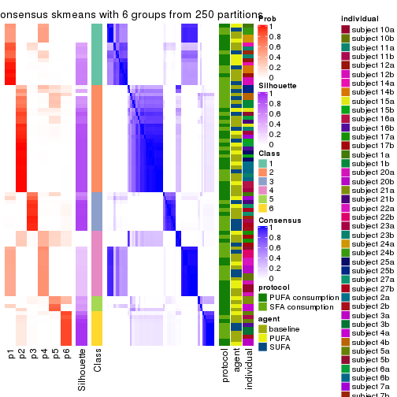</p>

</div>
</div>

Heatmaps for the membership of samples in all partitions to see how consistent they are:


<script>
$( function() {
	$( '#tabs-ATC-skmeans-membership-heatmap' ).tabs();
} );
</script>
<div id='tabs-ATC-skmeans-membership-heatmap'>
<ul>
<li><a href='#tab-ATC-skmeans-membership-heatmap-1'>k = 2</a></li>
<li><a href='#tab-ATC-skmeans-membership-heatmap-2'>k = 3</a></li>
<li><a href='#tab-ATC-skmeans-membership-heatmap-3'>k = 4</a></li>
<li><a href='#tab-ATC-skmeans-membership-heatmap-4'>k = 5</a></li>
<li><a href='#tab-ATC-skmeans-membership-heatmap-5'>k = 6</a></li>
</ul>
<div id='tab-ATC-skmeans-membership-heatmap-1'>
<pre><code class="r">membership_heatmap(res, k = 2)
</code></pre>

<p></p>

</div>
<div id='tab-ATC-skmeans-membership-heatmap-2'>
<pre><code class="r">membership_heatmap(res, k = 3)
</code></pre>

<p></p>

</div>
<div id='tab-ATC-skmeans-membership-heatmap-3'>
<pre><code class="r">membership_heatmap(res, k = 4)
</code></pre>

<p></p>

</div>
<div id='tab-ATC-skmeans-membership-heatmap-4'>
<pre><code class="r">membership_heatmap(res, k = 5)
</code></pre>

<p></p>

</div>
<div id='tab-ATC-skmeans-membership-heatmap-5'>
<pre><code class="r">membership_heatmap(res, k = 6)
</code></pre>

<p></p>

</div>
</div>

As soon as we have had the classes for columns, we can look for signatures
which are significantly different between classes which can be candidate marks
for certain classes. Following are the heatmaps for signatures.


Signature heatmaps where rows are scaled:


<script>
$( function() {
	$( '#tabs-ATC-skmeans-get-signatures' ).tabs();
} );
</script>
<div id='tabs-ATC-skmeans-get-signatures'>
<ul>
<li><a href='#tab-ATC-skmeans-get-signatures-1'>k = 2</a></li>
<li><a href='#tab-ATC-skmeans-get-signatures-2'>k = 3</a></li>
<li><a href='#tab-ATC-skmeans-get-signatures-3'>k = 4</a></li>
<li><a href='#tab-ATC-skmeans-get-signatures-4'>k = 5</a></li>
<li><a href='#tab-ATC-skmeans-get-signatures-5'>k = 6</a></li>
</ul>
<div id='tab-ATC-skmeans-get-signatures-1'>
<pre><code class="r">get_signatures(res, k = 2)
</code></pre>

<p></p>

</div>
<div id='tab-ATC-skmeans-get-signatures-2'>
<pre><code class="r">get_signatures(res, k = 3)
</code></pre>

<p></p>

</div>
<div id='tab-ATC-skmeans-get-signatures-3'>
<pre><code class="r">get_signatures(res, k = 4)
</code></pre>

<p></p>

</div>
<div id='tab-ATC-skmeans-get-signatures-4'>
<pre><code class="r">get_signatures(res, k = 5)
</code></pre>

<p></p>

</div>
<div id='tab-ATC-skmeans-get-signatures-5'>
<pre><code class="r">get_signatures(res, k = 6)
</code></pre>

<p></p>

</div>
</div>


Signature heatmaps where rows are not scaled:


<script>
$( function() {
	$( '#tabs-ATC-skmeans-get-signatures-no-scale' ).tabs();
} );
</script>
<div id='tabs-ATC-skmeans-get-signatures-no-scale'>
<ul>
<li><a href='#tab-ATC-skmeans-get-signatures-no-scale-1'>k = 2</a></li>
<li><a href='#tab-ATC-skmeans-get-signatures-no-scale-2'>k = 3</a></li>
<li><a href='#tab-ATC-skmeans-get-signatures-no-scale-3'>k = 4</a></li>
<li><a href='#tab-ATC-skmeans-get-signatures-no-scale-4'>k = 5</a></li>
<li><a href='#tab-ATC-skmeans-get-signatures-no-scale-5'>k = 6</a></li>
</ul>
<div id='tab-ATC-skmeans-get-signatures-no-scale-1'>
<pre><code class="r">get_signatures(res, k = 2, scale_rows = FALSE)
</code></pre>

<p></p>

</div>
<div id='tab-ATC-skmeans-get-signatures-no-scale-2'>
<pre><code class="r">get_signatures(res, k = 3, scale_rows = FALSE)
</code></pre>

<p>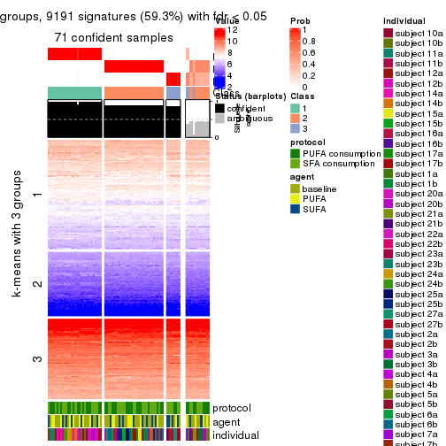</p>

</div>
<div id='tab-ATC-skmeans-get-signatures-no-scale-3'>
<pre><code class="r">get_signatures(res, k = 4, scale_rows = FALSE)
</code></pre>

<p></p>

</div>
<div id='tab-ATC-skmeans-get-signatures-no-scale-4'>
<pre><code class="r">get_signatures(res, k = 5, scale_rows = FALSE)
</code></pre>

<p></p>

</div>
<div id='tab-ATC-skmeans-get-signatures-no-scale-5'>
<pre><code class="r">get_signatures(res, k = 6, scale_rows = FALSE)
</code></pre>

<p></p>

</div>
</div>


Compare the overlap of signatures from different k:

```r
compare_signatures(res)
```


`get_signature()` returns a data frame invisibly. TO get the list of signatures, the function
call should be assigned to a variable explicitly. In following code, if `plot` argument is set
to `FALSE`, no heatmap is plotted while only the differential analysis is performed.

```r
# code only for demonstration
tb = get_signature(res, k = ..., plot = FALSE)
```

An example of the output of `tb` is:

```
#>   which_row         fdr    mean_1    mean_2 scaled_mean_1 scaled_mean_2 km
#> 1        38 0.042760348  8.373488  9.131774    -0.5533452     0.5164555  1
#> 2        40 0.018707592  7.106213  8.469186    -0.6173731     0.5762149  1
#> 3        55 0.019134737 10.221463 11.207825    -0.6159697     0.5749050  1
#> 4        59 0.006059896  5.921854  7.869574    -0.6899429     0.6439467  1
#> 5        60 0.018055526  8.928898 10.211722    -0.6204761     0.5791110  1
#> 6        98 0.009384629 15.714769 14.887706     0.6635654    -0.6193277  2
...
```

The columns in `tb` are:

1. `which_row`: row indices corresponding to the input matrix.
2. `fdr`: FDR for the differential test. 
3. `mean_x`: The mean value in group x.
4. `scaled_mean_x`: The mean value in group x after rows are scaled.
5. `km`: Row groups if k-means clustering is applied to rows.


UMAP plot which shows how samples are separated.


<script>
$( function() {
	$( '#tabs-ATC-skmeans-dimension-reduction' ).tabs();
} );
</script>
<div id='tabs-ATC-skmeans-dimension-reduction'>
<ul>
<li><a href='#tab-ATC-skmeans-dimension-reduction-1'>k = 2</a></li>
<li><a href='#tab-ATC-skmeans-dimension-reduction-2'>k = 3</a></li>
<li><a href='#tab-ATC-skmeans-dimension-reduction-3'>k = 4</a></li>
<li><a href='#tab-ATC-skmeans-dimension-reduction-4'>k = 5</a></li>
<li><a href='#tab-ATC-skmeans-dimension-reduction-5'>k = 6</a></li>
</ul>
<div id='tab-ATC-skmeans-dimension-reduction-1'>
<pre><code class="r">dimension_reduction(res, k = 2, method = &quot;UMAP&quot;)
</code></pre>

<p></p>

</div>
<div id='tab-ATC-skmeans-dimension-reduction-2'>
<pre><code class="r">dimension_reduction(res, k = 3, method = &quot;UMAP&quot;)
</code></pre>

<p></p>

</div>
<div id='tab-ATC-skmeans-dimension-reduction-3'>
<pre><code class="r">dimension_reduction(res, k = 4, method = &quot;UMAP&quot;)
</code></pre>

<p></p>

</div>
<div id='tab-ATC-skmeans-dimension-reduction-4'>
<pre><code class="r">dimension_reduction(res, k = 5, method = &quot;UMAP&quot;)
</code></pre>

<p></p>

</div>
<div id='tab-ATC-skmeans-dimension-reduction-5'>
<pre><code class="r">dimension_reduction(res, k = 6, method = &quot;UMAP&quot;)
</code></pre>

<p></p>

</div>
</div>


Following heatmap shows how subgroups are split when increasing `k`:

```r
collect_classes(res)
```


Test correlation between subgroups and known annotations. If the known
annotation is numeric, one-way ANOVA test is applied, and if the known
annotation is discrete, chi-squared contingency table test is applied.

```r
test_to_known_factors(res)
```

```
#>              n protocol(p) agent(p) individual(p) k
#> ATC:skmeans 84       1.000    0.550      3.23e-03 2
#> ATC:skmeans 71       0.361    0.513      1.45e-04 3
#> ATC:skmeans 83       0.936    0.874      2.70e-05 4
#> ATC:skmeans 75       0.927    0.955      7.03e-05 5
#> ATC:skmeans 55       0.473    0.832      1.31e-05 6
```


If matrix rows can be associated to genes, consider to use `functional_enrichment(res,
...)` to perform function enrichment for the signature genes. See [this vignette](http://bioconductor.org/packages/devel/bioc/vignettes/cola/inst/doc/functional_enrichment.html) for more detailed explanations.


 

---------------------------------------------------


### ATC:pam*


The object with results only for a single top-value method and a single partition method 
can be extracted as:

```r
res = res_list["ATC", "pam"]
# you can also extract it by
# res = res_list["ATC:pam"]
```

A summary of `res` and all the functions that can be applied to it:

```r
res
```

```
#> A 'ConsensusPartition' object with k = 2, 3, 4, 5, 6.
#>   On a matrix with 15497 rows and 84 columns.
#>   Top rows (1000, 2000, 3000, 4000, 5000) are extracted by 'ATC' method.
#>   Subgroups are detected by 'pam' method.
#>   Performed in total 1250 partitions by row resampling.
#>   Best k for subgroups seems to be 5.
#> 
#> Following methods can be applied to this 'ConsensusPartition' object:
#>  [1] "cola_report"             "collect_classes"         "collect_plots"          
#>  [4] "collect_stats"           "colnames"                "compare_signatures"     
#>  [7] "consensus_heatmap"       "dimension_reduction"     "functional_enrichment"  
#> [10] "get_anno_col"            "get_anno"                "get_classes"            
#> [13] "get_consensus"           "get_matrix"              "get_membership"         
#> [16] "get_param"               "get_signatures"          "get_stats"              
#> [19] "is_best_k"               "is_stable_k"             "membership_heatmap"     
#> [22] "ncol"                    "nrow"                    "plot_ecdf"              
#> [25] "rownames"                "select_partition_number" "show"                   
#> [28] "suggest_best_k"          "test_to_known_factors"
```

`collect_plots()` function collects all the plots made from `res` for all `k` (number of partitions)
into one single page to provide an easy and fast comparison between different `k`.

```r
collect_plots(res)
```


The plots are:

- The first row: a plot of the ECDF (empirical cumulative distribution
  function) curves of the consensus matrix for each `k` and the heatmap of
  predicted classes for each `k`.
- The second row: heatmaps of the consensus matrix for each `k`.
- The third row: heatmaps of the membership matrix for each `k`.
- The fouth row: heatmaps of the signatures for each `k`.

All the plots in panels can be made by individual functions and they are
plotted later in this section.

`select_partition_number()` produces several plots showing different
statistics for choosing "optimized" `k`. There are following statistics:

- ECDF curves of the consensus matrix for each `k`;
- 1-PAC. [The PAC
  score](https://en.wikipedia.org/wiki/Consensus_clustering#Over-interpretation_potential_of_consensus_clustering)
  measures the proportion of the ambiguous subgrouping.
- Mean silhouette score.
- Concordance. The mean probability of fiting the consensus class ids in all
  partitions.
- Area increased. Denote $A_k$ as the area under the ECDF curve for current
  `k`, the area increased is defined as $A_k - A_{k-1}$.
- Rand index. The percent of pairs of samples that are both in a same cluster
  or both are not in a same cluster in the partition of k and k-1.
- Jaccard index. The ratio of pairs of samples are both in a same cluster in
  the partition of k and k-1 and the pairs of samples are both in a same
  cluster in the partition k or k-1.

The detailed explanations of these statistics can be found in [the _cola_
vignette](http://bioconductor.org/packages/devel/bioc/vignettes/cola/inst/doc/cola.html#toc_13).

Generally speaking, lower PAC score, higher mean silhouette score or higher
concordance corresponds to better partition. Rand index and Jaccard index
measure how similar the current partition is compared to partition with `k-1`.
If they are too similar, we won't accept `k` is better than `k-1`.

```r
select_partition_number(res)
```


The numeric values for all these statistics can be obtained by `get_stats()`.

```r
get_stats(res)
```

```
#>   k 1-PAC mean_silhouette concordance area_increased  Rand Jaccard
#> 2 2 1.000           0.999       0.999         0.5018 0.499   0.499
#> 3 3 0.659           0.781       0.853         0.2926 0.802   0.623
#> 4 4 0.717           0.750       0.860         0.1341 0.899   0.719
#> 5 5 0.927           0.851       0.940         0.0648 0.904   0.666
#> 6 6 0.846           0.799       0.873         0.0574 0.923   0.662
```

`suggest_best_k()` suggests the best $k$ based on these statistics. The rules are as follows:

- All $k$ with Jaccard index larger than 0.95 are removed because increasing
  $k$ does not provide enough extra information. If all $k$ are removed, it is
  marked as no subgroup is detected.
- For all $k$ with 1-PAC score larger than 0.9, the maximal $k$ is taken as
  the best $k$, and other $k$ are marked as optional $k$.
- If it does not fit the second rule. The $k$ with the maximal vote of the
  highest 1-PAC score, highest mean silhouette, and highest concordance is
  taken as the best $k$.

```r
suggest_best_k(res)
```

```
#> [1] 5
#> attr(,"optional")
#> [1] 2
```

There is also optional best $k$ = 2 that is worth to check.

Following shows the table of the partitions (You need to click the **show/hide
code output** link to see it). The membership matrix (columns with name `p*`)
is inferred by
[`clue::cl_consensus()`](https://www.rdocumentation.org/link/cl_consensus?package=clue)
function with the `SE` method. Basically the value in the membership matrix
represents the probability to belong to a certain group. The finall class
label for an item is determined with the group with highest probability it
belongs to.

In `get_classes()` function, the entropy is calculated from the membership
matrix and the silhouette score is calculated from the consensus matrix.


<script>
$( function() {
	$( '#tabs-ATC-pam-get-classes' ).tabs();
} );
</script>
<div id='tabs-ATC-pam-get-classes'>
<ul>
<li><a href='#tab-ATC-pam-get-classes-1'>k = 2</a></li>
<li><a href='#tab-ATC-pam-get-classes-2'>k = 3</a></li>
<li><a href='#tab-ATC-pam-get-classes-3'>k = 4</a></li>
<li><a href='#tab-ATC-pam-get-classes-4'>k = 5</a></li>
<li><a href='#tab-ATC-pam-get-classes-5'>k = 6</a></li>
</ul>

<div id='tab-ATC-pam-get-classes-1'>
<p><a id='tab-ATC-pam-get-classes-1-a' style='color:#0366d6' href='#'>show/hide code output</a></p>
<pre><code class="r">cbind(get_classes(res, k = 2), get_membership(res, k = 2))
</code></pre>

<pre><code>#&gt;           class entropy silhouette    p1    p2
#&gt; GSM339455     1   0.000      0.999 1.000 0.000
#&gt; GSM339456     2   0.000      1.000 0.000 1.000
#&gt; GSM339457     2   0.000      1.000 0.000 1.000
#&gt; GSM339458     2   0.000      1.000 0.000 1.000
#&gt; GSM339459     2   0.000      1.000 0.000 1.000
#&gt; GSM339460     2   0.000      1.000 0.000 1.000
#&gt; GSM339461     2   0.000      1.000 0.000 1.000
#&gt; GSM339462     1   0.000      0.999 1.000 0.000
#&gt; GSM339463     1   0.000      0.999 1.000 0.000
#&gt; GSM339464     1   0.000      0.999 1.000 0.000
#&gt; GSM339465     1   0.000      0.999 1.000 0.000
#&gt; GSM339466     2   0.000      1.000 0.000 1.000
#&gt; GSM339467     2   0.000      1.000 0.000 1.000
#&gt; GSM339468     2   0.000      1.000 0.000 1.000
#&gt; GSM339469     1   0.000      0.999 1.000 0.000
#&gt; GSM339470     2   0.000      1.000 0.000 1.000
#&gt; GSM339471     1   0.000      0.999 1.000 0.000
#&gt; GSM339472     2   0.000      1.000 0.000 1.000
#&gt; GSM339473     1   0.000      0.999 1.000 0.000
#&gt; GSM339474     2   0.000      1.000 0.000 1.000
#&gt; GSM339475     2   0.000      1.000 0.000 1.000
#&gt; GSM339476     1   0.000      0.999 1.000 0.000
#&gt; GSM339477     2   0.000      1.000 0.000 1.000
#&gt; GSM339478     2   0.000      1.000 0.000 1.000
#&gt; GSM339479     1   0.000      0.999 1.000 0.000
#&gt; GSM339480     2   0.000      1.000 0.000 1.000
#&gt; GSM339481     2   0.000      1.000 0.000 1.000
#&gt; GSM339482     1   0.000      0.999 1.000 0.000
#&gt; GSM339483     1   0.000      0.999 1.000 0.000
#&gt; GSM339484     1   0.000      0.999 1.000 0.000
#&gt; GSM339485     1   0.000      0.999 1.000 0.000
#&gt; GSM339486     1   0.000      0.999 1.000 0.000
#&gt; GSM339487     2   0.000      1.000 0.000 1.000
#&gt; GSM339488     2   0.000      1.000 0.000 1.000
#&gt; GSM339489     2   0.000      1.000 0.000 1.000
#&gt; GSM339490     1   0.000      0.999 1.000 0.000
#&gt; GSM339491     2   0.000      1.000 0.000 1.000
#&gt; GSM339492     1   0.000      0.999 1.000 0.000
#&gt; GSM339493     2   0.000      1.000 0.000 1.000
#&gt; GSM339494     1   0.000      0.999 1.000 0.000
#&gt; GSM339495     2   0.000      1.000 0.000 1.000
#&gt; GSM339496     1   0.000      0.999 1.000 0.000
#&gt; GSM339497     2   0.000      1.000 0.000 1.000
#&gt; GSM339498     2   0.000      1.000 0.000 1.000
#&gt; GSM339499     2   0.000      1.000 0.000 1.000
#&gt; GSM339500     2   0.000      1.000 0.000 1.000
#&gt; GSM339501     1   0.000      0.999 1.000 0.000
#&gt; GSM339502     2   0.000      1.000 0.000 1.000
#&gt; GSM339503     1   0.278      0.950 0.952 0.048
#&gt; GSM339504     1   0.000      0.999 1.000 0.000
#&gt; GSM339505     2   0.000      1.000 0.000 1.000
#&gt; GSM339506     1   0.000      0.999 1.000 0.000
#&gt; GSM339507     1   0.000      0.999 1.000 0.000
#&gt; GSM339508     2   0.000      1.000 0.000 1.000
#&gt; GSM339509     2   0.000      1.000 0.000 1.000
#&gt; GSM339510     2   0.000      1.000 0.000 1.000
#&gt; GSM339511     1   0.000      0.999 1.000 0.000
#&gt; GSM339512     2   0.000      1.000 0.000 1.000
#&gt; GSM339513     1   0.000      0.999 1.000 0.000
#&gt; GSM339514     2   0.000      1.000 0.000 1.000
#&gt; GSM339515     1   0.000      0.999 1.000 0.000
#&gt; GSM339516     2   0.000      1.000 0.000 1.000
#&gt; GSM339517     2   0.000      1.000 0.000 1.000
#&gt; GSM339518     2   0.000      1.000 0.000 1.000
#&gt; GSM339519     1   0.000      0.999 1.000 0.000
#&gt; GSM339520     2   0.000      1.000 0.000 1.000
#&gt; GSM339521     2   0.000      1.000 0.000 1.000
#&gt; GSM339522     2   0.000      1.000 0.000 1.000
#&gt; GSM339523     2   0.000      1.000 0.000 1.000
#&gt; GSM339524     1   0.000      0.999 1.000 0.000
#&gt; GSM339525     1   0.000      0.999 1.000 0.000
#&gt; GSM339526     1   0.000      0.999 1.000 0.000
#&gt; GSM339527     1   0.000      0.999 1.000 0.000
#&gt; GSM339528     1   0.000      0.999 1.000 0.000
#&gt; GSM339529     2   0.000      1.000 0.000 1.000
#&gt; GSM339530     2   0.000      1.000 0.000 1.000
#&gt; GSM339531     2   0.000      1.000 0.000 1.000
#&gt; GSM339532     1   0.000      0.999 1.000 0.000
#&gt; GSM339533     1   0.000      0.999 1.000 0.000
#&gt; GSM339534     1   0.000      0.999 1.000 0.000
#&gt; GSM339535     2   0.000      1.000 0.000 1.000
#&gt; GSM339536     1   0.000      0.999 1.000 0.000
#&gt; GSM339537     2   0.000      1.000 0.000 1.000
#&gt; GSM339538     1   0.000      0.999 1.000 0.000
</code></pre>

<script>
$('#tab-ATC-pam-get-classes-1-a').parent().next().next().hide();
$('#tab-ATC-pam-get-classes-1-a').click(function(){
  $('#tab-ATC-pam-get-classes-1-a').parent().next().next().toggle();
  return(false);
});
</script>
</div>

<div id='tab-ATC-pam-get-classes-2'>
<p><a id='tab-ATC-pam-get-classes-2-a' style='color:#0366d6' href='#'>show/hide code output</a></p>
<pre><code class="r">cbind(get_classes(res, k = 3), get_membership(res, k = 3))
</code></pre>

<pre><code>#&gt;           class entropy silhouette    p1    p2    p3
#&gt; GSM339455     3  0.0000      0.877 0.000 0.000 1.000
#&gt; GSM339456     2  0.0000      0.773 0.000 1.000 0.000
#&gt; GSM339457     3  0.4346      0.625 0.000 0.184 0.816
#&gt; GSM339458     3  0.5327      0.399 0.000 0.272 0.728
#&gt; GSM339459     2  0.5178      0.700 0.000 0.744 0.256
#&gt; GSM339460     2  0.5098      0.702 0.000 0.752 0.248
#&gt; GSM339461     2  0.0000      0.773 0.000 1.000 0.000
#&gt; GSM339462     1  0.0000      0.943 1.000 0.000 0.000
#&gt; GSM339463     3  0.1860      0.864 0.052 0.000 0.948
#&gt; GSM339464     1  0.0000      0.943 1.000 0.000 0.000
#&gt; GSM339465     3  0.2261      0.856 0.068 0.000 0.932
#&gt; GSM339466     2  0.0237      0.773 0.000 0.996 0.004
#&gt; GSM339467     2  0.0000      0.773 0.000 1.000 0.000
#&gt; GSM339468     2  0.6140      0.625 0.000 0.596 0.404
#&gt; GSM339469     1  0.0000      0.943 1.000 0.000 0.000
#&gt; GSM339470     3  0.0000      0.877 0.000 0.000 1.000
#&gt; GSM339471     1  0.0000      0.943 1.000 0.000 0.000
#&gt; GSM339472     2  0.0000      0.773 0.000 1.000 0.000
#&gt; GSM339473     1  0.0000      0.943 1.000 0.000 0.000
#&gt; GSM339474     2  0.0000      0.773 0.000 1.000 0.000
#&gt; GSM339475     3  0.0000      0.877 0.000 0.000 1.000
#&gt; GSM339476     1  0.0000      0.943 1.000 0.000 0.000
#&gt; GSM339477     2  0.0000      0.773 0.000 1.000 0.000
#&gt; GSM339478     2  0.6140      0.625 0.000 0.596 0.404
#&gt; GSM339479     3  0.2711      0.791 0.000 0.088 0.912
#&gt; GSM339480     3  0.3941      0.678 0.000 0.156 0.844
#&gt; GSM339481     2  0.0000      0.773 0.000 1.000 0.000
#&gt; GSM339482     3  0.4750      0.671 0.216 0.000 0.784
#&gt; GSM339483     1  0.0000      0.943 1.000 0.000 0.000
#&gt; GSM339484     1  0.3941      0.824 0.844 0.000 0.156
#&gt; GSM339485     1  0.0000      0.943 1.000 0.000 0.000
#&gt; GSM339486     1  0.4452      0.785 0.808 0.000 0.192
#&gt; GSM339487     2  0.6126      0.628 0.000 0.600 0.400
#&gt; GSM339488     2  0.0000      0.773 0.000 1.000 0.000
#&gt; GSM339489     2  0.6204      0.589 0.000 0.576 0.424
#&gt; GSM339490     1  0.0000      0.943 1.000 0.000 0.000
#&gt; GSM339491     3  0.0000      0.877 0.000 0.000 1.000
#&gt; GSM339492     1  0.0000      0.943 1.000 0.000 0.000
#&gt; GSM339493     2  0.0237      0.773 0.000 0.996 0.004
#&gt; GSM339494     1  0.0000      0.943 1.000 0.000 0.000
#&gt; GSM339495     2  0.0000      0.773 0.000 1.000 0.000
#&gt; GSM339496     3  0.0000      0.877 0.000 0.000 1.000
#&gt; GSM339497     2  0.6140      0.625 0.000 0.596 0.404
#&gt; GSM339498     2  0.6140      0.625 0.000 0.596 0.404
#&gt; GSM339499     2  0.6140      0.625 0.000 0.596 0.404
#&gt; GSM339500     2  0.6140      0.625 0.000 0.596 0.404
#&gt; GSM339501     3  0.2165      0.858 0.064 0.000 0.936
#&gt; GSM339502     2  0.0000      0.773 0.000 1.000 0.000
#&gt; GSM339503     3  0.0000      0.877 0.000 0.000 1.000
#&gt; GSM339504     1  0.0000      0.943 1.000 0.000 0.000
#&gt; GSM339505     2  0.6140      0.625 0.000 0.596 0.404
#&gt; GSM339506     1  0.6299      0.200 0.524 0.000 0.476
#&gt; GSM339507     1  0.3482      0.851 0.872 0.000 0.128
#&gt; GSM339508     2  0.0000      0.773 0.000 1.000 0.000
#&gt; GSM339509     2  0.0000      0.773 0.000 1.000 0.000
#&gt; GSM339510     2  0.6140      0.625 0.000 0.596 0.404
#&gt; GSM339511     1  0.0000      0.943 1.000 0.000 0.000
#&gt; GSM339512     2  0.6126      0.626 0.000 0.600 0.400
#&gt; GSM339513     1  0.0000      0.943 1.000 0.000 0.000
#&gt; GSM339514     2  0.0000      0.773 0.000 1.000 0.000
#&gt; GSM339515     1  0.0000      0.943 1.000 0.000 0.000
#&gt; GSM339516     2  0.6140      0.625 0.000 0.596 0.404
#&gt; GSM339517     3  0.0000      0.877 0.000 0.000 1.000
#&gt; GSM339518     2  0.6140      0.625 0.000 0.596 0.404
#&gt; GSM339519     3  0.2261      0.856 0.068 0.000 0.932
#&gt; GSM339520     2  0.2625      0.756 0.000 0.916 0.084
#&gt; GSM339521     2  0.6140      0.625 0.000 0.596 0.404
#&gt; GSM339522     2  0.5810      0.666 0.000 0.664 0.336
#&gt; GSM339523     2  0.0000      0.773 0.000 1.000 0.000
#&gt; GSM339524     1  0.4842      0.744 0.776 0.000 0.224
#&gt; GSM339525     1  0.0000      0.943 1.000 0.000 0.000
#&gt; GSM339526     3  0.0237      0.877 0.004 0.000 0.996
#&gt; GSM339527     3  0.4887      0.648 0.228 0.000 0.772
#&gt; GSM339528     1  0.3412      0.854 0.876 0.000 0.124
#&gt; GSM339529     2  0.0237      0.773 0.000 0.996 0.004
#&gt; GSM339530     2  0.0000      0.773 0.000 1.000 0.000
#&gt; GSM339531     2  0.6140      0.625 0.000 0.596 0.404
#&gt; GSM339532     1  0.0000      0.943 1.000 0.000 0.000
#&gt; GSM339533     3  0.0000      0.877 0.000 0.000 1.000
#&gt; GSM339534     1  0.0000      0.943 1.000 0.000 0.000
#&gt; GSM339535     2  0.0237      0.773 0.000 0.996 0.004
#&gt; GSM339536     1  0.0000      0.943 1.000 0.000 0.000
#&gt; GSM339537     2  0.3686      0.740 0.000 0.860 0.140
#&gt; GSM339538     3  0.4750      0.671 0.216 0.000 0.784
</code></pre>

<script>
$('#tab-ATC-pam-get-classes-2-a').parent().next().next().hide();
$('#tab-ATC-pam-get-classes-2-a').click(function(){
  $('#tab-ATC-pam-get-classes-2-a').parent().next().next().toggle();
  return(false);
});
</script>
</div>

<div id='tab-ATC-pam-get-classes-3'>
<p><a id='tab-ATC-pam-get-classes-3-a' style='color:#0366d6' href='#'>show/hide code output</a></p>
<pre><code class="r">cbind(get_classes(res, k = 4), get_membership(res, k = 4))
</code></pre>

<pre><code>#&gt;           class entropy silhouette    p1    p2    p3    p4
#&gt; GSM339455     3  0.0000      0.830 0.000 0.000 1.000 0.000
#&gt; GSM339456     2  0.4941     -0.418 0.000 0.564 0.000 0.436
#&gt; GSM339457     3  0.3356      0.616 0.000 0.176 0.824 0.000
#&gt; GSM339458     3  0.4933     -0.117 0.000 0.432 0.568 0.000
#&gt; GSM339459     2  0.3528      0.801 0.000 0.808 0.192 0.000
#&gt; GSM339460     2  0.6826     -0.135 0.000 0.484 0.100 0.416
#&gt; GSM339461     2  0.0188      0.673 0.000 0.996 0.000 0.004
#&gt; GSM339462     1  0.0000      0.905 1.000 0.000 0.000 0.000
#&gt; GSM339463     3  0.2704      0.783 0.000 0.000 0.876 0.124
#&gt; GSM339464     1  0.3610      0.784 0.800 0.000 0.000 0.200
#&gt; GSM339465     3  0.4072      0.694 0.000 0.000 0.748 0.252
#&gt; GSM339466     2  0.0000      0.677 0.000 1.000 0.000 0.000
#&gt; GSM339467     4  0.4072      0.970 0.000 0.252 0.000 0.748
#&gt; GSM339468     2  0.3907      0.807 0.000 0.768 0.232 0.000
#&gt; GSM339469     1  0.0000      0.905 1.000 0.000 0.000 0.000
#&gt; GSM339470     3  0.0000      0.830 0.000 0.000 1.000 0.000
#&gt; GSM339471     1  0.0000      0.905 1.000 0.000 0.000 0.000
#&gt; GSM339472     4  0.4072      0.970 0.000 0.252 0.000 0.748
#&gt; GSM339473     1  0.0000      0.905 1.000 0.000 0.000 0.000
#&gt; GSM339474     4  0.4072      0.970 0.000 0.252 0.000 0.748
#&gt; GSM339475     3  0.0000      0.830 0.000 0.000 1.000 0.000
#&gt; GSM339476     1  0.0000      0.905 1.000 0.000 0.000 0.000
#&gt; GSM339477     4  0.4072      0.970 0.000 0.252 0.000 0.748
#&gt; GSM339478     2  0.4008      0.802 0.000 0.756 0.244 0.000
#&gt; GSM339479     3  0.2859      0.723 0.000 0.112 0.880 0.008
#&gt; GSM339480     3  0.4477      0.330 0.000 0.312 0.688 0.000
#&gt; GSM339481     4  0.4072      0.970 0.000 0.252 0.000 0.748
#&gt; GSM339482     3  0.4008      0.698 0.000 0.000 0.756 0.244
#&gt; GSM339483     1  0.0000      0.905 1.000 0.000 0.000 0.000
#&gt; GSM339484     1  0.6873      0.572 0.588 0.000 0.160 0.252
#&gt; GSM339485     1  0.0000      0.905 1.000 0.000 0.000 0.000
#&gt; GSM339486     1  0.7145      0.520 0.556 0.000 0.192 0.252
#&gt; GSM339487     2  0.3873      0.807 0.000 0.772 0.228 0.000
#&gt; GSM339488     4  0.4072      0.970 0.000 0.252 0.000 0.748
#&gt; GSM339489     2  0.4103      0.792 0.000 0.744 0.256 0.000
#&gt; GSM339490     1  0.0000      0.905 1.000 0.000 0.000 0.000
#&gt; GSM339491     3  0.0000      0.830 0.000 0.000 1.000 0.000
#&gt; GSM339492     1  0.0000      0.905 1.000 0.000 0.000 0.000
#&gt; GSM339493     2  0.0000      0.677 0.000 1.000 0.000 0.000
#&gt; GSM339494     1  0.0000      0.905 1.000 0.000 0.000 0.000
#&gt; GSM339495     4  0.4072      0.970 0.000 0.252 0.000 0.748
#&gt; GSM339496     3  0.0000      0.830 0.000 0.000 1.000 0.000
#&gt; GSM339497     2  0.4008      0.802 0.000 0.756 0.244 0.000
#&gt; GSM339498     2  0.4008      0.802 0.000 0.756 0.244 0.000
#&gt; GSM339499     2  0.4193      0.784 0.000 0.732 0.268 0.000
#&gt; GSM339500     2  0.4008      0.802 0.000 0.756 0.244 0.000
#&gt; GSM339501     3  0.1474      0.792 0.000 0.052 0.948 0.000
#&gt; GSM339502     4  0.4072      0.970 0.000 0.252 0.000 0.748
#&gt; GSM339503     3  0.0000      0.830 0.000 0.000 1.000 0.000
#&gt; GSM339504     1  0.0000      0.905 1.000 0.000 0.000 0.000
#&gt; GSM339505     2  0.4222      0.780 0.000 0.728 0.272 0.000
#&gt; GSM339506     3  0.7436      0.328 0.236 0.000 0.512 0.252
#&gt; GSM339507     1  0.6587      0.612 0.616 0.000 0.132 0.252
#&gt; GSM339508     2  0.3801      0.285 0.000 0.780 0.000 0.220
#&gt; GSM339509     4  0.4072      0.970 0.000 0.252 0.000 0.748
#&gt; GSM339510     2  0.3907      0.807 0.000 0.768 0.232 0.000
#&gt; GSM339511     1  0.0000      0.905 1.000 0.000 0.000 0.000
#&gt; GSM339512     2  0.4008      0.802 0.000 0.756 0.244 0.000
#&gt; GSM339513     1  0.0000      0.905 1.000 0.000 0.000 0.000
#&gt; GSM339514     4  0.4996      0.601 0.000 0.484 0.000 0.516
#&gt; GSM339515     1  0.0000      0.905 1.000 0.000 0.000 0.000
#&gt; GSM339516     2  0.3907      0.807 0.000 0.768 0.232 0.000
#&gt; GSM339517     3  0.0000      0.830 0.000 0.000 1.000 0.000
#&gt; GSM339518     2  0.4008      0.802 0.000 0.756 0.244 0.000
#&gt; GSM339519     3  0.0000      0.830 0.000 0.000 1.000 0.000
#&gt; GSM339520     2  0.6141      0.178 0.000 0.616 0.072 0.312
#&gt; GSM339521     2  0.4008      0.802 0.000 0.756 0.244 0.000
#&gt; GSM339522     2  0.3649      0.805 0.000 0.796 0.204 0.000
#&gt; GSM339523     4  0.4072      0.970 0.000 0.252 0.000 0.748
#&gt; GSM339524     1  0.7390      0.451 0.520 0.000 0.228 0.252
#&gt; GSM339525     1  0.0000      0.905 1.000 0.000 0.000 0.000
#&gt; GSM339526     3  0.0469      0.827 0.000 0.000 0.988 0.012
#&gt; GSM339527     3  0.4008      0.698 0.000 0.000 0.756 0.244
#&gt; GSM339528     1  0.6542      0.617 0.620 0.000 0.128 0.252
#&gt; GSM339529     2  0.0000      0.677 0.000 1.000 0.000 0.000
#&gt; GSM339530     2  0.1389      0.620 0.000 0.952 0.000 0.048
#&gt; GSM339531     2  0.3907      0.807 0.000 0.768 0.232 0.000
#&gt; GSM339532     1  0.0000      0.905 1.000 0.000 0.000 0.000
#&gt; GSM339533     3  0.0000      0.830 0.000 0.000 1.000 0.000
#&gt; GSM339534     1  0.0000      0.905 1.000 0.000 0.000 0.000
#&gt; GSM339535     2  0.0000      0.677 0.000 1.000 0.000 0.000
#&gt; GSM339536     1  0.0000      0.905 1.000 0.000 0.000 0.000
#&gt; GSM339537     2  0.2647      0.774 0.000 0.880 0.120 0.000
#&gt; GSM339538     3  0.4008      0.698 0.000 0.000 0.756 0.244
</code></pre>

<script>
$('#tab-ATC-pam-get-classes-3-a').parent().next().next().hide();
$('#tab-ATC-pam-get-classes-3-a').click(function(){
  $('#tab-ATC-pam-get-classes-3-a').parent().next().next().toggle();
  return(false);
});
</script>
</div>

<div id='tab-ATC-pam-get-classes-4'>
<p><a id='tab-ATC-pam-get-classes-4-a' style='color:#0366d6' href='#'>show/hide code output</a></p>
<pre><code class="r">cbind(get_classes(res, k = 5), get_membership(res, k = 5))
</code></pre>

<pre><code>#&gt;           class entropy silhouette    p1    p2    p3    p4    p5
#&gt; GSM339455     3  0.0000     0.9267 0.000 0.000 1.000 0.000 0.000
#&gt; GSM339456     2  0.3966     0.4677 0.000 0.664 0.000 0.000 0.336
#&gt; GSM339457     3  0.1364     0.8890 0.012 0.000 0.952 0.000 0.036
#&gt; GSM339458     5  0.4063     0.5986 0.012 0.000 0.280 0.000 0.708
#&gt; GSM339459     5  0.0000     0.9400 0.000 0.000 0.000 0.000 1.000
#&gt; GSM339460     2  0.4658     0.0523 0.012 0.504 0.000 0.000 0.484
#&gt; GSM339461     5  0.0880     0.9284 0.000 0.032 0.000 0.000 0.968
#&gt; GSM339462     4  0.0000     1.0000 0.000 0.000 0.000 1.000 0.000
#&gt; GSM339463     1  0.3074     0.6606 0.804 0.000 0.196 0.000 0.000
#&gt; GSM339464     1  0.4297     0.1095 0.528 0.000 0.000 0.472 0.000
#&gt; GSM339465     1  0.0404     0.8187 0.988 0.000 0.012 0.000 0.000
#&gt; GSM339466     5  0.0000     0.9400 0.000 0.000 0.000 0.000 1.000
#&gt; GSM339467     2  0.0000     0.8689 0.000 1.000 0.000 0.000 0.000
#&gt; GSM339468     5  0.0566     0.9387 0.012 0.000 0.004 0.000 0.984
#&gt; GSM339469     4  0.0000     1.0000 0.000 0.000 0.000 1.000 0.000
#&gt; GSM339470     3  0.0000     0.9267 0.000 0.000 1.000 0.000 0.000
#&gt; GSM339471     4  0.0000     1.0000 0.000 0.000 0.000 1.000 0.000
#&gt; GSM339472     2  0.0000     0.8689 0.000 1.000 0.000 0.000 0.000
#&gt; GSM339473     4  0.0000     1.0000 0.000 0.000 0.000 1.000 0.000
#&gt; GSM339474     2  0.0000     0.8689 0.000 1.000 0.000 0.000 0.000
#&gt; GSM339475     3  0.0000     0.9267 0.000 0.000 1.000 0.000 0.000
#&gt; GSM339476     4  0.0000     1.0000 0.000 0.000 0.000 1.000 0.000
#&gt; GSM339477     2  0.0000     0.8689 0.000 1.000 0.000 0.000 0.000
#&gt; GSM339478     5  0.1281     0.9328 0.012 0.000 0.032 0.000 0.956
#&gt; GSM339479     3  0.4876     0.2518 0.396 0.000 0.576 0.000 0.028
#&gt; GSM339480     3  0.3659     0.6485 0.012 0.000 0.768 0.000 0.220
#&gt; GSM339481     2  0.0000     0.8689 0.000 1.000 0.000 0.000 0.000
#&gt; GSM339482     1  0.4287     0.2007 0.540 0.000 0.460 0.000 0.000
#&gt; GSM339483     4  0.0000     1.0000 0.000 0.000 0.000 1.000 0.000
#&gt; GSM339484     1  0.0404     0.8269 0.988 0.000 0.000 0.012 0.000
#&gt; GSM339485     4  0.0000     1.0000 0.000 0.000 0.000 1.000 0.000
#&gt; GSM339486     1  0.0404     0.8269 0.988 0.000 0.000 0.012 0.000
#&gt; GSM339487     5  0.0000     0.9400 0.000 0.000 0.000 0.000 1.000
#&gt; GSM339488     2  0.0000     0.8689 0.000 1.000 0.000 0.000 0.000
#&gt; GSM339489     5  0.0912     0.9345 0.012 0.000 0.016 0.000 0.972
#&gt; GSM339490     4  0.0000     1.0000 0.000 0.000 0.000 1.000 0.000
#&gt; GSM339491     3  0.0162     0.9244 0.004 0.000 0.996 0.000 0.000
#&gt; GSM339492     4  0.0000     1.0000 0.000 0.000 0.000 1.000 0.000
#&gt; GSM339493     5  0.0000     0.9400 0.000 0.000 0.000 0.000 1.000
#&gt; GSM339494     4  0.0000     1.0000 0.000 0.000 0.000 1.000 0.000
#&gt; GSM339495     2  0.0000     0.8689 0.000 1.000 0.000 0.000 0.000
#&gt; GSM339496     3  0.0000     0.9267 0.000 0.000 1.000 0.000 0.000
#&gt; GSM339497     5  0.1281     0.9328 0.012 0.000 0.032 0.000 0.956
#&gt; GSM339498     5  0.0510     0.9398 0.000 0.000 0.016 0.000 0.984
#&gt; GSM339499     5  0.0794     0.9359 0.000 0.000 0.028 0.000 0.972
#&gt; GSM339500     5  0.0880     0.9356 0.000 0.000 0.032 0.000 0.968
#&gt; GSM339501     3  0.1608     0.8607 0.000 0.000 0.928 0.000 0.072
#&gt; GSM339502     2  0.0000     0.8689 0.000 1.000 0.000 0.000 0.000
#&gt; GSM339503     3  0.0000     0.9267 0.000 0.000 1.000 0.000 0.000
#&gt; GSM339504     4  0.0000     1.0000 0.000 0.000 0.000 1.000 0.000
#&gt; GSM339505     5  0.0880     0.9352 0.000 0.000 0.032 0.000 0.968
#&gt; GSM339506     1  0.0404     0.8269 0.988 0.000 0.000 0.012 0.000
#&gt; GSM339507     1  0.0404     0.8269 0.988 0.000 0.000 0.012 0.000
#&gt; GSM339508     5  0.3707     0.5685 0.000 0.284 0.000 0.000 0.716
#&gt; GSM339509     2  0.0000     0.8689 0.000 1.000 0.000 0.000 0.000
#&gt; GSM339510     5  0.0693     0.9392 0.012 0.000 0.008 0.000 0.980
#&gt; GSM339511     4  0.0000     1.0000 0.000 0.000 0.000 1.000 0.000
#&gt; GSM339512     5  0.0794     0.9364 0.000 0.000 0.028 0.000 0.972
#&gt; GSM339513     4  0.0000     1.0000 0.000 0.000 0.000 1.000 0.000
#&gt; GSM339514     2  0.3876     0.5485 0.000 0.684 0.000 0.000 0.316
#&gt; GSM339515     4  0.0000     1.0000 0.000 0.000 0.000 1.000 0.000
#&gt; GSM339516     5  0.0566     0.9387 0.012 0.000 0.004 0.000 0.984
#&gt; GSM339517     3  0.0000     0.9267 0.000 0.000 1.000 0.000 0.000
#&gt; GSM339518     5  0.1082     0.9359 0.008 0.000 0.028 0.000 0.964
#&gt; GSM339519     3  0.0000     0.9267 0.000 0.000 1.000 0.000 0.000
#&gt; GSM339520     5  0.4464     0.2191 0.000 0.408 0.008 0.000 0.584
#&gt; GSM339521     5  0.0880     0.9356 0.000 0.000 0.032 0.000 0.968
#&gt; GSM339522     5  0.0000     0.9400 0.000 0.000 0.000 0.000 1.000
#&gt; GSM339523     2  0.0000     0.8689 0.000 1.000 0.000 0.000 0.000
#&gt; GSM339524     1  0.0404     0.8269 0.988 0.000 0.000 0.012 0.000
#&gt; GSM339525     4  0.0000     1.0000 0.000 0.000 0.000 1.000 0.000
#&gt; GSM339526     3  0.0000     0.9267 0.000 0.000 1.000 0.000 0.000
#&gt; GSM339527     1  0.4227     0.3014 0.580 0.000 0.420 0.000 0.000
#&gt; GSM339528     1  0.0404     0.8269 0.988 0.000 0.000 0.012 0.000
#&gt; GSM339529     5  0.0000     0.9400 0.000 0.000 0.000 0.000 1.000
#&gt; GSM339530     5  0.1168     0.9197 0.000 0.032 0.008 0.000 0.960
#&gt; GSM339531     5  0.0404     0.9388 0.012 0.000 0.000 0.000 0.988
#&gt; GSM339532     4  0.0000     1.0000 0.000 0.000 0.000 1.000 0.000
#&gt; GSM339533     3  0.0000     0.9267 0.000 0.000 1.000 0.000 0.000
#&gt; GSM339534     4  0.0000     1.0000 0.000 0.000 0.000 1.000 0.000
#&gt; GSM339535     5  0.0000     0.9400 0.000 0.000 0.000 0.000 1.000
#&gt; GSM339536     4  0.0000     1.0000 0.000 0.000 0.000 1.000 0.000
#&gt; GSM339537     5  0.0000     0.9400 0.000 0.000 0.000 0.000 1.000
#&gt; GSM339538     3  0.0880     0.8956 0.032 0.000 0.968 0.000 0.000
</code></pre>

<script>
$('#tab-ATC-pam-get-classes-4-a').parent().next().next().hide();
$('#tab-ATC-pam-get-classes-4-a').click(function(){
  $('#tab-ATC-pam-get-classes-4-a').parent().next().next().toggle();
  return(false);
});
</script>
</div>

<div id='tab-ATC-pam-get-classes-5'>
<p><a id='tab-ATC-pam-get-classes-5-a' style='color:#0366d6' href='#'>show/hide code output</a></p>
<pre><code class="r">cbind(get_classes(res, k = 6), get_membership(res, k = 6))
</code></pre>

<pre><code>#&gt;           class entropy silhouette    p1    p2    p3    p4    p5    p6
#&gt; GSM339455     3  0.1910      0.828 0.000 0.000 0.892 0.000 0.108 0.000
#&gt; GSM339456     2  0.3126      0.633 0.000 0.752 0.000 0.000 0.000 0.248
#&gt; GSM339457     3  0.4561      0.412 0.000 0.000 0.568 0.000 0.392 0.040
#&gt; GSM339458     5  0.3349      0.777 0.000 0.000 0.008 0.000 0.748 0.244
#&gt; GSM339459     6  0.0260      0.837 0.000 0.000 0.000 0.000 0.008 0.992
#&gt; GSM339460     5  0.4165      0.726 0.000 0.100 0.000 0.000 0.740 0.160
#&gt; GSM339461     6  0.0865      0.836 0.000 0.036 0.000 0.000 0.000 0.964
#&gt; GSM339462     4  0.0000      0.991 0.000 0.000 0.000 1.000 0.000 0.000
#&gt; GSM339463     1  0.2527      0.693 0.832 0.000 0.168 0.000 0.000 0.000
#&gt; GSM339464     1  0.3851      0.139 0.540 0.000 0.000 0.460 0.000 0.000
#&gt; GSM339465     1  0.0000      0.831 1.000 0.000 0.000 0.000 0.000 0.000
#&gt; GSM339466     6  0.0713      0.837 0.000 0.000 0.000 0.000 0.028 0.972
#&gt; GSM339467     2  0.0000      0.929 0.000 1.000 0.000 0.000 0.000 0.000
#&gt; GSM339468     5  0.3337      0.778 0.000 0.000 0.004 0.000 0.736 0.260
#&gt; GSM339469     4  0.0000      0.991 0.000 0.000 0.000 1.000 0.000 0.000
#&gt; GSM339470     3  0.0146      0.938 0.000 0.000 0.996 0.000 0.004 0.000
#&gt; GSM339471     4  0.0790      0.977 0.000 0.000 0.000 0.968 0.032 0.000
#&gt; GSM339472     2  0.0000      0.929 0.000 1.000 0.000 0.000 0.000 0.000
#&gt; GSM339473     4  0.0865      0.976 0.000 0.000 0.000 0.964 0.036 0.000
#&gt; GSM339474     2  0.0000      0.929 0.000 1.000 0.000 0.000 0.000 0.000
#&gt; GSM339475     3  0.0000      0.940 0.000 0.000 1.000 0.000 0.000 0.000
#&gt; GSM339476     4  0.0000      0.991 0.000 0.000 0.000 1.000 0.000 0.000
#&gt; GSM339477     2  0.0000      0.929 0.000 1.000 0.000 0.000 0.000 0.000
#&gt; GSM339478     5  0.3448      0.370 0.000 0.000 0.004 0.000 0.716 0.280
#&gt; GSM339479     5  0.4447      0.620 0.096 0.000 0.148 0.000 0.740 0.016
#&gt; GSM339480     5  0.5999      0.509 0.000 0.000 0.312 0.000 0.432 0.256
#&gt; GSM339481     2  0.0000      0.929 0.000 1.000 0.000 0.000 0.000 0.000
#&gt; GSM339482     1  0.3843      0.237 0.548 0.000 0.452 0.000 0.000 0.000
#&gt; GSM339483     4  0.0000      0.991 0.000 0.000 0.000 1.000 0.000 0.000
#&gt; GSM339484     1  0.0000      0.831 1.000 0.000 0.000 0.000 0.000 0.000
#&gt; GSM339485     4  0.0000      0.991 0.000 0.000 0.000 1.000 0.000 0.000
#&gt; GSM339486     1  0.0000      0.831 1.000 0.000 0.000 0.000 0.000 0.000
#&gt; GSM339487     6  0.0713      0.837 0.000 0.000 0.000 0.000 0.028 0.972
#&gt; GSM339488     2  0.0000      0.929 0.000 1.000 0.000 0.000 0.000 0.000
#&gt; GSM339489     5  0.3337      0.778 0.000 0.000 0.004 0.000 0.736 0.260
#&gt; GSM339490     4  0.0000      0.991 0.000 0.000 0.000 1.000 0.000 0.000
#&gt; GSM339491     5  0.3847      0.163 0.000 0.000 0.456 0.000 0.544 0.000
#&gt; GSM339492     4  0.0000      0.991 0.000 0.000 0.000 1.000 0.000 0.000
#&gt; GSM339493     6  0.0713      0.838 0.000 0.028 0.000 0.000 0.000 0.972
#&gt; GSM339494     4  0.0865      0.976 0.000 0.000 0.000 0.964 0.036 0.000
#&gt; GSM339495     2  0.0000      0.929 0.000 1.000 0.000 0.000 0.000 0.000
#&gt; GSM339496     3  0.0000      0.940 0.000 0.000 1.000 0.000 0.000 0.000
#&gt; GSM339497     5  0.3337      0.778 0.000 0.000 0.004 0.000 0.736 0.260
#&gt; GSM339498     5  0.3607      0.210 0.000 0.000 0.000 0.000 0.652 0.348
#&gt; GSM339499     6  0.2996      0.691 0.000 0.000 0.000 0.000 0.228 0.772
#&gt; GSM339500     6  0.0508      0.836 0.000 0.000 0.004 0.000 0.012 0.984
#&gt; GSM339501     5  0.5504      0.646 0.000 0.000 0.232 0.000 0.564 0.204
#&gt; GSM339502     2  0.0000      0.929 0.000 1.000 0.000 0.000 0.000 0.000
#&gt; GSM339503     3  0.0000      0.940 0.000 0.000 1.000 0.000 0.000 0.000
#&gt; GSM339504     4  0.0000      0.991 0.000 0.000 0.000 1.000 0.000 0.000
#&gt; GSM339505     6  0.2883      0.704 0.000 0.000 0.000 0.000 0.212 0.788
#&gt; GSM339506     1  0.0000      0.831 1.000 0.000 0.000 0.000 0.000 0.000
#&gt; GSM339507     1  0.0000      0.831 1.000 0.000 0.000 0.000 0.000 0.000
#&gt; GSM339508     6  0.3647      0.405 0.000 0.360 0.000 0.000 0.000 0.640
#&gt; GSM339509     2  0.0000      0.929 0.000 1.000 0.000 0.000 0.000 0.000
#&gt; GSM339510     5  0.3337      0.778 0.000 0.000 0.004 0.000 0.736 0.260
#&gt; GSM339511     4  0.0000      0.991 0.000 0.000 0.000 1.000 0.000 0.000
#&gt; GSM339512     6  0.0858      0.839 0.000 0.028 0.000 0.000 0.004 0.968
#&gt; GSM339513     4  0.0000      0.991 0.000 0.000 0.000 1.000 0.000 0.000
#&gt; GSM339514     2  0.3727      0.302 0.000 0.612 0.000 0.000 0.000 0.388
#&gt; GSM339515     4  0.0865      0.976 0.000 0.000 0.000 0.964 0.036 0.000
#&gt; GSM339516     5  0.3337      0.778 0.000 0.000 0.004 0.000 0.736 0.260
#&gt; GSM339517     3  0.0000      0.940 0.000 0.000 1.000 0.000 0.000 0.000
#&gt; GSM339518     6  0.2300      0.696 0.000 0.000 0.000 0.000 0.144 0.856
#&gt; GSM339519     3  0.0000      0.940 0.000 0.000 1.000 0.000 0.000 0.000
#&gt; GSM339520     6  0.5224      0.543 0.000 0.164 0.000 0.000 0.228 0.608
#&gt; GSM339521     6  0.1053      0.840 0.000 0.012 0.004 0.000 0.020 0.964
#&gt; GSM339522     6  0.1075      0.824 0.000 0.000 0.000 0.000 0.048 0.952
#&gt; GSM339523     2  0.0000      0.929 0.000 1.000 0.000 0.000 0.000 0.000
#&gt; GSM339524     1  0.0000      0.831 1.000 0.000 0.000 0.000 0.000 0.000
#&gt; GSM339525     4  0.0000      0.991 0.000 0.000 0.000 1.000 0.000 0.000
#&gt; GSM339526     3  0.0000      0.940 0.000 0.000 1.000 0.000 0.000 0.000
#&gt; GSM339527     1  0.3810      0.295 0.572 0.000 0.428 0.000 0.000 0.000
#&gt; GSM339528     1  0.0000      0.831 1.000 0.000 0.000 0.000 0.000 0.000
#&gt; GSM339529     6  0.2416      0.677 0.000 0.000 0.000 0.000 0.156 0.844
#&gt; GSM339530     6  0.2969      0.694 0.000 0.000 0.000 0.000 0.224 0.776
#&gt; GSM339531     5  0.3221      0.775 0.000 0.000 0.000 0.000 0.736 0.264
#&gt; GSM339532     4  0.0000      0.991 0.000 0.000 0.000 1.000 0.000 0.000
#&gt; GSM339533     3  0.0146      0.938 0.000 0.000 0.996 0.000 0.004 0.000
#&gt; GSM339534     4  0.0000      0.991 0.000 0.000 0.000 1.000 0.000 0.000
#&gt; GSM339535     6  0.0713      0.837 0.000 0.000 0.000 0.000 0.028 0.972
#&gt; GSM339536     4  0.0865      0.976 0.000 0.000 0.000 0.964 0.036 0.000
#&gt; GSM339537     6  0.0713      0.837 0.000 0.000 0.000 0.000 0.028 0.972
#&gt; GSM339538     3  0.0146      0.936 0.004 0.000 0.996 0.000 0.000 0.000
</code></pre>

<script>
$('#tab-ATC-pam-get-classes-5-a').parent().next().next().hide();
$('#tab-ATC-pam-get-classes-5-a').click(function(){
  $('#tab-ATC-pam-get-classes-5-a').parent().next().next().toggle();
  return(false);
});
</script>
</div>
</div>

Heatmaps for the consensus matrix. It visualizes the probability of two
samples to be in a same group.


<script>
$( function() {
	$( '#tabs-ATC-pam-consensus-heatmap' ).tabs();
} );
</script>
<div id='tabs-ATC-pam-consensus-heatmap'>
<ul>
<li><a href='#tab-ATC-pam-consensus-heatmap-1'>k = 2</a></li>
<li><a href='#tab-ATC-pam-consensus-heatmap-2'>k = 3</a></li>
<li><a href='#tab-ATC-pam-consensus-heatmap-3'>k = 4</a></li>
<li><a href='#tab-ATC-pam-consensus-heatmap-4'>k = 5</a></li>
<li><a href='#tab-ATC-pam-consensus-heatmap-5'>k = 6</a></li>
</ul>
<div id='tab-ATC-pam-consensus-heatmap-1'>
<pre><code class="r">consensus_heatmap(res, k = 2)
</code></pre>

<p></p>

</div>
<div id='tab-ATC-pam-consensus-heatmap-2'>
<pre><code class="r">consensus_heatmap(res, k = 3)
</code></pre>

<p></p>

</div>
<div id='tab-ATC-pam-consensus-heatmap-3'>
<pre><code class="r">consensus_heatmap(res, k = 4)
</code></pre>

<p></p>

</div>
<div id='tab-ATC-pam-consensus-heatmap-4'>
<pre><code class="r">consensus_heatmap(res, k = 5)
</code></pre>

<p></p>

</div>
<div id='tab-ATC-pam-consensus-heatmap-5'>
<pre><code class="r">consensus_heatmap(res, k = 6)
</code></pre>

<p></p>

</div>
</div>

Heatmaps for the membership of samples in all partitions to see how consistent they are:


<script>
$( function() {
	$( '#tabs-ATC-pam-membership-heatmap' ).tabs();
} );
</script>
<div id='tabs-ATC-pam-membership-heatmap'>
<ul>
<li><a href='#tab-ATC-pam-membership-heatmap-1'>k = 2</a></li>
<li><a href='#tab-ATC-pam-membership-heatmap-2'>k = 3</a></li>
<li><a href='#tab-ATC-pam-membership-heatmap-3'>k = 4</a></li>
<li><a href='#tab-ATC-pam-membership-heatmap-4'>k = 5</a></li>
<li><a href='#tab-ATC-pam-membership-heatmap-5'>k = 6</a></li>
</ul>
<div id='tab-ATC-pam-membership-heatmap-1'>
<pre><code class="r">membership_heatmap(res, k = 2)
</code></pre>

<p></p>

</div>
<div id='tab-ATC-pam-membership-heatmap-2'>
<pre><code class="r">membership_heatmap(res, k = 3)
</code></pre>

<p></p>

</div>
<div id='tab-ATC-pam-membership-heatmap-3'>
<pre><code class="r">membership_heatmap(res, k = 4)
</code></pre>

<p></p>

</div>
<div id='tab-ATC-pam-membership-heatmap-4'>
<pre><code class="r">membership_heatmap(res, k = 5)
</code></pre>

<p></p>

</div>
<div id='tab-ATC-pam-membership-heatmap-5'>
<pre><code class="r">membership_heatmap(res, k = 6)
</code></pre>

<p></p>

</div>
</div>

As soon as we have had the classes for columns, we can look for signatures
which are significantly different between classes which can be candidate marks
for certain classes. Following are the heatmaps for signatures.


Signature heatmaps where rows are scaled:


<script>
$( function() {
	$( '#tabs-ATC-pam-get-signatures' ).tabs();
} );
</script>
<div id='tabs-ATC-pam-get-signatures'>
<ul>
<li><a href='#tab-ATC-pam-get-signatures-1'>k = 2</a></li>
<li><a href='#tab-ATC-pam-get-signatures-2'>k = 3</a></li>
<li><a href='#tab-ATC-pam-get-signatures-3'>k = 4</a></li>
<li><a href='#tab-ATC-pam-get-signatures-4'>k = 5</a></li>
<li><a href='#tab-ATC-pam-get-signatures-5'>k = 6</a></li>
</ul>
<div id='tab-ATC-pam-get-signatures-1'>
<pre><code class="r">get_signatures(res, k = 2)
</code></pre>

<p></p>

</div>
<div id='tab-ATC-pam-get-signatures-2'>
<pre><code class="r">get_signatures(res, k = 3)
</code></pre>

<p></p>

</div>
<div id='tab-ATC-pam-get-signatures-3'>
<pre><code class="r">get_signatures(res, k = 4)
</code></pre>

<p></p>

</div>
<div id='tab-ATC-pam-get-signatures-4'>
<pre><code class="r">get_signatures(res, k = 5)
</code></pre>

<p></p>

</div>
<div id='tab-ATC-pam-get-signatures-5'>
<pre><code class="r">get_signatures(res, k = 6)
</code></pre>

<p></p>

</div>
</div>


Signature heatmaps where rows are not scaled:


<script>
$( function() {
	$( '#tabs-ATC-pam-get-signatures-no-scale' ).tabs();
} );
</script>
<div id='tabs-ATC-pam-get-signatures-no-scale'>
<ul>
<li><a href='#tab-ATC-pam-get-signatures-no-scale-1'>k = 2</a></li>
<li><a href='#tab-ATC-pam-get-signatures-no-scale-2'>k = 3</a></li>
<li><a href='#tab-ATC-pam-get-signatures-no-scale-3'>k = 4</a></li>
<li><a href='#tab-ATC-pam-get-signatures-no-scale-4'>k = 5</a></li>
<li><a href='#tab-ATC-pam-get-signatures-no-scale-5'>k = 6</a></li>
</ul>
<div id='tab-ATC-pam-get-signatures-no-scale-1'>
<pre><code class="r">get_signatures(res, k = 2, scale_rows = FALSE)
</code></pre>

<p></p>

</div>
<div id='tab-ATC-pam-get-signatures-no-scale-2'>
<pre><code class="r">get_signatures(res, k = 3, scale_rows = FALSE)
</code></pre>

<p></p>

</div>
<div id='tab-ATC-pam-get-signatures-no-scale-3'>
<pre><code class="r">get_signatures(res, k = 4, scale_rows = FALSE)
</code></pre>

<p></p>

</div>
<div id='tab-ATC-pam-get-signatures-no-scale-4'>
<pre><code class="r">get_signatures(res, k = 5, scale_rows = FALSE)
</code></pre>

<p></p>

</div>
<div id='tab-ATC-pam-get-signatures-no-scale-5'>
<pre><code class="r">get_signatures(res, k = 6, scale_rows = FALSE)
</code></pre>

<p></p>

</div>
</div>


Compare the overlap of signatures from different k:

```r
compare_signatures(res)
```


`get_signature()` returns a data frame invisibly. TO get the list of signatures, the function
call should be assigned to a variable explicitly. In following code, if `plot` argument is set
to `FALSE`, no heatmap is plotted while only the differential analysis is performed.

```r
# code only for demonstration
tb = get_signature(res, k = ..., plot = FALSE)
```

An example of the output of `tb` is:

```
#>   which_row         fdr    mean_1    mean_2 scaled_mean_1 scaled_mean_2 km
#> 1        38 0.042760348  8.373488  9.131774    -0.5533452     0.5164555  1
#> 2        40 0.018707592  7.106213  8.469186    -0.6173731     0.5762149  1
#> 3        55 0.019134737 10.221463 11.207825    -0.6159697     0.5749050  1
#> 4        59 0.006059896  5.921854  7.869574    -0.6899429     0.6439467  1
#> 5        60 0.018055526  8.928898 10.211722    -0.6204761     0.5791110  1
#> 6        98 0.009384629 15.714769 14.887706     0.6635654    -0.6193277  2
...
```

The columns in `tb` are:

1. `which_row`: row indices corresponding to the input matrix.
2. `fdr`: FDR for the differential test. 
3. `mean_x`: The mean value in group x.
4. `scaled_mean_x`: The mean value in group x after rows are scaled.
5. `km`: Row groups if k-means clustering is applied to rows.


UMAP plot which shows how samples are separated.


<script>
$( function() {
	$( '#tabs-ATC-pam-dimension-reduction' ).tabs();
} );
</script>
<div id='tabs-ATC-pam-dimension-reduction'>
<ul>
<li><a href='#tab-ATC-pam-dimension-reduction-1'>k = 2</a></li>
<li><a href='#tab-ATC-pam-dimension-reduction-2'>k = 3</a></li>
<li><a href='#tab-ATC-pam-dimension-reduction-3'>k = 4</a></li>
<li><a href='#tab-ATC-pam-dimension-reduction-4'>k = 5</a></li>
<li><a href='#tab-ATC-pam-dimension-reduction-5'>k = 6</a></li>
</ul>
<div id='tab-ATC-pam-dimension-reduction-1'>
<pre><code class="r">dimension_reduction(res, k = 2, method = &quot;UMAP&quot;)
</code></pre>

<p></p>

</div>
<div id='tab-ATC-pam-dimension-reduction-2'>
<pre><code class="r">dimension_reduction(res, k = 3, method = &quot;UMAP&quot;)
</code></pre>

<p></p>

</div>
<div id='tab-ATC-pam-dimension-reduction-3'>
<pre><code class="r">dimension_reduction(res, k = 4, method = &quot;UMAP&quot;)
</code></pre>

<p></p>

</div>
<div id='tab-ATC-pam-dimension-reduction-4'>
<pre><code class="r">dimension_reduction(res, k = 5, method = &quot;UMAP&quot;)
</code></pre>

<p></p>

</div>
<div id='tab-ATC-pam-dimension-reduction-5'>
<pre><code class="r">dimension_reduction(res, k = 6, method = &quot;UMAP&quot;)
</code></pre>

<p></p>

</div>
</div>


Following heatmap shows how subgroups are split when increasing `k`:

```r
collect_classes(res)
```


Test correlation between subgroups and known annotations. If the known
annotation is numeric, one-way ANOVA test is applied, and if the known
annotation is discrete, chi-squared contingency table test is applied.

```r
test_to_known_factors(res)
```

```
#>          n protocol(p) agent(p) individual(p) k
#> ATC:pam 84       1.000    0.421      5.23e-03 2
#> ATC:pam 82       0.527    0.839      1.28e-03 3
#> ATC:pam 76       0.251    0.654      6.85e-04 4
#> ATC:pam 77       0.495    0.861      6.55e-06 5
#> ATC:pam 75       0.320    0.430      1.33e-06 6
```


If matrix rows can be associated to genes, consider to use `functional_enrichment(res,
...)` to perform function enrichment for the signature genes. See [this vignette](http://bioconductor.org/packages/devel/bioc/vignettes/cola/inst/doc/functional_enrichment.html) for more detailed explanations.


 

---------------------------------------------------


### ATC:mclust*


The object with results only for a single top-value method and a single partition method 
can be extracted as:

```r
res = res_list["ATC", "mclust"]
# you can also extract it by
# res = res_list["ATC:mclust"]
```

A summary of `res` and all the functions that can be applied to it:

```r
res
```

```
#> A 'ConsensusPartition' object with k = 2, 3, 4, 5, 6.
#>   On a matrix with 15497 rows and 84 columns.
#>   Top rows (1000, 2000, 3000, 4000, 5000) are extracted by 'ATC' method.
#>   Subgroups are detected by 'mclust' method.
#>   Performed in total 1250 partitions by row resampling.
#>   Best k for subgroups seems to be 4.
#> 
#> Following methods can be applied to this 'ConsensusPartition' object:
#>  [1] "cola_report"             "collect_classes"         "collect_plots"          
#>  [4] "collect_stats"           "colnames"                "compare_signatures"     
#>  [7] "consensus_heatmap"       "dimension_reduction"     "functional_enrichment"  
#> [10] "get_anno_col"            "get_anno"                "get_classes"            
#> [13] "get_consensus"           "get_matrix"              "get_membership"         
#> [16] "get_param"               "get_signatures"          "get_stats"              
#> [19] "is_best_k"               "is_stable_k"             "membership_heatmap"     
#> [22] "ncol"                    "nrow"                    "plot_ecdf"              
#> [25] "rownames"                "select_partition_number" "show"                   
#> [28] "suggest_best_k"          "test_to_known_factors"
```

`collect_plots()` function collects all the plots made from `res` for all `k` (number of partitions)
into one single page to provide an easy and fast comparison between different `k`.

```r
collect_plots(res)
```


The plots are:

- The first row: a plot of the ECDF (empirical cumulative distribution
  function) curves of the consensus matrix for each `k` and the heatmap of
  predicted classes for each `k`.
- The second row: heatmaps of the consensus matrix for each `k`.
- The third row: heatmaps of the membership matrix for each `k`.
- The fouth row: heatmaps of the signatures for each `k`.

All the plots in panels can be made by individual functions and they are
plotted later in this section.

`select_partition_number()` produces several plots showing different
statistics for choosing "optimized" `k`. There are following statistics:

- ECDF curves of the consensus matrix for each `k`;
- 1-PAC. [The PAC
  score](https://en.wikipedia.org/wiki/Consensus_clustering#Over-interpretation_potential_of_consensus_clustering)
  measures the proportion of the ambiguous subgrouping.
- Mean silhouette score.
- Concordance. The mean probability of fiting the consensus class ids in all
  partitions.
- Area increased. Denote $A_k$ as the area under the ECDF curve for current
  `k`, the area increased is defined as $A_k - A_{k-1}$.
- Rand index. The percent of pairs of samples that are both in a same cluster
  or both are not in a same cluster in the partition of k and k-1.
- Jaccard index. The ratio of pairs of samples are both in a same cluster in
  the partition of k and k-1 and the pairs of samples are both in a same
  cluster in the partition k or k-1.

The detailed explanations of these statistics can be found in [the _cola_
vignette](http://bioconductor.org/packages/devel/bioc/vignettes/cola/inst/doc/cola.html#toc_13).

Generally speaking, lower PAC score, higher mean silhouette score or higher
concordance corresponds to better partition. Rand index and Jaccard index
measure how similar the current partition is compared to partition with `k-1`.
If they are too similar, we won't accept `k` is better than `k-1`.

```r
select_partition_number(res)
```


The numeric values for all these statistics can be obtained by `get_stats()`.

```r
get_stats(res)
```

```
#>   k 1-PAC mean_silhouette concordance area_increased  Rand Jaccard
#> 2 2 1.000           0.979       0.987         0.4366 0.567   0.567
#> 3 3 0.781           0.876       0.929         0.3965 0.715   0.536
#> 4 4 0.934           0.934       0.967         0.1399 0.784   0.515
#> 5 5 0.807           0.755       0.878         0.1175 0.812   0.484
#> 6 6 0.730           0.712       0.823         0.0241 0.958   0.835
```

`suggest_best_k()` suggests the best $k$ based on these statistics. The rules are as follows:

- All $k$ with Jaccard index larger than 0.95 are removed because increasing
  $k$ does not provide enough extra information. If all $k$ are removed, it is
  marked as no subgroup is detected.
- For all $k$ with 1-PAC score larger than 0.9, the maximal $k$ is taken as
  the best $k$, and other $k$ are marked as optional $k$.
- If it does not fit the second rule. The $k$ with the maximal vote of the
  highest 1-PAC score, highest mean silhouette, and highest concordance is
  taken as the best $k$.

```r
suggest_best_k(res)
```

```
#> [1] 4
#> attr(,"optional")
#> [1] 2
```

There is also optional best $k$ = 2 that is worth to check.

Following shows the table of the partitions (You need to click the **show/hide
code output** link to see it). The membership matrix (columns with name `p*`)
is inferred by
[`clue::cl_consensus()`](https://www.rdocumentation.org/link/cl_consensus?package=clue)
function with the `SE` method. Basically the value in the membership matrix
represents the probability to belong to a certain group. The finall class
label for an item is determined with the group with highest probability it
belongs to.

In `get_classes()` function, the entropy is calculated from the membership
matrix and the silhouette score is calculated from the consensus matrix.


<script>
$( function() {
	$( '#tabs-ATC-mclust-get-classes' ).tabs();
} );
</script>
<div id='tabs-ATC-mclust-get-classes'>
<ul>
<li><a href='#tab-ATC-mclust-get-classes-1'>k = 2</a></li>
<li><a href='#tab-ATC-mclust-get-classes-2'>k = 3</a></li>
<li><a href='#tab-ATC-mclust-get-classes-3'>k = 4</a></li>
<li><a href='#tab-ATC-mclust-get-classes-4'>k = 5</a></li>
<li><a href='#tab-ATC-mclust-get-classes-5'>k = 6</a></li>
</ul>

<div id='tab-ATC-mclust-get-classes-1'>
<p><a id='tab-ATC-mclust-get-classes-1-a' style='color:#0366d6' href='#'>show/hide code output</a></p>
<pre><code class="r">cbind(get_classes(res, k = 2), get_membership(res, k = 2))
</code></pre>

<pre><code>#&gt;           class entropy silhouette    p1    p2
#&gt; GSM339455     2  0.1843      0.968 0.028 0.972
#&gt; GSM339456     2  0.0000      0.985 0.000 1.000
#&gt; GSM339457     2  0.0000      0.985 0.000 1.000
#&gt; GSM339458     2  0.0000      0.985 0.000 1.000
#&gt; GSM339459     2  0.0000      0.985 0.000 1.000
#&gt; GSM339460     2  0.0000      0.985 0.000 1.000
#&gt; GSM339461     2  0.0000      0.985 0.000 1.000
#&gt; GSM339462     1  0.0000      0.993 1.000 0.000
#&gt; GSM339463     2  0.3274      0.947 0.060 0.940
#&gt; GSM339464     1  0.1184      0.989 0.984 0.016
#&gt; GSM339465     2  0.5294      0.885 0.120 0.880
#&gt; GSM339466     2  0.0000      0.985 0.000 1.000
#&gt; GSM339467     2  0.0000      0.985 0.000 1.000
#&gt; GSM339468     2  0.0000      0.985 0.000 1.000
#&gt; GSM339469     1  0.0000      0.993 1.000 0.000
#&gt; GSM339470     2  0.0000      0.985 0.000 1.000
#&gt; GSM339471     1  0.0000      0.993 1.000 0.000
#&gt; GSM339472     2  0.0000      0.985 0.000 1.000
#&gt; GSM339473     1  0.0000      0.993 1.000 0.000
#&gt; GSM339474     2  0.0000      0.985 0.000 1.000
#&gt; GSM339475     2  0.3114      0.950 0.056 0.944
#&gt; GSM339476     1  0.1184      0.989 0.984 0.016
#&gt; GSM339477     2  0.0000      0.985 0.000 1.000
#&gt; GSM339478     2  0.0000      0.985 0.000 1.000
#&gt; GSM339479     2  0.1843      0.968 0.028 0.972
#&gt; GSM339480     2  0.0000      0.985 0.000 1.000
#&gt; GSM339481     2  0.0000      0.985 0.000 1.000
#&gt; GSM339482     2  0.3274      0.946 0.060 0.940
#&gt; GSM339483     1  0.0000      0.993 1.000 0.000
#&gt; GSM339484     1  0.1184      0.989 0.984 0.016
#&gt; GSM339485     1  0.1184      0.989 0.984 0.016
#&gt; GSM339486     1  0.1184      0.989 0.984 0.016
#&gt; GSM339487     2  0.0000      0.985 0.000 1.000
#&gt; GSM339488     2  0.0000      0.985 0.000 1.000
#&gt; GSM339489     2  0.0000      0.985 0.000 1.000
#&gt; GSM339490     1  0.0000      0.993 1.000 0.000
#&gt; GSM339491     2  0.0000      0.985 0.000 1.000
#&gt; GSM339492     1  0.0000      0.993 1.000 0.000
#&gt; GSM339493     2  0.0000      0.985 0.000 1.000
#&gt; GSM339494     1  0.0000      0.993 1.000 0.000
#&gt; GSM339495     2  0.0000      0.985 0.000 1.000
#&gt; GSM339496     2  0.3114      0.950 0.056 0.944
#&gt; GSM339497     2  0.0000      0.985 0.000 1.000
#&gt; GSM339498     2  0.0000      0.985 0.000 1.000
#&gt; GSM339499     2  0.0000      0.985 0.000 1.000
#&gt; GSM339500     2  0.0000      0.985 0.000 1.000
#&gt; GSM339501     2  0.6148      0.844 0.152 0.848
#&gt; GSM339502     2  0.0000      0.985 0.000 1.000
#&gt; GSM339503     2  0.3114      0.950 0.056 0.944
#&gt; GSM339504     1  0.0000      0.993 1.000 0.000
#&gt; GSM339505     2  0.0000      0.985 0.000 1.000
#&gt; GSM339506     1  0.1184      0.989 0.984 0.016
#&gt; GSM339507     1  0.1184      0.989 0.984 0.016
#&gt; GSM339508     2  0.0000      0.985 0.000 1.000
#&gt; GSM339509     2  0.0000      0.985 0.000 1.000
#&gt; GSM339510     2  0.0000      0.985 0.000 1.000
#&gt; GSM339511     1  0.0000      0.993 1.000 0.000
#&gt; GSM339512     2  0.0000      0.985 0.000 1.000
#&gt; GSM339513     1  0.0000      0.993 1.000 0.000
#&gt; GSM339514     2  0.0000      0.985 0.000 1.000
#&gt; GSM339515     1  0.0000      0.993 1.000 0.000
#&gt; GSM339516     2  0.0000      0.985 0.000 1.000
#&gt; GSM339517     2  0.3114      0.950 0.056 0.944
#&gt; GSM339518     2  0.0000      0.985 0.000 1.000
#&gt; GSM339519     2  0.3274      0.946 0.060 0.940
#&gt; GSM339520     2  0.0000      0.985 0.000 1.000
#&gt; GSM339521     2  0.0000      0.985 0.000 1.000
#&gt; GSM339522     2  0.0000      0.985 0.000 1.000
#&gt; GSM339523     2  0.0000      0.985 0.000 1.000
#&gt; GSM339524     1  0.1184      0.989 0.984 0.016
#&gt; GSM339525     1  0.0000      0.993 1.000 0.000
#&gt; GSM339526     2  0.3114      0.950 0.056 0.944
#&gt; GSM339527     1  0.1184      0.989 0.984 0.016
#&gt; GSM339528     1  0.1184      0.989 0.984 0.016
#&gt; GSM339529     2  0.0000      0.985 0.000 1.000
#&gt; GSM339530     2  0.0000      0.985 0.000 1.000
#&gt; GSM339531     2  0.0000      0.985 0.000 1.000
#&gt; GSM339532     1  0.0000      0.993 1.000 0.000
#&gt; GSM339533     2  0.2236      0.963 0.036 0.964
#&gt; GSM339534     1  0.0938      0.988 0.988 0.012
#&gt; GSM339535     2  0.0000      0.985 0.000 1.000
#&gt; GSM339536     1  0.0000      0.993 1.000 0.000
#&gt; GSM339537     2  0.0000      0.985 0.000 1.000
#&gt; GSM339538     2  0.3274      0.946 0.060 0.940
</code></pre>

<script>
$('#tab-ATC-mclust-get-classes-1-a').parent().next().next().hide();
$('#tab-ATC-mclust-get-classes-1-a').click(function(){
  $('#tab-ATC-mclust-get-classes-1-a').parent().next().next().toggle();
  return(false);
});
</script>
</div>

<div id='tab-ATC-mclust-get-classes-2'>
<p><a id='tab-ATC-mclust-get-classes-2-a' style='color:#0366d6' href='#'>show/hide code output</a></p>
<pre><code class="r">cbind(get_classes(res, k = 3), get_membership(res, k = 3))
</code></pre>

<pre><code>#&gt;           class entropy silhouette    p1    p2    p3
#&gt; GSM339455     3  0.5621      0.616 0.000 0.308 0.692
#&gt; GSM339456     2  0.0237      0.980 0.000 0.996 0.004
#&gt; GSM339457     2  0.2261      0.930 0.000 0.932 0.068
#&gt; GSM339458     2  0.0237      0.980 0.000 0.996 0.004
#&gt; GSM339459     2  0.0237      0.980 0.000 0.996 0.004
#&gt; GSM339460     3  0.7839      0.517 0.060 0.380 0.560
#&gt; GSM339461     2  0.0237      0.980 0.000 0.996 0.004
#&gt; GSM339462     1  0.0000      0.973 1.000 0.000 0.000
#&gt; GSM339463     3  0.0424      0.768 0.000 0.008 0.992
#&gt; GSM339464     3  0.3375      0.763 0.100 0.008 0.892
#&gt; GSM339465     3  0.0424      0.768 0.000 0.008 0.992
#&gt; GSM339466     2  0.0424      0.974 0.000 0.992 0.008
#&gt; GSM339467     2  0.0237      0.980 0.000 0.996 0.004
#&gt; GSM339468     2  0.0237      0.980 0.000 0.996 0.004
#&gt; GSM339469     1  0.0000      0.973 1.000 0.000 0.000
#&gt; GSM339470     2  0.4002      0.816 0.000 0.840 0.160
#&gt; GSM339471     1  0.0000      0.973 1.000 0.000 0.000
#&gt; GSM339472     2  0.0237      0.980 0.000 0.996 0.004
#&gt; GSM339473     1  0.0000      0.973 1.000 0.000 0.000
#&gt; GSM339474     2  0.0237      0.980 0.000 0.996 0.004
#&gt; GSM339475     3  0.4121      0.710 0.000 0.168 0.832
#&gt; GSM339476     3  0.5541      0.641 0.252 0.008 0.740
#&gt; GSM339477     2  0.0000      0.979 0.000 1.000 0.000
#&gt; GSM339478     2  0.0237      0.980 0.000 0.996 0.004
#&gt; GSM339479     3  0.6008      0.553 0.000 0.372 0.628
#&gt; GSM339480     2  0.2261      0.930 0.000 0.932 0.068
#&gt; GSM339481     2  0.0424      0.974 0.000 0.992 0.008
#&gt; GSM339482     3  0.0424      0.768 0.000 0.008 0.992
#&gt; GSM339483     1  0.0000      0.973 1.000 0.000 0.000
#&gt; GSM339484     3  0.5247      0.674 0.224 0.008 0.768
#&gt; GSM339485     3  0.3375      0.763 0.100 0.008 0.892
#&gt; GSM339486     3  0.3375      0.763 0.100 0.008 0.892
#&gt; GSM339487     2  0.0237      0.980 0.000 0.996 0.004
#&gt; GSM339488     2  0.0237      0.977 0.000 0.996 0.004
#&gt; GSM339489     2  0.0237      0.980 0.000 0.996 0.004
#&gt; GSM339490     1  0.0000      0.973 1.000 0.000 0.000
#&gt; GSM339491     2  0.1031      0.968 0.000 0.976 0.024
#&gt; GSM339492     1  0.0000      0.973 1.000 0.000 0.000
#&gt; GSM339493     2  0.0424      0.974 0.000 0.992 0.008
#&gt; GSM339494     1  0.0000      0.973 1.000 0.000 0.000
#&gt; GSM339495     2  0.0237      0.980 0.000 0.996 0.004
#&gt; GSM339496     3  0.5291      0.657 0.000 0.268 0.732
#&gt; GSM339497     2  0.0237      0.980 0.000 0.996 0.004
#&gt; GSM339498     2  0.0592      0.976 0.000 0.988 0.012
#&gt; GSM339499     2  0.2261      0.930 0.000 0.932 0.068
#&gt; GSM339500     2  0.0237      0.980 0.000 0.996 0.004
#&gt; GSM339501     3  0.7860      0.588 0.228 0.116 0.656
#&gt; GSM339502     2  0.0424      0.974 0.000 0.992 0.008
#&gt; GSM339503     3  0.5591      0.613 0.000 0.304 0.696
#&gt; GSM339504     1  0.0000      0.973 1.000 0.000 0.000
#&gt; GSM339505     2  0.2261      0.930 0.000 0.932 0.068
#&gt; GSM339506     3  0.3375      0.763 0.100 0.008 0.892
#&gt; GSM339507     3  0.3375      0.763 0.100 0.008 0.892
#&gt; GSM339508     2  0.0000      0.979 0.000 1.000 0.000
#&gt; GSM339509     2  0.0000      0.979 0.000 1.000 0.000
#&gt; GSM339510     2  0.0237      0.980 0.000 0.996 0.004
#&gt; GSM339511     1  0.4002      0.793 0.840 0.000 0.160
#&gt; GSM339512     2  0.0237      0.980 0.000 0.996 0.004
#&gt; GSM339513     1  0.0000      0.973 1.000 0.000 0.000
#&gt; GSM339514     2  0.0424      0.974 0.000 0.992 0.008
#&gt; GSM339515     1  0.0000      0.973 1.000 0.000 0.000
#&gt; GSM339516     3  0.7839      0.517 0.060 0.380 0.560
#&gt; GSM339517     3  0.4235      0.707 0.000 0.176 0.824
#&gt; GSM339518     2  0.0237      0.980 0.000 0.996 0.004
#&gt; GSM339519     3  0.4291      0.707 0.152 0.008 0.840
#&gt; GSM339520     2  0.2066      0.938 0.000 0.940 0.060
#&gt; GSM339521     2  0.0237      0.980 0.000 0.996 0.004
#&gt; GSM339522     2  0.0000      0.979 0.000 1.000 0.000
#&gt; GSM339523     2  0.0424      0.974 0.000 0.992 0.008
#&gt; GSM339524     3  0.4164      0.738 0.144 0.008 0.848
#&gt; GSM339525     1  0.0000      0.973 1.000 0.000 0.000
#&gt; GSM339526     3  0.0424      0.768 0.000 0.008 0.992
#&gt; GSM339527     3  0.3375      0.763 0.100 0.008 0.892
#&gt; GSM339528     3  0.3375      0.763 0.100 0.008 0.892
#&gt; GSM339529     2  0.0237      0.980 0.000 0.996 0.004
#&gt; GSM339530     2  0.3267      0.875 0.000 0.884 0.116
#&gt; GSM339531     2  0.0237      0.980 0.000 0.996 0.004
#&gt; GSM339532     1  0.0000      0.973 1.000 0.000 0.000
#&gt; GSM339533     3  0.6154      0.414 0.000 0.408 0.592
#&gt; GSM339534     1  0.4399      0.750 0.812 0.000 0.188
#&gt; GSM339535     2  0.0424      0.974 0.000 0.992 0.008
#&gt; GSM339536     1  0.0000      0.973 1.000 0.000 0.000
#&gt; GSM339537     2  0.0237      0.980 0.000 0.996 0.004
#&gt; GSM339538     3  0.0424      0.768 0.000 0.008 0.992
</code></pre>

<script>
$('#tab-ATC-mclust-get-classes-2-a').parent().next().next().hide();
$('#tab-ATC-mclust-get-classes-2-a').click(function(){
  $('#tab-ATC-mclust-get-classes-2-a').parent().next().next().toggle();
  return(false);
});
</script>
</div>

<div id='tab-ATC-mclust-get-classes-3'>
<p><a id='tab-ATC-mclust-get-classes-3-a' style='color:#0366d6' href='#'>show/hide code output</a></p>
<pre><code class="r">cbind(get_classes(res, k = 4), get_membership(res, k = 4))
</code></pre>

<pre><code>#&gt;           class entropy silhouette    p1    p2    p3    p4
#&gt; GSM339455     3  0.1940      0.874 0.000 0.076 0.924 0.000
#&gt; GSM339456     2  0.0469      0.977 0.000 0.988 0.000 0.012
#&gt; GSM339457     3  0.1557      0.881 0.000 0.056 0.944 0.000
#&gt; GSM339458     2  0.0000      0.979 0.000 1.000 0.000 0.000
#&gt; GSM339459     3  0.3907      0.754 0.000 0.232 0.768 0.000
#&gt; GSM339460     2  0.0000      0.979 0.000 1.000 0.000 0.000
#&gt; GSM339461     2  0.0000      0.979 0.000 1.000 0.000 0.000
#&gt; GSM339462     1  0.0000      0.980 1.000 0.000 0.000 0.000
#&gt; GSM339463     4  0.3528      0.791 0.000 0.000 0.192 0.808
#&gt; GSM339464     4  0.0469      0.976 0.012 0.000 0.000 0.988
#&gt; GSM339465     4  0.0469      0.965 0.000 0.000 0.012 0.988
#&gt; GSM339466     2  0.0000      0.979 0.000 1.000 0.000 0.000
#&gt; GSM339467     2  0.0469      0.977 0.000 0.988 0.000 0.012
#&gt; GSM339468     2  0.0000      0.979 0.000 1.000 0.000 0.000
#&gt; GSM339469     1  0.0000      0.980 1.000 0.000 0.000 0.000
#&gt; GSM339470     2  0.3942      0.657 0.000 0.764 0.236 0.000
#&gt; GSM339471     1  0.0000      0.980 1.000 0.000 0.000 0.000
#&gt; GSM339472     2  0.0469      0.977 0.000 0.988 0.000 0.012
#&gt; GSM339473     1  0.0000      0.980 1.000 0.000 0.000 0.000
#&gt; GSM339474     2  0.0469      0.977 0.000 0.988 0.000 0.012
#&gt; GSM339475     3  0.0000      0.884 0.000 0.000 1.000 0.000
#&gt; GSM339476     1  0.0000      0.980 1.000 0.000 0.000 0.000
#&gt; GSM339477     2  0.0469      0.977 0.000 0.988 0.000 0.012
#&gt; GSM339478     2  0.0000      0.979 0.000 1.000 0.000 0.000
#&gt; GSM339479     2  0.4560      0.571 0.000 0.700 0.004 0.296
#&gt; GSM339480     3  0.3907      0.755 0.000 0.232 0.768 0.000
#&gt; GSM339481     2  0.0469      0.977 0.000 0.988 0.000 0.012
#&gt; GSM339482     3  0.0000      0.884 0.000 0.000 1.000 0.000
#&gt; GSM339483     1  0.0000      0.980 1.000 0.000 0.000 0.000
#&gt; GSM339484     1  0.0000      0.980 1.000 0.000 0.000 0.000
#&gt; GSM339485     4  0.0469      0.976 0.012 0.000 0.000 0.988
#&gt; GSM339486     4  0.0469      0.976 0.012 0.000 0.000 0.988
#&gt; GSM339487     2  0.0000      0.979 0.000 1.000 0.000 0.000
#&gt; GSM339488     2  0.0469      0.977 0.000 0.988 0.000 0.012
#&gt; GSM339489     2  0.0000      0.979 0.000 1.000 0.000 0.000
#&gt; GSM339490     1  0.0000      0.980 1.000 0.000 0.000 0.000
#&gt; GSM339491     2  0.0336      0.974 0.000 0.992 0.008 0.000
#&gt; GSM339492     1  0.0000      0.980 1.000 0.000 0.000 0.000
#&gt; GSM339493     2  0.0000      0.979 0.000 1.000 0.000 0.000
#&gt; GSM339494     1  0.0000      0.980 1.000 0.000 0.000 0.000
#&gt; GSM339495     2  0.0469      0.977 0.000 0.988 0.000 0.012
#&gt; GSM339496     3  0.0000      0.884 0.000 0.000 1.000 0.000
#&gt; GSM339497     2  0.0000      0.979 0.000 1.000 0.000 0.000
#&gt; GSM339498     3  0.4134      0.717 0.000 0.260 0.740 0.000
#&gt; GSM339499     3  0.2973      0.840 0.000 0.144 0.856 0.000
#&gt; GSM339500     2  0.0000      0.979 0.000 1.000 0.000 0.000
#&gt; GSM339501     1  0.5966      0.496 0.648 0.072 0.280 0.000
#&gt; GSM339502     2  0.0469      0.977 0.000 0.988 0.000 0.012
#&gt; GSM339503     3  0.0000      0.884 0.000 0.000 1.000 0.000
#&gt; GSM339504     1  0.0000      0.980 1.000 0.000 0.000 0.000
#&gt; GSM339505     3  0.1940      0.876 0.000 0.076 0.924 0.000
#&gt; GSM339506     4  0.0469      0.976 0.012 0.000 0.000 0.988
#&gt; GSM339507     4  0.0469      0.976 0.012 0.000 0.000 0.988
#&gt; GSM339508     2  0.0469      0.977 0.000 0.988 0.000 0.012
#&gt; GSM339509     2  0.0469      0.977 0.000 0.988 0.000 0.012
#&gt; GSM339510     2  0.0000      0.979 0.000 1.000 0.000 0.000
#&gt; GSM339511     1  0.0000      0.980 1.000 0.000 0.000 0.000
#&gt; GSM339512     2  0.0000      0.979 0.000 1.000 0.000 0.000
#&gt; GSM339513     1  0.0000      0.980 1.000 0.000 0.000 0.000
#&gt; GSM339514     2  0.0336      0.978 0.000 0.992 0.000 0.008
#&gt; GSM339515     1  0.0000      0.980 1.000 0.000 0.000 0.000
#&gt; GSM339516     2  0.0000      0.979 0.000 1.000 0.000 0.000
#&gt; GSM339517     3  0.0000      0.884 0.000 0.000 1.000 0.000
#&gt; GSM339518     2  0.0000      0.979 0.000 1.000 0.000 0.000
#&gt; GSM339519     3  0.0000      0.884 0.000 0.000 1.000 0.000
#&gt; GSM339520     3  0.3219      0.824 0.000 0.164 0.836 0.000
#&gt; GSM339521     2  0.0000      0.979 0.000 1.000 0.000 0.000
#&gt; GSM339522     2  0.0000      0.979 0.000 1.000 0.000 0.000
#&gt; GSM339523     2  0.0469      0.977 0.000 0.988 0.000 0.012
#&gt; GSM339524     1  0.0188      0.976 0.996 0.000 0.000 0.004
#&gt; GSM339525     1  0.0000      0.980 1.000 0.000 0.000 0.000
#&gt; GSM339526     3  0.0000      0.884 0.000 0.000 1.000 0.000
#&gt; GSM339527     4  0.0469      0.976 0.012 0.000 0.000 0.988
#&gt; GSM339528     4  0.0469      0.976 0.012 0.000 0.000 0.988
#&gt; GSM339529     2  0.0336      0.978 0.000 0.992 0.000 0.008
#&gt; GSM339530     3  0.2868      0.846 0.000 0.136 0.864 0.000
#&gt; GSM339531     2  0.0000      0.979 0.000 1.000 0.000 0.000
#&gt; GSM339532     1  0.0000      0.980 1.000 0.000 0.000 0.000
#&gt; GSM339533     3  0.0000      0.884 0.000 0.000 1.000 0.000
#&gt; GSM339534     1  0.0000      0.980 1.000 0.000 0.000 0.000
#&gt; GSM339535     2  0.0000      0.979 0.000 1.000 0.000 0.000
#&gt; GSM339536     1  0.0000      0.980 1.000 0.000 0.000 0.000
#&gt; GSM339537     2  0.0336      0.978 0.000 0.992 0.000 0.008
#&gt; GSM339538     3  0.0000      0.884 0.000 0.000 1.000 0.000
</code></pre>

<script>
$('#tab-ATC-mclust-get-classes-3-a').parent().next().next().hide();
$('#tab-ATC-mclust-get-classes-3-a').click(function(){
  $('#tab-ATC-mclust-get-classes-3-a').parent().next().next().toggle();
  return(false);
});
</script>
</div>

<div id='tab-ATC-mclust-get-classes-4'>
<p><a id='tab-ATC-mclust-get-classes-4-a' style='color:#0366d6' href='#'>show/hide code output</a></p>
<pre><code class="r">cbind(get_classes(res, k = 5), get_membership(res, k = 5))
</code></pre>

<pre><code>#&gt;           class entropy silhouette    p1    p2    p3    p4    p5
#&gt; GSM339455     5  0.4242    -0.0261 0.000 0.000 0.428 0.000 0.572
#&gt; GSM339456     2  0.0000     0.9500 0.000 1.000 0.000 0.000 0.000
#&gt; GSM339457     5  0.5791     0.5072 0.000 0.052 0.388 0.020 0.540
#&gt; GSM339458     5  0.0000     0.7418 0.000 0.000 0.000 0.000 1.000
#&gt; GSM339459     5  0.5791     0.5072 0.000 0.052 0.388 0.020 0.540
#&gt; GSM339460     5  0.4262     0.3976 0.000 0.440 0.000 0.000 0.560
#&gt; GSM339461     5  0.1671     0.7352 0.000 0.076 0.000 0.000 0.924
#&gt; GSM339462     1  0.0000     0.9292 1.000 0.000 0.000 0.000 0.000
#&gt; GSM339463     3  0.4989     0.1358 0.000 0.000 0.552 0.416 0.032
#&gt; GSM339464     4  0.0609     0.9784 0.020 0.000 0.000 0.980 0.000
#&gt; GSM339465     4  0.2471     0.8271 0.000 0.000 0.136 0.864 0.000
#&gt; GSM339466     5  0.4262     0.3976 0.000 0.440 0.000 0.000 0.560
#&gt; GSM339467     2  0.0000     0.9500 0.000 1.000 0.000 0.000 0.000
#&gt; GSM339468     5  0.0000     0.7418 0.000 0.000 0.000 0.000 1.000
#&gt; GSM339469     1  0.0000     0.9292 1.000 0.000 0.000 0.000 0.000
#&gt; GSM339470     5  0.0000     0.7418 0.000 0.000 0.000 0.000 1.000
#&gt; GSM339471     1  0.0000     0.9292 1.000 0.000 0.000 0.000 0.000
#&gt; GSM339472     2  0.0000     0.9500 0.000 1.000 0.000 0.000 0.000
#&gt; GSM339473     1  0.0000     0.9292 1.000 0.000 0.000 0.000 0.000
#&gt; GSM339474     2  0.0000     0.9500 0.000 1.000 0.000 0.000 0.000
#&gt; GSM339475     3  0.0000     0.8823 0.000 0.000 1.000 0.000 0.000
#&gt; GSM339476     1  0.3424     0.7040 0.760 0.000 0.000 0.240 0.000
#&gt; GSM339477     2  0.0000     0.9500 0.000 1.000 0.000 0.000 0.000
#&gt; GSM339478     5  0.5480     0.5359 0.000 0.072 0.368 0.000 0.560
#&gt; GSM339479     5  0.1043     0.7177 0.000 0.000 0.040 0.000 0.960
#&gt; GSM339480     5  0.3636     0.6248 0.000 0.000 0.272 0.000 0.728
#&gt; GSM339481     2  0.0000     0.9500 0.000 1.000 0.000 0.000 0.000
#&gt; GSM339482     3  0.0000     0.8823 0.000 0.000 1.000 0.000 0.000
#&gt; GSM339483     1  0.0000     0.9292 1.000 0.000 0.000 0.000 0.000
#&gt; GSM339484     1  0.3857     0.5973 0.688 0.000 0.000 0.312 0.000
#&gt; GSM339485     4  0.0609     0.9784 0.020 0.000 0.000 0.980 0.000
#&gt; GSM339486     4  0.0609     0.9784 0.020 0.000 0.000 0.980 0.000
#&gt; GSM339487     5  0.3274     0.6638 0.000 0.220 0.000 0.000 0.780
#&gt; GSM339488     2  0.0000     0.9500 0.000 1.000 0.000 0.000 0.000
#&gt; GSM339489     5  0.0794     0.7406 0.000 0.028 0.000 0.000 0.972
#&gt; GSM339490     1  0.0000     0.9292 1.000 0.000 0.000 0.000 0.000
#&gt; GSM339491     5  0.0000     0.7418 0.000 0.000 0.000 0.000 1.000
#&gt; GSM339492     1  0.0000     0.9292 1.000 0.000 0.000 0.000 0.000
#&gt; GSM339493     5  0.4302     0.3005 0.000 0.480 0.000 0.000 0.520
#&gt; GSM339494     1  0.0000     0.9292 1.000 0.000 0.000 0.000 0.000
#&gt; GSM339495     2  0.0000     0.9500 0.000 1.000 0.000 0.000 0.000
#&gt; GSM339496     3  0.0000     0.8823 0.000 0.000 1.000 0.000 0.000
#&gt; GSM339497     5  0.0000     0.7418 0.000 0.000 0.000 0.000 1.000
#&gt; GSM339498     5  0.5123     0.5236 0.000 0.016 0.376 0.020 0.588
#&gt; GSM339499     5  0.5791     0.5072 0.000 0.052 0.388 0.020 0.540
#&gt; GSM339500     5  0.0000     0.7418 0.000 0.000 0.000 0.000 1.000
#&gt; GSM339501     3  0.6792     0.2222 0.360 0.036 0.484 0.000 0.120
#&gt; GSM339502     2  0.0000     0.9500 0.000 1.000 0.000 0.000 0.000
#&gt; GSM339503     3  0.0000     0.8823 0.000 0.000 1.000 0.000 0.000
#&gt; GSM339504     1  0.0000     0.9292 1.000 0.000 0.000 0.000 0.000
#&gt; GSM339505     5  0.4610     0.5152 0.000 0.000 0.388 0.016 0.596
#&gt; GSM339506     4  0.0609     0.9784 0.020 0.000 0.000 0.980 0.000
#&gt; GSM339507     4  0.0609     0.9784 0.020 0.000 0.000 0.980 0.000
#&gt; GSM339508     2  0.0000     0.9500 0.000 1.000 0.000 0.000 0.000
#&gt; GSM339509     2  0.0000     0.9500 0.000 1.000 0.000 0.000 0.000
#&gt; GSM339510     5  0.0000     0.7418 0.000 0.000 0.000 0.000 1.000
#&gt; GSM339511     1  0.1043     0.9028 0.960 0.000 0.000 0.040 0.000
#&gt; GSM339512     5  0.0000     0.7418 0.000 0.000 0.000 0.000 1.000
#&gt; GSM339513     1  0.0000     0.9292 1.000 0.000 0.000 0.000 0.000
#&gt; GSM339514     2  0.0162     0.9456 0.000 0.996 0.000 0.000 0.004
#&gt; GSM339515     1  0.0000     0.9292 1.000 0.000 0.000 0.000 0.000
#&gt; GSM339516     5  0.3305     0.6605 0.000 0.224 0.000 0.000 0.776
#&gt; GSM339517     3  0.0000     0.8823 0.000 0.000 1.000 0.000 0.000
#&gt; GSM339518     5  0.0000     0.7418 0.000 0.000 0.000 0.000 1.000
#&gt; GSM339519     3  0.0963     0.8501 0.000 0.036 0.964 0.000 0.000
#&gt; GSM339520     5  0.5791     0.5072 0.000 0.052 0.388 0.020 0.540
#&gt; GSM339521     5  0.0000     0.7418 0.000 0.000 0.000 0.000 1.000
#&gt; GSM339522     5  0.4088     0.5092 0.000 0.368 0.000 0.000 0.632
#&gt; GSM339523     2  0.0000     0.9500 0.000 1.000 0.000 0.000 0.000
#&gt; GSM339524     1  0.4150     0.4475 0.612 0.000 0.000 0.388 0.000
#&gt; GSM339525     1  0.0000     0.9292 1.000 0.000 0.000 0.000 0.000
#&gt; GSM339526     3  0.0000     0.8823 0.000 0.000 1.000 0.000 0.000
#&gt; GSM339527     4  0.0609     0.9784 0.020 0.000 0.000 0.980 0.000
#&gt; GSM339528     4  0.0609     0.9784 0.020 0.000 0.000 0.980 0.000
#&gt; GSM339529     2  0.4287    -0.1959 0.000 0.540 0.000 0.000 0.460
#&gt; GSM339530     5  0.5791     0.5072 0.000 0.052 0.388 0.020 0.540
#&gt; GSM339531     5  0.0000     0.7418 0.000 0.000 0.000 0.000 1.000
#&gt; GSM339532     1  0.0000     0.9292 1.000 0.000 0.000 0.000 0.000
#&gt; GSM339533     3  0.1197     0.8495 0.000 0.000 0.952 0.000 0.048
#&gt; GSM339534     1  0.3395     0.6793 0.764 0.000 0.236 0.000 0.000
#&gt; GSM339535     5  0.4262     0.3976 0.000 0.440 0.000 0.000 0.560
#&gt; GSM339536     1  0.0000     0.9292 1.000 0.000 0.000 0.000 0.000
#&gt; GSM339537     5  0.3109     0.6604 0.000 0.200 0.000 0.000 0.800
#&gt; GSM339538     3  0.0000     0.8823 0.000 0.000 1.000 0.000 0.000
</code></pre>

<script>
$('#tab-ATC-mclust-get-classes-4-a').parent().next().next().hide();
$('#tab-ATC-mclust-get-classes-4-a').click(function(){
  $('#tab-ATC-mclust-get-classes-4-a').parent().next().next().toggle();
  return(false);
});
</script>
</div>

<div id='tab-ATC-mclust-get-classes-5'>
<p><a id='tab-ATC-mclust-get-classes-5-a' style='color:#0366d6' href='#'>show/hide code output</a></p>
<pre><code class="r">cbind(get_classes(res, k = 6), get_membership(res, k = 6))
</code></pre>

<pre><code>#&gt;           class entropy silhouette    p1    p2    p3    p4    p5    p6
#&gt; GSM339455     3  0.3950      0.404 0.000 0.000 0.564 0.000 0.004 0.432
#&gt; GSM339456     2  0.0000      0.938 0.000 1.000 0.000 0.000 0.000 0.000
#&gt; GSM339457     6  0.6533      0.472 0.000 0.000 0.196 0.312 0.040 0.452
#&gt; GSM339458     6  0.0000      0.752 0.000 0.000 0.000 0.000 0.000 1.000
#&gt; GSM339459     6  0.6533      0.472 0.000 0.000 0.196 0.312 0.040 0.452
#&gt; GSM339460     6  0.4265      0.593 0.000 0.300 0.000 0.040 0.000 0.660
#&gt; GSM339461     6  0.0937      0.751 0.000 0.040 0.000 0.000 0.000 0.960
#&gt; GSM339462     1  0.1745      0.681 0.920 0.000 0.000 0.068 0.012 0.000
#&gt; GSM339463     3  0.3533      0.557 0.004 0.000 0.748 0.000 0.236 0.012
#&gt; GSM339464     5  0.1390      0.865 0.016 0.000 0.032 0.004 0.948 0.000
#&gt; GSM339465     5  0.3838      0.198 0.000 0.000 0.448 0.000 0.552 0.000
#&gt; GSM339466     6  0.4552      0.586 0.000 0.300 0.000 0.060 0.000 0.640
#&gt; GSM339467     2  0.0146      0.938 0.000 0.996 0.000 0.000 0.004 0.000
#&gt; GSM339468     6  0.0000      0.752 0.000 0.000 0.000 0.000 0.000 1.000
#&gt; GSM339469     4  0.3857      1.000 0.468 0.000 0.000 0.532 0.000 0.000
#&gt; GSM339470     6  0.0937      0.740 0.000 0.000 0.040 0.000 0.000 0.960
#&gt; GSM339471     1  0.1176      0.724 0.956 0.000 0.000 0.024 0.020 0.000
#&gt; GSM339472     2  0.0146      0.938 0.000 0.996 0.000 0.000 0.004 0.000
#&gt; GSM339473     1  0.0653      0.709 0.980 0.000 0.004 0.012 0.004 0.000
#&gt; GSM339474     2  0.2320      0.835 0.000 0.864 0.000 0.132 0.004 0.000
#&gt; GSM339475     3  0.0363      0.843 0.000 0.000 0.988 0.012 0.000 0.000
#&gt; GSM339476     1  0.3579      0.617 0.804 0.000 0.072 0.004 0.120 0.000
#&gt; GSM339477     2  0.0146      0.938 0.000 0.996 0.000 0.000 0.004 0.000
#&gt; GSM339478     6  0.6321      0.603 0.000 0.152 0.064 0.236 0.000 0.548
#&gt; GSM339479     6  0.3652      0.228 0.000 0.000 0.324 0.000 0.004 0.672
#&gt; GSM339480     6  0.2786      0.715 0.000 0.000 0.084 0.056 0.000 0.860
#&gt; GSM339481     2  0.0000      0.938 0.000 1.000 0.000 0.000 0.000 0.000
#&gt; GSM339482     3  0.0146      0.847 0.000 0.000 0.996 0.000 0.004 0.000
#&gt; GSM339483     4  0.3857      1.000 0.468 0.000 0.000 0.532 0.000 0.000
#&gt; GSM339484     1  0.4264      0.539 0.744 0.000 0.128 0.004 0.124 0.000
#&gt; GSM339485     5  0.1390      0.865 0.016 0.000 0.032 0.004 0.948 0.000
#&gt; GSM339486     5  0.3112      0.854 0.104 0.000 0.052 0.004 0.840 0.000
#&gt; GSM339487     6  0.3858      0.670 0.000 0.216 0.000 0.044 0.000 0.740
#&gt; GSM339488     2  0.0000      0.938 0.000 1.000 0.000 0.000 0.000 0.000
#&gt; GSM339489     6  0.0146      0.752 0.000 0.004 0.000 0.000 0.000 0.996
#&gt; GSM339490     4  0.3857      1.000 0.468 0.000 0.000 0.532 0.000 0.000
#&gt; GSM339491     6  0.0146      0.751 0.000 0.000 0.004 0.000 0.000 0.996
#&gt; GSM339492     1  0.1148      0.725 0.960 0.000 0.004 0.016 0.020 0.000
#&gt; GSM339493     6  0.4569      0.452 0.000 0.396 0.000 0.040 0.000 0.564
#&gt; GSM339494     1  0.0508      0.713 0.984 0.000 0.004 0.012 0.000 0.000
#&gt; GSM339495     2  0.2462      0.831 0.000 0.860 0.000 0.132 0.004 0.004
#&gt; GSM339496     3  0.0291      0.848 0.000 0.000 0.992 0.000 0.004 0.004
#&gt; GSM339497     6  0.0000      0.752 0.000 0.000 0.000 0.000 0.000 1.000
#&gt; GSM339498     6  0.6515      0.477 0.000 0.000 0.196 0.304 0.040 0.460
#&gt; GSM339499     6  0.6533      0.472 0.000 0.000 0.196 0.312 0.040 0.452
#&gt; GSM339500     6  0.0000      0.752 0.000 0.000 0.000 0.000 0.000 1.000
#&gt; GSM339501     3  0.5572      0.470 0.248 0.000 0.624 0.028 0.008 0.092
#&gt; GSM339502     2  0.0146      0.935 0.000 0.996 0.000 0.000 0.000 0.004
#&gt; GSM339503     3  0.0291      0.848 0.000 0.000 0.992 0.000 0.004 0.004
#&gt; GSM339504     1  0.2912      0.612 0.844 0.000 0.000 0.116 0.040 0.000
#&gt; GSM339505     6  0.5994      0.540 0.000 0.000 0.196 0.228 0.024 0.552
#&gt; GSM339506     5  0.1708      0.870 0.024 0.000 0.040 0.004 0.932 0.000
#&gt; GSM339507     5  0.2721      0.863 0.088 0.000 0.040 0.004 0.868 0.000
#&gt; GSM339508     2  0.0146      0.938 0.000 0.996 0.000 0.000 0.004 0.000
#&gt; GSM339509     2  0.0000      0.938 0.000 1.000 0.000 0.000 0.000 0.000
#&gt; GSM339510     6  0.0000      0.752 0.000 0.000 0.000 0.000 0.000 1.000
#&gt; GSM339511     1  0.5175      0.419 0.696 0.000 0.116 0.136 0.052 0.000
#&gt; GSM339512     6  0.0000      0.752 0.000 0.000 0.000 0.000 0.000 1.000
#&gt; GSM339513     1  0.1148      0.725 0.960 0.000 0.004 0.016 0.020 0.000
#&gt; GSM339514     2  0.4087      0.374 0.000 0.688 0.000 0.036 0.000 0.276
#&gt; GSM339515     1  0.0748      0.709 0.976 0.000 0.004 0.016 0.004 0.000
#&gt; GSM339516     6  0.2854      0.676 0.000 0.208 0.000 0.000 0.000 0.792
#&gt; GSM339517     3  0.0363      0.843 0.000 0.000 0.988 0.012 0.000 0.000
#&gt; GSM339518     6  0.0000      0.752 0.000 0.000 0.000 0.000 0.000 1.000
#&gt; GSM339519     3  0.2794      0.771 0.004 0.000 0.868 0.088 0.004 0.036
#&gt; GSM339520     6  0.6533      0.472 0.000 0.000 0.196 0.312 0.040 0.452
#&gt; GSM339521     6  0.0000      0.752 0.000 0.000 0.000 0.000 0.000 1.000
#&gt; GSM339522     6  0.4060      0.614 0.000 0.284 0.000 0.032 0.000 0.684
#&gt; GSM339523     2  0.0000      0.938 0.000 1.000 0.000 0.000 0.000 0.000
#&gt; GSM339524     1  0.4199      0.531 0.748 0.000 0.100 0.004 0.148 0.000
#&gt; GSM339525     4  0.3857      1.000 0.468 0.000 0.000 0.532 0.000 0.000
#&gt; GSM339526     3  0.0291      0.848 0.000 0.000 0.992 0.000 0.004 0.004
#&gt; GSM339527     5  0.2586      0.852 0.032 0.000 0.100 0.000 0.868 0.000
#&gt; GSM339528     5  0.3164      0.839 0.120 0.000 0.044 0.004 0.832 0.000
#&gt; GSM339529     6  0.3499      0.577 0.000 0.320 0.000 0.000 0.000 0.680
#&gt; GSM339530     6  0.6919      0.467 0.000 0.016 0.196 0.312 0.040 0.436
#&gt; GSM339531     6  0.0000      0.752 0.000 0.000 0.000 0.000 0.000 1.000
#&gt; GSM339532     1  0.3897      0.550 0.788 0.000 0.024 0.140 0.048 0.000
#&gt; GSM339533     3  0.2020      0.776 0.000 0.000 0.896 0.000 0.008 0.096
#&gt; GSM339534     1  0.5791      0.150 0.580 0.000 0.280 0.092 0.048 0.000
#&gt; GSM339535     6  0.4532      0.577 0.000 0.308 0.000 0.056 0.000 0.636
#&gt; GSM339536     1  0.0748      0.709 0.976 0.000 0.004 0.016 0.004 0.000
#&gt; GSM339537     6  0.2003      0.717 0.000 0.116 0.000 0.000 0.000 0.884
#&gt; GSM339538     3  0.0146      0.847 0.000 0.000 0.996 0.000 0.004 0.000
</code></pre>

<script>
$('#tab-ATC-mclust-get-classes-5-a').parent().next().next().hide();
$('#tab-ATC-mclust-get-classes-5-a').click(function(){
  $('#tab-ATC-mclust-get-classes-5-a').parent().next().next().toggle();
  return(false);
});
</script>
</div>
</div>

Heatmaps for the consensus matrix. It visualizes the probability of two
samples to be in a same group.


<script>
$( function() {
	$( '#tabs-ATC-mclust-consensus-heatmap' ).tabs();
} );
</script>
<div id='tabs-ATC-mclust-consensus-heatmap'>
<ul>
<li><a href='#tab-ATC-mclust-consensus-heatmap-1'>k = 2</a></li>
<li><a href='#tab-ATC-mclust-consensus-heatmap-2'>k = 3</a></li>
<li><a href='#tab-ATC-mclust-consensus-heatmap-3'>k = 4</a></li>
<li><a href='#tab-ATC-mclust-consensus-heatmap-4'>k = 5</a></li>
<li><a href='#tab-ATC-mclust-consensus-heatmap-5'>k = 6</a></li>
</ul>
<div id='tab-ATC-mclust-consensus-heatmap-1'>
<pre><code class="r">consensus_heatmap(res, k = 2)
</code></pre>

<p></p>

</div>
<div id='tab-ATC-mclust-consensus-heatmap-2'>
<pre><code class="r">consensus_heatmap(res, k = 3)
</code></pre>

<p></p>

</div>
<div id='tab-ATC-mclust-consensus-heatmap-3'>
<pre><code class="r">consensus_heatmap(res, k = 4)
</code></pre>

<p></p>

</div>
<div id='tab-ATC-mclust-consensus-heatmap-4'>
<pre><code class="r">consensus_heatmap(res, k = 5)
</code></pre>

<p></p>

</div>
<div id='tab-ATC-mclust-consensus-heatmap-5'>
<pre><code class="r">consensus_heatmap(res, k = 6)
</code></pre>

<p></p>

</div>
</div>

Heatmaps for the membership of samples in all partitions to see how consistent they are:


<script>
$( function() {
	$( '#tabs-ATC-mclust-membership-heatmap' ).tabs();
} );
</script>
<div id='tabs-ATC-mclust-membership-heatmap'>
<ul>
<li><a href='#tab-ATC-mclust-membership-heatmap-1'>k = 2</a></li>
<li><a href='#tab-ATC-mclust-membership-heatmap-2'>k = 3</a></li>
<li><a href='#tab-ATC-mclust-membership-heatmap-3'>k = 4</a></li>
<li><a href='#tab-ATC-mclust-membership-heatmap-4'>k = 5</a></li>
<li><a href='#tab-ATC-mclust-membership-heatmap-5'>k = 6</a></li>
</ul>
<div id='tab-ATC-mclust-membership-heatmap-1'>
<pre><code class="r">membership_heatmap(res, k = 2)
</code></pre>

<p></p>

</div>
<div id='tab-ATC-mclust-membership-heatmap-2'>
<pre><code class="r">membership_heatmap(res, k = 3)
</code></pre>

<p></p>

</div>
<div id='tab-ATC-mclust-membership-heatmap-3'>
<pre><code class="r">membership_heatmap(res, k = 4)
</code></pre>

<p>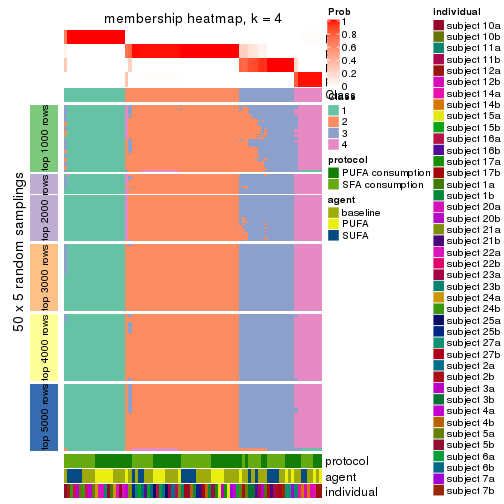</p>

</div>
<div id='tab-ATC-mclust-membership-heatmap-4'>
<pre><code class="r">membership_heatmap(res, k = 5)
</code></pre>

<p></p>

</div>
<div id='tab-ATC-mclust-membership-heatmap-5'>
<pre><code class="r">membership_heatmap(res, k = 6)
</code></pre>

<p></p>

</div>
</div>

As soon as we have had the classes for columns, we can look for signatures
which are significantly different between classes which can be candidate marks
for certain classes. Following are the heatmaps for signatures.


Signature heatmaps where rows are scaled:


<script>
$( function() {
	$( '#tabs-ATC-mclust-get-signatures' ).tabs();
} );
</script>
<div id='tabs-ATC-mclust-get-signatures'>
<ul>
<li><a href='#tab-ATC-mclust-get-signatures-1'>k = 2</a></li>
<li><a href='#tab-ATC-mclust-get-signatures-2'>k = 3</a></li>
<li><a href='#tab-ATC-mclust-get-signatures-3'>k = 4</a></li>
<li><a href='#tab-ATC-mclust-get-signatures-4'>k = 5</a></li>
<li><a href='#tab-ATC-mclust-get-signatures-5'>k = 6</a></li>
</ul>
<div id='tab-ATC-mclust-get-signatures-1'>
<pre><code class="r">get_signatures(res, k = 2)
</code></pre>

<p></p>

</div>
<div id='tab-ATC-mclust-get-signatures-2'>
<pre><code class="r">get_signatures(res, k = 3)
</code></pre>

<p></p>

</div>
<div id='tab-ATC-mclust-get-signatures-3'>
<pre><code class="r">get_signatures(res, k = 4)
</code></pre>

<p></p>

</div>
<div id='tab-ATC-mclust-get-signatures-4'>
<pre><code class="r">get_signatures(res, k = 5)
</code></pre>

<p></p>

</div>
<div id='tab-ATC-mclust-get-signatures-5'>
<pre><code class="r">get_signatures(res, k = 6)
</code></pre>

<p></p>

</div>
</div>


Signature heatmaps where rows are not scaled:


<script>
$( function() {
	$( '#tabs-ATC-mclust-get-signatures-no-scale' ).tabs();
} );
</script>
<div id='tabs-ATC-mclust-get-signatures-no-scale'>
<ul>
<li><a href='#tab-ATC-mclust-get-signatures-no-scale-1'>k = 2</a></li>
<li><a href='#tab-ATC-mclust-get-signatures-no-scale-2'>k = 3</a></li>
<li><a href='#tab-ATC-mclust-get-signatures-no-scale-3'>k = 4</a></li>
<li><a href='#tab-ATC-mclust-get-signatures-no-scale-4'>k = 5</a></li>
<li><a href='#tab-ATC-mclust-get-signatures-no-scale-5'>k = 6</a></li>
</ul>
<div id='tab-ATC-mclust-get-signatures-no-scale-1'>
<pre><code class="r">get_signatures(res, k = 2, scale_rows = FALSE)
</code></pre>

<p></p>

</div>
<div id='tab-ATC-mclust-get-signatures-no-scale-2'>
<pre><code class="r">get_signatures(res, k = 3, scale_rows = FALSE)
</code></pre>

<p></p>

</div>
<div id='tab-ATC-mclust-get-signatures-no-scale-3'>
<pre><code class="r">get_signatures(res, k = 4, scale_rows = FALSE)
</code></pre>

<p></p>

</div>
<div id='tab-ATC-mclust-get-signatures-no-scale-4'>
<pre><code class="r">get_signatures(res, k = 5, scale_rows = FALSE)
</code></pre>

<p></p>

</div>
<div id='tab-ATC-mclust-get-signatures-no-scale-5'>
<pre><code class="r">get_signatures(res, k = 6, scale_rows = FALSE)
</code></pre>

<p></p>

</div>
</div>


Compare the overlap of signatures from different k:

```r
compare_signatures(res)
```


`get_signature()` returns a data frame invisibly. TO get the list of signatures, the function
call should be assigned to a variable explicitly. In following code, if `plot` argument is set
to `FALSE`, no heatmap is plotted while only the differential analysis is performed.

```r
# code only for demonstration
tb = get_signature(res, k = ..., plot = FALSE)
```

An example of the output of `tb` is:

```
#>   which_row         fdr    mean_1    mean_2 scaled_mean_1 scaled_mean_2 km
#> 1        38 0.042760348  8.373488  9.131774    -0.5533452     0.5164555  1
#> 2        40 0.018707592  7.106213  8.469186    -0.6173731     0.5762149  1
#> 3        55 0.019134737 10.221463 11.207825    -0.6159697     0.5749050  1
#> 4        59 0.006059896  5.921854  7.869574    -0.6899429     0.6439467  1
#> 5        60 0.018055526  8.928898 10.211722    -0.6204761     0.5791110  1
#> 6        98 0.009384629 15.714769 14.887706     0.6635654    -0.6193277  2
...
```

The columns in `tb` are:

1. `which_row`: row indices corresponding to the input matrix.
2. `fdr`: FDR for the differential test. 
3. `mean_x`: The mean value in group x.
4. `scaled_mean_x`: The mean value in group x after rows are scaled.
5. `km`: Row groups if k-means clustering is applied to rows.


UMAP plot which shows how samples are separated.


<script>
$( function() {
	$( '#tabs-ATC-mclust-dimension-reduction' ).tabs();
} );
</script>
<div id='tabs-ATC-mclust-dimension-reduction'>
<ul>
<li><a href='#tab-ATC-mclust-dimension-reduction-1'>k = 2</a></li>
<li><a href='#tab-ATC-mclust-dimension-reduction-2'>k = 3</a></li>
<li><a href='#tab-ATC-mclust-dimension-reduction-3'>k = 4</a></li>
<li><a href='#tab-ATC-mclust-dimension-reduction-4'>k = 5</a></li>
<li><a href='#tab-ATC-mclust-dimension-reduction-5'>k = 6</a></li>
</ul>
<div id='tab-ATC-mclust-dimension-reduction-1'>
<pre><code class="r">dimension_reduction(res, k = 2, method = &quot;UMAP&quot;)
</code></pre>

<p></p>

</div>
<div id='tab-ATC-mclust-dimension-reduction-2'>
<pre><code class="r">dimension_reduction(res, k = 3, method = &quot;UMAP&quot;)
</code></pre>

<p></p>

</div>
<div id='tab-ATC-mclust-dimension-reduction-3'>
<pre><code class="r">dimension_reduction(res, k = 4, method = &quot;UMAP&quot;)
</code></pre>

<p></p>

</div>
<div id='tab-ATC-mclust-dimension-reduction-4'>
<pre><code class="r">dimension_reduction(res, k = 5, method = &quot;UMAP&quot;)
</code></pre>

<p></p>

</div>
<div id='tab-ATC-mclust-dimension-reduction-5'>
<pre><code class="r">dimension_reduction(res, k = 6, method = &quot;UMAP&quot;)
</code></pre>

<p></p>

</div>
</div>


Following heatmap shows how subgroups are split when increasing `k`:

```r
collect_classes(res)
```


Test correlation between subgroups and known annotations. If the known
annotation is numeric, one-way ANOVA test is applied, and if the known
annotation is discrete, chi-squared contingency table test is applied.

```r
test_to_known_factors(res)
```

```
#>             n protocol(p) agent(p) individual(p) k
#> ATC:mclust 84       1.000    0.606      1.03e-03 2
#> ATC:mclust 83       0.986    0.996      1.26e-05 3
#> ATC:mclust 83       0.733    0.928      2.02e-07 4
#> ATC:mclust 75       0.693    0.787      1.72e-07 5
#> ATC:mclust 70       0.690    0.902      2.72e-05 6
```


If matrix rows can be associated to genes, consider to use `functional_enrichment(res,
...)` to perform function enrichment for the signature genes. See [this vignette](http://bioconductor.org/packages/devel/bioc/vignettes/cola/inst/doc/functional_enrichment.html) for more detailed explanations.


 

---------------------------------------------------


### ATC:NMF*


The object with results only for a single top-value method and a single partition method 
can be extracted as:

```r
res = res_list["ATC", "NMF"]
# you can also extract it by
# res = res_list["ATC:NMF"]
```

A summary of `res` and all the functions that can be applied to it:

```r
res
```

```
#> A 'ConsensusPartition' object with k = 2, 3, 4, 5, 6.
#>   On a matrix with 15497 rows and 84 columns.
#>   Top rows (1000, 2000, 3000, 4000, 5000) are extracted by 'ATC' method.
#>   Subgroups are detected by 'NMF' method.
#>   Performed in total 1250 partitions by row resampling.
#>   Best k for subgroups seems to be 3.
#> 
#> Following methods can be applied to this 'ConsensusPartition' object:
#>  [1] "cola_report"             "collect_classes"         "collect_plots"          
#>  [4] "collect_stats"           "colnames"                "compare_signatures"     
#>  [7] "consensus_heatmap"       "dimension_reduction"     "functional_enrichment"  
#> [10] "get_anno_col"            "get_anno"                "get_classes"            
#> [13] "get_consensus"           "get_matrix"              "get_membership"         
#> [16] "get_param"               "get_signatures"          "get_stats"              
#> [19] "is_best_k"               "is_stable_k"             "membership_heatmap"     
#> [22] "ncol"                    "nrow"                    "plot_ecdf"              
#> [25] "rownames"                "select_partition_number" "show"                   
#> [28] "suggest_best_k"          "test_to_known_factors"
```

`collect_plots()` function collects all the plots made from `res` for all `k` (number of partitions)
into one single page to provide an easy and fast comparison between different `k`.

```r
collect_plots(res)
```


The plots are:

- The first row: a plot of the ECDF (empirical cumulative distribution
  function) curves of the consensus matrix for each `k` and the heatmap of
  predicted classes for each `k`.
- The second row: heatmaps of the consensus matrix for each `k`.
- The third row: heatmaps of the membership matrix for each `k`.
- The fouth row: heatmaps of the signatures for each `k`.

All the plots in panels can be made by individual functions and they are
plotted later in this section.

`select_partition_number()` produces several plots showing different
statistics for choosing "optimized" `k`. There are following statistics:

- ECDF curves of the consensus matrix for each `k`;
- 1-PAC. [The PAC
  score](https://en.wikipedia.org/wiki/Consensus_clustering#Over-interpretation_potential_of_consensus_clustering)
  measures the proportion of the ambiguous subgrouping.
- Mean silhouette score.
- Concordance. The mean probability of fiting the consensus class ids in all
  partitions.
- Area increased. Denote $A_k$ as the area under the ECDF curve for current
  `k`, the area increased is defined as $A_k - A_{k-1}$.
- Rand index. The percent of pairs of samples that are both in a same cluster
  or both are not in a same cluster in the partition of k and k-1.
- Jaccard index. The ratio of pairs of samples are both in a same cluster in
  the partition of k and k-1 and the pairs of samples are both in a same
  cluster in the partition k or k-1.

The detailed explanations of these statistics can be found in [the _cola_
vignette](http://bioconductor.org/packages/devel/bioc/vignettes/cola/inst/doc/cola.html#toc_13).

Generally speaking, lower PAC score, higher mean silhouette score or higher
concordance corresponds to better partition. Rand index and Jaccard index
measure how similar the current partition is compared to partition with `k-1`.
If they are too similar, we won't accept `k` is better than `k-1`.

```r
select_partition_number(res)
```


The numeric values for all these statistics can be obtained by `get_stats()`.

```r
get_stats(res)
```

```
#>   k 1-PAC mean_silhouette concordance area_increased  Rand Jaccard
#> 2 2 1.000           0.964       0.984         0.4956 0.501   0.501
#> 3 3 0.920           0.911       0.949         0.3281 0.752   0.543
#> 4 4 0.838           0.809       0.906         0.0951 0.896   0.708
#> 5 5 0.730           0.602       0.828         0.0616 0.966   0.878
#> 6 6 0.722           0.630       0.816         0.0409 0.903   0.649
```

`suggest_best_k()` suggests the best $k$ based on these statistics. The rules are as follows:

- All $k$ with Jaccard index larger than 0.95 are removed because increasing
  $k$ does not provide enough extra information. If all $k$ are removed, it is
  marked as no subgroup is detected.
- For all $k$ with 1-PAC score larger than 0.9, the maximal $k$ is taken as
  the best $k$, and other $k$ are marked as optional $k$.
- If it does not fit the second rule. The $k$ with the maximal vote of the
  highest 1-PAC score, highest mean silhouette, and highest concordance is
  taken as the best $k$.

```r
suggest_best_k(res)
```

```
#> [1] 3
#> attr(,"optional")
#> [1] 2
```

There is also optional best $k$ = 2 that is worth to check.

Following shows the table of the partitions (You need to click the **show/hide
code output** link to see it). The membership matrix (columns with name `p*`)
is inferred by
[`clue::cl_consensus()`](https://www.rdocumentation.org/link/cl_consensus?package=clue)
function with the `SE` method. Basically the value in the membership matrix
represents the probability to belong to a certain group. The finall class
label for an item is determined with the group with highest probability it
belongs to.

In `get_classes()` function, the entropy is calculated from the membership
matrix and the silhouette score is calculated from the consensus matrix.


<script>
$( function() {
	$( '#tabs-ATC-NMF-get-classes' ).tabs();
} );
</script>
<div id='tabs-ATC-NMF-get-classes'>
<ul>
<li><a href='#tab-ATC-NMF-get-classes-1'>k = 2</a></li>
<li><a href='#tab-ATC-NMF-get-classes-2'>k = 3</a></li>
<li><a href='#tab-ATC-NMF-get-classes-3'>k = 4</a></li>
<li><a href='#tab-ATC-NMF-get-classes-4'>k = 5</a></li>
<li><a href='#tab-ATC-NMF-get-classes-5'>k = 6</a></li>
</ul>

<div id='tab-ATC-NMF-get-classes-1'>
<p><a id='tab-ATC-NMF-get-classes-1-a' style='color:#0366d6' href='#'>show/hide code output</a></p>
<pre><code class="r">cbind(get_classes(res, k = 2), get_membership(res, k = 2))
</code></pre>

<pre><code>#&gt;           class entropy silhouette    p1    p2
#&gt; GSM339455     1   0.955      0.432 0.624 0.376
#&gt; GSM339456     2   0.000      0.995 0.000 1.000
#&gt; GSM339457     2   0.000      0.995 0.000 1.000
#&gt; GSM339458     2   0.000      0.995 0.000 1.000
#&gt; GSM339459     2   0.000      0.995 0.000 1.000
#&gt; GSM339460     2   0.000      0.995 0.000 1.000
#&gt; GSM339461     2   0.000      0.995 0.000 1.000
#&gt; GSM339462     1   0.000      0.968 1.000 0.000
#&gt; GSM339463     1   0.000      0.968 1.000 0.000
#&gt; GSM339464     1   0.000      0.968 1.000 0.000
#&gt; GSM339465     1   0.000      0.968 1.000 0.000
#&gt; GSM339466     2   0.000      0.995 0.000 1.000
#&gt; GSM339467     2   0.000      0.995 0.000 1.000
#&gt; GSM339468     2   0.000      0.995 0.000 1.000
#&gt; GSM339469     1   0.000      0.968 1.000 0.000
#&gt; GSM339470     2   0.000      0.995 0.000 1.000
#&gt; GSM339471     1   0.000      0.968 1.000 0.000
#&gt; GSM339472     2   0.000      0.995 0.000 1.000
#&gt; GSM339473     1   0.000      0.968 1.000 0.000
#&gt; GSM339474     2   0.000      0.995 0.000 1.000
#&gt; GSM339475     2   0.388      0.914 0.076 0.924
#&gt; GSM339476     1   0.000      0.968 1.000 0.000
#&gt; GSM339477     2   0.000      0.995 0.000 1.000
#&gt; GSM339478     2   0.000      0.995 0.000 1.000
#&gt; GSM339479     2   0.563      0.842 0.132 0.868
#&gt; GSM339480     2   0.000      0.995 0.000 1.000
#&gt; GSM339481     2   0.000      0.995 0.000 1.000
#&gt; GSM339482     1   0.000      0.968 1.000 0.000
#&gt; GSM339483     1   0.000      0.968 1.000 0.000
#&gt; GSM339484     1   0.000      0.968 1.000 0.000
#&gt; GSM339485     1   0.000      0.968 1.000 0.000
#&gt; GSM339486     1   0.000      0.968 1.000 0.000
#&gt; GSM339487     2   0.000      0.995 0.000 1.000
#&gt; GSM339488     2   0.000      0.995 0.000 1.000
#&gt; GSM339489     2   0.000      0.995 0.000 1.000
#&gt; GSM339490     1   0.000      0.968 1.000 0.000
#&gt; GSM339491     2   0.000      0.995 0.000 1.000
#&gt; GSM339492     1   0.000      0.968 1.000 0.000
#&gt; GSM339493     2   0.000      0.995 0.000 1.000
#&gt; GSM339494     1   0.000      0.968 1.000 0.000
#&gt; GSM339495     2   0.000      0.995 0.000 1.000
#&gt; GSM339496     1   0.917      0.532 0.668 0.332
#&gt; GSM339497     2   0.000      0.995 0.000 1.000
#&gt; GSM339498     2   0.000      0.995 0.000 1.000
#&gt; GSM339499     2   0.000      0.995 0.000 1.000
#&gt; GSM339500     2   0.000      0.995 0.000 1.000
#&gt; GSM339501     1   0.224      0.940 0.964 0.036
#&gt; GSM339502     2   0.000      0.995 0.000 1.000
#&gt; GSM339503     1   0.802      0.692 0.756 0.244
#&gt; GSM339504     1   0.000      0.968 1.000 0.000
#&gt; GSM339505     2   0.000      0.995 0.000 1.000
#&gt; GSM339506     1   0.000      0.968 1.000 0.000
#&gt; GSM339507     1   0.000      0.968 1.000 0.000
#&gt; GSM339508     2   0.000      0.995 0.000 1.000
#&gt; GSM339509     2   0.000      0.995 0.000 1.000
#&gt; GSM339510     2   0.000      0.995 0.000 1.000
#&gt; GSM339511     1   0.000      0.968 1.000 0.000
#&gt; GSM339512     2   0.000      0.995 0.000 1.000
#&gt; GSM339513     1   0.000      0.968 1.000 0.000
#&gt; GSM339514     2   0.000      0.995 0.000 1.000
#&gt; GSM339515     1   0.000      0.968 1.000 0.000
#&gt; GSM339516     2   0.000      0.995 0.000 1.000
#&gt; GSM339517     2   0.000      0.995 0.000 1.000
#&gt; GSM339518     2   0.000      0.995 0.000 1.000
#&gt; GSM339519     1   0.141      0.953 0.980 0.020
#&gt; GSM339520     2   0.000      0.995 0.000 1.000
#&gt; GSM339521     2   0.000      0.995 0.000 1.000
#&gt; GSM339522     2   0.000      0.995 0.000 1.000
#&gt; GSM339523     2   0.000      0.995 0.000 1.000
#&gt; GSM339524     1   0.000      0.968 1.000 0.000
#&gt; GSM339525     1   0.000      0.968 1.000 0.000
#&gt; GSM339526     1   0.000      0.968 1.000 0.000
#&gt; GSM339527     1   0.000      0.968 1.000 0.000
#&gt; GSM339528     1   0.000      0.968 1.000 0.000
#&gt; GSM339529     2   0.000      0.995 0.000 1.000
#&gt; GSM339530     2   0.000      0.995 0.000 1.000
#&gt; GSM339531     2   0.000      0.995 0.000 1.000
#&gt; GSM339532     1   0.000      0.968 1.000 0.000
#&gt; GSM339533     1   0.518      0.861 0.884 0.116
#&gt; GSM339534     1   0.000      0.968 1.000 0.000
#&gt; GSM339535     2   0.000      0.995 0.000 1.000
#&gt; GSM339536     1   0.000      0.968 1.000 0.000
#&gt; GSM339537     2   0.000      0.995 0.000 1.000
#&gt; GSM339538     1   0.000      0.968 1.000 0.000
</code></pre>

<script>
$('#tab-ATC-NMF-get-classes-1-a').parent().next().next().hide();
$('#tab-ATC-NMF-get-classes-1-a').click(function(){
  $('#tab-ATC-NMF-get-classes-1-a').parent().next().next().toggle();
  return(false);
});
</script>
</div>

<div id='tab-ATC-NMF-get-classes-2'>
<p><a id='tab-ATC-NMF-get-classes-2-a' style='color:#0366d6' href='#'>show/hide code output</a></p>
<pre><code class="r">cbind(get_classes(res, k = 3), get_membership(res, k = 3))
</code></pre>

<pre><code>#&gt;           class entropy silhouette    p1    p2    p3
#&gt; GSM339455     3  0.3155      0.884 0.044 0.040 0.916
#&gt; GSM339456     2  0.0237      0.980 0.000 0.996 0.004
#&gt; GSM339457     3  0.2165      0.893 0.000 0.064 0.936
#&gt; GSM339458     2  0.0237      0.978 0.004 0.996 0.000
#&gt; GSM339459     3  0.3879      0.836 0.000 0.152 0.848
#&gt; GSM339460     2  0.1315      0.960 0.008 0.972 0.020
#&gt; GSM339461     2  0.0237      0.980 0.000 0.996 0.004
#&gt; GSM339462     1  0.0237      0.949 0.996 0.000 0.004
#&gt; GSM339463     3  0.1289      0.888 0.032 0.000 0.968
#&gt; GSM339464     1  0.1163      0.955 0.972 0.000 0.028
#&gt; GSM339465     3  0.1031      0.892 0.024 0.000 0.976
#&gt; GSM339466     2  0.0237      0.980 0.000 0.996 0.004
#&gt; GSM339467     2  0.0000      0.980 0.000 1.000 0.000
#&gt; GSM339468     2  0.0237      0.980 0.000 0.996 0.004
#&gt; GSM339469     1  0.0892      0.940 0.980 0.000 0.020
#&gt; GSM339470     3  0.2448      0.891 0.000 0.076 0.924
#&gt; GSM339471     1  0.1529      0.955 0.960 0.000 0.040
#&gt; GSM339472     2  0.0237      0.980 0.000 0.996 0.004
#&gt; GSM339473     1  0.1411      0.955 0.964 0.000 0.036
#&gt; GSM339474     2  0.0000      0.980 0.000 1.000 0.000
#&gt; GSM339475     3  0.1163      0.897 0.000 0.028 0.972
#&gt; GSM339476     1  0.1289      0.956 0.968 0.000 0.032
#&gt; GSM339477     2  0.0000      0.980 0.000 1.000 0.000
#&gt; GSM339478     2  0.4399      0.747 0.000 0.812 0.188
#&gt; GSM339479     2  0.5201      0.697 0.236 0.760 0.004
#&gt; GSM339480     3  0.3340      0.865 0.000 0.120 0.880
#&gt; GSM339481     2  0.0000      0.980 0.000 1.000 0.000
#&gt; GSM339482     3  0.1031      0.892 0.024 0.000 0.976
#&gt; GSM339483     1  0.0892      0.940 0.980 0.000 0.020
#&gt; GSM339484     1  0.1860      0.950 0.948 0.000 0.052
#&gt; GSM339485     1  0.1163      0.955 0.972 0.000 0.028
#&gt; GSM339486     3  0.6274      0.107 0.456 0.000 0.544
#&gt; GSM339487     2  0.0237      0.980 0.000 0.996 0.004
#&gt; GSM339488     2  0.0237      0.980 0.000 0.996 0.004
#&gt; GSM339489     2  0.0237      0.980 0.000 0.996 0.004
#&gt; GSM339490     1  0.0892      0.940 0.980 0.000 0.020
#&gt; GSM339491     3  0.6154      0.375 0.000 0.408 0.592
#&gt; GSM339492     1  0.1643      0.953 0.956 0.000 0.044
#&gt; GSM339493     2  0.0000      0.980 0.000 1.000 0.000
#&gt; GSM339494     1  0.1289      0.956 0.968 0.000 0.032
#&gt; GSM339495     2  0.0000      0.980 0.000 1.000 0.000
#&gt; GSM339496     3  0.0892      0.893 0.020 0.000 0.980
#&gt; GSM339497     2  0.0237      0.980 0.000 0.996 0.004
#&gt; GSM339498     3  0.2959      0.879 0.000 0.100 0.900
#&gt; GSM339499     3  0.2537      0.890 0.000 0.080 0.920
#&gt; GSM339500     2  0.0592      0.974 0.000 0.988 0.012
#&gt; GSM339501     1  0.2269      0.947 0.944 0.016 0.040
#&gt; GSM339502     2  0.0000      0.980 0.000 1.000 0.000
#&gt; GSM339503     3  0.0892      0.893 0.020 0.000 0.980
#&gt; GSM339504     1  0.0000      0.948 1.000 0.000 0.000
#&gt; GSM339505     3  0.2261      0.892 0.000 0.068 0.932
#&gt; GSM339506     1  0.5760      0.568 0.672 0.000 0.328
#&gt; GSM339507     1  0.1753      0.952 0.952 0.000 0.048
#&gt; GSM339508     2  0.0000      0.980 0.000 1.000 0.000
#&gt; GSM339509     2  0.0000      0.980 0.000 1.000 0.000
#&gt; GSM339510     2  0.0237      0.980 0.000 0.996 0.004
#&gt; GSM339511     1  0.0892      0.940 0.980 0.000 0.020
#&gt; GSM339512     2  0.0237      0.980 0.000 0.996 0.004
#&gt; GSM339513     1  0.1753      0.952 0.952 0.000 0.048
#&gt; GSM339514     2  0.0000      0.980 0.000 1.000 0.000
#&gt; GSM339515     1  0.1529      0.955 0.960 0.000 0.040
#&gt; GSM339516     2  0.2636      0.923 0.048 0.932 0.020
#&gt; GSM339517     3  0.1411      0.897 0.000 0.036 0.964
#&gt; GSM339518     2  0.0000      0.980 0.000 1.000 0.000
#&gt; GSM339519     3  0.1163      0.891 0.028 0.000 0.972
#&gt; GSM339520     3  0.2711      0.886 0.000 0.088 0.912
#&gt; GSM339521     2  0.0237      0.980 0.000 0.996 0.004
#&gt; GSM339522     2  0.0000      0.980 0.000 1.000 0.000
#&gt; GSM339523     2  0.0000      0.980 0.000 1.000 0.000
#&gt; GSM339524     3  0.5431      0.584 0.284 0.000 0.716
#&gt; GSM339525     1  0.0892      0.940 0.980 0.000 0.020
#&gt; GSM339526     3  0.1031      0.892 0.024 0.000 0.976
#&gt; GSM339527     1  0.4887      0.751 0.772 0.000 0.228
#&gt; GSM339528     1  0.2625      0.926 0.916 0.000 0.084
#&gt; GSM339529     2  0.1315      0.960 0.008 0.972 0.020
#&gt; GSM339530     3  0.2711      0.886 0.000 0.088 0.912
#&gt; GSM339531     2  0.0237      0.980 0.000 0.996 0.004
#&gt; GSM339532     1  0.0892      0.940 0.980 0.000 0.020
#&gt; GSM339533     3  0.0892      0.893 0.020 0.000 0.980
#&gt; GSM339534     1  0.1163      0.956 0.972 0.000 0.028
#&gt; GSM339535     2  0.0000      0.980 0.000 1.000 0.000
#&gt; GSM339536     1  0.1529      0.955 0.960 0.000 0.040
#&gt; GSM339537     2  0.0829      0.969 0.004 0.984 0.012
#&gt; GSM339538     3  0.1031      0.892 0.024 0.000 0.976
</code></pre>

<script>
$('#tab-ATC-NMF-get-classes-2-a').parent().next().next().hide();
$('#tab-ATC-NMF-get-classes-2-a').click(function(){
  $('#tab-ATC-NMF-get-classes-2-a').parent().next().next().toggle();
  return(false);
});
</script>
</div>

<div id='tab-ATC-NMF-get-classes-3'>
<p><a id='tab-ATC-NMF-get-classes-3-a' style='color:#0366d6' href='#'>show/hide code output</a></p>
<pre><code class="r">cbind(get_classes(res, k = 4), get_membership(res, k = 4))
</code></pre>

<pre><code>#&gt;           class entropy silhouette    p1    p2    p3    p4
#&gt; GSM339455     3  0.6050     0.6339 0.140 0.096 0.732 0.032
#&gt; GSM339456     2  0.0000     0.9614 0.000 1.000 0.000 0.000
#&gt; GSM339457     3  0.0188     0.8990 0.000 0.004 0.996 0.000
#&gt; GSM339458     2  0.2704     0.8628 0.000 0.876 0.000 0.124
#&gt; GSM339459     3  0.1792     0.8617 0.000 0.068 0.932 0.000
#&gt; GSM339460     2  0.1510     0.9407 0.016 0.956 0.000 0.028
#&gt; GSM339461     2  0.2149     0.9126 0.000 0.912 0.000 0.088
#&gt; GSM339462     1  0.0336     0.8774 0.992 0.000 0.000 0.008
#&gt; GSM339463     4  0.5221     0.6934 0.208 0.000 0.060 0.732
#&gt; GSM339464     4  0.4730     0.4975 0.364 0.000 0.000 0.636
#&gt; GSM339465     4  0.5480     0.6925 0.124 0.000 0.140 0.736
#&gt; GSM339466     2  0.0000     0.9614 0.000 1.000 0.000 0.000
#&gt; GSM339467     2  0.0000     0.9614 0.000 1.000 0.000 0.000
#&gt; GSM339468     2  0.2466     0.9034 0.000 0.900 0.004 0.096
#&gt; GSM339469     1  0.0592     0.8738 0.984 0.000 0.000 0.016
#&gt; GSM339470     4  0.3894     0.6509 0.000 0.068 0.088 0.844
#&gt; GSM339471     1  0.0592     0.8768 0.984 0.000 0.000 0.016
#&gt; GSM339472     2  0.0000     0.9614 0.000 1.000 0.000 0.000
#&gt; GSM339473     1  0.0921     0.8740 0.972 0.000 0.000 0.028
#&gt; GSM339474     2  0.0000     0.9614 0.000 1.000 0.000 0.000
#&gt; GSM339475     3  0.0817     0.8953 0.000 0.000 0.976 0.024
#&gt; GSM339476     1  0.1022     0.8733 0.968 0.000 0.000 0.032
#&gt; GSM339477     2  0.0188     0.9609 0.000 0.996 0.000 0.004
#&gt; GSM339478     3  0.4981     0.1405 0.000 0.464 0.536 0.000
#&gt; GSM339479     4  0.5073     0.6758 0.200 0.056 0.000 0.744
#&gt; GSM339480     3  0.1854     0.8815 0.000 0.048 0.940 0.012
#&gt; GSM339481     2  0.0188     0.9609 0.000 0.996 0.000 0.004
#&gt; GSM339482     3  0.0469     0.8977 0.000 0.000 0.988 0.012
#&gt; GSM339483     1  0.0000     0.8774 1.000 0.000 0.000 0.000
#&gt; GSM339484     1  0.1389     0.8619 0.952 0.000 0.000 0.048
#&gt; GSM339485     1  0.4907     0.1237 0.580 0.000 0.000 0.420
#&gt; GSM339486     4  0.5850     0.2504 0.456 0.000 0.032 0.512
#&gt; GSM339487     2  0.1411     0.9419 0.020 0.960 0.000 0.020
#&gt; GSM339488     2  0.0000     0.9614 0.000 1.000 0.000 0.000
#&gt; GSM339489     2  0.1256     0.9456 0.008 0.964 0.000 0.028
#&gt; GSM339490     1  0.0592     0.8738 0.984 0.000 0.000 0.016
#&gt; GSM339491     4  0.2797     0.6615 0.000 0.068 0.032 0.900
#&gt; GSM339492     1  0.0672     0.8774 0.984 0.000 0.008 0.008
#&gt; GSM339493     2  0.0188     0.9607 0.000 0.996 0.000 0.004
#&gt; GSM339494     1  0.0921     0.8740 0.972 0.000 0.000 0.028
#&gt; GSM339495     2  0.0188     0.9607 0.000 0.996 0.000 0.004
#&gt; GSM339496     3  0.1022     0.8922 0.000 0.000 0.968 0.032
#&gt; GSM339497     2  0.0707     0.9554 0.000 0.980 0.000 0.020
#&gt; GSM339498     3  0.1118     0.8904 0.000 0.036 0.964 0.000
#&gt; GSM339499     3  0.0336     0.8992 0.000 0.008 0.992 0.000
#&gt; GSM339500     2  0.4328     0.7190 0.000 0.748 0.008 0.244
#&gt; GSM339501     1  0.3199     0.8028 0.892 0.012 0.060 0.036
#&gt; GSM339502     2  0.0000     0.9614 0.000 1.000 0.000 0.000
#&gt; GSM339503     3  0.3764     0.6961 0.000 0.000 0.784 0.216
#&gt; GSM339504     1  0.0188     0.8769 0.996 0.000 0.000 0.004
#&gt; GSM339505     3  0.1820     0.8890 0.000 0.020 0.944 0.036
#&gt; GSM339506     4  0.3801     0.6871 0.220 0.000 0.000 0.780
#&gt; GSM339507     1  0.4999    -0.1764 0.508 0.000 0.000 0.492
#&gt; GSM339508     2  0.0000     0.9614 0.000 1.000 0.000 0.000
#&gt; GSM339509     2  0.0000     0.9614 0.000 1.000 0.000 0.000
#&gt; GSM339510     2  0.1118     0.9482 0.000 0.964 0.000 0.036
#&gt; GSM339511     1  0.1022     0.8691 0.968 0.000 0.000 0.032
#&gt; GSM339512     2  0.4356     0.6669 0.000 0.708 0.000 0.292
#&gt; GSM339513     1  0.1722     0.8551 0.944 0.000 0.048 0.008
#&gt; GSM339514     2  0.0188     0.9609 0.000 0.996 0.000 0.004
#&gt; GSM339515     1  0.0921     0.8740 0.972 0.000 0.000 0.028
#&gt; GSM339516     2  0.2411     0.9101 0.040 0.920 0.000 0.040
#&gt; GSM339517     3  0.1867     0.8678 0.000 0.000 0.928 0.072
#&gt; GSM339518     2  0.1211     0.9473 0.000 0.960 0.000 0.040
#&gt; GSM339519     3  0.0592     0.8918 0.016 0.000 0.984 0.000
#&gt; GSM339520     3  0.0707     0.8977 0.000 0.020 0.980 0.000
#&gt; GSM339521     4  0.4103     0.5004 0.000 0.256 0.000 0.744
#&gt; GSM339522     2  0.0469     0.9580 0.000 0.988 0.000 0.012
#&gt; GSM339523     2  0.0000     0.9614 0.000 1.000 0.000 0.000
#&gt; GSM339524     1  0.5624     0.4482 0.668 0.000 0.280 0.052
#&gt; GSM339525     1  0.0592     0.8738 0.984 0.000 0.000 0.016
#&gt; GSM339526     3  0.0336     0.8980 0.000 0.000 0.992 0.008
#&gt; GSM339527     4  0.3837     0.6846 0.224 0.000 0.000 0.776
#&gt; GSM339528     1  0.5090     0.3777 0.660 0.000 0.016 0.324
#&gt; GSM339529     2  0.0000     0.9614 0.000 1.000 0.000 0.000
#&gt; GSM339530     3  0.0592     0.8979 0.000 0.016 0.984 0.000
#&gt; GSM339531     2  0.0524     0.9593 0.000 0.988 0.004 0.008
#&gt; GSM339532     1  0.0921     0.8696 0.972 0.000 0.000 0.028
#&gt; GSM339533     4  0.5290     0.0245 0.008 0.000 0.476 0.516
#&gt; GSM339534     1  0.1833     0.8536 0.944 0.000 0.024 0.032
#&gt; GSM339535     2  0.0921     0.9513 0.000 0.972 0.000 0.028
#&gt; GSM339536     1  0.1211     0.8676 0.960 0.000 0.000 0.040
#&gt; GSM339537     2  0.0707     0.9558 0.000 0.980 0.000 0.020
#&gt; GSM339538     3  0.0000     0.8976 0.000 0.000 1.000 0.000
</code></pre>

<script>
$('#tab-ATC-NMF-get-classes-3-a').parent().next().next().hide();
$('#tab-ATC-NMF-get-classes-3-a').click(function(){
  $('#tab-ATC-NMF-get-classes-3-a').parent().next().next().toggle();
  return(false);
});
</script>
</div>

<div id='tab-ATC-NMF-get-classes-4'>
<p><a id='tab-ATC-NMF-get-classes-4-a' style='color:#0366d6' href='#'>show/hide code output</a></p>
<pre><code class="r">cbind(get_classes(res, k = 5), get_membership(res, k = 5))
</code></pre>

<pre><code>#&gt;           class entropy silhouette    p1    p2    p3    p4    p5
#&gt; GSM339455     3  0.7544    0.36798 0.084 0.020 0.548 0.132 0.216
#&gt; GSM339456     2  0.0609    0.80272 0.000 0.980 0.000 0.000 0.020
#&gt; GSM339457     3  0.0000    0.86685 0.000 0.000 1.000 0.000 0.000
#&gt; GSM339458     2  0.6106    0.14837 0.000 0.568 0.000 0.204 0.228
#&gt; GSM339459     3  0.2141    0.83728 0.000 0.064 0.916 0.004 0.016
#&gt; GSM339460     2  0.2233    0.71811 0.004 0.892 0.000 0.000 0.104
#&gt; GSM339461     2  0.1403    0.78821 0.000 0.952 0.000 0.024 0.024
#&gt; GSM339462     1  0.0451    0.75912 0.988 0.000 0.000 0.008 0.004
#&gt; GSM339463     4  0.4645    0.48427 0.268 0.000 0.000 0.688 0.044
#&gt; GSM339464     4  0.5107    0.36578 0.356 0.000 0.000 0.596 0.048
#&gt; GSM339465     4  0.3289    0.63635 0.108 0.000 0.000 0.844 0.048
#&gt; GSM339466     2  0.0510    0.80272 0.000 0.984 0.000 0.000 0.016
#&gt; GSM339467     2  0.0693    0.80188 0.000 0.980 0.000 0.012 0.008
#&gt; GSM339468     5  0.6015    0.75867 0.000 0.276 0.080 0.032 0.612
#&gt; GSM339469     1  0.3039    0.67329 0.808 0.000 0.000 0.000 0.192
#&gt; GSM339470     4  0.3336    0.62032 0.000 0.000 0.096 0.844 0.060
#&gt; GSM339471     1  0.0451    0.75924 0.988 0.000 0.000 0.008 0.004
#&gt; GSM339472     2  0.0510    0.80393 0.000 0.984 0.000 0.000 0.016
#&gt; GSM339473     1  0.1106    0.75160 0.964 0.000 0.000 0.024 0.012
#&gt; GSM339474     2  0.0290    0.80444 0.000 0.992 0.000 0.000 0.008
#&gt; GSM339475     3  0.0404    0.86652 0.000 0.000 0.988 0.012 0.000
#&gt; GSM339476     1  0.2179    0.72887 0.888 0.000 0.000 0.000 0.112
#&gt; GSM339477     2  0.0290    0.80444 0.000 0.992 0.000 0.000 0.008
#&gt; GSM339478     3  0.4420    0.01775 0.000 0.448 0.548 0.000 0.004
#&gt; GSM339479     4  0.7797    0.41454 0.232 0.124 0.000 0.472 0.172
#&gt; GSM339480     3  0.2002    0.85483 0.000 0.028 0.932 0.020 0.020
#&gt; GSM339481     2  0.0162    0.80419 0.000 0.996 0.000 0.000 0.004
#&gt; GSM339482     3  0.2291    0.82971 0.000 0.000 0.908 0.056 0.036
#&gt; GSM339483     1  0.0162    0.75880 0.996 0.000 0.000 0.000 0.004
#&gt; GSM339484     1  0.3691    0.65441 0.820 0.000 0.000 0.076 0.104
#&gt; GSM339485     1  0.5815    0.00177 0.508 0.000 0.000 0.396 0.096
#&gt; GSM339486     1  0.6367   -0.02454 0.460 0.000 0.000 0.372 0.168
#&gt; GSM339487     2  0.3934    0.21147 0.008 0.716 0.000 0.000 0.276
#&gt; GSM339488     2  0.0451    0.80418 0.000 0.988 0.000 0.004 0.008
#&gt; GSM339489     2  0.4437   -0.54256 0.004 0.532 0.000 0.000 0.464
#&gt; GSM339490     1  0.3039    0.67351 0.808 0.000 0.000 0.000 0.192
#&gt; GSM339491     4  0.4550    0.41187 0.000 0.276 0.000 0.688 0.036
#&gt; GSM339492     1  0.0000    0.75873 1.000 0.000 0.000 0.000 0.000
#&gt; GSM339493     2  0.0880    0.79405 0.000 0.968 0.000 0.000 0.032
#&gt; GSM339494     1  0.0579    0.75803 0.984 0.000 0.000 0.008 0.008
#&gt; GSM339495     2  0.0510    0.80380 0.000 0.984 0.000 0.000 0.016
#&gt; GSM339496     3  0.0703    0.86482 0.000 0.000 0.976 0.024 0.000
#&gt; GSM339497     2  0.1809    0.76709 0.000 0.928 0.000 0.012 0.060
#&gt; GSM339498     3  0.1124    0.86185 0.000 0.036 0.960 0.004 0.000
#&gt; GSM339499     3  0.0000    0.86685 0.000 0.000 1.000 0.000 0.000
#&gt; GSM339500     2  0.3753    0.62735 0.000 0.828 0.020 0.116 0.036
#&gt; GSM339501     1  0.6692    0.15134 0.408 0.004 0.200 0.000 0.388
#&gt; GSM339502     2  0.1741    0.77192 0.000 0.936 0.000 0.024 0.040
#&gt; GSM339503     3  0.4066    0.51382 0.000 0.000 0.672 0.324 0.004
#&gt; GSM339504     1  0.0963    0.75519 0.964 0.000 0.000 0.000 0.036
#&gt; GSM339505     3  0.4402    0.70885 0.000 0.148 0.780 0.052 0.020
#&gt; GSM339506     4  0.3752    0.63354 0.064 0.000 0.000 0.812 0.124
#&gt; GSM339507     1  0.5314    0.07171 0.528 0.000 0.000 0.420 0.052
#&gt; GSM339508     2  0.0000    0.80461 0.000 1.000 0.000 0.000 0.000
#&gt; GSM339509     2  0.0579    0.80457 0.000 0.984 0.000 0.008 0.008
#&gt; GSM339510     2  0.4420   -0.51071 0.000 0.548 0.000 0.004 0.448
#&gt; GSM339511     1  0.4451    0.30144 0.504 0.000 0.000 0.004 0.492
#&gt; GSM339512     2  0.3409    0.64392 0.000 0.836 0.000 0.052 0.112
#&gt; GSM339513     1  0.0510    0.75831 0.984 0.000 0.016 0.000 0.000
#&gt; GSM339514     2  0.0324    0.80451 0.000 0.992 0.000 0.004 0.004
#&gt; GSM339515     1  0.0451    0.75854 0.988 0.000 0.000 0.008 0.004
#&gt; GSM339516     2  0.5019   -0.55098 0.032 0.532 0.000 0.000 0.436
#&gt; GSM339517     3  0.1544    0.84802 0.000 0.000 0.932 0.068 0.000
#&gt; GSM339518     2  0.1251    0.78818 0.000 0.956 0.000 0.008 0.036
#&gt; GSM339519     3  0.0000    0.86685 0.000 0.000 1.000 0.000 0.000
#&gt; GSM339520     3  0.1430    0.85288 0.000 0.052 0.944 0.000 0.004
#&gt; GSM339521     4  0.6279    0.19880 0.000 0.280 0.000 0.528 0.192
#&gt; GSM339522     2  0.4114   -0.22275 0.000 0.624 0.000 0.000 0.376
#&gt; GSM339523     2  0.0290    0.80483 0.000 0.992 0.000 0.000 0.008
#&gt; GSM339524     1  0.3115    0.70252 0.876 0.000 0.056 0.048 0.020
#&gt; GSM339525     1  0.1732    0.74089 0.920 0.000 0.000 0.000 0.080
#&gt; GSM339526     3  0.0290    0.86674 0.000 0.000 0.992 0.008 0.000
#&gt; GSM339527     4  0.4038    0.62700 0.080 0.000 0.000 0.792 0.128
#&gt; GSM339528     1  0.6175    0.10565 0.508 0.000 0.000 0.344 0.148
#&gt; GSM339529     2  0.0162    0.80543 0.000 0.996 0.000 0.000 0.004
#&gt; GSM339530     3  0.1569    0.86000 0.000 0.032 0.948 0.008 0.012
#&gt; GSM339531     5  0.5215    0.82174 0.000 0.380 0.024 0.016 0.580
#&gt; GSM339532     1  0.4294    0.34903 0.532 0.000 0.000 0.000 0.468
#&gt; GSM339533     4  0.4015    0.31684 0.000 0.000 0.348 0.652 0.000
#&gt; GSM339534     1  0.1741    0.74680 0.936 0.000 0.040 0.000 0.024
#&gt; GSM339535     2  0.0703    0.79964 0.000 0.976 0.000 0.000 0.024
#&gt; GSM339536     1  0.1195    0.74977 0.960 0.000 0.000 0.028 0.012
#&gt; GSM339537     5  0.4510    0.75361 0.000 0.432 0.000 0.008 0.560
#&gt; GSM339538     3  0.0162    0.86679 0.000 0.000 0.996 0.004 0.000
</code></pre>

<script>
$('#tab-ATC-NMF-get-classes-4-a').parent().next().next().hide();
$('#tab-ATC-NMF-get-classes-4-a').click(function(){
  $('#tab-ATC-NMF-get-classes-4-a').parent().next().next().toggle();
  return(false);
});
</script>
</div>

<div id='tab-ATC-NMF-get-classes-5'>
<p><a id='tab-ATC-NMF-get-classes-5-a' style='color:#0366d6' href='#'>show/hide code output</a></p>
<pre><code class="r">cbind(get_classes(res, k = 6), get_membership(res, k = 6))
</code></pre>

<pre><code>#&gt;           class entropy silhouette    p1    p2    p3    p4    p5    p6
#&gt; GSM339455     6  0.4962     0.5271 0.056 0.004 0.100 0.020 0.068 0.752
#&gt; GSM339456     2  0.0767     0.8458 0.000 0.976 0.000 0.004 0.012 0.008
#&gt; GSM339457     3  0.0696     0.8256 0.000 0.004 0.980 0.004 0.004 0.008
#&gt; GSM339458     6  0.3267     0.5414 0.004 0.076 0.000 0.056 0.016 0.848
#&gt; GSM339459     3  0.2151     0.8027 0.000 0.072 0.904 0.000 0.008 0.016
#&gt; GSM339460     2  0.5455     0.0212 0.004 0.456 0.000 0.000 0.104 0.436
#&gt; GSM339461     2  0.1577     0.8418 0.000 0.940 0.000 0.008 0.016 0.036
#&gt; GSM339462     1  0.1003     0.8775 0.964 0.000 0.000 0.000 0.020 0.016
#&gt; GSM339463     4  0.4975     0.3937 0.044 0.000 0.024 0.660 0.008 0.264
#&gt; GSM339464     4  0.5099     0.3234 0.284 0.000 0.000 0.632 0.040 0.044
#&gt; GSM339465     4  0.4470     0.4128 0.036 0.000 0.016 0.680 0.000 0.268
#&gt; GSM339466     2  0.1232     0.8378 0.000 0.956 0.004 0.000 0.024 0.016
#&gt; GSM339467     2  0.1232     0.8435 0.000 0.956 0.000 0.004 0.016 0.024
#&gt; GSM339468     5  0.7816     0.2500 0.000 0.144 0.296 0.212 0.332 0.016
#&gt; GSM339469     1  0.3171     0.7578 0.784 0.000 0.000 0.000 0.204 0.012
#&gt; GSM339470     4  0.2905     0.5204 0.000 0.000 0.064 0.852 0.000 0.084
#&gt; GSM339471     1  0.0291     0.8764 0.992 0.000 0.000 0.000 0.004 0.004
#&gt; GSM339472     2  0.0551     0.8458 0.000 0.984 0.000 0.004 0.008 0.004
#&gt; GSM339473     1  0.0725     0.8732 0.976 0.000 0.000 0.000 0.012 0.012
#&gt; GSM339474     2  0.0717     0.8445 0.000 0.976 0.000 0.000 0.016 0.008
#&gt; GSM339475     3  0.1074     0.8238 0.000 0.000 0.960 0.028 0.000 0.012
#&gt; GSM339476     1  0.2845     0.7993 0.820 0.000 0.000 0.004 0.172 0.004
#&gt; GSM339477     2  0.1151     0.8415 0.000 0.956 0.000 0.000 0.032 0.012
#&gt; GSM339478     3  0.3497     0.6046 0.000 0.224 0.760 0.004 0.008 0.004
#&gt; GSM339479     6  0.3893     0.4788 0.016 0.016 0.000 0.212 0.004 0.752
#&gt; GSM339480     3  0.2632     0.8025 0.000 0.020 0.896 0.028 0.040 0.016
#&gt; GSM339481     2  0.1341     0.8394 0.000 0.948 0.000 0.000 0.024 0.028
#&gt; GSM339482     3  0.5059     0.6368 0.016 0.000 0.704 0.032 0.060 0.188
#&gt; GSM339483     1  0.1480     0.8739 0.940 0.000 0.000 0.000 0.040 0.020
#&gt; GSM339484     1  0.3168     0.7506 0.820 0.000 0.000 0.004 0.028 0.148
#&gt; GSM339485     4  0.5462     0.0817 0.440 0.000 0.000 0.468 0.076 0.016
#&gt; GSM339486     6  0.5472     0.4796 0.180 0.000 0.004 0.144 0.024 0.648
#&gt; GSM339487     2  0.2407     0.8009 0.000 0.896 0.008 0.008 0.072 0.016
#&gt; GSM339488     2  0.0748     0.8453 0.000 0.976 0.000 0.004 0.004 0.016
#&gt; GSM339489     5  0.3242     0.3639 0.004 0.120 0.012 0.008 0.840 0.016
#&gt; GSM339490     1  0.2501     0.8333 0.872 0.000 0.000 0.004 0.108 0.016
#&gt; GSM339491     4  0.5172     0.4104 0.000 0.108 0.032 0.676 0.000 0.184
#&gt; GSM339492     1  0.0622     0.8777 0.980 0.000 0.008 0.000 0.012 0.000
#&gt; GSM339493     2  0.1138     0.8409 0.000 0.960 0.004 0.000 0.024 0.012
#&gt; GSM339494     1  0.0725     0.8732 0.976 0.000 0.000 0.000 0.012 0.012
#&gt; GSM339495     2  0.0922     0.8451 0.000 0.968 0.000 0.004 0.024 0.004
#&gt; GSM339496     3  0.1049     0.8244 0.000 0.000 0.960 0.032 0.000 0.008
#&gt; GSM339497     6  0.7399     0.0724 0.000 0.268 0.000 0.116 0.280 0.336
#&gt; GSM339498     3  0.1757     0.8163 0.000 0.052 0.928 0.000 0.012 0.008
#&gt; GSM339499     3  0.0810     0.8261 0.000 0.004 0.976 0.004 0.008 0.008
#&gt; GSM339500     2  0.5025     0.5174 0.000 0.680 0.048 0.216 0.000 0.056
#&gt; GSM339501     5  0.5088     0.0804 0.068 0.004 0.412 0.000 0.516 0.000
#&gt; GSM339502     2  0.1858     0.8220 0.000 0.912 0.000 0.000 0.012 0.076
#&gt; GSM339503     3  0.5606     0.3348 0.000 0.000 0.556 0.336 0.040 0.068
#&gt; GSM339504     1  0.1010     0.8739 0.960 0.000 0.000 0.000 0.036 0.004
#&gt; GSM339505     3  0.6182     0.1812 0.000 0.376 0.500 0.032 0.044 0.048
#&gt; GSM339506     4  0.1364     0.5204 0.012 0.000 0.000 0.952 0.020 0.016
#&gt; GSM339507     1  0.6118     0.0184 0.504 0.000 0.000 0.288 0.020 0.188
#&gt; GSM339508     2  0.0405     0.8459 0.000 0.988 0.000 0.000 0.004 0.008
#&gt; GSM339509     2  0.1148     0.8450 0.000 0.960 0.000 0.004 0.020 0.016
#&gt; GSM339510     5  0.5304     0.3935 0.000 0.264 0.000 0.112 0.612 0.012
#&gt; GSM339511     5  0.4371     0.0541 0.352 0.000 0.000 0.012 0.620 0.016
#&gt; GSM339512     2  0.2326     0.8163 0.000 0.908 0.004 0.040 0.028 0.020
#&gt; GSM339513     1  0.0508     0.8777 0.984 0.000 0.012 0.000 0.004 0.000
#&gt; GSM339514     2  0.0665     0.8457 0.000 0.980 0.000 0.004 0.008 0.008
#&gt; GSM339515     1  0.0508     0.8752 0.984 0.000 0.000 0.000 0.004 0.012
#&gt; GSM339516     2  0.4532     0.3627 0.020 0.628 0.000 0.012 0.336 0.004
#&gt; GSM339517     3  0.2213     0.7984 0.000 0.000 0.888 0.100 0.004 0.008
#&gt; GSM339518     2  0.4726     0.6364 0.000 0.740 0.000 0.056 0.120 0.084
#&gt; GSM339519     3  0.0458     0.8222 0.000 0.000 0.984 0.000 0.016 0.000
#&gt; GSM339520     3  0.3123     0.7200 0.000 0.152 0.824 0.008 0.004 0.012
#&gt; GSM339521     4  0.4225     0.1661 0.000 0.352 0.004 0.628 0.012 0.004
#&gt; GSM339522     5  0.4103     0.0906 0.000 0.448 0.004 0.000 0.544 0.004
#&gt; GSM339523     2  0.0632     0.8448 0.000 0.976 0.000 0.000 0.000 0.024
#&gt; GSM339524     1  0.2961     0.8089 0.872 0.000 0.016 0.008 0.044 0.060
#&gt; GSM339525     1  0.1701     0.8620 0.920 0.000 0.000 0.000 0.072 0.008
#&gt; GSM339526     3  0.0984     0.8249 0.000 0.000 0.968 0.012 0.008 0.012
#&gt; GSM339527     4  0.1785     0.5086 0.016 0.000 0.000 0.928 0.048 0.008
#&gt; GSM339528     6  0.5825     0.4457 0.224 0.000 0.008 0.132 0.028 0.608
#&gt; GSM339529     2  0.1983     0.8186 0.000 0.908 0.000 0.000 0.072 0.020
#&gt; GSM339530     3  0.3145     0.7631 0.000 0.104 0.848 0.004 0.028 0.016
#&gt; GSM339531     2  0.7924    -0.4205 0.000 0.316 0.192 0.188 0.288 0.016
#&gt; GSM339532     1  0.4317     0.5238 0.636 0.000 0.000 0.012 0.336 0.016
#&gt; GSM339533     4  0.5127     0.3268 0.000 0.000 0.268 0.616 0.004 0.112
#&gt; GSM339534     1  0.1901     0.8609 0.924 0.000 0.040 0.000 0.028 0.008
#&gt; GSM339535     2  0.1194     0.8377 0.000 0.956 0.004 0.000 0.032 0.008
#&gt; GSM339536     1  0.0820     0.8717 0.972 0.000 0.000 0.000 0.016 0.012
#&gt; GSM339537     2  0.5251     0.4222 0.000 0.636 0.000 0.180 0.176 0.008
#&gt; GSM339538     3  0.0665     0.8240 0.000 0.000 0.980 0.008 0.008 0.004
</code></pre>

<script>
$('#tab-ATC-NMF-get-classes-5-a').parent().next().next().hide();
$('#tab-ATC-NMF-get-classes-5-a').click(function(){
  $('#tab-ATC-NMF-get-classes-5-a').parent().next().next().toggle();
  return(false);
});
</script>
</div>
</div>

Heatmaps for the consensus matrix. It visualizes the probability of two
samples to be in a same group.


<script>
$( function() {
	$( '#tabs-ATC-NMF-consensus-heatmap' ).tabs();
} );
</script>
<div id='tabs-ATC-NMF-consensus-heatmap'>
<ul>
<li><a href='#tab-ATC-NMF-consensus-heatmap-1'>k = 2</a></li>
<li><a href='#tab-ATC-NMF-consensus-heatmap-2'>k = 3</a></li>
<li><a href='#tab-ATC-NMF-consensus-heatmap-3'>k = 4</a></li>
<li><a href='#tab-ATC-NMF-consensus-heatmap-4'>k = 5</a></li>
<li><a href='#tab-ATC-NMF-consensus-heatmap-5'>k = 6</a></li>
</ul>
<div id='tab-ATC-NMF-consensus-heatmap-1'>
<pre><code class="r">consensus_heatmap(res, k = 2)
</code></pre>

<p></p>

</div>
<div id='tab-ATC-NMF-consensus-heatmap-2'>
<pre><code class="r">consensus_heatmap(res, k = 3)
</code></pre>

<p></p>

</div>
<div id='tab-ATC-NMF-consensus-heatmap-3'>
<pre><code class="r">consensus_heatmap(res, k = 4)
</code></pre>

<p></p>

</div>
<div id='tab-ATC-NMF-consensus-heatmap-4'>
<pre><code class="r">consensus_heatmap(res, k = 5)
</code></pre>

<p>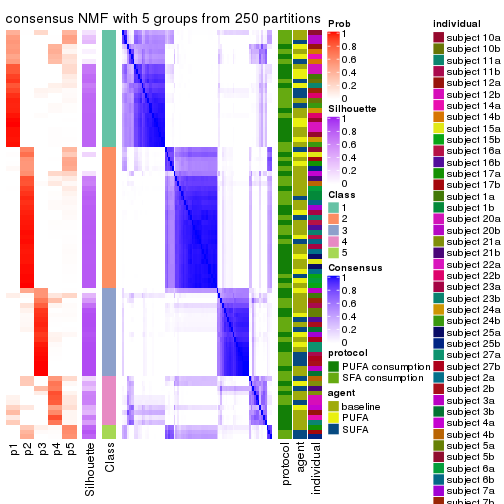</p>

</div>
<div id='tab-ATC-NMF-consensus-heatmap-5'>
<pre><code class="r">consensus_heatmap(res, k = 6)
</code></pre>

<p></p>

</div>
</div>

Heatmaps for the membership of samples in all partitions to see how consistent they are:


<script>
$( function() {
	$( '#tabs-ATC-NMF-membership-heatmap' ).tabs();
} );
</script>
<div id='tabs-ATC-NMF-membership-heatmap'>
<ul>
<li><a href='#tab-ATC-NMF-membership-heatmap-1'>k = 2</a></li>
<li><a href='#tab-ATC-NMF-membership-heatmap-2'>k = 3</a></li>
<li><a href='#tab-ATC-NMF-membership-heatmap-3'>k = 4</a></li>
<li><a href='#tab-ATC-NMF-membership-heatmap-4'>k = 5</a></li>
<li><a href='#tab-ATC-NMF-membership-heatmap-5'>k = 6</a></li>
</ul>
<div id='tab-ATC-NMF-membership-heatmap-1'>
<pre><code class="r">membership_heatmap(res, k = 2)
</code></pre>

<p></p>

</div>
<div id='tab-ATC-NMF-membership-heatmap-2'>
<pre><code class="r">membership_heatmap(res, k = 3)
</code></pre>

<p></p>

</div>
<div id='tab-ATC-NMF-membership-heatmap-3'>
<pre><code class="r">membership_heatmap(res, k = 4)
</code></pre>

<p></p>

</div>
<div id='tab-ATC-NMF-membership-heatmap-4'>
<pre><code class="r">membership_heatmap(res, k = 5)
</code></pre>

<p></p>

</div>
<div id='tab-ATC-NMF-membership-heatmap-5'>
<pre><code class="r">membership_heatmap(res, k = 6)
</code></pre>

<p></p>

</div>
</div>

As soon as we have had the classes for columns, we can look for signatures
which are significantly different between classes which can be candidate marks
for certain classes. Following are the heatmaps for signatures.


Signature heatmaps where rows are scaled:


<script>
$( function() {
	$( '#tabs-ATC-NMF-get-signatures' ).tabs();
} );
</script>
<div id='tabs-ATC-NMF-get-signatures'>
<ul>
<li><a href='#tab-ATC-NMF-get-signatures-1'>k = 2</a></li>
<li><a href='#tab-ATC-NMF-get-signatures-2'>k = 3</a></li>
<li><a href='#tab-ATC-NMF-get-signatures-3'>k = 4</a></li>
<li><a href='#tab-ATC-NMF-get-signatures-4'>k = 5</a></li>
<li><a href='#tab-ATC-NMF-get-signatures-5'>k = 6</a></li>
</ul>
<div id='tab-ATC-NMF-get-signatures-1'>
<pre><code class="r">get_signatures(res, k = 2)
</code></pre>

<p></p>

</div>
<div id='tab-ATC-NMF-get-signatures-2'>
<pre><code class="r">get_signatures(res, k = 3)
</code></pre>

<p></p>

</div>
<div id='tab-ATC-NMF-get-signatures-3'>
<pre><code class="r">get_signatures(res, k = 4)
</code></pre>

<p>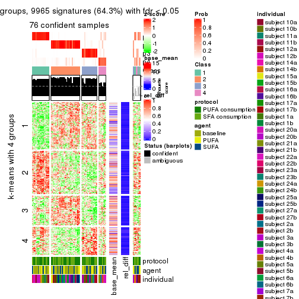</p>

</div>
<div id='tab-ATC-NMF-get-signatures-4'>
<pre><code class="r">get_signatures(res, k = 5)
</code></pre>

<p></p>

</div>
<div id='tab-ATC-NMF-get-signatures-5'>
<pre><code class="r">get_signatures(res, k = 6)
</code></pre>

<p></p>

</div>
</div>


Signature heatmaps where rows are not scaled:


<script>
$( function() {
	$( '#tabs-ATC-NMF-get-signatures-no-scale' ).tabs();
} );
</script>
<div id='tabs-ATC-NMF-get-signatures-no-scale'>
<ul>
<li><a href='#tab-ATC-NMF-get-signatures-no-scale-1'>k = 2</a></li>
<li><a href='#tab-ATC-NMF-get-signatures-no-scale-2'>k = 3</a></li>
<li><a href='#tab-ATC-NMF-get-signatures-no-scale-3'>k = 4</a></li>
<li><a href='#tab-ATC-NMF-get-signatures-no-scale-4'>k = 5</a></li>
<li><a href='#tab-ATC-NMF-get-signatures-no-scale-5'>k = 6</a></li>
</ul>
<div id='tab-ATC-NMF-get-signatures-no-scale-1'>
<pre><code class="r">get_signatures(res, k = 2, scale_rows = FALSE)
</code></pre>

<p></p>

</div>
<div id='tab-ATC-NMF-get-signatures-no-scale-2'>
<pre><code class="r">get_signatures(res, k = 3, scale_rows = FALSE)
</code></pre>

<p></p>

</div>
<div id='tab-ATC-NMF-get-signatures-no-scale-3'>
<pre><code class="r">get_signatures(res, k = 4, scale_rows = FALSE)
</code></pre>

<p></p>

</div>
<div id='tab-ATC-NMF-get-signatures-no-scale-4'>
<pre><code class="r">get_signatures(res, k = 5, scale_rows = FALSE)
</code></pre>

<p></p>

</div>
<div id='tab-ATC-NMF-get-signatures-no-scale-5'>
<pre><code class="r">get_signatures(res, k = 6, scale_rows = FALSE)
</code></pre>

<p></p>

</div>
</div>


Compare the overlap of signatures from different k:

```r
compare_signatures(res)
```


`get_signature()` returns a data frame invisibly. TO get the list of signatures, the function
call should be assigned to a variable explicitly. In following code, if `plot` argument is set
to `FALSE`, no heatmap is plotted while only the differential analysis is performed.

```r
# code only for demonstration
tb = get_signature(res, k = ..., plot = FALSE)
```

An example of the output of `tb` is:

```
#>   which_row         fdr    mean_1    mean_2 scaled_mean_1 scaled_mean_2 km
#> 1        38 0.042760348  8.373488  9.131774    -0.5533452     0.5164555  1
#> 2        40 0.018707592  7.106213  8.469186    -0.6173731     0.5762149  1
#> 3        55 0.019134737 10.221463 11.207825    -0.6159697     0.5749050  1
#> 4        59 0.006059896  5.921854  7.869574    -0.6899429     0.6439467  1
#> 5        60 0.018055526  8.928898 10.211722    -0.6204761     0.5791110  1
#> 6        98 0.009384629 15.714769 14.887706     0.6635654    -0.6193277  2
...
```

The columns in `tb` are:

1. `which_row`: row indices corresponding to the input matrix.
2. `fdr`: FDR for the differential test. 
3. `mean_x`: The mean value in group x.
4. `scaled_mean_x`: The mean value in group x after rows are scaled.
5. `km`: Row groups if k-means clustering is applied to rows.


UMAP plot which shows how samples are separated.


<script>
$( function() {
	$( '#tabs-ATC-NMF-dimension-reduction' ).tabs();
} );
</script>
<div id='tabs-ATC-NMF-dimension-reduction'>
<ul>
<li><a href='#tab-ATC-NMF-dimension-reduction-1'>k = 2</a></li>
<li><a href='#tab-ATC-NMF-dimension-reduction-2'>k = 3</a></li>
<li><a href='#tab-ATC-NMF-dimension-reduction-3'>k = 4</a></li>
<li><a href='#tab-ATC-NMF-dimension-reduction-4'>k = 5</a></li>
<li><a href='#tab-ATC-NMF-dimension-reduction-5'>k = 6</a></li>
</ul>
<div id='tab-ATC-NMF-dimension-reduction-1'>
<pre><code class="r">dimension_reduction(res, k = 2, method = &quot;UMAP&quot;)
</code></pre>

<p></p>

</div>
<div id='tab-ATC-NMF-dimension-reduction-2'>
<pre><code class="r">dimension_reduction(res, k = 3, method = &quot;UMAP&quot;)
</code></pre>

<p></p>

</div>
<div id='tab-ATC-NMF-dimension-reduction-3'>
<pre><code class="r">dimension_reduction(res, k = 4, method = &quot;UMAP&quot;)
</code></pre>

<p></p>

</div>
<div id='tab-ATC-NMF-dimension-reduction-4'>
<pre><code class="r">dimension_reduction(res, k = 5, method = &quot;UMAP&quot;)
</code></pre>

<p></p>

</div>
<div id='tab-ATC-NMF-dimension-reduction-5'>
<pre><code class="r">dimension_reduction(res, k = 6, method = &quot;UMAP&quot;)
</code></pre>

<p></p>

</div>
</div>


Following heatmap shows how subgroups are split when increasing `k`:

```r
collect_classes(res)
```


Test correlation between subgroups and known annotations. If the known
annotation is numeric, one-way ANOVA test is applied, and if the known
annotation is discrete, chi-squared contingency table test is applied.

```r
test_to_known_factors(res)
```

```
#>          n protocol(p) agent(p) individual(p) k
#> ATC:NMF 83       0.900    0.446      4.26e-03 2
#> ATC:NMF 82       0.904    0.778      4.41e-05 3
#> ATC:NMF 76       0.781    0.969      7.92e-06 4
#> ATC:NMF 63       0.756    0.523      6.56e-07 5
#> ATC:NMF 60       0.636    0.743      1.34e-05 6
```


If matrix rows can be associated to genes, consider to use `functional_enrichment(res,
...)` to perform function enrichment for the signature genes. See [this vignette](http://bioconductor.org/packages/devel/bioc/vignettes/cola/inst/doc/functional_enrichment.html) for more detailed explanations.


 

## Session info


```r
sessionInfo()
```

```
#> R version 3.6.0 (2019-04-26)
#> Platform: x86_64-pc-linux-gnu (64-bit)
#> Running under: CentOS Linux 7 (Core)
#> 
#> Matrix products: default
#> BLAS:   /usr/lib64/libblas.so.3.4.2
#> LAPACK: /usr/lib64/liblapack.so.3.4.2
#> 
#> locale:
#>  [1] LC_CTYPE=en_GB.UTF-8       LC_NUMERIC=C               LC_TIME=en_GB.UTF-8       
#>  [4] LC_COLLATE=en_GB.UTF-8     LC_MONETARY=en_GB.UTF-8    LC_MESSAGES=en_GB.UTF-8   
#>  [7] LC_PAPER=en_GB.UTF-8       LC_NAME=C                  LC_ADDRESS=C              
#> [10] LC_TELEPHONE=C             LC_MEASUREMENT=en_GB.UTF-8 LC_IDENTIFICATION=C       
#> 
#> attached base packages:
#> [1] grid      stats     graphics  grDevices utils     datasets  methods   base     
#> 
#> other attached packages:
#> [1] genefilter_1.66.0    ComplexHeatmap_2.3.1 markdown_1.1         knitr_1.26          
#> [5] GetoptLong_0.1.7     cola_1.3.2          
#> 
#> loaded via a namespace (and not attached):
#>  [1] circlize_0.4.8       shape_1.4.4          xfun_0.11            slam_0.1-46         
#>  [5] lattice_0.20-38      splines_3.6.0        colorspace_1.4-1     vctrs_0.2.0         
#>  [9] stats4_3.6.0         blob_1.2.0           XML_3.98-1.20        survival_2.44-1.1   
#> [13] rlang_0.4.2          pillar_1.4.2         DBI_1.0.0            BiocGenerics_0.30.0 
#> [17] bit64_0.9-7          RColorBrewer_1.1-2   matrixStats_0.55.0   stringr_1.4.0       
#> [21] GlobalOptions_0.1.1  evaluate_0.14        memoise_1.1.0        Biobase_2.44.0      
#> [25] IRanges_2.18.3       parallel_3.6.0       AnnotationDbi_1.46.1 highr_0.8           
#> [29] Rcpp_1.0.3           xtable_1.8-4         backports_1.1.5      S4Vectors_0.22.1    
#> [33] annotate_1.62.0      skmeans_0.2-11       bit_1.1-14           microbenchmark_1.4-7
#> [37] brew_1.0-6           impute_1.58.0        rjson_0.2.20         png_0.1-7           
#> [41] digest_0.6.23        stringi_1.4.3        polyclip_1.10-0      clue_0.3-57         
#> [45] tools_3.6.0          bitops_1.0-6         magrittr_1.5         eulerr_6.0.0        
#> [49] RCurl_1.95-4.12      RSQLite_2.1.4        tibble_2.1.3         cluster_2.1.0       
#> [53] crayon_1.3.4         pkgconfig_2.0.3      zeallot_0.1.0        Matrix_1.2-17       
#> [57] xml2_1.2.2           httr_1.4.1           R6_2.4.1             mclust_5.4.5        
#> [61] compiler_3.6.0
```


